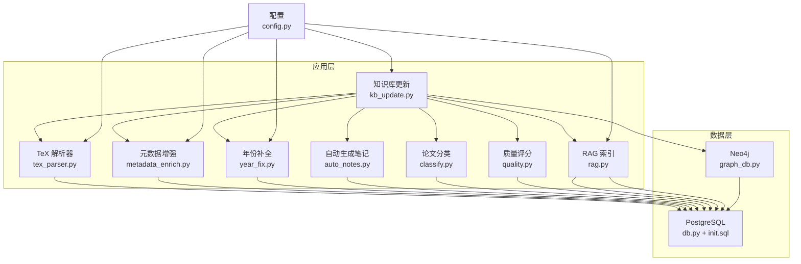
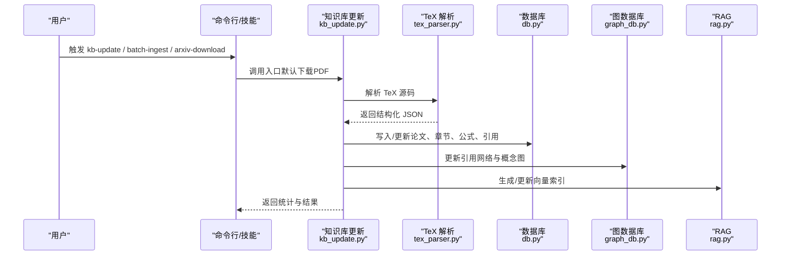
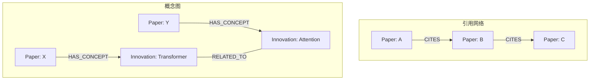
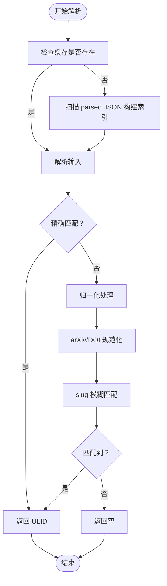
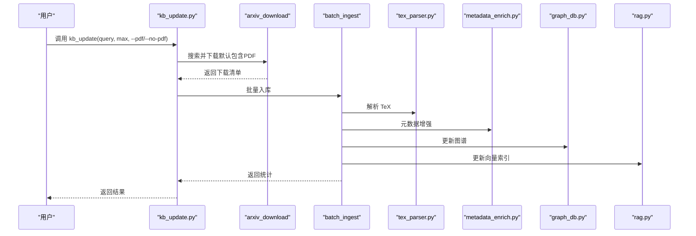
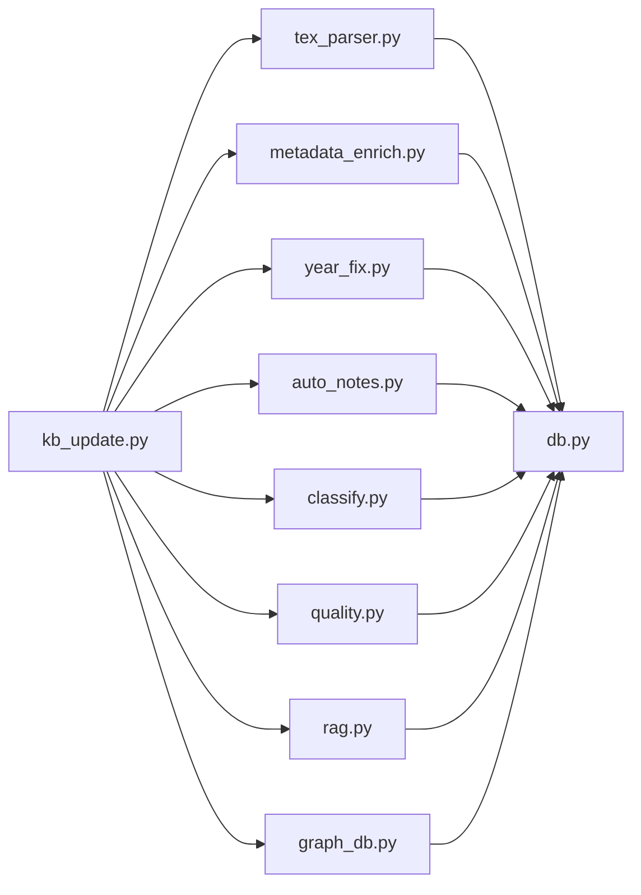

# 知识库管理系统

<cite>
**本文档引用的文件**
- [db.py](file://scholar/db.py)
- [graph_db.py](file://scholar/graph_db.py)
- [id_resolver.py](file://scholar/id_resolver.py)
- [kb_update.py](file://scholar/kb_update.py)
- [init.sql](file://infra/init.sql)
- [config.py](file://scholar/config.py)
- [tex_parser.py](file://scholar/tex_parser.py)
- [metadata_enrich.py](file://scholar/metadata_enrich.py)
- [year_fix.py](file://scholar/year_fix.py)
- [auto_notes.py](file://scholar/auto_notes.py)
- [rag.py](file://scholar/rag.py)
- [classify.py](file://scholar/classify.py)
- [quality.py](file://scholar/quality.py)
- [SKILL.md (知识库管理)](file://plugin/skills/kb-management/SKILL.md)
- [SKILL.md (论文入库)](file://plugin/skills/paper-ingestion/SKILL.md)
- [cli.py](file://scholar/cli.py)
</cite>

## 更新摘要
**所做变更**
- 更新了PDF下载默认行为的说明，现在默认启用PDF下载
- 新增了命令行参数使用说明，强调--no-pdf选项的作用
- 更新了知识库更新流程的相关描述

## 目录
1. [简介](#简介)
2. [项目结构](#项目结构)
3. [核心组件](#核心组件)
4. [架构总览](#架构总览)
5. [详细组件分析](#详细组件分析)
6. [依赖关系分析](#依赖关系分析)
7. [性能考虑](#性能考虑)
8. [故障排除指南](#故障排除指南)
9. [结论](#结论)
10. [附录](#附录)

## 简介
本系统是一个面向人工智能论文的知识库管理系统，提供从 arXiv 源码下载、TeX 解析、元数据补全、Neo4j 图谱构建、PostgreSQL 结构化存储、RAG 向量检索到自动化阅读笔记与质量评分的完整流水线。系统支持文件模式与数据库模式双通道运行，具备增量同步能力与可扩展的 ID 解析机制。

**更新** 现在默认启用PDF下载功能，用户可以通过--no-pdf显式禁用以节省存储空间。

## 项目结构
系统采用模块化分层设计：
- 数据层：PostgreSQL（结构化元数据、向量索引）+ Neo4j（引用网络与概念图）
- 应用层：解析器、元数据增强、图谱构建、RAG 索引、分类与质量评分
- 工具层：配置管理、命令行技能脚本、批处理与增量更新



**图表来源**
- [kb_update.py:1-447](file://scholar/kb_update.py#L1-L447)
- [tex_parser.py:1-800](file://scholar/tex_parser.py#L1-L800)
- [metadata_enrich.py:1-217](file://scholar/metadata_enrich.py#L1-L217)
- [year_fix.py:1-420](file://scholar/year_fix.py#L1-L420)
- [auto_notes.py:1-355](file://scholar/auto_notes.py#L1-L355)
- [classify.py:1-328](file://scholar/classify.py#L1-L328)
- [quality.py:1-432](file://scholar/quality.py#L1-L432)
- [rag.py:1-582](file://scholar/rag.py#L1-L582)
- [db.py:1-276](file://scholar/db.py#L1-L276)
- [graph_db.py:1-922](file://scholar/graph_db.py#L1-L922)
- [init.sql:1-131](file://infra/init.sql#L1-L131)
- [config.py:1-116](file://scholar/config.py#L1-L116)

**章节来源**
- [config.py:1-116](file://scholar/config.py#L1-L116)
- [SKILL.md (知识库管理):1-59](file://plugin/skills/kb-management/SKILL.md#L1-L59)
- [SKILL.md (论文入库):1-85](file://plugin/skills/paper-ingestion/SKILL.md#L1-L85)

## 核心组件
- 数据库接口（PostgreSQL）：提供 UPSERT、批量替换、全文检索、统计查询与文件回退模式
- 图数据库接口（Neo4j）：构建引用网络与概念图，支持中心性计算与桥接论文识别
- ID 解析器：统一多格式 ID（ULID/arXiv/DOI/slug）解析，带内存缓存与模糊匹配
- 知识库更新：一键下载、解析、增强、图谱与索引同步的完整流程，**默认包含PDF下载**
- RAG 系统：分块、嵌入、向量存储与混合检索（向量+BM25+RRF）
- 元数据增强与补全：arXiv API 查询、Lean4 交叉引用、作者/年份补全
- 自动笔记与质量评分：结构化阅读笔记与七维质量评估
- 分类体系：多层级领域/子方向/方法标签

**章节来源**
- [db.py:24-276](file://scholar/db.py#L24-L276)
- [graph_db.py:32-922](file://scholar/graph_db.py#L32-L922)
- [id_resolver.py:15-107](file://scholar/id_resolver.py#L15-L107)
- [kb_update.py:18-447](file://scholar/kb_update.py#L18-L447)
- [rag.py:25-582](file://scholar/rag.py#L25-L582)
- [metadata_enrich.py:112-217](file://scholar/metadata_enrich.py#L112-L217)
- [year_fix.py:165-420](file://scholar/year_fix.py#L165-L420)
- [auto_notes.py:28-355](file://scholar/auto_notes.py#L28-L355)
- [quality.py:317-432](file://scholar/quality.py#L317-L432)
- [classify.py:161-328](file://scholar/classify.py#L161-L328)

## 架构总览
系统采用"解析-增强-入库-图谱-索引"的端到端流水线，支持数据库与文件两种运行模式，数据库模式下实现结构化存储、向量检索与图谱分析；文件模式下作为纯离线工具使用。



**图表来源**
- [kb_update.py:415-447](file://scholar/kb_update.py#L415-L447)
- [tex_parser.py:214-285](file://scholar/tex_parser.py#L214-L285)
- [db.py:79-176](file://scholar/db.py#L79-L176)
- [graph_db.py:225-281](file://scholar/graph_db.py#L225-L281)
- [rag.py:471-582](file://scholar/rag.py#L471-L582)

## 详细组件分析

### PostgreSQL 数据库设计
- 表结构与字段
  - papers：核心元数据（标题、作者、年份、会议、摘要、arXiv/DOI、TeX 存在标志、解析状态、计数字段、读取状态、时间戳）
  - sections/formulas/citations：论文结构化内容、公式与引用关系
  - concepts/paper_concepts：概念实体与论文-概念关联
  - chunks：RAG 向量索引（pgvector）
  - innovations/replacements：Lean4 同步的创新体与替换关系
- 索引策略
  - 主键与外键约束保证参照完整性
  - sections/papers 关联删除级联
  - citations 上建立 from/to 索引，支持引用解析与统计
  - chunks 上建立 HNSW 近似最近邻索引（余弦距离）
- 关系约束
  - citations.to_paper 为可空，用于引用解析后的规范化
  - paper_concepts 复合主键避免重复关联
  - innovations.id 为主键，replacements.from/to 唯一约束防止重复关系

```mermaid
erDiagram
PAPERS {
text id PK
text title
text[] authors
int year
text venue
text abstract
text arxiv_id
text doi
boolean has_tex
boolean parsed_ok
text parsed_path
int section_count
int formula_count
int citation_count
text read_status
timestamptz created_at
timestamptz updated_at
}
SECTIONS {
serial id PK
text paper_id FK
text heading
int level
text content
int position
timestamptz created_at
}
FORMULAS {
serial id PK
text paper_id FK
text latex
text label
text env_type
text context
boolean lean_verified
timestamptz created_at
}
CITATIONS {
serial id PK
text from_paper FK
text to_ref
text to_paper
boolean resolved
timestamptz created_at
}
CONCEPTS {
serial id PK
text name UK
text definition
timestamptz created_at
}
PAPER_CONCEPTS {
text paper_id FK
int concept_id FK
float relevance
primary key (paper_id, concept_id)
}
CHUNKS {
serial id PK
text paper_id FK
int section_id FK
text section
text content
vector embedding
timestamptz created_at
}
INNOVATIONS {
text id PK
text line
boolean core
int year
int scalability
int simplicity
int stability
timestamptz created_at
}
REPLACEMENTS {
serial id PK
text from_innov FK
text to_innov FK
timestamptz created_at
}
PAPERS ||--o{ SECTIONS : "包含"
PAPERS ||--o{ FORMULAS : "包含"
PAPERS ||--o{ CITATIONS : "引用"
PAPERS }o--|| PAPER_CONCEPTS : "关联"
CONCEPTS ||--o{ PAPER_CONCEPTS : "被关联"
SECTIONS ||--o{ CHUNKS : "产生"
PAPERS ||--o{ CHUNKS : "产生"
INNOVATIONS ||--o{ REPLACEMENTS : "被替换"
```

**图表来源**
- [init.sql:9-131](file://infra/init.sql#L9-L131)
- [db.py:79-176](file://scholar/db.py#L79-L176)

**章节来源**
- [init.sql:1-131](file://infra/init.sql#L1-L131)
- [db.py:24-276](file://scholar/db.py#L24-L276)

### Neo4j 图数据库模式
- 节点类型
  - Paper：论文节点（ulid/title/year/venue/formula_count/citation_count）
  - Innovation：创新节点（id/line/year/scalability/simplicity/stability）
- 边关系
  - CITES：论文引用边（ref_key/被解析标记）
  - HAS_CONCEPT：论文-概念边
  - RELATED_TO：概念共现边（权重）
  - REPLACES：创新替换边（Lean4 同步）
- 图谱构建流程
  - 引用网络：MERGE 论文节点，MERGE CITES 边
  - 概念图：从 Lean4 动态加载创新体，基于 TF-IDF 匹配论文与概念，构建共现关系
  - 中心性与桥接分析：计算入度/出度/桥接分数，识别跨领域连接点



**图表来源**
- [graph_db.py:225-281](file://scholar/graph_db.py#L225-L281)
- [graph_db.py:636-732](file://scholar/graph_db.py#L636-L732)

**章节来源**
- [graph_db.py:32-922](file://scholar/graph_db.py#L32-L922)

### ID 解析器工作机制
- 跨数据库标识符映射
  - 支持 ULID、arXiv ID、DOI、slug 多格式输入
  - 内存缓存首次扫描 parsed JSON 构建索引，加速解析
- 重复检测与合并策略
  - 精确匹配优先（ULID/arXiv/DOI/slug）
  - 归一化处理（arXiv 版本号去除、DOI URL 规范化）
  - slug 模糊匹配（仅对形如关键词连字符的键进行匹配）
- 性能与一致性
  - 首次加载后缓存，避免重复 IO
  - 刷新机制支持增量更新后的重新索引



**图表来源**
- [id_resolver.py:22-86](file://scholar/id_resolver.py#L22-L86)

**章节来源**
- [id_resolver.py:15-107](file://scholar/id_resolver.py#L15-L107)

### 知识库更新流程与增量同步
- 一键更新（kb-update）
  - **默认下载PDF**：arXiv 搜索 → 下载 TeX 源码 → 去重 → 解析 → 元数据增强 → 图谱更新 → RAG 索引 → 自动生成笔记/质量评分/分类
  - 用户可通过 --no-pdf 参数禁用PDF下载以节省存储空间
- 批量入库（batch-ingest）
  - 自动发现未解析论文 → 解析 → 写入数据库/文件 → 图谱与索引增量更新
- 增量同步策略
  - 仅处理新增/变更的论文目录
  - 重置 ID 解析器缓存，确保新 ID 可见
  - RAG 单篇重索引：先删除旧块，再插入新块



**图表来源**
- [kb_update.py:415-447](file://scholar/kb_update.py#L415-L447)
- [kb_update.py:199-413](file://scholar/kb_update.py#L199-L413)

**章节来源**
- [kb_update.py:18-447](file://scholar/kb_update.py#L18-L447)
- [SKILL.md (知识库管理):18-50](file://plugin/skills/kb-management/SKILL.md#L18-L50)
- [SKILL.md (论文入库):17-74](file://plugin/skills/paper-ingestion/SKILL.md#L17-L74)

### 数据一致性保证
- 数据库事务
  - 每个数据库操作在上下文中提交或回滚，避免部分写入
- 引用解析与规范化
  - citations.to_ref 保留原始键，解析后写入 to_paper 并设置 resolved 标记
  - 重映射后删除孤立引用节点，保持图谱整洁
- 版本与演进
  - innovations 与 replacements 通过 Lean4 文件动态同步，确保研究演进链路一致

**章节来源**
- [db.py:62-74](file://scholar/db.py#L62-L74)
- [graph_db.py:85-178](file://scholar/graph_db.py#L85-L178)
- [graph_db.py:794-850](file://scholar/graph_db.py#L794-L850)

## 依赖关系分析
- 组件耦合
  - kb_update 作为编排器，依赖解析、增强、图谱、RAG、分类、质量等模块
  - db/graph_db 作为共享数据源，被多个模块读写
- 外部依赖
  - PostgreSQL + pgvector、Neo4j、arXiv API、智谱/OPENAI Embedding API
- 循环依赖
  - 无直接循环；模块间通过接口与配置解耦



**图表来源**
- [kb_update.py:199-447](file://scholar/kb_update.py#L199-L447)
- [db.py:24-276](file://scholar/db.py#L24-L276)
- [graph_db.py:32-922](file://scholar/graph_db.py#L32-L922)

**章节来源**
- [kb_update.py:199-447](file://scholar/kb_update.py#L199-L447)
- [db.py:24-276](file://scholar/db.py#L24-L276)
- [graph_db.py:32-922](file://scholar/graph_db.py#L32-L922)

## 性能考虑
- 数据库性能
  - HNSW 向量索引（余弦距离）提升相似检索效率
  - 引用边与论文节点的批量写入减少往返开销
  - ON CONFLICT DO UPDATE 降低重复写入成本
- 解析与索引
  - 批量嵌入与进度条显示，控制 API 速率
  - 分块大小与段落切分平衡语义完整性与向量维度
- 缓存与懒加载
  - ID 解析器内存缓存显著降低重复查询
  - BM25 索引按需构建，避免冷启动开销
- **存储优化**
  - **默认启用PDF下载**：提供完整的论文集合，便于深度分析和引用验证
  - 使用 --no-pdf 可禁用PDF下载以节省磁盘空间

## 故障排除指南
- 数据库不可用
  - 现象：数据库接口返回不可用
  - 处理：系统自动切换至文件模式，解析结果保存为 JSON
- Neo4j 连接失败
  - 现象：图谱构建/查询报错
  - 处理：检查 URI/认证配置，确认容器服务运行
- arXiv API 限流
  - 现象：请求失败或延迟
  - 处理：调整重试次数与超时，遵守速率限制
- 解析失败
  - 现象：TeX 源码格式异常
  - 处理：检查主文件、输入文件链与宏定义，必要时手动修复
- RAG 嵌入失败
  - 现象：嵌入为空或索引未创建
  - 处理：检查 API Key 与模型配置，确认 HNSW 创建成功
- **存储空间不足**
  - 现象：磁盘空间不足
  - 处理：使用 --no-pdf 参数禁用PDF下载，或清理旧论文数据

**章节来源**
- [db.py:31-44](file://scholar/db.py#L31-L44)
- [graph_db.py:39-49](file://scholar/graph_db.py#L39-L49)
- [config.py:69-116](file://scholar/config.py#L69-L116)
- [rag.py:214-238](file://scholar/rag.py#L214-L238)

## 结论
该知识库管理系统通过清晰的模块划分与稳健的数据流设计，实现了从论文采集到结构化存储、图谱分析与语义检索的全链路自动化。其跨数据库标识符解析、增量同步与一致性保障机制，使得系统在复杂异构数据环境下仍能保持高可靠性和可扩展性。

**更新** 现在默认启用PDF下载功能，为用户提供更完整的论文集合体验，同时保留--no-pdf选项以满足存储空间优化需求。

## 附录
- 配置项概览
  - PostgreSQL：主机、端口、数据库名、用户、密码
  - Neo4j：URI、用户、密码
  - RAG：提供商、模型、维度、API Key
  - LaTeX 编译器与 Lean4 项目路径
- 常用命令
  - 知识库维护：stats、scan、kb-update、metadata-enrich、year-fix、graph-build、rag-index
  - 论文入库：scan、parse-all、year-fix、author-fix、auto-notes、quality-score、classify
  - **PDF下载控制**：使用 --pdf/--no-pdf 选项控制是否下载PDF文件，默认为 --pdf

**章节来源**
- [config.py:41-63](file://scholar/config.py#L41-L63)
- [SKILL.md (知识库管理):11-50](file://plugin/skills/kb-management/SKILL.md#L11-L50)
- [SKILL.md (论文入库):11-74](file://plugin/skills/paper-ingestion/SKILL.md#L11-L74)
- [cli.py:1637-1700](file://scholar/cli.py#L1637-L1700)