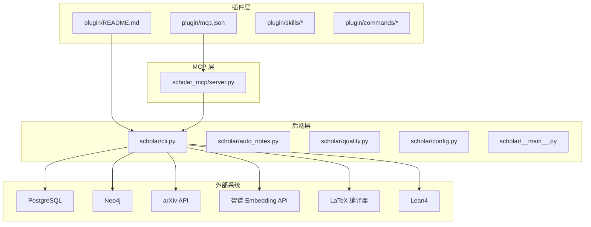
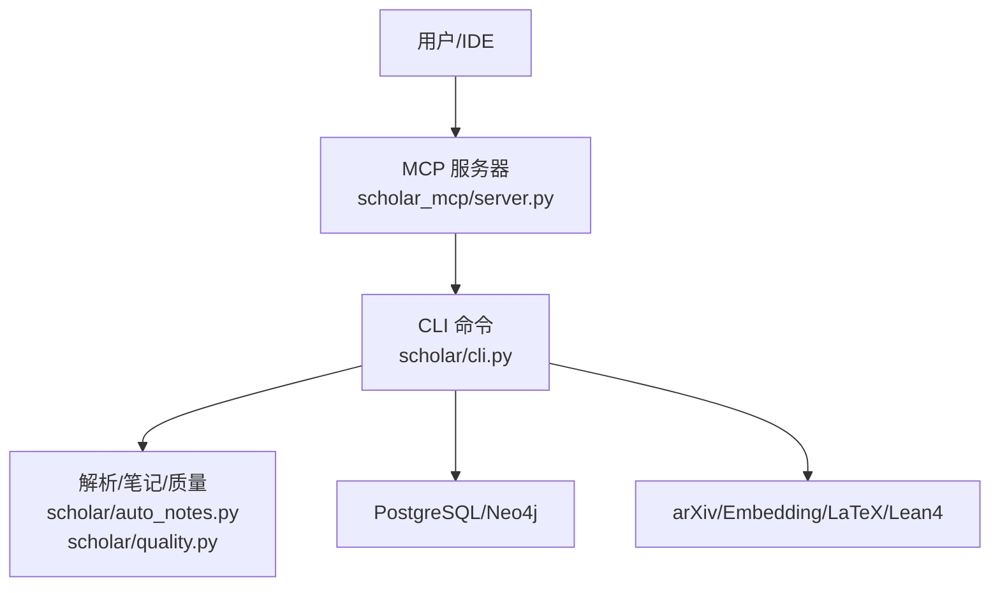
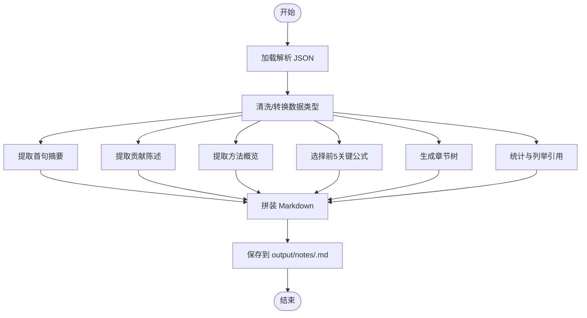
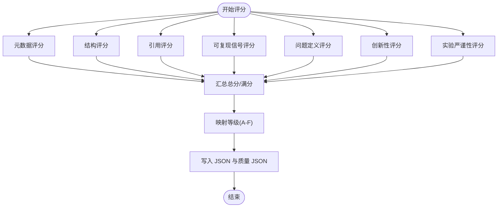
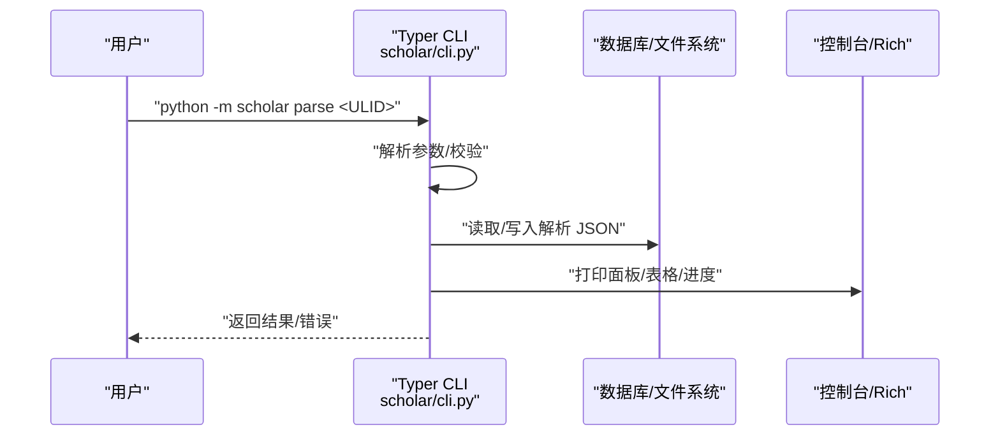
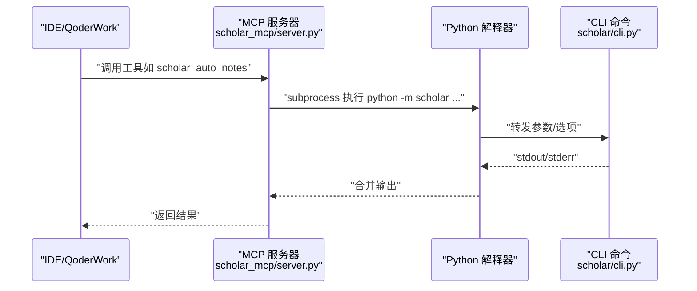
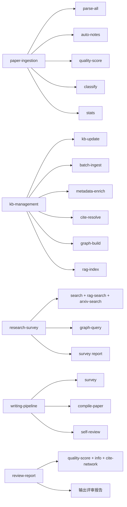
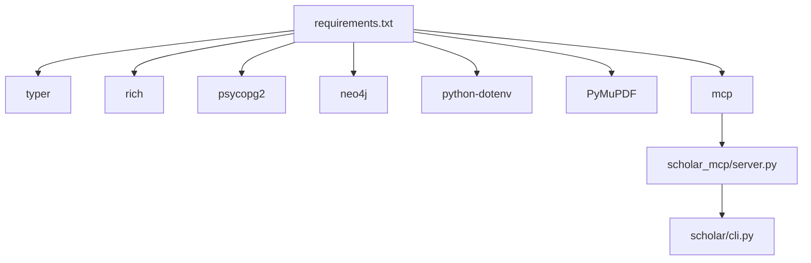

# 研究技能集成

<cite>
**本文档引用的文件**
- [plugin/README.md](file://plugin/README.md)
- [plugin/CONNECTORS.md](file://plugin/CONNECTORS.md)
- [plugin/mcp.json](file://plugin/mcp.json)
- [plugin/commands/stats.md](file://plugin/commands/stats.md)
- [plugin/commands/paper.md](file://plugin/commands/paper.md)
- [plugin/skills/paper-ingestion/SKILL.md](file://plugin/skills/paper-ingestion/SKILL.md)
- [plugin/skills/kb-management/SKILL.md](file://plugin/skills/kb-management/SKILL.md)
- [plugin/skills/writing-pipeline/SKILL.md](file://plugin/skills/writing-pipeline/SKILL.md)
- [plugin/skills/research-survey/SKILL.md](file://plugin/skills/research-survey/SKILL.md)
- [plugin/skills/review-report/SKILL.md](file://plugin/skills/review-report/SKILL.md)
- [scholar/__main__.py](file://scholar/__main__.py)
- [scholar/cli.py](file://scholar/cli.py)
- [scholar/auto_notes.py](file://scholar/auto_notes.py)
- [scholar/quality.py](file://scholar/quality.py)
- [scholar/config.py](file://scholar/config.py)
- [scholar_mcp/server.py](file://scholar_mcp/server.py)
- [requirements.txt](file://requirements.txt)
</cite>

## 目录
1. [简介](#简介)
2. [项目结构](#项目结构)
3. [核心组件](#核心组件)
4. [架构总览](#架构总览)
5. [详细组件分析](#详细组件分析)
6. [依赖分析](#依赖分析)
7. [性能考虑](#性能考虑)
8. [故障排查指南](#故障排查指南)
9. [结论](#结论)
10. [附录](#附录)

## 简介
本项目是一个面向学术研究的“技能集成系统”，围绕论文解析、知识库构建、自动化笔记生成、质量评估、引用网络分析、RAG 检索、以及端到端写作流水线，提供 CLI 与 MCP 服务器两种入口，支持与外部系统（PostgreSQL、Neo4j、arXiv、智谱 Embedding API、LaTeX 编译环境、Lean4 形式化）无缝集成。系统通过 14 个 Skills、4 个 Commands、规则与钩子，以及 41 个 MCP 工具，形成可组合、可扩展的研究工作流。

## 项目结构
- plugin：插件与技能说明，包含 Skills、Commands、Rules、Hooks、MCP 配置
- scholar：Python 后端 CLI 与核心模块（解析、笔记、质量、图谱、RAG、编译、实验等）
- scholar_mcp：MCP 服务器，将 CLI 封装为 MCP 工具
- infra：容器编排与初始化脚本（Docker Compose）
- data/papers：原始论文数据目录
- output：解析产物、笔记、草稿、实验、PDF 等输出目录

**图表来源**
- [plugin/README.md:1-79](file://plugin/README.md#L1-L79)
- [plugin/mcp.json:1-16](file://plugin/mcp.json#L1-L16)
- [scholar/cli.py:1-800](file://scholar/cli.py#L1-L800)
- [scholar_mcp/server.py:1-573](file://scholar_mcp/server.py#L1-L573)

**章节来源**
- [plugin/README.md:1-79](file://plugin/README.md#L1-L79)
- [plugin/CONNECTORS.md:1-45](file://plugin/CONNECTORS.md#L1-L45)
- [plugin/mcp.json:1-16](file://plugin/mcp.json#L1-L16)
- [scholar/config.py:1-116](file://scholar/config.py#L1-L116)

## 核心组件
- CLI 命令系统：提供扫描、解析、搜索、统计、图谱构建、RAG、arXiv 搜索、作者/年份补全、批量预处理、编译、实验等命令，支持富文本输出与进度反馈
- 自动笔记生成：从解析后的 JSON 中抽取摘要、贡献、方法概览、关键公式、章节树、引用摘要，输出结构化 Markdown
- 质量评估体系：7 维评分（元数据、结构、引用密度、可复现信号、问题定义、创新性、实验严谨性），输出总分与等级
- MCP 服务器：将 CLI 封装为 41 个 MCP 工具，供 IDE/QoderWork 使用
- 技能与工作流：以 Skills/Commands 为入口，串联多命令形成端到端研究流程（如调研、写作、复现、审稿）

**章节来源**
- [scholar/cli.py:1-800](file://scholar/cli.py#L1-L800)
- [scholar/auto_notes.py:1-355](file://scholar/auto_notes.py#L1-L355)
- [scholar/quality.py:1-432](file://scholar/quality.py#L1-L432)
- [scholar_mcp/server.py:1-573](file://scholar_mcp/server.py#L1-L573)

## 架构总览
系统采用“插件驱动 + 后端 CLI + MCP 服务器”的三层架构：
- 插件层：定义技能、命令、规则与钩子，提供用户交互入口
- 后端层：CLI 与核心模块负责数据处理、解析、评估、检索、编译等
- MCP 层：将 CLI 命令封装为 MCP 工具，暴露给 IDE/QoderWork
- 外部系统：数据库、图数据库、arXiv、Embedding API、LaTeX、Lean4

**图表来源**
- [scholar_mcp/server.py:1-573](file://scholar_mcp/server.py#L1-L573)
- [scholar/cli.py:1-800](file://scholar/cli.py#L1-L800)
- [plugin/CONNECTORS.md:1-45](file://plugin/CONNECTORS.md#L1-L45)

## 详细组件分析

### 自动笔记生成（Auto Notes）
- 输入：解析后的 JSON（paper_id、title、authors、year、venue、abstract、sections、formulas、citations）
- 输出：结构化 Markdown 笔记，包含摘要、核心贡献、方法概览、关键公式、章节树、引用摘要
- 特性：健壮的数据类型处理（兼容字符串表示的列表）、公式重要性排序、批量与单篇生成、覆盖边界情况

**图表来源**
- [scholar/auto_notes.py:28-160](file://scholar/auto_notes.py#L28-L160)
- [scholar/auto_notes.py:252-276](file://scholar/auto_notes.py#L252-L276)
- [scholar/auto_notes.py:282-327](file://scholar/auto_notes.py#L282-L327)

**章节来源**
- [scholar/auto_notes.py:1-355](file://scholar/auto_notes.py#L1-L355)

### 质量评估体系（Quality Scoring）
- 7 维评分维度：元数据完整性、结构质量、引用密度、可复现信号、问题定义清晰度、创新性、实验严谨性
- 输出：每维分数与详情、总分、满分、等级（A-F），并写入 JSON 与独立质量 JSON
- 批处理：遍历解析目录，批量评分并统计等级分布

**图表来源**
- [scholar/quality.py:317-356](file://scholar/quality.py#L317-L356)
- [scholar/quality.py:363-402](file://scholar/quality.py#L363-L402)

**章节来源**
- [scholar/quality.py:1-432](file://scholar/quality.py#L1-L432)

### CLI 命令行接口设计
- 命令注册：基于 Typer，提供 scan、parse、parse-all、info、search、list-papers、stats、export-bib、author-fix、arxiv-search、graph-build、graph-stats、graph-query、bootstrap、ingest、survey、landscape、compile-paper、exp-run、exp-compare、exp-setup、dataset-download 等
- 参数解析：统一使用 Typer 的 Option/Argument，支持 limit、year、apply、force、hybrid 等选项
- 输出格式控制：Rich 控制台输出，支持表格、面板、进度条、富文本样式
- 错误处理：捕获异常并返回友好的错误信息，必要时退出进程

**图表来源**
- [scholar/cli.py:46-171](file://scholar/cli.py#L46-L171)
- [scholar/cli.py:176-237](file://scholar/cli.py#L176-L237)

**章节来源**
- [scholar/cli.py:1-800](file://scholar/cli.py#L1-L800)

### MCP 服务器与外部系统集成
- MCP 工具：将 CLI 命令封装为 MCP 工具，统一调用 scholar CLI，支持超时、错误合并输出
- 外部系统：PostgreSQL/Neo4j（知识库与图谱）、arXiv API（搜索与下载）、智谱 Embedding API（RAG）、LaTeX 编译器、Lean4
- 插件配置：mcp.json 指定 MCP 服务器命令与环境变量

**图表来源**
- [scholar_mcp/server.py:23-36](file://scholar_mcp/server.py#L23-L36)
- [scholar_mcp/server.py:231-244](file://scholar_mcp/server.py#L231-L244)
- [plugin/mcp.json:1-16](file://plugin/mcp.json#L1-L16)

**章节来源**
- [scholar_mcp/server.py:1-573](file://scholar_mcp/server.py#L1-L573)
- [plugin/mcp.json:1-16](file://plugin/mcp.json#L1-L16)
- [plugin/CONNECTORS.md:1-45](file://plugin/CONNECTORS.md#L1-L45)

### 技能与工作流（Skills/Commands）
- paper-ingestion：论文扫描、批量解析、失败诊断、元数据补全、批量预处理、统计检查、增量入库
- kb-management：知识库健康检查、自动更新（kb-update）、元数据回填、引用解析、图谱同步、RAG 索引同步
- research-survey：本地搜索 + arXiv 外部搜索 + 概念图谱 + 报告生成
- writing-pipeline：调研 → 撰写 → 编译 → 自审
- review-report：结构化同行评审报告撰写与输出

**图表来源**
- [plugin/skills/paper-ingestion/SKILL.md:1-85](file://plugin/skills/paper-ingestion/SKILL.md#L1-L85)
- [plugin/skills/kb-management/SKILL.md:1-59](file://plugin/skills/kb-management/SKILL.md#L1-L59)
- [plugin/skills/research-survey/SKILL.md:1-91](file://plugin/skills/research-survey/SKILL.md#L1-L91)
- [plugin/skills/writing-pipeline/SKILL.md:1-61](file://plugin/skills/writing-pipeline/SKILL.md#L1-L61)
- [plugin/skills/review-report/SKILL.md:1-116](file://plugin/skills/review-report/SKILL.md#L1-L116)

**章节来源**
- [plugin/skills/paper-ingestion/SKILL.md:1-85](file://plugin/skills/paper-ingestion/SKILL.md#L1-L85)
- [plugin/skills/kb-management/SKILL.md:1-59](file://plugin/skills/kb-management/SKILL.md#L1-L59)
- [plugin/skills/research-survey/SKILL.md:1-91](file://plugin/skills/research-survey/SKILL.md#L1-L91)
- [plugin/skills/writing-pipeline/SKILL.md:1-61](file://plugin/skills/writing-pipeline/SKILL.md#L1-L61)
- [plugin/skills/review-report/SKILL.md:1-116](file://plugin/skills/review-report/SKILL.md#L1-L116)

## 依赖分析
- Python 依赖：typer、rich、psycopg2、neo4j、python-dotenv、PyMuPDF、mcp
- 外部服务：PostgreSQL、Neo4j、arXiv、Embedding API、LaTeX、Lean4
- 插件与 MCP：通过 mcp.json 注册 MCP 服务器，IDE/QoderWork 可直接调用

**图表来源**
- [requirements.txt:1-9](file://requirements.txt#L1-L9)
- [scholar_mcp/server.py:12-20](file://scholar_mcp/server.py#L12-L20)

**章节来源**
- [requirements.txt:1-9](file://requirements.txt#L1-L9)
- [plugin/CONNECTORS.md:1-45](file://plugin/CONNECTORS.md#L1-L45)

## 性能考虑
- 批处理与进度：parse-all 使用 Rich 进度条，避免阻塞与卡顿
- 数据清洗与健壮性：自动笔记与质量评分对字符串表示的列表进行安全解析，减少异常
- 外部请求重试与代理：arXiv 请求具备重试与代理支持，提升稳定性
- 资源隔离：MCP 工具设置超时，避免长时间阻塞
- 可选组件：Neo4j、Embedding API 可按需启用，降低初始部署成本

## 故障排查指南
- arXiv 请求失败：检查代理与超时配置，确认网络可达
- 数据库不可用：确认 PostgreSQL/Neo4j 地址与凭据，或切换至文件模式
- LaTeX 编译错误：使用 compile-paper 的自动修复模式，查看编译日志
- MCP 工具无响应：检查 mcp.json 中的命令与环境变量，确认 Python 解释器路径
- 依赖缺失：安装 requirements.txt 中的依赖，确保 IDE/QoderWork 可访问 MCP 服务器

**章节来源**
- [scholar/config.py:69-115](file://scholar/config.py#L69-L115)
- [scholar_mcp/server.py:23-36](file://scholar_mcp/server.py#L23-L36)
- [plugin/CONNECTORS.md:1-45](file://plugin/CONNECTORS.md#L1-L45)

## 结论
本研究技能集成系统通过 CLI 与 MCP 服务器统一调度，结合自动笔记与质量评估，形成从论文入库、知识库维护、调研分析到写作编译的完整闭环。其模块化设计与可选外部系统集成，既满足个人研究的轻量需求，也为团队协作与自动化工作流提供了坚实基础。

## 附录

### 常用命令速览
- 查看论文库状态：python -m scholar stats
- 扫描解析状态：python -m scholar scan
- 批量解析：python -m scholar parse-all
- 生成自动笔记：python -m scholar auto-notes
- 质量评分：python -m scholar quality-score
- arXiv 搜索：python -m scholar arxiv-search
- 构建图谱：python -m scholar graph-build
- 编译论文：python -m scholar compile-paper

**章节来源**
- [plugin/commands/stats.md:1-7](file://plugin/commands/stats.md#L1-L7)
- [plugin/commands/paper.md:1-11](file://plugin/commands/paper.md#L1-L11)
- [plugin/skills/paper-ingestion/SKILL.md:1-85](file://plugin/skills/paper-ingestion/SKILL.md#L1-L85)
- [plugin/skills/research-survey/SKILL.md:1-91](file://plugin/skills/research-survey/SKILL.md#L1-L91)
- [plugin/skills/writing-pipeline/SKILL.md:1-61](file://plugin/skills/writing-pipeline/SKILL.md#L1-L61)