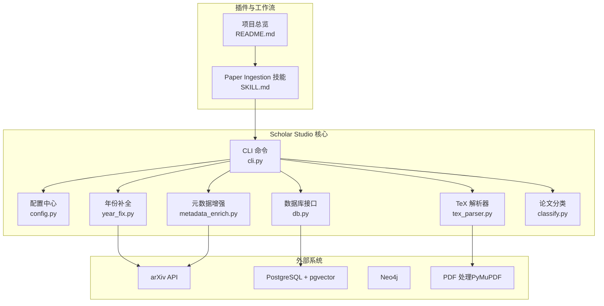
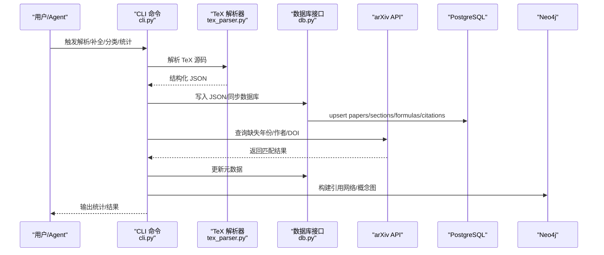
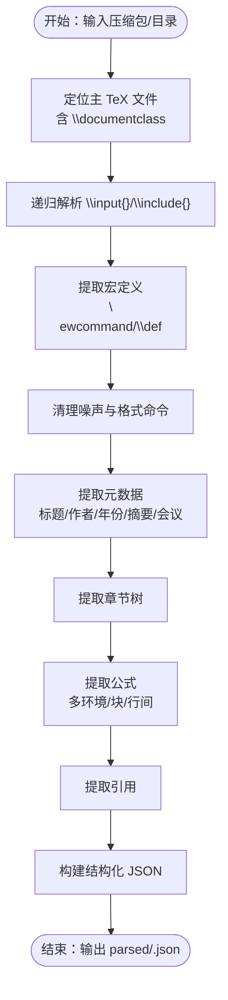
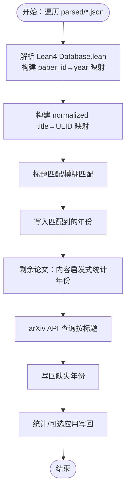
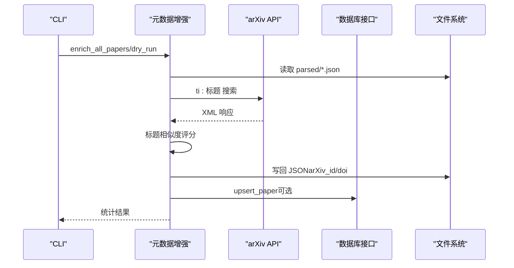
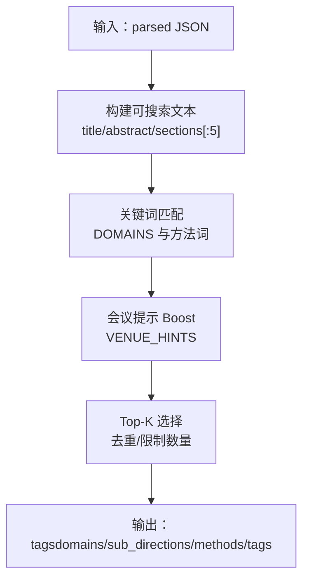
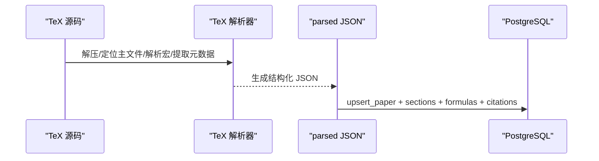
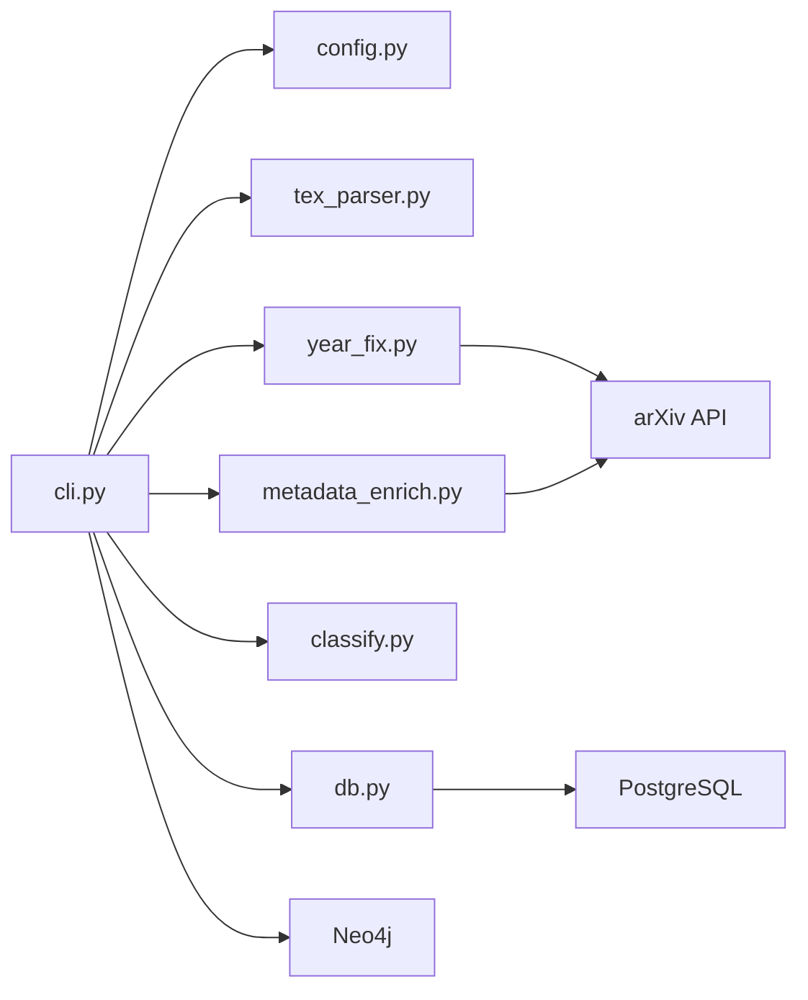

# 论文处理流水线

<cite>
**本文档引用的文件**
- [tex_parser.py](file://scholar/tex_parser.py)
- [year_fix.py](file://scholar/year_fix.py)
- [classify.py](file://scholar/classify.py)
- [metadata_enrich.py](file://scholar/metadata_enrich.py)
- [cli.py](file://scholar/cli.py)
- [config.py](file://scholar/config.py)
- [db.py](file://scholar/db.py)
- [SKILL.md](file://plugin/skills/paper-ingestion/README.md)
- [README.md](file://README.md)
- [requirements.txt](file://requirements.txt)
</cite>

## 目录
1. [简介](#简介)
2. [项目结构](#项目结构)
3. [核心组件](#核心组件)
4. [架构总览](#架构总览)
5. [详细组件分析](#详细组件分析)
6. [依赖分析](#依赖分析)
7. [性能考虑](#性能考虑)
8. [故障排除指南](#故障排除指南)
9. [结论](#结论)
10. [附录](#附录)

## 简介
本文件面向“论文处理流水线”的实现与使用，聚焦于从原始 TeX 源码到结构化论文数据的完整转换链路。内容涵盖：
- TeX 源码解析：LaTeX 宏包处理、公式提取、图表识别、章节与引用解析
- 年份修正算法：交叉引用 Lean4 数据库、arXiv API 推断与启发式规则
- 元数据补全机制：arXiv ID/DOI 填充、作者列表补全
- 论文分类系统：多级标签体系与关键词匹配
- 数据转换流程：从 TeX 到 JSON，再到数据库与图谱的全过程
- 错误处理策略、性能优化技巧与批量处理能力
- 使用示例与故障排除指南

## 项目结构
项目采用模块化组织，核心围绕 scholar/ 目录下的 Python 包展开，配合插件系统与 MCP 服务桥接 Qoder IDE 使用。

**图表来源**
- [cli.py](file://scholar/cli.py)
- [config.py](file://scholar/config.py)
- [db.py](file://scholar/db.py)
- [tex_parser.py](file://scholar/tex_parser.py)
- [year_fix.py](file://scholar/year_fix.py)
- [metadata_enrich.py](file://scholar/metadata_enrich.py)
- [classify.py](file://scholar/classify.py)
- [SKILL.md](file://plugin/skills/paper-ingestion/README.md)
- [README.md](file://README.md)

**章节来源**
- [README.md](file://README.md)
- [requirements.txt](file://requirements.txt)

## 核心组件
- TeX 解析器：负责从压缩包或目录中定位主 TeX 文件，递归解析 \input/\include 引用，提取标题、作者、年份、摘要、章节、公式、引用等，并进行宏展开与噪声清理。
- 年份补全：结合 Lean4 数据库、arXiv API 与内容启发式规则，为缺失年份的论文填充出版年份。
- 元数据增强：基于 arXiv API 为论文补充 arXiv ID 与 DOI，并写回 JSON 与数据库。
- 论文分类：多级标签系统（领域/子方向/方法），结合关键词匹配与会议名称提示，为论文打标。
- CLI 与数据库：提供扫描、解析、统计、搜索、图谱构建、RAG 索引等命令；数据库层支持文件模式与 PostgreSQL 模式双态。
- 插件与工作流：Paper Ingestion 技能定义了从扫描到补全、预处理、统计与验证的完整流程。

**章节来源**
- [tex_parser.py](file://scholar/tex_parser.py)
- [year_fix.py](file://scholar/year_fix.py)
- [metadata_enrich.py](file://scholar/metadata_enrich.py)
- [classify.py](file://scholar/classify.py)
- [cli.py](file://scholar/cli.py)
- [db.py](file://scholar/db.py)
- [config.py](file://scholar/config.py)
- [SKILL.md](file://plugin/skills/paper-ingestion/README.md)

## 架构总览
论文处理流水线自下而上分为四层：数据采集与预处理、结构化解析、元数据补全与分类、知识库与图谱输出。

**图表来源**
- [cli.py](file://scholar/cli.py)
- [tex_parser.py](file://scholar/tex_parser.py)
- [db.py](file://scholar/db.py)
- [year_fix.py](file://scholar/year_fix.py)
- [metadata_enrich.py](file://scholar/metadata_enrich.py)

## 详细组件分析

### TeX 源码解析器（LaTeX 宏包处理、公式提取、图表识别）
- 主要职责
  - 定位主 TeX 文件（含 \documentclass 的文件），优先选择存在 \input 引用的“编排器”文件，避免纯大文件导致章节缺失。
  - 递归解析 \input{}/\include{}，合并为完整内容，缺失引用以注释占位。
  - 提取并清洗元数据：标题、作者、日期/年份、摘要、会议/期刊、章节树。
  - 提取公式：覆盖多种环境（equation、align、gather、multline、eqnarray、displaymath、flalign、alignat、subequations）以及 $$...$$ 与 \[...\]。
  - 提取引用：\cite 系列命令与 \bibitem。
  - 清洗噪声：移除注释、格式命令、宏定义、logo/品牌命令、图形/颜色命令等，保留可读文本。
  - 宏展开：收集 \newcommand/\renewcommand 与 \def 定义，进行多轮替换，提升标题/作者解析质量。
- 关键特性
  - 多种作者格式兼容：\author{...}、\icmlauthor{}、authblk 多作者、\and/\And 分隔、tabular 表格中的姓名、感谢/脚注标记等。
  - 标题清洗：去除环境、图片、颜色、间距命令，保留参数内容，处理换行符与转义字符。
  - 会议/期刊识别：内置正则识别会议名称与年份、arXiv ID 提取、评论行年份注释解析。
  - 性能：使用预编译正则与惰性解析，避免重复 IO；临时目录解压与按需读取。

**图表来源**
- [tex_parser.py](file://scholar/tex_parser.py)

**章节来源**
- [tex_parser.py](file://scholar/tex_parser.py)

### 年份修正算法（交叉引用 Lean4、arXiv API 与内容启发式）
- 核心策略
  - Lean4 数据库匹配：解析 LEAN/AiEvolution/Database.lean，提取 paper_id → year 映射，再通过标题规范化与模糊匹配映射到 ULID。
  - arXiv API 查询：对仍缺失年份的论文，按标题进行 arXiv 搜索，提取最早发表年份。
  - 内容启发式：在摘要与前若干节中统计年份出现频率，选择近期且高票年份作为候选。
- 补充作者：若作者缺失，同样通过 arXiv API 拉取作者列表回填。
- 执行模式：支持 dry-run 与应用模式，统计补全数量与未决情况。

**图表来源**
- [year_fix.py](file://scholar/year_fix.py)

**章节来源**
- [year_fix.py](file://scholar/year_fix.py)

### 元数据补全机制（arXiv ID/DOI 填充）
- 功能概述
  - 基于论文标题在 arXiv API 搜索，计算标题相似度，选取最佳匹配，提取 arXiv ID 与 DOI。
  - 对已存在的 arXiv ID 跳过，对无标题或无匹配的情况分别记录状态。
  - 将结果写回 JSON，并尝试同步至 PostgreSQL（若可用）。
- 速率控制与健壮性
  - 采用延迟与重试策略，避免触发 arXiv 限流。
  - 对异常进行捕获与降级，保证批量处理稳定性。

**图表来源**
- [metadata_enrich.py](file://scholar/metadata_enrich.py)
- [db.py](file://scholar/db.py)

**章节来源**
- [metadata_enrich.py](file://scholar/metadata_enrich.py)
- [db.py](file://scholar/db.py)

### 论文分类系统（多级标签与关键词匹配）
- 标签体系
  - 一级：NLP、CV、RL、ML、Safety、Multimodal、Systems
  - 二级：各领域下的子方向（如 Language Modeling、Object Detection 等）
  - 三级：具体方法标签（如 Transformer、ResNet、DQN 等）
- 分类逻辑
  - 基于关键词匹配与会议提示（VENUE_HINTS）加权，选择得分最高的若干标签。
  - 对摘要与前若干节进行截断采样，避免长文本带来的性能压力。
  - 支持批量分类与单篇分类，聚合统计并写回 JSON。

**图表来源**
- [classify.py](file://scholar/classify.py)

**章节来源**
- [classify.py](file://scholar/classify.py)

### 数据转换流程（从 TeX 到结构化论文数据）
- 输入：data/papers/<ULID>/ 下的 source.tar.gz 或 PDF（PDF 仅用于展示，TeX 源码用于解析）
- 输出：output/parsed/<ULID>.json，包含标题、作者、年份、摘要、章节、公式、引用、TeX 文件计数与主文件名等
- 同步：若数据库可用，则同步至 PostgreSQL（papers、sections、formulas、citations）

**图表来源**
- [tex_parser.py](file://scholar/tex_parser.py)
- [db.py](file://scholar/db.py)

**章节来源**
- [tex_parser.py](file://scholar/tex_parser.py)
- [db.py](file://scholar/db.py)

## 依赖分析
- 外部依赖
  - PostgreSQL + pgvector：结构化存储与向量检索
  - Neo4j：概念图谱与引用网络
  - arXiv API：论文元数据与作者信息拉取
  - PyMuPDF：PDF 展示与元数据提取（PDF 源）
- 内部模块耦合
  - CLI 作为门面，协调解析、补全、分类与数据库写入
  - 配置模块集中管理路径、数据库与 API 访问参数
  - 数据库接口提供统一的 upsert 与查询能力，支持文件模式降级

**图表来源**
- [cli.py](file://scholar/cli.py)
- [config.py](file://scholar/config.py)
- [db.py](file://scholar/db.py)
- [year_fix.py](file://scholar/year_fix.py)
- [metadata_enrich.py](file://scholar/metadata_enrich.py)
- [classify.py](file://scholar/classify.py)

**章节来源**
- [requirements.txt](file://requirements.txt)
- [config.py](file://scholar/config.py)

## 性能考虑
- 正则与解析
  - 使用预编译正则减少重复编译成本；对大文件采用惰性读取与分段处理。
- 批量处理
  - CLI 提供 parse-all 与批量分类/元数据增强，支持 limit 与进度条，避免一次性加载过多文件。
- 数据库写入
  - 使用 upsert 与批量插入，减少往返次数；事务包裹失败回滚。
- API 访问
  - arXiv 请求带重试与指数退避，设置延迟避免限流；标题截断避免越界。
- I/O 优化
  - 临时目录解压与按需访问，避免重复解压；JSON 序列化使用紧凑格式与 UTF-8。

[本节为通用指导，无需特定文件引用]

## 故障排除指南
- Docker 容器启动失败
  - 检查 Docker 状态与端口占用；必要时调整 docker-compose.yml 中端口映射。
- PostgreSQL 连接超时
  - 确认端口为 5433（避免与本地 PostgreSQL 冲突）；检查凭据与网络连通。
- RAG 搜索无结果
  - 确认 .env 中存在有效 API Key；确保 rag-index 已成功执行；无 Key 时将回退至全文搜索。
- Bootstrap 中断恢复
  - 重新运行 bootstrap，已完成步骤会被跳过；如需重跑某步，可单独执行对应命令。
- Windows + VMware 冲突
  - 检查 WSL2 状态，必要时重启相关虚拟机后再次启动 Docker Desktop。
- 解析失败
  - 使用 scan 与 info 定位失败论文；常见原因：缺少 source.tar.gz、压缩包为 PDF、TeX 特殊格式；可手动调整策略或标记为人工处理。

**章节来源**
- [README.md](file://README.md)

## 结论
论文处理流水线以 TeX 解析为核心，结合年份补全、元数据增强与论文分类，形成从原始源码到结构化数据与知识图谱的完整链路。通过 CLI 与数据库接口，系统支持批量处理与增量更新；通过插件与 MCP，进一步与 Qoder IDE 集成，支撑端到端的学术研究工作流。

[本节为总结性内容，无需特定文件引用]

## 附录

### 使用示例
- 扫描论文库与解析状态
  - python -m scholar scan
- 批量解析未解析论文
  - python -m scholar parse-all
- 补全缺失年份与作者
  - python -m scholar year-fix --apply
  - python -m scholar author-fix --apply
- 元数据增强（arXiv ID/DOI）
  - python -m scholar enrich-all --dry-run
- 批量预处理（阅读笔记/质量评分/分类）
  - python -m scholar auto-notes
  - python -m scholar quality-score --all
  - python -m scholar classify --all
- 统计与验证
  - python -m scholar stats
  - python -m scholar info <ULID>

**章节来源**
- [SKILL.md](file://plugin/skills/paper-ingestion/README.md)
- [cli.py](file://scholar/cli.py)