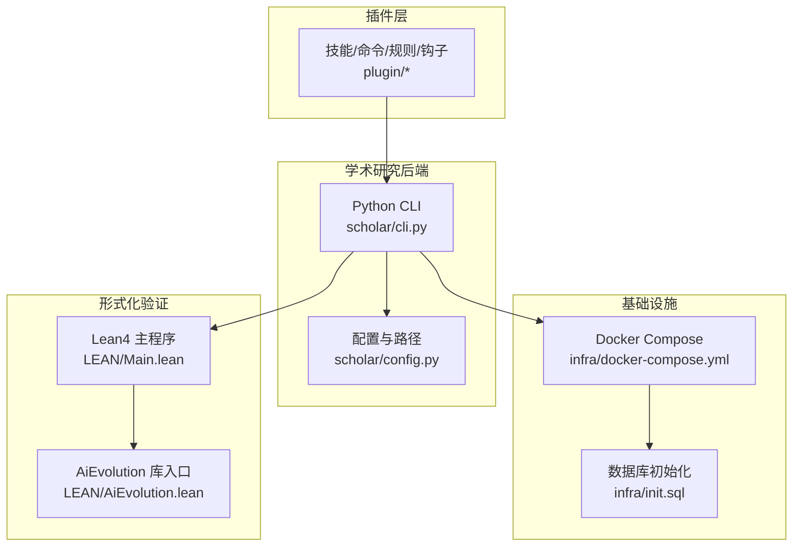
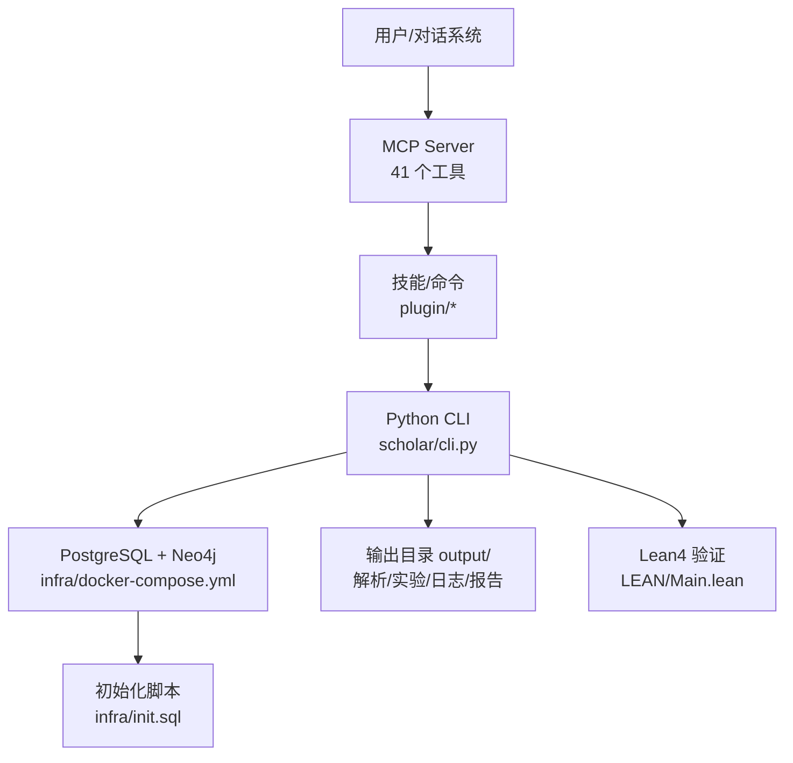
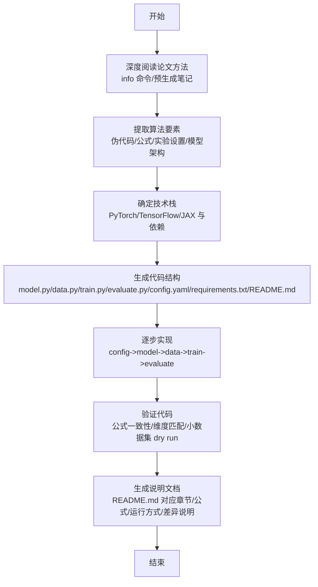
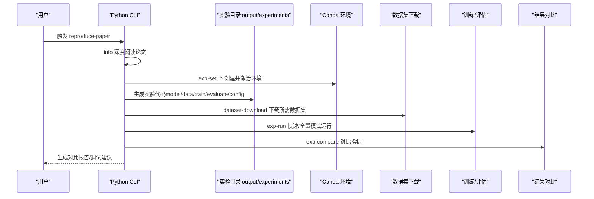
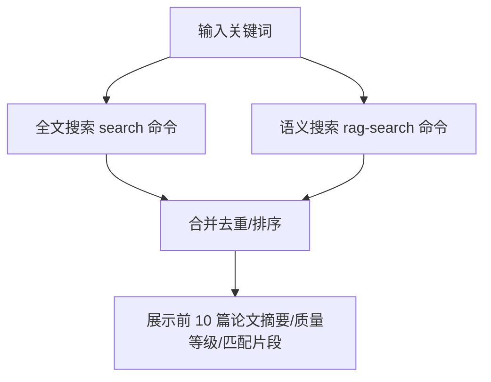
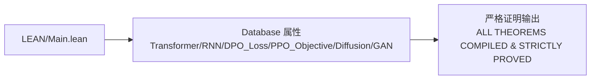
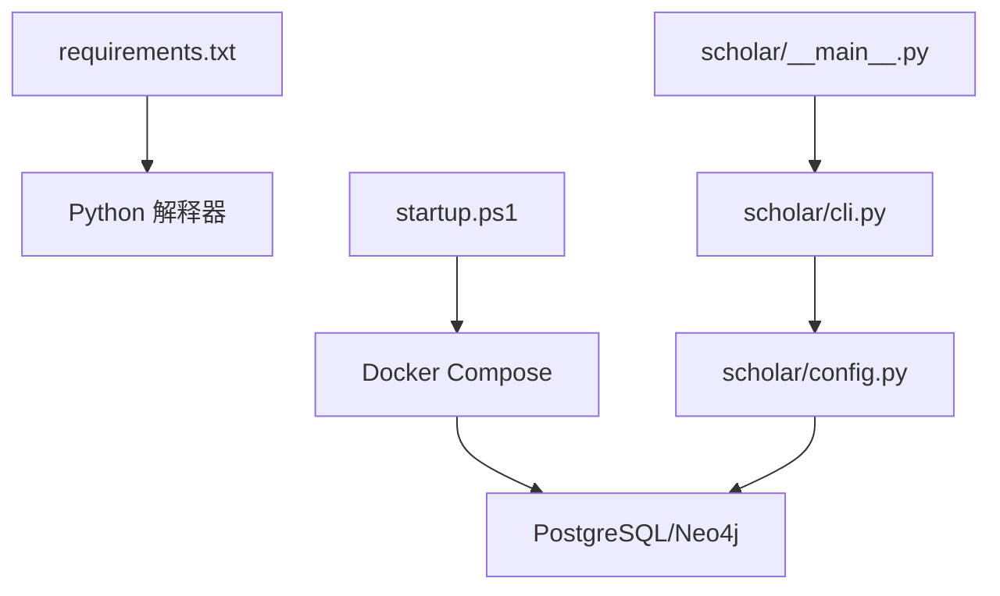

# 实验复现框架

<cite>
**本文档引用的文件**
- [LEAN/Main.lean](file://LEAN/Main.lean)
- [LEAN/AiEvolution.lean](file://LEAN/AiEvolution.lean)
- [plugin/README.md](file://plugin/README.md)
- [plugin/skills/experiment-code/README.md](file://plugin/skills/experiment-code/README.md)
- [plugin/skills/reproduce-paper/README.md](file://plugin/skills/reproduce-paper/README.md)
- [plugin/commands/find.md](file://plugin/commands/find.md)
- [plugin/commands/stats.md](file://plugin/commands/stats.md)
- [requirements.txt](file://requirements.txt)
- [startup.ps1](file://startup.ps1)
- [scholar/cli.py](file://scholar/cli.py)
- [scholar/__main__.py](file://scholar/__main__.py)
- [scholar/config.py](file://scholar/config.py)
- [infra/docker-compose.yml](file://infra/docker-compose.yml)
- [infra/init.sql](file://infra/init.sql)
</cite>

## 目录
1. [简介](#简介)
2. [项目结构](#项目结构)
3. [核心组件](#核心组件)
4. [架构总览](#架构总览)
5. [详细组件分析](#详细组件分析)
6. [依赖关系分析](#依赖关系分析)
7. [性能考虑](#性能考虑)
8. [故障排查指南](#故障排查指南)
9. [结论](#结论)
10. [附录](#附录)

## 简介
本框架面向“实验复现”的全流程工程化需求，提供从论文解析、知识库构建、实验代码生成、环境隔离、依赖安装、实验运行、结果对比到报告生成的闭环能力。系统以 Python CLI 为核心入口，结合 Docker 容器化服务（PostgreSQL + Neo4j）、Lean4 形式化验证与 RAG 检索，支撑可重复、可追溯、可扩展的学术研究与实验复现工作流。

## 项目结构
项目采用多模块分层组织：
- 插件层：提供技能（Skills）、命令（Commands）、规则（Rules）、钩子（Hooks）与 MCP 集成，驱动上层交互与自动化流程。
- 学术研究后端：Python CLI 与数据库模块，负责论文解析、知识库统计、图谱构建、RAG 查询、实验命令桥接等。
- 基础设施：Docker Compose 编排数据库与图数据库，SQL 初始化脚本定义核心数据模式。
- 形式化验证：Lean4 项目用于对关键创新点进行严格证明与属性验证。
- 输出产物：统一在 output/ 目录下生成解析 JSON、实验代码、数据集、日志与报告草稿等。

图表来源
- [plugin/README.md:1-79](file://plugin/README.md#L1-L79)
- [scholar/cli.py:1-800](file://scholar/cli.py#L1-L800)
- [scholar/config.py:1-119](file://scholar/config.py#L1-L119)
- [infra/docker-compose.yml:1-44](file://infra/docker-compose.yml#L1-L44)
- [infra/init.sql:1-131](file://infra/init.sql#L1-L131)
- [LEAN/Main.lean:1-21](file://LEAN/Main.lean#L1-L21)
- [LEAN/AiEvolution.lean:1-8](file://LEAN/AiEvolution.lean#L1-L8)

章节来源
- [plugin/README.md:1-79](file://plugin/README.md#L1-L79)
- [scholar/config.py:20-42](file://scholar/config.py#L20-L42)
- [infra/docker-compose.yml:1-44](file://infra/docker-compose.yml#L1-L44)
- [infra/init.sql:1-131](file://infra/init.sql#L1-L131)
- [LEAN/Main.lean:1-21](file://LEAN/Main.lean#L1-L21)
- [LEAN/AiEvolution.lean:1-8](file://LEAN/AiEvolution.lean#L1-L8)

## 核心组件
- 插件与命令体系：提供“查找论文”“统计知识库”“复现实验”“生成实验代码”等原子能力与工作流，通过 MCP Server 暴露 41 个工具，支撑端到端自动化。
- Python CLI：封装扫描、解析、搜索、统计、图谱构建、arXiv 检索、导出参考文献等命令；提供实验相关命令桥接（exp-setup、exp-run、exp-compare、exp-debug）。
- 基础设施编排：PostgreSQL + pgvector（结构化与向量检索）、Neo4j（概念图谱与引用网络），健康检查保障可用性。
- Lean4 形式化验证：对关键创新点（如 Transformer、RNN、DPO_Loss、PPO_Objective、Diffusion、GAN）进行可验证属性（可扩展性、简洁性、稳定性）的严格证明。
- 输出与产物管理：统一在 output/ 下生成解析 JSON、实验代码、数据集、日志与报告草稿，便于审计与复现。

章节来源
- [plugin/README.md:50-79](file://plugin/README.md#L50-L79)
- [plugin/commands/find.md:1-10](file://plugin/commands/find.md#L1-L10)
- [plugin/commands/stats.md:1-10](file://plugin/commands/stats.md#L1-L10)
- [scholar/cli.py:420-487](file://scholar/cli.py#L420-L487)
- [scholar/config.py:27-38](file://scholar/config.py#L27-L38)
- [infra/docker-compose.yml:1-44](file://infra/docker-compose.yml#L1-L44)
- [LEAN/Main.lean:6-21](file://LEAN/Main.lean#L6-L21)

## 架构总览
系统采用“插件驱动 + CLI 核心 + 容器化服务 + 形式化验证”的混合架构。插件层通过 MCP Server 暴露工具，CLI 作为统一入口协调数据与服务，容器化服务提供持久化与检索能力，Lean4 作为独立验证引擎参与关键属性校验。

图表来源
- [plugin/README.md:50-79](file://plugin/README.md#L50-L79)
- [scholar/cli.py:1-800](file://scholar/cli.py#L1-L800)
- [infra/docker-compose.yml:1-44](file://infra/docker-compose.yml#L1-L44)
- [infra/init.sql:1-131](file://infra/init.sql#L1-L131)
- [LEAN/Main.lean:1-21](file://LEAN/Main.lean#L1-L21)

## 详细组件分析

### 实验代码生成（Skill: experiment-code）
该技能面向“根据论文方法与公式生成 PyTorch 实验代码”，提供从论文深度阅读、要素提取、技术栈确认、代码结构生成、逐步实现到验证与说明文档的完整流程。

图表来源
- [plugin/skills/experiment-code/README.md:11-111](file://plugin/skills/experiment-code/README.md#L11-L111)

章节来源
- [plugin/skills/experiment-code/README.md:1-111](file://plugin/skills/experiment-code/README.md#L1-L111)

### 端到端实验复现（Skill: reproduce-paper）
该技能提供“环境配置→代码生成→运行→结果对比→调试”的完整工作流，强调可重复性与标准化。

图表来源
- [plugin/skills/reproduce-paper/README.md:9-69](file://plugin/skills/reproduce-paper/README.md#L9-L69)
- [scholar/cli.py:1-800](file://scholar/cli.py#L1-L800)

章节来源
- [plugin/skills/reproduce-paper/README.md:1-69](file://plugin/skills/reproduce-paper/README.md#L1-L69)
- [scholar/cli.py:1-800](file://scholar/cli.py#L1-L800)

### 知识库统计与查询（Commands: stats, find）
- stats：聚合知识库统计信息（论文数量、图谱规模、RAG 覆盖率），辅助评估数据层完整性。
- find：提供全文与语义搜索，支持混合检索与去重排序，提升论文定位效率。

图表来源
- [plugin/commands/stats.md:1-10](file://plugin/commands/stats.md#L1-L10)
- [plugin/commands/find.md:1-10](file://plugin/commands/find.md#L1-L10)
- [scholar/cli.py:309-370](file://scholar/cli.py#L309-L370)

章节来源
- [plugin/commands/stats.md:1-10](file://plugin/commands/stats.md#L1-L10)
- [plugin/commands/find.md:1-10](file://plugin/commands/find.md#L1-L10)
- [scholar/cli.py:418-487](file://scholar/cli.py#L418-L487)

### Lean4 形式化验证集成
Lean4 项目对关键创新点进行严格属性验证，主程序打印各架构/损失函数的可扩展性、简洁性、稳定性指标，确保形式化证明完备。

图表来源
- [LEAN/Main.lean:6-21](file://LEAN/Main.lean#L6-L21)
- [LEAN/AiEvolution.lean:1-8](file://LEAN/AiEvolution.lean#L1-L8)

章节来源
- [LEAN/Main.lean:1-21](file://LEAN/Main.lean#L1-L21)
- [LEAN/AiEvolution.lean:1-8](file://LEAN/AiEvolution.lean#L1-L8)

## 依赖关系分析
- Python 依赖：通过 requirements.txt 管理核心依赖（Typer、Rich、psycopg2、neo4j、python-dotenv、PyMuPDF、MCP），并提供可选依赖提示。
- 启动脚本：startup.ps1 负责 Docker、Python、.env、依赖检查与服务健康等待，确保 PostgreSQL 与 Neo4j 就绪后再进入下一步。
- CLI 入口：通过 __main__.py 调用 CLI 主程序，集中注册命令与帮助信息。
- 配置中心：config.py 统一管理项目根目录、输出目录、数据库连接、嵌入模型与 arXiv 请求参数，支持 .env 注入。

图表来源
- [requirements.txt:1-14](file://requirements.txt#L1-L14)
- [startup.ps1:1-125](file://startup.ps1#L1-L125)
- [scholar/__main__.py:1-8](file://scholar/__main__.py#L1-L8)
- [scholar/cli.py:1-800](file://scholar/cli.py#L1-L800)
- [scholar/config.py:1-119](file://scholar/config.py#L1-L119)
- [infra/docker-compose.yml:1-44](file://infra/docker-compose.yml#L1-L44)

章节来源
- [requirements.txt:1-14](file://requirements.txt#L1-L14)
- [startup.ps1:11-56](file://startup.ps1#L11-L56)
- [scholar/__main__.py:1-8](file://scholar/__main__.py#L1-L8)
- [scholar/config.py:1-119](file://scholar/config.py#L1-L119)
- [infra/docker-compose.yml:1-44](file://infra/docker-compose.yml#L1-L44)

## 性能考虑
- 搜索与统计：优先使用数据库检索（search 命令），在数据库不可用时回退至 JSON 文件扫描，避免大规模 I/O。
- 图谱构建：Neo4j 仅在服务可用时执行，否则提示安装与启动，减少无效等待。
- 批处理与进度：批量解析采用进度条与分片显示，避免终端被大量输出淹没。
- 资源限制：容器内存参数在 Docker Compose 中设定，建议根据宿主机资源调整以平衡吞吐与稳定性。
- RAG 与嵌入：嵌入维度与提供商可配置，建议在受限环境下降低并发与批大小。

## 故障排查指南
- Docker 未就绪：启动脚本会检测 Docker、Python、.env 与依赖，若缺失则给出明确提示与修复建议。
- 服务健康检查失败：等待阶段超时会输出警告，可通过查看容器状态与日志定位问题。
- 数据库连接异常：检查 .env 中数据库地址、端口、账号与密码，确认容器映射与初始化脚本执行。
- arXiv 请求失败：检查代理与超时设置，必要时增加重试次数与超时时间。
- 实验运行失败：使用 exp-debug 自动诊断常见错误（模块导入、CUDA 内存、文件缺失），并提供修复建议。

章节来源
- [startup.ps1:11-125](file://startup.ps1#L11-L125)
- [scholar/config.py:69-119](file://scholar/config.py#L69-L119)
- [plugin/skills/reproduce-paper/README.md:57-62](file://plugin/skills/reproduce-paper/README.md#L57-L62)

## 结论
该实验复现框架通过“插件 + CLI + 容器 + 形式化验证”的组合，实现了从论文解析到实验复现的标准化与自动化。其核心优势在于：
- 可重复性：严格的环境隔离、依赖声明与实验目录结构，确保结果可重现。
- 可追溯性：统一输出目录与日志记录，便于审计与溯源。
- 可扩展性：模块化设计与 MCP 工具集，支持持续扩展新技能与命令。
- 可验证性：Lean4 形式化验证与数据库模式同步，增强关键属性的可信度。

## 附录

### 实验设计模板（可直接套用）
- 论文选择：使用 find 命令定位候选论文，结合 stats 评估覆盖度。
- 复现准备：使用 reproduce-paper 技能的 exp-setup 创建 Conda 环境并安装依赖。
- 代码生成：若尚未生成，使用 experiment-code 技能生成标准实验代码结构。
- 数据准备：通过 dataset-download 下载所需数据集，放置于 output/datasets。
- 运行策略：先 quick 模式 CPU + 合成数据验证通路，再 full 模式 GPU 训练。
- 结果对比：使用 exp-compare 对比指标，生成对比报告。
- 调试与迭代：exp-debug 诊断常见问题，补充 README.md 差异说明。

章节来源
- [plugin/skills/reproduce-paper/README.md:9-69](file://plugin/skills/reproduce-paper/README.md#L9-L69)
- [plugin/skills/experiment-code/README.md:11-111](file://plugin/skills/experiment-code/README.md#L11-L111)
- [plugin/commands/find.md:1-10](file://plugin/commands/find.md#L1-L10)
- [plugin/commands/stats.md:1-10](file://plugin/commands/stats.md#L1-L10)