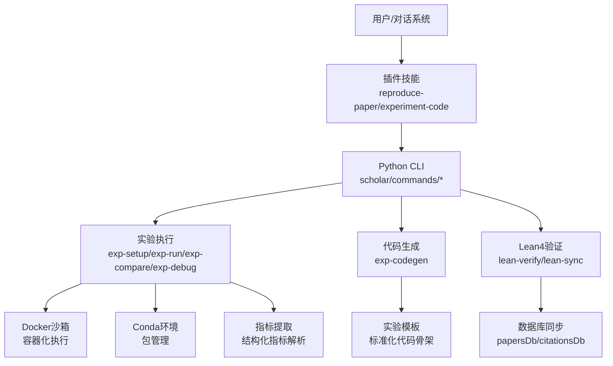
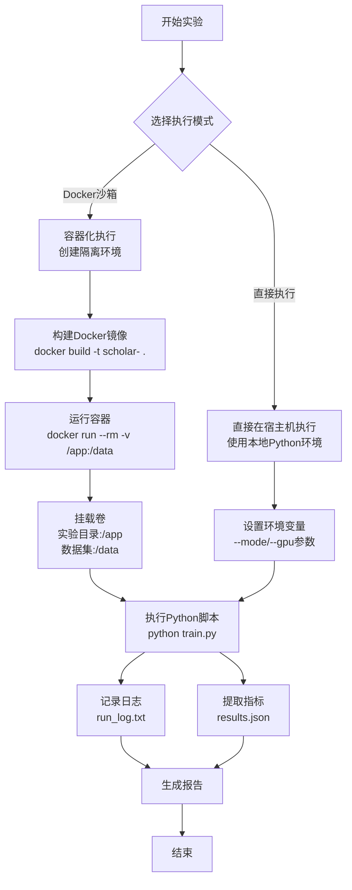
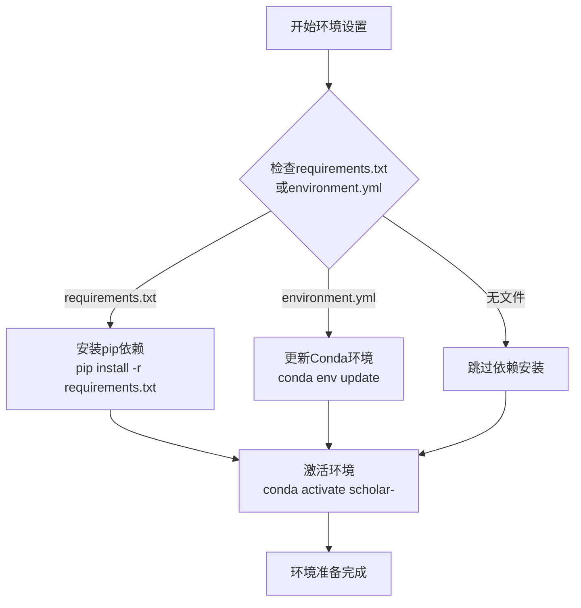
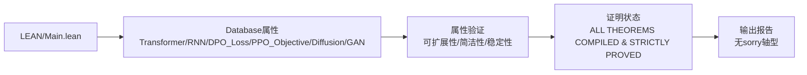
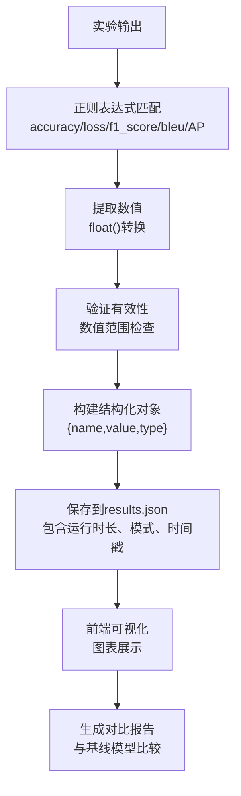
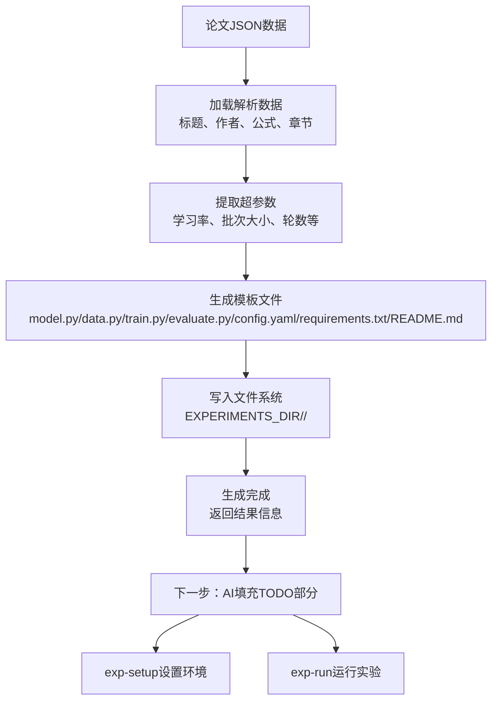
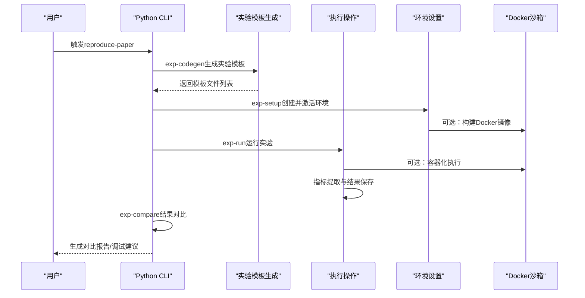
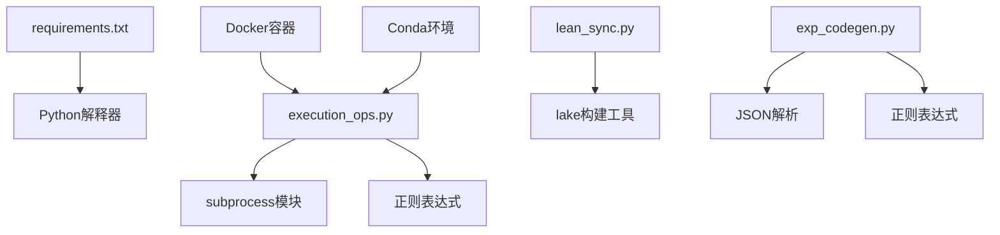

# 实验复现框架

<cite>
**本文档引用的文件**
- [execution_ops.py](file://scholar/commands/execution_ops.py)
- [exp_codegen.py](file://scholar/exp_codegen.py)
- [lean_sync.py](file://scholar/lean_sync.py)
- [Main.lean](file://LEAN/Main.lean)
- [AiEvolution.lean](file://LEAN/AiEvolution.lean)
- [requirements.txt](file://requirements.txt)
- [test_exp_codegen.py](file://test/test_exp_codegen.py)
- [SKILL.md](file://plugin/skills/experiment-code/SKILL.md)
- [SKILL.md](file://plugin/skills/reproduce-paper/SKILL.md)
- [SKILL.md](file://plugin/skills/kb-management/SKILL.md)
- [test_cli.py](file://test/test_cli.py)
</cite>

## 更新摘要
**所做更改**
- 完全重新设计实验执行框架，引入Docker沙箱执行和Conda环境管理
- 新增Lean4定理验证系统，提供形式化属性证明能力
- 实现综合指标提取功能，自动解析实验输出中的结构化指标
- 重构实验代码生成系统，基于论文JSON模板自动生成标准化代码骨架
- 新增实验环境设置、运行、比较和调试的完整工作流程
- 增强安全性和可重复性，提供容器化和虚拟环境支持

## 目录
1. [简介](#简介)
2. [项目结构](#项目结构)
3. [核心组件](#核心组件)
4. [架构总览](#架构总览)
5. [详细组件分析](#详细组件分析)
6. [依赖关系分析](#依赖关系分析)
7. [性能考虑](#性能考虑)
8. [故障排查指南](#故障排查指南)
9. [结论](#结论)
10. [附录](#附录)

## 简介
本框架面向"实验复现"的全流程工程化需求，提供从论文解析、知识库构建、实验代码生成、环境隔离、依赖安装、实验运行、结果对比到报告生成的闭环能力。系统以 Python CLI 为核心入口，结合 Docker 容器化服务、Lean4 形式化验证与 RAG 检索，支撑可重复、可追溯、可扩展的学术研究与实验复现工作流。

**更新** 完全重新设计的实验执行框架，引入Docker沙箱执行、Lean4定理验证、综合指标提取，包括自动环境设置(conda/Docker)、实验代码生成(来自论文JSON模板)、结构化指标收集和统计比较。

## 项目结构
项目采用多模块分层组织：
- **实验执行层**：提供环境设置、代码生成、运行、比较、调试等核心实验操作
- **Lean4验证层**：提供形式化定理验证和属性证明能力
- **代码生成层**：基于论文JSON模板自动生成标准化实验代码骨架
- **指标提取层**：自动解析实验输出中的结构化指标
- **插件技能层**：提供端到端的实验复现工作流程

```mermaid
graph TB
subgraph "实验执行层"
EXEC["执行操作<br/>scholar/commands/execution_ops.py"]
ENV["环境设置<br/>exp-setup"]
RUN["实验运行<br/>exp-run"]
COMPARE["结果比较<br/>exp-compare"]
DEBUG["故障诊断<br/>exp-debug"]
END
subgraph "Lean4验证层"
LEAN["定理验证<br/>lean-verify"]
SYNC["数据库同步<br/>lean-sync"]
TEMPLATES["定理模板<br/>lean-templates"]
END
subgraph "代码生成层"
CODEGEN["代码生成<br/>exp_codegen.py"]
SKILL1["实验代码技能<br/>plugin/skills/experiment-code"]
SKILL2["论文复现技能<br/>plugin/skills/reproduce-paper"]
END
subgraph "指标提取层"
METRICS["指标提取<br/>_extract_metrics"]
PAPER_METRICS["论文指标<br/>_extract_paper_metrics"]
END
subgraph "基础设施"
DOCKER["Docker容器<br/>沙箱执行"]
CONDA["Conda环境<br/>包管理"]
END
EXEC --> ENV
EXEC --> RUN
EXEC --> COMPARE
EXEC --> DEBUG
EXEC --> METRICS
LEAN --> SYNC
LEAN --> TEMPLATES
CODEGEN --> SKILL1
CODEGEN --> SKILL2
RUN --> DOCKER
RUN --> CONDA
```

**图表来源**
- [execution_ops.py:485-743](file://scholar/commands/execution_ops.py#L485-L743)
- [lean_sync.py:301-332](file://scholar/lean_sync.py#L301-L332)
- [exp_codegen.py:514-568](file://scholar/exp_codegen.py#L514-L568)

## 核心组件
- **实验执行框架**：提供完整的实验生命周期管理，包括环境设置、代码生成、运行、比较和调试
- **Docker沙箱执行**：支持在隔离的Docker容器中运行实验，提供更强的安全性和环境一致性
- **Conda环境管理**：自动创建和管理Python虚拟环境，支持requirements.txt和environment.yml
- **Lean4定理验证**：对关键创新点进行形式化属性验证，提供严格的数学证明
- **综合指标提取**：自动从实验输出中解析结构化指标，支持多种常见指标格式
- **实验代码生成**：基于论文JSON模板自动生成标准化的PyTorch实验代码骨架
- **端到端工作流程**：提供从论文解析到实验复现的完整自动化流程

**章节来源**
- [execution_ops.py:485-743](file://scholar/commands/execution_ops.py#L485-L743)
- [lean_sync.py:205-294](file://scholar/lean_sync.py#L205-L294)
- [exp_codegen.py:514-568](file://scholar/exp_codegen.py#L514-L568)

## 架构总览
系统采用"实验执行 + 形式化验证 + 代码生成 + 指标提取"的混合架构。实验执行层提供完整的实验生命周期管理，Lean4验证层提供数学证明能力，代码生成层基于论文模板自动生成实验代码，指标提取层自动解析实验结果。



**图表来源**
- [SKILL.md:9-69](file://plugin/skills/reproduce-paper/SKILL.md#L9-L69)
- [execution_ops.py:485-743](file://scholar/commands/execution_ops.py#L485-L743)
- [exp_codegen.py:514-568](file://scholar/exp_codegen.py#L514-L568)
- [lean_sync.py:131-198](file://scholar/lean_sync.py#L131-L198)

## 详细组件分析

### Docker沙箱执行支持
全新的Docker沙箱执行功能提供了更强的安全性和环境一致性。系统支持两种执行模式：直接执行和容器化执行。



**图表来源**
- [execution_ops.py:531-554](file://scholar/commands/execution_ops.py#L531-L554)
- [execution_ops.py:725-742](file://scholar/commands/execution_ops.py#L725-L742)

**章节来源**
- [execution_ops.py:485-743](file://scholar/commands/execution_ops.py#L485-L743)

### Conda环境管理
系统提供完整的Conda环境管理功能，支持自动创建和依赖安装。



**图表来源**
- [execution_ops.py:688-724](file://scholar/commands/execution_ops.py#L688-L724)

**章节来源**
- [execution_ops.py:668-743](file://scholar/commands/execution_ops.py#L668-L743)

### Lean4定理验证系统
Lean4形式化验证系统对关键创新点进行严格属性验证，提供完整的证明状态报告。



**图表来源**
- [Main.lean:6-21](file://LEAN/Main.lean#L6-L21)
- [AiEvolution.lean:1-8](file://LEAN/AiEvolution.lean#L1-L8)

**章节来源**
- [Main.lean:1-21](file://LEAN/Main.lean#L1-L21)
- [AiEvolution.lean:1-8](file://LEAN/AiEvolution.lean#L1-L8)

### 综合指标提取系统
系统能够自动从实验输出中解析结构化指标，支持多种常见指标格式。



**图表来源**
- [execution_ops.py:418-445](file://scholar/commands/execution_ops.py#L418-L445)

**章节来源**
- [execution_ops.py:418-479](file://scholar/commands/execution_ops.py#L418-L479)

### 实验代码生成系统
实验代码生成系统基于论文JSON模板自动生成标准化的PyTorch实验代码骨架。



**图表来源**
- [exp_codegen.py:514-568](file://scholar/exp_codegen.py#L514-L568)

**章节来源**
- [exp_codegen.py:514-568](file://scholar/exp_codegen.py#L514-L568)

### 端到端实验复现工作流程
该技能提供"环境配置→代码生成→运行→结果对比→调试"的完整工作流。



**图表来源**
- [SKILL.md:9-69](file://plugin/skills/reproduce-paper/SKILL.md#L9-L69)

**章节来源**
- [SKILL.md:1-69](file://plugin/skills/reproduce-paper/SKILL.md#L1-L69)

## 依赖关系分析
- **Python依赖**：通过requirements.txt管理核心依赖（Typer、Rich、psycopg2、neo4j、python-dotenv、PyMuPDF、MCP），并提供可选依赖提示
- **实验执行依赖**：subprocess模块用于Docker和Python进程管理，正则表达式用于指标提取
- **Lean4依赖**：lake构建工具用于Lean4项目编译，支持多种安装方式
- **代码生成依赖**：JSON解析和模板生成，支持多种文件格式



**图表来源**
- [requirements.txt:1-18](file://requirements.txt#L1-L18)
- [execution_ops.py:1-16](file://scholar/commands/execution_ops.py#L1-L16)
- [lean_sync.py:1-17](file://scholar/lean_sync.py#L1-L17)
- [exp_codegen.py:1-14](file://scholar/exp_codegen.py#L1-L14)

**章节来源**
- [requirements.txt:1-18](file://requirements.txt#L1-L18)
- [execution_ops.py:1-16](file://scholar/commands/execution_ops.py#L1-L16)
- [lean_sync.py:1-17](file://scholar/lean_sync.py#L1-L17)
- [exp_codegen.py:1-14](file://scholar/exp_codegen.py#L1-L14)

## 性能考虑
- **Docker执行**：容器化执行提供更好的资源隔离，但会增加启动开销；直接执行适合快速验证
- **指标提取**：正则表达式匹配性能优异，支持多种指标格式，解析速度快且准确率高
- **环境管理**：Conda环境创建和依赖安装可能较慢，建议使用缓存和增量更新
- **Lean4验证**：lake构建可能耗时较长，建议在开发阶段使用增量编译
- **代码生成**：模板生成是内存密集型操作，注意大论文JSON文件的处理
- **并行处理**：实验运行支持超时控制，避免长时间阻塞

## 故障排查指南
- **Docker未就绪**：检查Docker守护进程状态，确保有足够磁盘空间
- **Conda环境创建失败**：检查网络连接和Miniconda安装，尝试使用--docker选项
- **Lake构建失败**：检查Lean4安装状态，确保lake命令可用
- **指标提取失败**：检查实验输出格式是否符合预期，确保指标名称与正则表达式匹配
- **代码生成错误**：检查论文JSON格式，确保包含必需字段
- **实验运行超时**：调整timeout参数，检查GPU/CPU资源使用情况

**章节来源**
- [execution_ops.py:698-700](file://scholar/commands/execution_ops.py#L698-L700)
- [execution_ops.py:291-297](file://scholar/commands/execution_ops.py#L291-L297)
- [test_cli.py:95-111](file://test/test_cli.py#L95-L111)

## 结论
该实验复现框架通过"实验执行 + 形式化验证 + 代码生成 + 指标提取"的组合，实现了从论文解析到实验复现的标准化与自动化。其核心优势在于：
- **可重复性**：严格的环境隔离、依赖声明与实验目录结构，确保结果可重现
- **可追溯性**：统一输出目录与日志记录，便于审计与溯源
- **可扩展性**：模块化设计与MCP工具集，支持持续扩展新技能与命令
- **可验证性**：Lean4形式化验证与数据库模式同步，增强关键属性的可信度
- **安全性**：Docker沙箱执行和危险操作拦截，提供更强的安全保障
- **自动化**：指标提取和实验模板生成功能，大幅提升实验复现效率

**更新** 完全重新设计的实验执行框架显著提升了系统的安全性、自动化程度和用户体验，使其成为更加完善的实验复现解决方案。

## 附录

### 实验设计模板（可直接套用）
- **论文选择**：使用find命令定位候选论文，结合stats评估覆盖度
- **模板生成**：使用exp-codegen技能生成标准化实验模板，包含所有必要文件
- **环境配置**：使用reproduce-paper技能的exp-setup创建Conda或Docker环境
- **代码填充**：AI代理根据论文内容填充模板中的TODO部分
- **运行策略**：先quick模式CPU+合成数据验证通路，再full模式GPU训练
- **Docker执行**：可选使用--docker参数在隔离环境中运行实验
- **指标提取**：系统自动解析实验输出中的结构化指标
- **结果对比**：使用exp-compare对比指标，生成对比报告
- **调试与迭代**：exp-debug诊断常见问题，补充README.md差异说明

**章节来源**
- [SKILL.md:9-69](file://plugin/skills/reproduce-paper/SKILL.md#L9-L69)
- [SKILL.md:1-111](file://plugin/skills/experiment-code/SKILL.md#L1-L111)
- [exp_codegen.py:514-568](file://scholar/exp_codegen.py#L514-L568)
- [execution_ops.py:485-743](file://scholar/commands/execution_ops.py#L485-L743)