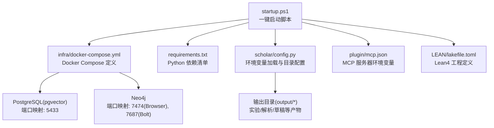
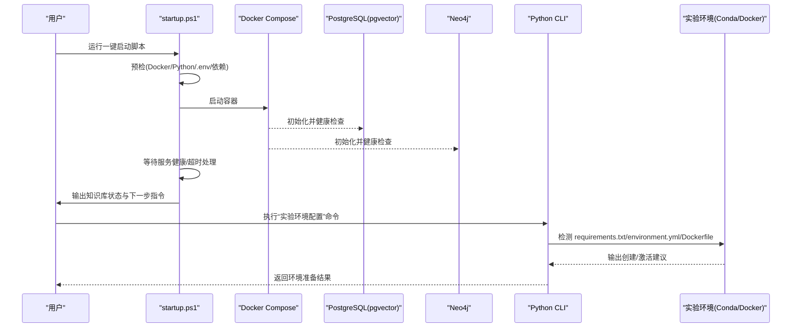
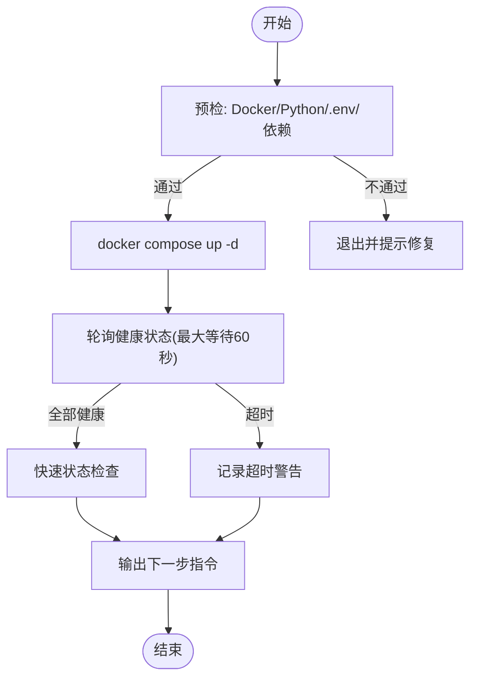
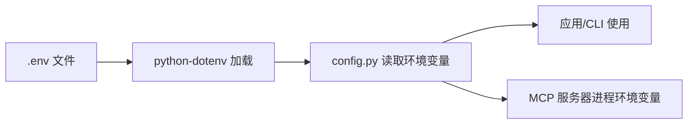
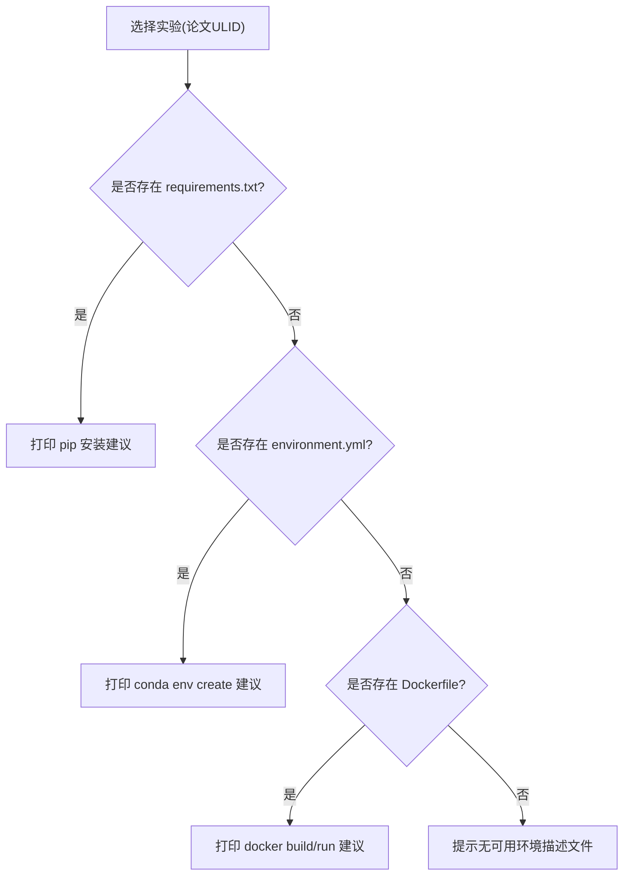
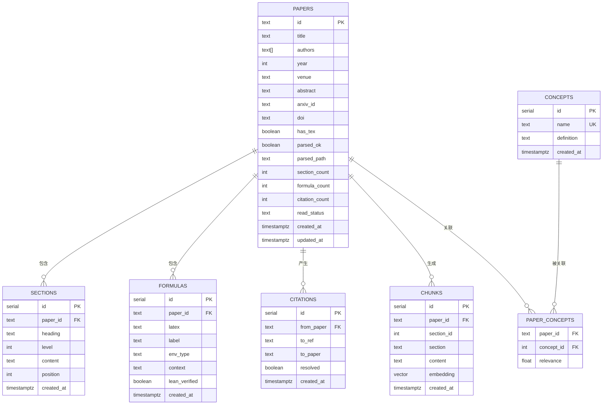
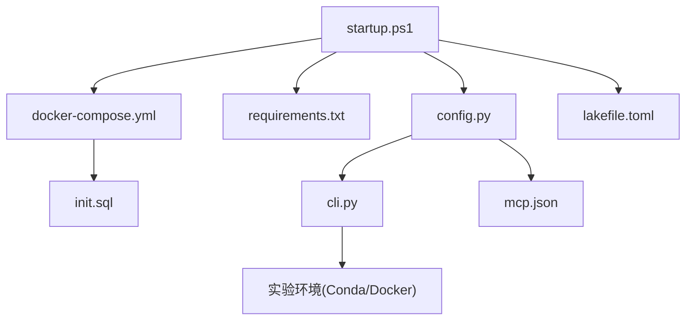

# 实验环境管理

<cite>
**本文引用的文件**
- [startup.ps1](file://startup.ps1)
- [requirements.txt](file://requirements.txt)
- [docker-compose.yml](file://infra/docker-compose.yml)
- [init.sql](file://infra/init.sql)
- [config.py](file://scholar/config.py)
- [cli.py](file://scholar/cli.py)
- [mcp.json](file://plugin/mcp.json)
- [lakefile.toml](file://LEAN/lakefile.toml)
</cite>

## 目录
1. [简介](#简介)
2. [项目结构](#项目结构)
3. [核心组件](#核心组件)
4. [架构总览](#架构总览)
5. [详细组件分析](#详细组件分析)
6. [依赖关系分析](#依赖关系分析)
7. [性能考虑](#性能考虑)
8. [故障排查指南](#故障排查指南)
9. [结论](#结论)
10. [附录](#附录)

## 简介
本文件面向“实验环境管理”模块，系统化阐述本项目的环境配置与激活机制、依赖安装与管理策略、实验隔离技术实现，并覆盖虚拟环境创建、包管理器使用、环境变量配置与依赖锁定机制。文档同时给出环境初始化流程、配置文件管理、版本兼容性检查与故障恢复策略，以及多语言支持、GPU/CUDA 配置与资源限制设置的实践建议。

## 项目结构
本项目围绕“一键启动”脚本组织环境初始化，通过 Docker Compose 提供数据库与图数据库服务，Python CLI 提供命令行工具与实验环境管理能力，Lean4 作为形式化验证子项目独立管理其构建与依赖。

图表来源
- [startup.ps1:1-125](file://startup.ps1#L1-L125)
- [docker-compose.yml:1-44](file://infra/docker-compose.yml#L1-L44)
- [requirements.txt:1-14](file://requirements.txt#L1-L14)
- [config.py:1-119](file://scholar/config.py#L1-L119)
- [mcp.json:1-16](file://plugin/mcp.json#L1-L16)
- [lakefile.toml:1-11](file://LEAN/lakefile.toml#L1-L11)

章节来源
- [startup.ps1:1-125](file://startup.ps1#L1-L125)
- [docker-compose.yml:1-44](file://infra/docker-compose.yml#L1-L44)
- [requirements.txt:1-14](file://requirements.txt#L1-L14)
- [config.py:1-119](file://scholar/config.py#L1-L119)
- [mcp.json:1-16](file://plugin/mcp.json#L1-L16)
- [lakefile.toml:1-11](file://LEAN/lakefile.toml#L1-L11)

## 核心组件
- 一键启动与健康检查：负责预检（Docker、Python、.env、依赖）、拉起容器、等待服务健康、快速状态检查与后续指引。
- 依赖与环境变量：通过 requirements.txt 管理 Python 依赖；通过 .env 与 python-dotenv 加载环境变量；在 MCP 服务器中注入数据库连接参数。
- 数据库与图数据库：PostgreSQL + pgvector 用于结构化数据与向量检索；Neo4j 用于概念图谱与引用网络。
- 实验环境管理：CLI 提供“为论文实验配置运行环境”的子命令，支持 Conda 与 Docker 两种路径，并在实验目录下扫描 requirements.txt 或 environment.yml。
- Lean4 工程：独立的 Lake 工程定义，与主项目解耦，便于形式化验证任务的隔离与版本控制。

章节来源
- [startup.ps1:1-125](file://startup.ps1#L1-L125)
- [requirements.txt:1-14](file://requirements.txt#L1-L14)
- [config.py:1-119](file://scholar/config.py#L1-L119)
- [cli.py:2133-2163](file://scholar/cli.py#L2133-L2163)
- [mcp.json:1-16](file://plugin/mcp.json#L1-L16)
- [lakefile.toml:1-11](file://LEAN/lakefile.toml#L1-L11)

## 架构总览
下图展示从用户执行到服务就绪、再到实验环境准备的整体流程。

图表来源
- [startup.ps1:1-125](file://startup.ps1#L1-L125)
- [docker-compose.yml:1-44](file://infra/docker-compose.yml#L1-L44)
- [cli.py:2133-2163](file://scholar/cli.py#L2133-L2163)

## 详细组件分析

### 一键启动与环境初始化
- 预检阶段：校验 Docker 可用性、Python 版本、.env 文件存在性与依赖完整性。
- 容器编排：使用 docker-compose 启动 PostgreSQL 与 Neo4j，并挂载初始化 SQL 与数据卷。
- 健康检查：轮询容器健康状态，超时则告警。
- 快速状态检查：进入容器执行查询，统计知识库规模。
- 后续指引：根据知识库是否为空，提示引导初始化或直接使用。

图表来源
- [startup.ps1:11-125](file://startup.ps1#L11-L125)
- [docker-compose.yml:15-39](file://infra/docker-compose.yml#L15-L39)

章节来源
- [startup.ps1:11-125](file://startup.ps1#L11-L125)
- [docker-compose.yml:1-44](file://infra/docker-compose.yml#L1-L44)

### 依赖安装与管理策略
- Python 依赖：集中于 requirements.txt，采用 pip 安装；可选依赖以注释形式列出，便于按需启用。
- 包管理器选择：优先使用 pip；若需要更严格的环境隔离，可在实验环境中使用 Conda。
- 依赖锁定：仓库未提供锁定文件；建议在生产或共享实验环境中引入 requirements.txt 的导出与锁定机制（例如 pip-tools）。

章节来源
- [requirements.txt:1-14](file://requirements.txt#L1-L14)
- [cli.py:2133-2163](file://scholar/cli.py#L2133-L2163)

### 环境变量配置与 MCP 集成
- .env 加载：通过 python-dotenv 从项目根目录加载，未安装时回退至 os.environ。
- 关键变量：数据库主机/端口/凭据、Neo4j 连接 URI、嵌入模型与维度、LaTeX 编译命令、Lean4 工程路径等。
- MCP 服务器：在 plugin/mcp.json 中为 MCP 服务器进程注入数据库相关环境变量，确保外部客户端能正确连接后端服务。

图表来源
- [config.py:11-18](file://scholar/config.py#L11-L18)
- [config.py:44-66](file://scholar/config.py#L44-L66)
- [mcp.json:9-13](file://plugin/mcp.json#L9-L13)

章节来源
- [config.py:1-119](file://scholar/config.py#L1-L119)
- [mcp.json:1-16](file://plugin/mcp.json#L1-L16)

### 实验隔离技术实现
- 目录隔离：每个论文实验对应 experiments 目录下的独立子目录，避免相互污染。
- 环境隔离：CLI 支持两种路径
  - Conda：优先使用 environment.yml；若不存在则基于 requirements.txt 创建环境并安装依赖。
  - Docker：若存在 Dockerfile，则建议在实验目录内构建镜像并运行容器。
- 交互提示：CLI 输出具体命令示例，便于用户复制执行。

图表来源
- [cli.py:2133-2163](file://scholar/cli.py#L2133-L2163)

章节来源
- [cli.py:2133-2163](file://scholar/cli.py#L2133-L2163)

### 数据库与图数据库初始化
- PostgreSQL + pgvector：通过 init.sql 创建扩展与表结构，包括论文、章节、公式、引用、概念、块等核心实体及索引。
- Neo4j：默认启用 APOC 插件，设置内存参数，暴露浏览器与 Bolt 端口。
- 健康检查：Compose 对两类服务分别进行健康检查，确保服务可用后再继续初始化流程。

图表来源
- [init.sql:1-131](file://infra/init.sql#L1-L131)

章节来源
- [init.sql:1-131](file://infra/init.sql#L1-L131)
- [docker-compose.yml:1-44](file://infra/docker-compose.yml#L1-L44)

### Lean4 工程与形式化验证
- 工程定义：通过 lakefile.toml 声明库与可执行目标，与主项目解耦。
- 依赖管理：Lake 会根据依赖声明下载与缓存，建议遵循 Lake 的更新与缓存策略，避免版本漂移。
- 与实验环境的关系：Lean4 任务通常在独立环境中执行，避免与 Python 实验环境冲突。

章节来源
- [lakefile.toml:1-11](file://LEAN/lakefile.toml#L1-L11)

## 依赖关系分析
- 启动脚本依赖 Docker Compose 与容器健康检查；容器依赖 init.sql 初始化数据库。
- Python CLI 依赖 .env 中的数据库与嵌入配置；MCP 服务器依赖 CLI 注入的数据库环境变量。
- 实验环境命令依赖实验目录内的 requirements.txt/environment.yml/Dockerfile。

图表来源
- [startup.ps1:1-125](file://startup.ps1#L1-L125)
- [docker-compose.yml:1-44](file://infra/docker-compose.yml#L1-L44)
- [init.sql:1-131](file://infra/init.sql#L1-L131)
- [requirements.txt:1-14](file://requirements.txt#L1-L14)
- [config.py:1-119](file://scholar/config.py#L1-L119)
- [cli.py:2133-2163](file://scholar/cli.py#L2133-L2163)
- [mcp.json:1-16](file://plugin/mcp.json#L1-L16)
- [lakefile.toml:1-11](file://LEAN/lakefile.toml#L1-L11)

章节来源
- [startup.ps1:1-125](file://startup.ps1#L1-L125)
- [docker-compose.yml:1-44](file://infra/docker-compose.yml#L1-L44)
- [init.sql:1-131](file://infra/init.sql#L1-L131)
- [requirements.txt:1-14](file://requirements.txt#L1-L14)
- [config.py:1-119](file://scholar/config.py#L1-L119)
- [cli.py:2133-2163](file://scholar/cli.py#L2133-L2163)
- [mcp.json:1-16](file://plugin/mcp.json#L1-L16)
- [lakefile.toml:1-11](file://LEAN/lakefile.toml#L1-L11)

## 性能考虑
- 服务启动与健康检查：合理设置健康检查间隔与超时，避免过短导致误判或过长导致启动延迟。
- 数据库索引：init.sql 已为高频查询字段建立索引，建议结合实际查询模式持续优化。
- 容器资源：Neo4j 内存参数可根据宿主机资源调整，避免 OOM。
- 实验环境并发：Conda/Docker 环境创建与依赖安装可能耗时较长，建议在 CI 或离线场景提前准备镜像/环境。

## 故障排查指南
- Docker 未运行或不可用：启动 Docker Desktop 并重试。
- Python 未安装或版本过低：安装 Python 3.10+ 并确保命令可用。
- .env 缺失：一键启动脚本会自动从 .env.example 复制，请手动填写必要密钥。
- 依赖缺失：执行 pip install -r requirements.txt。
- 服务超时：检查容器日志与健康检查配置，确认数据库初始化完成。
- MCP 无法连接：核对 plugin/mcp.json 中的数据库环境变量与实际运行环境一致。

章节来源
- [startup.ps1:14-56](file://startup.ps1#L14-L56)
- [startup.ps1:64-91](file://startup.ps1#L64-L91)
- [mcp.json:9-13](file://plugin/mcp.json#L9-L13)

## 结论
本项目通过“一键启动脚本 + Docker Compose + Python CLI + MCP 服务器”的组合，实现了从基础设施到应用层的完整环境初始化与实验隔离。建议在生产与共享环境中引入依赖锁定与版本管理策略，并针对 GPU/CUDA 与资源限制进行针对性配置，以提升稳定性与可重复性。

## 附录

### 环境初始化流程清单
- 确认 Docker 与 Python 可用
- 复制并编辑 .env
- 安装 Python 依赖
- 启动容器并等待健康
- 查看知识库状态
- 如需实验环境，参考 CLI 建议创建 Conda/Docker 环境

章节来源
- [startup.ps1:11-125](file://startup.ps1#L11-L125)
- [requirements.txt:1-14](file://requirements.txt#L1-L14)

### 环境配置模板与要点
- .env 关键项（示例）
  - 数据库连接：主机、端口、用户名、密码
  - Neo4j 连接：URI、认证
  - 嵌入模型：提供商、模型名、维度、API Key
  - LaTeX 编译：命令
  - Lean4 工程：路径
- MCP 服务器环境变量：确保与后端服务一致

章节来源
- [config.py:44-66](file://scholar/config.py#L44-L66)
- [mcp.json:9-13](file://plugin/mcp.json#L9-L13)

### 常用依赖包清单（摘自 requirements.txt）
- 核心依赖：typer、rich、psycopg2-binary、neo4j、python-dotenv、PyMuPDF、mcp
- 可选依赖：注释形式，按需启用

章节来源
- [requirements.txt:1-14](file://requirements.txt#L1-L14)

### 环境验证方法
- 一键启动脚本输出的服务状态与知识库统计
- CLI 命令：stats、list-papers、search 等
- MCP 服务器连通性测试

章节来源
- [startup.ps1:94-121](file://startup.ps1#L94-L121)
- [cli.py:421-476](file://scholar/cli.py#L421-L476)

### 多语言支持、GPU/CUDA 与资源限制
- 多语言支持：项目内置中文界面与提示；CLI 输出使用 rich 渲染，可配合终端字体与编码设置。
- GPU/CUDA：当前依赖未显式声明 GPU/CUDA 相关包；若需在实验中使用 GPU，建议在 Conda/Docker 环境中单独安装对应驱动与库，并在实验脚本中检测与选择设备。
- 资源限制：可通过 Docker Compose 的资源限制字段（如 deploy.resources）为服务设置 CPU/内存上限；Neo4j 内存参数已在 Compose 中配置，可根据实际资源调优。

章节来源
- [docker-compose.yml:28-32](file://infra/docker-compose.yml#L28-L32)