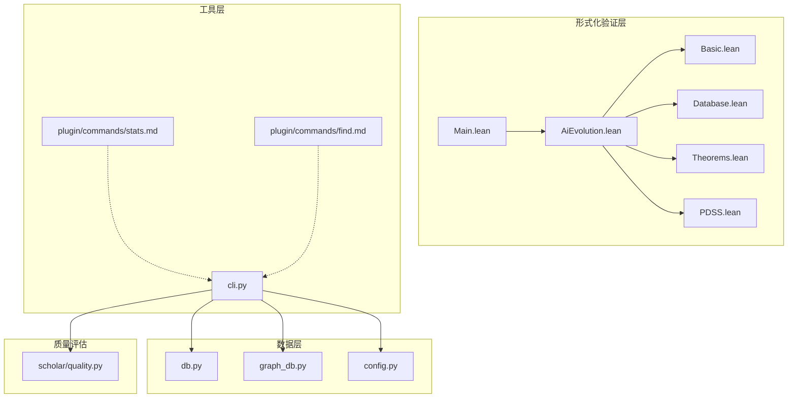
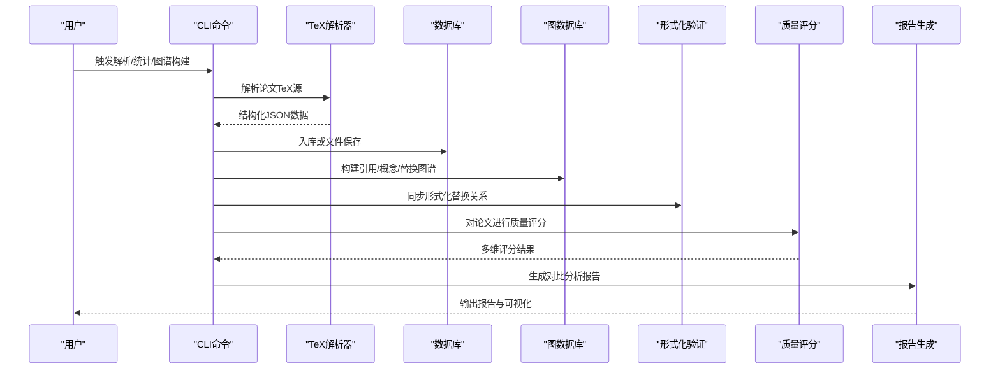
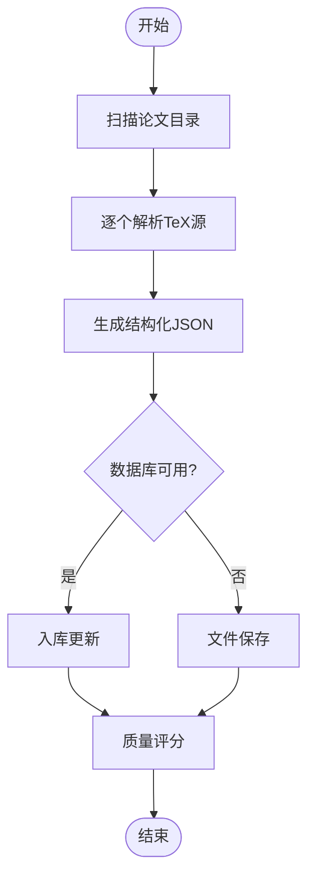
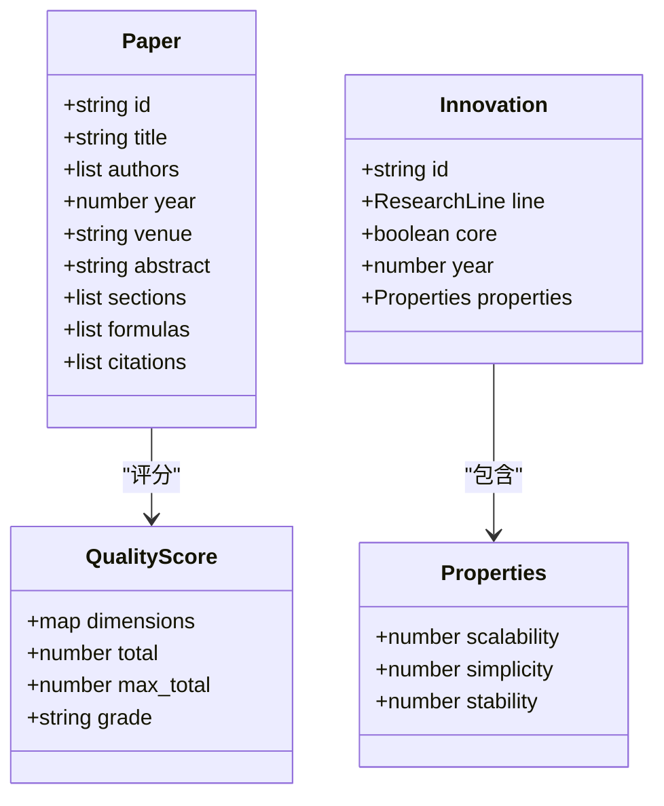
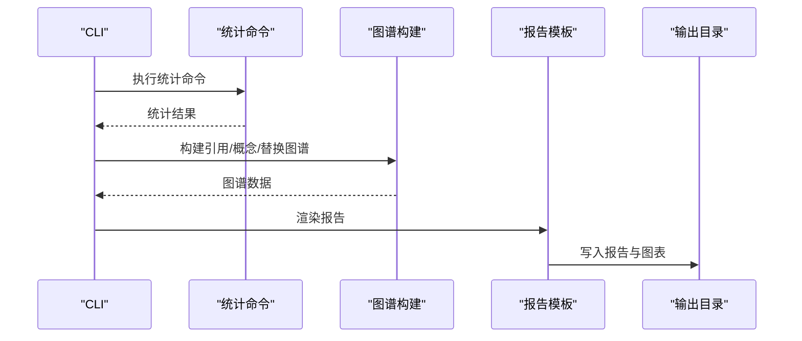
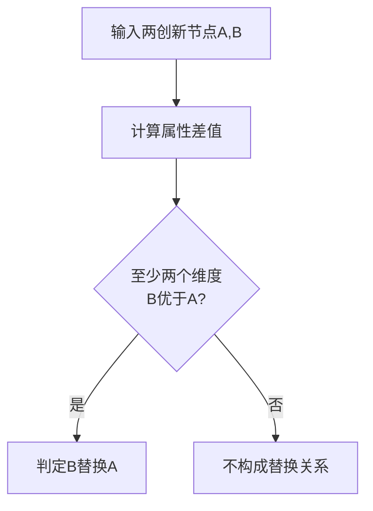
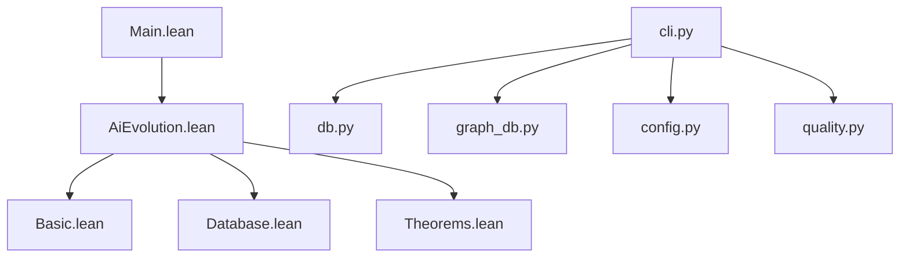

# 结果对比分析

<cite>
**本文档引用的文件**
- [Main.lean](file://LEAN/Main.lean)
- [AiEvolution.lean](file://LEAN/AiEvolution.lean)
- [Basic.lean](file://LEAN/AiEvolution/Basic.lean)
- [Database.lean](file://LEAN/AiEvolution/Database.lean)
- [Theorems.lean](file://LEAN/AiEvolution/Theorems.lean)
- [PDSS.lean](file://LEAN/AiEvolution/PDSS.lean)
- [db.py](file://scholar/db.py)
- [graph_db.py](file://scholar/graph_db.py)
- [config.py](file://scholar/config.py)
- [cli.py](file://scholar/cli.py)
- [stats.md](file://plugin/commands/stats.md)
- [find.md](file://plugin/commands/find.md)
- [quality.py](file://scholar/quality.py)
</cite>

## 目录
1. [引言](#引言)
2. [项目结构](#项目结构)
3. [核心组件](#核心组件)
4. [架构总览](#架构总览)
5. [详细组件分析](#详细组件分析)
6. [依赖分析](#依赖分析)
7. [性能考虑](#性能考虑)
8. [故障排除指南](#故障排除指南)
9. [结论](#结论)
10. [附录](#附录)

## 引言
本技术文档聚焦于“实验结果对比分析”模块的设计与实现，结合代码库中的形式化验证、知识图谱与研究工具链，系统阐述实验结果收集机制、数据格式标准化、统计分析方法、报告生成流程与可视化展示。文档同时覆盖结果数据存储、比较算法实现、差异检测技术、批量分析、自动化报告与结果归档管理，并提供阈值设置、异常处理与结果解读指南。

## 项目结构
该代码库采用多语言混合架构：
- 形式化验证层（Lean4）：定义创新节点、属性与替换关系，提供可证明的演进定理。
- 数据层（Python）：数据库与图数据库接口，负责论文解析、入库与查询。
- 工具层（Python/Typer CLI）：命令行工具，提供扫描、解析、统计、图谱构建与查询等功能。
- 插件与规则（Markdown）：提供命令描述与执行步骤，辅助自动化工作流。

**图表来源**
- [Main.lean:1-21](file://LEAN/Main.lean#L1-L21)
- [AiEvolution.lean:1-8](file://LEAN/AiEvolution.lean#L1-L8)
- [Basic.lean:1-65](file://LEAN/AiEvolution/Basic.lean#L1-L65)
- [Database.lean:1-756](file://LEAN/AiEvolution/Database.lean#L1-L756)
- [Theorems.lean:1-130](file://LEAN/AiEvolution/Theorems.lean#L1-L130)
- [PDSS.lean:1-239](file://LEAN/AiEvolution/PDSS.lean#L1-L239)
- [db.py:1-276](file://scholar/db.py#L1-L276)
- [graph_db.py:1-922](file://scholar/graph_db.py#L1-L922)
- [config.py:1-119](file://scholar/config.py#L1-L119)
- [cli.py:1-800](file://scholar/cli.py#L1-L800)
- [stats.md:1-10](file://plugin/commands/stats.md#L1-L10)
- [find.md:1-10](file://plugin/commands/find.md#L1-L10)
- [quality.py](file://scholar/quality.py)

**章节来源**
- [Main.lean:1-21](file://LEAN/Main.lean#L1-L21)
- [AiEvolution.lean:1-8](file://LEAN/AiEvolution.lean#L1-L8)
- [Basic.lean:1-65](file://LEAN/AiEvolution/Basic.lean#L1-L65)
- [Database.lean:1-756](file://LEAN/AiEvolution/Database.lean#L1-L756)
- [Theorems.lean:1-130](file://LEAN/AiEvolution/Theorems.lean#L1-L130)
- [PDSS.lean:1-239](file://LEAN/AiEvolution/PDSS.lean#L1-L239)
- [db.py:1-276](file://scholar/db.py#L1-L276)
- [graph_db.py:1-922](file://scholar/graph_db.py#L1-L922)
- [config.py:1-119](file://scholar/config.py#L1-L119)
- [cli.py:1-800](file://scholar/cli.py#L1-L800)
- [stats.md:1-10](file://plugin/commands/stats.md#L1-L10)
- [find.md:1-10](file://plugin/commands/find.md#L1-L10)
- [quality.py](file://scholar/quality.py)

## 核心组件
- 创新节点与属性模型：定义研究线、创新节点及其可量化属性（可扩展性、简洁性、稳定性），用于对比分析的基础数据结构。
- 形式化演进定理：通过可证明的数学定理，确保替换关系在至少两个维度上成立，为对比分析提供理论依据。
- 论文解析与存储：统一解析 TeX 源为结构化 JSON，支持入库与文件回退模式，保证实验结果可追溯。
- 图谱构建与查询：构建引用网络与概念图谱，支持基于形式化数据的替换关系同步，支撑跨维度对比。
- 统计质量评分：对论文的实验严谨性进行多维评分，辅助筛选高质量对比样本。
- CLI 工具链：提供扫描、解析、统计、图谱构建与查询等命令，支撑批量分析与自动化报告。

**章节来源**
- [Basic.lean:30-65](file://LEAN/AiEvolution/Basic.lean#L30-L65)
- [Theorems.lean:23-44](file://LEAN/AiEvolution/Theorems.lean#L23-L44)
- [db.py:79-176](file://scholar/db.py#L79-L176)
- [graph_db.py:371-440](file://scholar/graph_db.py#L371-L440)
- [quality.py:306-329](file://scholar/quality.py#L306-L329)
- [cli.py:421-477](file://scholar/cli.py#L421-L477)

## 架构总览
下图展示了从数据采集到对比分析与报告生成的端到端流程：

**图表来源**
- [cli.py:132-171](file://scholar/cli.py#L132-L171)
- [db.py:170-176](file://scholar/db.py#L170-L176)
- [graph_db.py:663-705](file://scholar/graph_db.py#L663-L705)
- [quality.py:317-329](file://scholar/quality.py#L317-L329)

## 详细组件分析

### 实验结果收集机制
- 批量解析：CLI 提供批量解析命令，遍历论文目录，调用解析器生成结构化 JSON，并写入数据库或文件系统。
- 入库策略：优先使用 PostgreSQL 存储论文元数据、章节、公式与引用；若不可用则回退至文件模式，确保实验结果可归档。
- 可选质量过滤：结合质量评分模块，筛选具备基准实验设计的论文，提升对比样本质量。

**图表来源**
- [cli.py:176-237](file://scholar/cli.py#L176-L237)
- [db.py:170-176](file://scholar/db.py#L170-L176)
- [quality.py:317-329](file://scholar/quality.py#L317-L329)

**章节来源**
- [cli.py:176-237](file://scholar/cli.py#L176-L237)
- [db.py:170-176](file://scholar/db.py#L170-L176)
- [quality.py:317-329](file://scholar/quality.py#L317-L329)

### 数据格式标准化
- 统一字段：论文 JSON 包含标题、作者、年份、会议、摘要、公式、章节与引用等字段，确保跨样本一致性。
- 属性映射：将形式化数据（如创新节点属性）映射到对比分析所需的数值型指标，便于统计计算。
- 版本控制：输出目录结构清晰，便于版本化归档与回溯。

**章节来源**
- [db.py:79-126](file://scholar/db.py#L79-L126)
- [config.py:23-42](file://scholar/config.py#L23-L42)

### 统计分析方法
- 质量维度评分：对元数据完整性、结构规范、引用质量、可复现性、问题定义、创新点与实验设计七个维度进行打分，形成综合质量等级。
- 实验设计识别：通过关键词匹配识别基准、指标、统计显著性、基线对比与结果呈现（表格/图表）等要素。
- 形式化对比：利用替换关系定理，确保对比的合法性与稳健性。

**图表来源**
- [Basic.lean:38-65](file://LEAN/AiEvolution/Basic.lean#L38-L65)
- [quality.py:306-329](file://scholar/quality.py#L306-L329)

**章节来源**
- [Basic.lean:30-65](file://LEAN/AiEvolution/Basic.lean#L30-L65)
- [quality.py:254-299](file://scholar/quality.py#L254-L299)
- [quality.py:306-329](file://scholar/quality.py#L306-L329)

### 报告生成流程
- 自动化命令：CLI 提供统计与图谱统计命令，输出覆盖率与规模信息，作为报告输入。
- 可视化集成：图谱构建完成后，可导出 HTML/图像，配合报告模板生成可视化对比图。
- 批量归档：输出目录包含实验、数据集、PDF、摘要与日志等子目录，便于长期归档与检索。

**图表来源**
- [cli.py:421-477](file://scholar/cli.py#L421-L477)
- [cli.py:663-705](file://scholar/cli.py#L663-L705)

**章节来源**
- [cli.py:421-477](file://scholar/cli.py#L421-L477)
- [cli.py:663-705](file://scholar/cli.py#L663-L705)
- [config.py:27-42](file://scholar/config.py#L27-L42)

### 结果数据存储
- 结构化存储：PostgreSQL 表结构包含论文、章节、公式与引用，支持高效查询与更新。
- 文件回退：当数据库不可用时，解析结果以 JSON 文件形式保存在输出目录，确保数据不丢失。
- 归档管理：输出目录按功能划分，便于批量备份与版本管理。

**章节来源**
- [db.py:24-74](file://scholar/db.py#L24-L74)
- [db.py:248-276](file://scholar/db.py#L248-L276)
- [config.py:27-42](file://scholar/config.py#L27-L42)

### 比较算法实现
- 替换关系判定：通过形式化定义的支配关系与严格优势关系，判断新旧方法在至少两个维度上的改进。
- 形式化证明：定理模块提供可编译验证的证明，确保比较结论的正确性与可追溯性。

**图表来源**
- [Theorems.lean:25-43](file://LEAN/AiEvolution/Theorems.lean#L25-L43)

**章节来源**
- [Theorems.lean:25-43](file://LEAN/AiEvolution/Theorems.lean#L25-L43)
- [Database.lean:733-753](file://LEAN/AiEvolution/Database.lean#L733-L753)

### 差异检测技术
- 引用网络中心性：计算入度、出度与桥接分数，识别跨领域连接的关键论文，辅助发现潜在差异来源。
- 概念共现：基于 TF-IDF 的概念抽取与共现边构建，识别研究主题演化中的差异路径。
- 形式化替换：直接使用替换关系同步 Lean4 数据库，确保差异检测的权威性与一致性。

**章节来源**
- [graph_db.py:180-223](file://scholar/graph_db.py#L180-L223)
- [graph_db.py:636-733](file://scholar/graph_db.py#L636-L733)
- [graph_db.py:794-806](file://scholar/graph_db.py#L794-L806)

### 可视化展示
- 图谱可视化：支持导出 HTML 与图像，展示引用网络、概念图谱与替换关系。
- 报表模板：CLI 支持生成包含统计数据与图谱摘要的报告，便于审阅与分享。

**章节来源**
- [cli.py:663-705](file://scholar/cli.py#L663-L705)
- [cli.py:711-791](file://scholar/cli.py#L711-L791)

### 统计显著性检验与误差分析
- 关键词识别：通过正则匹配识别显著性检验、p 值、置信区间、方差与均值等统计术语，辅助判断实验严谨性。
- 质量评分：将统计分析纳入质量维度，为后续显著性检验提供筛选依据。

**章节来源**
- [quality.py:284-287](file://scholar/quality.py#L284-L287)
- [quality.py:306-329](file://scholar/quality.py#L306-L329)

### 分析流程、阈值设置与异常处理
- 分析流程：扫描→解析→入库/保存→质量评分→图谱构建→报告生成。
- 阈值设置：质量评分维度权重与最高分值在评分函数中集中定义，便于统一标准。
- 异常处理：数据库连接失败时自动回退至文件模式；图谱构建过程中对未解析引用进行清理与重映射。

**章节来源**
- [cli.py:421-477](file://scholar/cli.py#L421-L477)
- [graph_db.py:108-177](file://scholar/graph_db.py#L108-L177)
- [db.py:32-44](file://scholar/db.py#L32-L44)

### 结果解读指南
- 维度权重：质量评分的各维度权重与最高分值明确，便于解释得分含义与等级划分。
- 形式化依据：替换关系定理为对比结论提供形式化保障，减少主观偏差。

**章节来源**
- [quality.py:306-329](file://scholar/quality.py#L306-L329)
- [Theorems.lean:17-129](file://LEAN/AiEvolution/Theorems.lean#L17-L129)

## 依赖分析
- 形式化验证依赖：主程序依赖 AiEvolution 库，后者进一步依赖 Basic、Database 与 Theorems 模块。
- 数据层依赖：CLI 依赖 db.py 与 graph_db.py，分别处理结构化存储与图谱操作。
- 配置与环境：config.py 提供数据库与图数据库连接参数，以及 arXiv 请求工具。

**图表来源**
- [Main.lean:1-8](file://LEAN/Main.lean#L1-L8)
- [AiEvolution.lean:1-8](file://LEAN/AiEvolution.lean#L1-L8)
- [Basic.lean:1-8](file://LEAN/AiEvolution/Basic.lean#L1-L8)
- [Database.lean:1-12](file://LEAN/AiEvolution/Database.lean#L1-L12)
- [Theorems.lean:10-14](file://LEAN/AiEvolution/Theorems.lean#L10-L14)
- [cli.py:19-30](file://scholar/cli.py#L19-L30)
- [db.py:12-22](file://scholar/db.py#L12-L22)
- [graph_db.py:17-30](file://scholar/graph_db.py#L17-L30)
- [config.py:8-18](file://scholar/config.py#L8-L18)
- [quality.py](file://scholar/quality.py)

**章节来源**
- [Main.lean:1-8](file://LEAN/Main.lean#L1-L8)
- [AiEvolution.lean:1-8](file://LEAN/AiEvolution.lean#L1-L8)
- [Basic.lean:1-8](file://LEAN/AiEvolution/Basic.lean#L1-L8)
- [Database.lean:1-12](file://LEAN/AiEvolution/Database.lean#L1-L12)
- [Theorems.lean:10-14](file://LEAN/AiEvolution/Theorems.lean#L10-L14)
- [cli.py:19-30](file://scholar/cli.py#L19-L30)
- [db.py:12-22](file://scholar/db.py#L12-L22)
- [graph_db.py:17-30](file://scholar/graph_db.py#L17-L30)
- [config.py:8-18](file://scholar/config.py#L8-L18)
- [quality.py](file://scholar/quality.py)

## 性能考虑
- 批处理与批写入：解析与图谱构建采用批处理策略，减少 I/O 开销。
- 数据库事务：入库操作在事务内完成，失败自动回滚，避免部分写入。
- 回退机制：数据库不可用时自动切换至文件模式，保证系统可用性。

[本节为通用指导，无需特定文件分析]

## 故障排除指南
- 数据库连接失败：检查连接参数与服务状态；确认导入模块可用性。
- 图谱构建异常：核对引用解析与重映射逻辑，清理孤立节点。
- 解析失败：检查 TeX 源完整性与解析器兼容性。

**章节来源**
- [db.py:32-44](file://scholar/db.py#L32-L44)
- [graph_db.py:108-177](file://scholar/graph_db.py#L108-L177)
- [cli.py:168-170](file://scholar/cli.py#L168-L170)

## 结论
本模块通过形式化验证、结构化存储与图谱分析，实现了从实验结果收集到对比分析与报告生成的完整闭环。质量评分与替换关系定理为对比结论提供了客观依据，批量命令与归档机制确保了可重复性与可追溯性。建议在实际应用中结合阈值设置与异常处理策略，持续优化对比流程与报告质量。

[本节为总结性内容，无需特定文件分析]

## 附录
- 命令参考：统计命令与图谱统计命令用于快速查看知识库状态与规模。
- 搜索与检索：提供全文搜索与语义搜索命令，辅助定位相关论文。

**章节来源**
- [stats.md:1-10](file://plugin/commands/stats.md#L1-L10)
- [find.md:1-10](file://plugin/commands/find.md#L1-L10)
- [cli.py:311-370](file://scholar/cli.py#L311-L370)
- [cli.py:797-806](file://scholar/cli.py#L797-L806)