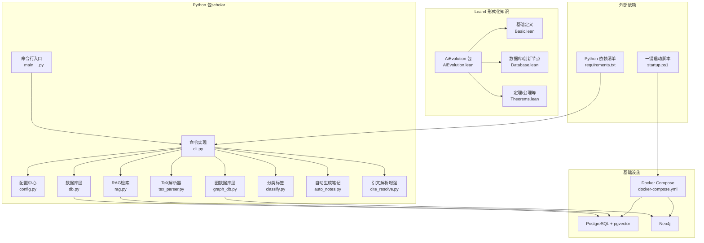
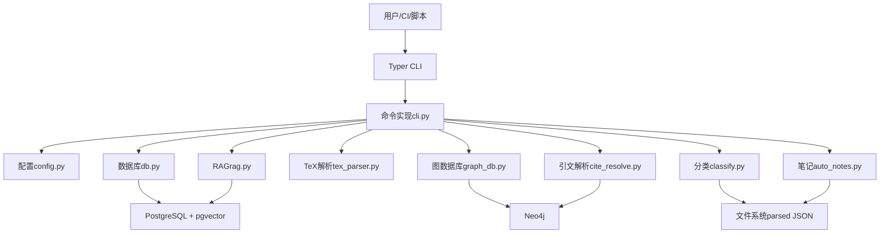
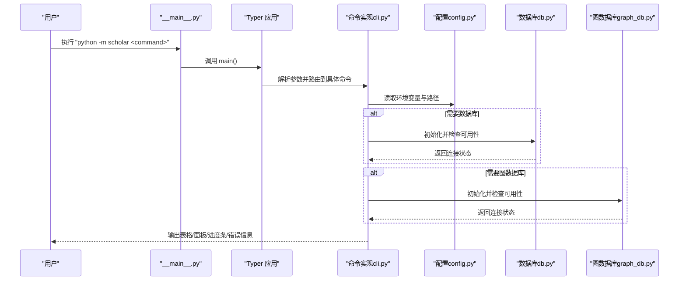
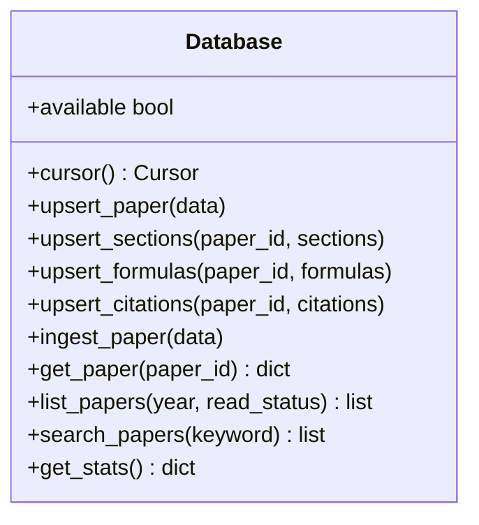
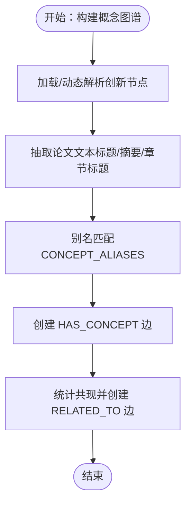
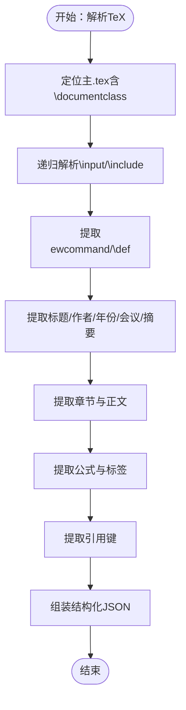
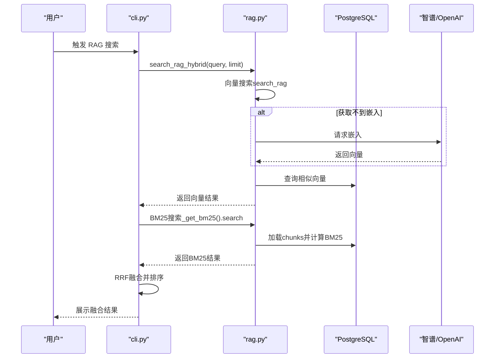
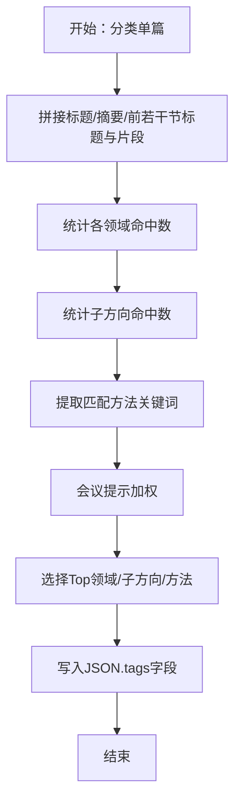
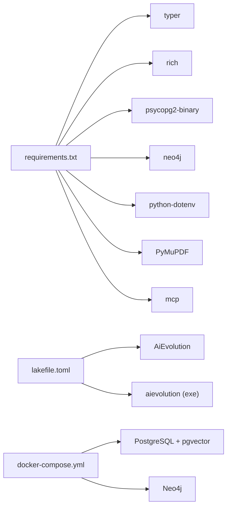

# 开发者指南

<cite>
**本文档引用的文件**
- [README.md](file://LEAN/README.md)
- [lakefile.toml](file://LEAN/lakefile.toml)
- [startup.ps1](file://startup.ps1)
- [docker-compose.yml](file://infra/docker-compose.yml)
- [requirements.txt](file://requirements.txt)
- [__main__.py](file://scholar/__main__.py)
- [cli.py](file://scholar/cli.py)
- [config.py](file://scholar/config.py)
- [db.py](file://scholar/db.py)
- [graph_db.py](file://scholar/graph_db.py)
- [tex_parser.py](file://scholar/tex_parser.py)
- [rag.py](file://scholar/rag.py)
- [classify.py](file://scholar/classify.py)
- [auto_notes.py](file://scholar/auto_notes.py)
- [cite_resolve.py](file://scholar/cite_resolve.py)
</cite>

## 目录
1. [简介](#简介)
2. [项目结构](#项目结构)
3. [核心组件](#核心组件)
4. [架构总览](#架构总览)
5. [详细组件分析](#详细组件分析)
6. [依赖关系分析](#依赖关系分析)
7. [性能考虑](#性能考虑)
8. [故障排查指南](#故障排查指南)
9. [结论](#结论)
10. [附录](#附录)

## 简介
本指南面向希望参与“学术研究工具套件（Scholar Studio）”开发的工程师，覆盖开发环境搭建、代码结构与职责划分、贡献流程、接口规范与扩展机制、编码与测试策略、代码审查要求、架构设计原则与设计模式、重构策略、新功能开发模板、调试与性能分析方法、第三方库集成与API扩展、插件开发规范，以及常见问题与最佳实践。

## 项目结构
项目采用多语言混合架构：Lean4用于形式化知识与推理（AiEvolution），Python用于数据处理、数据库与图谱、RAG检索、命令行工具与自动化任务。基础设施通过Docker编排，提供PostgreSQL+pgvector与Neo4j服务。

图表来源
- [__main__.py](file://scholar/__main__.py)
- [cli.py](file://scholar/cli.py)
- [config.py](file://scholar/config.py)
- [db.py](file://scholar/db.py)
- [graph_db.py](file://scholar/graph_db.py)
- [tex_parser.py](file://scholar/tex_parser.py)
- [rag.py](file://scholar/rag.py)
- [classify.py](file://scholar/classify.py)
- [auto_notes.py](file://scholar/auto_notes.py)
- [cite_resolve.py](file://scholar/cite_resolve.py)
- [docker-compose.yml](file://infra/docker-compose.yml)
- [startup.ps1](file://startup.ps1)
- [requirements.txt](file://requirements.txt)
- [lakefile.toml](file://LEAN/lakefile.toml)

章节来源
- [README.md](file://LEAN/README.md)
- [lakefile.toml](file://LEAN/lakefile.toml)
- [startup.ps1](file://startup.ps1)
- [docker-compose.yml](file://infra/docker-compose.yml)
- [requirements.txt](file://requirements.txt)

## 核心组件
- 命令行入口与命令集：提供扫描、解析、搜索、统计、导出、作者修复、arXiv搜索、图谱构建与统计、RAG索引与混合检索等子命令。
- 配置中心：集中管理路径、数据库连接参数、嵌入模型与API密钥、LaTeX编译器、Lean项目目录等。
- 数据层：封装PostgreSQL/psycopg2，支持文件回退模式；提供论文、章节、公式、引用的增删改查与全文检索。
- 图数据库层：封装Neo4j驱动，构建与查询引文网络、概念图谱、Lean4替换关系，计算中心性指标。
- TeX解析器：从压缩包或目录解析TeX源，提取标题、作者、年份、摘要、章节、公式、引用，支持宏展开与输入文件递归解析。
- RAG模块：分块策略、向量化（智谱/OpenAI）、向量存储与索引、BM25关键词检索、向量+BM25的RRF融合检索。
- 分类与标签：基于规则与关键词匹配的多级标签体系，输出到JSON。
- 自动生成笔记：从解析后的JSON生成结构化Markdown阅读笔记。
- 引文解析增强：内部匹配（编辑距离/词重叠）与arXiv外部解析，创建外部论文节点并建立引文边。

章节来源
- [__main__.py](file://scholar/__main__.py)
- [cli.py](file://scholar/cli.py)
- [config.py](file://scholar/config.py)
- [db.py](file://scholar/db.py)
- [graph_db.py](file://scholar/graph_db.py)
- [tex_parser.py](file://scholar/tex_parser.py)
- [rag.py](file://scholar/rag.py)
- [classify.py](file://scholar/classify.py)
- [auto_notes.py](file://scholar/auto_notes.py)
- [cite_resolve.py](file://scholar/cite_resolve.py)

## 架构总览
系统采用“命令行工具 + 多后端存储”的分层架构：
- 表现层：Typer命令行，提供用户交互与批处理能力。
- 业务层：解析、分类、RAG、图谱、笔记生成等核心算法模块。
- 数据访问层：PostgreSQL（文件回退）、Neo4j、文件系统（parsed JSON）。
- 基础设施层：Docker容器编排，提供数据库与图数据库服务。

图表来源
- [cli.py](file://scholar/cli.py)
- [config.py](file://scholar/config.py)
- [db.py](file://scholar/db.py)
- [graph_db.py](file://scholar/graph_db.py)
- [tex_parser.py](file://scholar/tex_parser.py)
- [rag.py](file://scholar/rag.py)
- [classify.py](file://scholar/classify.py)
- [auto_notes.py](file://scholar/auto_notes.py)
- [cite_resolve.py](file://scholar/cite_resolve.py)

## 详细组件分析

### 命令行与CLI工作流
- 入口：通过模块入口调用Typer应用，注册各类命令。
- 工作流：命令根据需要加载配置、连接数据库/图数据库、执行解析或查询、输出结果或写入文件。

图表来源
- [__main__.py](file://scholar/__main__.py)
- [cli.py](file://scholar/cli.py)
- [config.py](file://scholar/config.py)
- [db.py](file://scholar/db.py)
- [graph_db.py](file://scholar/graph_db.py)

章节来源
- [__main__.py](file://scholar/__main__.py)
- [cli.py](file://scholar/cli.py)

### 数据库层（PostgreSQL + pgvector）
- 功能：提供论文、章节、公式、引用的增删改查；全文检索；统计查询；文件回退模式。
- 设计要点：惰性连接、上下文管理事务、UPSERT策略、批量插入、游标复用。
- 错误处理：导入失败时返回不可用；连接异常时回退至文件模式。

图表来源
- [db.py](file://scholar/db.py)

章节来源
- [db.py](file://scholar/db.py)

### 图数据库层（Neo4j）
- 功能：构建引文网络、概念图谱、Lean4替换关系；计算中心性；查询统计。
- 设计要点：驱动懒加载、会话管理、批量写入、Cypher查询封装、节点/边清理。
- 算法：模糊标题匹配（编辑距离/词重叠）、TF-IDF式概念抽取、共现边构建。

图表来源
- [graph_db.py](file://scholar/graph_db.py)

章节来源
- [graph_db.py](file://scholar/graph_db.py)

### TeX解析器
- 功能：从压缩包/目录解析TeX源，递归解析\input/\include，提取元数据与结构化内容。
- 设计要点：正则模式组织、宏定义解析、输入文件解析树、格式化命令清洗、作者/年份/会议/arXiv识别、公式与引用抽取。
- 复杂度：解析过程受文件数量与大小影响，建议批处理与缓存中间结果。

图表来源
- [tex_parser.py](file://scholar/tex_parser.py)

章节来源
- [tex_parser.py](file://scholar/tex_parser.py)

### RAG检索与索引
- 功能：分块策略、嵌入生成（智谱/OpenAI）、向量存储与HNSW索引、BM25关键词检索、向量+BM25的RRF融合。
- 设计要点：分块保留语义边界、嵌入批量请求、索引按需创建、RRF融合提升召回与排序稳定性。

图表来源
- [cli.py](file://scholar/cli.py)
- [rag.py](file://scholar/rag.py)

章节来源
- [rag.py](file://scholar/rag.py)

### 分类与标签
- 功能：多级标签体系（领域/子方向/方法），基于关键词与会议提示进行打标，并写回JSON。
- 设计要点：关键词权重、会议提示加权、去重与截断、批量处理与统计。

图表来源
- [classify.py](file://scholar/classify.py)

章节来源
- [classify.py](file://scholar/classify.py)

### 自动生成笔记
- 功能：从解析JSON生成结构化Markdown笔记，包含摘要、贡献、方法概览、关键公式、章节树、引用汇总。
- 设计要点：句子提取、贡献句模式匹配、方法段落定位、公式评分与筛选、批量生成与覆盖控制。

章节来源
- [auto_notes.py](file://scholar/auto_notes.py)

### 引文解析增强
- 功能：内部匹配（编辑距离/词重叠）与arXiv外部解析，创建ExternalPaper节点并建立CITES边。
- 设计要点：ref_key收集、模糊匹配阈值、arXiv查询与相似度校验、Neo4j批量创建。

章节来源
- [cite_resolve.py](file://scholar/cite_resolve.py)

## 依赖关系分析
- Python依赖：通过requirements.txt声明，包括Typer、Rich、psycopg2、neo4j、dotenv、PyMuPDF、mcp等。
- Lean4包：通过lakefile.toml声明，包含AiEvolution库与可执行目标。
- 基础设施：Docker Compose编排PostgreSQL（pgvector扩展）与Neo4j，提供健康检查与持久化卷。

图表来源
- [requirements.txt](file://requirements.txt)
- [lakefile.toml](file://LEAN/lakefile.toml)
- [docker-compose.yml](file://infra/docker-compose.yml)

章节来源
- [requirements.txt](file://requirements.txt)
- [lakefile.toml](file://LEAN/lakefile.toml)
- [docker-compose.yml](file://infra/docker-compose.yml)

## 性能考虑
- 批处理与并发
  - RAG嵌入：按批次请求，减少API调用次数与超时风险。
  - Neo4j批量写入：使用UNWIND与批量提交，降低网络往返。
  - PostgreSQL批量插入：使用ON CONFLICT UPSERT与批量INSERT，减少事务开销。
- 索引与检索
  - pgvector HNSW索引：在向量列上创建索引，加速余弦距离近邻搜索。
  - BM25轻量实现：基于内存索引，适合快速关键词检索与离线构建。
- 内存与I/O
  - 解析大文件时避免一次性读取全部内容，采用流式或分块处理。
  - 使用临时目录与上下文管理器，确保资源释放。
- 可观测性
  - 使用Rich进度条与日志记录，监控批处理进度与错误率。

## 故障排查指南
- 数据库连接失败
  - 现象：Database.available为False，命令回退到文件模式。
  - 排查：确认psycopg2安装、主机/端口/凭据配置正确；查看Docker服务状态。
- 图数据库连接失败
  - 现象：GraphDB不可用，图谱相关命令报错。
  - 排查：确认Neo4j服务健康、认证信息正确；检查网络连通性。
- RAG嵌入失败
  - 现象：嵌入为空，向量检索无结果。
  - 排查：检查EMBEDDING_PROVIDER/API_KEY配置；确认网络可达；查看API响应。
- TeX解析异常
  - 现象：找不到主.tex或宏未解析。
  - 排查：确认压缩包内存在\documentclass所在文件；检查宏定义与输入文件路径。
- 引文解析未命中
  - 现象：部分ref_key无法解析为内部或外部论文。
  - 排查：调整模糊匹配阈值；扩大arXiv查询限制；检查Neo4j外部节点创建。

章节来源
- [db.py](file://scholar/db.py)
- [graph_db.py](file://scholar/graph_db.py)
- [rag.py](file://scholar/rag.py)
- [tex_parser.py](file://scholar/tex_parser.py)
- [cite_resolve.py](file://scholar/cite_resolve.py)

## 结论
本项目通过清晰的分层架构与模块化设计，实现了从TeX解析、结构化入库、RAG检索、图谱构建到自动笔记生成的完整学术研究辅助流水线。建议在新增功能时遵循“配置优先、模块解耦、批处理优化、可观测性”的原则，并结合CI/CD与Docker编排保障一致性与可移植性。

## 附录

### 开发环境搭建步骤
- 安装Python依赖
  - 在项目根目录执行：pip install -r requirements.txt
- 配置环境变量
  - 复制.env.example为.env，填写数据库与嵌入API密钥等参数。
- 启动基础设施
  - 在项目根目录执行：.\startup.ps1（Windows PowerShell）
  - 或使用Docker Compose：docker compose -f infra/docker-compose.yml up -d
- 验证服务
  - 查看PostgreSQL与Neo4j健康状态，确认端口映射正常。
- 运行命令
  - 示例：python -m scholar stats、python -m scholar scan、python -m scholar parse <ULID>

章节来源
- [startup.ps1](file://startup.ps1)
- [docker-compose.yml](file://infra/docker-compose.yml)
- [requirements.txt](file://requirements.txt)
- [config.py](file://scholar/config.py)

### 贡献流程
- 分支策略
  - 主分支保护，功能开发在特性分支完成。
- 提交流程
  - 提交前运行静态检查与单元测试（如适用）。
  - 提交信息遵循约定式提交风格。
- 代码审查
  - 至少一名维护者审查；关注模块职责、错误处理、性能与可测试性。

### 接口规范与扩展机制
- 命令扩展
  - 在cli.py中注册新命令，遵循现有参数与输出风格。
- 数据层扩展
  - 新增表或视图时，补充db.py中的增删改查方法与事务封装。
- 图数据库扩展
  - 新建Cypher查询时，封装为独立函数并提供类型化返回。
- 插件/模块化
  - 将通用逻辑拆分为独立模块（如新的解析器、检索策略），保持低耦合高内聚。

### 编码标准
- 命名规范
  - 模块使用下划线命名；类使用驼峰；常量全大写。
- 文档注释
  - 关键函数/类提供简明文档字符串，说明输入、输出与异常。
- 错误处理
  - 明确区分可恢复与不可恢复错误；对外暴露统一的错误消息与状态码。
- 日志与输出
  - 使用Console输出结构化信息；避免在生产环境打印调试日志。

### 测试策略
- 单元测试
  - 对解析器、检索器、分类器的关键函数编写小而精的测试用例。
- 集成测试
  - 覆盖从解析到入库再到查询的端到端流程。
- 回归测试
  - 对已知论文样例进行回归，确保解析与检索稳定性。

### 代码审查要求
- 可读性：函数长度适中、命名清晰、注释充分。
- 正确性：边界条件、空值、异常路径覆盖。
- 性能：避免不必要的循环与IO；合理使用批处理。
- 安全：输入校验、SQL注入防护、API密钥安全存储。

### 架构设计原则与设计模式
- 分层与解耦：表现层、业务层、数据访问层分离。
- 配置即代码：通过环境变量与配置文件集中管理外部依赖。
- 批处理优先：对大规模数据操作采用批量与异步策略。
- 可观测性：进度条、统计面板、错误日志与健康检查。

### 重构策略
- 渐进式重构：先添加测试，再逐步拆分大函数与重复逻辑。
- 抽象公共行为：将跨模块的通用逻辑抽象为工具函数或服务类。
- 版本兼容：对公共接口变更提供迁移指南与过渡期支持。

### 新功能开发模板
- 需求分析：明确输入/输出、性能与可靠性要求。
- 设计评审：绘制数据流图与序列图，确定模块边界。
- 实现步骤：
  - 新增模块文件，定义接口与数据结构。
  - 实现核心算法，保证错误处理与边界条件。
  - 编写CLI命令，接入Typer应用。
  - 添加测试与文档。
- 集成与发布：更新依赖与配置，进行端到端验证。

### 调试技巧
- 使用Rich控制台输出表格与面板，便于观察中间结果。
- 对大文件解析与批处理操作，分段打印进度与统计。
- 利用Docker日志与健康检查定位服务异常。

### 性能分析方法
- 基准测试：对解析器、检索器与批处理函数进行基准对比。
- 指标采集：记录吞吐量、延迟、错误率与资源占用。
- 优化手段：索引优化、批处理、缓存热点数据、减少网络往返。

### 第三方库集成指南
- Python库：通过requirements.txt统一管理；在config.py中集中配置参数。
- 数据库扩展：pgvector通过PostgreSQL扩展启用；注意版本兼容。
- 图数据库：Neo4j驱动按需加载；提供健康检查与连接池策略。

### API扩展方法
- 新增命令：在cli.py中注册新命令，复用现有数据库/图数据库/配置模块。
- 新增检索策略：在rag.py中新增检索函数，保持与现有接口一致。
- 新增解析器：在tex_parser.py中扩展正则与解析逻辑，确保向后兼容。

### 插件开发规范
- 模块化：每个插件负责单一职责，避免全局副作用。
- 配置化：通过环境变量或配置文件控制插件行为。
- 可测试：为插件提供最小可运行示例与测试用例。