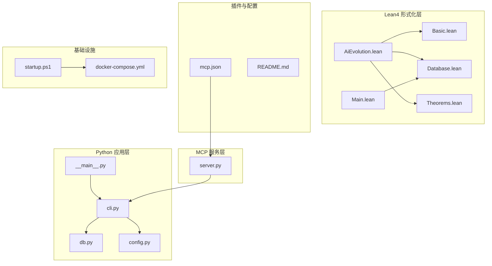
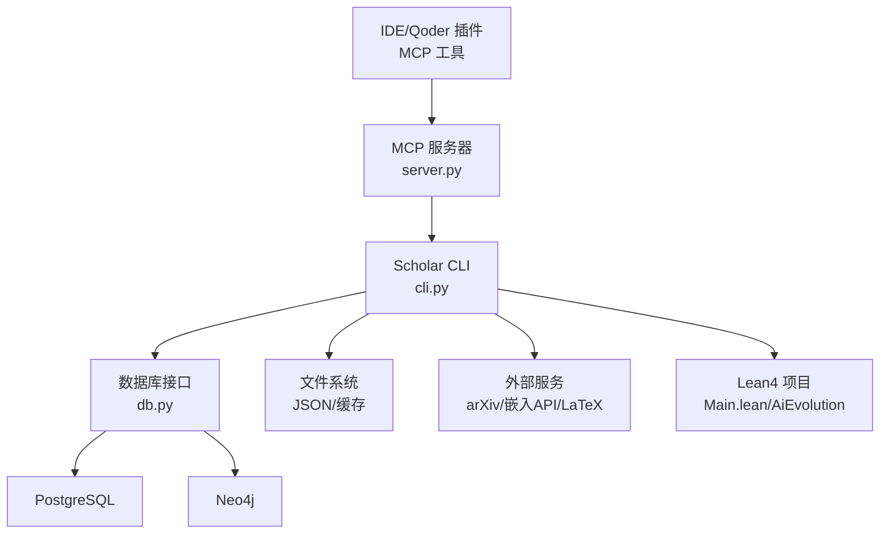
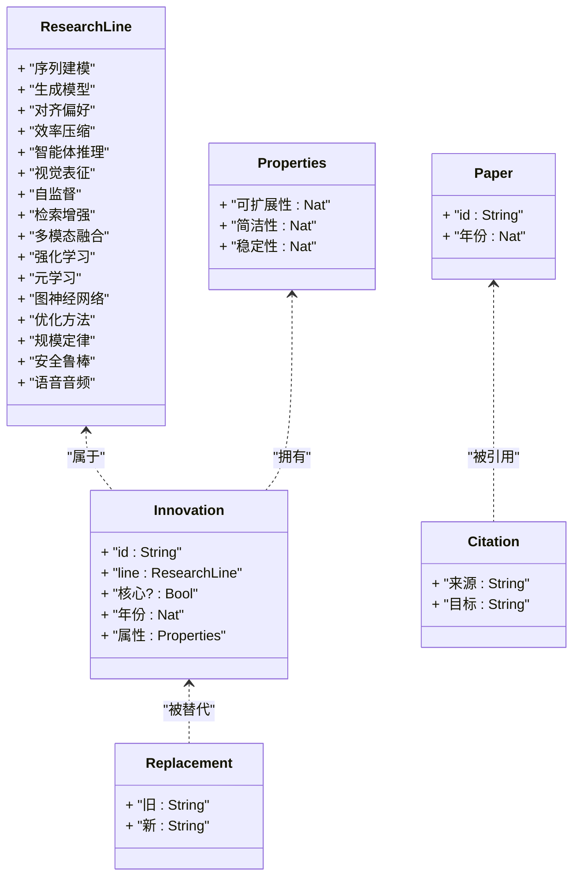
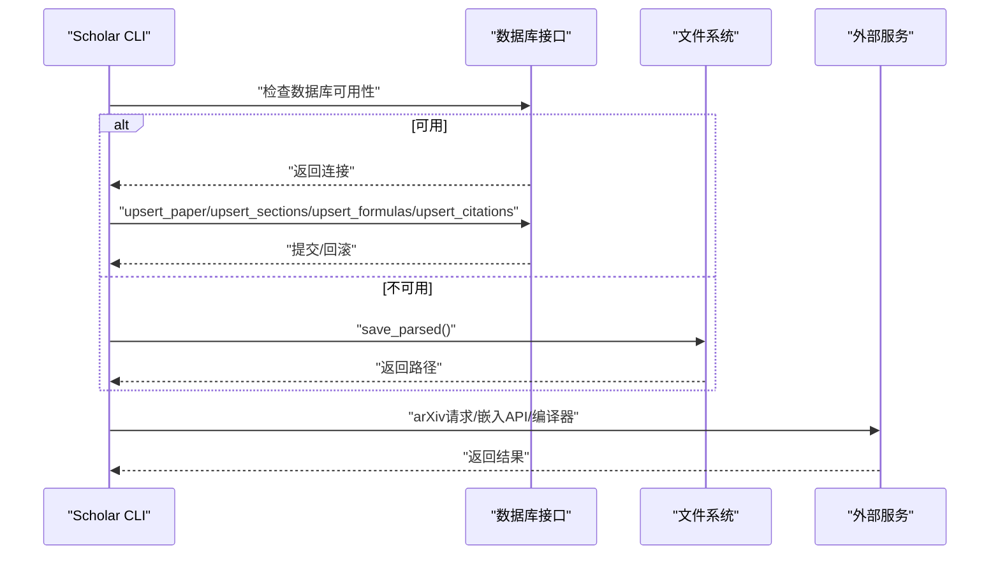
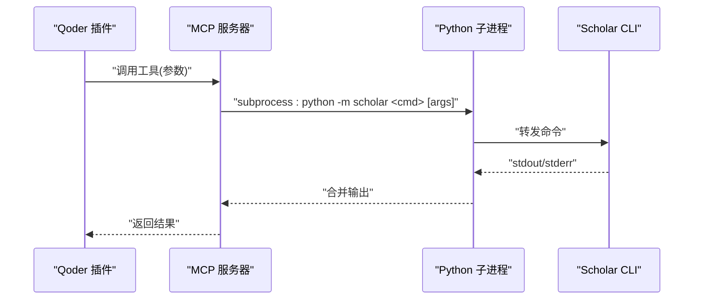
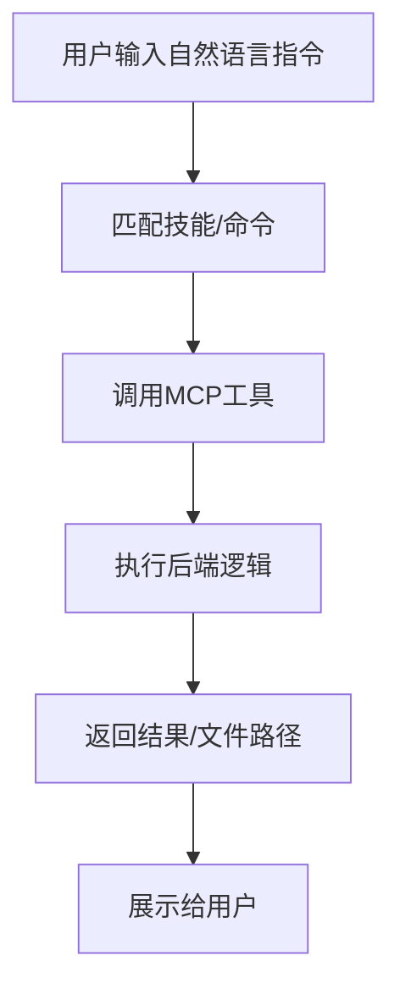
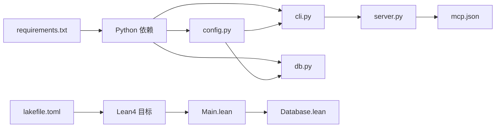

# 代码架构与设计

<cite>
**本文档引用的文件**
- [Main.lean](file://LEAN/Main.lean)
- [AiEvolution.lean](file://LEAN/AiEvolution.lean)
- [Basic.lean](file://LEAN/AiEvolution/Basic.lean)
- [Database.lean](file://LEAN/AiEvolution/Database.lean)
- [Theorems.lean](file://LEAN/AiEvolution/Theorems.lean)
- [lakefile.toml](file://LEAN/lakefile.toml)
- [__main__.py](file://scholar/__main__.py)
- [cli.py](file://scholar/cli.py)
- [db.py](file://scholar/db.py)
- [config.py](file://scholar/config.py)
- [server.py](file://scholar_mcp/server.py)
- [mcp.json](file://plugin/mcp.json)
- [README.md](file://plugin/README.md)
- [requirements.txt](file://requirements.txt)
- [startup.ps1](file://startup.ps1)
</cite>

## 目录
1. [简介](#简介)
2. [项目结构](#项目结构)
3. [核心组件](#核心组件)
4. [架构总览](#架构总览)
5. [详细组件分析](#详细组件分析)
6. [依赖分析](#依赖分析)
7. [性能考虑](#性能考虑)
8. [故障排除指南](#故障排除指南)
9. [结论](#结论)
10. [附录](#附录)

## 简介
本项目是一个融合多技术栈的学术研究与知识管理平台，围绕“AI演进的形式化验证系统”展开，采用模块化与分层架构设计，结合Lean4的形式化证明、Python的数据处理与服务层、以及MCP协议实现的插件化扩展。系统通过CLI驱动核心功能，同时提供MCP服务器以在IDE环境中作为原生工具调用，形成“插件-后端-数据库”的协同工作流。

## 项目结构
项目采用按技术栈分层与按功能域解耦的组织方式：
- LEAN：形式化验证与数学模型层，包含类型定义、数据库事实与定理证明。
- scholar：Python应用层，负责CLI、数据库访问、文件系统操作、外部服务集成。
- scholar_mcp：基于MCP协议的服务封装，将CLI能力暴露为MCP工具。
- plugin：Qoder插件配置与技能定义，声明式地描述工作流与规则。
- infra：基础设施与容器编排，提供PostgreSQL与Neo4j服务。
- data/docs：数据与文档资源。

图表来源
- [AiEvolution.lean:1-7](file://LEAN/AiEvolution.lean#L1-L7)
- [Basic.lean:1-65](file://LEAN/AiEvolution/Basic.lean#L1-L65)
- [Database.lean:1-756](file://LEAN/AiEvolution/Database.lean#L1-L756)
- [Theorems.lean:1-168](file://LEAN/AiEvolution/Theorems.lean#L1-L168)
- [Main.lean:1-21](file://LEAN/Main.lean#L1-L21)
- [__main__.py:1-8](file://scholar/__main__.py#L1-L8)
- [cli.py:1-800](file://scholar/cli.py#L1-L800)
- [db.py:1-276](file://scholar/db.py#L1-L276)
- [config.py:1-116](file://scholar/config.py#L1-L116)
- [server.py:1-573](file://scholar_mcp/server.py#L1-L573)
- [mcp.json:1-16](file://plugin/mcp.json#L1-L16)
- [README.md:1-79](file://plugin/README.md#L1-L79)
- [startup.ps1:1-65](file://startup.ps1#L1-L65)

章节来源
- [Main.lean:1-21](file://LEAN/Main.lean#L1-L21)
- [AiEvolution.lean:1-7](file://LEAN/AiEvolution.lean#L1-L7)
- [__main__.py:1-8](file://scholar/__main__.py#L1-L8)
- [cli.py:1-800](file://scholar/cli.py#L1-L800)
- [db.py:1-276](file://scholar/db.py#L1-L276)
- [config.py:1-116](file://scholar/config.py#L1-L116)
- [server.py:1-573](file://scholar_mcp/server.py#L1-L573)
- [mcp.json:1-16](file://plugin/mcp.json#L1-L16)
- [README.md:1-79](file://plugin/README.md#L1-L79)
- [startup.ps1:1-65](file://startup.ps1#L1-L65)

## 核心组件
- Lean4形式化层
  - 类型与结构：研究线、创新节点、论文、引用与替代关系等基础数据结构。
  - 数据库事实：包含125个创新节点与417篇论文的事实数据库。
  - 定理证明：针对替代关系的严格形式化证明，确保演进方向的可验证性。
- Python应用层
  - CLI命令集：扫描、解析、查询、统计、导出、arXiv搜索、图谱构建与统计、RAG索引与检索、元数据补全等。
  - 数据库接口：PostgreSQL访问与文件回退模式，统一论文、章节、公式、引用的增删改查。
  - 配置中心：集中管理路径、服务端口、嵌入模型参数、LaTeX编译器、Lean项目路径等。
- MCP服务层
  - 工具封装：将CLI命令映射为MCP工具，支持超时控制与错误合并输出。
  - 运行时集成：通过mcp.json声明MCP服务器，注入环境变量以连接数据库与图数据库。
- 插件与工作流
  - 技能与规则：声明式工作流、原子技能、规则与钩子，指导AI在IDE中的具体行动。
  - 与后端协作：插件负责“做什么、怎么做”，后端负责“执行”。

章节来源
- [Basic.lean:1-65](file://LEAN/AiEvolution/Basic.lean#L1-L65)
- [Database.lean:1-756](file://LEAN/AiEvolution/Database.lean#L1-L756)
- [Theorems.lean:1-168](file://LEAN/AiEvolution/Theorems.lean#L1-L168)
- [cli.py:1-800](file://scholar/cli.py#L1-L800)
- [db.py:1-276](file://scholar/db.py#L1-L276)
- [config.py:1-116](file://scholar/config.py#L1-L116)
- [server.py:1-573](file://scholar_mcp/server.py#L1-L573)
- [mcp.json:1-16](file://plugin/mcp.json#L1-L16)
- [README.md:1-79](file://plugin/README.md#L1-L79)

## 架构总览
系统采用“分层架构 + 插件化扩展”的设计原则：
- 表示层：MCP工具与IDE交互；CLI用于命令行场景。
- 业务层：Python CLI命令与MCP工具封装，协调数据处理、图谱构建、RAG索引与检索。
- 数据层：PostgreSQL存储结构化数据，Neo4j存储图谱，文件系统保存中间产物与缓存。
- 形式化层：Lean4提供严格的数学模型与定理证明，作为演进方向的权威依据。

图表来源
- [server.py:1-573](file://scholar_mcp/server.py#L1-L573)
- [cli.py:1-800](file://scholar/cli.py#L1-L800)
- [db.py:1-276](file://scholar/db.py#L1-L276)
- [Main.lean:1-21](file://LEAN/Main.lean#L1-L21)
- [AiEvolution.lean:1-7](file://LEAN/AiEvolution.lean#L1-L7)

## 详细组件分析

### Lean4 形式化层
- 设计要点
  - 研究线分类：将AI演进划分为16个研究线，覆盖序列建模、生成模型、对齐偏好、效率压缩、智能体推理、视觉表征、自监督、检索增强、多模态融合、强化学习、元学习、图神经网络、优化方法、规模定律、安全鲁棒、语音音频。
  - 创新节点属性：每个创新节点包含可量化属性（可扩展性、简洁性、稳定性），便于比较与排序。
  - 数据库事实：内置125个创新节点与417篇论文的事实集合，并给出关键引用与替代关系。
  - 定理证明：针对替代关系的严格形式化证明，确保“新方法在至少两个维度优于旧方法”的断言成立。
- 关键流程
  - 主程序入口：打印统计信息与证明状态，展示各架构的属性值。
  - 模块组织：根模块聚合基础、数据库与定理模块，形成清晰的层次结构。

图表来源
- [Basic.lean:10-65](file://LEAN/AiEvolution/Basic.lean#L10-L65)
- [Database.lean:17-756](file://LEAN/AiEvolution/Database.lean#L17-L756)

章节来源
- [Basic.lean:1-65](file://LEAN/AiEvolution/Basic.lean#L1-L65)
- [Database.lean:1-756](file://LEAN/AiEvolution/Database.lean#L1-L756)
- [Theorems.lean:1-168](file://LEAN/AiEvolution/Theorems.lean#L1-L168)
- [Main.lean:1-21](file://LEAN/Main.lean#L1-L21)
- [AiEvolution.lean:1-7](file://LEAN/AiEvolution.lean#L1-L7)
- [lakefile.toml:1-11](file://LEAN/lakefile.toml#L1-L11)

### Python 应用层（CLI与数据库）
- 设计要点
  - CLI命令：围绕“扫描、解析、查询、统计、导出、arXiv搜索、图谱构建与统计、RAG索引与检索、元数据补全、批处理预处理、质量评分、分类、引导初始化、知识库更新、实验执行”等能力展开。
  - 数据库接口：统一PostgreSQL访问，支持连接可用性检测、事务上下文、UPSERT策略与查询封装。
  - 文件回退：当数据库不可用时，自动回退到文件系统读写，保证离线可用性。
  - 配置中心：集中管理路径、服务端口、嵌入模型参数、LaTeX编译器、Lean项目路径等。
- 关键流程
  - 解析流程：扫描论文目录，解析TeX源码为结构化JSON，保存至数据库或文件系统，并可选入库。
  - 查询流程：优先使用数据库全文检索，否则回退到JSON文件遍历与评分。
  - 图谱构建：连接Neo4j，构建引用网络、概念图谱、替换关系，并同步Lean4替换事实。
  - RAG流程：基于向量嵌入构建索引，支持混合检索与语义检索。

图表来源
- [cli.py:132-171](file://scholar/cli.py#L132-L171)
- [db.py:24-276](file://scholar/db.py#L24-L276)

章节来源
- [cli.py:1-800](file://scholar/cli.py#L1-L800)
- [db.py:1-276](file://scholar/db.py#L1-L276)
- [config.py:1-116](file://scholar/config.py#L1-L116)

### MCP 服务层（插件桥接）
- 设计要点
  - 工具封装：将CLI命令映射为MCP工具，统一超时控制与错误合并输出。
  - 运行时集成：通过mcp.json声明MCP服务器，注入环境变量以连接数据库与图数据库。
  - 文件访问：直接读取输出目录中的笔记、质量评分、解析结果等文件。
- 关键流程
  - 工具注册：装饰器注册所有MCP工具，对应CLI命令。
  - 子进程执行：使用subprocess调用python -m scholar，传递参数与超时。
  - 输出处理：合并标准输出与错误输出，返回给IDE。

图表来源
- [server.py:23-36](file://scholar_mcp/server.py#L23-L36)
- [server.py:41-325](file://scholar_mcp/server.py#L41-L325)
- [mcp.json:1-16](file://plugin/mcp.json#L1-L16)

章节来源
- [server.py:1-573](file://scholar_mcp/server.py#L1-L573)
- [mcp.json:1-16](file://plugin/mcp.json#L1-L16)

### 插件与工作流（Qoder）
- 设计要点
  - 技能与规则：声明式工作流、原子技能、规则与钩子，指导AI在IDE中的具体行动。
  - 与后端协作：插件负责“做什么、怎么做”，后端负责“执行”。插件通过MCP工具调用后端能力。
- 关键流程
  - 安装与验证：安装插件后，输入自然语言指令触发相应技能或命令。
  - 能力矩阵：包含14个技能、4个命令、1条规则、2个钩子与1个MCP服务器。

图表来源
- [README.md:1-79](file://plugin/README.md#L1-L79)
- [server.py:357-384](file://scholar_mcp/server.py#L357-L384)

章节来源
- [README.md:1-79](file://plugin/README.md#L1-L79)
- [server.py:1-573](file://scholar_mcp/server.py#L1-L573)

## 依赖分析
- 外部依赖
  - Python：typer、rich、psycopg2-binary、neo4j、python-dotenv、PyMuPDF、mcp。
  - Lean4：通过lake构建，生成可执行与库目标。
- 内部依赖
  - Lean4：AiEvolution.lean聚合Basic、Database、Theorems。
  - Python：cli.py依赖db.py与config.py；server.py依赖cli.py的工具函数与解析器。
  - MCP：mcp.json声明MCP服务器，注入数据库与图数据库环境变量。

图表来源
- [requirements.txt:1-9](file://requirements.txt#L1-L9)
- [lakefile.toml:1-11](file://LEAN/lakefile.toml#L1-L11)
- [cli.py:19-22](file://scholar/cli.py#L19-L22)
- [db.py:12-13](file://scholar/db.py#L12-L13)
- [config.py:11-18](file://scholar/config.py#L11-L18)
- [server.py:12-20](file://scholar_mcp/server.py#L12-L20)
- [mcp.json:1-16](file://plugin/mcp.json#L1-16)
- [Main.lean:1-21](file://LEAN/Main.lean#L1-L21)
- [Database.lean:8-12](file://LEAN/AiEvolution/Database.lean#L8-L12)

章节来源
- [requirements.txt:1-9](file://requirements.txt#L1-L9)
- [lakefile.toml:1-11](file://LEAN/lakefile.toml#L1-L11)
- [cli.py:1-800](file://scholar/cli.py#L1-L800)
- [db.py:1-276](file://scholar/db.py#L1-L276)
- [config.py:1-116](file://scholar/config.py#L1-L116)
- [server.py:1-573](file://scholar_mcp/server.py#L1-L573)
- [mcp.json:1-16](file://plugin/mcp.json#L1-L16)
- [Main.lean:1-21](file://LEAN/Main.lean#L1-L21)
- [Database.lean:1-756](file://LEAN/AiEvolution/Database.lean#L1-L756)

## 性能考虑
- 数据库层
  - 使用ON CONFLICT UPSERT减少重复写入开销；批量插入章节、公式、引用前先清理旧记录，避免冗余。
  - 全文检索使用ILIKE与LIMIT限制结果集大小，避免全表扫描。
- 文件层
  - 在数据库不可用时，采用文件回退模式，避免阻塞；仅在必要时进行文件读写。
- 外部服务
  - arXiv请求支持重试与指数退避，降低网络波动影响。
  - MCP工具设置合理超时，防止长时间阻塞IDE响应。
- 计算密集型任务
  - RAG索引与实验执行建议异步化与分片处理，避免阻塞主线程。

## 故障排除指南
- 数据库连接失败
  - 现象：数据库不可用，CLI回退到文件模式。
  - 排查：确认PostgreSQL服务状态、凭据与端口；检查环境变量是否正确加载。
- Neo4j连接失败
  - 现象：图谱构建与统计命令报错。
  - 排查：确认Neo4j服务健康状态与认证信息；检查mcp.json中的URI与凭据。
- arXiv请求失败
  - 现象：arXiv搜索或元数据补全失败。
  - 排查：检查代理设置、超时与重试次数；确认网络连通性。
- MCP工具无响应
  - 现象：IDE调用MCP工具无返回。
  - 排查：检查MCP服务器日志、Python可执行路径与工作目录；确认环境变量注入成功。
- Lean4构建失败
  - 现象：lake构建失败或定理未通过。
  - 排查：确认Lean4工具链版本与依赖；检查定理证明中的假设与构造。

章节来源
- [db.py:32-44](file://scholar/db.py#L32-L44)
- [config.py:69-116](file://scholar/config.py#L69-L116)
- [server.py:23-36](file://scholar_mcp/server.py#L23-L36)
- [mcp.json:9-13](file://plugin/mcp.json#L9-L13)
- [startup.ps1:17-44](file://startup.ps1#L17-L44)

## 结论
本项目通过Lean4的形式化验证为AI演进提供权威依据，借助Python的CLI与数据库层实现完整的学术研究与知识管理闭环，并以MCP协议将能力无缝集成到IDE生态。整体架构遵循分层与模块化原则，强调可扩展性与可维护性，既满足高性能需求，又兼顾离线可用与跨平台部署。

## 附录
- 快速启动
  - 启动基础设施：执行一键启动脚本，等待PostgreSQL与Neo4j健康就绪。
  - 初始化知识库：运行引导命令完成解析、索引与图谱构建。
- 环境变量
  - 数据库：SCHOLAR_PG_HOST、SCHOLAR_PG_PORT、SCHOLAR_PG_NAME、SCHOLAR_PG_USER、SCHOLAR_PG_PASS。
  - 图数据库：SCHOLAR_NEO4J_URI、SCHOLAR_NEO4J_USER、SCHOLAR_NEO4J_PASS。
  - 嵌入模型：SCHOLAR_EMBEDDING_PROVIDER、SCHOLAR_EMBEDDING_MODEL、SCHOLAR_EMBEDDING_DIM、SCHOLAR_EMBEDDING_API_KEY。
  - LaTeX编译：SCHOLAR_LATEX_CMD。
  - arXiv请求：SCHOLAR_ARXIV_TIMEOUT、SCHOLAR_ARXIV_RETRIES、HTTP_PROXY/HTTPS_PROXY。

章节来源
- [startup.ps1:1-65](file://startup.ps1#L1-L65)
- [config.py:41-63](file://scholar/config.py#L41-L63)
- [config.py:69-116](file://scholar/config.py#L69-L116)
- [mcp.json:9-13](file://plugin/mcp.json#L9-L13)