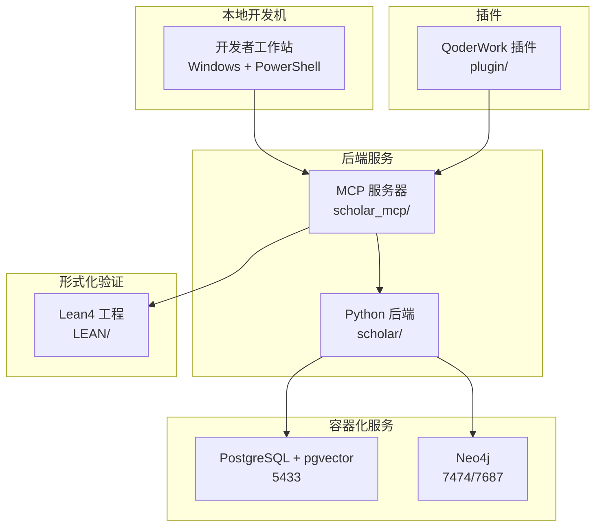
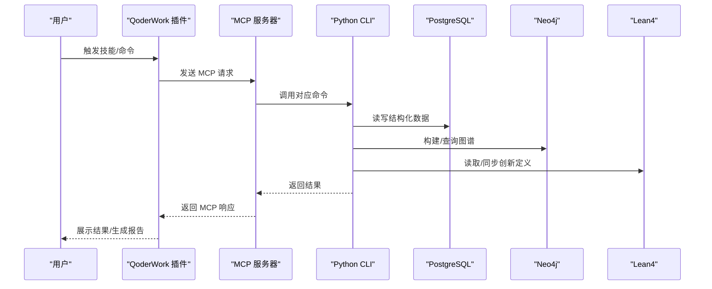
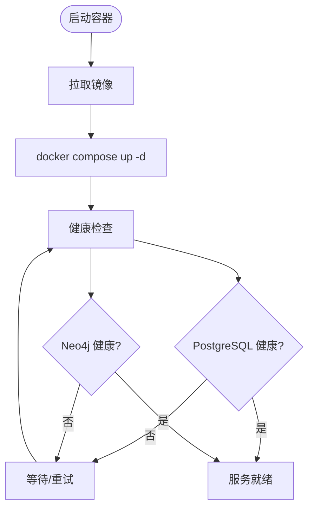
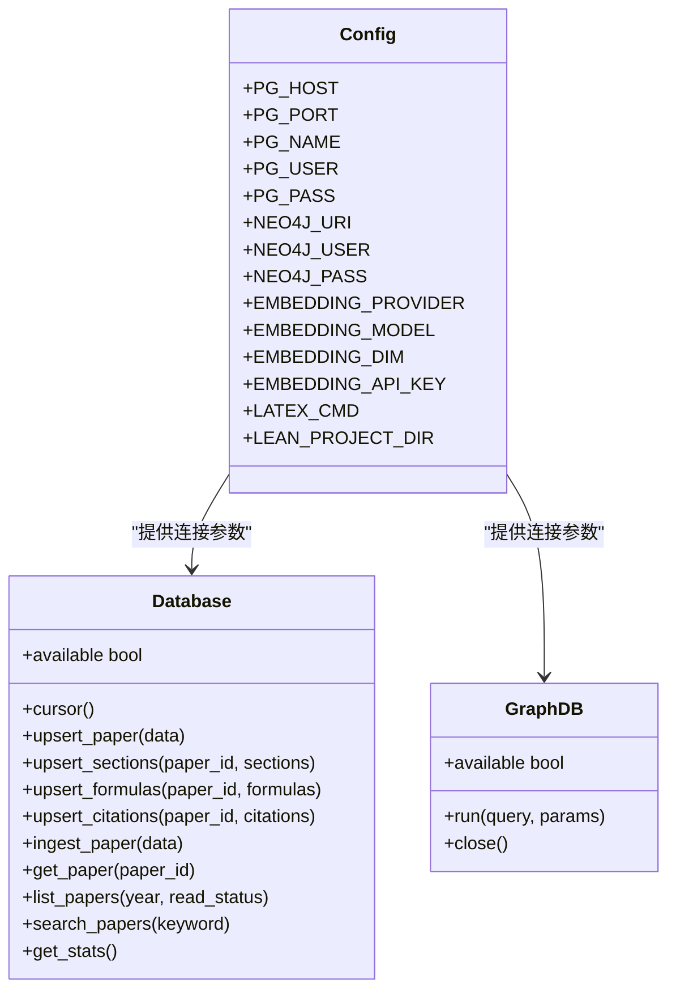
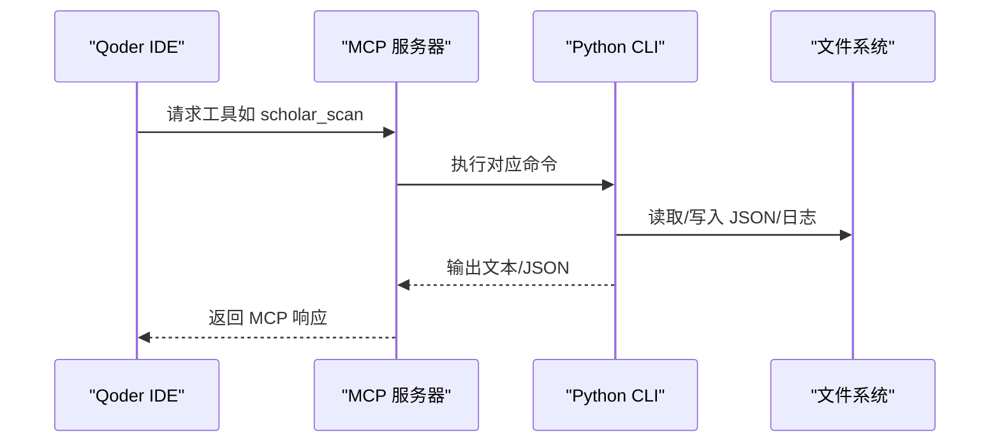
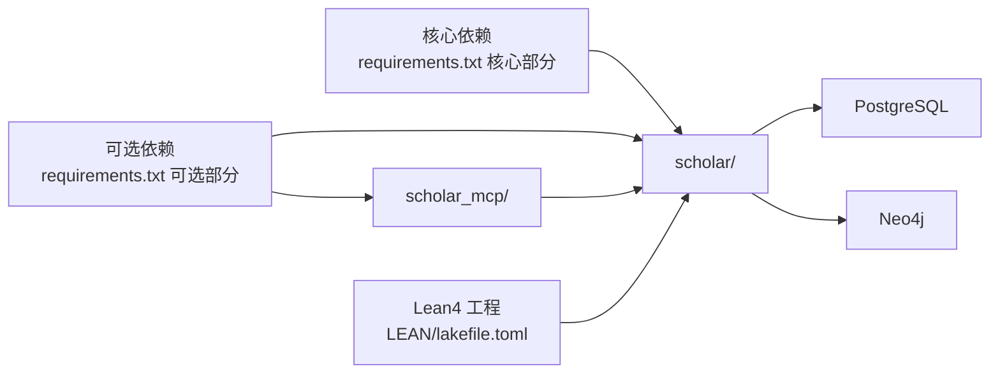

# 开发环境搭建

<cite>
**本文档引用的文件**
- [startup.ps1](file://startup.ps1)
- [docker-compose.yml](file://infra/docker-compose.yml)
- [init.sql](file://infra/init.sql)
- [requirements.txt](file://requirements.txt)
- [config.py](file://scholar/config.py)
- [db.py](file://scholar/db.py)
- [graph_db.py](file://scholar/graph_db.py)
- [cli.py](file://scholar/cli.py)
- [server.py](file://scholar_mcp/server.py)
- [lakefile.toml](file://LEAN/lakefile.toml)
- [README.md](file://README.md)
- [plugin/README.md](file://plugin/README.md)
</cite>

## 更新摘要
**变更内容**
- 更新依赖管理章节以反映 requirements.txt 的结构变化
- 新增可选依赖部分的详细说明
- 更新环境变量配置指南
- 完善依赖安装和故障排除指南

## 目录
1. [简介](#简介)
2. [项目结构](#项目结构)
3. [核心组件](#核心组件)
4. [架构总览](#架构总览)
5. [详细组件分析](#详细组件分析)
6. [依赖关系分析](#依赖关系分析)
7. [性能考虑](#性能考虑)
8. [故障排除指南](#故障排除指南)
9. [结论](#结论)
10. [附录](#附录)

## 简介
本指南面向需要在本地搭建"学术研究工具链"开发环境的工程师与研究者。该系统包含：
- Python 后端（scholar/）用于论文解析、数据库写入、Neo4j 图谱构建、RAG 向量化、LaTeX 编译与实验执行
- Lean4 形式化验证（LEAN/）用于数学定理与创新节点管理
- Docker 容器化服务（PostgreSQL + pgvector、Neo4j）用于持久化与图计算
- MCP 服务器（scholar_mcp/）用于 IDE 集成与工具调用
- 插件（plugin/）提供技能、命令与规则，作为上层工作流编排入口

目标是帮助你在 Windows（PowerShell）环境下，快速完成前置条件检查、依赖安装、数据库与图数据库准备、环境变量配置、IDE 集成与调试，并能通过一键启动脚本快速进入可用状态。

## 项目结构
项目采用多模块分层组织：
- LEAN/：Lean4 形式化验证工程，包含数据库定义与可执行目标
- infra/：Docker 编排与初始化 SQL
- scholar/：Python CLI 与后端逻辑（数据库、图谱、解析、RAG、LaTeX 等）
- scholar_mcp/：MCP 服务器，将 CLI 封装为 MCP 工具
- plugin/：QoderWork 插件（技能/命令/MCP 配置）
- 根目录：依赖清单、启动脚本、示例配置

**图表来源**
- [startup.ps1:11-44](file://startup.ps1#L11-L44)
- [docker-compose.yml:1-44](file://infra/docker-compose.yml#L1-L44)
- [server.py:17-20](file://scholar_mcp/server.py#L17-L20)
- [cli.py:23-28](file://scholar/cli.py#L23-L28)
- [lakefile.toml:1-11](file://LEAN/lakefile.toml#L1-L11)

**章节来源**
- [startup.ps1:1-65](file://startup.ps1#L1-L65)
- [docker-compose.yml:1-44](file://infra/docker-compose.yml#L1-L44)
- [plugin/README.md:1-79](file://plugin/README.md#L1-L79)

## 核心组件
- Python 依赖与版本
  - 使用 pip 安装 requirements.txt 中的包，包含 CLI 框架、数据库驱动、图数据库驱动、向量化接口、LaTeX 解析与 MCP 通信等
  - **新增**：requirements.txt 现分为核心依赖和可选依赖两部分，核心依赖为必需组件，可选依赖提供增强功能
- 数据库与图数据库
  - PostgreSQL（pgvector 扩展）：结构化论文元数据、向量嵌入
  - Neo4j：引用网络、概念图谱、Lean4 创新替换关系
- Lean4 工程
  - Lake 构建系统，定义可执行目标与库模块
- MCP 服务器
  - 将 scholar CLI 命令映射为 MCP 工具，便于 IDE 集成
- 启动脚本
  - 一键启动容器、等待健康检查、显示知识库状态

**章节来源**
- [requirements.txt:1-14](file://requirements.txt#L1-L14)
- [config.py:41-51](file://scholar/config.py#L41-L51)
- [lakefile.toml:1-11](file://LEAN/lakefile.toml#L1-L11)
- [server.py:17-20](file://scholar_mcp/server.py#L17-L20)
- [startup.ps1:11-44](file://startup.ps1#L11-L44)

## 架构总览
下图展示从插件到后端、容器与 Lean4 的整体交互流程：

**图表来源**
- [server.py:23-36](file://scholar_mcp/server.py#L23-L36)
- [cli.py:32-40](file://scholar/cli.py#L32-L40)
- [db.py:24-44](file://scholar/db.py#L24-L44)
- [graph_db.py:32-49](file://scholar/graph_db.py#L32-L49)
- [config.py:62-63](file://scholar/config.py#L62-L63)

## 详细组件分析

### 组件一：容器化环境（Docker）
- PostgreSQL + pgvector
  - 端口映射：5433:5432
  - 初始化脚本：infra/init.sql，创建扩展与核心表
  - 健康检查：pg_isready
- Neo4j
  - 端口映射：7474（浏览器）、7687（Bolt）
  - 默认凭据：neo4j/scholar2024
  - 健康检查：neo4j status
- 启动与等待
  - 启动脚本会等待两个服务均健康后再继续

**图表来源**
- [startup.ps1:11-44](file://startup.ps1#L11-L44)
- [docker-compose.yml:15-39](file://infra/docker-compose.yml#L15-L39)

**章节来源**
- [docker-compose.yml:1-44](file://infra/docker-compose.yml#L1-L44)
- [init.sql:1-131](file://infra/init.sql#L1-L131)
- [startup.ps1:11-44](file://startup.ps1#L11-L44)

### 组件二：Python 后端（scholar/）
- 配置加载
  - 通过 .env 加载环境变量，支持数据库、图数据库、嵌入模型、LaTeX 编译器等
- 数据库层
  - 可选 PostgreSQL 存储；不可用时退化为文件模式
  - 提供论文、段落、公式、引用的增删改查与统计
- 图数据库层
  - Neo4j 连接与查询封装
  - 引用网络构建、概念图谱构建、Lean4 替换关系同步
- CLI 命令
  - 论文扫描、解析、搜索、统计、arXiv 检索、图谱构建与查询、RAG 索引与检索、LaTeX 编译、实验执行等

**图表来源**
- [config.py:41-63](file://scholar/config.py#L41-L63)
- [db.py:24-242](file://scholar/db.py#L24-L242)
- [graph_db.py:32-69](file://scholar/graph_db.py#L32-L69)

**章节来源**
- [config.py:1-116](file://scholar/config.py#L1-L116)
- [db.py:1-276](file://scholar/db.py#L1-L276)
- [graph_db.py:1-922](file://scholar/graph_db.py#L1-L922)
- [cli.py:1-800](file://scholar/cli.py#L1-L800)

### 组件三：MCP 服务器（scholar_mcp/）
- 将 Python CLI 命令映射为 MCP 工具，支持：
  - 论文库操作（扫描、解析、搜索、统计、导出、年份修正、作者修正）
  - 图谱构建与查询（引用网络、概念图谱、统计）
  - RAG 索引与检索
  - 外部检索（arXiv）
  - 批处理预处理（自动生成笔记、质量评分、分类）
  - 知识库更新（下载 arXiv、批量导入、元数据补全）
  - 实验执行层（编译、运行、比较、调试、数据集下载）

**图表来源**
- [server.py:23-36](file://scholar_mcp/server.py#L23-L36)
- [cli.py:42-800](file://scholar/cli.py#L42-L800)

**章节来源**
- [server.py:1-573](file://scholar_mcp/server.py#L1-L573)
- [cli.py:1-800](file://scholar/cli.py#L1-L800)

### 组件四：Lean4 工程（LEAN/）
- Lake 构建系统定义了库与可执行目标
- 与图数据库层协作，动态加载创新节点与替换关系

**章节来源**
- [lakefile.toml:1-11](file://LEAN/lakefile.toml#L1-L11)
- [README.md:1-1](file://LEAN/README.md#L1-L1)
- [graph_db.py:371-405](file://scholar/graph_db.py#L371-L405)

## 依赖关系分析
- Python 依赖
  - **核心依赖**：typer/rich：CLI 与终端输出；psycopg2-binary：PostgreSQL 驱动；neo4j：Neo4j 驱动；python-dotenv：.env 加载；PyMuPDF：PDF 处理；mcp：MCP 通信
  - **可选依赖**：ulid：ULID 生成（缺失时使用 base64 时间戳 ID）；datasets：HuggingFace 数据集下载（缺失时手动下载）
- 容器依赖
  - PostgreSQL + pgvector：结构化数据与向量检索
  - Neo4j：图谱计算与可视化
- Lean4 依赖
  - Lake 构建系统与 Lean4 运行时

**图表来源**
- [requirements.txt:1-14](file://requirements.txt#L1-L14)
- [docker-compose.yml:1-44](file://infra/docker-compose.yml#L1-L44)
- [lakefile.toml:1-11](file://LEAN/lakefile.toml#L1-L11)

**章节来源**
- [requirements.txt:1-14](file://requirements.txt#L1-L14)
- [docker-compose.yml:1-44](file://infra/docker-compose.yml#L1-L44)
- [lakefile.toml:1-11](file://LEAN/lakefile.toml#L1-L11)

## 性能考虑
- 数据库连接池与事务
  - 使用上下文管理器确保连接正确释放，避免长连接泄漏
- 批量写入
  - Neo4j/Cypher UNWIND 批处理，减少往返次数
- 向量检索
  - 初始化时仅创建一次索引，避免重复构建
- CLI 并发
  - 批处理命令使用进度条与异步处理，提升用户体验
- LaTeX 编译
  - 提供自动修复与重试机制，减少人工干预

## 故障排除指南
- 容器无法启动或不健康
  - 检查端口占用（5433/7474/7687）
  - 查看健康检查日志与容器状态
  - 确认 init.sql 成功执行（扩展与表创建）
- 数据库连接失败
  - 核对 .env 中的主机、端口、用户名、密码
  - 确保 PostgreSQL 已初始化并接受连接
- Neo4j 连接失败
  - 确认默认凭据与 Bolt 端口
  - 检查 apoc 插件是否启用
- MCP 工具调用异常
  - 检查 Python 解释器路径与工作目录
  - 确认 scholar 包可被导入
- Lean4 未找到或构建失败
  - 确认 Lake 工具链可用
  - 检查 Lean4 工程文件是否存在
- **新增**：可选依赖缺失导致功能降级
  - ulid 缺失：系统将使用 base64 时间戳 ID 作为回退方案
  - datasets 缺失：系统将使用手动下载方式替代 HuggingFace 数据集下载

**章节来源**
- [startup.ps1:11-44](file://startup.ps1#L11-L44)
- [config.py:41-51](file://scholar/config.py#L41-L51)
- [db.py:24-44](file://scholar/db.py#L24-L44)
- [graph_db.py:32-49](file://scholar/graph_db.py#L32-L49)
- [server.py:23-36](file://scholar_mcp/server.py#L23-L36)

## 结论
通过本指南，你可以在本地快速搭建包含数据库、图数据库、Python 后端、MCP 服务器与 Lean4 工程的完整开发环境。**新增**：requirements.txt 的结构化管理使得依赖安装更加清晰，核心依赖保证基本功能，可选依赖提供增强体验。建议按顺序完成前置条件、依赖安装、容器启动、环境变量配置与初始化，随后即可通过 CLI 与 IDE 插件进行日常研究与开发工作。

## 附录

### A. 前置条件与依赖要求
- 操作系统：Windows（PowerShell）
- Python：建议使用虚拟环境安装 requirements.txt 中的依赖
- Docker：用于容器化数据库与图数据库
- Lean4：Lake 构建系统与 Lean4 运行时
- 可选：LaTeX 编译器（pdflatex）用于论文编译

**章节来源**
- [requirements.txt:1-14](file://requirements.txt#L1-L14)
- [docker-compose.yml:1-44](file://infra/docker-compose.yml#L1-L44)
- [lakefile.toml:1-11](file://LEAN/lakefile.toml#L1-L11)

### B. 逐步安装与配置
- 步骤 1：安装 Python 依赖
  - 在项目根目录执行 pip install -r requirements.txt
  - **新增**：系统会分别安装核心依赖和可选依赖，可选依赖缺失时功能会自动降级
- 步骤 2：准备 .env
  - 复制 .env.example（若存在）为 .env，并填写数据库与图数据库连接信息
  - **新增**：可选配置嵌入模型 API Key 以启用 RAG 功能
- 步骤 3：启动容器
  - 在项目根目录执行启动脚本，等待服务健康
- 步骤 4：初始化数据库
  - 执行数据库初始化 SQL（由 docker-compose 自动挂载）
- 步骤 5：初始化知识库
  - 运行知识库初始化命令（如扫描、解析、图谱构建、RAG 索引）
- 步骤 6：配置 IDE 插件
  - 安装 QoderWork 插件，配置 MCP 服务器地址

**章节来源**
- [startup.ps1:11-64](file://startup.ps1#L11-L64)
- [init.sql:1-131](file://infra/init.sql#L1-L131)
- [plugin/README.md:19-48](file://plugin/README.md#L19-L48)

### C. 环境变量参考
- 数据库连接
  - SCHOLAR_PG_HOST/SCHOLAR_PG_PORT/SCHOLAR_PG_NAME/SCHOLAR_PG_USER/SCHOLAR_PG_PASS
- Neo4j 连接
  - SCHOLAR_NEO4J_URI/SCHOLAR_NEO4J_USER/SCHOLAR_NEO4J_PASS
- 嵌入模型
  - SCHOLAR_EMBEDDING_PROVIDER/SCHOLAR_EMBEDDING_MODEL/SCHOLAR_EMBEDDING_DIM/SCHOLAR_EMBEDDING_API_KEY
- LaTeX 编译
  - SCHOLAR_LATEX_CMD
- Lean4 工程路径
  - SCHOLAR_LEAN_PROJECT_DIR

**章节来源**
- [config.py:41-63](file://scholar/config.py#L41-L63)

### D. Docker 容器化环境
- 服务定义
  - PostgreSQL + pgvector：结构化数据与向量检索
  - Neo4j：概念图谱与引用网络
- 健康检查
  - PostgreSQL：pg_isready
  - Neo4j：neo4j status
- 初始化 SQL
  - 创建扩展与核心表，包括论文、段落、公式、引用、概念、嵌入、创新与替换关系

**章节来源**
- [docker-compose.yml:1-44](file://infra/docker-compose.yml#L1-L44)
- [init.sql:1-131](file://infra/init.sql#L1-L131)

### E. 调试环境配置
- 断点设置
  - 在 Python CLI 与 MCP 服务器中设置断点，定位命令执行路径
- 日志配置
  - CLI 使用 rich 控制台输出，可在 .env 中调整日志级别（如通过环境变量控制）
- 性能分析
  - 使用 Python 性能分析工具（如 cProfile）分析耗时命令
  - Neo4j 查询可启用慢查询日志与执行计划分析

**章节来源**
- [cli.py:13-28](file://scholar/cli.py#L13-L28)
- [server.py:23-36](file://scholar_mcp/server.py#L23-L36)

### F. 常见问题排查
- 服务未就绪
  - 等待启动脚本的健康检查循环结束，确认端口开放
- 数据库无连接
  - 检查 .env 与防火墙设置，确认容器网络可达
- Neo4j 无法访问
  - 确认默认密码与 Bolt 端口，检查 apoc 插件
- MCP 工具返回错误
  - 检查 Python 版本与依赖，确认工作目录与命令参数
- **新增**：可选依赖缺失问题
  - ulid 缺失：系统会自动使用 base64 时间戳 ID，不影响核心功能
  - datasets 缺失：系统会使用手动下载方式，RAG 功能可能受限

**章节来源**
- [startup.ps1:11-44](file://startup.ps1#L11-L44)
- [config.py:41-51](file://scholar/config.py#L41-L51)
- [server.py:23-36](file://scholar_mcp/server.py#L23-L36)

### G. 依赖管理最佳实践
- **核心依赖优先**：确保核心依赖完整安装，这是系统正常运行的基础
- **可选依赖选择性安装**：根据实际需求安装可选依赖，如需要 ULID 生成或 HuggingFace 数据集下载功能
- **功能降级机制**：系统设计了完善的回退机制，即使可选依赖缺失也不会影响核心功能
- **版本兼容性**：关注 requirements.txt 中的版本约束，确保依赖版本兼容

**章节来源**
- [requirements.txt:1-14](file://requirements.txt#L1-L14)
- [README.md:29-41](file://README.md#L29-L41)