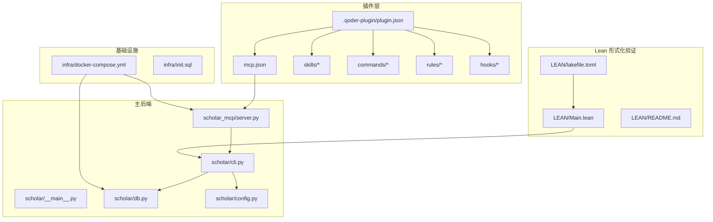
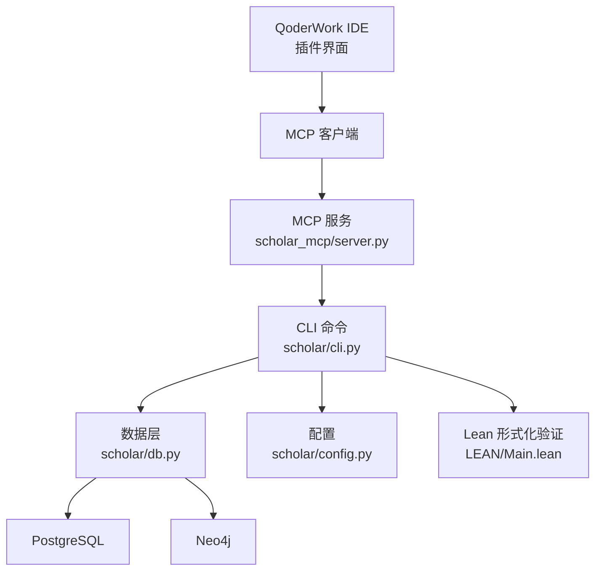
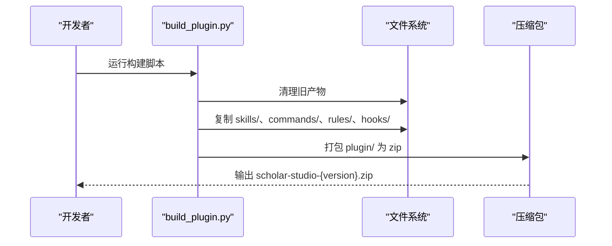
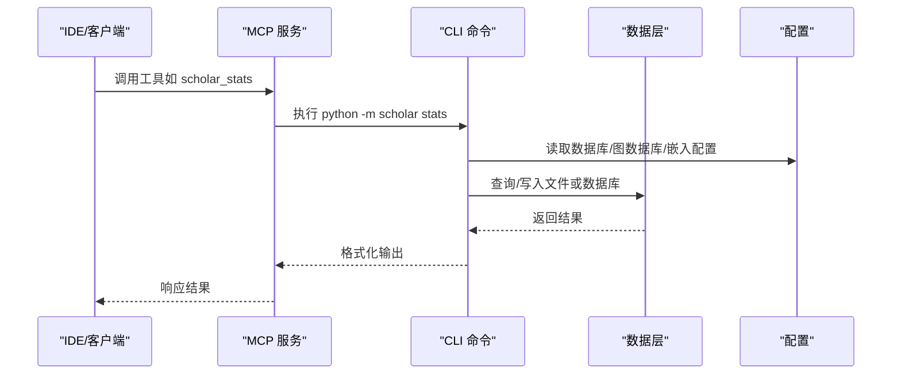
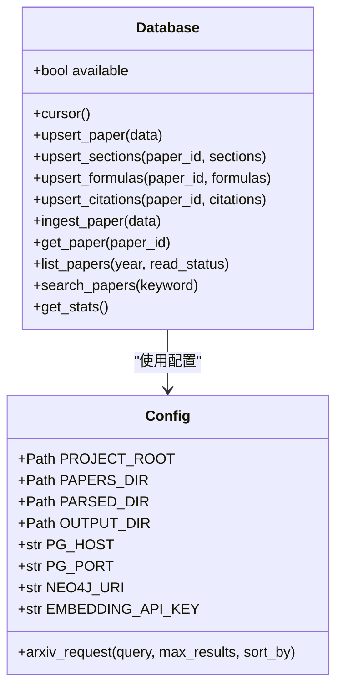
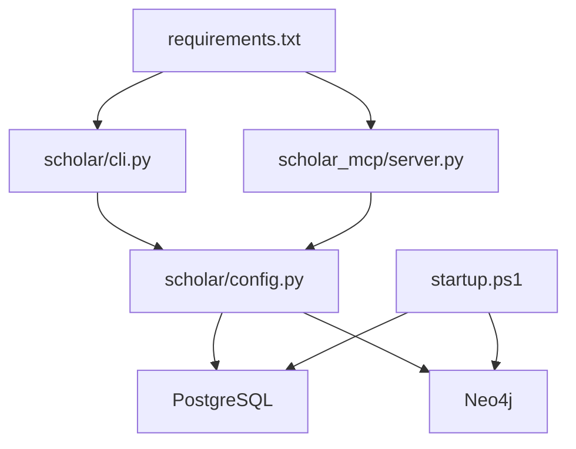

# 开发者指南

<cite>
**本文档引用的文件**
- [plugin/README.md](file://plugin/README.md)
- [plugin/.qoder-plugin/plugin.json](file://plugin/.qoder-plugin/plugin.json)
- [plugin/mcp.json](file://plugin/mcp.json)
- [plugin/commands/stats.md](file://plugin/commands/stats.md)
- [build_plugin.py](file://build_plugin.py)
- [requirements.txt](file://requirements.txt)
- [startup.ps1](file://startup.ps1)
- [scholar/__main__.py](file://scholar/__main__.py)
- [scholar/cli.py](file://scholar/cli.py)
- [scholar/db.py](file://scholar/db.py)
- [scholar/config.py](file://scholar/config.py)
- [scholar_mcp/server.py](file://scholar_mcp/server.py)
- [LEAN/README.md](file://LEAN/README.md)
- [LEAN/lakefile.toml](file://LEAN/lakefile.toml)
- [LEAN/Main.lean](file://LEAN/Main.lean)
</cite>

## 目录
1. [简介](#简介)
2. [项目结构](#项目结构)
3. [核心组件](#核心组件)
4. [架构总览](#架构总览)
5. [详细组件分析](#详细组件分析)
6. [依赖关系分析](#依赖关系分析)
7. [性能考量](#性能考量)
8. [故障排查指南](#故障排查指南)
9. [结论](#结论)
10. [附录](#附录)

## 简介
本指南面向开发者，系统性阐述项目的模块化设计、分层架构与插件化扩展理念；提供开发环境搭建、调试与贡献流程；详解插件系统的扩展机制（如何创建自定义技能与扩展现有功能）；给出发布与版本管理最佳实践；并总结测试策略与质量保障措施。

## 项目结构
该项目采用“插件 + 主后端 + 数据与基础设施”的分层组织方式：
- 插件层（plugin/）：封装技能、命令、规则、钩子与 MCP 配置，作为“大脑”向主后端发出指令。
- 主后端（scholar/ 与 scholar_mcp/）：提供 CLI 命令与 MCP 服务，负责论文解析、检索、图谱构建、RAG、实验执行等。
- 基础设施（infra/）：通过 Docker Compose 启动 PostgreSQL 与 Neo4j。
- Lean 形式化验证（LEAN/）：提供数学定理与架构属性的形式化验证入口。
- 其他根级文件：依赖清单、启动脚本、插件打包脚本等。

图表来源
- [plugin/.qoder-plugin/plugin.json:1-23](file://plugin/.qoder-plugin/plugin.json#L1-L23)
- [plugin/mcp.json:1-16](file://plugin/mcp.json#L1-L16)
- [scholar/cli.py:1-800](file://scholar/cli.py#L1-L800)
- [scholar/db.py:1-276](file://scholar/db.py#L1-L276)
- [scholar/config.py:1-116](file://scholar/config.py#L1-L116)
- [scholar_mcp/server.py:1-573](file://scholar_mcp/server.py#L1-L573)
- [LEAN/lakefile.toml:1-11](file://LEAN/lakefile.toml#L1-L11)
- [LEAN/Main.lean:1-21](file://LEAN/Main.lean#L1-L21)

章节来源
- [plugin/README.md:1-79](file://plugin/README.md#L1-L79)
- [plugin/.qoder-plugin/plugin.json:1-23](file://plugin/.qoder-plugin/plugin.json#L1-L23)
- [plugin/mcp.json:1-16](file://plugin/mcp.json#L1-L16)
- [scholar/__main__.py:1-8](file://scholar/__main__.py#L1-L8)
- [scholar/cli.py:1-800](file://scholar/cli.py#L1-L800)
- [scholar/db.py:1-276](file://scholar/db.py#L1-L276)
- [scholar/config.py:1-116](file://scholar/config.py#L1-L116)
- [scholar_mcp/server.py:1-573](file://scholar_mcp/server.py#L1-L573)
- [LEAN/lakefile.toml:1-11](file://LEAN/lakefile.toml#L1-L11)
- [LEAN/Main.lean:1-21](file://LEAN/Main.lean#L1-L21)

## 核心组件
- 插件元数据与分发
  - 插件清单定义了名称、版本、关键词、入口路径与资源目录映射，确保 QoderWork 能正确加载插件。
  - MCP 配置声明了本地 MCP 服务器命令与环境变量，使插件可调用主后端能力。
- 插件构建器
  - 将 .qoder/skills、.qoder/commands、.qoder/rules、.qoder/hooks 中的素材复制到 plugin/ 下，并打包为可分发 zip。
- 主后端 CLI
  - 使用 Typer 定义命令集，覆盖论文扫描、解析、查询、统计、arXiv 检索、图谱构建与统计、RAG、元数据补全、批量处理、编译与实验执行等。
- MCP 服务
  - 将 CLI 命令包装为 MCP 工具，暴露给 IDE 与外部客户端，实现“所见即所得”的工作流编排。
- 数据层
  - 提供 PostgreSQL 访问与文件回退模式，统一论文、章节、公式、引用等实体的持久化与查询。
- 配置与环境
  - 通过环境变量控制数据库、图数据库、嵌入模型、LaTeX 编译器与 arXiv 请求行为。
- 基础设施
  - Docker Compose 启动 PostgreSQL 与 Neo4j，启动脚本提供健康检查与状态概览。
- Lean 形式化验证
  - Lake 配置与主程序入口，展示对若干架构/算法的严格证明输出。

章节来源
- [plugin/.qoder-plugin/plugin.json:1-23](file://plugin/.qoder-plugin/plugin.json#L1-L23)
- [plugin/mcp.json:1-16](file://plugin/mcp.json#L1-L16)
- [build_plugin.py:1-180](file://build_plugin.py#L1-L180)
- [scholar/cli.py:1-800](file://scholar/cli.py#L1-L800)
- [scholar_mcp/server.py:1-573](file://scholar_mcp/server.py#L1-L573)
- [scholar/db.py:1-276](file://scholar/db.py#L1-L276)
- [scholar/config.py:1-116](file://scholar/config.py#L1-L116)
- [startup.ps1:1-65](file://startup.ps1#L1-L65)
- [LEAN/lakefile.toml:1-11](file://LEAN/lakefile.toml#L1-L11)
- [LEAN/Main.lean:1-21](file://LEAN/Main.lean#L1-L21)

## 架构总览
整体采用“插件驱动 + MCP 服务 + 主后端执行”的分层架构：
- 插件层负责“意图表达”（技能/命令/规则/钩子）与“MCP 配置”。
- MCP 层负责“命令桥接”，将插件请求转发为主后端 CLI。
- 主后端层负责“数据访问与业务逻辑”，并与数据库、图数据库、外部 API、Lean 项目交互。

图表来源
- [scholar_mcp/server.py:1-573](file://scholar_mcp/server.py#L1-L573)
- [scholar/cli.py:1-800](file://scholar/cli.py#L1-L800)
- [scholar/db.py:1-276](file://scholar/db.py#L1-L276)
- [scholar/config.py:1-116](file://scholar/config.py#L1-L116)
- [LEAN/Main.lean:1-21](file://LEAN/Main.lean#L1-L21)

## 详细组件分析

### 组件一：插件系统与扩展机制
- 插件清单与资源映射
  - 通过 plugin.json 映射 skills/、commands/、rules/、hooks/、mcpServers/，确保 QoderWork 正确加载。
- MCP 服务器配置
  - mcp.json 指定本地 MCP 服务器命令、参数与环境变量，使插件可直接调用 python -m scholar_mcp。
- 插件构建器
  - build_plugin.py 实现素材复制与打包，输出可分发 zip，便于版本化发布。
- 命令示例：stats
  - commands/stats.md 定义了“快速查看知识库状态”的步骤，体现命令的最小化工作流设计。

图表来源
- [build_plugin.py:132-180](file://build_plugin.py#L132-L180)

章节来源
- [plugin/.qoder-plugin/plugin.json:1-23](file://plugin/.qoder-plugin/plugin.json#L1-L23)
- [plugin/mcp.json:1-16](file://plugin/mcp.json#L1-L16)
- [plugin/commands/stats.md:1-7](file://plugin/commands/stats.md#L1-L7)
- [build_plugin.py:1-180](file://build_plugin.py#L1-L180)

### 组件二：主后端 CLI 与 MCP 服务
- CLI 命令体系
  - 覆盖论文生命周期管理、检索与统计、图谱构建与查询、RAG、元数据补全、批量处理、编译与实验执行等。
- MCP 服务
  - 将 CLI 命令映射为 MCP 工具，支持超时控制与错误信息拼接，便于 IDE 与外部客户端集成。
- 数据层与配置
  - 数据层提供文件回退模式与 PostgreSQL 访问；配置模块集中管理环境变量与工具函数。

图表来源
- [scholar_mcp/server.py:23-37](file://scholar_mcp/server.py#L23-L37)
- [scholar/cli.py:420-477](file://scholar/cli.py#L420-L477)
- [scholar/db.py:24-276](file://scholar/db.py#L24-L276)
- [scholar/config.py:41-64](file://scholar/config.py#L41-L64)

章节来源
- [scholar/cli.py:1-800](file://scholar/cli.py#L1-L800)
- [scholar_mcp/server.py:1-573](file://scholar_mcp/server.py#L1-L573)
- [scholar/db.py:1-276](file://scholar/db.py#L1-L276)
- [scholar/config.py:1-116](file://scholar/config.py#L1-L116)

### 组件三：数据层与持久化
- 数据层接口
  - 支持论文、章节、公式、引用的增删改查与批量导入；提供文件回退模式以适配无数据库场景。
- 查询与统计
  - 提供论文列表、全文检索、统计聚合等能力，支撑上层命令与 MCP 工具使用。

图表来源
- [scholar/db.py:24-276](file://scholar/db.py#L24-L276)
- [scholar/config.py:20-116](file://scholar/config.py#L20-L116)

章节来源
- [scholar/db.py:1-276](file://scholar/db.py#L1-L276)
- [scholar/config.py:1-116](file://scholar/config.py#L1-L116)

### 组件四：Lean 形式化验证
- Lake 配置
  - 定义项目名、默认目标与可执行入口。
- 主程序
  - 展示对若干架构/算法的严格证明输出，体现形式化验证能力。

图表来源
- [LEAN/lakefile.toml:1-11](file://LEAN/lakefile.toml#L1-L11)
- [LEAN/Main.lean:1-21](file://LEAN/Main.lean#L1-L21)

章节来源
- [LEAN/lakefile.toml:1-11](file://LEAN/lakefile.toml#L1-L11)
- [LEAN/Main.lean:1-21](file://LEAN/Main.lean#L1-L21)

## 依赖关系分析
- Python 依赖
  - CLI 与 MCP 服务依赖 Typer、Rich、psycopg2、neo4j、python-dotenv、PyMuPDF、mcp 等。
- 插件与主后端
  - 插件通过 MCP 与主后端通信；主后端通过配置模块读取数据库与图数据库连接信息。
- 基础设施
  - Docker Compose 提供 PostgreSQL 与 Neo4j；启动脚本负责健康检查与状态提示。

图表来源
- [requirements.txt:1-9](file://requirements.txt#L1-L9)
- [scholar/cli.py:13-29](file://scholar/cli.py#L13-L29)
- [scholar_mcp/server.py:12-21](file://scholar_mcp/server.py#L12-L21)
- [scholar/config.py:41-64](file://scholar/config.py#L41-L64)
- [startup.ps1:11-44](file://startup.ps1#L11-L44)

章节来源
- [requirements.txt:1-9](file://requirements.txt#L1-L9)
- [startup.ps1:1-65](file://startup.ps1#L1-L65)

## 性能考量
- 批处理与进度可视化
  - CLI 的批量解析与查询使用进度条与分页显示，避免终端阻塞与信息过载。
- 数据库事务与回滚
  - 数据层在上下文管理器中自动提交或回滚，降低并发写入风险。
- 图谱构建与查询
  - MCP 服务对长时间任务设置超时，避免阻塞客户端。
- 建议
  - 对高频查询建立索引；对大规模批处理增加分片与断点续传；对嵌入向量索引使用增量构建策略。

## 故障排查指南
- 数据库不可达
  - 检查环境变量与连接参数；确认 Docker 服务已启动且健康；使用文件回退模式验证解析流程。
- 图数据库不可达
  - 确认 Neo4j URI 与凭据；检查容器是否运行；必要时重建图谱。
- arXiv 请求失败
  - 检查代理与超时设置；查看重试日志；必要时更换排序字段或缩小范围。
- MCP 工具超时
  - 调整超时参数；优化后端任务；拆分批量操作。
- Lean 验证失败
  - 检查 Lake 依赖与编译输出；核对输入数据格式；逐步简化目标以定位问题。

章节来源
- [scholar/config.py:69-116](file://scholar/config.py#L69-L116)
- [scholar_mcp/server.py:23-37](file://scholar_mcp/server.py#L23-L37)
- [startup.ps1:17-44](file://startup.ps1#L17-L44)

## 结论
本项目通过“插件 + MCP + 主后端 + 基础设施 + Lean 验证”的分层设计，实现了可扩展、可观测、可维护的研究辅助系统。插件化扩展机制清晰，主后端命令完备，MCP 服务桥接良好，基础设施自动化，为开发者提供了完整的二次开发与发布路径。

## 附录

### 开发环境搭建
- 安装依赖
  - 安装 Python 依赖：参考 requirements.txt。
- 启动数据库与图数据库
  - 使用启动脚本一键启动并等待健康检查。
- 初始化知识库
  - 运行主后端引导命令进行全量初始化。
- 配置 IDE
  - 在 IDE 中启用 MCP 客户端，指向本地 MCP 服务器。
- 调试设置
  - 设置断点于 CLI 与 MCP 服务；观察控制台输出与日志文件。

章节来源
- [requirements.txt:1-9](file://requirements.txt#L1-L9)
- [startup.ps1:1-65](file://startup.ps1#L1-L65)
- [plugin/mcp.json:1-16](file://plugin/mcp.json#L1-L16)

### 贡献指南
- 代码规范
  - 使用类型注解与清晰的函数命名；保持命令与工具的单一职责；为新命令补充 CLI 注释与 MCP 工具文档。
- 测试策略
  - 为 CLI 命令编写单元测试；对 MCP 工具进行集成测试；对数据库操作进行事务隔离测试。
- 提交流程
  - 分支命名遵循约定；提交信息描述变更动机与影响；附带必要的配置与文档更新。

### 插件扩展机制
- 创建自定义技能
  - 在 .qoder/skills/<skill_name>/ 下放置 SKILL.md 与相关资源；通过构建器复制到 plugin/skills/ 并打包。
- 扩展现有功能
  - 新增命令：在 .qoder/commands/ 下添加 Markdown 文件；在 plugin.json 中映射；在 MCP 服务中注册工具。
  - 新增规则与钩子：在 .qoder/rules/ 与 .qoder/hooks/ 下添加文件；确保插件清单正确映射。
- 发布与版本管理
  - 更新 plugin.json 版本号；运行构建器生成 zip；在插件市场发布或手动导入。

章节来源
- [build_plugin.py:132-180](file://build_plugin.py#L132-L180)
- [plugin/.qoder-plugin/plugin.json:17-22](file://plugin/.qoder-plugin/plugin.json#L17-L22)
- [plugin/README.md:19-49](file://plugin/README.md#L19-L49)

### 发布流程与版本管理
- 版本号管理
  - 在插件清单中维护主版本号与语义化版本；每次重大功能或破坏性变更提升主版本。
- 构建与打包
  - 使用构建器清理旧产物、复制素材、打包 zip；记录输出文件与文件数量。
- 发布渠道
  - 在插件市场上传 zip；提供变更日志与使用说明；同步 Lean 与主后端的兼容性信息。

章节来源
- [plugin/.qoder-plugin/plugin.json:1-23](file://plugin/.qoder-plugin/plugin.json#L1-L23)
- [build_plugin.py:95-129](file://build_plugin.py#L95-L129)

### 常见开发场景与调试技巧
- 快速验证插件加载
  - 使用命令示例（如 stats）验证 MCP 服务与 CLI 是否连通。
- 批量处理与性能优化
  - 使用进度条与分页；对耗时任务设置超时与重试；必要时拆分为多阶段流水线。
- 数据一致性校验
  - 在数据库与文件模式之间切换验证；对关键查询进行回归测试。

章节来源
- [plugin/commands/stats.md:1-7](file://plugin/commands/stats.md#L1-L7)
- [scholar_mcp/server.py:23-37](file://scholar_mcp/server.py#L23-L37)
- [scholar/cli.py:198-237](file://scholar/cli.py#L198-L237)