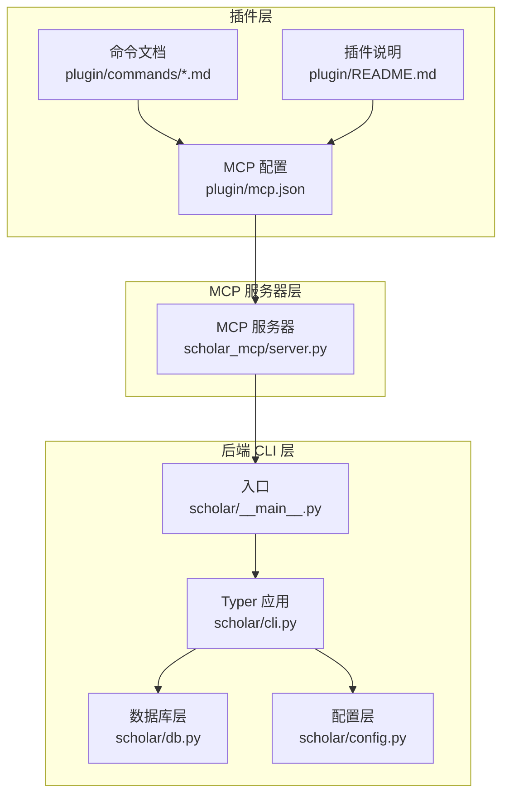
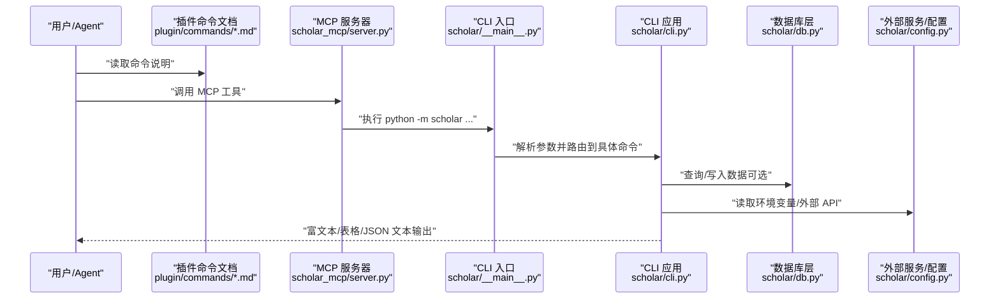
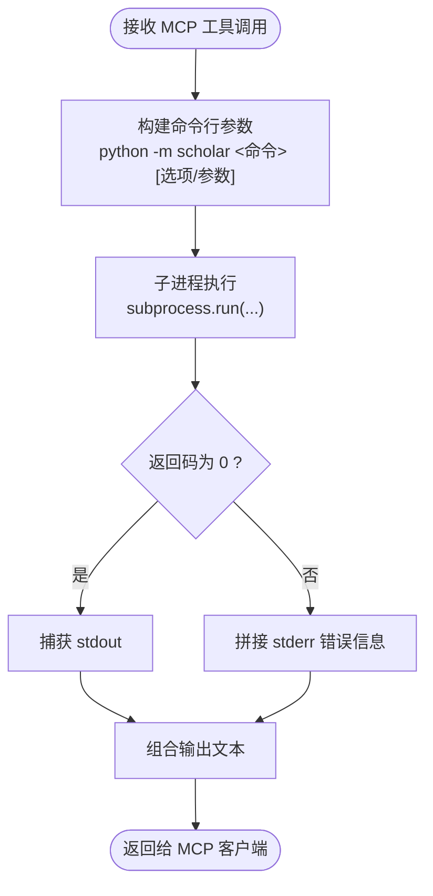
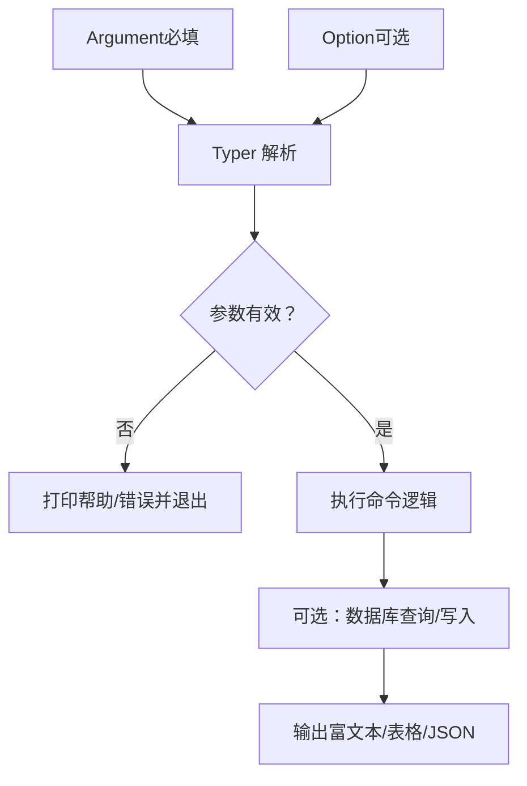
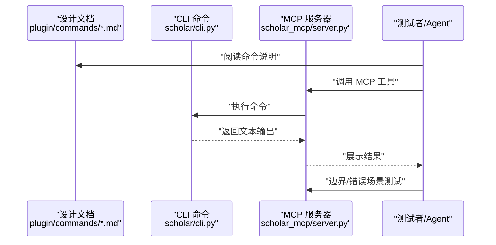
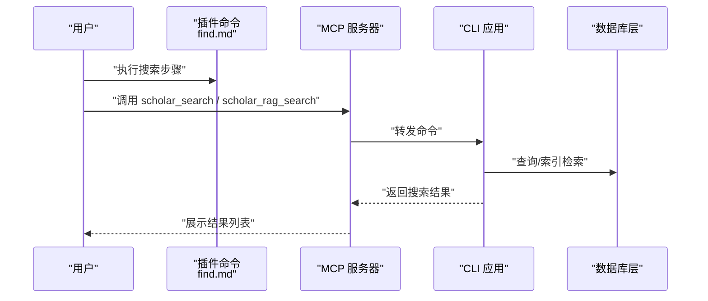
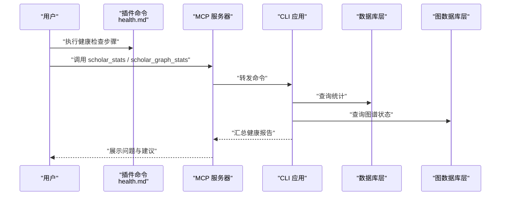
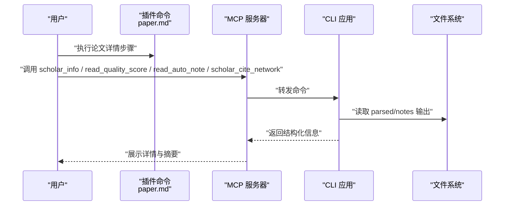
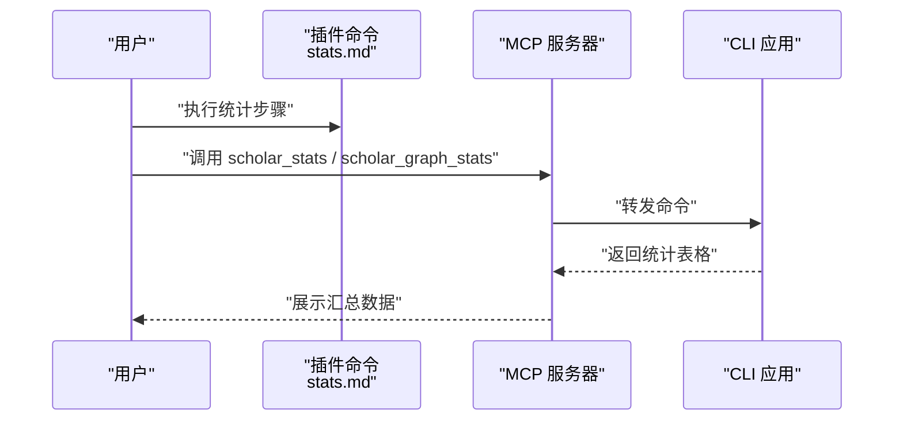
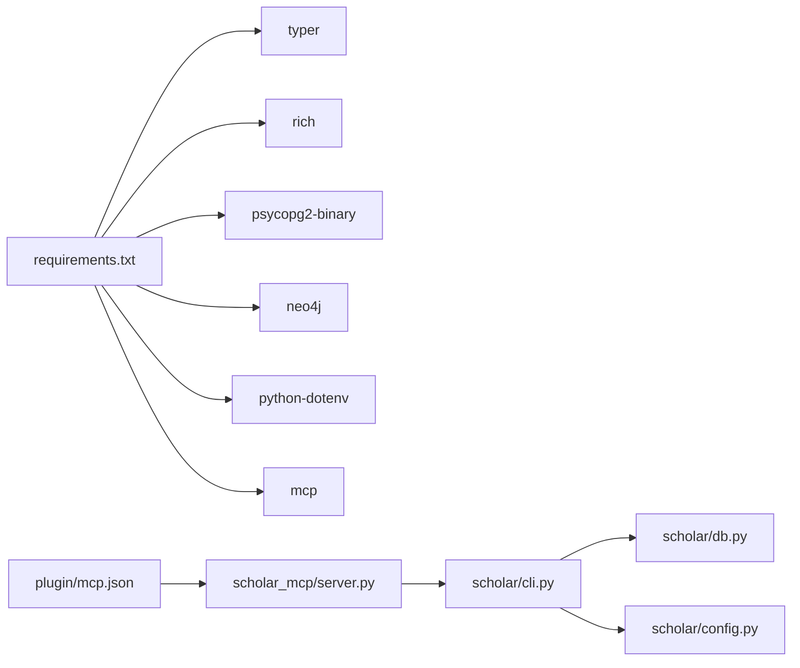

# 命令开发

<cite>
**本文档引用的文件**
- [plugin/commands/find.md](file://plugin/commands/find.md)
- [plugin/commands/health.md](file://plugin/commands/health.md)
- [plugin/commands/paper.md](file://plugin/commands/paper.md)
- [plugin/commands/stats.md](file://plugin/commands/stats.md)
- [plugin/README.md](file://plugin/README.md)
- [plugin/mcp.json](file://plugin/mcp.json)
- [scholar/cli.py](file://scholar/cli.py)
- [scholar/__main__.py](file://scholar/__main__.py)
- [scholar_mcp/server.py](file://scholar_mcp/server.py)
- [scholar/db.py](file://scholar/db.py)
- [scholar/config.py](file://scholar/config.py)
- [requirements.txt](file://requirements.txt)
</cite>

## 目录
1. [简介](#简介)
2. [项目结构](#项目结构)
3. [核心组件](#核心组件)
4. [架构总览](#架构总览)
5. [详细组件分析](#详细组件分析)
6. [依赖分析](#依赖分析)
7. [性能考虑](#性能考虑)
8. [故障排查指南](#故障排查指南)
9. [结论](#结论)
10. [附录](#附录)

## 简介
本文件面向"命令开发"的完整工作流程，结合仓库中的命令规范与后端实现，系统性地阐述：
- 命令文件的 Markdown 规范与必需元素（描述、参数、使用步骤）
- 命令设计到实现再到集成测试的全流程
- 命令与后端服务的交互方式（API 调用、数据传输、状态管理）
- 参数处理机制（必填、可选、默认值）
- 实际命令开发案例（论文搜索、健康检查、论文详情、统计信息）
- 调试技巧与用户体验优化建议

## 项目结构
该仓库采用"插件 + 后端 CLI + MCP 服务器"的分层架构：
- 插件层：提供命令与技能的声明与入口，负责将用户意图转化为后端命令调用
- 后端 CLI 层：提供丰富的学术研究命令（搜索、统计、图谱、RAG 等）
- MCP 服务器层：将 CLI 命令暴露为 MCP 工具，供 IDE/Agent 使用

**图表来源**
- [plugin/README.md:1-79](file://plugin/README.md#L1-L79)
- [plugin/mcp.json:1-16](file://plugin/mcp.json#L1-L16)
- [scholar/__main__.py:1-8](file://scholar/__main__.py#L1-L8)
- [scholar/cli.py:1-800](file://scholar/cli.py#L1-L800)
- [scholar_mcp/server.py:1-573](file://scholar_mcp/server.py#L1-L573)

**章节来源**
- [plugin/README.md:1-79](file://plugin/README.md#L1-L79)
- [plugin/mcp.json:1-16](file://plugin/mcp.json#L1-L16)
- [scholar/__main__.py:1-8](file://scholar/__main__.py#L1-L8)
- [scholar/cli.py:1-800](file://scholar/cli.py#L1-L800)
- [scholar_mcp/server.py:1-573](file://scholar_mcp/server.py#L1-L573)

## 核心组件
- 命令文档（Markdown）：用于描述命令用途、参数与使用步骤，作为插件层的"说明书"
- Typer CLI 应用：集中定义命令、参数、帮助信息与输出格式
- MCP 服务器：将 CLI 命令封装为 MCP 工具，统一返回文本输出
- 数据库层：提供结构化存储与查询能力，支持命令的持久化与检索
- 配置层：集中管理数据库、图数据库、嵌入模型等外部依赖的连接参数

**章节来源**
- [plugin/commands/find.md:1-7](file://plugin/commands/find.md#L1-L7)
- [plugin/commands/health.md:1-10](file://plugin/commands/health.md#L1-L10)
- [plugin/commands/paper.md:1-11](file://plugin/commands/paper.md#L1-L11)
- [plugin/commands/stats.md:1-7](file://plugin/commands/stats.md#L1-L7)
- [scholar/cli.py:1-800](file://scholar/cli.py#L1-L800)
- [scholar_mcp/server.py:1-573](file://scholar_mcp/server.py#L1-L573)
- [scholar/db.py:1-276](file://scholar/db.py#L1-L276)
- [scholar/config.py:1-116](file://scholar/config.py#L1-L116)

## 架构总览
命令从"插件层"进入，经由"MCP 服务器"转发到"后端 CLI"，再通过"数据库层"与"配置层"完成数据访问与外部服务调用。

**图表来源**
- [plugin/commands/find.md:1-7](file://plugin/commands/find.md#L1-L7)
- [plugin/commands/health.md:1-10](file://plugin/commands/health.md#L1-L10)
- [plugin/commands/paper.md:1-11](file://plugin/commands/paper.md#L1-L11)
- [plugin/commands/stats.md:1-7](file://plugin/commands/stats.md#L1-L7)
- [plugin/mcp.json:1-16](file://plugin/mcp.json#L1-L16)
- [scholar_mcp/server.py:1-573](file://scholar_mcp/server.py#L1-L573)
- [scholar/__main__.py:1-8](file://scholar/__main__.py#L1-L8)
- [scholar/cli.py:1-800](file://scholar/cli.py#L1-L800)
- [scholar/db.py:1-276](file://scholar/db.py#L1-L276)
- [scholar/config.py:1-116](file://scholar/config.py#L1-L116)

## 详细组件分析

### 命令文件 MD 规范与必需元素
- 必备字段
  - 描述：简明说明命令目的与适用场景
  - 执行步骤：列出命令调用顺序、参数说明与预期输出
- 可选字段
  - 参数定义：对每个参数进行类型、含义、默认值、约束说明
  - 使用示例：给出典型场景下的命令行示例
- 输出约定
  - 统一以富文本/表格/JSON 文本形式输出，便于 MCP 工具消费

**章节来源**
- [plugin/commands/find.md:1-7](file://plugin/commands/find.md#L1-L7)
- [plugin/commands/health.md:1-10](file://plugin/commands/health.md#L1-L10)
- [plugin/commands/paper.md:1-11](file://plugin/commands/paper.md#L1-L11)
- [plugin/commands/stats.md:1-7](file://plugin/commands/stats.md#L1-L7)

### 命令与后端交互（以 MCP 服务器为例）
MCP 服务器将命令映射为子进程调用，统一捕获标准输出与错误输出，并设置超时控制。

**图表来源**
- [scholar_mcp/server.py:23-36](file://scholar_mcp/server.py#L23-L36)
- [scholar_mcp/server.py:41-100](file://scholar_mcp/server.py#L41-L100)

**章节来源**
- [scholar_mcp/server.py:1-573](file://scholar_mcp/server.py#L1-L573)

### 参数处理机制（Typer + 子进程）
- 必填参数：通过 Typer 的 Argument 定义；若缺失则直接报错并退出
- 可选参数：通过 Typer 的 Option 定义；支持默认值与布尔开关
- 子进程传递：MCP 服务器将参数原样传给 CLI；CLI 再进行解析与校验

**图表来源**
- [scholar/cli.py:132-171](file://scholar/cli.py#L132-L171)
- [scholar/cli.py:176-237](file://scholar/cli.py#L176-L237)
- [scholar/cli.py:311-370](file://scholar/cli.py#L311-L370)
- [scholar/cli.py:421-477](file://scholar/cli.py#L421-L477)

**章节来源**
- [scholar/cli.py:1-800](file://scholar/cli.py#L1-L800)

### 命令开发工作流程
- 设计阶段
  - 明确命令目标与用户场景
  - 在插件层编写命令文档（描述、步骤、参数）
- 实现阶段
  - 在 CLI 中新增命令与参数定义
  - 实现业务逻辑与数据访问
  - 保证输出格式一致（表格/面板/纯文本）
- 集成测试
  - 通过 MCP 服务器调用，验证参数传递与输出
  - 检查数据库可用性与错误回退（文件模式）

**图表来源**
- [plugin/commands/find.md:1-7](file://plugin/commands/find.md#L1-L7)
- [plugin/commands/health.md:1-10](file://plugin/commands/health.md#L1-L10)
- [plugin/commands/paper.md:1-11](file://plugin/commands/paper.md#L1-L11)
- [plugin/commands/stats.md:1-7](file://plugin/commands/stats.md#L1-L7)
- [scholar_mcp/server.py:1-573](file://scholar_mcp/server.py#L1-L573)
- [scholar/cli.py:1-800](file://scholar/cli.py#L1-L800)

**章节来源**
- [plugin/README.md:1-79](file://plugin/README.md#L1-L79)
- [plugin/mcp.json:1-16](file://plugin/mcp.json#L1-L16)
- [scholar_mcp/server.py:1-573](file://scholar_mcp/server.py#L1-L573)
- [scholar/cli.py:1-800](file://scholar/cli.py#L1-L800)

### 实际命令开发案例

#### 论文搜索（全文/语义）
- 插件层步骤
  - 全文搜索：调用后端搜索命令
  - 语义搜索：调用 RAG 搜索命令（可选混合检索）
  - 合并去重与排序，展示前若干条结果
- 后端实现要点
  - 全文搜索：优先使用数据库查询，回退到文件模式
  - RAG 搜索：依赖嵌入模型与向量索引（MCP 工具中已有对应实现）

**图表来源**
- [plugin/commands/find.md:1-7](file://plugin/commands/find.md#L1-L7)
- [scholar_mcp/server.py:73-81](file://scholar_mcp/server.py#L73-L81)
- [scholar_mcp/server.py:168-179](file://scholar_mcp/server.py#L168-L179)
- [scholar/cli.py:311-370](file://scholar/cli.py#L311-L370)

**章节来源**
- [plugin/commands/find.md:1-7](file://plugin/commands/find.md#L1-L7)
- [scholar_mcp/server.py:1-573](file://scholar_mcp/server.py#L1-L573)
- [scholar/cli.py:1-800](file://scholar/cli.py#L1-L800)

#### 健康检查
- 插件层步骤
  - 检查元数据覆盖率、数据库一致性、图数据库连通性、RAG 索引状态
  - 列出待补全项并给出修复建议
- 后端实现要点
  - 统计命令与图统计命令配合使用
  - 通过数据库层与图数据库层查询状态

**图表来源**
- [plugin/commands/health.md:1-10](file://plugin/commands/health.md#L1-L10)
- [scholar_mcp/server.py:96-99](file://scholar_mcp/server.py#L96-L99)
- [scholar_mcp/server.py:197-200](file://scholar_mcp/server.py#L197-L200)
- [scholar/cli.py:421-477](file://scholar/cli.py#L421-L477)
- [scholar/cli.py:711-791](file://scholar/cli.py#L711-L791)

**章节来源**
- [plugin/commands/health.md:1-10](file://plugin/commands/health.md#L1-L10)
- [scholar_mcp/server.py:1-573](file://scholar_mcp/server.py#L1-L573)
- [scholar/cli.py:1-800](file://scholar/cli.py#L1-L800)

#### 论文详情
- 插件层步骤
  - 获取基础信息、质量评分、阅读笔记摘要、引用关系
- 后端实现要点
  - 信息展示：解析 JSON 文件并渲染
  - 质量评分与笔记：读取输出目录中的结构化文件

**图表来源**
- [plugin/commands/paper.md:1-11](file://plugin/commands/paper.md#L1-L11)
- [scholar_mcp/server.py:63-70](file://scholar_mcp/server.py#L63-L70)
- [scholar_mcp/server.py:328-354](file://scholar_mcp/server.py#L328-L354)
- [scholar_mcp/server.py:145-155](file://scholar_mcp/server.py#L145-L155)

**章节来源**
- [plugin/commands/paper.md:1-11](file://plugin/commands/paper.md#L1-L11)
- [scholar_mcp/server.py:1-573](file://scholar_mcp/server.py#L1-L573)

#### 统计信息
- 插件层步骤
  - 获取知识库统计、图谱统计，并汇总覆盖情况
- 后端实现要点
  - 统计命令聚合多源数据，形成表格化输出

**图表来源**
- [plugin/commands/stats.md:1-7](file://plugin/commands/stats.md#L1-L7)
- [scholar_mcp/server.py:96-99](file://scholar_mcp/server.py#L96-L99)
- [scholar_mcp/server.py:197-200](file://scholar_mcp/server.py#L197-L200)
- [scholar/cli.py:421-477](file://scholar/cli.py#L421-L477)
- [scholar/cli.py:711-791](file://scholar/cli.py#L711-L791)

**章节来源**
- [plugin/commands/stats.md:1-7](file://plugin/commands/stats.md#L1-L7)
- [scholar_mcp/server.py:1-573](file://scholar_mcp/server.py#L1-L573)
- [scholar/cli.py:1-800](file://scholar/cli.py#L1-L800)

### PDF下载选项默认值变更

**更新** PDF下载选项的默认值已从False变更为True，这意味着用户在使用相关命令时，默认情况下会同时下载PDF文件，除非显式指定`--no-pdf`选项。

#### 影响范围
- `arxiv-download` 命令：默认下载PDF
- `kb-update` 命令：默认下载PDF

#### 用户体验影响
- 默认行为更加积极：用户无需额外指定参数即可获得完整的PDF文件
- 减少了用户需要记住额外参数的情况
- 提升了论文获取的完整性

#### 参数使用示例
- 默认下载PDF：`scholar arxiv-download "machine learning" --max 5`
- 显式禁用PDF下载：`scholar arxiv-download "machine learning" --max 5 --no-pdf`

**章节来源**
- [scholar/cli.py:1637-1641](file://scholar/cli.py#L1637-L1641)
- [scholar/cli.py:1699](file://scholar/cli.py#L1699)

## 依赖分析
- 外部依赖
  - Typer：命令行参数解析与帮助
  - Rich：富文本输出与表格渲染
  - psycopg2：PostgreSQL 访问
  - neo4j：图数据库访问
  - python-dotenv：环境变量加载
  - mcp：MCP 服务器框架
- 内部模块耦合
  - CLI 应用依赖数据库层与配置层
  - MCP 服务器依赖 CLI 入口与 Typer 应用
  - 插件层仅依赖 MCP 配置与命令文档

**图表来源**
- [requirements.txt:1-9](file://requirements.txt#L1-L9)
- [scholar/cli.py:1-800](file://scholar/cli.py#L1-L800)
- [scholar/db.py:1-276](file://scholar/db.py#L1-L276)
- [scholar/config.py:1-116](file://scholar/config.py#L1-L116)
- [scholar_mcp/server.py:1-573](file://scholar_mcp/server.py#L1-L573)
- [plugin/mcp.json:1-16](file://plugin/mcp.json#L1-L16)

**章节来源**
- [requirements.txt:1-9](file://requirements.txt#L1-L9)
- [scholar/cli.py:1-800](file://scholar/cli.py#L1-L800)
- [scholar_mcp/server.py:1-573](file://scholar_mcp/server.py#L1-L573)
- [plugin/mcp.json:1-16](file://plugin/mcp.json#L1-L16)

## 性能考虑
- 数据库可用性检测：在命令执行前判断数据库连接，不可用时切换文件模式，避免阻塞
- 批量操作：提供批量解析与批量处理工具，配合进度条与分页输出
- 外部 API：合理设置超时与重试策略，避免长时间等待
- 输出优化：优先使用表格与面板渲染，减少冗余信息，提升可读性

## 故障排查指南
- 数据库不可用
  - 现象：命令提示数据库不可用，切换文件模式
  - 处理：确认 PostgreSQL 服务状态与凭据配置
- 图数据库不可用
  - 现象：图统计或图构建失败
  - 处理：确认 Neo4j 服务状态与凭据配置
- 外部 API 失败
  - 现象：arXiv 搜索或元数据补全失败
  - 处理：检查代理设置、超时与重试配置
- MCP 工具超时
  - 现象：MCP 工具长时间无响应
  - 处理：调整超时时间或拆分任务

**章节来源**
- [scholar/cli.py:32-40](file://scholar/cli.py#L32-L40)
- [scholar/cli.py:668-672](file://scholar/cli.py#L668-L672)
- [scholar/config.py:69-116](file://scholar/config.py#L69-L116)
- [scholar_mcp/server.py:23-36](file://scholar_mcp/server.py#L23-L36)

## 结论
通过"插件层命令文档 + MCP 服务器 + 后端 CLI + 数据库层"的协同，实现了从设计到实现再到集成测试的闭环。遵循统一的参数定义与输出规范，能够快速扩展新的命令，并确保跨平台与跨工具链的一致体验。

## 附录
- 命令清单与职责
  - 论文搜索：全文/语义检索与结果合并
  - 健康检查：元数据覆盖率、数据库一致性、图谱连通性、RAG 索引状态
  - 论文详情：基础信息、质量评分、阅读笔记、引用关系
  - 统计信息：知识库与图谱统计汇总
  - PDF下载：默认启用PDF下载功能，提升用户体验

**章节来源**
- [plugin/README.md:50-79](file://plugin/README.md#L50-L79)
- [plugin/commands/find.md:1-7](file://plugin/commands/find.md#L1-L7)
- [plugin/commands/health.md:1-10](file://plugin/commands/health.md#L1-L10)
- [plugin/commands/paper.md:1-11](file://plugin/commands/paper.md#L1-L11)
- [plugin/commands/stats.md:1-7](file://plugin/commands/stats.md#L1-L7)
- [scholar/cli.py:1637-1641](file://scholar/cli.py#L1637-L1641)
- [scholar/cli.py:1699](file://scholar/cli.py#L1699)