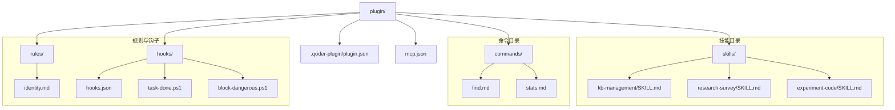
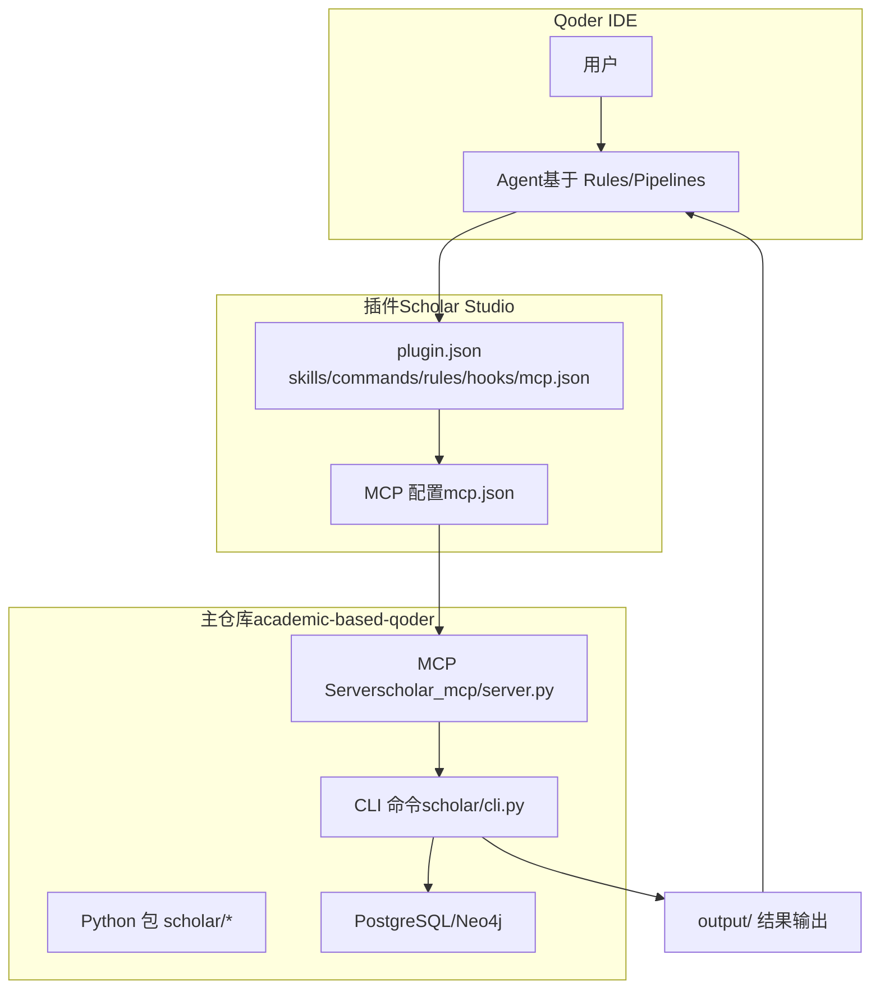
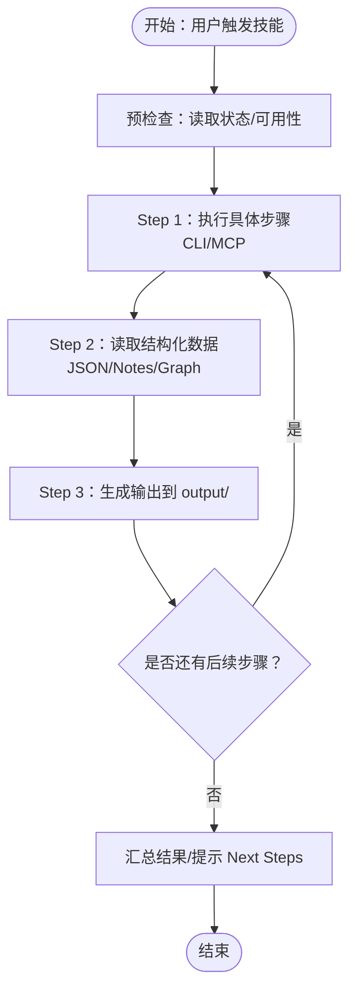
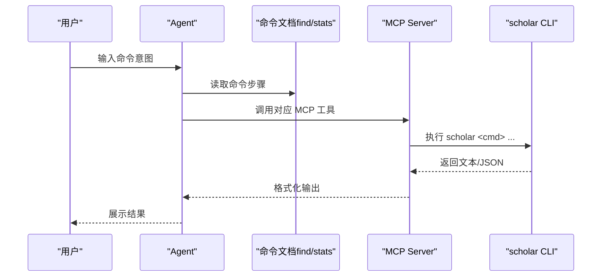
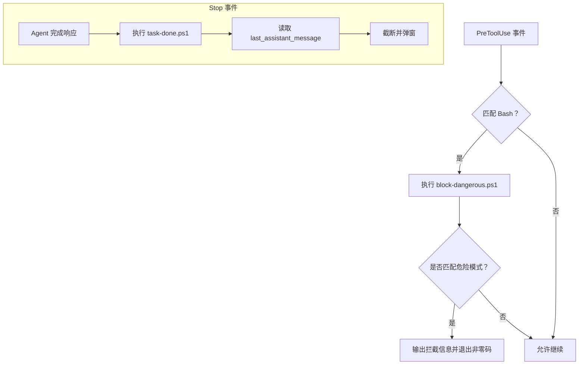
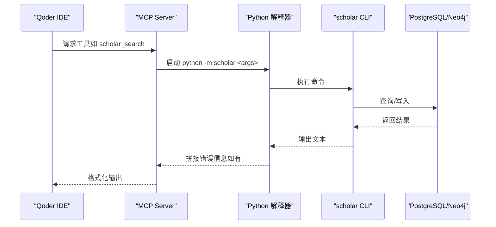
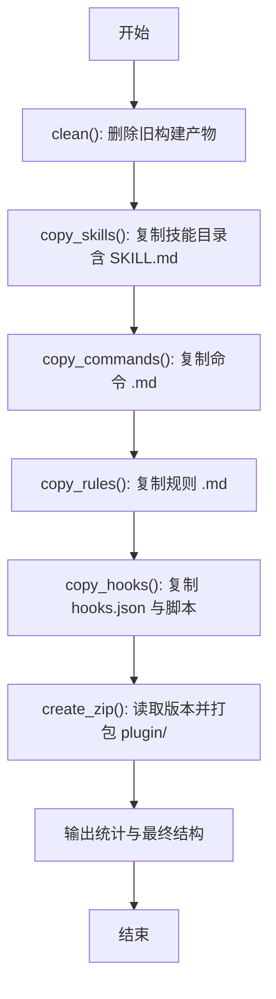
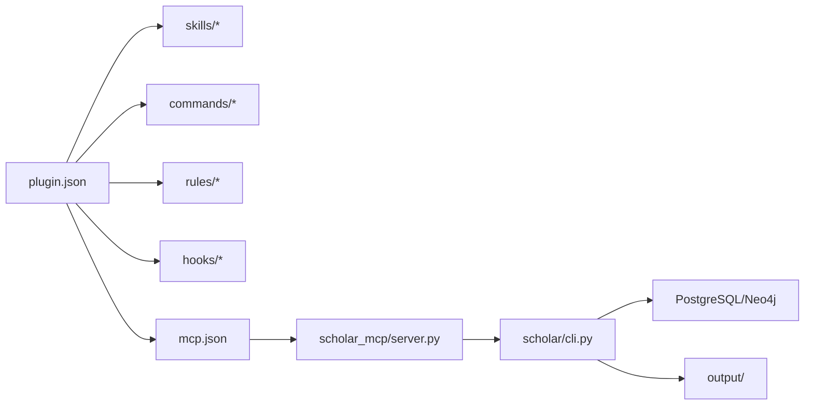

# 插件开发

<cite>
**本文档引用的文件**
- [plugin/README.md](file://plugin/README.md)
- [plugin/.qoder-plugin/plugin.json](file://plugin/.qoder-plugin/plugin.json)
- [plugin/mcp.json](file://plugin/mcp.json)
- [build_plugin.py](file://build_plugin.py)
- [plugin/commands/find.md](file://plugin/commands/find.md)
- [plugin/commands/stats.md](file://plugin/commands/stats.md)
- [plugin/rules/identity.md](file://plugin/rules/identity.md)
- [plugin/hooks/hooks.json](file://plugin/hooks/hooks.json)
- [plugin/hooks/task-done.ps1](file://plugin/hooks/task-done.ps1)
- [plugin/hooks/block-dangerous.ps1](file://plugin/hooks/block-dangerous.ps1)
- [plugin/skills/kb-management/SKILL.md](file://plugin/skills/kb-management/SKILL.md)
- [plugin/skills/research-survey/SKILL.md](file://plugin/skills/research-survey/SKILL.md)
- [plugin/skills/experiment-code/SKILL.md](file://plugin/skills/experiment-code/SKILL.md)
- [plugin/CONNECTORS.md](file://plugin/CONNECTORS.md)
- [scholar/cli.py](file://scholar/cli.py)
- [scholar_mcp/server.py](file://scholar_mcp/server.py)
</cite>

## 目录
1. [简介](#简介)
2. [项目结构](#项目结构)
3. [核心组件](#核心组件)
4. [架构总览](#架构总览)
5. [详细组件分析](#详细组件分析)
6. [依赖分析](#依赖分析)
7. [性能考虑](#性能考虑)
8. [故障排查指南](#故障排查指南)
9. [结论](#结论)
10. [附录](#附录)

## 简介
本指南面向希望基于 Scholar Studio 插件框架进行二次开发的工程师与研究助理。文档围绕技能系统（Skills）、命令系统（Commands）、规则与钩子（Rules/Hooks）、MCP 工具服务器以及构建打包工具展开，提供从目录结构、配置文件格式、接口规范到完整开发流程、调试与测试、性能优化与最佳实践的系统性说明。

## 项目结构
插件工程由“插件清单 + 技能目录 + 命令文档 + 规则与钩子 + MCP 配置”构成，并通过构建脚本打包为可分发的 ZIP 包。下图展示了插件根目录与各子模块的关系：

图表来源
- [plugin/.qoder-plugin/plugin.json:1-23](file://plugin/.qoder-plugin/plugin.json#L1-L23)
- [plugin/commands/find.md:1-7](file://plugin/commands/find.md#L1-L7)
- [plugin/commands/stats.md:1-7](file://plugin/commands/stats.md#L1-L7)
- [plugin/skills/kb-management/SKILL.md:1-59](file://plugin/skills/kb-management/SKILL.md#L1-L59)
- [plugin/skills/research-survey/SKILL.md:1-91](file://plugin/skills/research-survey/SKILL.md#L1-L91)
- [plugin/skills/experiment-code/SKILL.md:1-111](file://plugin/skills/experiment-code/SKILL.md#L1-L111)
- [plugin/hooks/hooks.json:1-27](file://plugin/hooks/hooks.json#L1-L27)
- [plugin/hooks/task-done.ps1:1-24](file://plugin/hooks/task-done.ps1#L1-L24)
- [plugin/hooks/block-dangerous.ps1:1-24](file://plugin/hooks/block-dangerous.ps1#L1-L24)

章节来源
- [plugin/README.md:1-79](file://plugin/README.md#L1-L79)
- [plugin/.qoder-plugin/plugin.json:1-23](file://plugin/.qoder-plugin/plugin.json#L1-L23)

## 核心组件
- 插件清单（plugin.json）：定义插件元数据、版本、入口路径（skills/commands/rules/hooks/mcpServers）。
- 技能（Skills）：以 SKILL.md 描述触发条件、执行流程、注意事项与后续步骤，指导 Agent 逐步完成复杂任务。
- 命令（Commands）：以 .md 文档描述命令目的、执行步骤与调用的 scholar CLI/MCP 工具。
- 规则（Rules）：定义 Agent 的角色、心智模型、工作模式与核心约束，保障输出质量与一致性。
- 钩子（Hooks）：Windows PowerShell 脚本与 hooks.json 配置，实现“任务完成通知”和“危险命令拦截”等安全与体验增强。
- MCP 配置（mcp.json）：声明 MCP 服务器及其命令、参数与环境变量，使 Agent 可调用 scholar CLI 工具。
- 构建脚本（build_plugin.py）：自动化复制 .qoder 下的技能/命令/规则/钩子，打包为 ZIP，供 Qoder 插件市场分发。

章节来源
- [plugin/.qoder-plugin/plugin.json:1-23](file://plugin/.qoder-plugin/plugin.json#L1-L23)
- [plugin/commands/find.md:1-7](file://plugin/commands/find.md#L1-L7)
- [plugin/commands/stats.md:1-7](file://plugin/commands/stats.md#L1-L7)
- [plugin/rules/identity.md:1-69](file://plugin/rules/identity.md#L1-L69)
- [plugin/hooks/hooks.json:1-27](file://plugin/hooks/hooks.json#L1-L27)
- [plugin/mcp.json:1-16](file://plugin/mcp.json#L1-L16)
- [build_plugin.py:1-180](file://build_plugin.py#L1-L180)

## 架构总览
Scholar Studio 插件作为“大脑”，负责定义“做什么、怎么做”；真正的执行由主仓库的 Python 后端与数据库完成。MCP 服务器将 scholar CLI 命令暴露为原生工具，Agent 在对话中触发技能或命令后，通过 MCP 调用 CLI，读取结构化数据并输出到 output/ 目录。

图表来源
- [plugin/README.md:1-79](file://plugin/README.md#L1-L79)
- [plugin/mcp.json:1-16](file://plugin/mcp.json#L1-L16)
- [scholar_mcp/server.py:1-200](file://scholar_mcp/server.py#L1-L200)
- [scholar/cli.py:1-200](file://scholar/cli.py#L1-L200)

## 详细组件分析

### 技能系统（Skills）
- 目录结构：plugin/skills/<skill-name>/SKILL.md
- 内容规范：
  - YAML 头部：name、description
  - 触发：用户常见表述与触发场景
  - 流程：Step-by-step 的执行步骤，包含 CLI/MCP 调用与输出位置
  - 注意事项：数据驱动、引用格式、增量操作、输出约定
  - Next Steps：技能完成后自然的后续动作
- 示例技能：
  - 知识库维护（kb-management）：健康检查、自动更新、元数据回填、图谱同步、RAG 索引同步
  - 全面调研（research-survey）：本地搜索、arXiv 补充、关键词扩展、概念图谱分析、生成调研报告
  - 实验代码生成（experiment-code）：深度阅读、算法要素提取、技术栈确认、代码结构生成、逐步实现、验证与说明文档

图表来源
- [plugin/skills/kb-management/SKILL.md:1-59](file://plugin/skills/kb-management/SKILL.md#L1-L59)
- [plugin/skills/research-survey/SKILL.md:1-91](file://plugin/skills/research-survey/SKILL.md#L1-L91)
- [plugin/skills/experiment-code/SKILL.md:1-111](file://plugin/skills/experiment-code/SKILL.md#L1-L111)

章节来源
- [plugin/skills/kb-management/SKILL.md:1-59](file://plugin/skills/kb-management/SKILL.md#L1-L59)
- [plugin/skills/research-survey/SKILL.md:1-91](file://plugin/skills/research-survey/SKILL.md#L1-L91)
- [plugin/skills/experiment-code/SKILL.md:1-111](file://plugin/skills/experiment-code/SKILL.md#L1-L111)

### 命令系统（Commands）
- 目录结构：plugin/commands/*.md
- 内容规范：
  - 简要描述命令目的
  - 执行步骤：列出调用的 scholar CLI/MCP 工具及参数
  - 输出：说明返回结果与展示方式
- 示例命令：
  - find：全文搜索 + 语义搜索，合并去重并排序展示
  - stats：知识库统计 + 图谱统计，简洁汇总

图表来源
- [plugin/commands/find.md:1-7](file://plugin/commands/find.md#L1-L7)
- [plugin/commands/stats.md:1-7](file://plugin/commands/stats.md#L1-L7)
- [scholar_mcp/server.py:1-200](file://scholar_mcp/server.py#L1-L200)
- [scholar/cli.py:1-200](file://scholar/cli.py#L1-L200)

章节来源
- [plugin/commands/find.md:1-7](file://plugin/commands/find.md#L1-L7)
- [plugin/commands/stats.md:1-7](file://plugin/commands/stats.md#L1-L7)

### 规则与身份（Rules/Identity）
- 目录结构：plugin/rules/identity.md
- 内容要点：
  - 系统心智模型：用户说话 → 读 rules → 匹配 pipelines → 读 SKILL.md → TodoWrite → 逐步执行 → 调用 MCP/CLI → 输出到 output/
  - 两种工作模式：Skill 执行模式（默认）与基础设施模式（开发/调试）
  - 核心约束：数据驱动、引用准确、公式精确、绝不编造、增量操作、输出约定
  - 项目结构速查：rules、skills、data、output、LEAN、scholar、scholar_mcp、infra

章节来源
- [plugin/rules/identity.md:1-69](file://plugin/rules/identity.md#L1-L69)

### 钩子（Hooks）
- 目录结构：plugin/hooks/hooks.json 与 hooks/*.ps1
- 功能：
  - 任务完成通知：Agent 响应完成后弹出 Windows 气泡提示
  - 危险命令拦截：拦截危险 SQL/Docker/系统命令，防止误操作
- 配置与脚本：
  - hooks.json：事件类型、匹配器、命令执行
  - task-done.ps1：读取最后一条助手消息，截断后弹窗
  - block-dangerous.ps1：匹配危险命令模式，输出错误并退出

图表来源
- [plugin/hooks/hooks.json:1-27](file://plugin/hooks/hooks.json#L1-L27)
- [plugin/hooks/task-done.ps1:1-24](file://plugin/hooks/task-done.ps1#L1-L24)
- [plugin/hooks/block-dangerous.ps1:1-24](file://plugin/hooks/block-dangerous.ps1#L1-L24)

章节来源
- [plugin/hooks/hooks.json:1-27](file://plugin/hooks/hooks.json#L1-L27)
- [plugin/hooks/task-done.ps1:1-24](file://plugin/hooks/task-done.ps1#L1-L24)
- [plugin/hooks/block-dangerous.ps1:1-24](file://plugin/hooks/block-dangerous.ps1#L1-L24)

### MCP 服务器与连接器
- MCP 配置（mcp.json）：声明 MCP 服务器名称、命令、参数与环境变量（PostgreSQL/Neo4j 地址）
- MCP 服务器（scholar_mcp/server.py）：将 scholar CLI 命令映射为 MCP 工具，统一超时控制与错误拼接
- 连接器依赖（CONNECTORS.md）：PostgreSQL、Neo4j、智谱 Embedding API、Scholar Python 包

图表来源
- [plugin/mcp.json:1-16](file://plugin/mcp.json#L1-L16)
- [scholar_mcp/server.py:1-200](file://scholar_mcp/server.py#L1-L200)
- [plugin/CONNECTORS.md:1-45](file://plugin/CONNECTORS.md#L1-L45)

章节来源
- [plugin/mcp.json:1-16](file://plugin/mcp.json#L1-L16)
- [scholar_mcp/server.py:1-200](file://scholar_mcp/server.py#L1-L200)
- [plugin/CONNECTORS.md:1-45](file://plugin/CONNECTORS.md#L1-L45)

### 构建工具（build_plugin.py）
- 功能概览：
  - 清理旧产物
  - 从 .qoder 复制 skills/commands/rules/hooks
  - 读取 plugin.json 版本，打包 plugin/ 为 ZIP（根目录无嵌套）
- 使用方法：
  - 直接运行脚本，按阶段输出复制/打包统计
  - 最终输出 scholar-studio-{version}.zip，包含技能、命令、规则、钩子与 MCP 配置
- 注意事项：
  - 仅复制 .md 与必要脚本
  - ZIP 根目录即插件根目录，符合 Qoder 要求

图表来源
- [build_plugin.py:1-180](file://build_plugin.py#L1-L180)

章节来源
- [build_plugin.py:1-180](file://build_plugin.py#L1-L180)

## 依赖分析
- 插件清单（plugin.json）声明各模块入口路径，确保 Qoder IDE 正确加载
- MCP 配置（mcp.json）与 MCP 服务器（server.py）耦合，前者决定工具可见性与参数，后者决定执行行为
- 技能/命令依赖 scholar CLI（cli.py）与数据库（PostgreSQL/Neo4j），输出统一到 output/ 目录
- 钩子脚本与 hooks.json 解耦于业务逻辑，提供横切的安全与体验增强

图表来源
- [plugin/.qoder-plugin/plugin.json:1-23](file://plugin/.qoder-plugin/plugin.json#L1-L23)
- [plugin/mcp.json:1-16](file://plugin/mcp.json#L1-L16)
- [scholar_mcp/server.py:1-200](file://scholar_mcp/server.py#L1-L200)
- [scholar/cli.py:1-200](file://scholar/cli.py#L1-L200)

章节来源
- [plugin/.qoder-plugin/plugin.json:1-23](file://plugin/.qoder-plugin/plugin.json#L1-L23)
- [plugin/mcp.json:1-16](file://plugin/mcp.json#L1-L16)
- [scholar_mcp/server.py:1-200](file://scholar_mcp/server.py#L1-L200)
- [scholar/cli.py:1-200](file://scholar/cli.py#L1-L200)

## 性能考虑
- 批量处理：优先使用批量命令（如 parse-all、graph-build、rag-index）并设置合理超时
- 混合搜索：在命令中采用 hybrid 搜索提升召回，但注意 API 调用频率与配额
- 增量操作：遵循“单条失败不阻塞整批”的原则，逐步推进并记录进度
- 输出缓存：利用 output/ 下的中间产物（notes、parsed、drafts、experiments）避免重复计算
- 资源隔离：数据库与图数据库独立部署，合理规划并发与索引策略

## 故障排查指南
- MCP 工具不可用
  - 检查 mcp.json 中命令与参数是否正确
  - 确认 scholar_mcp 服务器已启动且可访问
  - 查看环境变量（PostgreSQL/Neo4j 地址）是否配置
- CLI 执行失败
  - 在本地运行相同命令，观察返回码与 stderr
  - 检查数据库连通性与权限
- 输出为空或异常
  - 确认知识库已初始化（bootstrap）
  - 检查 output/ 目录权限与磁盘空间
- 钩子未生效
  - 确认 hooks.json 事件类型与匹配器配置
  - 检查 PowerShell 执行策略与脚本路径

章节来源
- [plugin/mcp.json:1-16](file://plugin/mcp.json#L1-L16)
- [scholar_mcp/server.py:1-200](file://scholar_mcp/server.py#L1-L200)
- [plugin/CONNECTORS.md:1-45](file://plugin/CONNECTORS.md#L1-L45)

## 结论
Scholar Studio 插件体系以“规则驱动 + 技能编排 + 命令执行 + MCP 集成 + 安全钩子”为核心，通过标准化的目录结构与配置文件实现可扩展、可维护、可分发的学术研究自动化流水线。开发者可基于本指南快速创建自定义技能与命令，结合构建脚本完成打包发布，并依托 MCP 与 CLI 实现强大的后端能力接入。

## 附录

### 创建自定义技能的完整流程
- 选择模板：在 plugin/skills/ 下新建目录，复制现有 SKILL.md 作为模板
- 编写 SKILL.md：填写触发、流程、注意事项与 Next Steps
- 验证步骤：在本地使用 scholar CLI 逐步验证每个步骤的可行性与输出
- 集成 MCP：在 MCP 服务器中新增对应工具（如需），或直接在 SKILL.md 中调用现有工具
- 打包发布：运行构建脚本，生成 ZIP 并上传至插件市场

章节来源
- [plugin/skills/kb-management/SKILL.md:1-59](file://plugin/skills/kb-management/SKILL.md#L1-L59)
- [plugin/skills/research-survey/SKILL.md:1-91](file://plugin/skills/research-survey/SKILL.md#L1-L91)
- [build_plugin.py:1-180](file://build_plugin.py#L1-L180)

### 命令开发方法
- 命令注册：在 MCP 服务器中新增工具函数，封装 scholar CLI 调用
- 参数处理：严格校验必填参数与可选参数，提供默认值与帮助信息
- 输出格式化：统一返回文本，必要时在 Agent 层进行富文本渲染
- 文档化：在 plugin/commands/ 下编写 .md，描述目的与步骤

章节来源
- [plugin/commands/find.md:1-7](file://plugin/commands/find.md#L1-L7)
- [plugin/commands/stats.md:1-7](file://plugin/commands/stats.md#L1-L7)
- [scholar_mcp/server.py:1-200](file://scholar_mcp/server.py#L1-L200)

### 插件调试与测试
- 本地测试：在主仓库中直接运行 scholar CLI，核对输出结构与字段
- 集成验证：在 Qoder IDE 中触发技能/命令，观察 MCP 工具调用链与输出
- 性能优化：对耗时操作启用批量与缓存，合理设置超时与重试
- 安全加固：启用钩子拦截危险命令，定期审查 hooks.json 与脚本

章节来源
- [plugin/hooks/hooks.json:1-27](file://plugin/hooks/hooks.json#L1-L27)
- [plugin/hooks/task-done.ps1:1-24](file://plugin/hooks/task-done.ps1#L1-L24)
- [plugin/hooks/block-dangerous.ps1:1-24](file://plugin/hooks/block-dangerous.ps1#L1-L24)