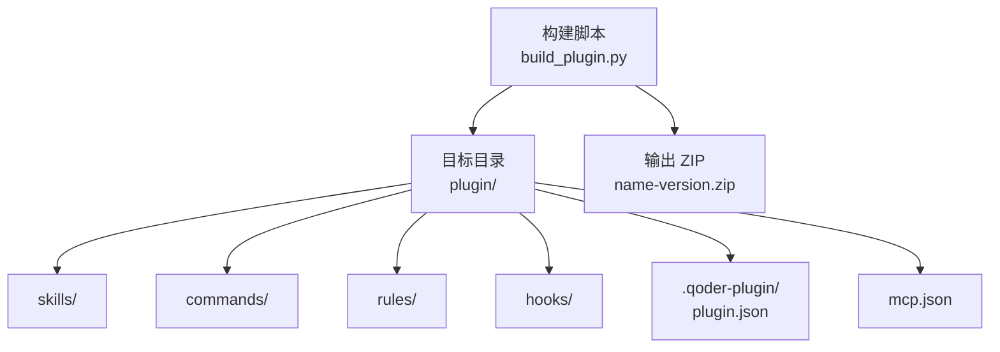
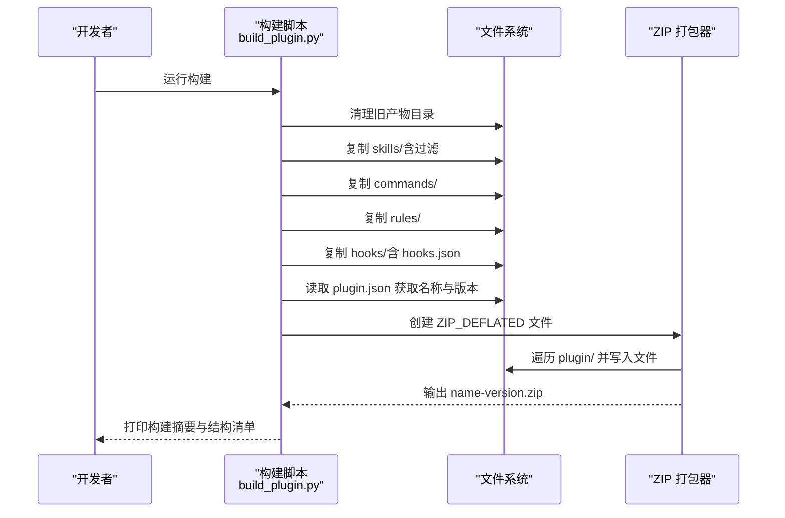
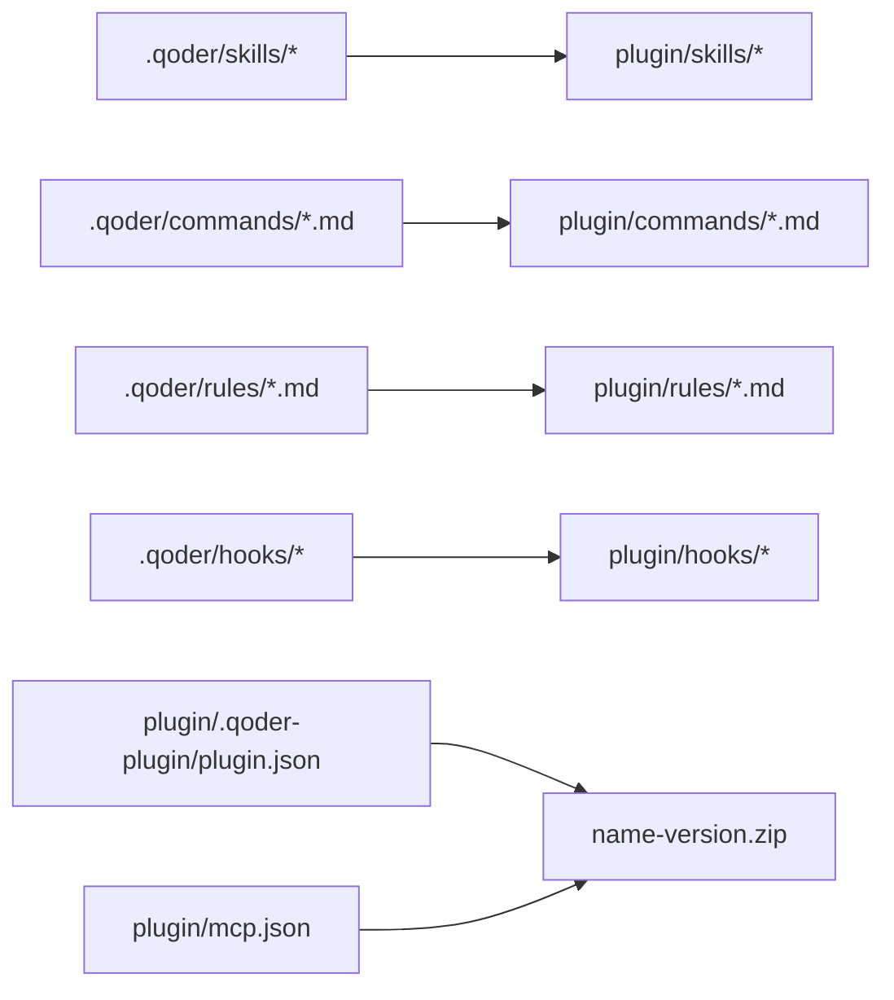
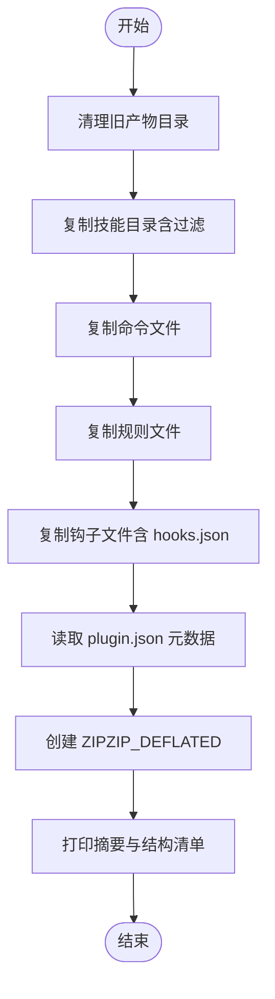

# 插件构建工具

<cite>
**本文档引用的文件**
- [build_plugin.py](file://build_plugin.py)
- [plugin.json](file://plugin/.qoder-plugin/plugin.json)
- [README.md（插件说明）](file://plugin/README.md)
- [mcp.json](file://plugin/mcp.json)
</cite>

## 目录
1. [简介](#简介)
2. [项目结构](#项目结构)
3. [核心组件](#核心组件)
4. [架构总览](#架构总览)
5. [详细组件分析](#详细组件分析)
6. [依赖分析](#依赖分析)
7. [性能考虑](#性能考虑)
8. [故障排除指南](#故障排除指南)
9. [结论](#结论)
10. [附录](#附录)

## 简介
本指南面向需要使用构建脚本打包“Scholar Studio”插件的开发者与运维人员。文档围绕 build_plugin.py 的工作原理展开，系统讲解清理、复制、打包等步骤；同时文档化 plugin.json 的结构与字段含义，并解释构建过程中的文件处理逻辑（目录遍历、文件过滤、压缩算法）。最后提供使用示例、常见问题与优化建议，帮助你高效完成插件的自动化构建与分发。

## 项目结构
该插件工程采用“源内容位于 .qoder 目录，构建时复制到 plugin 目录”的模式。构建产物最终被打包为 ZIP 文件，供外部平台（如 QoderWork 插件市场）安装使用。

图表来源
- [build_plugin.py:14-24](file://build_plugin.py#L14-L24)
- [build_plugin.py:95-129](file://build_plugin.py#L95-L129)

章节来源
- [build_plugin.py:14-24](file://build_plugin.py#L14-L24)
- [build_plugin.py:95-129](file://build_plugin.py#L95-L129)

## 核心组件
- 清理阶段：删除旧的构建产物目录（skills、commands、rules、hooks），避免历史文件污染新构建。
- 复制阶段：按类型将 .qoder 下的内容复制到 plugin 对应子目录。
  - 技能（skills）：仅复制包含特定描述文件的目录，并复制目录内所有文件。
  - 命令（commands）：复制 .qoder/commands 下的所有 Markdown 文件。
  - 规则（rules）：复制 .qoder/rules 下的所有 Markdown 文件。
  - 钩子（hooks）：复制 .qoder/hooks 下的所有文件，并处理插件自有的 hooks.json。
- 打包阶段：读取 plugin.json 获取名称与版本，生成 name-version.zip，使用 ZIP_DEFLATED 压缩，根目录即 plugin 根，不额外嵌套。

章节来源
- [build_plugin.py:26-32](file://build_plugin.py#L26-L32)
- [build_plugin.py:34-54](file://build_plugin.py#L34-L54)
- [build_plugin.py:57-65](file://build_plugin.py#L57-L65)
- [build_plugin.py:68-76](file://build_plugin.py#L68-L76)
- [build_plugin.py:79-92](file://build_plugin.py#L79-L92)
- [build_plugin.py:95-129](file://build_plugin.py#L95-L129)

## 架构总览
下图展示了从源内容到最终 ZIP 的整体流程，以及各阶段的职责边界。

图表来源
- [build_plugin.py:132-179](file://build_plugin.py#L132-L179)
- [build_plugin.py:95-129](file://build_plugin.py#L95-L129)

## 详细组件分析

### 构建脚本：build_plugin.py
- 目标与入口
  - 作用：将 .qoder 下的技能、命令、规则、钩子复制到 plugin 目录，并打包为可分发的 ZIP。
  - 入口：直接运行脚本触发主流程。
- 关键函数
  - clean：移除 plugin/skills、plugin/commands、plugin/rules、plugin/hooks 的旧目录。
  - copy_skills：遍历 .qoder/skills，仅当目录包含特定描述文件时才复制整个目录内的文件至 plugin/skills。
  - copy_commands：复制 .qoder/commands 下的全部 Markdown 文件至 plugin/commands。
  - copy_rules：复制 .qoder/rules 下的全部 Markdown 文件至 plugin/rules。
  - copy_hooks：复制 .qoder/hooks 下的全部文件至 plugin/hooks，并处理插件自有 hooks.json。
  - create_zip：读取 plugin/.qoder-plugin/plugin.json 中的 name 与 version，生成 name-version.zip；遍历 plugin/，跳过缓存与版本控制目录，使用 ZIP_DEFLATED 压缩。
  - main：串联上述步骤，打印进度与摘要，并列出最终插件顶层结构。
- 文件处理细节
  - 目录遍历：使用 os.walk 遍历 plugin/，在进入子目录前过滤掉不需要的目录。
  - 文件过滤：复制阶段对技能目录进行存在性校验；打包阶段跳过缓存与版本控制目录。
  - 压缩算法：使用 ZIP_DEFLATED，确保压缩比与兼容性。
- 输出与日志
  - 每步操作均输出统计信息（数量、大小等），便于审计与排障。

章节来源
- [build_plugin.py:26-32](file://build_plugin.py#L26-L32)
- [build_plugin.py:34-54](file://build_plugin.py#L34-L54)
- [build_plugin.py:57-65](file://build_plugin.py#L57-L65)
- [build_plugin.py:68-76](file://build_plugin.py#L68-L76)
- [build_plugin.py:79-92](file://build_plugin.py#L79-L92)
- [build_plugin.py:95-129](file://build_plugin.py#L95-L129)
- [build_plugin.py:132-179](file://build_plugin.py#L132-L179)

### 配置文件：plugin.json
- 位置：plugin/.qoder-plugin/plugin.json
- 字段说明
  - name：插件名称（用于生成 ZIP 文件名）。
  - version：插件版本号（用于生成 ZIP 文件名）。
  - displayName：显示名称。
  - description：简要描述。
  - author：作者信息（name）。
  - keywords：关键词数组，便于检索与分类。
  - homepage/repository/license：项目主页、仓库地址、许可证。
  - skills/commands/rules/hooks/mcpServers：各资源的相对路径。
- 作用：构建脚本读取该文件以确定输出 ZIP 名称与版本；同时该文件作为插件元数据与依赖声明的依据。

章节来源
- [plugin.json:1-23](file://plugin/.qoder-plugin/plugin.json#L1-L23)

### MCP 配置：mcp.json
- 位置：plugin/mcp.json
- 内容要点：定义 MCP 服务器“scholar”，包括启动命令、参数与环境变量（数据库与图数据库连接信息）。
- 作用：为插件提供 MCP 服务的调用入口，使外部平台能够通过 MCP 与后端交互。

章节来源
- [mcp.json:1-16](file://plugin/mcp.json#L1-L16)

### 插件说明：README.md（插件）
- 位置：plugin/README.md
- 内容要点：架构说明、安装步骤、包含能力列表、Skills 与 Commands 的概览。
- 作用：帮助用户理解插件的定位、安装方式与能力范围。

章节来源
- [README.md（插件说明）:1-79](file://plugin/README.md#L1-L79)

## 依赖分析
- 构建脚本依赖
  - 标准库：shutil、zipfile、os、json、pathlib。
  - 运行时依赖：plugin/.qoder-plugin/plugin.json（用于读取 name 与 version）。
- 目录映射
  - .qoder/skills → plugin/skills
  - .qoder/commands → plugin/commands
  - .qoder/rules → plugin/rules
  - .qoder/hooks → plugin/hooks
  - plugin/.qoder-plugin/plugin.json → 构建产物元数据
  - plugin/mcp.json → MCP 服务配置

图表来源
- [build_plugin.py:14-24](file://build_plugin.py#L14-L24)
- [build_plugin.py:95-129](file://build_plugin.py#L95-L129)

章节来源
- [build_plugin.py:14-24](file://build_plugin.py#L14-L24)
- [build_plugin.py:95-129](file://build_plugin.py#L95-L129)

## 性能考虑
- 压缩算法：使用 ZIP_DEFLATED 可获得较好的压缩率与跨平台兼容性。
- 目录遍历：在遍历 plugin/ 时显式过滤缓存与版本控制目录，减少 IO 与打包时间。
- 文件复制：复制阶段尽量只复制必要文件，避免冗余内容进入 ZIP。
- 并行化：当前脚本为顺序执行，若后续扩展可考虑将多目录复制阶段并行化（注意线程安全与磁盘 IO 争用）。

## 故障排除指南
- 无法找到 .qoder 目录
  - 现象：复制阶段找不到 .qoder/skills、.qoder/commands 等。
  - 原因：当前仓库中 .qoder 目录不存在，构建脚本仅会复制 plugin 下已存在的内容。
  - 解决：确保 .qoder 目录存在且包含所需内容，或调整脚本以支持从其他源复制。
- ZIP 文件名异常
  - 现象：生成的 ZIP 名称不符合预期。
  - 原因：plugin.json 中的 name 或 version 缺失或为空。
  - 解决：检查 plugin.json 的 name 与 version 字段是否有效。
- 打包体积过大
  - 现象：生成的 ZIP 包体较大。
  - 原因：plugin/ 中包含大量不必要的文件或缓存。
  - 解决：在复制阶段增加过滤策略，或在 create_zip 中进一步排除不需要的文件类型。
- 权限问题
  - 现象：脚本在 Windows 上运行时报权限错误。
  - 解决：以管理员身份运行 PowerShell 或 CMD，确保对 plugin 目录有读写权限。

章节来源
- [build_plugin.py:95-129](file://build_plugin.py#L95-L129)
- [plugin.json:1-23](file://plugin/.qoder-plugin/plugin.json#L1-L23)

## 结论
通过 build_plugin.py，你可以将 .qoder 下的技能、命令、规则与钩子复制到 plugin 目录，并基于 plugin.json 的元数据生成标准 ZIP 包。结合 plugin/mcp.json，插件可对外提供 MCP 服务接口。遵循本文档的流程与最佳实践，可以稳定地完成插件的自动化构建与发布。

## 附录

### 使用示例
- 准备源文件
  - 在 .qoder 目录准备好 skills、commands、rules、hooks 的内容（若不存在，请先补齐）。
- 运行构建
  - 在项目根目录执行构建脚本，等待脚本完成清理、复制与打包。
- 安装与验证
  - 在 QoderWork 插件市场搜索并安装生成的 ZIP，或手动导入。
  - 在对话中输入示例命令，验证插件功能。

章节来源
- [build_plugin.py:132-179](file://build_plugin.py#L132-L179)
- [README.md（插件说明）:19-49](file://plugin/README.md#L19-L49)

### 构建流程图（代码级）

图表来源
- [build_plugin.py:26-32](file://build_plugin.py#L26-L32)
- [build_plugin.py:34-54](file://build_plugin.py#L34-L54)
- [build_plugin.py:57-65](file://build_plugin.py#L57-L65)
- [build_plugin.py:68-76](file://build_plugin.py#L68-L76)
- [build_plugin.py:79-92](file://build_plugin.py#L79-L92)
- [build_plugin.py:95-129](file://build_plugin.py#L95-L129)
- [build_plugin.py:132-179](file://build_plugin.py#L132-L179)