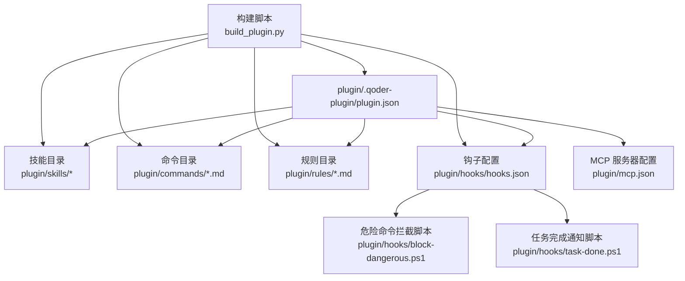
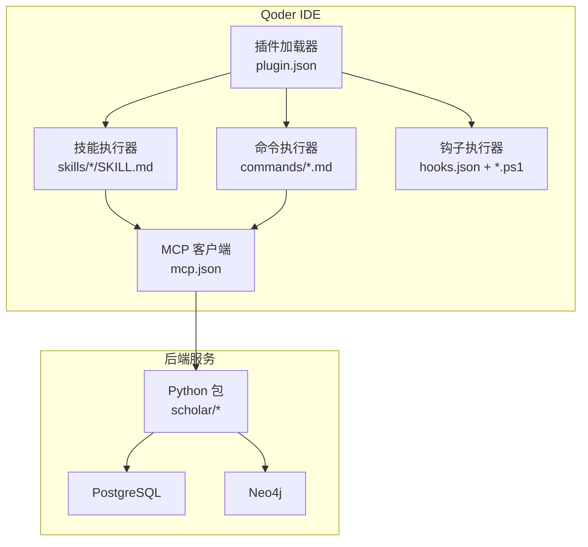
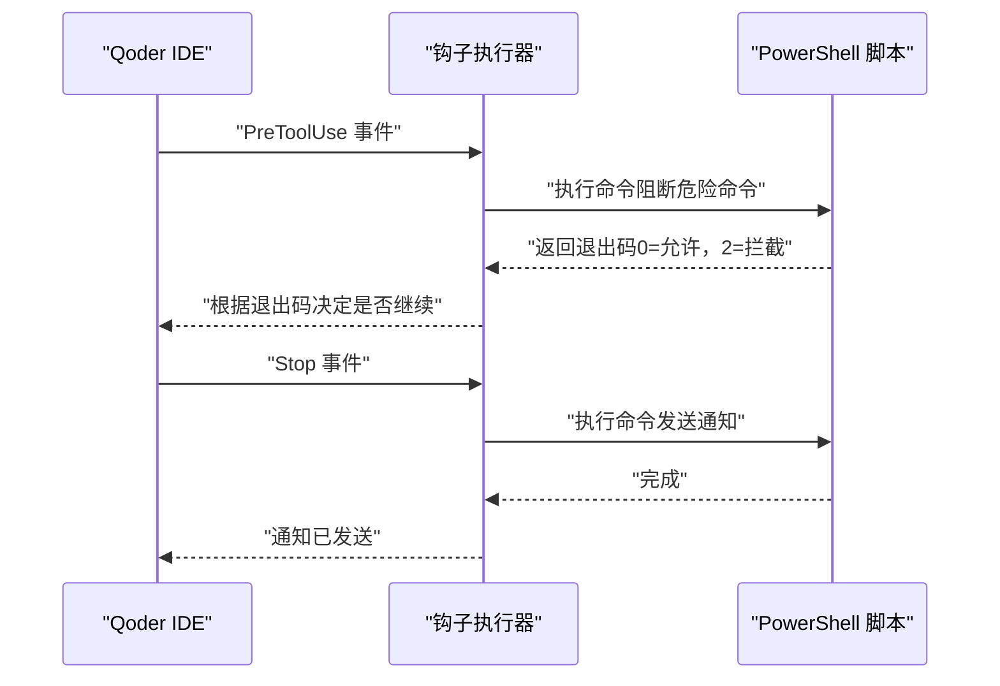
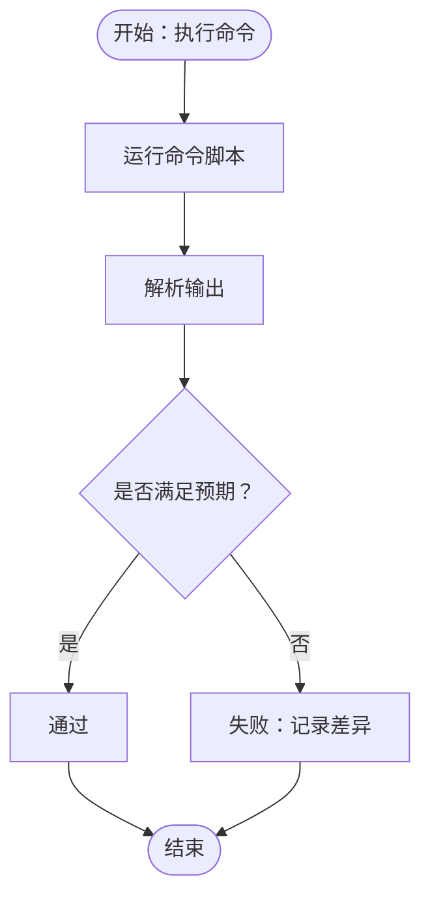
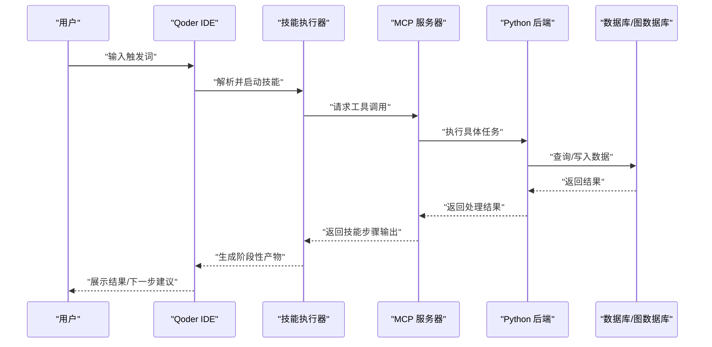
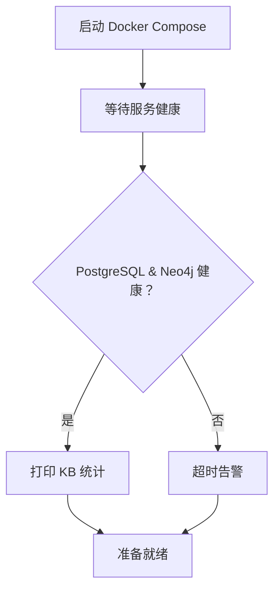
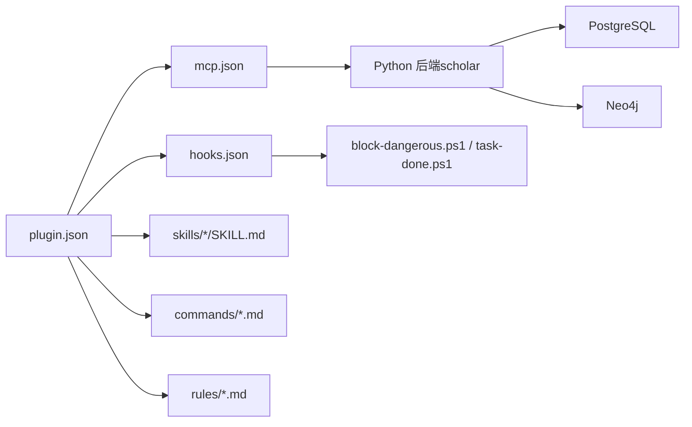

# 插件测试与调试

<cite>
**本文档引用的文件**
- [plugin/.qoder-plugin/plugin.json](file://plugin/.qoder-plugin/plugin.json)
- [plugin/hooks/hooks.json](file://plugin/hooks/hooks.json)
- [plugin/hooks/block-dangerous.ps1](file://plugin/hooks/block-dangerous.ps1)
- [plugin/hooks/task-done.ps1](file://plugin/hooks/task-done.ps1)
- [plugin/mcp.json](file://plugin/mcp.json)
- [plugin/README.md](file://plugin/README.md)
- [plugin/commands/stats.md](file://plugin/commands/stats.md)
- [plugin/commands/find.md](file://plugin/commands/find.md)
- [plugin/commands/paper.md](file://plugin/commands/paper.md)
- [plugin/commands/health.md](file://plugin/commands/health.md)
- [plugin/skills/research-survey/SKILL.md](file://plugin/skills/research-survey/SKILL.md)
- [plugin/skills/paper-deep-dive/SKILL.md](file://plugin/skills/paper-deep-dive/SKILL.md)
- [plugin/skills/writing-pipeline/SKILL.md](file://plugin/skills/writing-pipeline/SKILL.md)
- [build_plugin.py](file://build_plugin.py)
- [startup.ps1](file://startup.ps1)
- [requirements.txt](file://requirements.txt)
</cite>

## 目录
1. [简介](#简介)
2. [项目结构](#项目结构)
3. [核心组件](#核心组件)
4. [架构总览](#架构总览)
5. [详细组件分析](#详细组件分析)
6. [依赖分析](#依赖分析)
7. [性能考虑](#性能考虑)
8. [故障排查指南](#故障排查指南)
9. [结论](#结论)
10. [附录](#附录)

## 简介
本指南面向在 Qoder IDE 中开发与测试 Scholar Studio 插件的工程师与测试人员，覆盖测试策略（单元测试、集成测试、端到端测试）、测试环境搭建、调试方法（日志分析、断点调试、性能分析）、钩子系统使用（hooks.json 配置、危险操作拦截、任务完成通知）、在 Qoder IDE 中的集成测试方法（技能调用测试、命令执行验证、UI 交互测试）、常见问题诊断与解决，以及测试自动化与持续集成最佳实践。

## 项目结构
插件目录组织清晰，采用“功能分层 + 配置驱动”的方式：
- 插件元数据与入口：plugin/.qoder-plugin/plugin.json
- 技能（Skills）：plugin/skills/*（每个技能一个目录，包含 SKILL.md）
- 命令（Commands）：plugin/commands/*.md
- 规则（Rules）：plugin/rules/*.md
- 钩子（Hooks）：plugin/hooks/*（包含 hooks.json、PowerShell 钩子脚本）
- MCP 服务器配置：plugin/mcp.json
- 构建脚本：build_plugin.py（打包插件）
- 后端依赖与启动：requirements.txt、startup.ps1

图表来源
- [plugin/.qoder-plugin/plugin.json:1-23](file://plugin/.qoder-plugin/plugin.json#L1-L23)
- [plugin/hooks/hooks.json:1-27](file://plugin/hooks/hooks.json#L1-L27)
- [plugin/hooks/block-dangerous.ps1:1-24](file://plugin/hooks/block-dangerous.ps1#L1-L24)
- [plugin/hooks/task-done.ps1:1-24](file://plugin/hooks/task-done.ps1#L1-L24)
- [plugin/mcp.json:1-16](file://plugin/mcp.json#L1-L16)
- [build_plugin.py:1-180](file://build_plugin.py#L1-L180)

章节来源
- [plugin/.qoder-plugin/plugin.json:1-23](file://plugin/.qoder-plugin/plugin.json#L1-L23)
- [plugin/README.md:1-79](file://plugin/README.md#L1-L79)
- [build_plugin.py:1-180](file://build_plugin.py#L1-L180)

## 核心组件
- 插件元数据与路由
  - plugin.json 定义插件名称、版本、入口路径（skills、commands、rules、hooks、mcpServers），用于 Qoder IDE 识别与加载。
- 钩子系统
  - hooks.json 定义事件与钩子链，支持 PreToolUse（危险命令拦截）与 Stop（任务完成通知）两类事件。
  - PowerShell 脚本实现具体拦截与通知逻辑。
- 命令与技能
  - commands/*.md 定义命令执行步骤与期望输出，便于测试命令执行验证。
  - skills/*/SKILL.md 定义技能流程与下一步动作，便于测试端到端工作流。
- MCP 服务器
  - mcp.json 指定后端 MCP 服务（python -m scholar_mcp），连接数据库与图数据库，支撑技能与命令执行。
- 构建与打包
  - build_plugin.py 将 .qoder 下的资源复制到 plugin/ 并打包为 .zip，确保 IDE 正确加载。

章节来源
- [plugin/.qoder-plugin/plugin.json:1-23](file://plugin/.qoder-plugin/plugin.json#L1-L23)
- [plugin/hooks/hooks.json:1-27](file://plugin/hooks/hooks.json#L1-L27)
- [plugin/hooks/block-dangerous.ps1:1-24](file://plugin/hooks/block-dangerous.ps1#L1-L24)
- [plugin/hooks/task-done.ps1:1-24](file://plugin/hooks/task-done.ps1#L1-L24)
- [plugin/commands/stats.md:1-7](file://plugin/commands/stats.md#L1-L7)
- [plugin/commands/find.md:1-7](file://plugin/commands/find.md#L1-L7)
- [plugin/commands/paper.md:1-11](file://plugin/commands/paper.md#L1-L11)
- [plugin/commands/health.md:1-10](file://plugin/commands/health.md#L1-L10)
- [plugin/skills/research-survey/SKILL.md:1-91](file://plugin/skills/research-survey/SKILL.md#L1-L91)
- [plugin/skills/paper-deep-dive/SKILL.md:1-58](file://plugin/skills/paper-deep-dive/SKILL.md#L1-L58)
- [plugin/skills/writing-pipeline/SKILL.md:1-61](file://plugin/skills/writing-pipeline/SKILL.md#L1-L61)
- [plugin/mcp.json:1-16](file://plugin/mcp.json#L1-L16)
- [build_plugin.py:1-180](file://build_plugin.py#L1-L180)

## 架构总览
下图展示了插件在 Qoder IDE 中的运行时架构：IDE 通过插件元数据加载技能、命令、规则与钩子；技能与命令通过 MCP 服务器调用后端 Python 包（scholar）执行具体任务；钩子在特定事件（如工具使用前、停止）触发外部脚本以增强安全性与可观测性。

图表来源
- [plugin/.qoder-plugin/plugin.json:1-23](file://plugin/.qoder-plugin/plugin.json#L1-L23)
- [plugin/hooks/hooks.json:1-27](file://plugin/hooks/hooks.json#L1-L27)
- [plugin/mcp.json:1-16](file://plugin/mcp.json#L1-L16)
- [plugin/README.md:1-79](file://plugin/README.md#L1-L79)

## 详细组件分析

### 钩子系统：配置与行为
- 事件类型
  - PreToolUse：在工具使用前执行，用于拦截危险命令。
  - Stop：在对话结束时执行，用于发送任务完成通知。
- 配置位置与语法
  - hooks.json 定义事件与钩子链，每个钩子可指定 type=command 与 command 参数。
  - ${QODER_PLUGIN_ROOT} 会被替换为插件根目录，确保脚本路径正确。
- 危险命令拦截
  - block-dangerous.ps1 会读取输入 JSON 中的命令字段，匹配危险 SQL 与 Docker/系统命令，阻断并返回非零退出码。
- 任务完成通知
  - task-done.ps1 读取最后一条助手消息，截断过长内容，使用 Windows 通知提醒用户。

图表来源
- [plugin/hooks/hooks.json:1-27](file://plugin/hooks/hooks.json#L1-L27)
- [plugin/hooks/block-dangerous.ps1:1-24](file://plugin/hooks/block-dangerous.ps1#L1-L24)
- [plugin/hooks/task-done.ps1:1-24](file://plugin/hooks/task-done.ps1#L1-L24)

章节来源
- [plugin/hooks/hooks.json:1-27](file://plugin/hooks/hooks.json#L1-L27)
- [plugin/hooks/block-dangerous.ps1:1-24](file://plugin/hooks/block-dangerous.ps1#L1-L24)
- [plugin/hooks/task-done.ps1:1-24](file://plugin/hooks/task-done.ps1#L1-L24)

### 命令测试：执行步骤与期望输出
- stats 命令
  - 执行步骤：运行基础统计、图谱统计，并汇总覆盖率与数量。
  - 测试要点：验证输出包含论文数、图谱节点/边数、RAG chunks 数量等指标。
- find 命令
  - 执行步骤：全文搜索与语义搜索合并去重，按相关度排序展示前 10 篇论文。
  - 测试要点：校验返回条目数量、字段完整性（标题、年份、质量等级、关键匹配段落）。
- paper 命令
  - 执行步骤：查询论文信息、质量评分、阅读笔记摘要、引用关系。
  - 测试要点：校验信息来源（ULID/arXiv ID/DOI/slug）、质量评分文件与笔记文件存在性。
- health 命令
  - 执行步骤：检查元数据覆盖率、PG 一致性、Neo4j 连通性、RAG chunks 数量，并给出修复建议。
  - 测试要点：识别缺失项（缺年份、缺作者、未评分、未分类）并验证建议命令。

图表来源
- [plugin/commands/stats.md:1-7](file://plugin/commands/stats.md#L1-L7)
- [plugin/commands/find.md:1-7](file://plugin/commands/find.md#L1-L7)
- [plugin/commands/paper.md:1-11](file://plugin/commands/paper.md#L1-L11)
- [plugin/commands/health.md:1-10](file://plugin/commands/health.md#L1-L10)

章节来源
- [plugin/commands/stats.md:1-7](file://plugin/commands/stats.md#L1-L7)
- [plugin/commands/find.md:1-7](file://plugin/commands/find.md#L1-L7)
- [plugin/commands/paper.md:1-11](file://plugin/commands/paper.md#L1-L11)
- [plugin/commands/health.md:1-10](file://plugin/commands/health.md#L1-L10)

### 技能测试：端到端工作流
- research-survey（全面文献调研）
  - 触发条件：用户输入包含“调研/调查/survey”等关键词。
  - 测试要点：预检查知识库状态、本地双路搜索（全文+语义）、arXiv 外部搜索、关键词扩展、深度阅读关键论文、概念图谱分析、生成调研报告。
- paper-deep-dive（单篇深度分析）
  - 触发条件：用户输入包含“精读/深度分析/分析这篇论文”等关键词。
  - 测试要点：加载论文数据（支持混合 ID）、深度阅读、质量评估、公式推导、引用网络分析、生成实验代码框架、输出深度分析报告。
- writing-pipeline（端到端学术写作）
  - 触发条件：用户输入包含“写论文/writing/学术写作”等关键词。
  - 测试要点：主题调研、阅读关键论文笔记、撰写 Related Work、撰写完整论文、LaTeX 编译、自审报告。

图表来源
- [plugin/skills/research-survey/SKILL.md:1-91](file://plugin/skills/research-survey/SKILL.md#L1-L91)
- [plugin/skills/paper-deep-dive/SKILL.md:1-58](file://plugin/skills/paper-deep-dive/SKILL.md#L1-L58)
- [plugin/skills/writing-pipeline/SKILL.md:1-61](file://plugin/skills/writing-pipeline/SKILL.md#L1-L61)
- [plugin/mcp.json:1-16](file://plugin/mcp.json#L1-L16)

章节来源
- [plugin/skills/research-survey/SKILL.md:1-91](file://plugin/skills/research-survey/SKILL.md#L1-L91)
- [plugin/skills/paper-deep-dive/SKILL.md:1-58](file://plugin/skills/paper-deep-dive/SKILL.md#L1-L58)
- [plugin/skills/writing-pipeline/SKILL.md:1-61](file://plugin/skills/writing-pipeline/SKILL.md#L1-L61)

### MCP 服务器与后端依赖
- MCP 服务器配置
  - mcp.json 指定命令为 python -m scholar_mcp，并设置数据库连接环境变量（PostgreSQL 与 Neo4j）。
- 后端依赖
  - requirements.txt 包含 typer、rich、psycopg2-binary、neo4j、python-dotenv、PyMuPDF、mcp 等，确保 MCP 与数据库交互正常。
- 启动与健康检查
  - startup.ps1 使用 docker compose 启动 PostgreSQL 与 Neo4j，并等待健康状态，随后打印知识库统计信息。

图表来源
- [plugin/mcp.json:1-16](file://plugin/mcp.json#L1-L16)
- [requirements.txt:1-9](file://requirements.txt#L1-L9)
- [startup.ps1:1-65](file://startup.ps1#L1-L65)

章节来源
- [plugin/mcp.json:1-16](file://plugin/mcp.json#L1-L16)
- [requirements.txt:1-9](file://requirements.txt#L1-L9)
- [startup.ps1:1-65](file://startup.ps1#L1-L65)

## 依赖分析
- 插件与后端耦合
  - 插件通过 MCP 服务器调用后端 Python 包（scholar），技能与命令的执行依赖数据库与图数据库。
- 钩子与系统集成
  - 钩子脚本依赖 PowerShell 与 Windows 通知系统，事件由 IDE 在特定生命周期触发。
- 构建与分发
  - build_plugin.py 负责复制与打包，确保插件目录结构符合 IDE 要求。

图表来源
- [plugin/.qoder-plugin/plugin.json:1-23](file://plugin/.qoder-plugin/plugin.json#L1-L23)
- [plugin/mcp.json:1-16](file://plugin/mcp.json#L1-L16)
- [plugin/hooks/hooks.json:1-27](file://plugin/hooks/hooks.json#L1-L27)
- [plugin/hooks/block-dangerous.ps1:1-24](file://plugin/hooks/block-dangerous.ps1#L1-L24)
- [plugin/hooks/task-done.ps1:1-24](file://plugin/hooks/task-done.ps1#L1-L24)

章节来源
- [plugin/.qoder-plugin/plugin.json:1-23](file://plugin/.qoder-plugin/plugin.json#L1-L23)
- [plugin/mcp.json:1-16](file://plugin/mcp.json#L1-L16)
- [plugin/hooks/hooks.json:1-27](file://plugin/hooks/hooks.json#L1-L27)
- [build_plugin.py:1-180](file://build_plugin.py#L1-L180)

## 性能考虑
- 搜索与检索
  - 文本搜索与语义搜索（RAG）组合可能带来较高计算开销，建议在测试中控制搜索范围与返回条数。
- 图数据库查询
  - 概念图谱查询（graph-query）与引用网络分析（cite-network）涉及大规模图遍历，建议在测试环境中使用小规模数据集。
- 编译与渲染
  - LaTeX 编译与 PDF 渲染可能耗时较长，建议在 CI 中缩短编译次数或仅在必要时执行。
- 钩子脚本
  - PowerShell 脚本在每次事件触发时执行，应避免复杂 IO 或阻塞操作，确保 IDE 响应流畅。

## 故障排查指南
- 权限问题
  - 钩子脚本需要以足够权限运行 PowerShell 脚本（ExecutionPolicy Bypass）。若拦截失败，检查脚本执行策略与路径解析（${QODER_PLUGIN_ROOT}）。
- 依赖冲突
  - 后端依赖版本不一致可能导致 MCP 通信异常。建议在隔离环境中安装 requirements.txt 并核对版本。
- 兼容性问题
  - 不同操作系统下的钩子脚本（PowerShell）不可用。请在 Windows 环境下启用钩子功能。
- 数据库连通性
  - 若 MCP 无法连接数据库，请检查 mcp.json 中的环境变量（SCHOLAR_PG_HOST、SCHOLAR_PG_PORT、SCHOLAR_NEO4J_URI）与 startup.ps1 的健康检查结果。
- 插件加载失败
  - 检查 plugin.json 的路径映射（skills、commands、rules、hooks、mcpServers）与 build_plugin.py 的打包结果。

章节来源
- [plugin/hooks/block-dangerous.ps1:1-24](file://plugin/hooks/block-dangerous.ps1#L1-L24)
- [plugin/hooks/task-done.ps1:1-24](file://plugin/hooks/task-done.ps1#L1-L24)
- [plugin/mcp.json:1-16](file://plugin/mcp.json#L1-L16)
- [requirements.txt:1-9](file://requirements.txt#L1-L9)
- [startup.ps1:1-65](file://startup.ps1#L1-L65)
- [plugin/.qoder-plugin/plugin.json:1-23](file://plugin/.qoder-plugin/plugin.json#L1-L23)
- [build_plugin.py:1-180](file://build_plugin.py#L1-L180)

## 结论
通过明确的测试策略（单元、集成、端到端）、完善的钩子安全机制、清晰的命令与技能流程定义，以及可靠的 MCP 与后端依赖配置，可以高效地在 Qoder IDE 中验证与调试 Scholar Studio 插件。建议在本地与 CI 中结合健康检查脚本与最小化数据集进行自动化测试，确保稳定性与可重复性。

## 附录

### 测试策略与实施清单
- 单元测试
  - 钩子脚本：针对 block-dangerous.ps1 与 task-done.ps1 编写输入输出断言，覆盖危险命令匹配与通知逻辑。
  - 命令解析：验证 commands/*.md 的执行步骤与输出格式，确保与后端返回一致。
- 集成测试
  - MCP 服务器：启动后端与数据库容器，验证 python -m scholar_mcp 可用性与工具列表。
  - 钩子事件：在 IDE 中触发 PreToolUse 与 Stop 事件，验证脚本执行与退出码。
- 端到端测试
  - 技能工作流：以 research-survey、paper-deep-dive、writing-pipeline 为例，模拟完整流程并校验阶段性产物。
  - UI 交互：在 IDE 中执行命令与技能，观察输出、下一步建议与通知提示。

### 调试方法与工具
- 日志分析
  - 后端日志：查看 Python 包（scholar）的标准输出与错误输出，定位工具调用与数据库访问问题。
  - 钩子日志：在 PowerShell 脚本中添加日志输出，记录输入 JSON 与匹配结果。
- 断点调试
  - 在 IDE 中设置断点，逐步跟踪技能执行链路，观察 MCP 返回值与下一步建议。
- 性能分析
  - 使用性能剖析工具（如 Python cProfile）分析关键技能步骤的耗时热点，优化搜索与图查询。

### 持续集成最佳实践
- 环境准备
  - 使用 Docker Compose 启动数据库与图数据库，等待健康状态后再执行测试。
- 测试矩阵
  - 覆盖不同操作系统（Windows/Linux/macOS）与 Python 版本，重点关注 Windows 上的钩子脚本。
- 自动化脚本
  - 将 startup.ps1 与 build_plugin.py 集成到 CI 流水线，确保每次提交都验证插件打包与基本功能。
- 结果归档
  - 归档测试日志、覆盖率报告与插件包，便于回溯与审计。