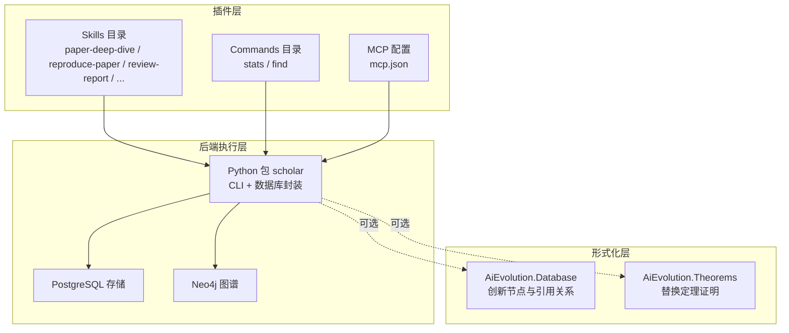
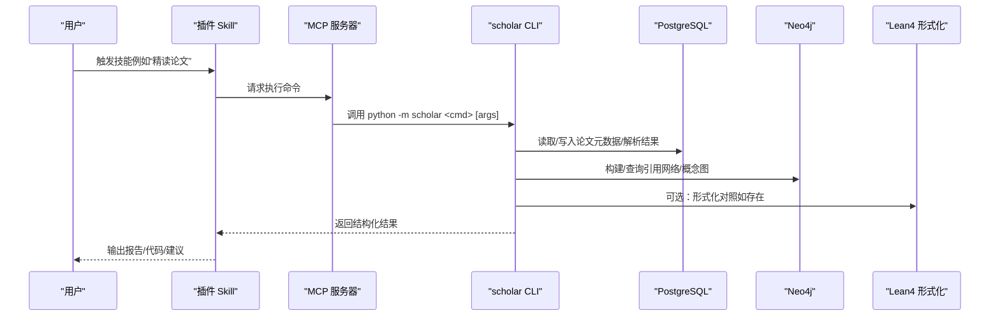
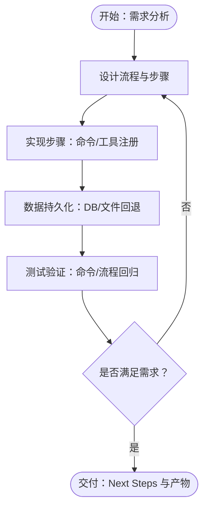
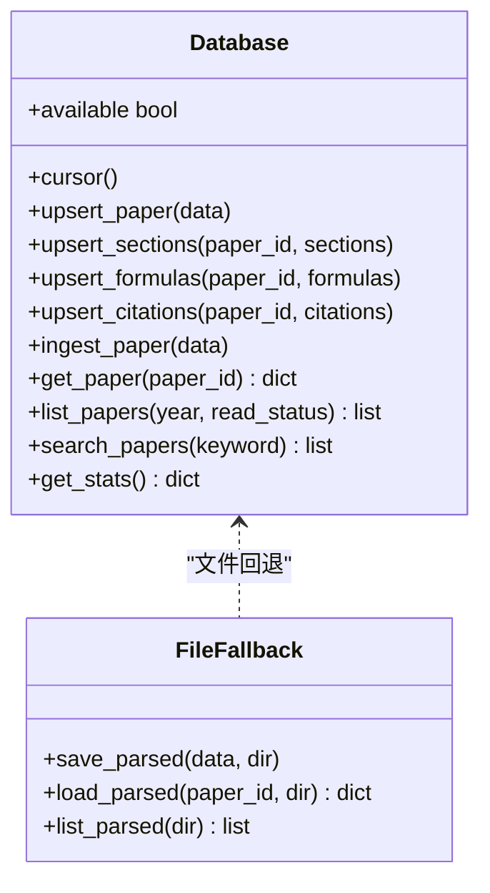
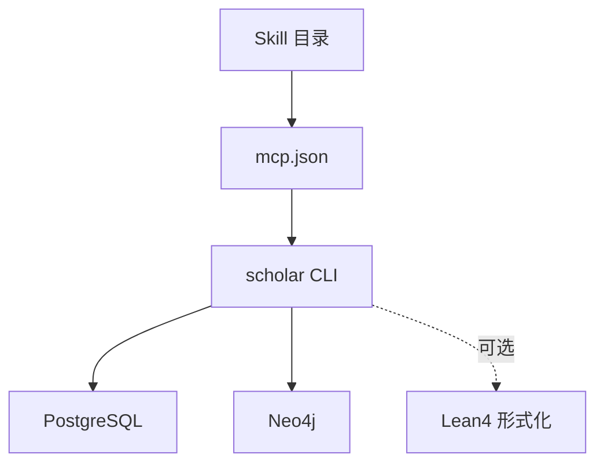

# 研究技能开发

<cite>
**本文档引用的文件**
- [plugin/README.md](file://plugin/README.md)
- [plugin/mcp.json](file://plugin/mcp.json)
- [plugin/skills/paper-deep-dive/SKILL.md](file://plugin/skills/paper-deep-dive/SKILL.md)
- [plugin/skills/reproduce-paper/SKILL.md](file://plugin/skills/reproduce-paper/SKILL.md)
- [plugin/skills/review-report/SKILL.md](file://plugin/skills/review-report/SKILL.md)
- [plugin/skills/kb-management/SKILL.md](file://plugin/skills/kb-management/SKILL.md)
- [plugin/skills/paper-ingestion/SKILL.md](file://plugin/skills/paper-ingestion/SKILL.md)
- [plugin/skills/experiment-code/SKILL.md](file://plugin/skills/experiment-code/SKILL.md)
- [plugin/commands/stats.md](file://plugin/commands/stats.md)
- [plugin/commands/find.md](file://plugin/commands/find.md)
- [scholar/db.py](file://scholar/db.py)
- [scholar/cli.py](file://scholar/cli.py)
- [scholar/__main__.py](file://scholar/__main__.py)
- [LEAN/AiEvolution/Database.lean](file://LEAN/AiEvolution/Database.lean)
- [LEAN/AiEvolution/Theorems.lean](file://LEAN/AiEvolution/Theorems.lean)
</cite>

## 目录
1. [简介](#简介)
2. [项目结构](#项目结构)
3. [核心组件](#核心组件)
4. [架构总览](#架构总览)
5. [详细组件分析](#详细组件分析)
6. [依赖关系分析](#依赖关系分析)
7. [性能考虑](#性能考虑)
8. [故障排查指南](#故障排查指南)
9. [结论](#结论)
10. [附录](#附录)

## 简介
本指南面向“研究技能开发”，围绕研究工作流中的关键环节，系统阐述技能目录结构、命名规范、技能开发流程、接口规范、与数据库交互方式、调试与性能优化建议，并结合论文深度分析、复现实验、评审报告等核心技能给出实践范式。

## 项目结构
- 技能（Skills）位于 plugin/skills 下，每个技能以独立目录组织，配套 SKILL.md 文档描述触发条件、流程、步骤与下一步动作。
- 命令（Commands）位于 plugin/commands，提供 stats/find 等辅助工具的调用说明。
- 后端执行由主仓库的 Python 包 scholar 提供，通过 MCP 服务器桥接，技能通过命令行调用 scholar CLI。
- Lean4 侧的 AiEvolution 提供形式化知识库与定理，用于方法论层面的形式化对照与验证。

**图示来源**
- [plugin/README.md:1-79](file://plugin/README.md#L1-L79)
- [plugin/mcp.json:1-16](file://plugin/mcp.json#L1-L16)
- [scholar/db.py:1-276](file://scholar/db.py#L1-L276)
- [LEAN/AiEvolution/Database.lean:1-756](file://LEAN/AiEvolution/Database.lean#L1-L756)
- [LEAN/AiEvolution/Theorems.lean:1-168](file://LEAN/AiEvolution/Theorems.lean#L1-L168)

**章节来源**
- [plugin/README.md:1-79](file://plugin/README.md#L1-L79)
- [plugin/mcp.json:1-16](file://plugin/mcp.json#L1-L16)

## 核心组件
- 技能（Skill）：以目录为单位，包含 SKILL.md，描述触发条件、流程、步骤与下一步动作；技能之间通过“下一步”串联形成工作流。
- 命令（Command）：提供 stats、find 等常用工具的调用说明，便于在技能流程中穿插使用。
- MCP 服务器：通过 mcp.json 指定 scholar_mcp 的进程与环境变量，使插件能够调用后端工具。
- 数据库层：scholar/db.py 提供统一的数据库接口，支持 UPSERT、查询、统计与文件回退模式。
- CLI 层：scholar/cli.py 提供 scan、parse、info、search、stats、graph-build 等命令，支撑技能的数据准备与验证。
- 形式化层：LEAN/AiEvolution 提供创新节点、引用关系与替换定理，用于方法论层面的形式化对照。

**章节来源**
- [plugin/README.md:60-79](file://plugin/README.md#L60-L79)
- [plugin/mcp.json:1-16](file://plugin/mcp.json#L1-L16)
- [scholar/db.py:24-276](file://scholar/db.py#L24-L276)
- [scholar/cli.py:32-800](file://scholar/cli.py#L32-L800)
- [LEAN/AiEvolution/Database.lean:1-756](file://LEAN/AiEvolution/Database.lean#L1-L756)
- [LEAN/AiEvolution/Theorems.lean:1-168](file://LEAN/AiEvolution/Theorems.lean#L1-L168)

## 架构总览
技能通过 MCP 调用 scholar CLI，CLI 在需要时访问 PostgreSQL 与 Neo4j，必要时与 Lean4 形式化知识库进行对照，最终产出结构化报告或代码。

**图示来源**
- [plugin/mcp.json:1-16](file://plugin/mcp.json#L1-L16)
- [scholar/cli.py:32-800](file://scholar/cli.py#L32-L800)
- [scholar/db.py:24-276](file://scholar/db.py#L24-L276)
- [LEAN/AiEvolution/Database.lean:1-756](file://LEAN/AiEvolution/Database.lean#L1-L756)
- [LEAN/AiEvolution/Theorems.lean:1-168](file://LEAN/AiEvolution/Theorems.lean#L1-L168)

## 详细组件分析

### 技能目录结构与命名规范
- 目录命名：采用短横线分隔的小写英文，如 paper-deep-dive、reproduce-paper、review-report。
- 必备文件：每个技能目录必须包含 SKILL.md，描述触发条件、流程、步骤与“Next Steps”。
- 建议布局：技能目录内可包含子目录（如实验代码生成场景下的 output/experiments/<ULID>/）用于存放产物。

**章节来源**
- [plugin/skills/paper-deep-dive/SKILL.md:1-58](file://plugin/skills/paper-deep-dive/SKILL.md#L1-L58)
- [plugin/skills/reproduce-paper/SKILL.md:1-69](file://plugin/skills/reproduce-paper/SKILL.md#L1-L69)
- [plugin/skills/review-report/SKILL.md:1-116](file://plugin/skills/review-report/SKILL.md#L1-L116)
- [plugin/skills/kb-management/SKILL.md:1-59](file://plugin/skills/kb-management/SKILL.md#L1-L59)
- [plugin/skills/paper-ingestion/SKILL.md:1-85](file://plugin/skills/paper-ingestion/SKILL.md#L1-L85)
- [plugin/skills/experiment-code/SKILL.md:1-111](file://plugin/skills/experiment-code/SKILL.md#L1-L111)

### SKILL.md 编写规范与必需字段
- 必备字段
  - name：技能名称（与目录同名）
  - description：技能简述
  - 触发：何时触发该技能
  - 流程：步骤化的工作流
  - 步骤：每个步骤的命令与预期产物
  - Next Steps：后续可选技能或命令
- 建议字段
  - 注意事项：边界条件、限制与风险提示
  - 传递数据：技能间的数据衔接点

**章节来源**
- [plugin/skills/paper-deep-dive/SKILL.md:1-58](file://plugin/skills/paper-deep-dive/SKILL.md#L1-L58)
- [plugin/skills/reproduce-paper/SKILL.md:1-69](file://plugin/skills/reproduce-paper/SKILL.md#L1-L69)
- [plugin/skills/review-report/SKILL.md:1-116](file://plugin/skills/review-report/SKILL.md#L1-L116)
- [plugin/skills/kb-management/SKILL.md:1-59](file://plugin/skills/kb-management/SKILL.md#L1-L59)
- [plugin/skills/paper-ingestion/SKILL.md:1-85](file://plugin/skills/paper-ingestion/SKILL.md#L1-L85)
- [plugin/skills/experiment-code/SKILL.md:1-111](file://plugin/skills/experiment-code/SKILL.md#L1-L111)

### 技能开发流程（从需求到实现再到测试验证）
- 需求分析：明确触发条件、输入来源（ULID/ArXiv/DOI/slug）、期望输出形态（报告/代码/图谱）。
- 设计流程：拆解为若干步骤，每个步骤聚焦单一命令或工具调用。
- 实现步骤：
  - 在 SKILL.md 中定义步骤与命令
  - 在 MCP 服务器中注册相应工具（通过 mcp.json 指向 scholar_mcp）
  - 在 scholar/cli.py 中实现或复用命令（scan/parse/info/search/stats/graph-build 等）
  - 在 scholar/db.py 中确保数据持久化与查询路径可用
- 测试验证：
  - 使用 plugin/commands 中的命令进行快速验证（如 stats、find）
  - 对关键流程进行端到端回归（如 paper-ingestion → paper-deep-dive → reproduce-paper）

**图示来源**
- [plugin/commands/stats.md:1-7](file://plugin/commands/stats.md#L1-L7)
- [plugin/commands/find.md:1-7](file://plugin/commands/find.md#L1-L7)
- [scholar/cli.py:32-800](file://scholar/cli.py#L32-L800)
- [scholar/db.py:24-276](file://scholar/db.py#L24-L276)

**章节来源**
- [plugin/commands/stats.md:1-7](file://plugin/commands/stats.md#L1-L7)
- [plugin/commands/find.md:1-7](file://plugin/commands/find.md#L1-L7)
- [scholar/cli.py:32-800](file://scholar/cli.py#L32-L800)
- [scholar/db.py:24-276](file://scholar/db.py#L24-L276)

### 技能接口规范（输入参数、输出格式、错误处理）
- 输入参数
  - 标识符：支持 ULID、arXiv ID、DOI、slug，通过 id_resolver 解析为统一 ULID
  - 选项：limit、year、apply、--hybrid 等
- 输出格式
  - 控制台表格/面板：用于 stats、scan、search、graph-stats 等
  - JSON 文件：解析结果保存至 output/parsed/<ULID>.json
  - Markdown 报告：review-report、paper-deep-dive 的结构化报告
  - 代码产物：experiment-code 生成的实验代码结构
- 错误处理
  - 命令级异常：typer.Exit(1) 与控制台错误提示
  - 数据库不可用：自动降级为文件回退模式（save_parsed/load_parsed/list_parsed）
  - 图谱服务不可用：提示启动 docker compose 或安装依赖

**章节来源**
- [scholar/cli.py:132-171](file://scholar/cli.py#L132-L171)
- [scholar/cli.py:176-237](file://scholar/cli.py#L176-L237)
- [scholar/cli.py:242-306](file://scholar/cli.py#L242-L306)
- [scholar/cli.py:311-370](file://scholar/cli.py#L311-L370)
- [scholar/cli.py:421-487](file://scholar/cli.py#L421-L487)
- [scholar/cli.py:663-706](file://scholar/cli.py#L663-L706)
- [scholar/db.py:248-276](file://scholar/db.py#L248-L276)

### 技能与数据库交互方式
- 写入（Upsert）
  - upsert_paper：插入或更新论文记录（含 arxiv_id、doi、parsed_path 等）
  - upsert_sections/formulas/citations：替换式写入章节、公式、引用
  - ingest_paper：一次性全量写入
- 查询
  - get_paper：按 ULID 查询
  - list_papers：按年份/状态过滤
  - search_papers：跨标题/摘要/章节的全文检索
  - get_stats：统计总数、解析数、公式/引用/章节数量与年份范围
- 文件回退
  - save_parsed/load_parsed/list_parsed：在无数据库时的文件存储替代方案

**图示来源**
- [scholar/db.py:24-276](file://scholar/db.py#L24-L276)

**章节来源**
- [scholar/db.py:79-176](file://scholar/db.py#L79-L176)
- [scholar/db.py:181-242](file://scholar/db.py#L181-L242)
- [scholar/db.py:248-276](file://scholar/db.py#L248-L276)

### 技能开发示例

#### 示例一：论文深度分析（paper-deep-dive）
- 触发：用户说“精读 XX”、“深度分析 XX”
- 步骤要点
  - Step 1：加载论文数据（info）与预生成 JSON/笔记
  - Step 2：深度阅读（sections/formulas/citations）
  - Step 3：质量评估（quality-score）
  - Step 4：公式推导（逐步展开与验证）
  - Step 5：引用网络分析（cite-network）
  - Step 6：生成实验代码框架（输出到 output/experiments/<ULID>/）
  - Step 7：输出结构化报告
- Next Steps：writing-pipeline、reproduce-paper、research-survey

**章节来源**
- [plugin/skills/paper-deep-dive/SKILL.md:6-58](file://plugin/skills/paper-deep-dive/SKILL.md#L6-L58)

#### 示例二：复现实验（reproduce-paper）
- 触发：用户说“复现 XX 论文”、“reproduce”
- 步骤要点
  - Step 1：深度阅读（info + 笔记）
  - Step 2：配置运行环境（exp-setup）
  - Step 3：生成实验代码（如尚未生成）
  - Step 4：下载数据集（dataset-download）
  - Step 5：运行实验（exp-run，quick/full 模式）
  - Step 6：对比结果（exp-compare）
  - Step 7：调试失败（exp-debug）
- Next Steps：writing-pipeline、paper-deep-dive、idea-to-paper

**章节来源**
- [plugin/skills/reproduce-paper/SKILL.md:6-69](file://plugin/skills/reproduce-paper/SKILL.md#L6-L69)

#### 示例三：评审报告（review-report）
- 触发：用户说“帮我审稿”、“写 review”
- 步骤要点
  - Step 1：定位并深度阅读（quality-score + info + 预生成笔记）
  - Step 2：评估论文贡献（新颖性/重要性/完整性）
  - Step 3：方法论审查（假设/数学正确性/对比/消融）
  - Step 4：实验审查（数据集/指标/显著性/可复现性）
  - Step 5：写作质量审查（结构/图表/引用/语言）
  - Step 6：对照引用网络（cite-network）
  - Step 7：Lean4 形式化对照（如适用）
  - Step 8：输出审稿报告（review-<paper_id>.md）
- Next Steps：quality-score 记录、paper-deep-dive、export-bib

**章节来源**
- [plugin/skills/review-report/SKILL.md:6-116](file://plugin/skills/review-report/SKILL.md#L6-L116)

#### 示例四：知识库维护（kb-management）
- 触发：用户说“维护知识库”、“更新知识库”
- 步骤要点
  - Step 1：健康检查（stats + scan）
  - Step 2：自动更新（kb-update 或 batch-ingest）
  - Step 3：元数据回填（metadata-enrich）
  - Step 4：补全缺失字段（year-fix + author-fix）
  - Step 5：引用解析 + 图谱同步（cite-resolve + graph-build）
  - Step 6：RAG 索引同步（rag-index）
  - Step 7：输出维护报告
- Next Steps：research-survey、paper-deep-dive

**章节来源**
- [plugin/skills/kb-management/SKILL.md:6-59](file://plugin/skills/kb-management/SKILL.md#L6-L59)

#### 示例五：论文入库（paper-ingestion）
- 触发：用户说“入库”、“解析论文”
- 步骤要点
  - Step 1：扫描论文目录（scan）
  - Step 2：批量解析未解析论文（parse-all）
  - Step 3：处理解析失败（info 诊断）
  - Step 4：补全缺失元数据（year-fix + author-fix）
  - Step 5：批量预处理（auto-notes + quality-score + classify）
  - Step 6：检查统计（stats）
  - Step 7：单篇验证（info）
- Next Steps：research-survey、kb-management、quality-score

**章节来源**
- [plugin/skills/paper-ingestion/SKILL.md:6-85](file://plugin/skills/paper-ingestion/SKILL.md#L6-L85)

#### 示例六：实验代码生成（experiment-code）
- 触发：用户说“复现实验”、“生成代码”
- 步骤要点
  - Step 1：深度阅读论文方法（info + 笔记 + 质量评分）
  - Step 2：提取算法要素（RAG 搜索相关实现）
  - Step 3：确定技术栈（PyTorch/TensorFlow/JAX）
  - Step 4：生成代码结构（model/data/train/evaluate/config/requirements/README）
  - Step 5：逐步实现（按顺序生成文件并注释对应章节/公式）
  - Step 6：验证代码（公式一致性、维度匹配、dry run）
  - Step 7：生成说明文档（README.md）
- Next Steps：paper-deep-dive、reproduce-paper

**章节来源**
- [plugin/skills/experiment-code/SKILL.md:6-111](file://plugin/skills/experiment-code/SKILL.md#L6-L111)

### 命令与工具调用
- stats：知识库统计（论文数量、解析数、字段覆盖率、年份范围）
- find：全文搜索与语义搜索（search + rag-search）
- scan/parse/info/search/list-papers：入库与检索
- graph-build/graph-stats/graph-query：图谱构建与查询
- export-bib：导出 BibTeX
- author-fix/year-fix/cite-resolve：元数据补全与解析
- rag-index：RAG 索引同步

**章节来源**
- [plugin/commands/stats.md:1-7](file://plugin/commands/stats.md#L1-L7)
- [plugin/commands/find.md:1-7](file://plugin/commands/find.md#L1-L7)
- [scholar/cli.py:421-487](file://scholar/cli.py#L421-L487)
- [scholar/cli.py:605-658](file://scholar/cli.py#L605-L658)
- [scholar/cli.py:663-706](file://scholar/cli.py#L663-L706)
- [scholar/cli.py:797-806](file://scholar/cli.py#L797-L806)

## 依赖关系分析
- 技能依赖 MCP 服务器（mcp.json）与 scholar CLI
- CLI 依赖数据库（PostgreSQL）与图数据库（Neo4j），在不可用时回退到文件模式
- Lean4 形式化知识库可选集成，用于方法论层面的对照与验证

**图示来源**
- [plugin/mcp.json:1-16](file://plugin/mcp.json#L1-L16)
- [scholar/db.py:24-276](file://scholar/db.py#L24-L276)

**章节来源**
- [plugin/mcp.json:1-16](file://plugin/mcp.json#L1-L16)
- [scholar/db.py:24-276](file://scholar/db.py#L24-L276)

## 性能考虑
- 批量处理：优先使用 parse-all 与 search 等批处理命令，减少重复 IO
- 数据库连接：Database.cursor() 自动提交/回滚，避免长事务占用连接
- 图谱构建：graph-build 分步执行，先构建引用网络再计算中心性，降低峰值内存
- 文件回退：在无数据库时，使用 save_parsed/load_parsed 减少磁盘争用
- 超时保护：reproduce-paper 的 exp-run 支持超时保护（默认 1 小时），避免长时间阻塞

[本节为通用指导，无需具体文件引用]

## 故障排查指南
- 数据库不可用
  - 现象：stats 显示 not available (file-only mode)
  - 处理：安装 psycopg2，检查主机/端口/凭据；或接受文件回退模式
- Neo4j 不可用
  - 现象：graph-build 提示未启动
  - 处理：启动 docker compose 或安装 neo4j 驱动
- 解析失败
  - 现象：parse/parse-all 失败
  - 处理：使用 info 诊断，检查 source.tar.gz/pdf 来源与 TeX 格式
- 命令返回空结果
  - 现象：search 无结果
  - 处理：切换到文件回退模式或检查 parsed JSON 是否存在
- 复现实验失败
  - 现象：exp-run 报 ModuleNotFoundError/CUDA OOM/FileNotFoundError
  - 处理：exp-debug 自动诊断并提供修复建议

**章节来源**
- [scholar/db.py:15-21](file://scholar/db.py#L15-L21)
- [scholar/cli.py:663-706](file://scholar/cli.py#L663-L706)
- [scholar/cli.py:168-171](file://scholar/cli.py#L168-L171)
- [scholar/cli.py:320-353](file://scholar/cli.py#L320-L353)
- [plugin/skills/reproduce-paper/SKILL.md:57-62](file://plugin/skills/reproduce-paper/SKILL.md#L57-L62)

## 结论
通过标准化的技能目录结构、严谨的 SKILL.md 编写规范、清晰的命令接口与健壮的数据库/图谱回退机制，本项目实现了从论文入库、深度分析、复现实验到评审报告的完整研究工作流。建议在新技能开发中严格遵循上述规范，并充分利用 Lean4 形式化知识库进行方法论层面的对照与验证。

[本节为总结性内容，无需具体文件引用]

## 附录

### MCP 服务器配置要点
- 指定命令与参数：python -m scholar_mcp
- 设置环境变量：SCHOLAR_PG_HOST、SCHOLAR_PG_PORT、SCHOLAR_NEO4J_URI

**章节来源**
- [plugin/mcp.json:1-16](file://plugin/mcp.json#L1-L16)

### Lean4 形式化知识库与定理
- Database：包含 125 个创新节点、417 篇论文与引用关系
- Theorems：证明若干替换关系在至少两个轴上具有优势（可扩展）

**章节来源**
- [LEAN/AiEvolution/Database.lean:1-756](file://LEAN/AiEvolution/Database.lean#L1-L756)
- [LEAN/AiEvolution/Theorems.lean:1-168](file://LEAN/AiEvolution/Theorems.lean#L1-L168)