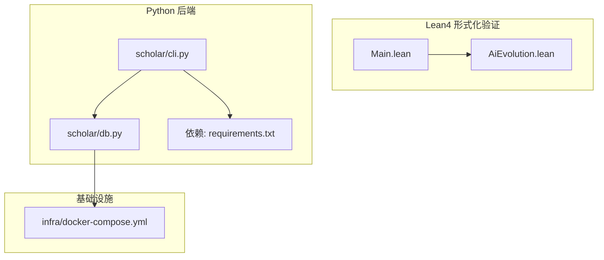
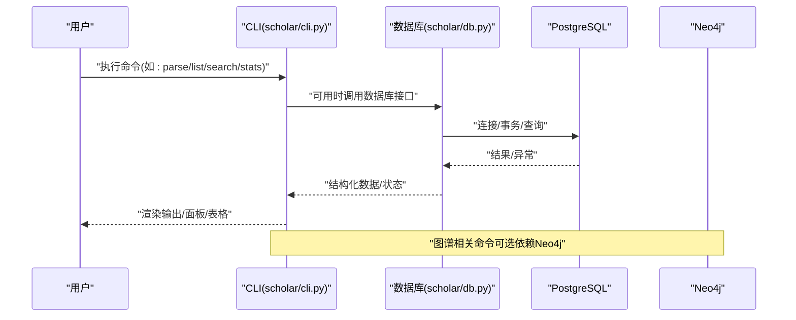
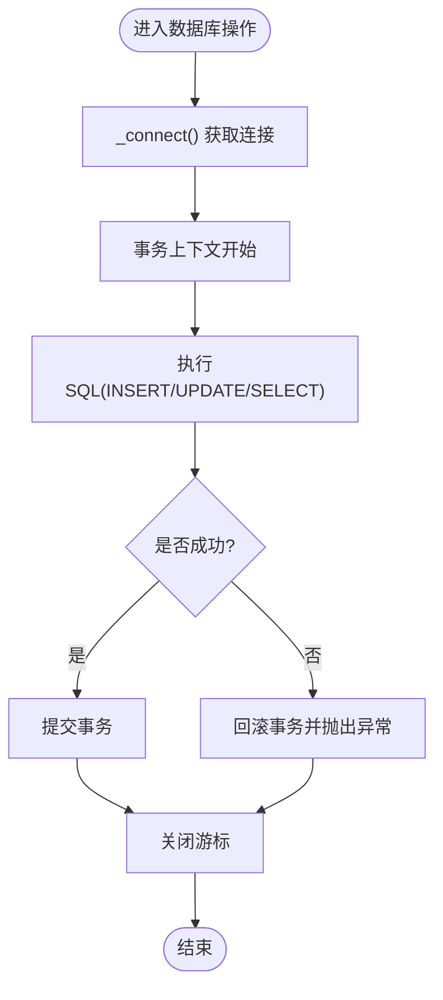
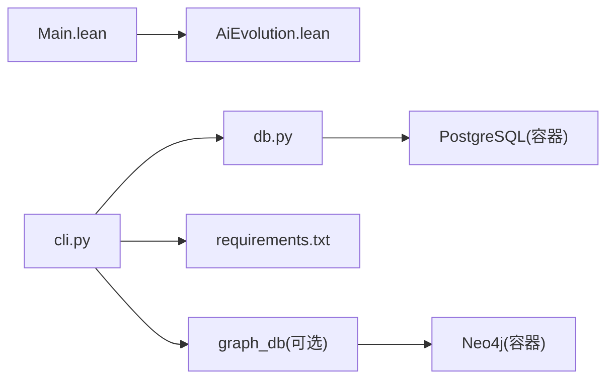

# 测试与调试

<cite>
**本文档引用的文件**
- [LEAN/README.md](file://LEAN/README.md)
- [plugin/README.md](file://plugin/README.md)
- [infra/docker-compose.yml](file://infra/docker-compose.yml)
- [LEAN/lakefile.toml](file://LEAN/lakefile.toml)
- [requirements.txt](file://requirements.txt)
- [LEAN/AiEvolution.lean](file://LEAN/AiEvolution.lean)
- [LEAN/Main.lean](file://LEAN/Main.lean)
- [scholar/db.py](file://scholar/db.py)
- [scholar/cli.py](file://scholar/cli.py)
</cite>

## 目录
1. [简介](#简介)
2. [项目结构](#项目结构)
3. [核心组件](#核心组件)
4. [架构总览](#架构总览)
5. [详细组件分析](#详细组件分析)
6. [依赖关系分析](#依赖关系分析)
7. [性能考虑](#性能考虑)
8. [故障排查指南](#故障排查指南)
9. [结论](#结论)
10. [附录](#附录)

## 简介
本指南面向“学术研究工具链”项目，聚焦测试与调试策略，覆盖单元测试、集成测试与端到端测试的实施建议；提供Python调试器、Lean4证明调试、数据库查询调试的方法；给出性能测试与优化思路（数据库性能分析、API响应时间监控、内存使用优化）；并总结错误处理与异常管理策略及常见问题诊断流程。

## 项目结构
该项目由多语言与多组件构成：
- Lean4形式化验证子系统：提供可编译与严格证明的数学架构验证能力。
- Python后端：提供CLI命令、数据库访问层、Neo4j图谱构建与查询、TeX解析与入库等。
- 基础设施：通过Docker Compose启动PostgreSQL与Neo4j服务，支持健康检查与持久化卷。

**图表来源**
- [LEAN/Main.lean:1-21](file://LEAN/Main.lean#L1-L21)
- [LEAN/AiEvolution.lean:1-7](file://LEAN/AiEvolution.lean#L1-L7)
- [scholar/cli.py:1-80](file://scholar/cli.py#L1-L80)
- [scholar/db.py:1-60](file://scholar/db.py#L1-L60)
- [infra/docker-compose.yml:1-44](file://infra/docker-compose.yml#L1-L44)
- [requirements.txt:1-9](file://requirements.txt#L1-L9)

**章节来源**
- [plugin/README.md:1-79](file://plugin/README.md#L1-L79)
- [infra/docker-compose.yml:1-44](file://infra/docker-compose.yml#L1-L44)
- [requirements.txt:1-9](file://requirements.txt#L1-L9)

## 核心组件
- Lean4形式化验证入口与库组织：通过入口模块加载基础、数据库与定理模块，提供可打印的属性校验输出与编译期严格证明提示。
- 数据库访问层：封装psycopg2连接、事务上下文、纸张/段落/公式/引用的增删改查与全量入库。
- CLI命令集：扫描、解析、批量解析、信息展示、全文检索、统计、导出BibTeX、arXiv搜索、图谱构建与统计、图谱查询等。
- 基础设施编排：PostgreSQL与Neo4j容器、健康检查、环境变量与持久化卷。

**章节来源**
- [LEAN/Main.lean:1-21](file://LEAN/Main.lean#L1-L21)
- [LEAN/AiEvolution.lean:1-7](file://LEAN/AiEvolution.lean#L1-L7)
- [scholar/db.py:24-276](file://scholar/db.py#L24-L276)
- [scholar/cli.py:1-80](file://scholar/cli.py#L1-L80)
- [infra/docker-compose.yml:1-44](file://infra/docker-compose.yml#L1-L44)

## 架构总览
下图展示从CLI到数据库与图谱的典型调用链路，以及Lean4验证模块的职责边界。

**图表来源**
- [scholar/cli.py:32-41](file://scholar/cli.py#L32-L41)
- [scholar/db.py:24-74](file://scholar/db.py#L24-L74)
- [infra/docker-compose.yml:1-44](file://infra/docker-compose.yml#L1-L44)

## 详细组件分析

### Lean4 形式化验证模块
- 组织方式：入口模块聚合基础、数据库与定理模块，便于统一编译与加载。
- 运行行为：入口程序打印多项架构属性与“全部定理已编译且严格证明”的状态提示。
- 测试建议：
  - 单元测试：针对每个模块的公理、定义与定理进行逐项编译与类型检查，确保无未解目标。
  - 集成测试：在CI中执行完整构建与证明编译，记录耗时与失败目标。
  - 端到端测试：以Main为入口，验证输出字符串包含预期关键词，作为回归性检查。
- 调试技巧：
  - 使用Lean4调试器逐步展开目标，结合trace宏定位阻塞点。
  - 将复杂定理拆分为若干中间引理，降低一次性证明难度。
  - 在lakefile中启用更详细的编译日志，定位依赖循环或未满足的类型类实例。

**章节来源**
- [LEAN/AiEvolution.lean:1-7](file://LEAN/AiEvolution.lean#L1-L7)
- [LEAN/Main.lean:1-21](file://LEAN/Main.lean#L1-L21)
- [LEAN/lakefile.toml:1-11](file://LEAN/lakefile.toml#L1-L11)

### 数据库访问层（PostgreSQL）
- 关键能力：连接池/重连、事务上下文、UPSERT/删除重建、全文检索、统计聚合。
- 错误处理：连接失败回退至文件模式；事务异常自动回滚并重新抛出。
- 性能要点：批量写入前先清理旧数据，避免重复插入；查询参数化防止注入。
- 测试建议：
  - 单元测试：构造最小化SQL与参数，断言执行语句与参数序列；模拟连接失败触发回退。
  - 集成测试：在Docker容器内拉起PostgreSQL，执行全量UPSER/查询/统计，比对结果。
  - 端到端测试：CLI命令驱动入库与查询，断言输出表格与计数。
- 调试技巧：
  - 开启psycopg2日志，观察SQL与参数。
  - 使用EXPLAIN/EXPLAIN ANALYZE分析慢查询，识别缺失索引或过滤条件不当。
  - 在cursor上下文中捕获异常，记录SQL与参数以便复现。

**图表来源**
- [scholar/db.py:46-74](file://scholar/db.py#L46-L74)

**章节来源**
- [scholar/db.py:24-276](file://scholar/db.py#L24-L276)

### CLI 命令与工作流
- 命令组织：基于Typer定义命令，Rich渲染表格/面板/进度条，统一控制台输出风格。
- 失败处理：命令内部捕获异常并打印友好提示，随后退出码非零。
- 图谱相关：可选依赖Neo4j，若不可用则提示启动容器或安装依赖。
- 测试建议：
  - 单元测试：对纯函数与解析逻辑进行断言；对UI渲染部分采用快照或结构化断言。
  - 集成测试：在临时目录准备样例数据，调用真实CLI并断言输出与文件变更。
  - 端到端测试：组合多个命令（parse→ingest→search→stats），验证数据一致性与输出格式。
- 调试技巧：
  - 使用Python调试器设置断点，逐步跟踪参数解析与数据流转。
  - 对长耗时命令开启进度条，定位瓶颈阶段（解析/入库/查询）。
  - 对外部API（arXiv）增加超时与重试策略，并记录请求URL与响应摘要。

**章节来源**
- [scholar/cli.py:1-80](file://scholar/cli.py#L1-L80)
- [scholar/cli.py:32-41](file://scholar/cli.py#L32-L41)
- [scholar/cli.py:421-477](file://scholar/cli.py#L421-L477)
- [scholar/cli.py:663-705](file://scholar/cli.py#L663-L705)

### 基础设施与依赖
- Docker Compose：定义PostgreSQL与Neo4j服务，配置健康检查与环境变量。
- 依赖声明：Python包版本约束，确保运行时兼容性。
- 测试建议：
  - 单元测试：在隔离环境中启动容器，执行数据库/图谱相关命令。
  - 集成测试：拉起完整栈（PostgreSQL + Neo4j），验证端到端流程。
  - 端到端测试：脚本化执行CLI命令，断言状态与文件/数据库内容。

**章节来源**
- [infra/docker-compose.yml:1-44](file://infra/docker-compose.yml#L1-L44)
- [requirements.txt:1-9](file://requirements.txt#L1-L9)

## 依赖关系分析
- Lean4侧：入口模块聚合子模块，形成清晰的依赖层次。
- Python侧：CLI依赖数据库模块与配置；数据库模块依赖psycopg2；Neo4j相关命令依赖graph_db模块。
- 外部依赖：PostgreSQL、Neo4j、arXiv API、PyMuPDF等。

**图表来源**
- [LEAN/Main.lean:1-21](file://LEAN/Main.lean#L1-L21)
- [LEAN/AiEvolution.lean:1-7](file://LEAN/AiEvolution.lean#L1-L7)
- [scholar/cli.py:1-80](file://scholar/cli.py#L1-L80)
- [scholar/db.py:1-60](file://scholar/db.py#L1-L60)
- [infra/docker-compose.yml:1-44](file://infra/docker-compose.yml#L1-L44)

**章节来源**
- [LEAN/Main.lean:1-21](file://LEAN/Main.lean#L1-L21)
- [scholar/cli.py:1-80](file://scholar/cli.py#L1-L80)
- [scholar/db.py:1-60](file://scholar/db.py#L1-L60)

## 性能考虑
- 数据库性能分析
  - 使用EXPLAIN/EXPLAIN ANALYZE分析慢查询，关注索引使用与扫描成本。
  - 对高频查询（全文检索、分页列表）建立合适索引，避免全表扫描。
  - 控制单次事务大小，必要时拆分为批量提交。
- API响应时间监控
  - 在CLI命令中埋点计时，记录解析、入库、查询各阶段耗时，输出到日志或指标系统。
  - 对外部API（arXiv）设置合理超时与重试，避免阻塞整体流程。
- 内存使用优化
  - 批量写入时使用参数化SQL与上下文管理器，减少对象生命周期开销。
  - 对大文本字段（摘要、段落）按需加载，避免一次性读取过多JSON。
  - 在容器中限制Neo4j堆内存，避免GC抖动。

[本节为通用指导，无需具体文件引用]

## 故障排查指南
- Lean4证明调试
  - 使用调试器逐步展开目标，定位未解子目标；将复杂定理拆分为中间引理。
  - 在lakefile中启用详细日志，检查依赖循环与类型类实例不满足。
- Python调试
  - 在CLI关键路径设置断点，检查参数解析、数据结构与异常传播。
  - 对数据库操作捕获异常并记录SQL与参数，便于复现。
- 数据库查询调试
  - 开启psycopg2日志，核对最终SQL与参数；使用EXPLAIN分析执行计划。
  - 若连接失败，检查主机/端口/凭据与容器健康状态。
- 图谱相关问题
  - 若Neo4j不可用，确认容器已启动、凭据正确与插件可用。
  - 对图谱构建命令，分阶段验证节点/边数量与解析成功率。

**章节来源**
- [scholar/cli.py:168-171](file://scholar/cli.py#L168-L171)
- [scholar/cli.py:663-705](file://scholar/cli.py#L663-L705)
- [scholar/db.py:31-44](file://scholar/db.py#L31-L44)
- [infra/docker-compose.yml:15-19](file://infra/docker-compose.yml#L15-L19)
- [infra/docker-compose.yml:35-39](file://infra/docker-compose.yml#L35-L39)

## 结论
本项目在Lean4侧强调严格证明与可编译性，在Python侧提供完整的学术研究工具链。建议以“单元测试+集成测试+端到端测试”三层策略覆盖核心功能；在调试方面分别针对Lean4证明、Python运行时与数据库查询建立标准化流程；同时结合性能分析与日志监控持续优化系统稳定性与吞吐。

[本节为总结性内容，无需具体文件引用]

## 附录
- 测试策略清单
  - Lean4：逐模块编译与证明，CI中执行完整构建，回归性输出断言。
  - Python：对解析、入库、查询与CLI命令进行单元与集成测试，端到端脚本化验证。
  - 基础设施：容器健康检查与依赖版本锁定，确保可重复环境。
- 常见问题速查
  - Lean4：未解目标、类型类实例缺失、依赖循环。
  - Python：数据库连接失败、psycopg2不可用、Neo4j不可达。
  - 数据库：慢查询、索引缺失、事务过大。

[本节为概要性内容，无需具体文件引用]