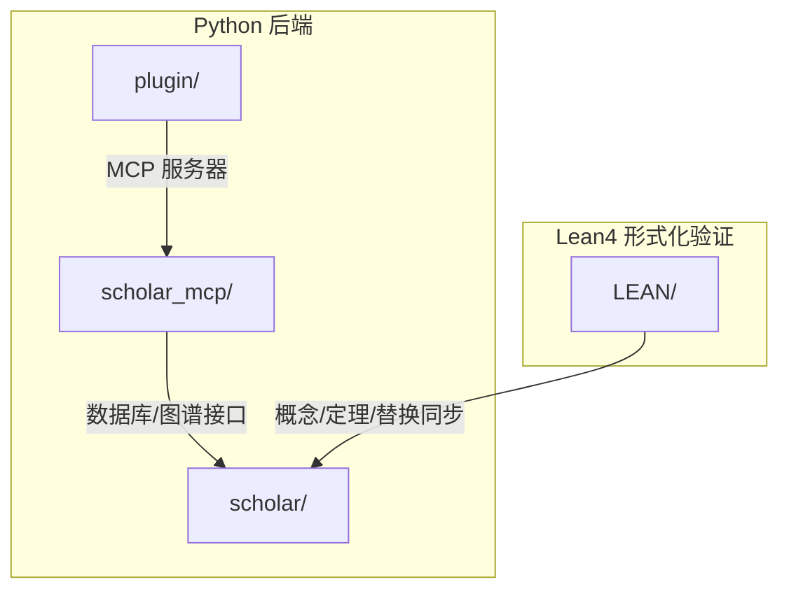
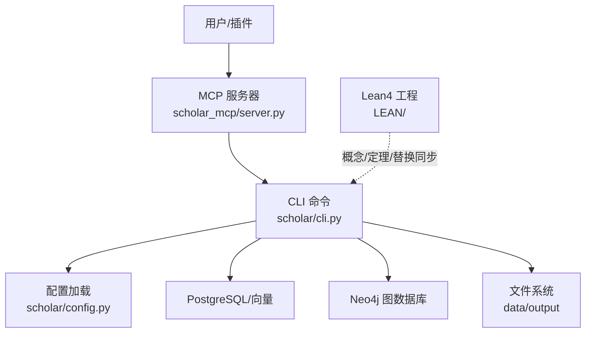
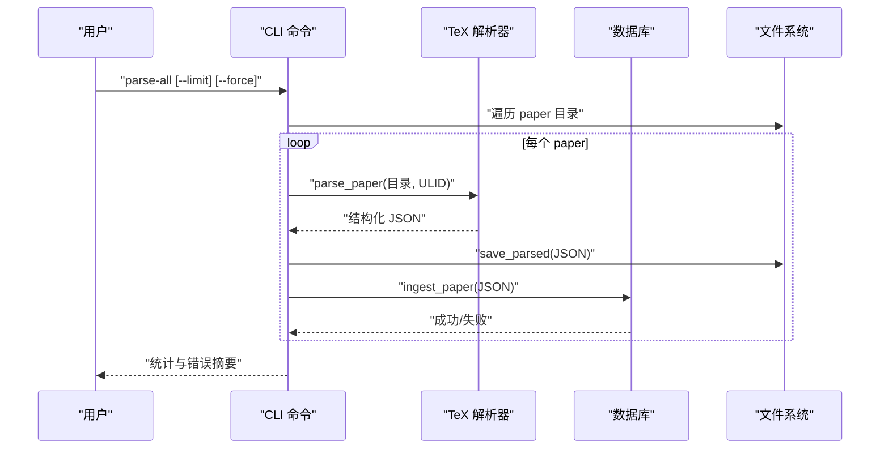
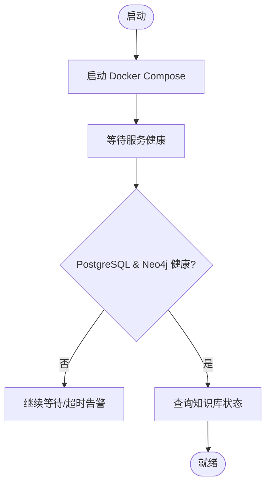
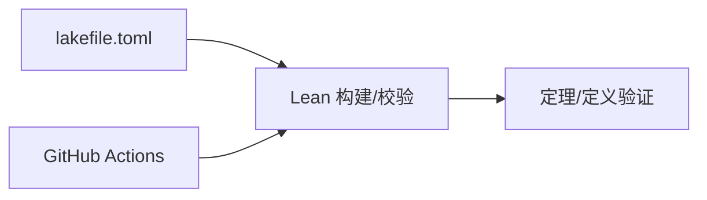
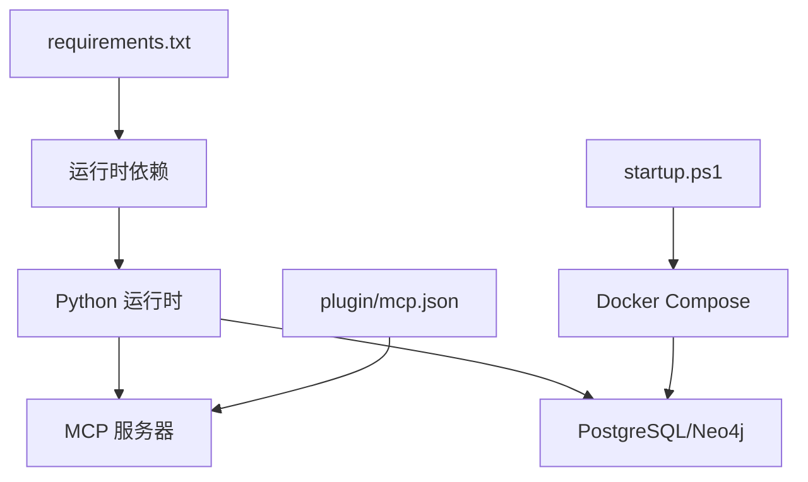

# 贡献指南

<cite>
**本文档引用的文件**
- [requirements.txt](file://requirements.txt)
- [startup.ps1](file://startup.ps1)
- [plugin/README.md](file://plugin/README.md)
- [plugin/mcp.json](file://plugin/mcp.json)
- [scholar/__main__.py](file://scholar/__main__.py)
- [scholar/cli.py](file://scholar/cli.py)
- [scholar/config.py](file://scholar/config.py)
- [LEAN/lakefile.toml](file://LEAN/lakefile.toml)
- [LEAN/.github/workflows/lean_action_ci.yml](file://LEAN/.github/workflows/lean_action_ci.yml)
- [LEAN/README.md](file://LEAN/README.md)
</cite>

## 目录
1. [简介](#简介)
2. [项目结构](#项目结构)
3. [核心组件](#核心组件)
4. [架构总览](#架构总览)
5. [详细组件分析](#详细组件分析)
6. [依赖关系分析](#依赖关系分析)
7. [性能考虑](#性能考虑)
8. [故障排查指南](#故障排查指南)
9. [结论](#结论)
10. [附录](#附录)

## 简介
本贡献指南面向希望参与“学术研究工具链”项目的开发者，涵盖代码规范与编码标准（Python 风格、Lean4 证明风格、注释规范）、Git 工作流与分支管理策略（提交信息格式、PR 流程、代码审查要求）、测试与质量保证（单元测试、集成测试、性能测试）、发布流程与版本管理（版本号规则、变更日志维护、发布检查清单），以及常见贡献场景的操作指南与注意事项。项目由 Python 后端（scholar/ 与 scholar_mcp/）与 Lean4 形式化验证子项目（LEAN/）组成，并通过 MCP 协议进行插件交互。

## 项目结构
项目采用多模块分层组织：
- Python 后端
  - scholar/：CLI 与核心业务逻辑（命令、数据库、图谱、解析器等）
  - scholar_mcp/：MCP 服务端封装
  - plugin/：QoderWork 插件工程（Skills/Commands/MCP 配置）
- Lean4 子项目
  - LEAN/：形式化验证工程（lakefile.toml、CI 工作流、源码）

图表来源
- [plugin/README.md:1-79](file://plugin/README.md#L1-L79)
- [plugin/mcp.json:1-16](file://plugin/mcp.json#L1-L16)
- [scholar/__main__.py:1-8](file://scholar/__main__.py#L1-L8)
- [scholar/cli.py:1-800](file://scholar/cli.py#L1-L800)
- [LEAN/lakefile.toml:1-11](file://LEAN/lakefile.toml#L1-L11)

章节来源
- [plugin/README.md:1-79](file://plugin/README.md#L1-L79)
- [plugin/mcp.json:1-16](file://plugin/mcp.json#L1-L16)
- [scholar/__main__.py:1-8](file://scholar/__main__.py#L1-L8)
- [scholar/cli.py:1-800](file://scholar/cli.py#L1-L800)
- [scholar/config.py:1-116](file://scholar/config.py#L1-L116)
- [LEAN/lakefile.toml:1-11](file://LEAN/lakefile.toml#L1-L11)

## 核心组件
- Python CLI（scholar/cli.py）
  - 提供扫描、解析、查询、统计、arXiv 检索、图谱构建/统计/查询、导出等命令
  - 使用 Typer 构建命令集，Rich 输出表格与面板
- 配置与环境（scholar/config.py）
  - 通过 .env 加载环境变量，统一管理数据目录、数据库与图数据库连接参数
  - 封装 arXiv API 请求（重试、超时、代理）
- MCP 服务端（scholar_mcp/server.py）
  - 作为 MCP 服务器，为插件提供工具调用能力
- Lean4 工程（LEAN/）
  - 通过 lakefile.toml 定义包名、版本与可执行目标
  - GitHub Actions 进行 Lean 构建与校验

章节来源
- [scholar/cli.py:1-800](file://scholar/cli.py#L1-L800)
- [scholar/config.py:1-116](file://scholar/config.py#L1-L116)
- [scholar/__main__.py:1-8](file://scholar/__main__.py#L1-L8)
- [LEAN/lakefile.toml:1-11](file://LEAN/lakefile.toml#L1-L11)

## 架构总览
整体架构围绕“本地知识库 + 图谱 + Lean4 形式化”的研究管线展开。插件通过 MCP 与后端通信；后端负责数据采集、解析、入库与检索；Lean4 用于数学/定理的形式化校验与替换同步。

图表来源
- [plugin/README.md:1-79](file://plugin/README.md#L1-L79)
- [plugin/mcp.json:1-16](file://plugin/mcp.json#L1-L16)
- [scholar/cli.py:1-800](file://scholar/cli.py#L1-L800)
- [scholar/config.py:1-116](file://scholar/config.py#L1-L116)
- [LEAN/lakefile.toml:1-11](file://LEAN/lakefile.toml#L1-L11)

## 详细组件分析

### Python CLI 组件分析
- 设计要点
  - 命令分层清晰：扫描、解析、查询、统计、arXiv、图谱、导出等
  - 错误处理与优雅降级：数据库不可用时回退至文件模式
  - 可视化输出：使用 Rich 表格与面板展示结果
- 关键流程示例：批量解析
  - 输入：paper 目录列表、限制数量、强制重解析标志
  - 处理：逐条解析 TeX，保存结构化 JSON，尝试写入数据库
  - 输出：进度条、成功/失败统计、错误摘要

图表来源
- [scholar/cli.py:175-237](file://scholar/cli.py#L175-L237)

章节来源
- [scholar/cli.py:1-800](file://scholar/cli.py#L1-L800)

### 配置与环境组件分析
- 设计要点
  - 通过 python-dotenv 从项目根目录 .env 加载环境变量
  - 统一管理数据目录（解析产物、笔记、草稿、BibTeX、实验、数据集、PDF）
  - 数据库与图数据库连接参数集中配置
  - arXiv 请求封装：支持代理、重试、超时与排序
- 启动与健康检查
  - PowerShell 脚本启动 Docker Compose，等待 PostgreSQL 与 Neo4j 健康
  - 快速检查知识库状态（paper/chunks 节点数）

图表来源
- [startup.ps1:1-65](file://startup.ps1#L1-L65)

章节来源
- [scholar/config.py:1-116](file://scholar/config.py#L1-L116)
- [startup.ps1:1-65](file://startup.ps1#L1-L65)

### Lean4 工程组件分析
- 设计要点
  - lakefile.toml 定义包名、默认目标与可执行入口
  - GitHub Actions 工作流对 Lean 项目进行构建与校验
- 贡献注意
  - 修改定理/定义后确保 CI 通过
  - 保持与 Python 后端的“替换同步”一致性（概念/定理映射）

图表来源
- [LEAN/lakefile.toml:1-11](file://LEAN/lakefile.toml#L1-L11)
- [LEAN/.github/workflows/lean_action_ci.yml:1-15](file://LEAN/.github/workflows/lean_action_ci.yml#L1-L15)

章节来源
- [LEAN/lakefile.toml:1-11](file://LEAN/lakefile.toml#L1-L11)
- [LEAN/.github/workflows/lean_action_ci.yml:1-15](file://LEAN/.github/workflows/lean_action_ci.yml#L1-L15)
- [LEAN/README.md:1-1](file://LEAN/README.md#L1-L1)

## 依赖关系分析
- Python 依赖
  - 主要依赖：Typer、Rich、psycopg2-binary、neo4j、python-dotenv、PyMuPDF、mcp
  - 用于 CLI、终端渲染、数据库访问、图数据库、PDF 处理、MCP 通信
- 启动与运行
  - 通过 PowerShell 脚本启动 Docker Compose，依赖 PostgreSQL 与 Neo4j
  - MCP 服务器通过 mcp.json 注册，指向 Python 的 scholar_mcp 包

图表来源
- [requirements.txt:1-9](file://requirements.txt#L1-L9)
- [startup.ps1:1-65](file://startup.ps1#L1-L65)
- [plugin/mcp.json:1-16](file://plugin/mcp.json#L1-L16)

章节来源
- [requirements.txt:1-9](file://requirements.txt#L1-L9)
- [startup.ps1:1-65](file://startup.ps1#L1-L65)
- [plugin/mcp.json:1-16](file://plugin/mcp.json#L1-L16)

## 性能考虑
- 批处理与进度可视化
  - CLI 在批量解析时使用 Rich 进度条，避免控制台洪水效应
- 数据库与图谱
  - 优先使用数据库查询；不可用时回退文件模式，但性能下降
  - 图谱构建涉及多轮操作（引用网络、概念图、替换同步），建议分步执行并监控节点/边增长
- I/O 与缓存
  - 解析后的 JSON 产物持久化，避免重复计算
  - arXiv 请求具备重试与超时，建议合理设置环境变量以适配网络条件

章节来源
- [scholar/cli.py:175-237](file://scholar/cli.py#L175-L237)
- [scholar/cli.py:308-416](file://scholar/cli.py#L308-L416)
- [scholar/config.py:69-116](file://scholar/config.py#L69-L116)

## 故障排查指南
- 服务未就绪
  - 现象：启动脚本提示超时或服务不健康
  - 处理：确认 Docker Compose 正常运行，检查容器健康状态与端口映射
- 数据库/图库连接失败
  - 现象：命令提示数据库不可用或图库不可达
  - 处理：核对 .env 中连接参数，确保容器内可达
- arXiv 请求失败
  - 现象：arXiv 搜索/补全作者时报错
  - 处理：设置代理环境变量，调整超时与重试次数
- MCP 无法连接
  - 现象：插件侧 MCP 报连接失败
  - 处理：确认 mcp.json 中命令与参数正确，Python 环境与依赖已安装

章节来源
- [startup.ps1:1-65](file://startup.ps1#L1-L65)
- [scholar/config.py:41-61](file://scholar/config.py#L41-L61)
- [scholar/config.py:69-116](file://scholar/config.py#L69-L116)
- [plugin/mcp.json:1-16](file://plugin/mcp.json#L1-L16)

## 结论
本指南提供了从代码规范、Git 工作流、测试与质量保证、发布流程到常见问题排查的完整贡献路径。建议贡献者遵循统一的风格与流程，确保 Python 与 Lean4 两套子系统的协同一致，并通过 CI 与本地脚本保障可重复性与稳定性。

## 附录

### 代码规范与编码标准
- Python 代码风格
  - 命名：函数与变量使用下划线命名；类使用 PascalCase
  - 导入：标准库在前，第三方在后，项目内模块在最后
  - 函数与类：每个模块职责单一，长函数拆分为小函数
  - 注释与文档字符串：公共接口必须包含简明文档字符串；复杂逻辑添加行内注释
  - 错误处理：显式捕获异常并记录上下文；必要时提供降级方案
- Lean4 证明风格
  - 命名：定理/定义使用清晰语义名称；缩进与换行保持一致
  - 证明：优先使用构造性方法；必要时使用经典推理；保持可读性与可维护性
  - 注释：对关键步骤与不变式添加注释
- 注释规范
  - 文件头：简述模块用途与关键依赖
  - 函数/方法：说明输入、输出、异常与副作用
  - 复杂逻辑：分段注释，突出关键假设与边界条件

### Git 工作流与分支管理策略
- 分支模型
  - main：稳定发布分支
  - develop：集成分支，合并特性分支
  - feature/*：功能开发分支
  - hotfix/*：紧急修复分支
- 提交信息格式
  - 类型: 模块/简要描述（不超过 50 字）
  - 类型取值：feat、fix、docs、style、refactor、test、chore
  - 示例：feat(cli): 添加 arXiv 搜索命令
- PR 流程
  - 从 feature/* 创建 PR 至 develop
  - 至少一名审查者批准
  - CI 通过且无冲突方可合并
- 代码审查要求
  - 逻辑正确性、可读性、健壮性、性能影响
  - 新增功能需配套测试与文档

### 测试策略与质量保证
- 单元测试
  - Python：针对 CLI 命令与工具函数编写测试，覆盖正常与异常路径
  - Lean4：针对定理与定义编写可验证的命题
- 集成测试
  - 端到端：从 paper 扫描到解析、入库、查询、图谱构建全流程
  - MCP：验证插件与后端通信的连通性与响应
- 性能测试
  - 批量解析：测量不同规模 paper 的耗时与内存占用
  - 查询与检索：评估全文/语义检索的延迟与吞吐

### 发布流程与版本管理
- 版本号规则
  - 遵循语义化版本：主版本.次版本.修订号
  - Python 与 Lean4 工程各自维护版本号（如 lakefile.toml 中的 version 字段）
- 变更日志维护
  - 按模块记录新增、修复、破坏性变更
  - 与 PR 标题保持一致
- 发布检查清单
  - 本地构建与测试通过
  - CI 通过
  - 文档更新（安装、使用、变更日志）
  - Lean4 定理/定义通过验证
  - 插件与 MCP 配置校验

### 常见贡献场景操作指南
- 新增 CLI 命令
  - 在 scholar/cli.py 中注册新命令，使用 Typer 与 Rich
  - 编写测试与文档字符串
- 修改 Lean4 定理/定义
  - 更新 LEAN/ 源码，确保 CI 通过
  - 如涉及替换同步，同步更新图谱构建逻辑
- 调整 MCP 服务器
  - 更新 plugin/mcp.json 中的命令与参数
  - 确认 Python 环境与依赖可用
- 本地环境初始化
  - 安装依赖并运行 startup.ps1 启动数据库与图库
  - 初始化知识库：执行引导命令（如需要）

章节来源
- [requirements.txt:1-9](file://requirements.txt#L1-L9)
- [startup.ps1:1-65](file://startup.ps1#L1-L65)
- [plugin/README.md:1-79](file://plugin/README.md#L1-L79)
- [plugin/mcp.json:1-16](file://plugin/mcp.json#L1-L16)
- [scholar/cli.py:1-800](file://scholar/cli.py#L1-L800)
- [scholar/config.py:1-116](file://scholar/config.py#L1-L116)
- [LEAN/lakefile.toml:1-11](file://LEAN/lakefile.toml#L1-L11)
- [LEAN/.github/workflows/lean_action_ci.yml:1-15](file://LEAN/.github/workflows/lean_action_ci.yml#L1-L15)