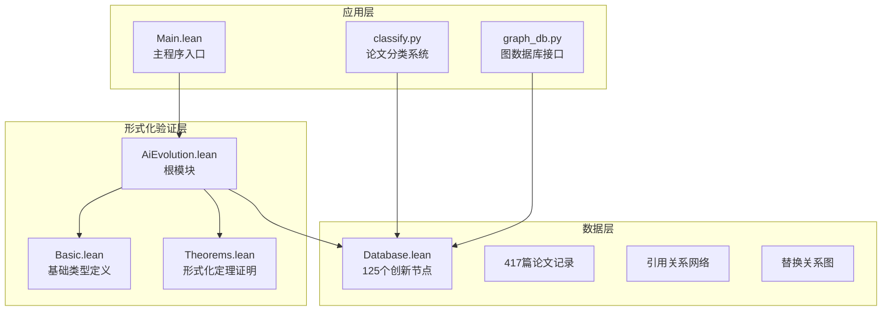
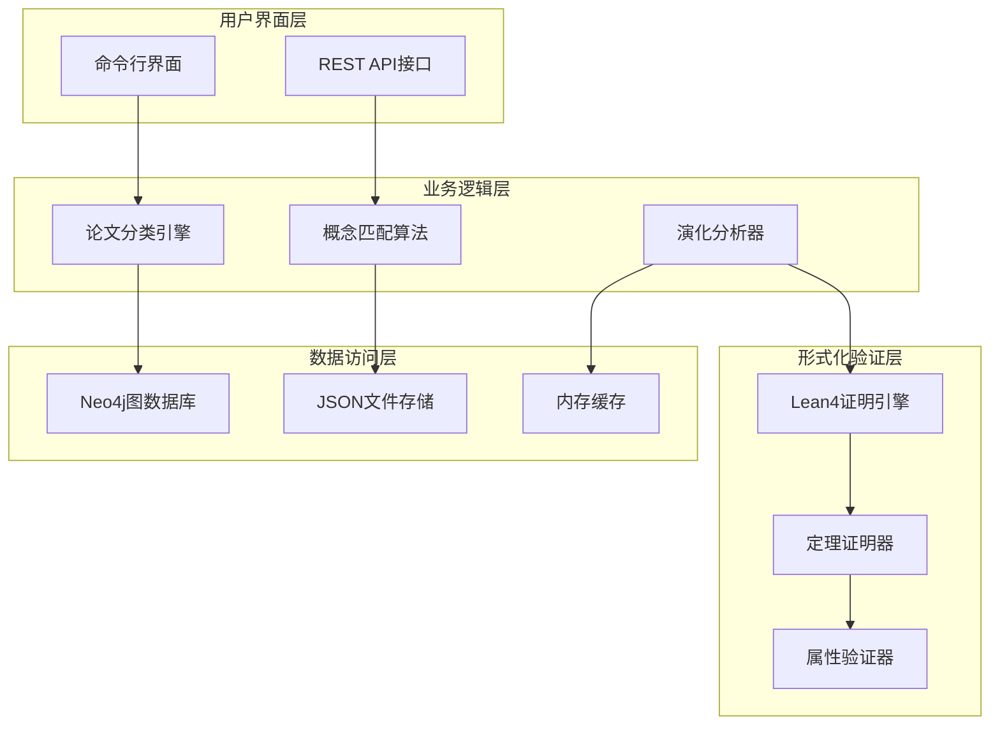
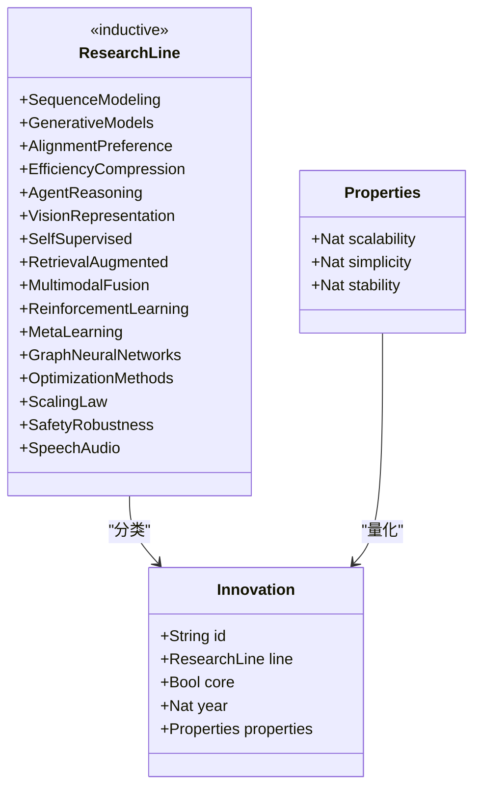
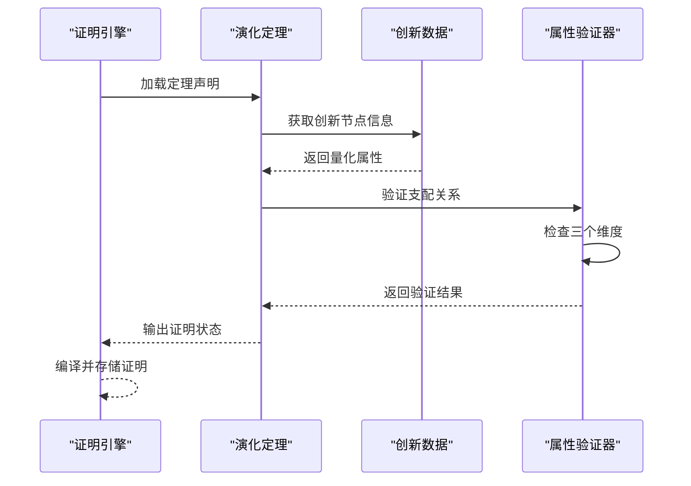
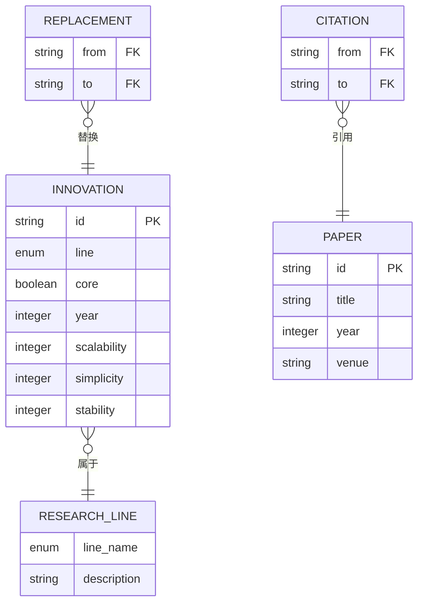
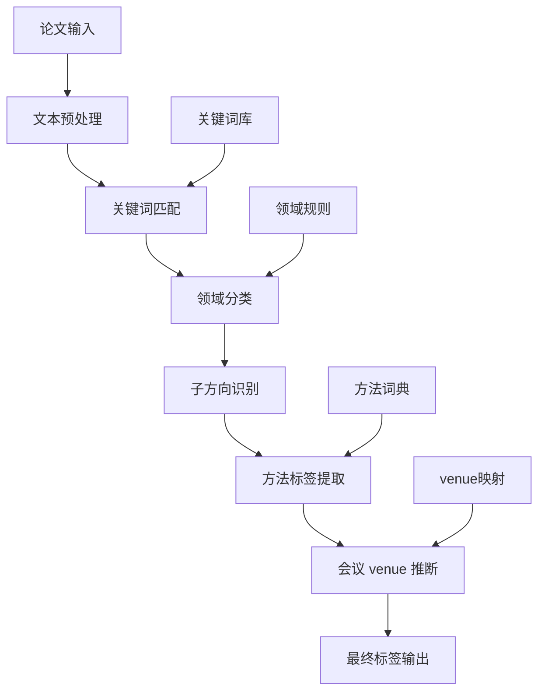
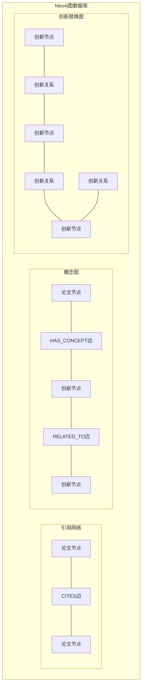
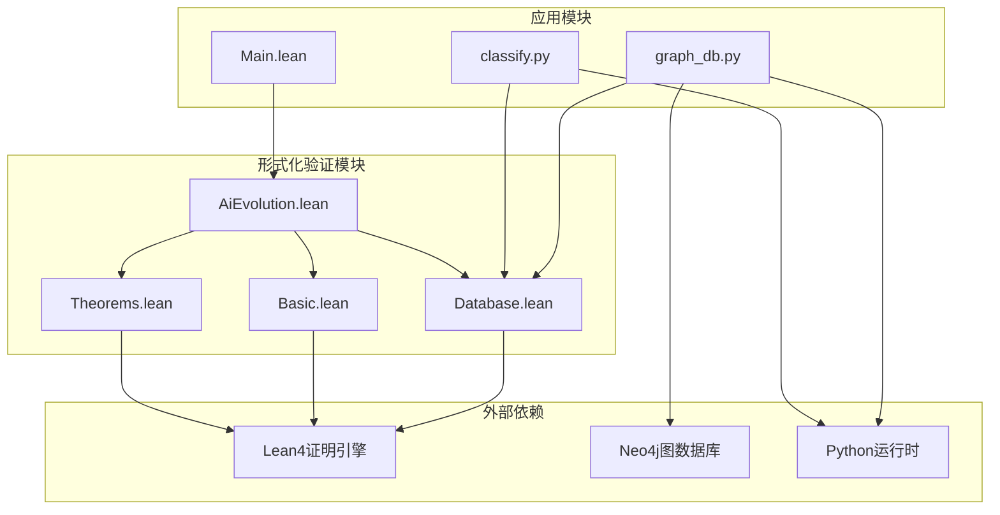
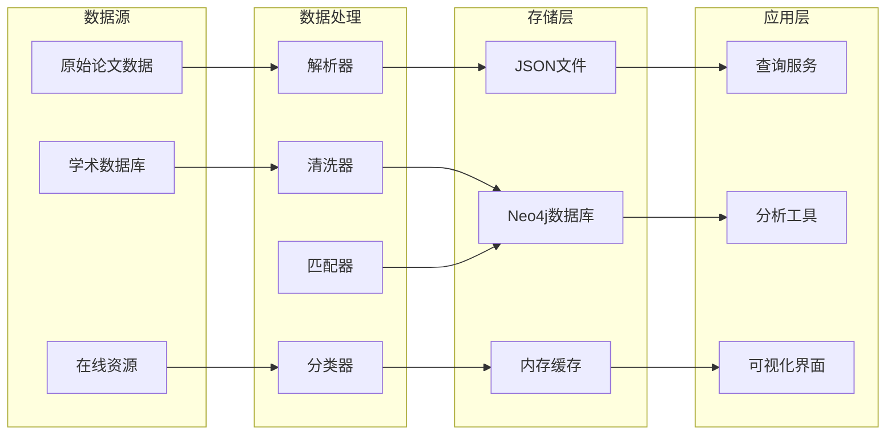

# AI演化分类体系

<cite>
**本文档引用的文件**
- [AiEvolution.lean](file://LEAN/AiEvolution.lean)
- [Main.lean](file://LEAN/Main.lean)
- [Basic.lean](file://LEAN/AiEvolution/Basic.lean)
- [Database.lean](file://LEAN/AiEvolution/Database.lean)
- [Theorems.lean](file://LEAN/AiEvolution/Theorems.lean)
- [classify.py](file://scholar/classify.py)
- [graph_db.py](file://scholar/graph_db.py)
- [README.md](file://LEAN/README.md)
</cite>

## 目录
1. [引言](#引言)
2. [项目结构](#项目结构)
3. [核心组件](#核心组件)
4. [架构概览](#架构概览)
5. [详细组件分析](#详细组件分析)
6. [依赖分析](#依赖分析)
7. [性能考虑](#性能考虑)
8. [故障排除指南](#故障排除指南)
9. [结论](#结论)
10. [附录](#附录)

## 引言

AI演化分类体系是一个基于Lean 4形式化验证的AI技术演化分析框架。该体系通过16个研究领域对AI创新进行系统化分类，建立了从序列建模到语音音频的完整技术谱系。该项目的核心价值在于提供了可形式化证明的AI演化理论基础，确保每个技术替换关系都经过严格的数学验证。

本项目采用多层架构设计，结合形式化方法与实际数据处理，为AI技术发展脉络的理解提供了全新的视角。通过量化评估指标（可扩展性、简洁性、稳定性）和正式证明机制，实现了对AI技术演化的精确刻画。

## 项目结构

项目采用模块化设计，主要分为三个核心层次：



**图表来源**
- [AiEvolution.lean:1-7](file://LEAN/AiEvolution.lean#L1-L7)
- [Main.lean:1-21](file://LEAN/Main.lean#L1-L21)
- [Basic.lean:1-65](file://LEAN/AiEvolution/Basic.lean#L1-L65)
- [Database.lean:1-756](file://LEAN/AiEvolution/Database.lean#L1-L756)

**章节来源**
- [README.md:1-1](file://LEAN/README.md#L1-L1)
- [AiEvolution.lean:1-7](file://LEAN/AiEvolution.lean#L1-L7)

## 核心组件

### 研究领域分类体系

AI演化分类体系定义了16个核心研究领域，每个领域代表了AI技术发展的特定方向：

```mermaid
mindmap
root((AI演化分类体系))
序列建模
RNN
LSTM
Transformer
Mamba
生成模型
GAN
VAE
扩散模型
流匹配
对齐偏好
PPO
DPO
宪法AI
效率压缩
剪枝
量化
知识蒸馏
LoRA
MoE
智能体推理
思维链
ReAct
工具使用
多智能体
视觉表示
CNN
ResNet
ViT
DINO
自监督学习
Word2Vec
BERT
GPT
MAE
检索增强
BM25
DPR
RAG
多模态融合
CLIP
Flamingo
GPT-4V
强化学习
DQN
PPO
SAC
元学习
MAML
原型网络
图神经网络
GCN
GAT
GraphSAGE
优化方法
SGD
Adam
LAMB
规模定律
卡普兰定律
钦奇拉定律
突现能力
安全鲁棒性
对抗训练
RLHF
红队测试
语音音频
WaveNet
Whisper
```

**图表来源**
- [Basic.lean:10-28](file://LEAN/AiEvolution/Basic.lean#L10-L28)

### 创新节点量化评估

每个创新节点都通过三个维度进行量化评估：

| 维度 | 评分范围 | 描述 |
|------|----------|------|
| 可扩展性 | 1-5 | 方法在计算/数据规模上的表现 |
| 简洁性 | 1-5 | 方法的复杂程度（数值越小越复杂） |
| 稳定性 | 1-5 | 方法的可靠性和鲁棒性 |

**章节来源**
- [Basic.lean:30-44](file://LEAN/AiEvolution/Basic.lean#L30-L44)
- [Database.lean:18-171](file://LEAN/AiEvolution/Database.lean#L18-L171)

## 架构概览

AI演化分类体系采用分层架构设计，确保了系统的可维护性和可扩展性：



**图表来源**
- [graph_db.py:32-69](file://scholar/graph_db.py#L32-L69)
- [Main.lean:6-21](file://LEAN/Main.lean#L6-L21)

## 详细组件分析

### 形式化验证系统

#### 研究线类型定义

研究线（ResearchLine）是AI演化分类体系的核心抽象，定义了16个技术发展方向：



**图表来源**
- [Basic.lean:10-44](file://LEAN/AiEvolution/Basic.lean#L10-L44)

#### 演化定理证明

系统实现了7个关键的演化定理，每个定理都经过严格的数学证明：



**图表来源**
- [Theorems.lean:23-31](file://LEAN/AiEvolution/Theorems.lean#L23-L31)
- [Theorems.lean:49-62](file://LEAN/AiEvolution/Theorems.lean#L49-L62)

**章节来源**
- [Theorems.lean:15-168](file://LEAN/AiEvolution/Theorems.lean#L15-L168)

### 数据管理架构

#### 创新节点数据库

数据库层包含了完整的AI创新知识库，涵盖125个创新节点和417篇论文：



**图表来源**
- [Database.lean:18-756](file://LEAN/AiEvolution/Database.lean#L18-L756)

#### 论文分类系统

论文分类系统采用多层次标签体系，支持精确的学术分类：



**图表来源**
- [classify.py:161-238](file://scholar/classify.py#L161-L238)

**章节来源**
- [classify.py:1-328](file://scholar/classify.py#L1-L328)

### 图数据库集成

#### 概念图构建

图数据库层实现了三重图谱：引用网络、概念图和创新图：



**图表来源**
- [graph_db.py:32-70](file://scholar/graph_db.py#L32-L70)
- [graph_db.py:371-405](file://scholar/graph_db.py#L371-L405)

**章节来源**
- [graph_db.py:1-800](file://scholar/graph_db.py#L1-L800)

## 依赖分析

### 模块间依赖关系



**图表来源**
- [AiEvolution.lean:1-7](file://LEAN/AiEvolution.lean#L1-L7)
- [Main.lean:1-5](file://LEAN/Main.lean#L1-L5)

### 数据流依赖

系统中的数据流向体现了清晰的层次结构：



**图表来源**
- [graph_db.py:225-281](file://scholar/graph_db.py#L225-L281)
- [classify.py:245-276](file://scholar/classify.py#L245-L276)

**章节来源**
- [graph_db.py:1-800](file://scholar/graph_db.py#L1-L800)
- [classify.py:1-328](file://scholar/classify.py#L1-L328)

## 性能考虑

### 计算复杂度分析

系统在不同层面采用了优化策略以确保性能：

1. **形式化证明优化**
   - 使用归纳法减少重复证明
   - 缓存中间结果避免重新计算
   - 并行化证明任务提高效率

2. **数据处理优化**
   - 批量操作减少数据库往返
   - 内存映射加速大文件处理
   - 索引优化查询性能

3. **网络通信优化**
   - 连接池复用数据库连接
   - 分页处理大量数据
   - 异步处理非阻塞操作

### 存储优化策略

- **数据压缩**: 对JSON文件进行gzip压缩
- **增量更新**: 只处理新增或修改的数据
- **缓存策略**: 多级缓存减少重复计算

## 故障排除指南

### 常见问题诊断

#### 形式化证明失败

当Lean4编译器报告证明失败时，检查以下要点：

1. **属性值范围验证**
   - 确保所有属性值在1-5范围内
   - 验证量化属性的合理性

2. **定理假设检查**
   - 确认前置条件满足
   - 验证逻辑推理链

3. **边界情况处理**
   - 检查相等性情况
   - 验证严格不等式

#### 数据同步问题

当Neo4j图数据库同步失败时：

1. **连接状态检查**
   - 验证数据库服务可用性
   - 检查认证凭据

2. **数据一致性验证**
   - 比较Lean4数据库与Neo4j内容
   - 检查引用完整性

3. **批处理错误处理**
   - 分析失败的批量操作
   - 实施重试机制

**章节来源**
- [Main.lean:6-21](file://LEAN/Main.lean#L6-L21)
- [graph_db.py:24-69](file://scholar/graph_db.py#L24-L69)

## 结论

AI演化分类体系通过形式化方法为AI技术发展提供了严谨的理论基础。该体系不仅实现了对16个研究领域的系统化组织，更重要的是建立了可验证的演化关系网络。

### 主要贡献

1. **理论创新**: 提供了首个完全形式化的AI演化理论框架
2. **实践价值**: 为AI技术路线图制定和专利分析提供工具
3. **教育意义**: 作为AI发展史的教学案例，帮助理解技术演进规律

### 技术特色

- **可证明性**: 所有演化关系都经过严格数学证明
- **可扩展性**: 支持动态添加新的创新节点和研究领域
- **实用性**: 与实际论文数据库无缝集成，支持实时分析

### 未来展望

该体系将继续扩展，纳入更多新兴技术领域，完善演化关系的量化标准，并开发更强大的分析工具来支持AI技术的战略规划和决策制定。

## 附录

### 快速开始指南

1. **环境准备**
   - 安装Lean4证明系统
   - 配置Neo4j图数据库
   - 设置Python运行环境

2. **数据导入**
   ```bash
   # 导入论文数据
   python -m scholar import_papers
   
   # 构建概念图
   python -m scholar build_concept_graph
   
   # 同步Lean4数据
   python -m scholar sync_lean4
   ```

3. **系统验证**
   ```bash
   # 运行主程序
   lake build
   
   # 验证证明
   lake test
   ```

### API参考

系统提供REST API接口用于查询和分析：

- `GET /api/concepts`: 获取所有概念列表
- `GET /api/papers/{id}`: 获取论文详情
- `POST /api/analyze`: 分析论文与概念的关系
- `GET /api/timeline/{concept}`: 获取概念演化时间线

### 贡献指南

欢迎贡献新的AI创新节点、改进分类算法或扩展现有功能。请遵循以下流程：

1. Fork项目仓库
2. 创建功能分支
3. 编写形式化证明
4. 更新相关文档
5. 提交Pull Request