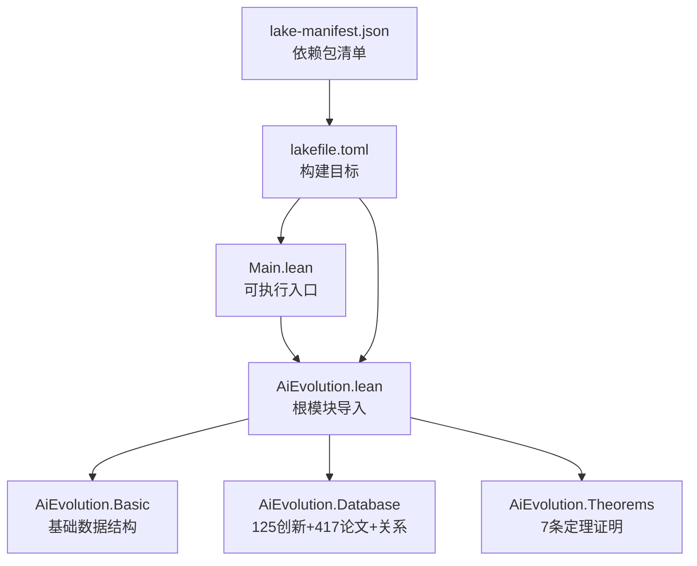
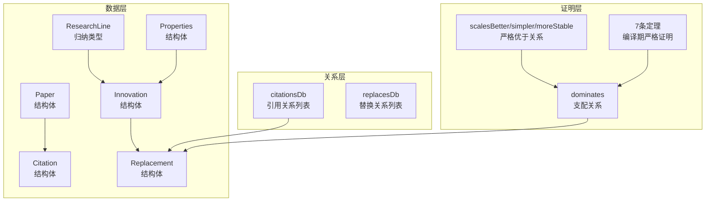
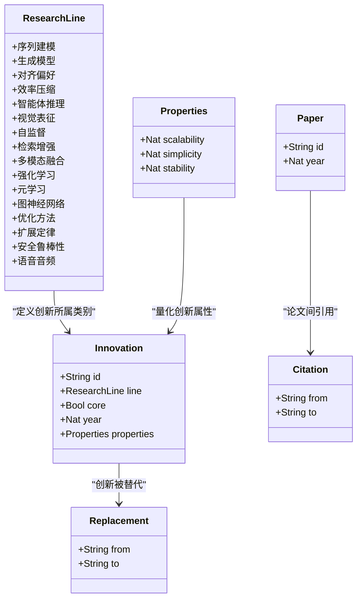
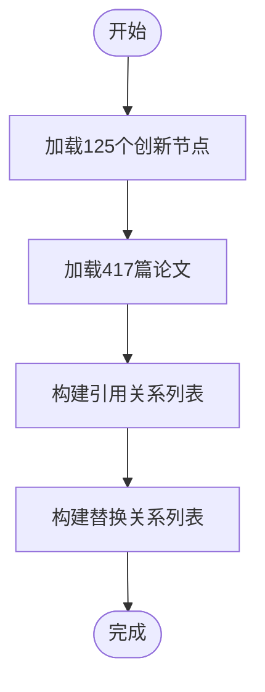
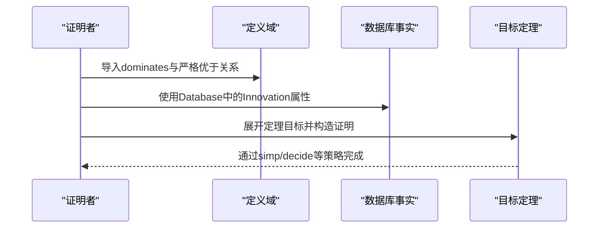
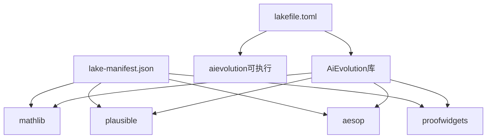

# Lean4语言基础

<cite>
**本文引用的文件**
- [README.md](file://LEAN/README.md)
- [Main.lean](file://LEAN/Main.lean)
- [AiEvolution.lean](file://LEAN/AiEvolution.lean)
- [Basic.lean](file://LEAN/AiEvolution/Basic.lean)
- [Database.lean](file://LEAN/AiEvolution/Database.lean)
- [Theorems.lean](file://LEAN/AiEvolution/Theorems.lean)
- [lakefile.toml](file://LEAN/lakefile.toml)
- [lake-manifest.json](file://LEAN/lake-manifest.json)
</cite>

## 目录
1. [引言](#引言)
2. [项目结构](#项目结构)
3. [核心组件](#核心组件)
4. [架构总览](#架构总览)
5. [详细组件分析](#详细组件分析)
6. [依赖关系分析](#依赖关系分析)
7. [性能考量](#性能考量)
8. [故障排查指南](#故障排查指南)
9. [结论](#结论)
10. [附录：从零开始学习路径](#附录从零开始学习路径)

## 引言
本入门文档面向希望系统掌握Lean4语言与形式化方法的读者，结合本仓库中的AI演化形式化验证系统，讲解Lean4作为函数式编程语言与数学证明助手的核心概念，包括类型理论、归纳类型、结构体定义、基本语法与证明流程，并提供从零开始的学习路径、常见编程模式、调试技巧与最佳实践。通过本项目中“AI演化的7条定理”的完整证明，读者可以直观理解Lean4如何在可执行代码与严格数学证明之间建立桥梁。

## 项目结构
该仓库以Lean4库工程组织，核心模块围绕“AI演化的形式化验证”展开：
- 根模块：AiEvolution（根库）
- 子模块：
  - Basic：定义研究线、创新节点、论文、引用与替换等基础数据结构
  - Database：125个创新节点、417篇论文及它们之间的引用与替换关系
  - Theorems：7条关于“替代关系”的正式定理及其证明
- 可执行入口：Main，展示数据库统计与证明状态
- 工程配置：lakefile.toml与lake-manifest.json管理包与构建目标

图表来源
- [AiEvolution.lean:1-7](file://LEAN/AiEvolution.lean#L1-L7)
- [Main.lean:1-21](file://LEAN/Main.lean#L1-L21)
- [lakefile.toml:1-11](file://LEAN/lakefile.toml#L1-L11)
- [lake-manifest.json:1-93](file://LEAN/lake-manifest.json#L1-L93)

章节来源
- [README.md:1-1](file://LEAN/README.md#L1-L1)
- [AiEvolution.lean:1-7](file://LEAN/AiEvolution.lean#L1-L7)
- [Main.lean:1-21](file://LEAN/Main.lean#L1-L21)
- [lakefile.toml:1-11](file://LEAN/lakefile.toml#L1-L11)
- [lake-manifest.json:1-93](file://LEAN/lake-manifest.json#L1-L93)

## 核心组件
- 基础数据结构（AiEvolution.Basic）
  - 归纳类型：研究线（ResearchLine）覆盖序列建模、生成模型、对齐偏好、效率压缩、智能体推理、视觉表征、自监督、检索增强、多模态融合、强化学习、元学习、图神经网络、优化方法、扩展定律、安全鲁棒性、语音音频等16类
  - 结构体：Properties（可扩展性、简洁性、稳定性）、Innovation（创新节点）、Paper（论文）、Citation（引用）、Replacement（替换）
- 数据库（AiEvolution.Database）
  - 定义125个创新节点与417篇论文的具体属性
  - 提供引用关系列表与替换关系列表，作为“正式证明目标”
- 定理（AiEvolution.Theorems）
  - 定义支配关系与严格优于关系
  - 证明7条“替代关系”定理，确保每个新范式在至少两个轴上更优或在至少一个轴上严格更优

章节来源
- [Basic.lean:10-64](file://LEAN/AiEvolution/Basic.lean#L10-L64)
- [Database.lean:18-756](file://LEAN/AiEvolution/Database.lean#L18-L756)
- [Theorems.lean:19-168](file://LEAN/AiEvolution/Theorems.lean#L19-L168)

## 架构总览
本项目采用“数据-关系-定理”的分层架构：
- 数据层：Basic与Database提供严谨的数据模型与事实
- 关系层：Citation与Replacement定义知识图谱与范式替代关系
- 证明层：Theorems以形式化方式验证替代关系的成立

图表来源
- [Basic.lean:10-64](file://LEAN/AiEvolution/Basic.lean#L10-L64)
- [Database.lean:617-756](file://LEAN/AiEvolution/Database.lean#L617-L756)
- [Theorems.lean:19-168](file://LEAN/AiEvolution/Theorems.lean#L19-L168)

## 详细组件分析

### 组件A：基础数据结构（AiEvolution.Basic）
- 归纳类型ResearchLine：将AI发展历史划分为16个研究线，体现范式演进脉络
- 结构体Properties：量化评估创新在三个维度上的表现
- 结构体Innovation：封装创新节点的标识、所属研究线、是否核心、年份与属性
- 结构体Paper/Citation/Replacement：支撑知识图谱与替代关系的建模

图表来源
- [Basic.lean:10-64](file://LEAN/AiEvolution/Basic.lean#L10-L64)

章节来源
- [Basic.lean:10-64](file://LEAN/AiEvolution/Basic.lean#L10-L64)

### 组件B：数据库（AiEvolution.Database）
- 创新节点：按研究线分组定义125个创新节点，包含年份与三轴属性
- 论文记录：417篇论文，提供ID与年份
- 引用关系：关键论文间的引用链
- 替换关系：正式证明目标，表示某创新被另一创新所替代

图表来源
- [Database.lean:18-756](file://LEAN/AiEvolution/Database.lean#L18-L756)

章节来源
- [Database.lean:18-756](file://LEAN/AiEvolution/Database.lean#L18-L756)

### 组件C：定理与证明（AiEvolution.Theorems）
- 支配关系dominates：当B在所有轴上不低于A且至少在一个轴上严格优于A时，称B支配A
- 严格优于关系：分别针对可扩展性、简洁性、稳定性
- 7条定理：逐一验证若干替代关系在三轴上的优势，全部通过构造性证明完成

图表来源
- [Theorems.lean:19-168](file://LEAN/AiEvolution/Theorems.lean#L19-L168)
- [Database.lean:18-756](file://LEAN/AiEvolution/Database.lean#L18-L756)

章节来源
- [Theorems.lean:19-168](file://LEAN/AiEvolution/Theorems.lean#L19-L168)

### 概念总览
- 类型理论与函数式编程：Lean4基于类型理论，支持归纳类型与结构体，强调不可变与纯函数式风格
- 数学证明助手：通过构造性证明与自动化战术（如simp、decide、aesop）将程序正确性与数学定理统一
- 形式化验证：以严格逻辑推导保证替代关系在数据层面的成立，避免经验性断言

（本节为概念性内容，不直接分析具体文件）

## 依赖关系分析
- 工程依赖：通过lake-manifest.json引入mathlib、plausible、LeanSearchClient、importGraph、ProofWidgets4、aesop、Qq、batteries、lean4-cli等包
- 目标配置：通过lakefile.toml定义库与可执行目标，Main作为入口

图表来源
- [lakefile.toml:1-11](file://LEAN/lakefile.toml#L1-L11)
- [lake-manifest.json:1-93](file://LEAN/lake-manifest.json#L1-L93)

章节来源
- [lakefile.toml:1-11](file://LEAN/lakefile.toml#L1-L11)
- [lake-manifest.json:1-93](file://LEAN/lake-manifest.json#L1-L93)

## 性能考量
- 归纳类型的编译与内联：Mathlib提供compile_inductive等机制，有助于提升归纳类型的递归与匹配性能
- 自动化战术的权衡：simp与aesop在复杂目标上可能带来搜索空间膨胀，应合理配置规则集与应用上限
- 数据规模与内存：数据库包含大量创新与论文，建议在查询与遍历中使用惰性与缓存策略，避免不必要的全量展开

（本节提供一般性指导，不直接分析具体文件）

## 故障排查指南
- 编译失败与类型不匹配：检查结构体字段与属性名称是否一致；确认导入顺序与open命名空间
- 证明无法自动完成：尝试逐步展开simp，或使用aesop?查看建议；必要时手动构造子目标
- 环境问题：确保lake与lean版本兼容；清理.lake缓存后重新安装依赖

（本节提供一般性指导，不直接分析具体文件）

## 结论
本项目以严谨的数据模型与7条定理证明展示了Lean4在形式化验证中的强大能力：既可表达复杂的AI演化知识图谱，又能在编译期保证替代关系的严格成立。通过本入门文档与项目源码，读者可以快速掌握Lean4的核心概念与证明流程，并将其应用于更广泛的软件与系统验证任务。

（本节为总结性内容，不直接分析具体文件）

## 附录：从零开始学习路径

### 第一步：环境搭建
- 安装Lean4与lake工具链
- 克隆本仓库并在根目录运行构建命令，确保依赖包下载成功
- 在VS Code中安装Lean4插件，启用交互式证明与信息视图

### 第二步：基础语法与类型理论
- 阅读AiEvolution.Basic中的归纳类型与结构体定义，理解数据建模方式
- 尝试在本地新建一个简单的模块，定义自己的归纳类型与结构体，编写基本的属性访问与比较函数

### 第三步：证明入门
- 从Theorems.lean的简单定理入手，理解构造性证明的步骤
- 使用simp与decide等战术，逐步完成目标证明
- 尝试为Database中的其他替代关系编写定理与证明

### 第四步：自动化证明助手
- 探索aesop、simp等战术的组合使用
- 针对复杂目标，使用aesop?查看建议并逐步细化证明树
- 在ProofWidgets等可视化工具的帮助下，观察目标与子目标的依赖关系

### 第五步：实战项目
- 基于本项目的数据模型，扩展新的研究线或创新节点
- 新增更多定理，覆盖更广的知识图谱范围
- 将Main.lean改造为交互式CLI，允许用户查询特定创新的属性与替代关系

（本节为学习路径建议，不直接分析具体文件）