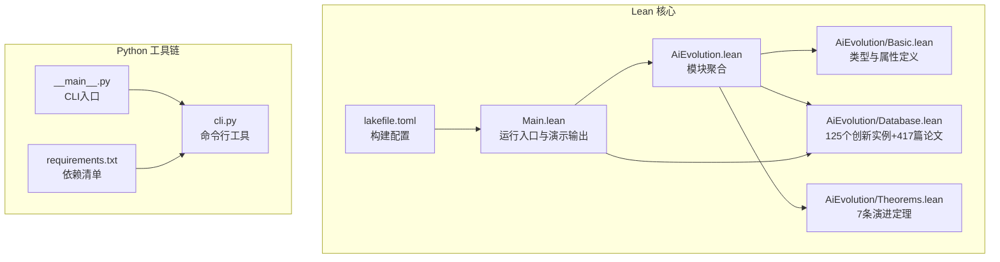
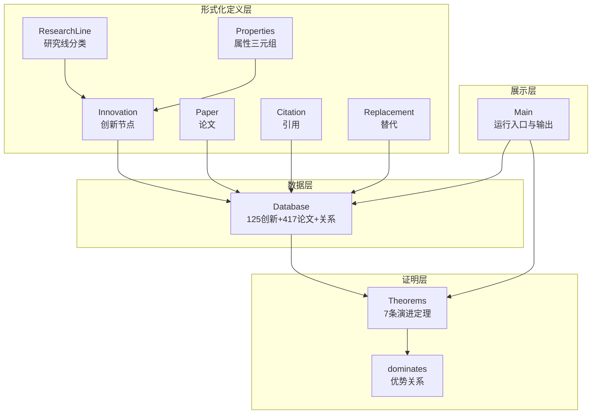
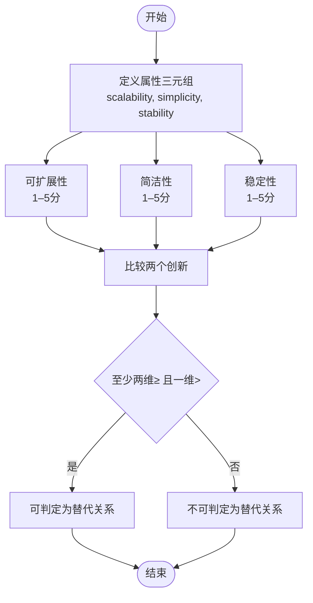
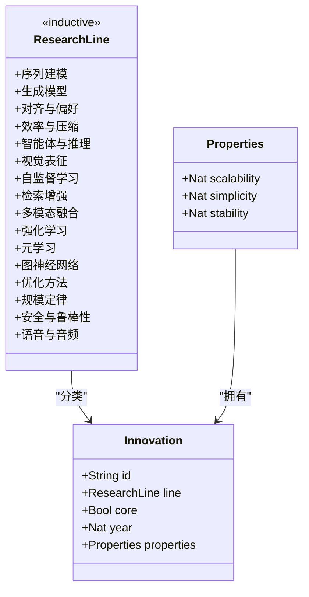
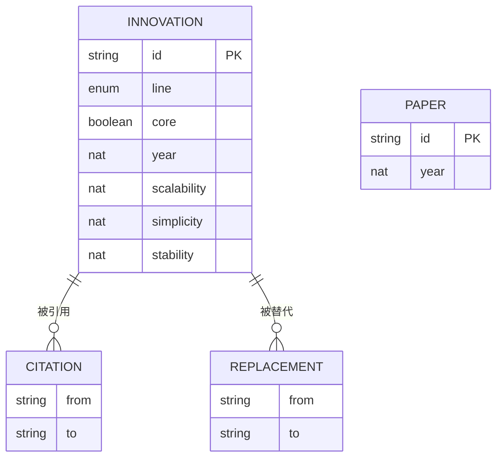
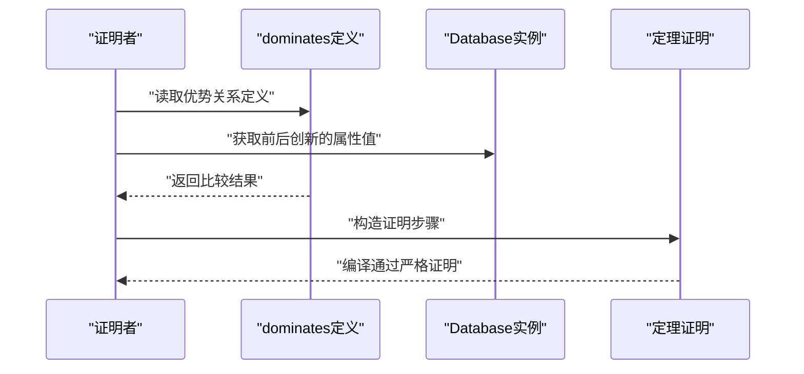
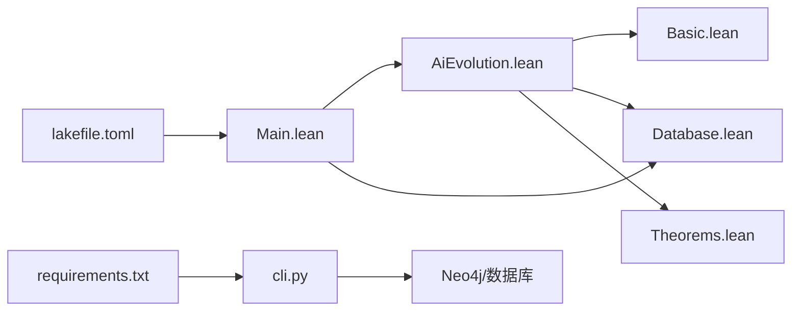

# 创新属性量化模型

<cite>
**本文档引用的文件**
- [AiEvolution.lean](file://LEAN/AiEvolution.lean)
- [Main.lean](file://LEAN/Main.lean)
- [Basic.lean](file://LEAN/AiEvolution/Basic.lean)
- [Database.lean](file://LEAN/AiEvolution/Database.lean)
- [Theorems.lean](file://LEAN/AiEvolution/Theorems.lean)
- [README.md](file://LEAN/README.md)
- [lakefile.toml](file://LEAN/lakefile.toml)
- [requirements.txt](file://requirements.txt)
- [__main__.py](file://scholar/__main__.py)
- [cli.py](file://scholar/cli.py)
</cite>

## 目录
1. [引言](#引言)
2. [项目结构](#项目结构)
3. [核心组件](#核心组件)
4. [架构总览](#架构总览)
5. [详细组件分析](#详细组件分析)
6. [依赖关系分析](#依赖关系分析)
7. [性能考量](#性能考量)
8. [故障排查指南](#故障排查指南)
9. [结论](#结论)
10. [附录](#附录)

## 引言
本项目以形式化证明的方式构建了“AI演进”的创新属性量化模型，围绕三个核心维度设计评分体系与判定规则：
- 可扩展性（scalability）：衡量方法在计算资源、数据规模等维度上的扩展能力
- 简洁性（simplicity）：衡量方法的复杂度与实现难度，数值越低表示越复杂
- 稳定性（stability）：衡量方法的可靠性与鲁棒性

通过1–5分制量化每个创新点的属性，并基于形式化定义的“优势”关系，系统性地证明某些创新对前代方案在至少两个维度上具有优势，从而形成可验证的AI演进理论基础。该模型既可用于比较不同创新方案的相对优劣，也可作为技术决策的依据。

## 项目结构
项目采用多语言混合架构：
- 核心知识库与形式化证明：Lean 4 模块 AiEvolution
- 运行入口与演示输出：Lean 4 主程序 Main.lean
- 学术论文解析与图谱构建：Python 工具链（Typer CLI、Neo4j 图数据库）
- 构建与依赖管理：Lake（Lean 包管理器）、pip（Python 依赖）

图表来源
- [AiEvolution.lean:1-7](file://LEAN/AiEvolution.lean#L1-L7)
- [Main.lean:1-21](file://LEAN/Main.lean#L1-L21)
- [Basic.lean:1-65](file://LEAN/AiEvolution/Basic.lean#L1-L65)
- [Database.lean:1-756](file://LEAN/AiEvolution/Database.lean#L1-L756)
- [Theorems.lean:1-168](file://LEAN/AiEvolution/Theorems.lean#L1-L168)
- [lakefile.toml:1-11](file://LEAN/lakefile.toml#L1-L11)
- [__main__.py:1-8](file://scholar/__main__.py#L1-L8)
- [cli.py:1-800](file://scholar/cli.py#L1-L800)
- [requirements.txt:1-9](file://requirements.txt#L1-L9)

章节来源
- [AiEvolution.lean:1-7](file://LEAN/AiEvolution.lean#L1-L7)
- [Main.lean:1-21](file://LEAN/Main.lean#L1-L21)
- [Basic.lean:1-65](file://LEAN/AiEvolution/Basic.lean#L1-L65)
- [Database.lean:1-756](file://LEAN/AiEvolution/Database.lean#L1-L756)
- [Theorems.lean:1-168](file://LEAN/AiEvolution/Theorems.lean#L1-L168)
- [lakefile.toml:1-11](file://LEAN/lakefile.toml#L1-L11)
- [__main__.py:1-8](file://scholar/__main__.py#L1-L8)
- [cli.py:1-800](file://scholar/cli.py#L1-L800)
- [requirements.txt:1-9](file://requirements.txt#L1-L9)

## 核心组件
- 类型与属性定义（AiEvolution.Basic）
  - 定义研究线分类（16类），创新节点（含ID、所属研究线、是否核心、年份、属性三元组），论文与引用关系等
  - 属性三元组 Properties = (scalability, simplicity, stability)，均为Nat（1–5）
- 数据库（AiEvolution.Database）
  - 提供125个具体创新实例及其属性值；417篇论文记录；引用与替代关系
- 形式化定理（AiEvolution.Theorems）
  - 定义“优势”关系：在至少两个维度严格优于且至少一个维度严格更优
  - 证明7条典型演进：如Transformer替换RNN、DPO替换PPO、Diffusion替换GAN等
- 运行入口（Main.lean）
  - 打印各创新的属性值，展示证明引擎状态

章节来源
- [Basic.lean:10-65](file://LEAN/AiEvolution/Basic.lean#L10-L65)
- [Database.lean:18-756](file://LEAN/AiEvolution/Database.lean#L18-L756)
- [Theorems.lean:23-168](file://LEAN/AiEvolution/Theorems.lean#L23-L168)
- [Main.lean:6-21](file://LEAN/Main.lean#L6-L21)

## 架构总览
系统由“形式化定义层 + 数据层 + 证明层 + 展示层”构成，通过Lean模块化组织，配合Python工具链完成论文解析与图谱构建。

图表来源
- [Basic.lean:10-65](file://LEAN/AiEvolution/Basic.lean#L10-L65)
- [Database.lean:18-756](file://LEAN/AiEvolution/Database.lean#L18-L756)
- [Theorems.lean:23-168](file://LEAN/AiEvolution/Theorems.lean#L23-L168)
- [Main.lean:6-21](file://LEAN/Main.lean#L6-L21)

## 详细组件分析

### 组件A：属性三元组与评分标准
- 设计理念
  - 可扩展性：衡量方法在更大规模下的表现潜力，数值越高代表更强的扩展能力
  - 简洁性：衡量实现与使用复杂度，数值越低代表越复杂或越难用
  - 稳定性：衡量方法的可靠性与鲁棒性，数值越高代表更稳定
- 评分尺度
  - 1–5分制，数值越大越好；在比较中，≥ 表示不劣于，> 表示严格更优
- 应用场景
  - 技术选型：在相同目标下选择更高可扩展性或更稳定的方法
  - 演进分析：判断新方法是否在至少两个维度上优于旧方法
  - 决策支持：为工程落地提供量化依据

图表来源
- [Basic.lean:30-35](file://LEAN/AiEvolution/Basic.lean#L30-L35)
- [Theorems.lean:23-31](file://LEAN/AiEvolution/Theorems.lean#L23-L31)

章节来源
- [Basic.lean:30-35](file://LEAN/AiEvolution/Basic.lean#L30-L35)
- [Theorems.lean:23-31](file://LEAN/AiEvolution/Theorems.lean#L23-L31)

### 组件B：创新节点与研究线分类
- 创新节点（Innovation）
  - 包含ID、所属研究线、是否核心、年份、属性三元组
- 研究线分类（ResearchLine）
  - 覆盖序列建模、生成模型、对齐偏好、效率压缩、智能体推理、视觉表征、自监督学习、检索增强、多模态融合、强化学习、元学习、图神经网络、优化方法、规模定律、安全与鲁棒性、语音音频等16类
- 价值
  - 将AI演进历史结构化为可比较的知识图谱，便于跨领域对比与趋势分析

图表来源
- [Basic.lean:11-44](file://LEAN/AiEvolution/Basic.lean#L11-L44)

章节来源
- [Basic.lean:11-44](file://LEAN/AiEvolution/Basic.lean#L11-L44)

### 组件C：数据库与实例化
- 数据库（Database）
  - 125个创新实例：涵盖主流方法与代表性变体，如Transformer、GAN、PPO、DPO、ViT、LoRA等
  - 417篇论文：用于知识库与引用关系
  - 关系：引用关系与替代关系（用于形式化证明的目标）
- 价值
  - 提供真实世界证据与基准，支撑定理证明与比较分析

图表来源
- [Database.lean:18-756](file://LEAN/AiEvolution/Database.lean#L18-L756)
- [Basic.lean:46-62](file://LEAN/AiEvolution/Basic.lean#L46-L62)

章节来源
- [Database.lean:18-756](file://LEAN/AiEvolution/Database.lean#L18-L756)
- [Basic.lean:46-62](file://LEAN/AiEvolution/Basic.lean#L46-L62)

### 组件D：形式化定理与演进证明
- 优势关系（dominates）
  - 在至少两个维度上不低于前代，且至少一个维度严格更优
- 7条典型演进定理
  - Transformer 替换 RNN
  - DPO 替换 PPO
  - Diffusion 替换 GAN
  - ViT 替换 CNN
  - LoRA 替换 Pruning（效率范式跃迁）
  - AdamW 替换 Adam（优化方法精进）
  - LSTM 在可扩展性上优于 RNN
- 价值
  - 以机器可验证的形式证明AI演进路径，避免主观判断偏差

图表来源
- [Theorems.lean:23-168](file://LEAN/AiEvolution/Theorems.lean#L23-L168)
- [Database.lean:18-756](file://LEAN/AiEvolution/Database.lean#L18-L756)

章节来源
- [Theorems.lean:23-168](file://LEAN/AiEvolution/Theorems.lean#L23-L168)
- [Database.lean:18-756](file://LEAN/AiEvolution/Database.lean#L18-L756)

### 组件E：运行入口与演示输出
- Main.lean
  - 输出总计创新数与论文数
  - 展示多个代表性创新的属性值
  - 声明证明引擎状态：所有定理已编译并通过严格证明
- 价值
  - 提供直观的可视化输出，便于快速理解模型与结果

章节来源
- [Main.lean:6-21](file://LEAN/Main.lean#L6-L21)

## 依赖关系分析
- Lean 模块依赖
  - AiEvolution 聚合 Basic、Database、Theorems
  - Main 导入 AiEvolution 并访问 Database 中的具体创新实例
- 构建与运行
  - Lake 配置 AiEvolution 库与 aievolution 可执行程序
  - 运行时通过 Lean 编译器与标准库完成证明与输出
- Python 工具链
  - Typer 提供 CLI 接口
  - Neo4j 支持学术论文与概念图谱构建
  - 与 Lean 的数据源（parsed papers）协同工作

图表来源
- [AiEvolution.lean:1-7](file://LEAN/AiEvolution.lean#L1-L7)
- [Main.lean:1-5](file://LEAN/Main.lean#L1-L5)
- [lakefile.toml:1-11](file://LEAN/lakefile.toml#L1-L11)
- [cli.py:1-800](file://scholar/cli.py#L1-L800)
- [requirements.txt:1-9](file://requirements.txt#L1-L9)

章节来源
- [AiEvolution.lean:1-7](file://LEAN/AiEvolution.lean#L1-L7)
- [Main.lean:1-5](file://LEAN/Main.lean#L1-L5)
- [lakefile.toml:1-11](file://LEAN/lakefile.toml#L1-L11)
- [cli.py:1-800](file://scholar/cli.py#L1-L800)
- [requirements.txt:1-9](file://requirements.txt#L1-L9)

## 性能考量
- 形式化证明的编译时间
  - 定理数量有限（当前7条），编译与验证可在合理时间内完成
- 数据规模
  - 125个创新实例与417篇论文体量适中，适合交互式探索与批量分析
- Python 工具链
  - CLI 命令具备进度显示与错误处理，适合大规模论文批处理解析与图谱构建

[本节为通用指导，无需特定文件来源]

## 故障排查指南
- Lean 编译失败
  - 确认 Lake 环境与 Lean 版本匹配
  - 检查模块导入顺序与语法
- Python 依赖缺失
  - 使用 requirements.txt 安装依赖
  - 确认 Neo4j 服务可用（如需构建图谱）
- CLI 命令异常
  - 使用 --help 查看命令帮助
  - 检查输入参数与文件路径

章节来源
- [requirements.txt:1-9](file://requirements.txt#L1-L9)
- [cli.py:1-800](file://scholar/cli.py#L1-L800)

## 结论
本项目以形式化方法系统化地刻画了AI创新的三个关键属性，并通过严格的数学定义与定理证明，建立了可验证的演进判据。该模型不仅有助于比较不同创新方案的优劣，也为技术决策提供了坚实的理论基础。未来可扩展的方向包括引入更多维度（如能耗、公平性）、动态权重机制与跨领域的迁移验证。

[本节为总结性内容，无需特定文件来源]

## 附录

### A. 评分示例与权重分析方法
- 示例1：Transformer vs RNN
  - Transformer：可扩展性=5，简洁性=2，稳定性=5
  - RNN：可扩展性=1，简洁性=3，稳定性=5
  - 分析：在可扩展性与简洁性上均显著优于RNN，满足“优势”定义
- 示例2：DPO vs PPO
  - DPO：可扩展性=5，简洁性=5，稳定性=5
  - PPO：可扩展性=4，简洁性=1，稳定性=3
  - 分析：在可扩展性、简洁性、稳定性三维度均占优
- 权重分析方法
  - 等权：直接使用“优势”关系进行判定
  - 动态权：根据任务目标调整维度权重（例如高可扩展性场景提高可扩展性权重），但需保持至少两维严格更优的门槛不变

章节来源
- [Main.lean:11-17](file://LEAN/Main.lean#L11-L17)
- [Theorems.lean:49-62](file://LEAN/AiEvolution/Theorems.lean#L49-L62)
- [Theorems.lean:68-81](file://LEAN/AiEvolution/Theorems.lean#L68-L81)

### B. 局限性与改进建议
- 局限性
  - 仅覆盖1–5分制离散评分，可能无法精确反映连续变化
  - 未考虑跨领域迁移与异构场景下的权重差异
  - 依赖现有数据库中的实例，可能存在遗漏或偏差
- 改进建议
  - 引入连续评分与置信区间
  - 设计跨域权重矩阵与动态调整策略
  - 扩展到更多属性维度（如公平性、可解释性、能耗等）
  - 建立持续更新机制与外部数据源集成

[本节为一般性讨论，无需特定文件来源]