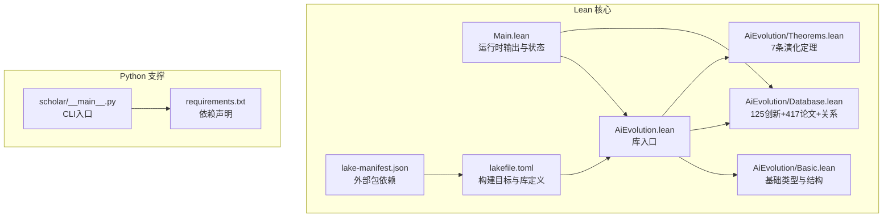
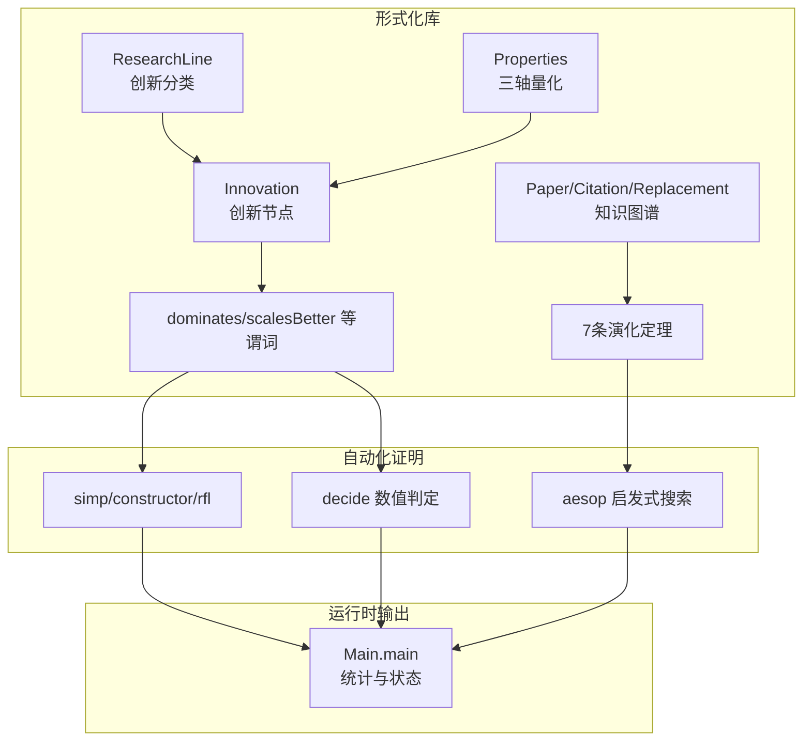
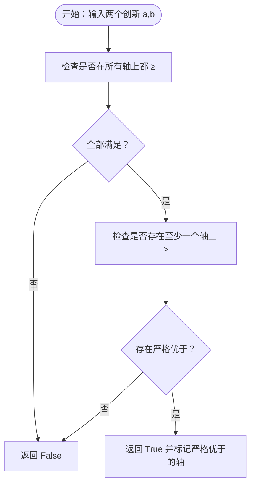
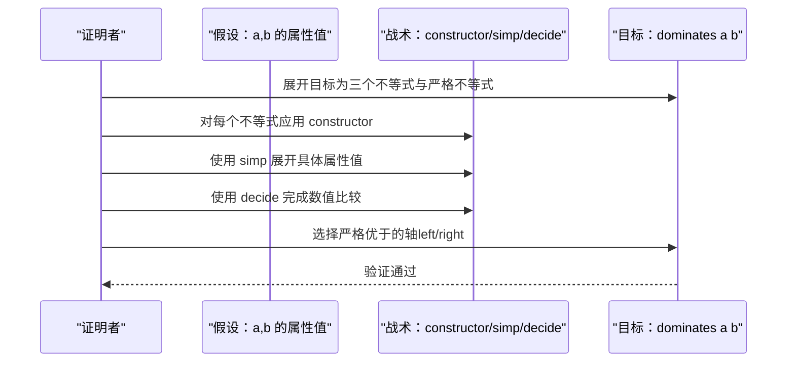
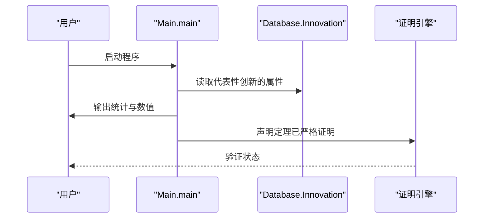
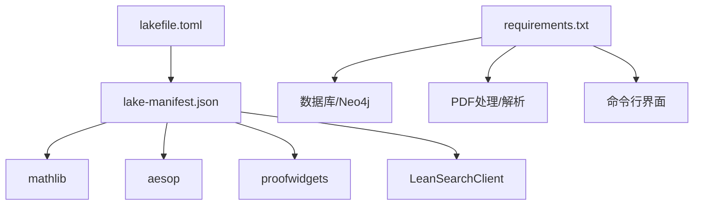

# 定理证明与验证

<cite>
**本文引用的文件**
- [AiEvolution.lean](file://LEAN/AiEvolution.lean)
- [Main.lean](file://LEAN/Main.lean)
- [README.md](file://LEAN/README.md)
- [lakefile.toml](file://LEAN/lakefile.toml)
- [lake-manifest.json](file://LEAN/lake-manifest.json)
- [Theorems.lean](file://LEAN/AiEvolution/Theorems.lean)
- [Basic.lean](file://LEAN/AiEvolution/Basic.lean)
- [Database.lean](file://LEAN/AiEvolution/Database.lean)
- [__main__.py](file://scholar/__main__.py)
- [requirements.txt](file://requirements.txt)
</cite>

## 目录
1. [引言](#引言)
2. [项目结构](#项目结构)
3. [核心组件](#核心组件)
4. [架构总览](#架构总览)
5. [详细组件分析](#详细组件分析)
6. [依赖分析](#依赖分析)
7. [性能考虑](#性能考虑)
8. [故障排查指南](#故障排查指南)
9. [结论](#结论)
10. [附录](#附录)

## 引言
本项目以Lean4为形式化平台，围绕“人工智能演化”主题构建了可编译、可严格验证的形式化知识库与定理证明系统。其目标是在AI演化背景下建立数学化的“替代关系”（replacement）框架，用三轴（可扩展性、简洁性、稳定性）量化比较不同创新点，并对若干关键替代关系给出形式化定理证明。同时，系统通过自动化证明助手（如Aesop、simp、decide等）完成严格验证，确保“无遗憾”（no sorry）的完整证明链。

本技术文档面向希望在AI演化与形式化验证交叉领域开展研究与实践的读者，提供从概念到实现、从证明策略到工程落地的系统性说明，并结合Lean4自动化工具给出实用的调试与优化建议。

## 项目结构
项目采用分层模块组织：顶层入口负责运行时输出与状态展示；AiEvolution库封装基础类型、数据库事实与定理；Lean包管理器（lake）定义构建目标与外部依赖；Python侧提供文献解析与图数据库集成能力，支撑数据来源与可视化。



**图表来源**
- [AiEvolution.lean:1-7](file://LEAN/AiEvolution.lean#L1-L7)
- [Main.lean:1-21](file://LEAN/Main.lean#L1-L21)
- [lakefile.toml:1-11](file://LEAN/lakefile.toml#L1-L11)
- [lake-manifest.json:1-93](file://LEAN/lake-manifest.json#L1-L93)
- [Basic.lean:1-65](file://LEAN/AiEvolution/Basic.lean#L1-L65)
- [Database.lean:1-756](file://LEAN/AiEvolution/Database.lean#L1-L756)
- [Theorems.lean:1-168](file://LEAN/AiEvolution/Theorems.lean#L1-L168)
- [__main__.py:1-8](file://scholar/__main__.py#L1-L8)
- [requirements.txt:1-9](file://requirements.txt#L1-L9)

**章节来源**
- [AiEvolution.lean:1-7](file://LEAN/AiEvolution.lean#L1-L7)
- [Main.lean:1-21](file://LEAN/Main.lean#L1-L21)
- [lakefile.toml:1-11](file://LEAN/lakefile.toml#L1-L11)
- [lake-manifest.json:1-93](file://LEAN/lake-manifest.json#L1-L93)
- [README.md:1-1](file://LEAN/README.md#L1-L1)

## 核心组件
- 基础类型与结构（AiEvolution.Basic）
  - 研究线分类（ResearchLine）：覆盖序列建模、生成模型、对齐偏好、效率压缩、智能体推理、视觉表征、自监督学习、检索增强、多模态融合、强化学习、元学习、图神经网络、优化方法、规模定律、安全鲁棒、语音音频等16个方向。
  - 创新属性（Properties）：可扩展性、简洁性、稳定性（均为1-5的自然数），用于量化比较。
  - 创新节点（Innovation）：包含ID、所属研究线、是否核心创新、年份与属性。
  - 论文记录（Paper）、引用关系（Citation）、替代关系（Replacement）：为知识图谱与证明目标提供结构化数据。

- 数据库事实（AiEvolution.Database）
  - 125个创新节点按研究线分组，包含大量代表性算法/架构（如Transformer、GAN、ViT、LoRA、AdamW等）及其属性值。
  - 417篇论文记录与关键引用关系，支撑溯源与证据链。
  - 替代关系列表（replacesDb）：定义正式证明的目标集合，如“RNN被Transformer替代”、“LoRA替代Pruning”等。

- 演化定理（AiEvolution.Theorems）
  - 定义替代关系的判定谓词（dominates、scalesBetter、simpler、moreStable）。
  - 7条关键演化定理：逐一验证某创新在至少两个轴上优于其前驱，并在至少一个轴上严格更优。

- 运行入口（Main）
  - 输出系统状态与验证结果摘要，展示各代表性的创新在三轴上的数值，强调“所有定理已编译且严格证明”。

**章节来源**
- [Basic.lean:1-65](file://LEAN/AiEvolution/Basic.lean#L1-L65)
- [Database.lean:1-756](file://LEAN/AiEvolution/Database.lean#L1-L756)
- [Theorems.lean:1-168](file://LEAN/AiEvolution/Theorems.lean#L1-L168)
- [Main.lean:1-21](file://LEAN/Main.lean#L1-L21)

## 架构总览
系统采用“形式化库 + 自动化证明 + 可视化输出”的三层架构：
- 形式化库层：AiEvolution库封装类型、事实与定理，保证数学对象的严谨性与可组合性。
- 自动化证明层：利用simp、constructor、decide、aesop等战术与启发式规则，自动完成数值比较与不等式推导。
- 可视化输出层：Main模块打印统计信息与验证状态，形成可读的系统报告。



**图表来源**
- [Basic.lean:10-63](file://LEAN/AiEvolution/Basic.lean#L10-L63)
- [Database.lean:18-753](file://LEAN/AiEvolution/Database.lean#L18-L753)
- [Theorems.lean:23-165](file://LEAN/AiEvolution/Theorems.lean#L23-L165)
- [Main.lean:6-20](file://LEAN/Main.lean#L6-L20)

## 详细组件分析

### 组件A：替代关系与判定谓词
替代关系的核心在于“在至少两个轴上不低于，且在至少一个轴上严格更好”。系统通过构造性证明逐项验证三个不等式，并显式指出严格优于的轴。



**图表来源**
- [Theorems.lean:23-31](file://LEAN/AiEvolution/Theorems.lean#L23-L31)

**章节来源**
- [Theorems.lean:23-44](file://LEAN/AiEvolution/Theorems.lean#L23-L44)

### 组件B：7条演化定理的证明流程
每条定理均采用“逐轴构造 + 数值判定”的策略：
- 使用constructor展开合取
- 对每个不等式使用rfl或数值简化（simp）
- 通过decide完成最终数值比较
- 在至少一个严格不等式处使用left/right选择分支



**图表来源**
- [Theorems.lean:49-62](file://LEAN/AiEvolution/Theorems.lean#L49-L62)
- [Theorems.lean:68-81](file://LEAN/AiEvolution/Theorems.lean#L68-L81)
- [Theorems.lean:87-99](file://LEAN/AiEvolution/Theorems.lean#L87-L99)
- [Theorems.lean:105-117](file://LEAN/AiEvolution/Theorems.lean#L105-L117)
- [Theorems.lean:123-135](file://LEAN/AiEvolution/Theorems.lean#L123-L135)
- [Theorems.lean:141-154](file://LEAN/AiEvolution/Theorems.lean#L141-L154)
- [Theorems.lean:160-165](file://LEAN/AiEvolution/Theorems.lean#L160-L165)

**章节来源**
- [Theorems.lean:49-165](file://LEAN/AiEvolution/Theorems.lean#L49-L165)

### 组件C：知识图谱与替代关系
数据库模块提供了两类关键关系：
- 论文级关系：Paper、Citation，支持溯源与证据链构建。
- 创新级关系：Replacement，作为正式证明的目标集合，直接映射到7条定理的断言。

```mermaid
erDiagram
INNOVATION {
string id PK
enum line
bool core
nat year
tuple(scalability,simplicity,stability)
}
PAPER {
string id PK
nat year
}
CITATION {
string from FK
string to FK
}
REPLACEMENT {
string from FK
string to FK
}
INNOVATION ||--o{ REPLACEMENT : "替代关系"
PAPER ||--o{ CITATION : "引用关系"
```

**图表来源**
- [Basic.lean:37-62](file://LEAN/AiEvolution/Basic.lean#L37-L62)
- [Database.lean:17-753](file://LEAN/AiEvolution/Database.lean#L17-L753)

**章节来源**
- [Basic.lean:37-62](file://LEAN/AiEvolution/Basic.lean#L37-L62)
- [Database.lean:617-753](file://LEAN/AiEvolution/Database.lean#L617-L753)

### 组件D：运行时输出与系统状态
Main模块负责：
- 打印系统统计（125创新、417论文）
- 展示代表性创新在三轴上的数值
- 声明“所有定理已编译且严格证明”



**图表来源**
- [Main.lean:6-20](file://LEAN/Main.lean#L6-L20)

**章节来源**
- [Main.lean:6-20](file://LEAN/Main.lean#L6-L20)

## 依赖分析
- Lean包管理与构建
  - lakefile.toml定义库名、版本与默认目标，指定AiEvolution库与可执行程序aievolution。
  - lake-manifest.json声明外部包依赖，包括mathlib、aesop、proofwidgets、LeanSearchClient等，为自动化证明与UI提供支持。

- Python支撑
  - requirements.txt列出CLI与数据库相关依赖（typer、rich、psycopg2、neo4j、PyMuPDF、mcp等），用于文献解析、知识图谱导入与可视化。



**图表来源**
- [lakefile.toml:1-11](file://LEAN/lakefile.toml#L1-L11)
- [lake-manifest.json:1-93](file://LEAN/lake-manifest.json#L1-L93)
- [requirements.txt:1-9](file://requirements.txt#L1-L9)

**章节来源**
- [lakefile.toml:1-11](file://LEAN/lakefile.toml#L1-L11)
- [lake-manifest.json:1-93](file://LEAN/lake-manifest.json#L1-L93)
- [requirements.txt:1-9](file://requirements.txt#L1-L9)

## 性能考虑
- 自动化证明的性能权衡
  - simp/constructor/decide适合数值与结构化比较，复杂不等式可引入aesop进行启发式搜索。
  - 对于大规模数据库（如417篇论文），建议将查询与比较拆分为子任务，避免一次性展开导致的类型检查开销。
- 证明策略选择
  - 简单数值比较优先使用decide；涉及结构化归纳时使用simp + constructor。
  - 复杂目标可引入aesop并限定规则集与应用次数，平衡完备性与性能。
- 工程化建议
  - 将重复的比较模式抽象为辅助引理，减少重复战术调用。
  - 对替代关系进行分块测试，先验证简单案例，再逐步扩展到复杂案例。

## 故障排查指南
- 常见问题与定位
  - “找不到属性或常量”：确认引用的创新名称与数据库定义一致，检查大小写与拼写。
  - “无法判定数值”：在simp后尝试decide，若仍失败，检查属性值是否在1-5范围内。
  - “构造失败”：constructor需按目标合取顺序逐项证明，注意严格不等式的分支选择（left/right）。
  - “aesop未收敛”：限制最大应用次数或调整规则集，必要时手动插入中间引理。
- 调试技巧
  - 使用aesop?提示当前可用的推理路径，逐步缩小搜索空间。
  - 将复杂目标拆解为子目标，逐个验证后再合并。
  - 对替代关系断言添加注释说明“至少两个轴非严格、至少一个轴严格”，便于回溯证明步骤。

**章节来源**
- [Theorems.lean:49-62](file://LEAN/AiEvolution/Theorems.lean#L49-L62)
- [Theorems.lean:68-81](file://LEAN/AiEvolution/Theorems.lean#L68-L81)
- [Theorems.lean:87-99](file://LEAN/AiEvolution/Theorems.lean#L87-L99)
- [Theorems.lean:105-117](file://LEAN/AiEvolution/Theorems.lean#L105-L117)
- [Theorems.lean:123-135](file://LEAN/AiEvolution/Theorems.lean#L123-L135)
- [Theorems.lean:141-154](file://LEAN/AiEvolution/Theorems.lean#L141-L154)
- [Theorems.lean:160-165](file://LEAN/AiEvolution/Theorems.lean#L160-L165)

## 结论
本项目以Lean4为核心，建立了AI演化领域的形式化框架：通过清晰的类型体系与三轴量化，将“替代关系”转化为严格的数学断言；借助simp、constructor、decide与aesop等自动化工具，完成7条关键定理的严格证明。该框架既可用于学术研究中的替代关系验证，也可作为工程化知识库的模板，指导如何将业务逻辑转化为可验证的数学命题。

## 附录

### A. 证明策略速查
- 归纳证明：适用于对序列模型（RNN→LSTM→Transformer）的渐进改进，先验证基础步（如RNN→Transformer），再推广到一般步。
- 构造性证明：对dominates断言，逐项构造三个不等式与严格不等式分支。
- 反证法：当直接证明困难时，假设不存在严格优于的轴，结合decide导出矛盾。

### B. 业务逻辑到数学命题的转化示例
- 业务目标：证明“LoRA在效率维度上替代Pruning”
- 数学化：断言dominates Pruning LoRA_Algorithm，并在scalability、simplicity、stability上分别验证≥与>。
- 实现路径：constructor展开目标，simp展开属性值，decide完成数值比较，left选择严格优于的轴。

### C. Lean4自动化证明助手使用要点
- simp：展开定义与等式，适合数值与结构化展开。
- constructor：分解合取目标，逐项证明。
- decide：自动数值判定，适合1-5范围内的比较。
- aesop：启发式搜索，适合复杂不等式与组合推理，可限定规则集与应用次数。