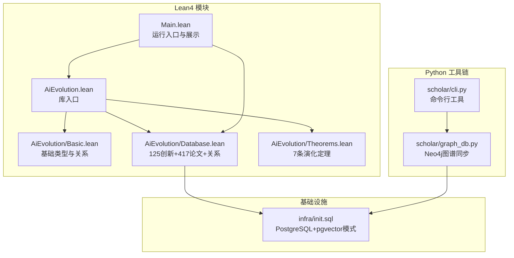
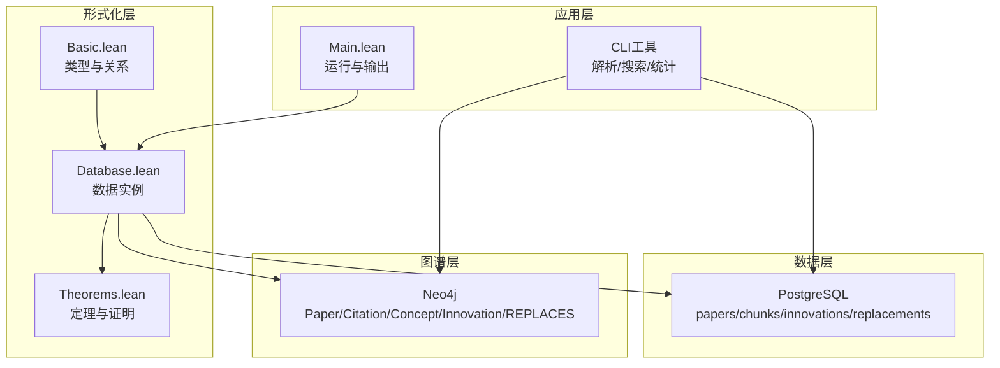
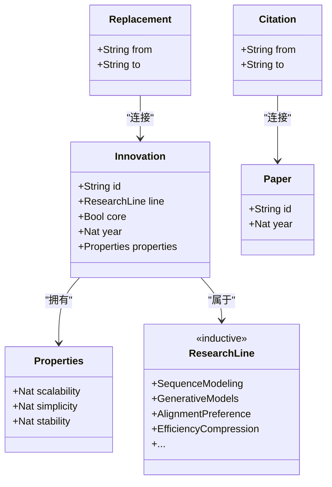
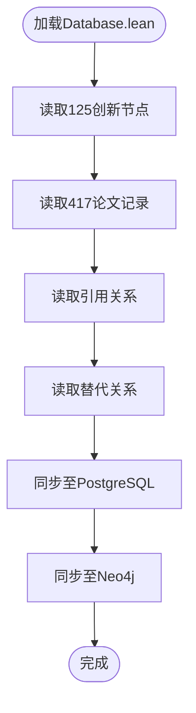
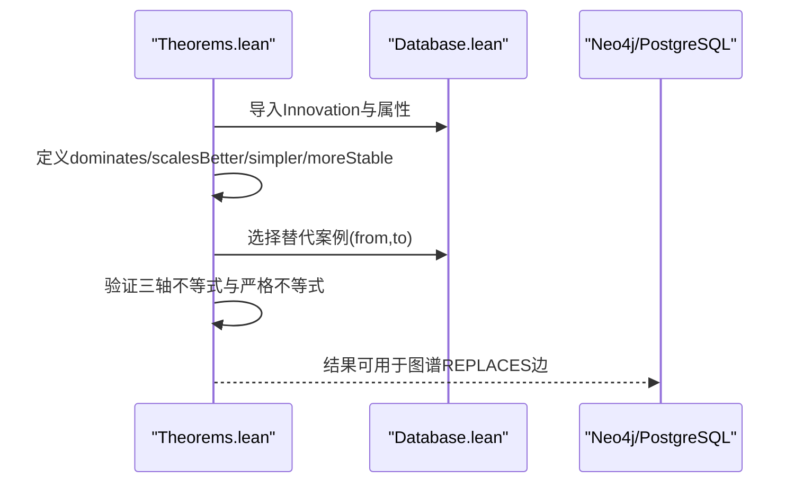
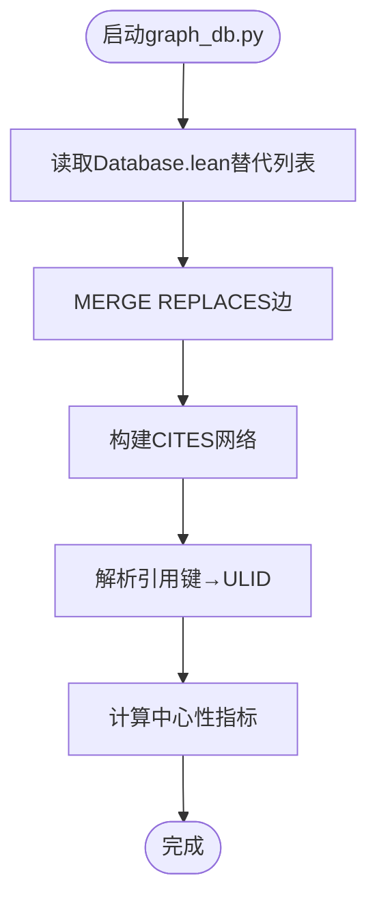
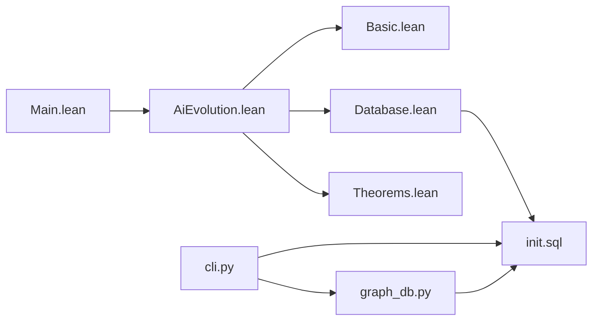

# 形式化验证系统

<cite>
**本文档引用的文件**
- [AiEvolution.lean](file://LEAN/AiEvolution.lean)
- [Main.lean](file://LEAN/Main.lean)
- [README.md](file://LEAN/README.md)
- [lakefile.toml](file://LEAN/lakefile.toml)
- [Basic.lean](file://LEAN/AiEvolution/Basic.lean)
- [Database.lean](file://LEAN/AiEvolution/Database.lean)
- [Theorems.lean](file://LEAN/AiEvolution/Theorems.lean)
- [init.sql](file://infra/init.sql)
- [cli.py](file://scholar/cli.py)
- [graph_db.py](file://scholar/graph_db.py)
</cite>

## 目录
1. [引言](#引言)
2. [项目结构](#项目结构)
3. [核心组件](#核心组件)
4. [架构总览](#架构总览)
5. [详细组件分析](#详细组件分析)
6. [依赖分析](#依赖分析)
7. [性能考虑](#性能考虑)
8. [故障排除指南](#故障排除指南)
9. [结论](#结论)
10. [附录](#附录)

## 引言
本项目旨在构建一个面向人工智能演化过程的形式化验证系统，以Lean4为严格证明框架，结合数据库与知识图谱，对AI技术的“创新节点”及其替代关系进行数学建模与形式化证明。系统通过三大支柱实现目标：（1）基础类型与关系的Lean4定义；（2）大规模AI创新与论文数据的数据库与图谱；（3）基于三轴（可扩展性、简洁性、稳定性）的替代关系定理化证明。

## 项目结构
项目采用分层模块化组织，核心位于LEAN目录下的AiEvolution库，配合Python工具链完成论文解析、数据库与图谱同步。

图表来源
- [AiEvolution.lean](file://LEAN/AiEvolution.lean)
- [Basic.lean](file://LEAN/AiEvolution/Basic.lean)
- [Database.lean](file://LEAN/AiEvolution/Database.lean)
- [Theorems.lean](file://LEAN/AiEvolution/Theorems.lean)
- [Main.lean](file://LEAN/Main.lean)
- [init.sql](file://infra/init.sql)
- [cli.py](file://scholar/cli.py)
- [graph_db.py](file://scholar/graph_db.py)

章节来源
- [AiEvolution.lean](file://LEAN/AiEvolution.lean)
- [Main.lean](file://LEAN/Main.lean)
- [README.md](file://LEAN/README.md)
- [lakefile.toml](file://LEAN/lakefile.toml)

## 核心组件
- 基础类型与关系（Basic.lean）
  - 定义研究线分类、创新节点属性、论文元数据、引用关系与替代关系等核心数据结构。
- 创新数据库（Database.lean）
  - 提供125个AI创新节点与417篇论文的权威数据集，以及关键替代关系列表。
- 形式化定理（Theorems.lean）
  - 在三轴上定义“支配”关系，并给出7条具体演化定理的完整证明。
- 运行入口（Main.lean）
  - 展示系统状态与各架构在三轴上的量化指标，体现形式化证明结果。
- 数据库模式（init.sql）
  - 定义论文、公式、引用、概念、创新节点及替代关系的表结构，支持未来RAG向量检索。
- 图谱同步（graph_db.py）
  - 将Lean4中的替代关系同步到Neo4j，构建论文-概念-创新的多图网络。

章节来源
- [Basic.lean](file://LEAN/AiEvolution/Basic.lean)
- [Database.lean](file://LEAN/AiEvolution/Database.lean)
- [Theorems.lean](file://LEAN/AiEvolution/Theorems.lean)
- [Main.lean](file://LEAN/Main.lean)
- [init.sql](file://infra/init.sql)
- [graph_db.py](file://scholar/graph_db.py)

## 架构总览
系统采用“形式化定义—数据存储—图谱同步—定理证明—可视化展示”的闭环架构。Lean4负责数学模型与证明，PostgreSQL承载结构化数据，Neo4j承载图谱，Python工具链负责数据解析与同步。

图表来源
- [Basic.lean](file://LEAN/AiEvolution/Basic.lean)
- [Database.lean](file://LEAN/AiEvolution/Database.lean)
- [Theorems.lean](file://LEAN/AiEvolution/Theorems.lean)
- [Main.lean](file://LEAN/Main.lean)
- [init.sql](file://infra/init.sql)
- [cli.py](file://scholar/cli.py)
- [graph_db.py](file://scholar/graph_db.py)

## 详细组件分析

### 组件A：基础类型与关系（Basic.lean）
- 研究线（ResearchLine）：将AI演化划分为16个研究主线，如序列建模、生成模型、对齐偏好、效率压缩等。
- 创新属性（Properties）：三轴量化指标（可扩展性、简洁性、稳定性），取值范围为1–5。
- 创新节点（Innovation）：包含ID、所属研究线、是否核心、年份与属性。
- 论文记录（Paper）、引用（Citation）、替代（Replacement）：用于刻画知识传播与技术替代关系。
- 设计要点
  - 使用结构体与归纳类型确保数据一致性与可判定性。
  - 衍生Repr、DecidableEq、Inhabited等实例，便于形式化处理与比较。

图表来源
- [Basic.lean](file://LEAN/AiEvolution/Basic.lean)

章节来源
- [Basic.lean](file://LEAN/AiEvolution/Basic.lean)

### 组件B：创新数据库（Database.lean）
- 数据规模：125个创新节点、417篇论文、引用关系与替代关系。
- 分组组织：按研究线分组列出创新节点，便于按领域检索与分析。
- 替代关系：提供明确的“from → to”替代列表，作为定理证明的目标集合。
- 引用关系：提供关键论文之间的引用映射，支撑演化路径分析。

图表来源
- [Database.lean](file://LEAN/AiEvolution/Database.lean)
- [init.sql](file://infra/init.sql)
- [graph_db.py](file://scholar/graph_db.py)

章节来源
- [Database.lean](file://LEAN/AiEvolution/Database.lean)
- [init.sql](file://infra/init.sql)
- [graph_db.py](file://scholar/graph_db.py)

### 组件C：形式化定理（Theorems.lean）
- 支撑定义
  - 支配关系（dominates）：在至少一个轴上严格更优，在所有轴上不低于原创新。
  - 严格更优子关系：分别针对可扩展性、简洁性、稳定性。
- 定理目标
  - 证明若干“替代”案例满足支配关系，覆盖从RNN到Transformer、GAN到扩散模型、CNN到ViT、优化器迭代等经典范式转移。
- 证明风格
  - 使用构造性证明，逐项验证三轴不等式与严格不等式，借助simp与decide自动化完成数值比较。

图表来源
- [Theorems.lean](file://LEAN/AiEvolution/Theorems.lean)
- [Database.lean](file://LEAN/AiEvolution/Database.lean)

章节来源
- [Theorems.lean](file://LEAN/AiEvolution/Theorems.lean)

### 组件D：运行入口与展示（Main.lean）
- 输出系统状态与各架构在三轴上的量化指标，展示“全部定理已编译且严格证明”的结果。
- 作为用户交互入口，直观呈现系统验证能力。

章节来源
- [Main.lean](file://LEAN/Main.lean)

### 组件E：数据库模式（init.sql）
- 表结构概览
  - papers：论文元数据与解析状态
  - sections/formulas：结构化正文与公式抽取
  - citations：引用关系
  - concepts/paper_concepts：概念抽取与关联
  - chunks：向量化内容（为RAG准备）
  - innovations：与Lean4同步的创新节点
  - replacements：与Lean4替代关系同步
- 扩展性：引入pgvector支持向量检索，为后续RAG应用打下基础。

章节来源
- [init.sql](file://infra/init.sql)

### 组件F：图谱同步（graph_db.py）
- 功能
  - 解析Lean4 Database.lean中的替代关系，写入Neo4j的REPLACES边。
  - 构建论文引用网络、概念图谱，并计算中心性指标。
  - 解析引用键到论文ULID的映射，清理孤立节点。
- 流程
  - 读取Lean4替代列表
  - 合并到Neo4j，形成统一的知识图谱

图表来源
- [graph_db.py](file://scholar/graph_db.py)
- [Database.lean](file://LEAN/AiEvolution/Database.lean)

章节来源
- [graph_db.py](file://scholar/graph_db.py)

## 依赖分析
- 模块依赖
  - AiEvolution.lean导入Basic、Database、Theorems。
  - Main.lean导入AiEvolution并调用Database中的创新节点。
- 外部依赖
  - Lean4生态：lake构建系统、mathlib等。
  - Python生态：rich、typer、neo4j驱动等。
- 数据依赖
  - Lean4 Database.lean是权威数据源，Python脚本负责将其同步到PostgreSQL与Neo4j。

图表来源
- [AiEvolution.lean](file://LEAN/AiEvolution.lean)
- [Main.lean](file://LEAN/Main.lean)
- [Basic.lean](file://LEAN/AiEvolution/Basic.lean)
- [Database.lean](file://LEAN/AiEvolution/Database.lean)
- [Theorems.lean](file://LEAN/AiEvolution/Theorems.lean)
- [init.sql](file://infra/init.sql)
- [cli.py](file://scholar/cli.py)
- [graph_db.py](file://scholar/graph_db.py)

章节来源
- [AiEvolution.lean](file://LEAN/AiEvolution.lean)
- [Main.lean](file://LEAN/Main.lean)
- [lakefile.toml](file://LEAN/lakefile.toml)

## 性能考虑
- Lean4证明性能
  - 使用simp与decide自动处理数值比较，减少手工推导工作量。
  - 将复杂比较拆分为辅助定义（如dominates、scalesBetter），提升可读性与可维护性。
- 数据库性能
  - 使用索引（如idx_sections_paper、idx_citations_from等）加速查询。
  - 向量化字段（embedding）为RAG检索做准备，建议分批写入与定期归档。
- 图谱性能
  - 批量写入（UNWIND）替代逐条插入，降低网络往返开销。
  - 中心性计算采用Cypher聚合，避免在应用侧进行全图遍历。

## 故障排除指南
- Lean4构建失败
  - 确认lakefile.toml中目标与包配置正确。
  - 检查Basic.lean与Database.lean的导入顺序与命名空间。
- 数据库连接问题
  - 确认PostgreSQL服务运行，且init.sql已执行。
  - 检查表结构与索引是否存在。
- Neo4j同步异常
  - 确认Neo4j URI/凭据配置正确。
  - 检查graph_db.py中正则匹配替代关系的逻辑是否与Lean4一致。
- CLI命令无效
  - 使用python -m scholar查看可用命令与帮助信息。
  - 检查scholar目录的依赖安装情况。

章节来源
- [cli.py](file://scholar/cli.py)
- [graph_db.py](file://scholar/graph_db.py)
- [init.sql](file://infra/init.sql)

## 结论
本系统以Lean4为核心，将AI演化过程形式化为可验证的数学模型，结合大规模数据与图谱，实现了从“数据—模型—证明—可视化”的闭环验证体系。通过7条关键定理，系统严格证明了多个代表性技术替代案例在三轴上的优势，为AI技术发展路径提供了严谨的数学依据与可追溯的证据链。

## 附录

### A. 数学模型与谓词逻辑
- 支配关系（dominates）：在至少一个维度严格更优，其余维度不低于原创新。
- 严格更优关系：分别针对可扩展性、简洁性、稳定性。
- 应用：用于替代关系的判定与定理证明。

章节来源
- [Theorems.lean](file://LEAN/AiEvolution/Theorems.lean)

### B. 证明示例与推理规则
- 示例1：Transformer替代RNN
  - 可扩展性：5 > 1 ✓
  - 简洁性：3 ≥ 3 ✓
  - 稳定性：5 ≥ 5 ✓
  - 至少一项严格更优：可扩展性成立
- 示例2：DPO替代PPO
  - 可扩展性：5 ≥ 4 ✓
  - 简洁性：5 > 1 ✓
  - 稳定性：5 > 3 ✓
- 推理规则
  - 构造性证明：逐项验证三轴不等式与严格不等式。
  - 自动化：使用simp与decide完成数值比较。

章节来源
- [Theorems.lean](file://LEAN/AiEvolution/Theorems.lean)

### C. 验证流程与最佳实践
- 数据准备：确保Lean4 Database.lean与Python同步脚本一致。
- 证明编译：使用lake build确保所有定理无`sorry`。
- 可视化：通过Main.lean输出三轴指标，核验证明结果。
- 扩展建议：增加更多替代案例与维度（如能耗、公平性），并引入自动化启发式以辅助证明。

章节来源
- [Main.lean](file://LEAN/Main.lean)
- [Database.lean](file://LEAN/AiEvolution/Database.lean)
- [Theorems.lean](file://LEAN/AiEvolution/Theorems.lean)