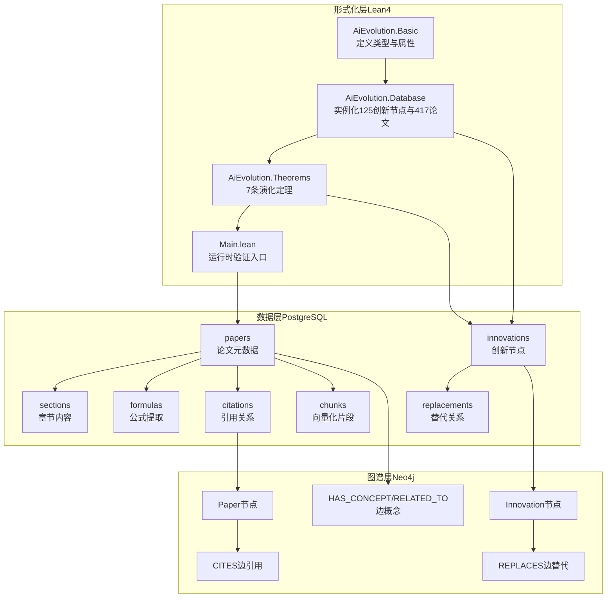
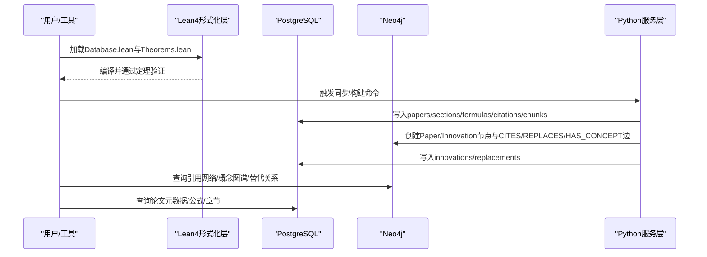
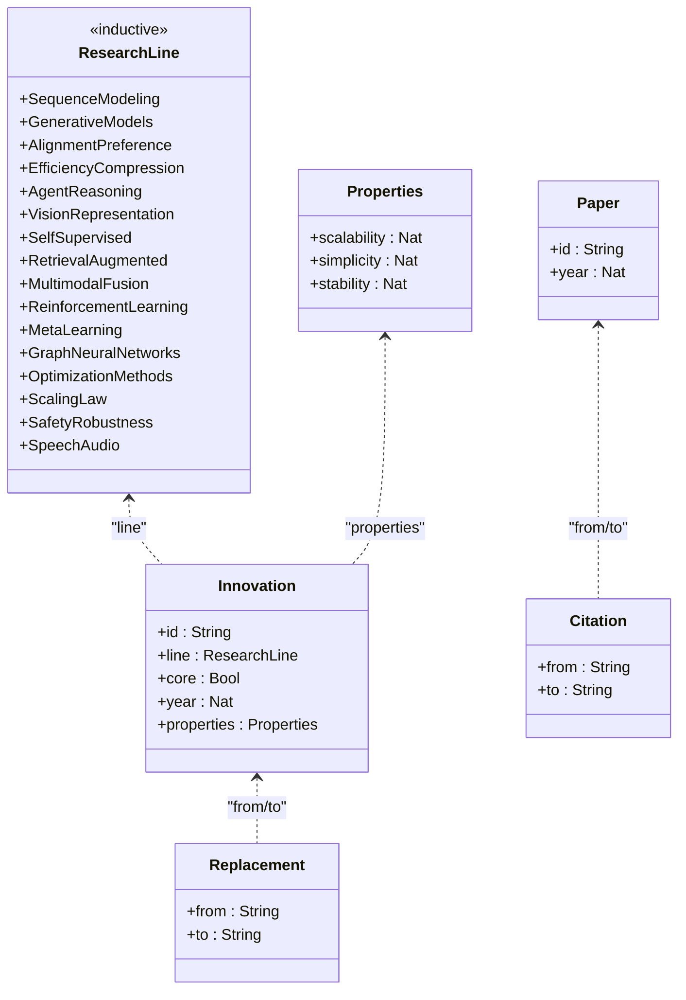
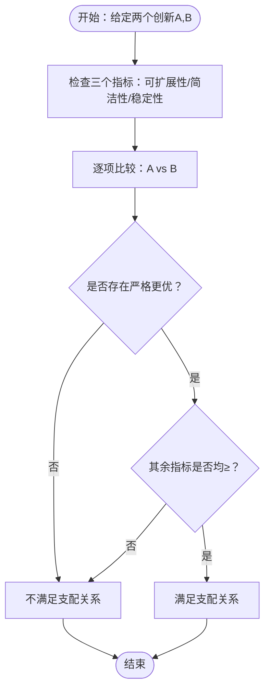
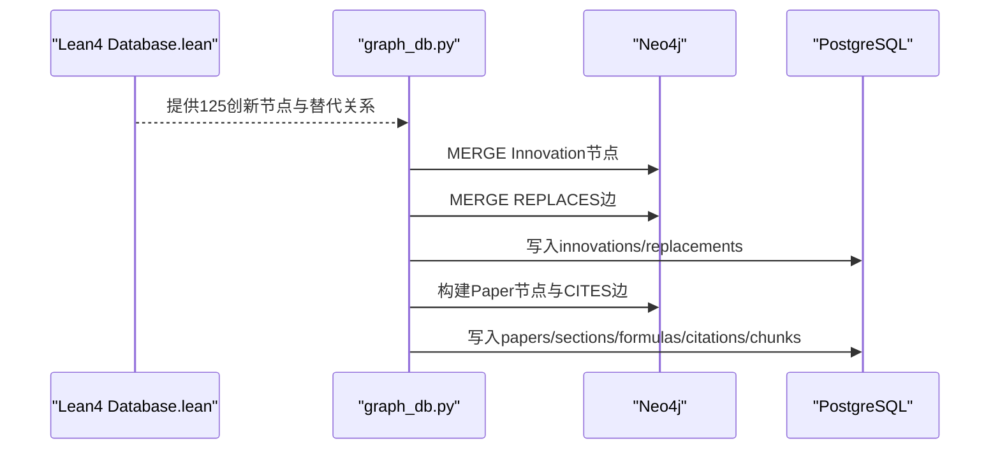
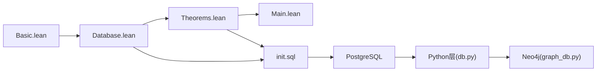

# 数据库设计与建模

<cite>
**本文档引用的文件**
- [Basic.lean](file://LEAN/AiEvolution/Basic.lean)
- [Database.lean](file://LEAN/AiEvolution/Database.lean)
- [Theorems.lean](file://LEAN/AiEvolution/Theorems.lean)
- [Main.lean](file://LEAN/Main.lean)
- [init.sql](file://infra/init.sql)
- [db.py](file://scholar/db.py)
- [graph_db.py](file://scholar/graph_db.py)
- [README.md](file://README.md)
</cite>

## 目录
1. [简介](#简介)
2. [项目结构](#项目结构)
3. [核心组件](#核心组件)
4. [架构总览](#架构总览)
5. [详细组件分析](#详细组件分析)
6. [依赖关系分析](#依赖关系分析)
7. [性能考量](#性能考量)
8. [故障排除指南](#故障排除指南)
9. [结论](#结论)
10. [附录](#附录)

## 简介
本文件面向形式化验证数据库设计，围绕“AI演化知识库”的数学模型与数据结构展开，重点阐述：
- 创新节点、论文记录、引用关系、替代关系的严格数学定义与约束
- 如何利用Lean4类型系统确保数据一致性与完整性
- 数据库Schema的数学证明与验证流程
- 数据建模最佳实践、性能优化与扩展策略
- 将现实世界数据映射到形式化数学结构的方法

## 项目结构
该项目采用“形式化层 + 数据层 + 图谱层”的分层架构：
- 形式化层（Lean4）：定义AI演化知识库的数学模型与定理，保证数据与推理的严格性
- 数据层（PostgreSQL + pgvector）：持久化论文元数据、章节、公式、引用、嵌入等
- 图谱层（Neo4j）：构建引用网络、概念图谱、创新替换关系，支持复杂查询与分析

图表来源
- [Basic.lean:1-65](file://LEAN/AiEvolution/Basic.lean#L1-L65)
- [Database.lean:1-756](file://LEAN/AiEvolution/Database.lean#L1-L756)
- [Theorems.lean:1-168](file://LEAN/AiEvolution/Theorems.lean#L1-L168)
- [Main.lean:1-21](file://LEAN/Main.lean#L1-L21)
- [init.sql:1-131](file://infra/init.sql#L1-L131)
- [graph_db.py:1-922](file://scholar/graph_db.py#L1-L922)

章节来源
- [README.md:300-326](file://README.md#L300-L326)

## 核心组件
本节聚焦于数据库与形式化层的核心数据结构与约束，以及它们之间的映射关系。

- 创新节点（Innovation）
  - 字段：id（String）、line（ResearchLine）、core（Bool）、year（Nat）、properties（Properties）
  - 约束：id唯一；line枚举来自ResearchLine；properties包含三个1-5的自然数指标
- 论文记录（Paper）
  - 字段：id（String）、year（Nat）
  - 约束：id唯一；year为自然数
- 引用关系（Citation）
  - 字段：from（String）、to（String）
  - 约束：from与to均为存在的论文id
- 替代关系（Replacement）
  - 字段：from（String）、to（String）
  - 约束：from与to均为存在的创新节点id，且形成偏序关系（逐步替换）

章节来源
- [Basic.lean:10-64](file://LEAN/AiEvolution/Basic.lean#L10-L64)
- [Database.lean:18-753](file://LEAN/AiEvolution/Database.lean#L18-L753)

## 架构总览
下图展示了从形式化数据到持久化与图谱层的映射路径，以及验证流程。

图表来源
- [Database.lean:18-753](file://LEAN/AiEvolution/Database.lean#L18-L753)
- [init.sql:9-131](file://infra/init.sql#L9-L131)
- [graph_db.py:225-281](file://scholar/graph_db.py#L225-L281)
- [graph_db.py:794-839](file://scholar/graph_db.py#L794-L839)

## 详细组件分析

### 数学模型与数据结构设计
- 类型系统与不变量
  - ResearchLine为归纳类型，覆盖16个研究方向，确保line域的离散与完备
  - Properties为结构体，包含三个1-5的自然数指标，天然满足范围约束
  - Innovation/Paper/Citation/Replacement均为结构体，具备Repr与DecidableEq派生，便于比较与打印
- 约束与完整性
  - Lean4层面：通过结构体字段与归纳类型的构造保证值域正确性
  - 数据库层面：主键、外键、UNIQUE约束、默认值、索引共同保障一致性
  - 图谱层面：MERGE语句避免重复，ON DELETE CASCADE维护级联删除

图表来源
- [Basic.lean:10-64](file://LEAN/AiEvolution/Basic.lean#L10-L64)

章节来源
- [Basic.lean:10-64](file://LEAN/AiEvolution/Basic.lean#L10-L64)

### 数据库Schema与约束
- 论文表（papers）
  - 主键：id（ULID）
  - 辅助字段：title、authors、year、venue、abstract、arxiv_id、doi、has_tex、parsed_ok、parsed_path、section_count、formula_count、citation_count、read_status、created_at、updated_at
  - 约束：year为整数；read_status枚举值；默认值确保时间戳与状态一致
- 章节表（sections）
  - 主键：id；外键：paper_id → papers(id)（CASCADE）
  - 索引：idx_sections_paper
- 公式表（formulas）
  - 主键：id；外键：paper_id → papers(id)（CASCADE）
  - 索引：idx_formulas_paper
- 引用表（citations）
  - 主键：id；外键：from_paper → papers(id)（CASCADE）
  - 约束：UNIQUE(from_paper, to_ref)
  - 索引：idx_citations_from、idx_citations_to
- 嵌入表（chunks）
  - 主键：id；外键：paper_id → papers(id)（CASCADE）
  - 索引：idx_chunks_paper
- 创新节点表（innovations）
  - 主键：id；外键：id → innovations(id)（自引用，用于REPLACES）
  - 字段：line、core、year、scalability、simplicity、stability
- 替代关系表（replacements）
  - 主键：id；外键：from_innov、to_innov → innovations(id)
  - 约束：UNIQUE(from_innov, to_innov)

章节来源
- [init.sql:9-131](file://infra/init.sql#L9-L131)

### 形式化验证与数学证明
- 定理目标
  - 定义支配关系dominates：在至少一个维度严格更优的前提下，在其余维度不低于
  - 7条演化定理：逐一证明若干替代关系在三个维度上的优势
- 证明策略
  - 使用simp与decide进行数值比较，构造constructor序列完成证明
  - 保证no sorry，确保编译期完全验证

图表来源
- [Theorems.lean:23-44](file://LEAN/AiEvolution/Theorems.lean#L23-L44)
- [Theorems.lean:49-165](file://LEAN/AiEvolution/Theorems.lean#L49-L165)

章节来源
- [Theorems.lean:19-168](file://LEAN/AiEvolution/Theorems.lean#L19-L168)

### 从形式化到持久化的映射
- 125创新节点与417论文实例化
  - Database.lean中显式定义所有创新节点与论文记录，确保形式化层与数据层一致
- 替代关系同步
  - graph_db.py动态解析Database.lean中的replacesDb，或回退到硬编码关系，批量写入Neo4j的REPLACES边
- 引用关系构建
  - graph_db.py从parsed JSON构建Paper节点与CITES边，并进行ref_key解析与重映射

图表来源
- [Database.lean:18-753](file://LEAN/AiEvolution/Database.lean#L18-L753)
- [graph_db.py:794-839](file://scholar/graph_db.py#L794-L839)
- [graph_db.py:225-281](file://scholar/graph_db.py#L225-L281)

章节来源
- [graph_db.py:371-406](file://scholar/graph_db.py#L371-L406)
- [graph_db.py:794-839](file://scholar/graph_db.py#L794-L839)

### Python数据访问层
- PostgreSQL封装
  - 提供upsert_paper/upsert_sections/upsert_formulas/upsert_citations等接口，支持幂等写入与批量更新
  - 支持查询与统计接口，便于前端与分析工具使用
- Neo4j封装
  - 提供GraphDB类，封装连接、查询与关闭
  - 提供引用网络构建、中心性计算、概念图谱构建与查询接口

章节来源
- [db.py:24-270](file://scholar/db.py#L24-L270)
- [graph_db.py:32-70](file://scholar/graph_db.py#L32-L70)

## 依赖关系分析
- 形式化层依赖
  - Basic.lean定义基础类型与属性
  - Database.lean实例化具体数据
  - Theorems.lean基于Database.lean进行定理证明
- 数据层依赖
  - init.sql定义Schema与约束
  - Python层负责数据写入与查询
- 图谱层依赖
  - graph_db.py从Lean4与parsed JSON同步数据至Neo4j

图表来源
- [Basic.lean:8-11](file://LEAN/AiEvolution/Basic.lean#L8-L11)
- [Database.lean:8-12](file://LEAN/AiEvolution/Database.lean#L8-L12)
- [Theorems.lean:10-13](file://LEAN/AiEvolution/Theorems.lean#L10-L13)
- [Main.lean:1-5](file://LEAN/Main.lean#L1-L5)
- [init.sql:1-131](file://infra/init.sql#L1-L131)
- [db.py:14-270](file://scholar/db.py#L14-L270)
- [graph_db.py:24-70](file://scholar/graph_db.py#L24-L70)

章节来源
- [Basic.lean:8-11](file://LEAN/AiEvolution/Basic.lean#L8-L11)
- [Database.lean:8-12](file://LEAN/AiEvolution/Database.lean#L8-L12)
- [Theorems.lean:10-13](file://LEAN/AiEvolution/Theorems.lean#L10-L13)
- [Main.lean:1-5](file://LEAN/Main.lean#L1-L5)
- [init.sql:1-131](file://infra/init.sql#L1-L131)
- [db.py:14-270](file://scholar/db.py#L14-L270)
- [graph_db.py:24-70](file://scholar/graph_db.py#L24-L70)

## 性能考量
- 索引与查询
  - PostgreSQL：为高频查询列建立索引（如papers.year、sections.paper_id、formulas.paper_id、citations.from_paper、citations.to_paper、chunks.paper_id）
  - Neo4j：合理使用MERGE与UNWIND批处理，减少事务开销
- 批处理与幂等写入
  - Python层使用批量插入与ON CONFLICT DO UPDATE，降低写入延迟
- 向量化与RAG
  - chunks表使用pgvector存储1024维向量，结合全文搜索实现混合检索
- 数据规模
  - 项目已达到440篇论文、38K+引用边、25K+节点的规模，需关注内存与磁盘IO

章节来源
- [init.sql:41-106](file://infra/init.sql#L41-L106)
- [db.py:79-170](file://scholar/db.py#L79-L170)
- [graph_db.py:250-281](file://scholar/graph_db.py#L250-L281)

## 故障排除指南
- Lean4编译错误
  - 确保lake build成功，无sorry；若出现类型不匹配，检查ResearchLine与Properties的构造
- PostgreSQL连接问题
  - 端口5433与凭据需与docker-compose一致；确认容器健康状态
- Neo4j连接问题
  - 确认URI、用户名与密码；检查端口映射
- 数据同步异常
  - 检查graph_db.py中的replacesDb解析逻辑与fallback；确认parsed JSON格式正确

章节来源
- [README.md:446-451](file://README.md#L446-L451)
- [graph_db.py:794-839](file://scholar/graph_db.py#L794-L839)

## 结论
本项目通过Lean4的形式化验证确保AI演化知识库的数学模型严格成立，结合PostgreSQL与Neo4j的多层数据结构，实现了从论文元数据到引用网络、概念图谱与创新替代关系的完整建模。数据库Schema通过主键、外键、UNIQUE与索引等约束保障一致性，形式化定理提供可验证的演化判断依据。该设计既满足工程落地需求，又具备严谨的数学基础，适合进一步扩展到其他学科的知识库建设。

## 附录
- 最佳实践
  - 在Lean4中优先定义类型与不变量，再进行实例化与验证
  - 数据层保持幂等写入与批处理，图谱层使用MERGE避免重复
  - 为高频查询建立索引，合理拆分表与分区
- 扩展策略
  - 新增研究方向：在ResearchLine中扩展枚举值
  - 新增论文与创新：在Database.lean中新增实例，同步至Python层
  - 新增定理：在Theorems.lean中新增证明，确保编译期验证