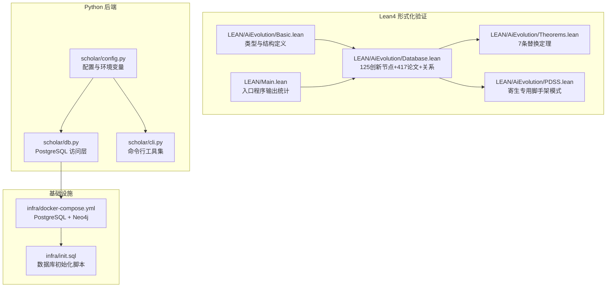
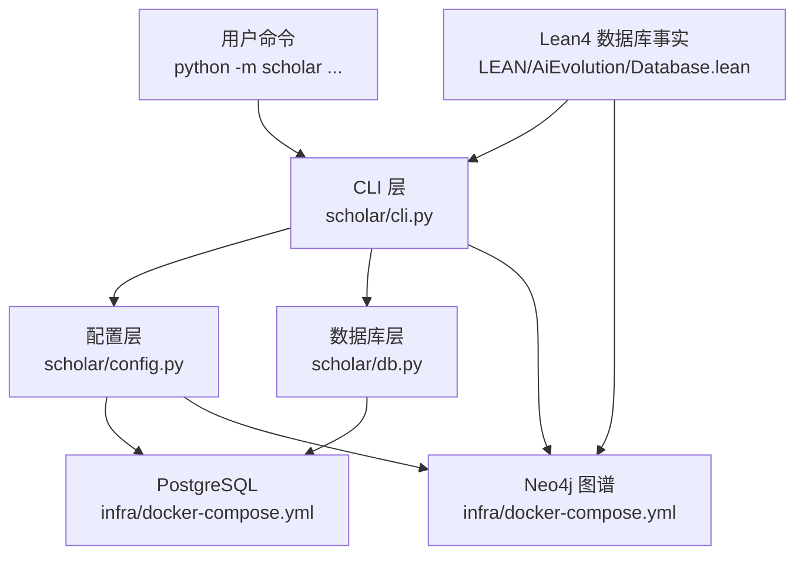
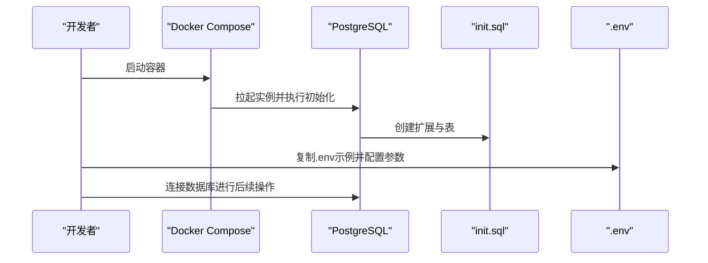
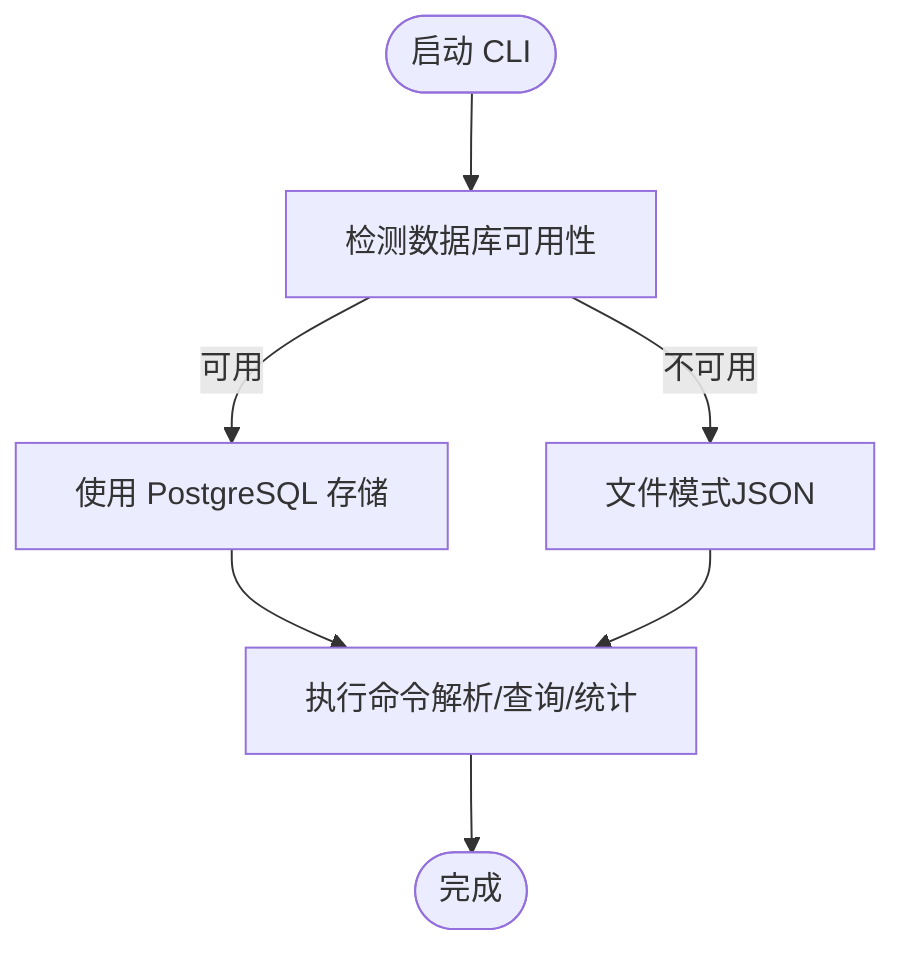
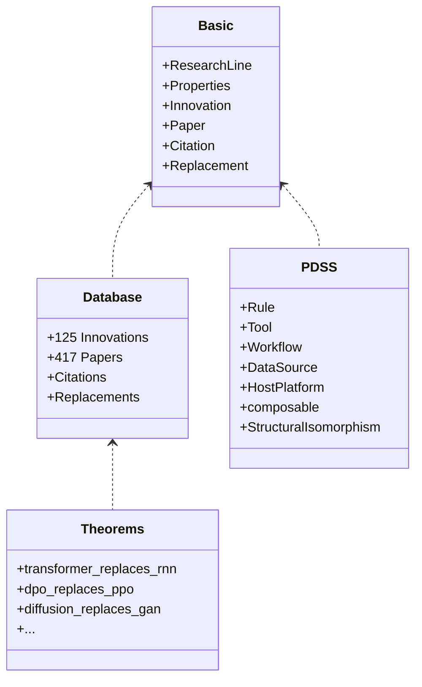
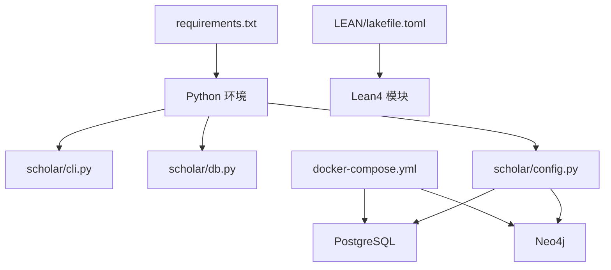

# 快速开始

<cite>
**本文档引用的文件**
- [plugin/README.md](file://plugin/README.md)
- [startup.ps1](file://startup.ps1)
- [infra/docker-compose.yml](file://infra/docker-compose.yml)
- [infra/init.sql](file://infra/init.sql)
- [requirements.txt](file://requirements.txt)
- [scholar/config.py](file://scholar/config.py)
- [scholar/db.py](file://scholar/db.py)
- [scholar/cli.py](file://scholar/cli.py)
- [LEAN/README.md](file://LEAN/README.md)
- [LEAN/lakefile.toml](file://LEAN/lakefile.toml)
- [LEAN/Main.lean](file://LEAN/Main.lean)
- [LEAN/AiEvolution.lean](file://LEAN/AiEvolution.lean)
- [LEAN/AiEvolution/Basic.lean](file://LEAN/AiEvolution/Basic.lean)
- [LEAN/AiEvolution/Database.lean](file://LEAN/AiEvolution/Database.lean)
- [LEAN/AiEvolution/Theorems.lean](file://LEAN/AiEvolution/Theorems.lean)
- [LEAN/AiEvolution/PDSS.lean](file://LEAN/AiEvolution/PDSS.lean)
</cite>

## 目录
1. [简介](#简介)
2. [项目结构](#项目结构)
3. [核心组件](#核心组件)
4. [架构总览](#架构总览)
5. [详细组件分析](#详细组件分析)
6. [依赖关系分析](#依赖关系分析)
7. [性能考虑](#性能考虑)
8. [故障排除指南](#故障排除指南)
9. [结论](#结论)
10. [附录](#附录)

## 简介
本指南面向首次接触本项目的用户，目标是在最短时间内完成环境搭建、依赖安装、数据库初始化与容器部署，并成功运行基础功能。内容覆盖：
- Lean4 开发环境配置
- Python 后端环境准备
- 数据库初始化与 Docker 容器部署
- 常见问题与解决方案
- 首次使用示例与验证步骤

## 项目结构
本项目由三个主要部分组成：
- Lean4 形式化验证系统：位于 LEAN/ 目录，包含类型定义、数据库事实、定理证明与 PDSS 模块。
- Python 后端与 CLI：位于 scholar/ 目录，提供论文解析、数据库访问、Neo4j 图谱构建与命令行工具。
- 基础设施与数据库初始化：位于 infra/ 目录，包含 Docker Compose 编排与初始化 SQL。

**图表来源**
- [LEAN/AiEvolution/Basic.lean:1-65](file://LEAN/AiEvolution/Basic.lean#L1-L65)
- [LEAN/AiEvolution/Database.lean:1-756](file://LEAN/AiEvolution/Database.lean#L1-L756)
- [LEAN/AiEvolution/Theorems.lean:1-130](file://LEAN/AiEvolution/Theorems.lean#L1-L130)
- [LEAN/AiEvolution/PDSS.lean:1-239](file://LEAN/AiEvolution/PDSS.lean#L1-L239)
- [LEAN/Main.lean:1-21](file://LEAN/Main.lean#L1-L21)
- [scholar/config.py:1-119](file://scholar/config.py#L1-L119)
- [scholar/db.py:1-276](file://scholar/db.py#L1-L276)
- [scholar/cli.py:1-800](file://scholar/cli.py#L1-L800)
- [infra/docker-compose.yml:1-44](file://infra/docker-compose.yml#L1-L44)
- [infra/init.sql:1-131](file://infra/init.sql#L1-L131)

**章节来源**
- [plugin/README.md:1-79](file://plugin/README.md#L1-L79)
- [LEAN/README.md:1-1](file://LEAN/README.md#L1-L1)
- [LEAN/lakefile.toml:1-11](file://LEAN/lakefile.toml#L1-L11)

## 核心组件
- Lean4 类型与结构：定义研究线、创新属性、论文与引用关系等核心数据模型。
- Lean4 数据库事实：内置 125 个创新节点、417 篇论文及替换关系，作为形式化验证的数据源。
- Lean4 定理：7 条关于“替换”的严格定理，证明新方法在至少两个轴上优于旧方法。
- Lean4 PDSS：形式化“寄生专用脚手架”模式，定义规则、工作流、工具、数据源与宿主平台五元组。
- Python 配置：加载 .env，管理目录结构、数据库连接、嵌入模型与 LaTeX 编译等。
- Python 数据库层：封装 psycopg2，提供文件回退模式；支持论文增删改查与统计。
- Python CLI：提供扫描、解析、查询、统计、图谱构建等命令。
- Docker 编排：一键启动 PostgreSQL（pgvector）与 Neo4j，健康检查与初始化。

**章节来源**
- [LEAN/AiEvolution/Basic.lean:1-65](file://LEAN/AiEvolution/Basic.lean#L1-L65)
- [LEAN/AiEvolution/Database.lean:1-756](file://LEAN/AiEvolution/Database.lean#L1-L756)
- [LEAN/AiEvolution/Theorems.lean:1-130](file://LEAN/AiEvolution/Theorems.lean#L1-L130)
- [LEAN/AiEvolution/PDSS.lean:1-239](file://LEAN/AiEvolution/PDSS.lean#L1-L239)
- [scholar/config.py:1-119](file://scholar/config.py#L1-L119)
- [scholar/db.py:1-276](file://scholar/db.py#L1-L276)
- [scholar/cli.py:1-800](file://scholar/cli.py#L1-L800)
- [infra/docker-compose.yml:1-44](file://infra/docker-compose.yml#L1-L44)

## 架构总览
下图展示了从用户命令到数据库与图谱的端到端流程，以及 Lean4 作为权威事实源的角色。

**图表来源**
- [scholar/cli.py:1-800](file://scholar/cli.py#L1-L800)
- [scholar/config.py:1-119](file://scholar/config.py#L1-L119)
- [scholar/db.py:1-276](file://scholar/db.py#L1-L276)
- [infra/docker-compose.yml:1-44](file://infra/docker-compose.yml#L1-L44)
- [LEAN/AiEvolution/Database.lean:1-756](file://LEAN/AiEvolution/Database.lean#L1-L756)

## 详细组件分析

### 环境与依赖准备
- Python 环境
  - 安装 Python 3.10+，建议使用虚拟环境隔离依赖。
  - 安装依赖：pip install -r requirements.txt。
- Docker 环境
  - 安装 Docker Desktop，确保 docker info 可用。
- Lean4 环境
  - 安装 Lean4 工具链（lake）与 Lean 包管理器。
  - 在 LEAN/ 目录执行 lake build 以编译 Lean4 模块。

**章节来源**
- [startup.ps1:14-38](file://startup.ps1#L14-L38)
- [requirements.txt:1-14](file://requirements.txt#L1-L14)
- [LEAN/lakefile.toml:1-11](file://LEAN/lakefile.toml#L1-L11)

### 数据库初始化与容器部署
- 使用 Docker Compose 启动服务
  - 进入 infra/ 目录，执行 docker compose up -d。
  - 容器健康检查：PostgreSQL（pgvector）与 Neo4j。
- 初始化数据库
  - PostgreSQL 启动后自动执行 init.sql，创建扩展与表结构。
  - 若需要手动初始化，可进入容器执行 init.sql。
- 环境变量与连接
  - .env 文件用于配置数据库与嵌入模型参数，启动脚本会自动复制示例文件。

**图表来源**
- [startup.ps1:58-91](file://startup.ps1#L58-L91)
- [infra/docker-compose.yml:1-44](file://infra/docker-compose.yml#L1-L44)
- [infra/init.sql:1-131](file://infra/init.sql#L1-L131)

**章节来源**
- [startup.ps1:58-104](file://startup.ps1#L58-L104)
- [infra/docker-compose.yml:1-44](file://infra/docker-compose.yml#L1-L44)
- [infra/init.sql:1-131](file://infra/init.sql#L1-L131)

### Python 后端与 CLI 使用
- 常用命令
  - 查看知识库状态：python -m scholar stats
  - 全文检索：python -m scholar search "关键词"
  - 新增论文：python -m scholar kb-update --query "主题" --max N
- 数据库可用性
  - CLI 会尝试连接 PostgreSQL；若不可用则回退到文件模式（仅解析 JSON）。
- 配置项
  - 数据目录、输出目录、数据库连接、Neo4j 连接、嵌入模型等通过 .env 注入。

**图表来源**
- [scholar/cli.py:32-41](file://scholar/cli.py#L32-L41)
- [scholar/db.py:24-44](file://scholar/db.py#L24-L44)

**章节来源**
- [scholar/cli.py:420-477](file://scholar/cli.py#L420-L477)
- [scholar/db.py:24-74](file://scholar/db.py#L24-L74)
- [scholar/config.py:44-66](file://scholar/config.py#L44-L66)

### Lean4 形式化验证
- 入口程序输出当前系统统计（创新节点与论文数量）。
- 数据库事实模块包含 125 个创新节点与 417 篇论文，以及替换关系。
- 定理模块证明若干“替换”定理，确保新方法在至少两个维度优于旧方法。
- PDSS 模块形式化“寄生专用脚手架”模式，定义五元组、协议兼容与组合性等。

**图表来源**
- [LEAN/AiEvolution/Basic.lean:1-65](file://LEAN/AiEvolution/Basic.lean#L1-L65)
- [LEAN/AiEvolution/Database.lean:1-756](file://LEAN/AiEvolution/Database.lean#L1-L756)
- [LEAN/AiEvolution/Theorems.lean:1-130](file://LEAN/AiEvolution/Theorems.lean#L1-L130)
- [LEAN/AiEvolution/PDSS.lean:1-239](file://LEAN/AiEvolution/PDSS.lean#L1-L239)

**章节来源**
- [LEAN/Main.lean:6-20](file://LEAN/Main.lean#L6-L20)
- [LEAN/AiEvolution.lean:1-8](file://LEAN/AiEvolution.lean#L1-L8)
- [LEAN/AiEvolution/Database.lean:172-756](file://LEAN/AiEvolution/Database.lean#L172-L756)
- [LEAN/AiEvolution/Theorems.lean:19-128](file://LEAN/AiEvolution/Theorems.lean#L19-L128)
- [LEAN/AiEvolution/PDSS.lean:93-187](file://LEAN/AiEvolution/PDSS.lean#L93-L187)

## 依赖关系分析
- Python 依赖
  - typer、rich、psycopg2-binary、neo4j、python-dotenv、PyMuPDF、mcp 等。
- Lean4 依赖
  - Lake 包管理器与 Lean 核心库；编译时依赖标准库与数学结构。
- 运行时依赖
  - Docker Compose 管理 PostgreSQL 与 Neo4j；.env 提供连接参数。

**图表来源**
- [requirements.txt:1-14](file://requirements.txt#L1-L14)
- [scholar/cli.py:1-30](file://scholar/cli.py#L1-L30)
- [scholar/db.py:1-20](file://scholar/db.py#L1-L20)
- [scholar/config.py:1-25](file://scholar/config.py#L1-L25)
- [infra/docker-compose.yml:1-44](file://infra/docker-compose.yml#L1-L44)
- [LEAN/lakefile.toml:1-11](file://LEAN/lakefile.toml#L1-L11)

**章节来源**
- [requirements.txt:1-14](file://requirements.txt#L1-L14)
- [infra/docker-compose.yml:1-44](file://infra/docker-compose.yml#L1-L44)
- [LEAN/lakefile.toml:1-11](file://LEAN/lakefile.toml#L1-L11)

## 性能考虑
- 数据库性能
  - PostgreSQL 使用 pgvector 扩展，适合向量检索；合理设置索引与连接池。
  - 批量解析论文时建议限制并发与分批处理。
- Neo4j 性能
  - 图谱构建涉及大量节点与边，建议在空闲时段执行，避免阻塞。
- 嵌入模型
  - 智谱 API 的请求需考虑超时与重试策略，必要时启用代理。
- Lean4 编译
  - 形式化验证模块较大，首次编译耗时较长；增量编译可提升迭代效率。

## 故障排除指南
- Docker 未安装或未运行
  - 现象：启动脚本报错退出。
  - 解决：安装 Docker Desktop 并确保 docker info 正常。
- Python 依赖缺失
  - 现象：启动脚本提示缺少依赖。
  - 解决：pip install -r requirements.txt。
- 数据库无法连接
  - 现象：CLI 报告数据库不可用，回退到文件模式。
  - 解决：确认 .env 中数据库参数正确，容器健康状态正常。
- PostgreSQL 初始化失败
  - 现象：容器启动但表未创建。
  - 解决：检查 init.sql 是否被挂载执行，或手动执行初始化。
- Neo4j 未就绪
  - 现象：图谱构建命令报错。
  - 解决：等待健康检查通过，或手动安装 neo4j Python 包。
- Lean4 编译错误
  - 现象：lake build 失败。
  - 解决：检查 Lean4 工具链版本与依赖，清理缓存后重试。

**章节来源**
- [startup.ps1:14-56](file://startup.ps1#L14-L56)
- [scholar/db.py:24-44](file://scholar/db.py#L24-L44)
- [infra/docker-compose.yml:15-39](file://infra/docker-compose.yml#L15-L39)
- [infra/init.sql:1-131](file://infra/init.sql#L1-L131)
- [scholar/cli.py:663-705](file://scholar/cli.py#L663-L705)

## 结论
通过本快速开始指南，您已完成 Lean4 与 Python 后端的环境准备、Docker 容器部署与数据库初始化，并掌握了基础的 CLI 使用方法。建议在熟悉后进一步探索 Lean4 的形式化验证能力与 Python 的图谱构建功能，逐步深入到论文解析、检索增强与智能工作流等高级特性。

## 附录
- 首次使用示例
  - 启动服务：在项目根目录执行 .\startup.ps1。
  - 查看知识库统计：python -m scholar stats。
  - 全文检索：python -m scholar search "Transformer"。
  - 新增论文：python -m scholar kb-update --query "机器学习" --max 5。
- 插件与 MCP
  - 本仓库提供 Python 后端与数据库，插件侧的技能、命令与规则请参考插件文档与安装说明。

**章节来源**
- [plugin/README.md:19-48](file://plugin/README.md#L19-L48)
- [startup.ps1:106-124](file://startup.ps1#L106-L124)
- [scholar/cli.py:420-477](file://scholar/cli.py#L420-L477)