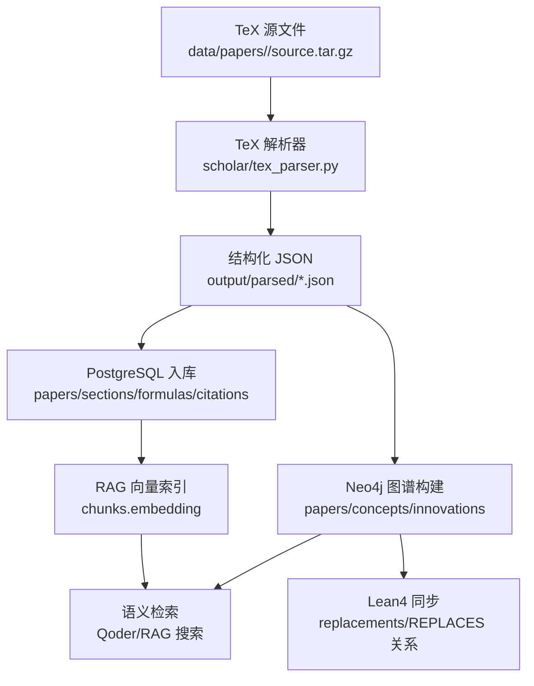
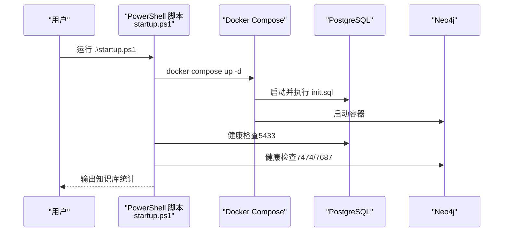
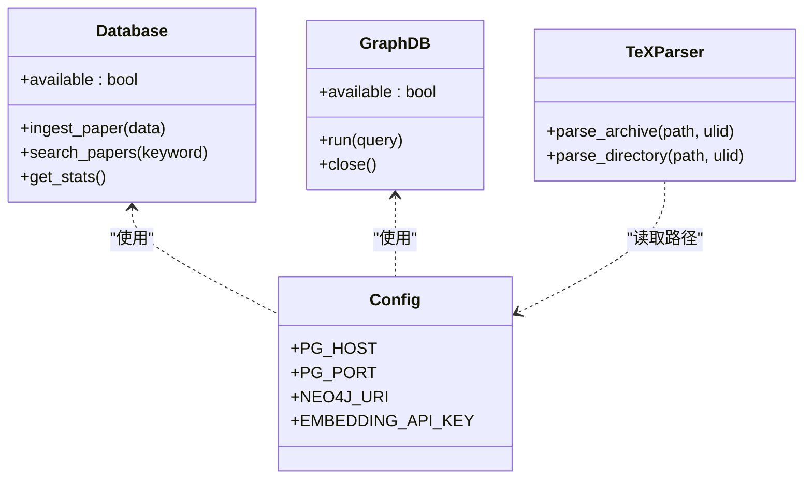
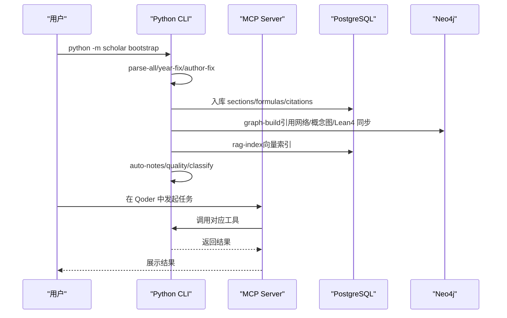
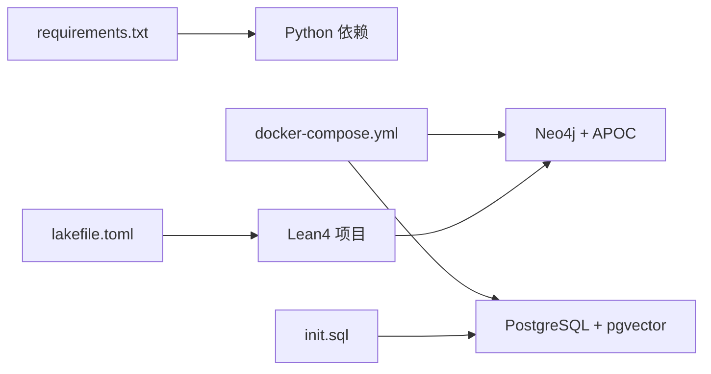

# 快速开始

<cite>
**本文档引用的文件**
- [README.md](file://README.md)
- [requirements.txt](file://requirements.txt)
- [startup.ps1](file://startup.ps1)
- [infra/docker-compose.yml](file://infra/docker-compose.yml)
- [infra/init.sql](file://infra/init.sql)
- [scholar/__main__.py](file://scholar/__main__.py)
- [scholar/cli.py](file://scholar/cli.py)
- [scholar/config.py](file://scholar/config.py)
- [scholar/db.py](file://scholar/db.py)
- [scholar/graph_db.py](file://scholar/graph_db.py)
- [scholar/tex_parser.py](file://scholar/tex_parser.py)
- [scholar_mcp/__main__.py](file://scholar_mcp/__main__.py)
- [scholar_mcp/server.py](file://scholar_mcp/server.py)
- [LEAN/lakefile.toml](file://LEAN/lakefile.toml)
- [LEAN/AiEvolution.lean](file://LEAN/AiEvolution.lean)
</cite>

## 目录
1. [简介](#简介)
2. [项目结构](#项目结构)
3. [核心组件](#核心组件)
4. [架构总览](#架构总览)
5. [详细组件分析](#详细组件分析)
6. [依赖分析](#依赖分析)
7. [性能考虑](#性能考虑)
8. [故障排除指南](#故障排除指南)
9. [结论](#结论)
10. [附录](#附录)

## 简介
本指南面向首次接触“Scholar Studio — AI 学术研究助手”的用户，目标是在最短时间内完成环境准备、数据库初始化与容器化部署，并通过第一个完整工作示例（从论文导入到知识图谱构建）验证系统可用性。文档同时兼顾新手与有经验开发者，提供分步命令、配置参数与常见问题排查。

## 项目结构
项目采用多语言协作架构：Python CLI 与 MCP 服务负责论文解析、数据库同步、RAG 索引与批处理；Neo4j 提供引用与概念图谱；PostgreSQL + pgvector 存储结构化元数据与向量索引；Lean4 支持形式化验证与创新节点同步；Qoder IDE 作为前端交互平台，通过 MCP Server 调用 CLI 工具。

```mermaid
graph TB
subgraph "前端"
Qoder["Qoder IDE"]
end
subgraph "后端服务"
MCP["Scholar MCP Server<br/>29 个工具"]
CLI["Python CLI<br/>17+ 命令"]
end
subgraph "数据层"
PG["PostgreSQL + pgvector<br/>papers/sections/formulas/citations/chunks"]
Neo4j["Neo4j<br/>papers/concepts/innovations/relations"]
end
subgraph "形式化层"
Lean["Lean4<br/>AiEvolution/Database.lean"]
end
subgraph "资源"
Papers["data/papers/<ULID>/<source.tar.gz,paper.pdf>"]
Output["output/<parsed|notes|drafts|bib|experiments>"]
end
Qoder --> MCP
MCP --> CLI
CLI --> PG
CLI --> Neo4j
Neo4j <- --> Lean
CLI --> Output
CLI --> Papers
```

图表来源
- [scholar_mcp/server.py:1-387](file://scholar_mcp/server.py#L1-L387)
- [scholar/cli.py:1-800](file://scholar/cli.py#L1-L800)
- [infra/docker-compose.yml:1-44](file://infra/docker-compose.yml#L1-L44)
- [infra/init.sql:1-131](file://infra/init.sql#L1-L131)
- [LEAN/AiEvolution.lean:1-7](file://LEAN/AiEvolution.lean#L1-L7)

章节来源
- [README.md:300-326](file://README.md#L300-L326)

## 核心组件
- Python CLI（scholar）：提供论文扫描、解析、入库、全文/语义搜索、图谱构建、RAG 索引、批处理等命令。
- MCP Server（scholar_mcp）：将 CLI 封装为 MCP 工具，供 Qoder IDE 直接调用。
- 数据库层：PostgreSQL + pgvector（结构化 + 向量检索），Neo4j（引用与概念图谱）。
- 形式化层：Lean4 项目，动态加载创新节点与替换关系，同步至 Neo4j。
- 启动脚本：一键启动 Docker 容器并进行健康检查与状态统计。

章节来源
- [scholar/__main__.py:1-8](file://scholar/__main__.py#L1-L8)
- [scholar_mcp/__main__.py:1-5](file://scholar_mcp/__main__.py#L1-L5)
- [scholar/config.py:1-62](file://scholar/config.py#L1-L62)
- [infra/docker-compose.yml:1-44](file://infra/docker-compose.yml#L1-L44)

## 架构总览
下图展示了从 TeX 源码到知识库与图谱的端到端数据流：



图表来源
- [scholar/tex_parser.py:1-800](file://scholar/tex_parser.py#L1-L800)
- [infra/init.sql:1-131](file://infra/init.sql#L1-L131)
- [scholar/graph_db.py:1-922](file://scholar/graph_db.py#L1-L922)
- [scholar/db.py:1-270](file://scholar/db.py#L1-L270)
- [LEAN/AiEvolution.lean:1-7](file://LEAN/AiEvolution.lean#L1-L7)

## 详细组件分析

### 环境准备与安装
- Python 环境
  - 创建并激活虚拟环境（推荐）
  - 安装依赖：typer、rich、psycopg2-binary、neo4j、python-dotenv、PyMuPDF、mcp
- Docker Desktop（WSL2 后端）
  - Windows 用户如使用 VMware，需确保 WSL2 版本一致，必要时调整默认版本
- Qoder IDE
  - 下载最新版，自动读取 .qoder/mcp.json 启动 MCP Server
- Git
  - 用于克隆仓库与版本管理

章节来源
- [README.md:11-21](file://README.md#L11-L21)
- [requirements.txt:1-9](file://requirements.txt#L1-L9)

### Lean4 开发环境
- 项目使用 Lake（Lean 包管理器）构建
- 顶层入口模块导入基础库、数据库与定理模块
- 可通过 lake build 编译 Lean4 项目，以便同步形式化验证信息到 Neo4j

章节来源
- [LEAN/lakefile.toml:1-11](file://LEAN/lakefile.toml#L1-L11)
- [LEAN/AiEvolution.lean:1-7](file://LEAN/AiEvolution.lean#L1-L7)

### 数据库初始化与容器化部署
- 使用 Docker Compose 启动 PostgreSQL（pgvector）与 Neo4j
- PostgreSQL 映射端口 5433，避免与本地默认 5432 冲突
- 初始化 SQL 脚本创建核心表与索引，支持向量维度扩展
- 启动脚本自动等待服务健康并显示知识库统计



图表来源
- [startup.ps1:1-65](file://startup.ps1#L1-L65)
- [infra/docker-compose.yml:1-44](file://infra/docker-compose.yml#L1-L44)
- [infra/init.sql:1-131](file://infra/init.sql#L1-L131)

章节来源
- [README.md:67-86](file://README.md#L67-L86)
- [startup.ps1:1-65](file://startup.ps1#L1-L65)
- [infra/docker-compose.yml:1-44](file://infra/docker-compose.yml#L1-L44)
- [infra/init.sql:1-131](file://infra/init.sql#L1-L131)

### Python CLI 与 MCP Server
- CLI 提供论文扫描、解析、入库、搜索、图谱构建、RAG 索引、批处理等命令
- MCP Server 将 CLI 封装为 29 个工具，供 Qoder IDE 直接调用
- 两者共享配置（数据库、嵌入 API、Lean4 路径）



图表来源
- [scholar/db.py:24-270](file://scholar/db.py#L24-L270)
- [scholar/graph_db.py:32-70](file://scholar/graph_db.py#L32-L70)
- [scholar/tex_parser.py:23-286](file://scholar/tex_parser.py#L23-L286)
- [scholar/config.py:1-62](file://scholar/config.py#L1-L62)

章节来源
- [scholar/cli.py:1-800](file://scholar/cli.py#L1-L800)
- [scholar_mcp/server.py:1-387](file://scholar_mcp/server.py#L1-L387)
- [scholar/config.py:1-62](file://scholar/config.py#L1-L62)

### 第一个完整工作示例：从论文导入到知识图谱构建
- 步骤 1：克隆仓库并安装 Python 依赖
- 步骤 2：创建 .env 并配置嵌入 API Key（可选，无则全文搜索仍可用）
- 步骤 3：启动数据库容器并等待健康检查
- 步骤 4：全量初始化（bootstrap，约 40 分钟）
- 步骤 5：在 Qoder 中打开项目，后台自动启动 MCP Server
- 步骤 6：验证知识库状态，确认各指标正常
- 步骤 7：执行示例查询（调研、精读、写作等）



图表来源
- [README.md:87-128](file://README.md#L87-L128)
- [scholar/cli.py:1-800](file://scholar/cli.py#L1-L800)
- [scholar_mcp/server.py:1-387](file://scholar_mcp/server.py#L1-L387)

章节来源
- [README.md:22-128](file://README.md#L22-L128)

## 依赖分析
- Python 依赖通过 requirements.txt 管理，核心包括 CLI 框架、数据库驱动、嵌入客户端、PDF 处理与 MCP 协议
- Docker Compose 定义两个服务：PostgreSQL（pgvector）与 Neo4j（含 APOC 插件）
- 初始化 SQL 脚本定义核心表结构与索引，支持向量维度扩展
- Lean4 项目通过 Lake 构建，入口模块导入基础库与数据库模块



图表来源
- [requirements.txt:1-9](file://requirements.txt#L1-L9)
- [infra/docker-compose.yml:1-44](file://infra/docker-compose.yml#L1-L44)
- [infra/init.sql:1-131](file://infra/init.sql#L1-L131)
- [LEAN/lakefile.toml:1-11](file://LEAN/lakefile.toml#L1-L11)

章节来源
- [requirements.txt:1-9](file://requirements.txt#L1-L9)
- [infra/docker-compose.yml:1-44](file://infra/docker-compose.yml#L1-L44)
- [infra/init.sql:1-131](file://infra/init.sql#L1-L131)
- [LEAN/lakefile.toml:1-11](file://LEAN/lakefile.toml#L1-L11)

## 性能考虑
- 全量初始化耗时较长，建议在空闲时段执行；支持断点续传，重复运行会跳过已完成步骤
- RAG 向量索引依赖外部嵌入 API，建议提前准备好 API Key 以避免长时间等待
- PostgreSQL 与 Neo4j 的批量写入采用分批处理，减少内存压力
- 图谱构建涉及大规模节点与边，建议在专用硬件上运行，确保内存充足

## 故障排除指南
- Docker 容器启动失败
  - 检查 Docker Desktop 状态与端口占用情况
  - 如端口被占用，可在 docker-compose.yml 中修改映射
- PostgreSQL 连接超时
  - 默认端口为 5433，确保连接字符串与配置一致
- RAG 搜索无结果
  - 确认 .env 中存在有效 API Key
  - 确认 rag-index 已成功执行
  - 无 API Key 时会回退到全文搜索
- Bootstrap 中断恢复
  - 直接重新运行 bootstrap，已完成步骤会被跳过
  - 可按需强制重跑 parse-all、graph-build 或 rag-index
- Windows + VMware 冲突
  - 检查 WSL2 状态，必要时关闭并重启相关虚拟机后重试

章节来源
- [README.md:429-480](file://README.md#L429-L480)

## 结论
通过本快速开始指南，您可以在较短时间内完成环境准备、数据库初始化与容器化部署，并借助第一个完整工作示例验证系统功能。后续可根据自身需求扩展论文库、定制 Agent 规则与技能，或引入更多形式化验证节点。

## 附录
- 常用命令速查
  - 启动数据库：.\startup.ps1
  - 全量初始化：python -m scholar bootstrap
  - 查看状态：python -m scholar stats
  - 全文搜索：python -m scholar search "<关键词>"
  - 语义搜索：python -m scholar rag-search "<问题>"
  - 图谱构建：python -m scholar graph-build
  - 导出 BibTeX：python -m scholar export-bib
- 配置文件
  - .env：放置嵌入 API Key 等敏感配置
  - .qoder/mcp.json：MCP Server 配置（由 Qoder 自动读取）
- 输出目录
  - output/parsed：解析后的 JSON
  - output/notes：阅读笔记与质量评分
  - output/drafts：综述与报告草稿
  - output/bib：BibTeX 文件
  - output/experiments：实验代码复现

章节来源
- [README.md:265-296](file://README.md#L265-L296)
- [README.md:300-326](file://README.md#L300-L326)
- [README.md:407-426](file://README.md#L407-L426)