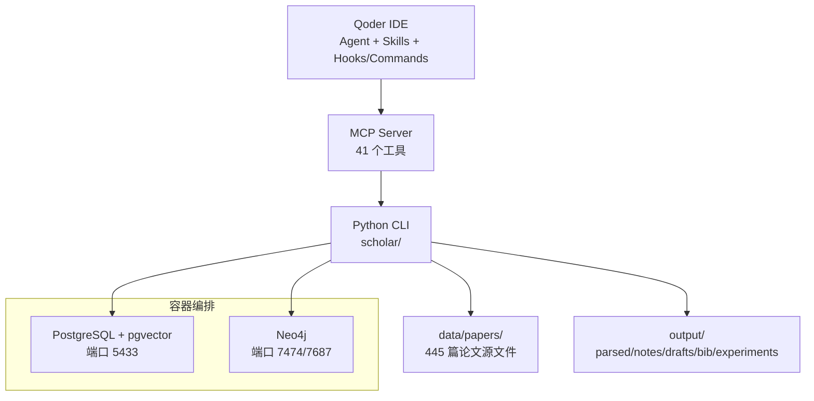

# 快速开始

<cite>
**本文档引用的文件**
- [README.md](file://README.md)
- [requirements.txt](file://requirements.txt)
- [infra/docker-compose.yml](file://infra/docker-compose.yml)
- [startup.ps1](file://startup.ps1)
- [plugin/.qoder-plugin/plugin.json](file://plugin/.qoder-plugin/plugin.json)
- [plugin/mcp.json](file://plugin/mcp.json)
- [plugin/commands/stats.md](file://plugin/commands/stats.md)
- [plugin/commands/find.md](file://plugin/commands/find.md)
- [plugin/commands/paper.md](file://plugin/commands/paper.md)
- [plugin/commands/health.md](file://plugin/commands/health.md)
- [plugin/skills/research-survey/SKILL.md](file://plugin/skills/research-survey/SKILL.md)
- [plugin/skills/paper-deep-dive/SKILL.md](file://plugin/skills/paper-deep-dive/SKILL.md)
- [plugin/skills/writing-pipeline/SKILL.md](file://plugin/skills/writing-pipeline/SKILL.md)
- [plugin/skills/reproduce-paper/SKILL.md](file://plugin/skills/reproduce-paper/SKILL.md)
- [plugin/skills/kb-management/SKILL.md](file://plugin/skills/kb-management/SKILL.md)
</cite>

## 目录
1. [简介](#简介)
2. [系统要求](#系统要求)
3. [环境准备](#环境准备)
4. [依赖安装](#依赖安装)
5. [数据库配置](#数据库配置)
6. [全量初始化（Bootstrap）](#全量初始化bootstrap)
7. [在 Qoder 中开始使用](#在-qoder-中开始使用)
8. [一键开始（Deeplinks）](#一键开始deeplinks)
9. [常见问题排查](#常见问题排查)
10. [架构总览](#架构总览)
11. [结语](#结语)

## 简介
本指南面向首次部署“Scholar Studio — AI 学术研究助手”的用户，目标是在 5 分钟内完成系统搭建与首次使用。内容覆盖系统要求、环境准备、依赖安装、数据库配置、全量初始化（Bootstrap）流程详解，并提供 Windows 用户的特殊注意事项、常见问题解决方案以及一键开始的 Deeplinks 示例。

## 系统要求
- Docker Desktop 4.x+：用于启动 PostgreSQL（带 pgvector）与 Neo4j 容器
- Python 3.10+：运行 CLI 工具集与 MCP Server
- Qoder IDE：Agent + Skills + MCP 集成体验
- Git：克隆仓库与版本管理

Windows 用户特别注意：若同时使用 VMware，Docker Desktop 的 WSL2 后端可能冲突。请在启动 Docker 前确保 WSL2 已启用。

**章节来源**
- [README.md:11-21](file://README.md#L11-L21)

## 环境准备
- 克隆仓库并进入项目目录
- 推荐创建并激活 Python 虚拟环境
- 安装 Python 依赖（requirements.txt）

**章节来源**
- [README.md:22-40](file://README.md#L22-L40)
- [requirements.txt:1-9](file://requirements.txt#L1-L9)

## 依赖安装
- 创建虚拟环境（推荐）
- 激活虚拟环境（Windows 与 Linux/Mac命令不同）
- 安装 requirements.txt 中的依赖

依赖清单要点：
- typer + rich：CLI 框架与终端美化
- psycopg2-binary：PostgreSQL 连接
- neo4j：Neo4j 图数据库驱动
- python-dotenv：环境变量加载
- PyMuPDF：PDF 论文处理
- mcp：MCP Server 协议（Qoder 集成）

**章节来源**
- [README.md:29-52](file://README.md#L29-L52)
- [requirements.txt:1-9](file://requirements.txt#L1-L9)

## 数据库配置
- 使用 Docker Compose 启动 PostgreSQL（pgvector）与 Neo4j
- 端口映射：
  - PostgreSQL：宿主 5433 → 容器 5432
  - Neo4j：浏览器端口 7474、Bolt 端口 7687
- 默认凭据：
  - PostgreSQL：scholar / scholar2024
  - Neo4j：neo4j / scholar2024
- 初始化脚本：容器启动时自动执行 init.sql（建表与索引）

**章节来源**
- [README.md:67-86](file://README.md#L67-L86)
- [infra/docker-compose.yml:1-44](file://infra/docker-compose.yml#L1-L44)

## 全量初始化（Bootstrap）
首次部署时，执行 `python -m scholar bootstrap` 完成 9 步全量初始化，耗时约 40 分钟。该命令具备断点续传能力：若中途中断，重新运行会自动跳过已完成步骤。

- 步骤 1：parse-all（TeX → JSON，约 5 分钟）
- 步骤 2：year-fix（补全缺失年份，交叉引用 Lean4，约 1 分钟）
- 步骤 3：author-fix（补全缺失作者，约 1 分钟）
- 步骤 4：graph-build（Neo4j 图谱，25K 节点 + 38K 边，约 3 分钟）
- 步骤 5：PG 同步（写入 sections/formulas/citations，约 2 分钟）
- 步骤 6：rag-index（向量索引 45K chunks，需 API Key，约 30 分钟）
- 步骤 7：auto-notes（自动生成 439 份阅读笔记，约 3 分钟）
- 步骤 8：quality-score（423 篇论文 7 维度评分，约 2 分钟）
- 步骤 9：classify（417 篇论文领域分类，约 1 分钟）

断点续传与强制重跑：
- 直接重新运行 `python -m scholar bootstrap`
- 如需强制重跑某一步，可单独执行对应命令（如 parse-all、graph-build、rag-index）

**章节来源**
- [README.md:87-108](file://README.md#L87-L108)

## 在 Qoder 中开始使用
- 用 Qoder 打开项目目录
- Qoder 自动读取 `.qoder/mcp.json`，后台启动 Scholar MCP Server（41 个工具）
- 在对话框中直接开始使用

常用验证命令：
- 查看知识库状态：`python -m scholar stats`
- 或在 Qoder 对话框输入“查看知识库状态”

期望输出（示例格式）：
- 论文数、章节数、公式数、引用数、RAG 片段数、笔记数、质量评分分布、分类数

**章节来源**
- [README.md:109-142](file://README.md#L109-L142)

## 一键开始（Deeplinks）
点击以下链接可直接唤起 Qoder 并开始相应任务：

- 调研 Transformer 的注意力机制演进
- 精读 Attention Is All You Need，并输出结构化分析
- 写一篇 Attention 方向的论文
- 复现 LoRA 论文的实验
- 分析 RLHF 和 DPO 方向的研究空白
- 入门 State Space Model
- 推荐接下来该读什么
- 维护知识库

**章节来源**
- [README.md:166-180](file://README.md#L166-L180)

## 常见问题排查
- Docker 容器启动失败
  - 检查 Docker 是否在运行
  - 检查端口 5433、7474 是否被占用
  - 若端口被占用，可在 docker-compose.yml 中修改端口映射
- PostgreSQL 连接超时
  - 端口为 5433（避免与本地 PostgreSQL 冲突）
  - 连接串中请使用 5433 端口
- RAG 搜索无结果
  - 确认 `.env` 中存在有效的 API Key
  - 确认 `rag-index` 已成功执行（45K chunks）
  - 无 API Key 时，`rag-search` 会自动回退到全文搜索
- Bootstrap 中断恢复
  - 直接重新运行 `python -m scholar bootstrap`
  - 如需强制重跑某一步，可单独执行对应命令
- Windows + VMware 冲突
  - 检查 WSL 状态
  - 如 Docker Desktop 的分发版未运行，先关闭再重启 Docker Desktop

**章节来源**
- [README.md:460-511](file://README.md#L460-L511)

## 架构总览
下图展示了从 Qoder 到数据库与数据层的整体架构与数据流。

**图表来源**
- [README.md:217-262](file://README.md#L217-L262)
- [infra/docker-compose.yml:1-44](file://infra/docker-compose.yml#L1-L44)
- [plugin/mcp.json:1-16](file://plugin/mcp.json#L1-L16)

## 结语
至此，您已在 5 分钟内完成系统搭建与首次使用。建议先运行一次 Bootstrap，随后在 Qoder 中通过“查看知识库状态”或“调研/精读/写作/复现/空白/入门/推荐/维护”等技能与快捷指令探索功能。遇到问题可参考常见问题排查部分，或使用一键 Deeplinks 快速进入特定工作流。