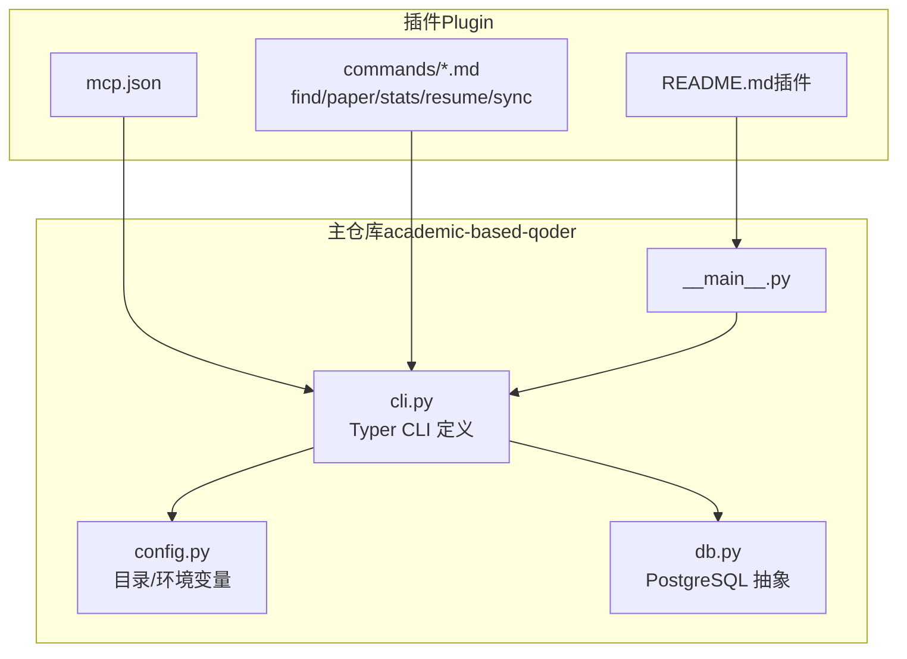
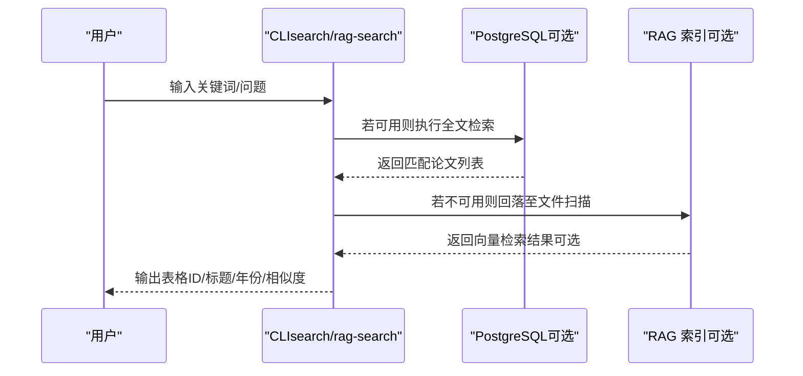
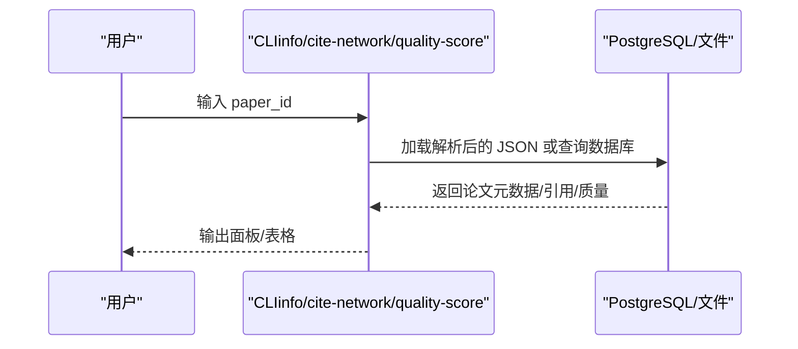
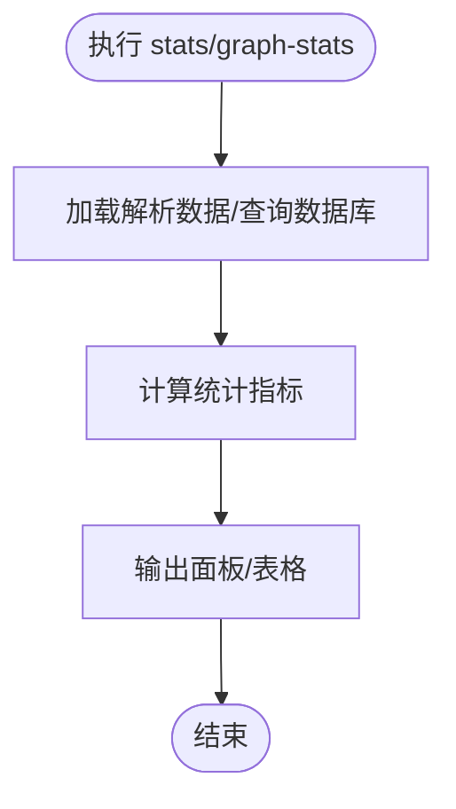
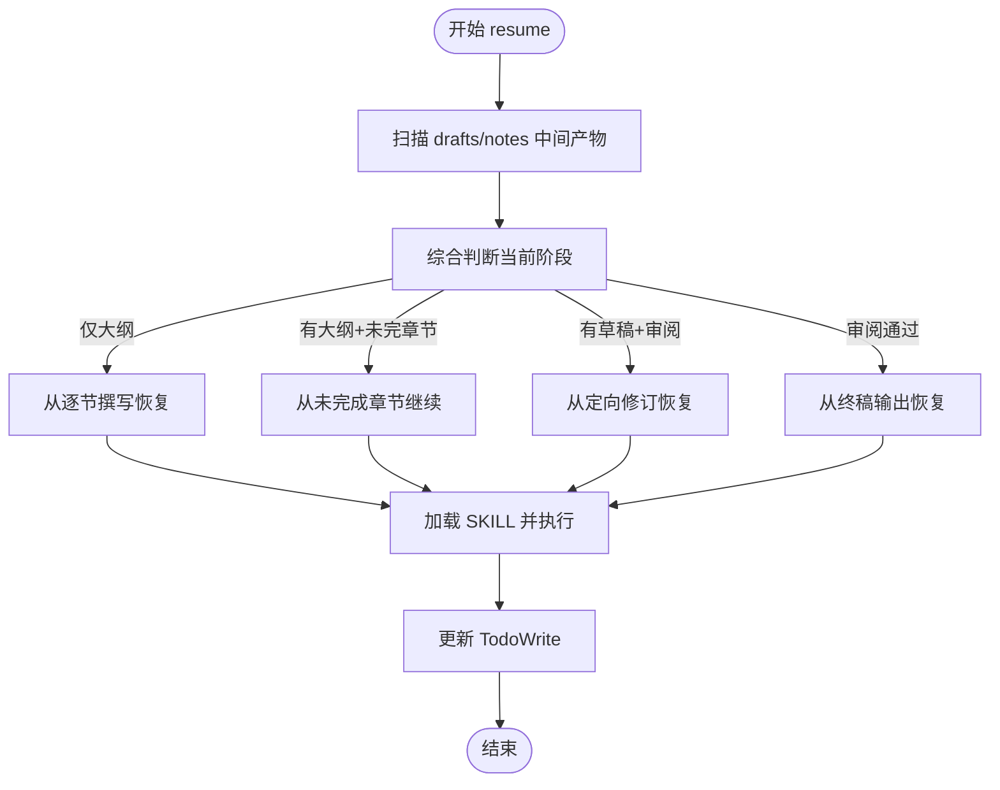
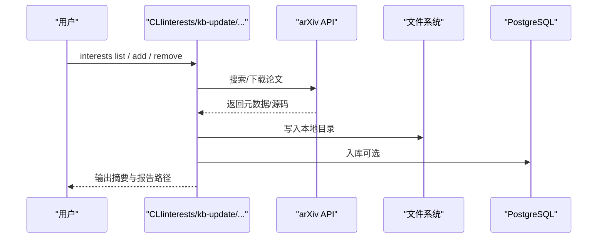
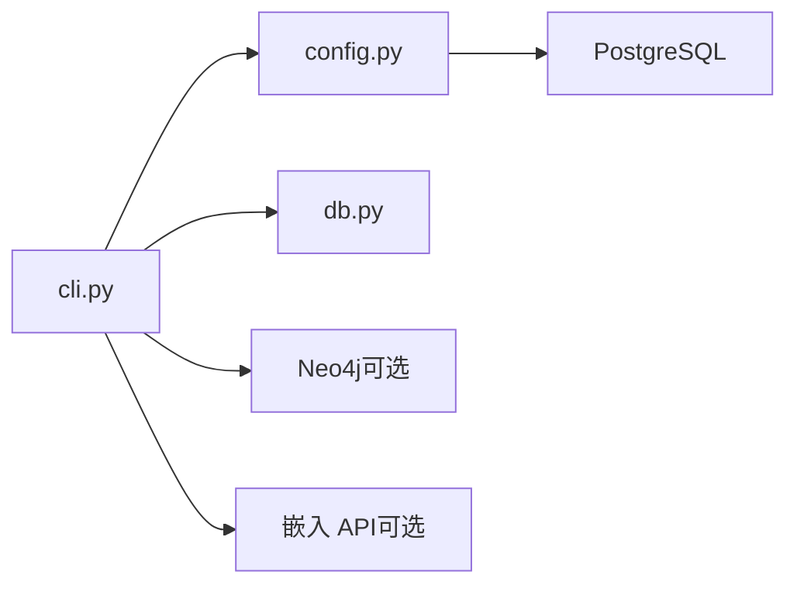

# 命令系统

<cite>
**本文档引用的文件**
- [cli.py](file://scholar/cli.py)
- [__main__.py](file://scholar/__main__.py)
- [config.py](file://scholar/config.py)
- [db.py](file://scholar/db.py)
- [find.md](file://plugin/commands/find.md)
- [paper.md](file://plugin/commands/paper.md)
- [stats.md](file://plugin/commands/stats.md)
- [resume.md](file://plugin/commands/resume.md)
- [sync.md](file://plugin/commands/sync.md)
- [README.md（插件）](file://plugin/README.md)
- [CONNECTORS.md](file://plugin/CONNECTORS.md)
- [mcp.json](file://plugin/mcp.json)
</cite>

## 目录
1. [简介](#简介)
2. [项目结构](#项目结构)
3. [核心组件](#核心组件)
4. [架构总览](#架构总览)
5. [详细组件分析](#详细组件分析)
6. [依赖分析](#依赖分析)
7. [性能考虑](#性能考虑)
8. [故障排查指南](#故障排查指南)
9. [结论](#结论)
10. [附录](#附录)

## 简介
本文件面向“命令系统”的使用者与维护者，系统性梳理并说明学术研究工具链中的 CLI 命令体系，重点覆盖 find、paper、stats、resume、sync 等核心命令的使用方法、参数选项、返回值与适用场景，并给出组合使用、批量操作与自动化脚本建议。同时，文档还提供扩展机制、自定义命令开发与集成指南，以及错误处理、日志记录与性能监控要点。

## 项目结构
命令系统由两部分组成：
- 主仓库（academic-based-qoder）：提供 Python 后端、数据库与 CLI 命令实现，负责解析、检索、索引、图谱构建、RAG、实验运行等。
- 插件（Scholar Studio Plugin）：提供技能（Skills）、规则（Rules）、钩子（Hooks）、MCP 配置与若干 Markdown 命令说明，作为“大脑”指导 AI 如何调用主仓库的命令。

图表来源
- [__main__.py:1-8](file://scholar/__main__.py#L1-L8)
- [cli.py:23-29](file://scholar/cli.py#L23-L29)
- [config.py:20-42](file://scholar/config.py#L20-L42)
- [db.py:24-44](file://scholar/db.py#L24-L44)
- [README.md（插件）:1-79](file://plugin/README.md#L1-L79)
- [mcp.json:1-16](file://plugin/mcp.json#L1-L16)
- [find.md:1-10](file://plugin/commands/find.md#L1-L10)
- [paper.md:1-11](file://plugin/commands/paper.md#L1-L11)
- [stats.md:1-10](file://plugin/commands/stats.md#L1-L10)
- [resume.md:1-22](file://plugin/commands/resume.md#L1-L22)
- [sync.md:1-11](file://plugin/commands/sync.md#L1-L11)

章节来源
- [README.md（插件）:1-79](file://plugin/README.md#L1-L79)
- [__main__.py:1-8](file://scholar/__main__.py#L1-L8)
- [cli.py:23-29](file://scholar/cli.py#L23-L29)
- [config.py:20-42](file://scholar/config.py#L20-L42)
- [db.py:24-44](file://scholar/db.py#L24-L44)

## 核心组件
- Typer CLI 应用入口：通过 Typer 定义命令组与参数，统一调度各类功能（解析、搜索、统计、图谱、RAG、实验等）。
- 配置模块：集中管理项目根目录、输出目录、数据库连接、嵌入模型、LaTeX 编译器等环境变量与默认值。
- 数据库抽象：封装 PostgreSQL 访问，提供“文件模式”降级能力；提供论文、章节、公式、引用等数据的增删改查与统计接口。
- MCP 集成：通过 mcp.json 将主仓库的 MCP 服务器暴露给插件，使 AI 可以调用命令系统。

章节来源
- [cli.py:23-29](file://scholar/cli.py#L23-L29)
- [config.py:20-66](file://scholar/config.py#L20-L66)
- [db.py:24-44](file://scholar/db.py#L24-L44)
- [mcp.json:1-16](file://plugin/mcp.json#L1-L16)

## 架构总览
命令系统采用“插件指导 + 主仓库执行”的分层架构。插件侧提供自然语言到命令的映射与工作流编排，主仓库侧提供具体的数据与算法实现。

```mermaid
graph TB
subgraph "外部交互"
USER["用户/AI Agent"]
MCP_CLIENT["MCP 客户端插件"]
end
subgraph "插件层"
SKILLS["Skills原子/工作流"]
RULES["Rules角色定义"]
HOOKS["Hooks安全/通知"]
MCP_CFG["mcp.jsonMCP 服务器配置"]
end
subgraph "主仓库层"
CLI_ENTRY["__main__.pyCLI 入口"]
CLI_APP["cli.py命令实现"]
CFG_MOD["config.py配置"]
DB_LAYER["db.py数据库抽象"]
DB_POSTGRES["PostgreSQL"]
DB_NEO4J["Neo4j可选"]
EMB_API["嵌入 API可选"]
end
USER --> MCP_CLIENT
MCP_CLIENT --> MCP_CFG
MCP_CLIENT --> CLI_ENTRY
CLI_ENTRY --> CLI_APP
CLI_APP --> CFG_MOD
CLI_APP --> DB_LAYER
DB_LAYER --> DB_POSTGRES
CLI_APP --> DB_NEO4J
CLI_APP --> EMB_API
```

图表来源
- [README.md（插件）:5-17](file://plugin/README.md#L5-L17)
- [mcp.json:1-16](file://plugin/mcp.json#L1-L16)
- [__main__.py:1-8](file://scholar/__main__.py#L1-L8)
- [cli.py:23-29](file://scholar/cli.py#L23-L29)
- [config.py:44-66](file://scholar/config.py#L44-L66)
- [db.py:24-44](file://scholar/db.py#L24-L44)

## 详细组件分析

### find 命令族
- 功能概述：在知识库中进行“全文 + 语义”双通道检索，合并去重后按相关度排序展示结果。
- 使用场景：快速定位与主题相关的论文集合，支撑调研、综述与推荐。
- 命令与参数：
  - 全文搜索：python -m scholar search "<关键词>" [--limit N]
  - 语义搜索：python -m scholar rag-search "<问题/关键词>" [--hybrid] [--limit N]
- 返回值与输出：
  - 全文搜索：表格列出匹配论文的 ID、标题、年份。
  - 语义搜索：表格列出匹配论文的 ID、片段所属章节、内容片段与相似度。
- 组合使用建议：
  - 先用全文搜索筛选候选，再用混合语义搜索精炼高相关条目。
  - 与 classify、survey 等命令配合，形成“检索→分类→结构化输出”的闭环。
- 错误处理与提示：
  - 无结果时会提示“未找到”，并建议检查 RAG 索引是否构建。

图表来源
- [cli.py:311-370](file://scholar/cli.py#L311-L370)
- [cli.py:955-990](file://scholar/cli.py#L955-L990)
- [db.py:206-221](file://scholar/db.py#L206-L221)

章节来源
- [find.md:1-10](file://plugin/commands/find.md#L1-L10)
- [cli.py:311-370](file://scholar/cli.py#L311-L370)
- [cli.py:955-990](file://scholar/cli.py#L955-L990)
- [db.py:206-221](file://scholar/db.py#L206-L221)

### paper 命令族
- 功能概述：查看某篇论文的详细信息、引用关系与质量评分；支持从多种标识解析（ULID、arXiv ID、DOI、关键词）。
- 使用场景：单篇深度分析、质量评估、引用网络可视化。
- 命令与参数：
  - 基础信息：python -m scholar info <paper_id>
  - 引用关系：python -m scholar cite-network <paper_id>
  - 质量评分：python -m scholar quality-score <paper_id>
- 返回值与输出：
  - info：打印标题、作者、年份、会议、TeX 文件数、主文件名、摘要、章节、公式、引用等。
  - cite-network：打印前向/后向引用列表或全局统计。
  - quality-score：打印各维度得分与总分、等级。
- 组合使用建议：
  - 先 info 了解论文概况，再 cite-network 查看引用网络，最后 quality-score 给出客观评分。
- 错误处理与提示：
  - 若论文未解析，会提示先执行 parse。

图表来源
- [cli.py:242-306](file://scholar/cli.py#L242-L306)
- [cli.py:839-885](file://scholar/cli.py#L839-L885)
- [cli.py:1027-1073](file://scholar/cli.py#L1027-L1073)
- [db.py:248-276](file://scholar/db.py#L248-L276)

章节来源
- [paper.md:1-11](file://plugin/commands/paper.md#L1-L11)
- [cli.py:242-306](file://scholar/cli.py#L242-L306)
- [cli.py:839-885](file://scholar/cli.py#L839-L885)
- [cli.py:1027-1073](file://scholar/cli.py#L1027-L1073)
- [db.py:248-276](file://scholar/db.py#L248-L276)

### stats 命令族
- 功能概述：查看知识库状态（论文数量、图谱规模、RAG 覆盖率等）。
- 使用场景：定期盘点知识库健康度、评估数据治理效果。
- 命令与参数：
  - 基础统计：python -m scholar stats
  - 图谱统计：python -m scholar graph-stats
- 返回值与输出：
  - stats：打印论文总数、解析数、章节/公式/引用总量、数据库连通性、元数据覆盖率（年份/作者/摘要/会议）。
  - graph-stats：打印节点/边计数、解析/未解析引用计数、孤立节点、Top 引用/桥接论文。
- 组合使用建议：
  - 与 graph-build、rag-index 配合，观察指标变化以评估增量更新效果。

图表来源
- [cli.py:421-487](file://scholar/cli.py#L421-L487)
- [cli.py:711-791](file://scholar/cli.py#L711-L791)

章节来源
- [stats.md:1-10](file://plugin/commands/stats.md#L1-L10)
- [cli.py:421-487](file://scholar/cli.py#L421-L487)
- [cli.py:711-791](file://scholar/cli.py#L711-L791)

### resume 命令族
- 功能概述：恢复中断的学术写作/调研流程，基于中间产物与断点智能判断下一步。
- 使用场景：多阶段写作（大纲→逐节撰写→审阅→终稿）的断点续跑。
- 执行步骤（概要）：
  - 检查 TodoWrite 未完成步骤。
  - 扫描 output/drafts 与 output/notes 的中间产物。
  - 综合判断阶段并加载对应 SKILL.md 从断点继续。
  - 更新 TodoWrite 标记已完成步骤。
- 返回值与输出：
  - 指导性输出，最终落地到 SKILL 执行与产物生成。
- 组合使用建议：
  - 与插件 Skills 配合，形成“断点识别→流程恢复→产物产出”的闭环。

图表来源
- [resume.md:1-22](file://plugin/commands/resume.md#L1-L22)

章节来源
- [resume.md:1-22](file://plugin/commands/resume.md#L1-L22)

### sync 命令族
- 功能概述：研究方向同步，从 arXiv 搜索、下载、入库到生成同步报告的全流程。
- 使用场景：持续跟踪研究方向、增量更新知识库。
- 执行步骤（概要）：
  - 查看当前研究方向。
  - 同步所有方向并入库。
  - 确认入库结果并展示同步报告。
- 返回值与输出：
  - 控制台输出进度与结果摘要，最终生成 output/digests/sync-*.md 报告。

图表来源
- [sync.md:1-11](file://plugin/commands/sync.md#L1-L11)
- [cli.py:2343-2399](file://scholar/cli.py#L2343-L2399)

章节来源
- [sync.md:1-11](file://plugin/commands/sync.md#L1-L11)
- [cli.py:2343-2399](file://scholar/cli.py#L2343-L2399)

## 依赖分析
- 外部服务依赖：
  - PostgreSQL：结构化存储与 RAG 向量检索（可选）。
  - Neo4j：引用网络与概念图谱（可选）。
  - 智谱 Embedding API：RAG 语义检索（可选）。
- 环境变量与默认值：
  - 数据目录、输出目录、数据库连接、嵌入提供商/模型/维度、API Key、LaTeX 编译器等。
- 命令耦合关系：
  - 多数命令依赖 config.py 的目录与连接配置。
  - 搜索类命令优先使用数据库，否则回退到文件扫描。
  - 图谱与 RAG 命令依赖 Neo4j 与嵌入 API 的可用性。

图表来源
- [cli.py:23-29](file://scholar/cli.py#L23-L29)
- [config.py:44-66](file://scholar/config.py#L44-L66)
- [db.py:24-44](file://scholar/db.py#L24-L44)

章节来源
- [CONNECTORS.md:1-45](file://plugin/CONNECTORS.md#L1-L45)
- [config.py:44-66](file://scholar/config.py#L44-L66)
- [cli.py:23-29](file://scholar/cli.py#L23-L29)
- [db.py:24-44](file://scholar/db.py#L24-L44)

## 性能考虑
- 批量操作：
  - parse-all、batch-ingest、bootstrap 等命令支持限制数量与错误聚合，避免一次性处理过多导致资源耗尽。
- I/O 与并发：
  - 使用进度条与分批处理减少卡顿；数据库事务与批量写入降低锁竞争。
- 搜索性能：
  - 优先使用数据库全文检索；RAG 需要构建索引，首次构建成本较高，后续查询更快。
- 外部依赖：
  - arXiv API 请求具备重试与超时控制；Neo4j/数据库连接失败时自动降级到文件模式。

章节来源
- [cli.py:176-237](file://scholar/cli.py#L176-L237)
- [cli.py:1665-1691](file://scholar/cli.py#L1665-L1691)
- [cli.py:1153-1265](file://scholar/cli.py#L1153-L1265)
- [config.py:72-119](file://scholar/config.py#L72-L119)

## 故障排查指南
- 数据库不可用：
  - 现象：stats 显示数据库不可用，部分命令回退到文件模式。
  - 处理：确认 PostgreSQL 连接参数与服务状态；必要时仅使用文件模式命令。
- Neo4j 不可用：
  - 现象：graph-build/graph-stats/graph-query 报错。
  - 处理：启动 Neo4j 或在不依赖图谱的场景下禁用相关命令。
- RAG 未构建：
  - 现象：rag-search 提示需要先构建索引。
  - 处理：设置嵌入 API Key 并执行 rag-index。
- arXiv 请求失败：
  - 现象：arxiv-search 报错。
  - 处理：检查代理、超时与重试配置；必要时更换网络环境。
- LaTeX 编译失败：
  - 现象：compile-paper 输出致命错误。
  - 处理：根据日志定位宏包缺失、路径过长等问题；按报告建议调整。

章节来源
- [cli.py:663-705](file://scholar/cli.py#L663-L705)
- [cli.py:929-950](file://scholar/cli.py#L929-L950)
- [cli.py:605-657](file://scholar/cli.py#L605-L657)
- [cli.py:1810-1974](file://scholar/cli.py#L1810-L1974)

## 结论
命令系统以“插件指导 + 主仓库执行”为核心，围绕知识库的解析、检索、图谱与 RAG 能力，提供了从单篇分析到全流程自动化的一体化方案。通过合理组合 find、paper、stats、resume、sync 等命令，可以高效支撑学术研究的日常操作与规模化运维。建议在生产环境中结合数据库、图谱与嵌入服务，以获得最佳体验与性能。

## 附录

### 命令清单与典型用法
- 解析与入库
  - parse <paper_id>：解析单篇 TeX 源码并入库。
  - parse-all [--limit N] [--force]：批量解析未入库论文。
  - ingest <paper_id>：增量入库全流程（解析→作者补全→笔记→质量→分类→图谱更新→RAG 重建）。
  - batch-ingest [--ulids] [--skip-notes] [--skip-quality]：批量增量入库。
  - kb-update [--query] [--max N] [--pdf/--no-pdf]：一键更新知识库（搜索→下载→入库）。
- 检索与分析
  - search "<关键词>" [--limit N]：全文检索。
  - rag-search "<问题/关键词>" [--hybrid] [--limit N]：语义检索。
  - info <paper_id>：查看论文详情。
  - cite-network [<paper_id>]：查看引用关系或全局统计。
  - classify <paper_id>|--all|--list-tags：论文分类。
  - survey "<主题>" [--depth standard/full] [--limit N]：端到端调研。
  - landscape "<领域>": 领域景观分析。
- 图谱与统计
  - graph-build：构建引用网络与概念图谱。
  - graph-stats：图谱统计。
  - stats：知识库统计。
- 实验与编译
  - compile-paper <tex_file> [--output-dir] [--max-retries] [--report] [--engine]：LaTeX 编译与结构化报告。
  - exp-run <paper_id> [--mode quick/full] [--gpu] [--timeout N]：运行实验代码。
  - exp-compare <paper_id> [--baseline-id]：对比实验结果。
  - exp-setup <paper_id> [--conda/--no-conda] [--docker]：环境准备。
  - exp-debug <run_log>：实验失败诊断。
  - dataset-download <name> [--output-dir] [--source auto/huggingface/paperswithcode]：数据集下载。
- 其他
  - arxiv-search "<查询>" [--max N]：arXiv 检索。
  - arxiv-download "<查询>" [--max N] [--pdf/--no-pdf]：arXiv 下载。
  - auto-notes [<paper_id>] [--force]：生成阅读笔记。
  - quality-score <paper_id>|--all：质量评分。
  - bootstrap：全量初始化流水线。
  - interests <action> [--keywords] [--category] [--max N] [--week] [--found]：研究方向管理。

章节来源
- [cli.py:46-237](file://scholar/cli.py#L46-L237)
- [cli.py:242-306](file://scholar/cli.py#L242-L306)
- [cli.py:311-370](file://scholar/cli.py#L311-L370)
- [cli.py:839-885](file://scholar/cli.py#L839-L885)
- [cli.py:1027-1123](file://scholar/cli.py#L1027-L1123)
- [cli.py:1377-1515](file://scholar/cli.py#L1377-L1515)
- [cli.py:1520-1631](file://scholar/cli.py#L1520-L1631)
- [cli.py:605-657](file://scholar/cli.py#L605-L657)
- [cli.py:1636-1660](file://scholar/cli.py#L1636-L1660)
- [cli.py:995-1022](file://scholar/cli.py#L995-L1022)
- [cli.py:1027-1073](file://scholar/cli.py#L1027-L1073)
- [cli.py:1153-1265](file://scholar/cli.py#L1153-L1265)
- [cli.py:2343-2399](file://scholar/cli.py#L2343-L2399)

### 扩展机制与自定义命令开发
- 命令注册：
  - 在 cli.py 中使用 Typer 装饰器注册新命令，遵循现有风格（参数、选项、帮助文本、错误处理）。
- 配置与目录：
  - 在 config.py 中新增输出目录或环境变量，确保路径存在且权限正确。
- 数据访问：
  - 通过 db.py 的 Database 抽象访问数据库；若不可用则回退到文件模式。
- 集成与测试：
  - 新命令可通过 __main__.py 的入口调用；建议补充单元测试与端到端测试。
- 文档与插件：
  - 在 plugin/commands 下新增 Markdown 说明文件，描述执行步骤与使用场景，便于插件侧映射与展示。

章节来源
- [cli.py:23-29](file://scholar/cli.py#L23-L29)
- [config.py:20-42](file://scholar/config.py#L20-L42)
- [db.py:24-44](file://scholar/db.py#L24-L44)
- [__main__.py:1-8](file://scholar/__main__.py#L1-L8)
- [README.md（插件）:1-79](file://plugin/README.md#L1-L79)