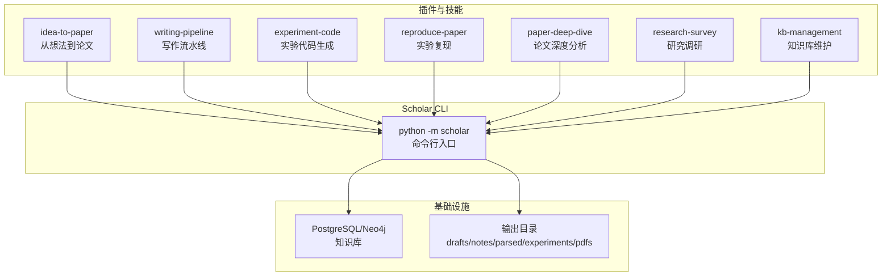
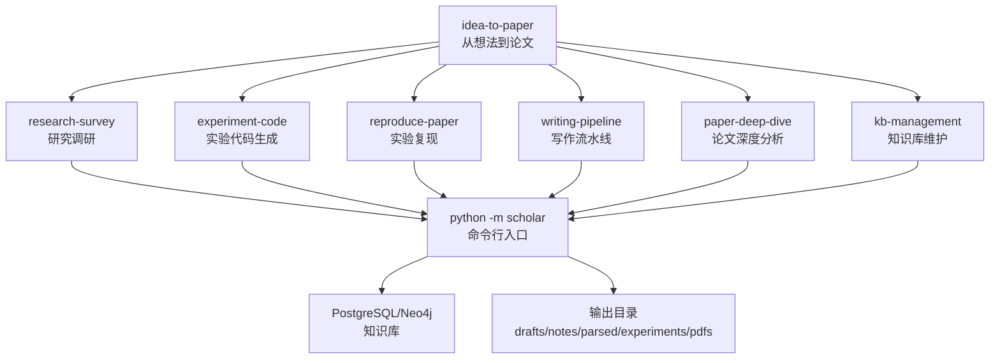
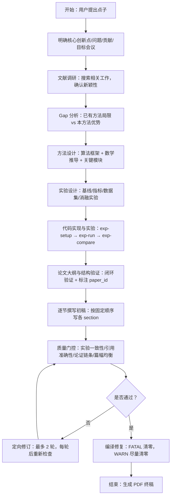
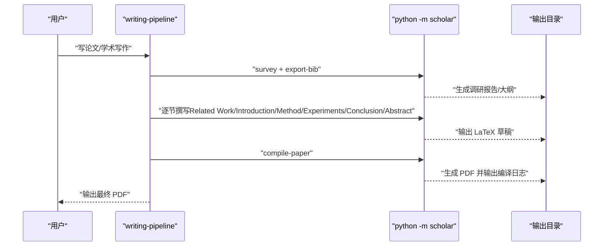
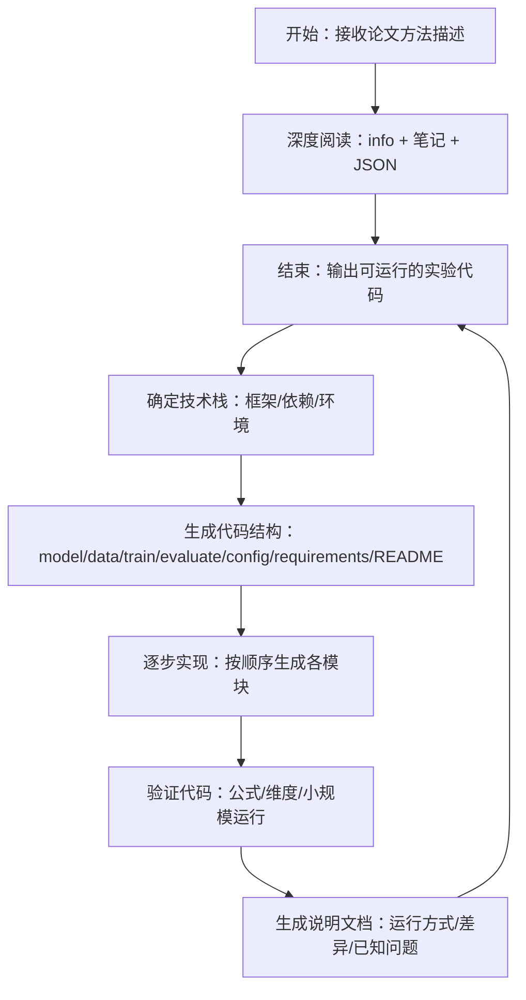
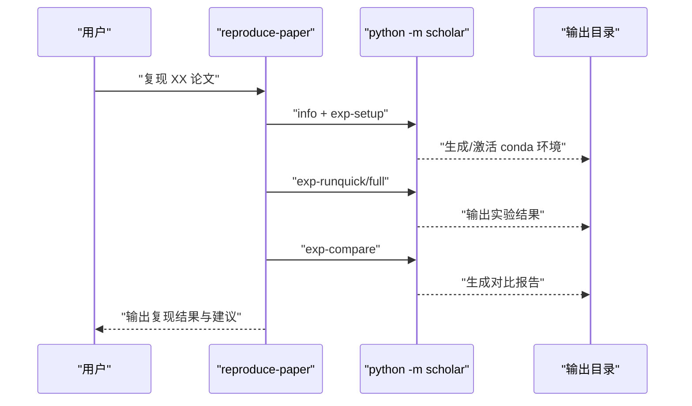
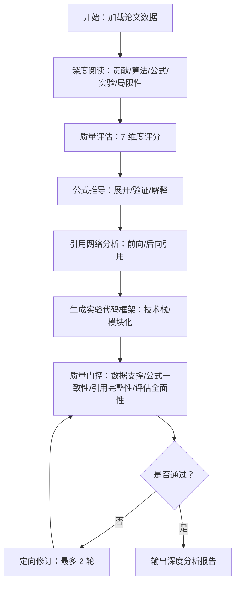
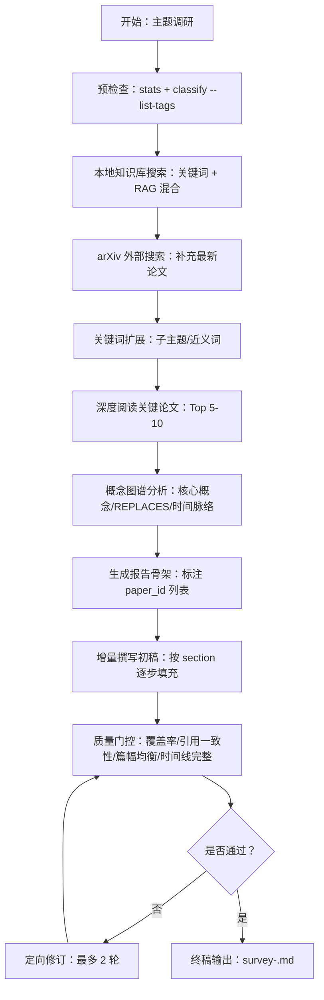
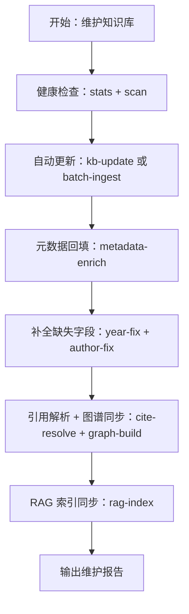
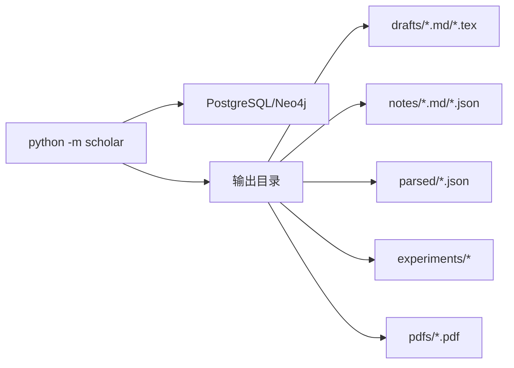

# 从想法到论文技能

<cite>
**本文档引用的文件**
- [plugin\skills\idea-to-paper\SKILL.md](file://plugin/skills/idea-to-paper/SKILL.md)
- [plugin\skills\writing-pipeline\SKILL.md](file://plugin/skills/writing-pipeline/SKILL.md)
- [plugin\skills\experiment-code\SKILL.md](file://plugin/skills/experiment-code/SKILL.md)
- [plugin\skills\kb-management\SKILL.md](file://plugin/skills/kb-management/SKILL.md)
- [plugin\skills\reproduce-paper\SKILL.md](file://plugin/skills/reproduce-paper/SKILL.md)
- [plugin\skills\paper-deep-dive\SKILL.md](file://plugin/skills/paper-deep-dive/SKILL.md)
- [plugin\skills\research-survey\SKILL.md](file://plugin/skills/research-survey/SKILL.md)
- [plugin\rules\pipelines.md](file://plugin/rules/pipelines.md)
- [plugin\commands\paper.md](file://plugin/commands/paper.md)
- [plugin\commands\find.md](file://plugin/commands/find.md)
- [requirements.txt](file://requirements.txt)
- [scholar\__main__.py](file://scholar/__main__.py)
</cite>

## 目录
1. [简介](#简介)
2. [项目结构](#项目结构)
3. [核心组件](#核心组件)
4. [架构总览](#架构总览)
5. [详细组件分析](#详细组件分析)
6. [依赖分析](#依赖分析)
7. [性能考虑](#性能考虑)
8. [故障排查指南](#故障排查指南)
9. [结论](#结论)
10. [附录](#附录)

## 简介
本文件面向“从想法到论文技能模块”的完整流程文档，系统阐述从研究点子到学术论文发表的端到端转化路径。内容覆盖创意筛选、研究设计、实验执行与论文撰写四大阶段，并配套研究计划制定、进度跟踪与质量控制机制。文档还解释与写作流水线、实验代码模块以及知识库维护的协作关系，提供论文结构模板、写作指导与修改建议。

## 项目结构
该仓库围绕“学术研究与写作”目标组织，核心由以下部分构成：
- 插件与技能：以 SKILL.md 为入口的多个原子技能与工作流，分别负责研究调研、论文写作、实验复现、知识库维护等。
- Scholar CLI：统一入口命令行工具，承载检索、解析、编译、质量评估等功能。
- 基础设施与依赖：Docker Compose、初始化 SQL、Python 依赖清单等，保障运行环境与数据库可用。
- 输出目录：drafts（草稿）、notes（结构化笔记）、parsed（解析后的论文 JSON）、experiments（实验代码）、pdfs（编译产物）等，贯穿全流程。

图表来源
- [plugin\skills\idea-to-paper\SKILL.md](file://plugin/skills/idea-to-paper/SKILL.md)
- [plugin\skills\writing-pipeline\SKILL.md](file://plugin/skills/writing-pipeline/SKILL.md)
- [plugin\skills\experiment-code\SKILL.md](file://plugin/skills/experiment-code/SKILL.md)
- [plugin\skills\reproduce-paper\SKILL.md](file://plugin/skills/reproduce-paper/SKILL.md)
- [plugin\skills\paper-deep-dive\SKILL.md](file://plugin/skills/paper-deep-dive/SKILL.md)
- [plugin\skills\research-survey\SKILL.md](file://plugin/skills/research-survey/SKILL.md)
- [plugin\skills\kb-management\SKILL.md](file://plugin/skills/kb-management/SKILL.md)
- [scholar\__main__.py](file://scholar/__main__.py)

章节来源
- [plugin\skills\idea-to-paper\SKILL.md](file://plugin/skills/idea-to-paper/SKILL.md)
- [plugin\skills\writing-pipeline\SKILL.md](file://plugin/skills/writing-pipeline/SKILL.md)
- [plugin\skills\experiment-code\SKILL.md](file://plugin/skills/experiment-code/SKILL.md)
- [plugin\skills\reproduce-paper\SKILL.md](file://plugin/skills/reproduce-paper/SKILL.md)
- [plugin\skills\paper-deep-dive\SKILL.md](file://plugin/skills/paper-deep-dive/SKILL.md)
- [plugin\skills\research-survey\SKILL.md](file://plugin/skills/research-survey/SKILL.md)
- [plugin\skills\kb-management\SKILL.md](file://plugin/skills/kb-management/SKILL.md)
- [plugin\rules\pipelines.md](file://plugin/rules/pipelines.md)
- [scholar\__main__.py](file://scholar/__main__.py)

## 核心组件
- idea-to-paper：从研究点子到完整论文的端到端流程，强调“调研→写作→复现→成文”的闭环。
- writing-pipeline：通用学术写作流程，强调“大纲→逐节撰写→质量门控→编译修复→终稿”。
- experiment-code：依据论文方法与公式自动生成 PyTorch 实验代码，强调“结构化生成→逐步实现→验证→说明文档”。
- reproduce-paper：端到端实验复现流程，强调“环境配置→代码生成→运行→对比→调试”。
- paper-deep-dive：对单篇论文进行深度分析，强调“精读→质量评估→公式推导→引用网络→增量撰写”。
- research-survey：对任意研究主题进行全面文献调研，强调“双路搜索→概念图谱→报告骨架→增量撰写→质量门控”。
- kb-management：知识库维护与自动更新，强调“健康检查→批量入库→元数据回填→引用解析+图谱同步→RAG索引”。

章节来源
- [plugin\skills\idea-to-paper\SKILL.md](file://plugin/skills/idea-to-paper/SKILL.md)
- [plugin\skills\writing-pipeline\SKILL.md](file://plugin/skills/writing-pipeline/SKILL.md)
- [plugin\skills\experiment-code\SKILL.md](file://plugin/skills/experiment-code/SKILL.md)
- [plugin\skills\reproduce-paper\SKILL.md](file://plugin/skills/reproduce-paper/SKILL.md)
- [plugin\skills\paper-deep-dive\SKILL.md](file://plugin/skills/paper-deep-dive/SKILL.md)
- [plugin\skills\research-survey\SKILL.md](file://plugin/skills/research-survey/SKILL.md)
- [plugin\skills\kb-management\SKILL.md](file://plugin/skills/kb-management/SKILL.md)

## 架构总览
下图展示了“从想法到论文”的整体架构与模块交互关系。idea-to-paper 作为主流程，串联 research-survey、experiment-code、reproduce-paper、writing-pipeline、paper-deep-dive、kb-management 等技能模块；Scholar CLI 作为统一入口，驱动知识库查询、解析、编译与质量评估；输出目录承载草稿、笔记、代码与 PDF 成果。

图表来源
- [plugin\skills\idea-to-paper\SKILL.md](file://plugin/skills/idea-to-paper/SKILL.md)
- [plugin\skills\writing-pipeline\SKILL.md](file://plugin/skills/writing-pipeline/SKILL.md)
- [plugin\skills\experiment-code\SKILL.md](file://plugin/skills/experiment-code/SKILL.md)
- [plugin\skills\reproduce-paper\SKILL.md](file://plugin/skills/reproduce-paper/SKILL.md)
- [plugin\skills\paper-deep-dive\SKILL.md](file://plugin/skills/paper-deep-dive/SKILL.md)
- [plugin\skills\research-survey\SKILL.md](file://plugin/skills/research-survey/SKILL.md)
- [plugin\skills\kb-management\SKILL.md](file://plugin/skills/kb-management/SKILL.md)
- [scholar\__main__.py](file://scholar/__main__.py)

## 详细组件分析

### idea-to-paper：从想法到论文
- 触发条件：用户表达“我有一个想法”“从想法到论文”等意图。
- 关键步骤：
  - Step 1：点子明确化（创新点、问题、贡献、目标会议）
  - Step 2：文献调研（搜索相关工作、确认新颖性、识别关键参考）
  - Step 3：研究 Gap 分析（局限性、优势、潜在基线）
  - Step 4：方法设计（算法框架、数学推导、关键模块）
  - Step 5：实验设计（基线、指标、数据集、消融实验）
  - Step 6：代码实现与实验（exp-setup/exp-run/exp-compare）
  - Step 7：论文大纲与结构验证（闭环验证、标注 paper_id）
  - Step 8：逐节撰写初稿（按 Related Work → Introduction → Method → Experiments → Conclusion → Abstract 的顺序）
  - Step 9：质量门控（实验一致性、引用准确性、论证链条、篇幅均衡）
  - Step 10：定向修订与终稿（最多 2 轮修订；编译修复：FATAL 清零、WARN 尽量清零）

图表来源
- [plugin\skills\idea-to-paper\SKILL.md](file://plugin/skills/idea-to-paper/SKILL.md)

章节来源
- [plugin\skills\idea-to-paper\SKILL.md](file://plugin/skills/idea-to-paper/SKILL.md)

### writing-pipeline：写作流水线
- 触发条件：用户表达“写论文”“学术写作”等意图。
- 关键步骤：
  - Step 1：主题调研（双路搜索 → 生成调研报告）
  - Step 2：阅读关键论文笔记（Top 5-10，优先 Grade A/B）
  - Step 3：生成论文大纲（标注 paper_id，导出 BibTeX）
  - Step 4：逐节撰写初稿（逐节单独写入并检查）
  - Step 5：质量门控（引用准确性、论证连贯、篇幅均衡、Abstract 独立性）
  - Step 6：定向修订（最多 2 轮）
  - Step 7：LaTeX 编译与错误修复（编译→诊断→修复闭环）

图表来源
- [plugin\skills\writing-pipeline\SKILL.md](file://plugin/skills/writing-pipeline/SKILL.md)
- [scholar\__main__.py](file://scholar/__main__.py)

章节来源
- [plugin\skills\writing-pipeline\SKILL.md](file://plugin/skills/writing-pipeline/SKILL.md)
- [plugin\commands\paper.md](file://plugin/commands/paper.md)
- [plugin\commands\find.md](file://plugin/commands/find.md)

### experiment-code：实验代码生成
- 触发条件：用户表达“复现实验”“生成代码”“实现这个方法”等意图。
- 关键步骤：
  - Step 1：深度阅读论文方法（info + 笔记 + JSON）
  - Step 2：提取算法要素（输入/输出、核心循环、损失函数、优化目标）
  - Step 3：确定技术栈（PyTorch/TensorFlow/JAX、依赖库、运行环境）
  - Step 4：生成代码结构（model/data/train/evaluate/config/requirements/README）
  - Step 5：逐步实现（按 config → model → data → train → evaluate 顺序）
  - Step 6：验证代码（公式一致性、维度匹配、dry run）
  - Step 7：生成说明文档（对应论文章节/公式、运行方式、差异说明）

图表来源
- [plugin\skills\experiment-code\SKILL.md](file://plugin/skills/experiment-code/SKILL.md)

章节来源
- [plugin\skills\experiment-code\SKILL.md](file://plugin/skills/experiment-code/SKILL.md)

### reproduce-paper：实验复现
- 触发条件：用户表达“复现 XX 论文”“运行实验”等意图。
- 关键步骤：
  - Step 1：深度阅读论文（info + 笔记）
  - Step 2：配置运行环境（exp-setup，conda 环境）
  - Step 3：生成实验代码（如尚未生成）
  - Step 4：下载数据集（如需要）
  - Step 5：运行实验（quick/full 模式，超时保护）
  - Step 6：对比结果（exp-compare）
  - Step 7：调试失败（exp-debug）

图表来源
- [plugin\skills\reproduce-paper\SKILL.md](file://plugin/skills/reproduce-paper/SKILL.md)

章节来源
- [plugin\skills\reproduce-paper\SKILL.md](file://plugin/skills/reproduce-paper/SKILL.md)

### paper-deep-dive：论文深度分析
- 触发条件：用户表达“精读 XX”“深度分析 XX”等意图。
- 关键步骤：
  - Step 1：加载论文数据（info + parsed/notes）
  - Step 2：深度阅读（贡献、算法、公式、实验、局限性）
  - Step 3：质量评估（7 维度评分）
  - Step 4：公式推导（展开中间步骤、验证正确性）
  - Step 5：引用网络分析（前向/后向引用）
  - Step 6：生成实验代码框架（技术栈选择、模块化结构）
  - Step 7：质量门控（数据支撑/公式一致性/引用完整性/评估全面性）
  - Step 8：增量撰写深度报告（最多 2 轮修订）

图表来源
- [plugin\skills\paper-deep-dive\SKILL.md](file://plugin/skills/paper-deep-dive/SKILL.md)

章节来源
- [plugin\skills\paper-deep-dive\SKILL.md](file://plugin/skills/paper-deep-dive/SKILL.md)

### research-survey：研究调研
- 触发条件：用户表达“调研 XX 方向”等意图。
- 关键步骤：
  - Step 0：预检查（stats + classify --list-tags）
  - Step 1：本地知识库搜索（关键词 + RAG 混合）
  - Step 2：arXiv 外部搜索（补充最新论文）
  - Step 3：关键词扩展（识别子主题与近义词）
  - Step 4：深度阅读关键论文（Top 5-10，优先使用预生成笔记）
  - Step 5：概念图谱分析（核心概念/REPLACES 关系/时间脉络）
  - Step 6：生成报告骨架（标注 paper_id 列表）
  - Step 7：增量撰写初稿（按 section 逐步填充）
  - Step 8：质量门控（覆盖率/引用一致性/篇幅均衡/时间线完整）
  - Step 9：定向修订（最多 2 轮）
  - Step 10：终稿输出

图表来源
- [plugin\skills\research-survey\SKILL.md](file://plugin/skills/research-survey/SKILL.md)

章节来源
- [plugin\skills\research-survey\SKILL.md](file://plugin/skills/research-survey/SKILL.md)

### kb-management：知识库维护
- 触发条件：用户表达“维护知识库”“更新知识库”等意图。
- 关键步骤：
  - Step 1：知识库健康检查（stats + scan）
  - Step 2：自动更新（kb-update 或 batch-ingest）
  - Step 3：元数据回填（metadata-enrich）
  - Step 4：补全缺失字段（year-fix + author-fix）
  - Step 5：引用解析 + 图谱同步（cite-resolve + graph-build）
  - Step 6：RAG 索引同步（rag-index）
  - Step 7：输出维护报告

图表来源
- [plugin\skills\kb-management\SKILL.md](file://plugin/skills/kb-management/SKILL.md)

章节来源
- [plugin\skills\kb-management\SKILL.md](file://plugin/skills/kb-management/SKILL.md)

## 依赖分析
- 命令行入口：python -m scholar 作为统一 CLI，承载所有技能调用与数据流转。
- 外部依赖：Typer、Rich、PostgreSQL 驱动的数据库、Neo4j 图数据库、PyMuPDF、MCP 等。
- 输出目录：drafts（草稿）、notes（结构化笔记）、parsed（解析 JSON）、experiments（实验代码）、pdfs（编译产物）。

图表来源
- [requirements.txt](file://requirements.txt)
- [scholar\__main__.py](file://scholar/__main__.py)

章节来源
- [requirements.txt](file://requirements.txt)
- [scholar\__main__.py](file://scholar/__main__.py)

## 性能考虑
- 搜索与检索：优先使用本地知识库（精确 TeX 源码级信息），必要时结合 arXiv 外部搜索，减少网络延迟。
- 编译与修复：采用双遍编译解析交叉引用，最多 3 轮修复，确保 FATAL 清零、WARN 尽量清零。
- 实验运行：quick 模式用于 CPU + 合成数据快速验证，full 模式用于完整训练流程，注意超时保护与资源限制。
- 代码生成：按模块逐步实现，边写边验证，降低后期调试成本。

## 故障排查指南
- 编译错误分类与修复：
  - FATAL：缺失包、语法错误、未定义命令 → 修复后重编译
  - WARN：Overfull/Underfull、未定义引用 → 优先修复，尽量清零
  - INFO：字体/编码警告 → 可忽略
- 常见修复策略：
  - 缺失包：在导言区添加相应宏包
  - 未定义命令：识别来源，添加对应包或 \newcommand
  - 缺失数学模式分隔符：补上 $$
  - 未定义引用：验证 paper_id，补全 .bib 条目
  - 未定义标签：检查 \label/\ref 对应关系
  - 公式/表格/段落溢出：使用 split、resizebox、emergency stretch 等手段
  - 编码错误：修正特殊字符为合法 LaTeX 转义
- 实验复现失败：
  - exp-debug 自动诊断 ModuleNotFoundError、CUDA OOM、FileNotFoundError 等
  - 检查 conda 环境、requirements.txt、数据集下载与路径

章节来源
- [plugin\skills\writing-pipeline\SKILL.md](file://plugin/skills/writing-pipeline/SKILL.md)
- [plugin\skills\reproduce-paper\SKILL.md](file://plugin/skills/reproduce-paper/SKILL.md)

## 结论
“从想法到论文技能模块”通过 idea-to-paper 的端到端流程，将创意筛选、研究设计、实验执行与论文撰写有机串联，并与 writing-pipeline、experiment-code、reproduce-paper、paper-deep-dive、research-survey、kb-management 等技能协同，形成可迭代的质量门控与编译修复闭环。配合 Scholar CLI 与输出目录，能够高效产出高质量论文草稿与可复现实验代码，支撑学术研究与写作的持续演进。

## 附录

### 论文结构模板与写作指导
- 结构顺序：Related Work → Introduction → Method → Experiments → Conclusion → Abstract（最后写）
- 写作原则：大纲先行、逐节撰写、每个 section 写完即检查、Abstract 最后写以确保概括性
- 引用规范：标注 paper_id，确保引用存在于知识库；Related Work 按方法流派分类 + 时间线叙事
- 质量门控：实验一致性、引用准确性、论证链条、篇幅均衡；最多 2 轮修订

章节来源
- [plugin\skills\writing-pipeline\SKILL.md](file://plugin/skills/writing-pipeline/SKILL.md)
- [plugin\skills\idea-to-paper\SKILL.md](file://plugin/skills/idea-to-paper/SKILL.md)

### 与写作流水线和实验代码模块的协作关系
- idea-to-paper 与 writing-pipeline：前者侧重“从点子到成文”，后者提供“通用写作流程”；二者在“大纲→逐节撰写→质量门控→编译修复”环节紧密衔接
- idea-to-paper 与 experiment-code：前者完成方法设计与实验设计，后者生成可运行的实验代码，二者在“实验设计→代码实现→验证”环节协作
- idea-to-paper 与 reproduce-paper：前者产出实验结果与对比，后者提供复现实验与调试能力，二者在“实验对比→调试失败→改进”环节互补

章节来源
- [plugin\skills\idea-to-paper\SKILL.md](file://plugin/skills/idea-to-paper/SKILL.md)
- [plugin\skills\writing-pipeline\SKILL.md](file://plugin/skills/writing-pipeline/SKILL.md)
- [plugin\skills\experiment-code\SKILL.md](file://plugin/skills/experiment-code/SKILL.md)
- [plugin\skills\reproduce-paper\SKILL.md](file://plugin/skills/reproduce-paper/SKILL.md)