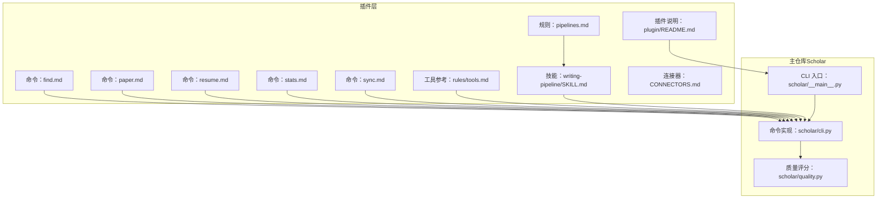
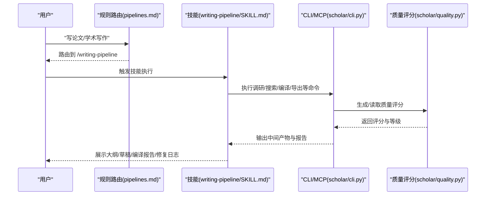
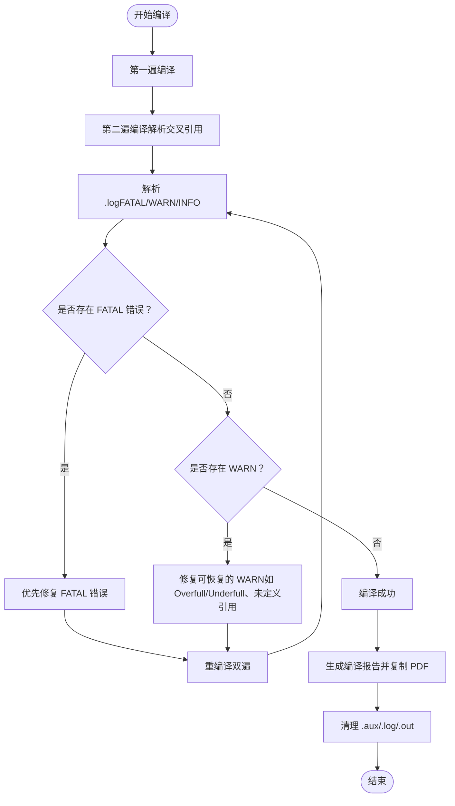
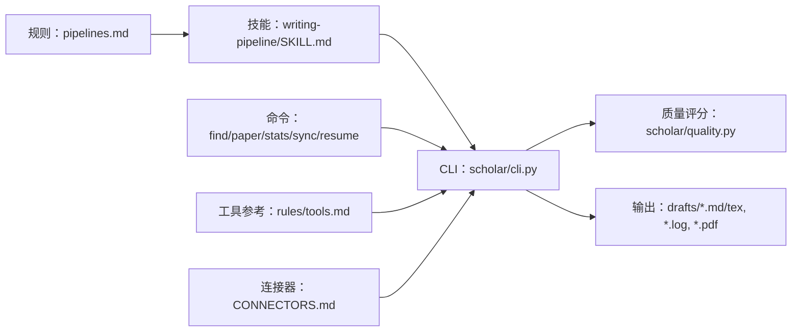

# 写作流水线技能

<cite>
**本文档引用的文件**
- [plugin\skills\writing-pipeline\SKILL.md](file://plugin/skills/writing-pipeline/SKILL.md)
- [plugin\rules\pipelines.md](file://plugin/rules/pipelines.md)
- [plugin\commands\paper.md](file://plugin/commands/paper.md)
- [plugin\commands\find.md](file://plugin/commands/find.md)
- [plugin\commands\resume.md](file://plugin/commands/resume.md)
- [plugin\commands\stats.md](file://plugin/commands/stats.md)
- [plugin\commands\sync.md](file://plugin/commands/sync.md)
- [plugin\rules\tools.md](file://plugin/rules/tools.md)
- [plugin\CONNECTORS.md](file://plugin/CONNECTORS.md)
- [plugin\README.md](file://plugin/README.md)
- [scholar\cli.py](file://scholar/cli.py)
- [scholar\__main__.py](file://scholar/__main__.py)
- [scholar\quality.py](file://scholar/quality.py)
</cite>

## 目录
1. [简介](#简介)
2. [项目结构](#项目结构)
3. [核心组件](#核心组件)
4. [架构总览](#架构总览)
5. [详细组件分析](#详细组件分析)
6. [依赖分析](#依赖分析)
7. [性能考虑](#性能考虑)
8. [故障排查指南](#故障排查指南)
9. [结论](#结论)
10. [附录](#附录)

## 简介
本文件面向“写作流水线技能”模块，系统化阐述从主题调研、文献整理、草稿生成、内容优化、格式调整到最终输出的完整自动化写作流程。文档覆盖：
- 文档模板系统与内容生成算法
- 质量门控与编译修复机制
- 写作模板定制方法与扩展接口
- 与外部编辑器与发布平台的集成方式
- 断点恢复、工具链与基础设施依赖

该技能由插件侧规则与技能文件驱动，调用主仓库的 Scholar CLI 与 MCP 服务完成搜索、解析、RAG、编译等任务。

## 项目结构
写作流水线技能位于插件目录下，配合规则、命令与工具参考共同构成工作流入口与执行指引。主仓库提供 CLI 与 MCP 服务，负责实际的数据处理、编译与报告生成。

图表来源
- [plugin\rules\pipelines.md:1-42](file://plugin/rules/pipelines.md#L1-L42)
- [plugin\skills\writing-pipeline\SKILL.md:1-135](file://plugin/skills/writing-pipeline/SKILL.md#L1-L135)
- [plugin\commands\find.md:1-10](file://plugin/commands/find.md#L1-L10)
- [plugin\commands\paper.md:1-11](file://plugin/commands/paper.md#L1-L11)
- [plugin\commands\resume.md:1-22](file://plugin/commands/resume.md#L1-L22)
- [plugin\commands\stats.md:1-10](file://plugin/commands/stats.md#L1-L10)
- [plugin\commands\sync.md:1-11](file://plugin/commands/sync.md#L1-L11)
- [plugin\rules\tools.md:1-135](file://plugin/rules/tools.md#L1-L135)
- [plugin\CONNECTORS.md:1-45](file://plugin/CONNECTORS.md#L1-L45)
- [plugin\README.md:1-79](file://plugin/README.md#L1-L79)
- [scholar\__main__.py:1-8](file://scholar/__main__.py#L1-L8)
- [scholar\cli.py:1-200](file://scholar/cli.py#L1-L200)
- [scholar\quality.py:324-431](file://scholar/quality.py#L324-L431)

章节来源
- [plugin\README.md:1-79](file://plugin/README.md#L1-L79)
- [plugin\rules\pipelines.md:1-42](file://plugin/rules/pipelines.md#L1-L42)
- [plugin\skills\writing-pipeline\SKILL.md:1-135](file://plugin/skills/writing-pipeline/SKILL.md#L1-L135)

## 核心组件
- 技能定义与流程编排：写作流水线技能文件定义了从调研到输出的完整步骤、检查点与产出物路径。
- 规则路由：意图识别规则将“学术写作”等关键词路由到写作流水线技能。
- 命令工具：提供快速查看论文、搜索、统计、恢复与同步的能力，支撑流水线各阶段的数据准备与状态确认。
- CLI 与 MCP：Scholar CLI 提供编译、调查、RAG、质量评分等能力；MCP 服务器提供类型化工具调用。
- 质量评分：用于评估论文质量，辅助筛选核心引用与指导修订。

章节来源
- [plugin\skills\writing-pipeline\SKILL.md:6-135](file://plugin/skills/writing-pipeline/SKILL.md#L6-L135)
- [plugin\rules\pipelines.md:7-17](file://plugin/rules/pipelines.md#L7-L17)
- [plugin\commands\paper.md:1-11](file://plugin/commands/paper.md#L1-L11)
- [plugin\commands\find.md:1-10](file://plugin/commands/find.md#L1-L10)
- [plugin\commands\resume.md:1-22](file://plugin/commands/resume.md#L1-L22)
- [plugin\commands\stats.md:1-10](file://plugin/commands/stats.md#L1-L10)
- [plugin\commands\sync.md:1-11](file://plugin/commands/sync.md#L1-L11)
- [plugin\rules\tools.md:11-135](file://plugin/rules/tools.md#L11-L135)
- [scholar\quality.py:324-431](file://scholar/quality.py#L324-L431)

## 架构总览
写作流水线以“技能文件”为编排中枢，结合“规则路由”与“命令工具”，通过“Scholar CLI/MCP”完成数据与编译任务。整体交互如下：

图表来源
- [plugin\rules\pipelines.md:7-17](file://plugin/rules/pipelines.md#L7-L17)
- [plugin\skills\writing-pipeline\SKILL.md:11-128](file://plugin/skills/writing-pipeline/SKILL.md#L11-L128)
- [scholar\cli.py:1374-1503](file://scholar/cli.py#L1374-L1503)
- [scholar\quality.py:324-431](file://scholar/quality.py#L324-L431)

## 详细组件分析

### 1) 文献整理与主题调研
- 双路搜索：结合 RAG、关键词与 arXiv 搜索，生成调研报告。
- 产出：`output/drafts/survey_<topic>.md`。
- 支撑命令：`python -m scholar survey "<topic>" --depth full --limit 20`。

章节来源
- [plugin\skills\writing-pipeline\SKILL.md:11-16](file://plugin/skills/writing-pipeline/SKILL.md#L11-L16)
- [plugin\rules\tools.md:109-110](file://plugin/rules/tools.md#L109-L110)

### 2) 阅读关键论文与笔记
- 选取 Top 5-10 论文，读取预生成笔记与质量评分。
- 笔记与评分文件：`output/notes/<ULID>.md`、`output/notes/<ULID>-quality.json`。
- 优先选择 Grade A/B 的论文作为核心引用。

章节来源
- [plugin\skills\writing-pipeline\SKILL.md:18-22](file://plugin/skills/writing-pipeline/SKILL.md#L18-L22)
- [plugin\commands\paper.md:6-10](file://plugin/commands/paper.md#L6-L10)
- [scholar\quality.py:324-431](file://scholar/quality.py#L324-L431)

### 3) 生成论文大纲
- 基于调研结果确定各 section 的核心论点、篇幅分配与引用标注。
- 生成 BibTeX：`python -m scholar export-bib`。
- 输出：`output/drafts/<topic>-outline.md`。

章节来源
- [plugin\skills\writing-pipeline\SKILL.md:24-29](file://plugin/skills/writing-pipeline/SKILL.md#L24-L29)
- [plugin\rules\tools.md:40](file://plugin/rules/tools.md#L40)

### 4) 逐节撰写初稿（LaTeX）
- 按顺序撰写：Related Work → Introduction → Method → Experiments → Conclusion → Abstract。
- 每节单独写入并检查：引用一致性、逻辑连贯性、术语统一。
- 产出：各节 LaTeX 文件至 `output/drafts/`。

章节来源
- [plugin\skills\writing-pipeline\SKILL.md:31-44](file://plugin/skills/writing-pipeline/SKILL.md#L31-L44)

### 5) 质量门控
- 检查维度：引用准确性、论证连贯、篇幅均衡、Abstract 独立性。
- 产出：`output/drafts/<topic>-review.md`，包含 PASS/REVISE/MISSING 三类条目。

章节来源
- [plugin\skills\writing-pipeline\SKILL.md:46-56](file://plugin/skills/writing-pipeline/SKILL.md#L46-L56)

### 6) 定向修订
- 对 REVISE 项进行针对性修改；对 MISSING 项补充内容。
- 最多两轮修订，每轮后重新检查未通过项；全部通过或两轮后强制通过。

章节来源
- [plugin\skills\writing-pipeline\SKILL.md:58-63](file://plugin/skills/writing-pipeline/SKILL.md#L58-L63)

### 7) LaTeX 编译与错误修复
- 编译：英文版使用 pdflatex，中文版使用 xelatex；双遍编译解析交叉引用。
- 日志诊断：按 FATAL/WARN/INFO 分类；若无结构化报告则手动解析 .log。
- 自动修复策略：按优先级处理缺失包、未定义命令、数学模式分隔符、未定义引用/标签、公式/表格/段落溢出、编码错误等。
- 重编译循环：每轮修复后重新编译（双遍），最多三轮；记录修复日志。
- 编译报告：输出 PDF 路径、页数、文件大小、最终计数与残余警告列表，并复制 PDF 至 `output/pdfs/`，清理中间文件。

图表来源
- [plugin\skills\writing-pipeline\SKILL.md:65-121](file://plugin/skills/writing-pipeline/SKILL.md#L65-L121)
- [scholar\cli.py:1810-1972](file://scholar/cli.py#L1810-L1972)

章节来源
- [plugin\skills\writing-pipeline\SKILL.md:65-121](file://plugin/skills/writing-pipeline/SKILL.md#L65-L121)
- [scholar\cli.py:1810-1972](file://scholar/cli.py#L1810-L1972)

### 8) 断点恢复与状态判断
- 检查 TodoWrite 与中间产物，综合判断当前阶段（仅大纲、部分 section、draft+review、review 全 PASS）。
- 加载对应 SKILL.md 从断点开始执行，跳过已完成步骤，并更新 TodoWrite。

章节来源
- [plugin\commands\resume.md:6-22](file://plugin/commands/resume.md#L6-L22)

### 9) 模板系统与定制方法
- 大纲模板：由调研结果生成，包含各 section 的核心论点与引用标注。
- 草稿模板：按 Related Work → Introduction → Method → Experiments → Conclusion → Abstract 的顺序生成 LaTeX 片段。
- 定制建议：
  - 修改 section 结构与权重：在大纲阶段调整核心论点与篇幅分配。
  - 扩展引用策略：在草稿阶段增加/替换 paper_id，确保引用一致性。
  - 自定义编译参数：通过 CLI 选项指定引擎与输出目录。
  - 扩展质量门控：在 review.md 中新增检查项，或在草稿阶段加入自检脚本。

章节来源
- [plugin\skills\writing-pipeline\SKILL.md:24-44](file://plugin/skills/writing-pipeline/SKILL.md#L24-L44)
- [plugin\skills\writing-pipeline\SKILL.md:46-63](file://plugin/skills/writing-pipeline/SKILL.md#L46-L63)
- [plugin\skills\writing-pipeline\SKILL.md:65-121](file://plugin/skills/writing-pipeline/SKILL.md#L65-L121)

### 10) 与外部编辑器和发布平台的集成
- 外部编辑器：LaTeX 编译依赖本地 TeX 引擎（pdflatex/xelatex），可在本地 VS Code/LaTeX Workshop 等环境中打开输出文件进行人工润色。
- 发布平台：PDF 输出至 `output/pdfs/`，可直接上传至 arXiv、Semantic Scholar、OpenReview 等平台；BibTeX 导出用于参考文献管理与平台兼容。

章节来源
- [plugin\skills\writing-pipeline\SKILL.md:73-75](file://plugin/skills/writing-pipeline/SKILL.md#L73-L75)
- [plugin\skills\writing-pipeline\SKILL.md:121](file://plugin/skills/writing-pipeline/SKILL.md#L121)
- [plugin\rules\tools.md:40](file://plugin/rules/tools.md#L40)

## 依赖分析
- 规则路由：将“学术写作”意图映射到写作流水线技能。
- 命令工具：提供论文信息查看、搜索、统计、恢复与同步，支撑流水线数据准备与状态确认。
- CLI/MCP：Scholar CLI 提供编译、调查、RAG、质量评分等能力；MCP 服务器提供类型化工具调用。
- 数据与中间产物：笔记、质量评分、解析后的论文 JSON、编译日志与 PDF 等。

图表来源
- [plugin\rules\pipelines.md:7-17](file://plugin/rules/pipelines.md#L7-L17)
- [plugin\skills\writing-pipeline\SKILL.md:11-128](file://plugin/skills/writing-pipeline/SKILL.md#L11-L128)
- [plugin\commands\find.md:1-10](file://plugin/commands/find.md#L1-L10)
- [plugin\commands\paper.md:1-11](file://plugin/commands/paper.md#L1-L11)
- [plugin\commands\stats.md:1-10](file://plugin/commands/stats.md#L1-L10)
- [plugin\commands\sync.md:1-11](file://plugin/commands/sync.md#L1-L11)
- [plugin\commands\resume.md:1-22](file://plugin/commands/resume.md#L1-L22)
- [plugin\rules\tools.md:11-135](file://plugin/rules/tools.md#L11-L135)
- [plugin\CONNECTORS.md:1-45](file://plugin/CONNECTORS.md#L1-L45)
- [scholar\cli.py:1-200](file://scholar/cli.py#L1-L200)
- [scholar\quality.py:324-431](file://scholar/quality.py#L324-L431)

章节来源
- [plugin\rules\pipelines.md:1-42](file://plugin/rules/pipelines.md#L1-L42)
- [plugin\commands\find.md:1-10](file://plugin/commands/find.md#L1-L10)
- [plugin\commands\paper.md:1-11](file://plugin/commands/paper.md#L1-L11)
- [plugin\commands\stats.md:1-10](file://plugin/commands/stats.md#L1-L10)
- [plugin\commands\sync.md:1-11](file://plugin/commands/sync.md#L1-L11)
- [plugin\commands\resume.md:1-22](file://plugin/commands/resume.md#L1-L22)
- [plugin\rules\tools.md:11-135](file://plugin/rules/tools.md#L11-L135)
- [plugin\CONNECTORS.md:1-45](file://plugin/CONNECTORS.md#L1-L45)
- [scholar\cli.py:1-200](file://scholar/cli.py#L1-L200)
- [scholar\quality.py:324-431](file://scholar/quality.py#L324-L431)

## 性能考虑
- 编译性能：双遍编译与 bibtex 调用会增加时间成本，建议在草稿阶段减少复杂浮动体与长公式，降低 Overfull/Underfull。
- 搜索与 RAG：大规模论文库的向量索引与混合检索可能耗时，建议在批量处理时分批执行并缓存结果。
- 质量评分：全量评分与笔记生成为 IO 密集操作，建议在空闲时段批量执行。
- 修复策略：优先修复 FATAL，其次 WARN，避免在一轮中引入新的致命问题。

## 故障排查指南
- 编译失败（FATAL）：检查缺失包、语法错误、未定义命令与数学模式分隔符；修复后重试。
- 未定义引用/标签：核对 paper_id 与 .bib 条目，确保引用一致性；修正拼写与跨文件引用。
- 溢出警告（Overfull/Underfull）：对公式/表格/段落使用换行或缩放策略；调整字体与间距。
- 编码错误：修正特殊字符为合法 LaTeX 转义。
- 日志解析：若 CLI 未输出结构化报告，手动解析 .log 并按严重级别分类处理。

章节来源
- [plugin\skills\writing-pipeline\SKILL.md:77-103](file://plugin/skills/writing-pipeline/SKILL.md#L77-L103)
- [scholar\cli.py:1739-1807](file://scholar/cli.py#L1739-L1807)

## 结论
写作流水线技能通过明确的阶段划分与自动化工具链，实现了从主题调研到最终 PDF 输出的闭环。其优势在于：
- 清晰的迭代写入原则与质量门控，保证内容质量与结构合理性。
- 结构化的编译修复流程，显著降低格式错误对产出的影响。
- 与 Scholar CLI/MCP 的深度集成，提供强大的数据检索、解析与编译能力。

建议在实际使用中：
- 在大纲阶段充分讨论结构与引用策略，减少后期返工。
- 在草稿阶段及时进行小步提交与检查，避免一次性大改动。
- 利用质量评分与断点恢复功能，提升迭代效率与可维护性。

## 附录
- 常用命令与路径参考见工具参考与连接器说明。
- CLI 入口与主程序组织参见 Scholar CLI 与入口模块。

章节来源
- [plugin\rules\tools.md:1-135](file://plugin/rules/tools.md#L1-L135)
- [plugin\CONNECTORS.md:1-45](file://plugin/CONNECTORS.md#L1-L45)
- [scholar\__main__.py:1-8](file://scholar/__main__.py#L1-L8)
- [scholar\cli.py:1-200](file://scholar/cli.py#L1-L200)