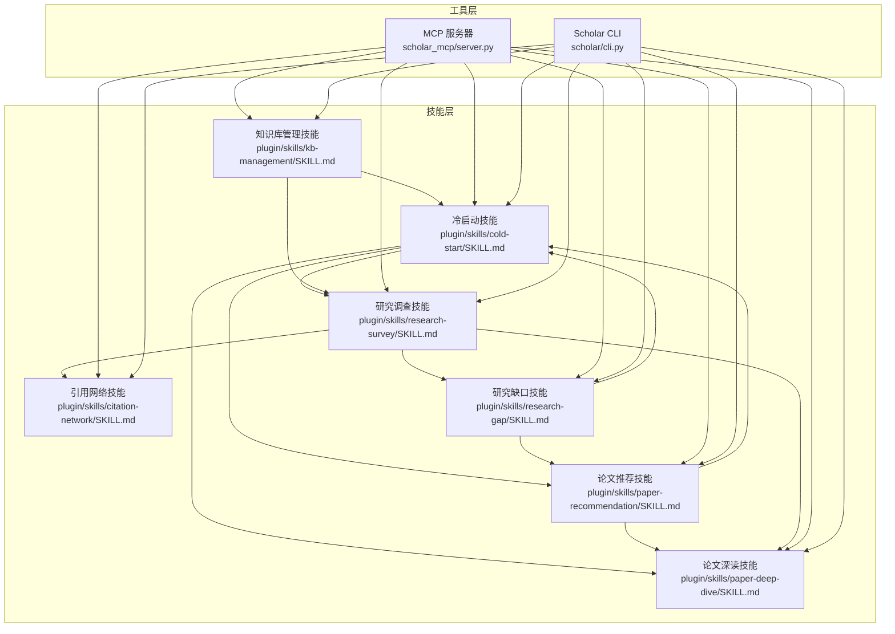
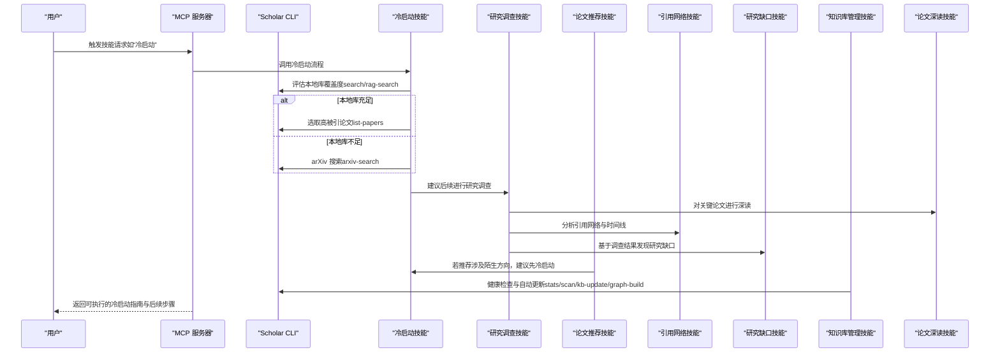
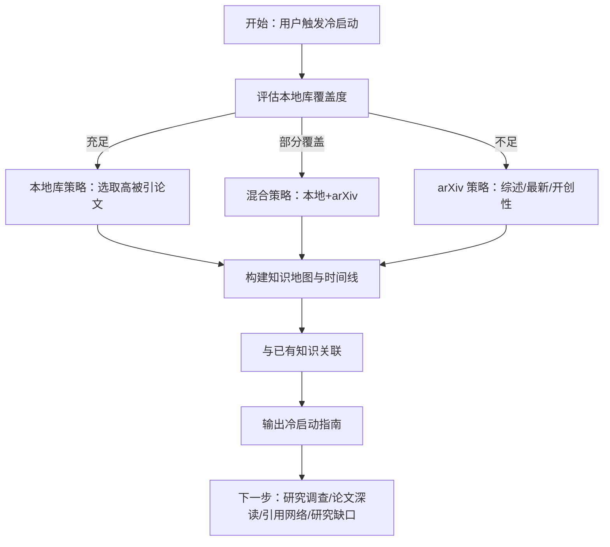
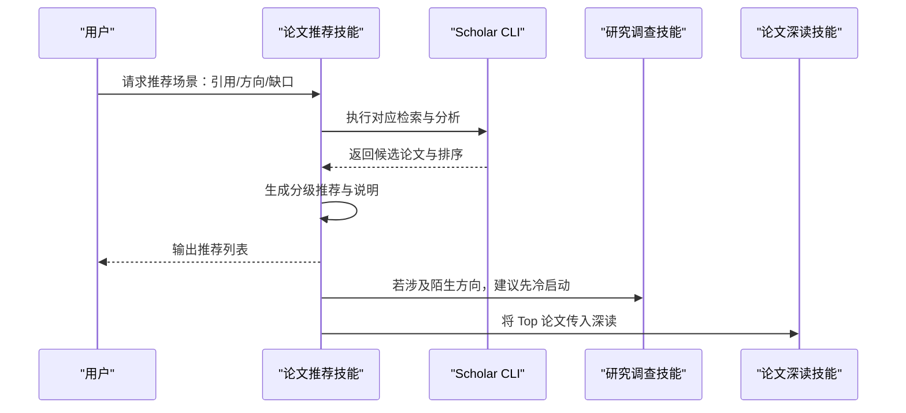
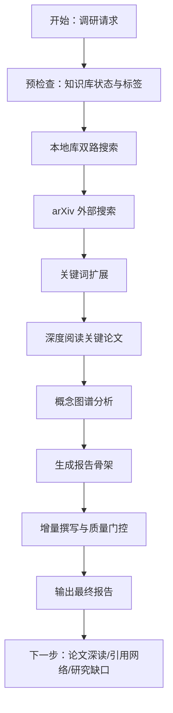
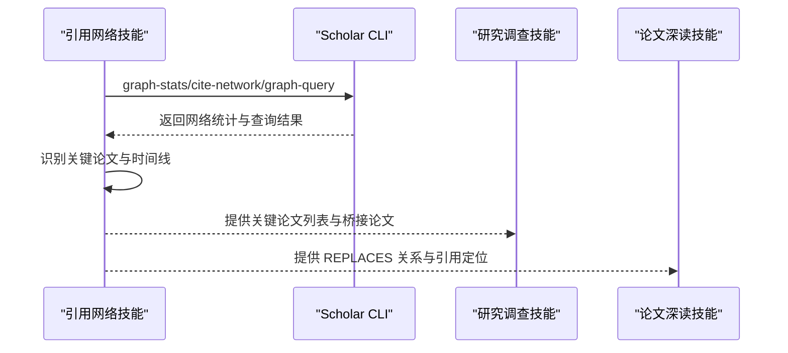
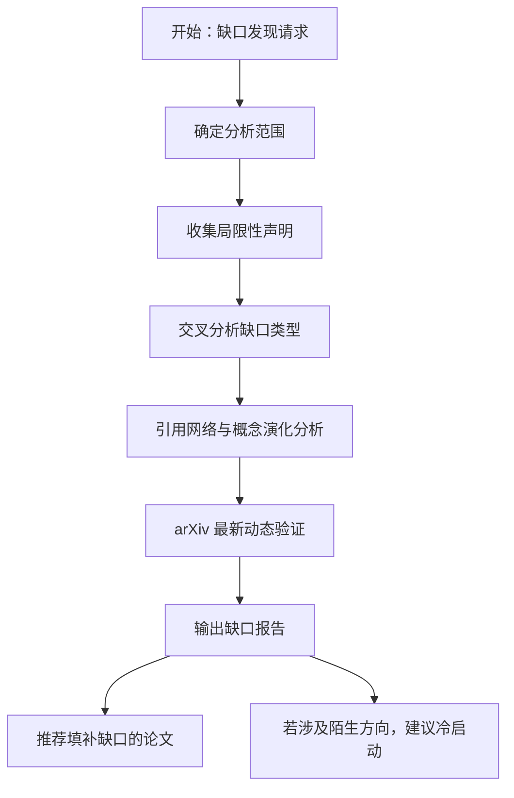
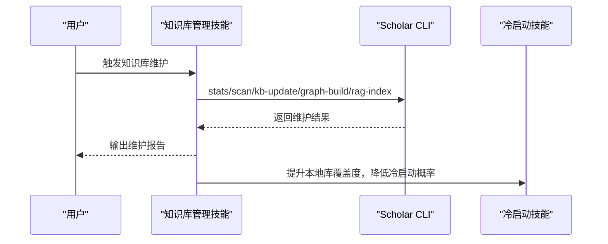
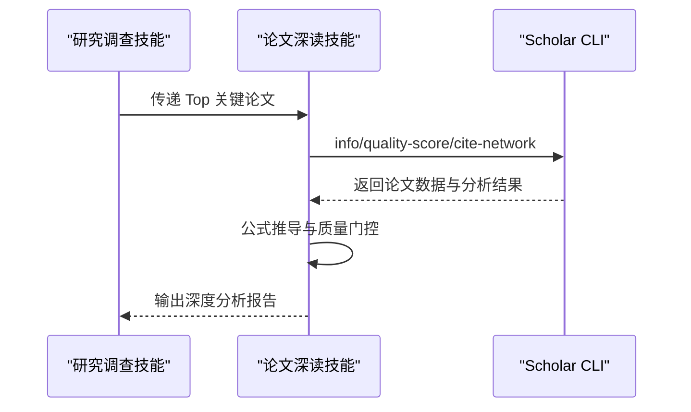
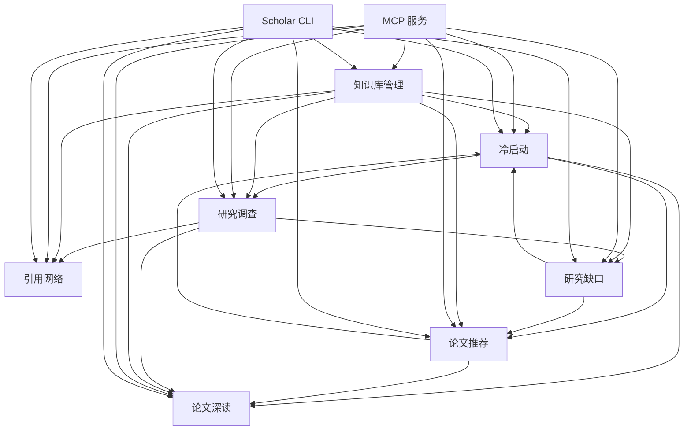

# 冷启动技能

<cite>
**本文档引用的文件**
- [plugin/skills/cold-start/SKILL.md](file://plugin/skills/cold-start/SKILL.md)
- [plugin/skills/paper-recommendation/SKILL.md](file://plugin/skills/paper-recommendation/SKILL.md)
- [plugin/skills/research-gap/SKILL.md](file://plugin/skills/research-gap/SKILL.md)
- [plugin/skills/research-survey/SKILL.md](file://plugin/skills/research-survey/SKILL.md)
- [plugin/skills/kb-management/SKILL.md](file://plugin/skills/kb-management/SKILL.md)
- [plugin/skills/paper-deep-dive/SKILL.md](file://plugin/skills/paper-deep-dive/SKILL.md)
- [plugin/skills/citation-network/SKILL.md](file://plugin/skills/citation-network/SKILL.md)
- [scholar/cli.py](file://scholar/cli.py)
- [scholar/__main__.py](file://scholar/__main__.py)
- [scholar_mcp/server.py](file://scholar_mcp/server.py)
</cite>

## 目录
1. [简介](#简介)
2. [项目结构](#项目结构)
3. [核心组件](#核心组件)
4. [架构总览](#架构总览)
5. [详细组件分析](#详细组件分析)
6. [依赖关系分析](#依赖关系分析)
7. [性能考虑](#性能考虑)
8. [故障排除指南](#故障排除指南)
9. [结论](#结论)
10. [附录](#附录)

## 简介
本方案针对“冷启动”场景，围绕“新用户、新论文、新领域”的知识空白，提供系统化的推荐与处理策略。冷启动的核心挑战在于：缺乏历史交互数据、概念图谱覆盖不足、本地知识库稀疏。本方案通过“本地库评估—多源互补—知识地图构建—路径规划—持续迭代”的闭环流程，结合“基于内容的检索、专家推荐、混合策略”，实现从零到一的知识奠基与可持续演进。

## 项目结构
本项目采用插件化技能体系，冷启动技能位于 plugin/skills/cold-start，配套技能包括论文推荐、研究调查、引用网络、研究缺口、知识库管理、论文深读等。Scholar CLI 提供统一入口，MCP 服务负责技能调度与协作。

**图表来源**
- [plugin/skills/cold-start/SKILL.md](file://plugin/skills/cold-start/SKILL.md)
- [plugin/skills/paper-recommendation/SKILL.md](file://plugin/skills/paper-recommendation/SKILL.md)
- [plugin/skills/research-survey/SKILL.md](file://plugin/skills/research-survey/SKILL.md)
- [plugin/skills/citation-network/SKILL.md](file://plugin/skills/citation-network/SKILL.md)
- [plugin/skills/research-gap/SKILL.md](file://plugin/skills/research-gap/SKILL.md)
- [plugin/skills/kb-management/SKILL.md](file://plugin/skills/kb-management/SKILL.md)
- [plugin/skills/paper-deep-dive/SKILL.md](file://plugin/skills/paper-deep-dive/SKILL.md)
- [scholar/cli.py](file://scholar/cli.py)
- [scholar_mcp/server.py](file://scholar_mcp/server.py)

**章节来源**
- [plugin/skills/cold-start/SKILL.md](file://plugin/skills/cold-start/SKILL.md)
- [plugin/skills/paper-recommendation/SKILL.md](file://plugin/skills/paper-recommendation/SKILL.md)
- [plugin/skills/research-survey/SKILL.md](file://plugin/skills/research-survey/SKILL.md)
- [plugin/skills/citation-network/SKILL.md](file://plugin/skills/citation-network/SKILL.md)
- [plugin/skills/research-gap/SKILL.md](file://plugin/skills/research-gap/SKILL.md)
- [plugin/skills/kb-management/SKILL.md](file://plugin/skills/kb-management/SKILL.md)
- [plugin/skills/paper-deep-dive/SKILL.md](file://plugin/skills/paper-deep-dive/SKILL.md)
- [scholar/cli.py](file://scholar/cli.py)
- [scholar/__main__.py](file://scholar/__main__.py)
- [scholar_mcp/server.py](file://scholar_mcp/server.py)

## 核心组件
- 冷启动技能：面向“新方向/新论文/新用户”的入门型知识奠基流程，强调本地库覆盖度评估、arXiv 补充、知识地图与时间线构建、与既有知识的连接、输出可执行的学习路径。
- 论文推荐技能：基于引用网络、方向关键词、阅读缺口三类场景，提供“必读/推荐/可选”分级推荐与理由说明。
- 研究调查技能：对任意主题进行系统性文献调研，产出报告骨架与初稿，支持增量撰写与质量门控。
- 引用网络技能：分析引用网络拓扑、关键节点、桥接论文与时间线，辅助发现经典、综述与演化路径。
- 研究缺口技能：通过跨论文局限性分析与概念演化分析，发现高/中/探索性置信度的空白方向。
- 知识库管理技能：健康检查、自动更新、元数据回填、引用解析与图谱同步、RAG 索引同步。
- 论文深读技能：对单篇论文进行结构化解析、质量评估、公式推导、引用网络定位与实验代码框架生成。

**章节来源**
- [plugin/skills/cold-start/SKILL.md](file://plugin/skills/cold-start/SKILL.md)
- [plugin/skills/paper-recommendation/SKILL.md](file://plugin/skills/paper-recommendation/SKILL.md)
- [plugin/skills/research-survey/SKILL.md](file://plugin/skills/research-survey/SKILL.md)
- [plugin/skills/citation-network/SKILL.md](file://plugin/skills/citation-network/SKILL.md)
- [plugin/skills/research-gap/SKILL.md](file://plugin/skills/research-gap/SKILL.md)
- [plugin/skills/kb-management/SKILL.md](file://plugin/skills/kb-management/SKILL.md)
- [plugin/skills/paper-deep-dive/SKILL.md](file://plugin/skills/paper-deep-dive/SKILL.md)

## 架构总览
冷启动技能在整体系统中的位置与协作关系如下：

**图表来源**
- [plugin/skills/cold-start/SKILL.md](file://plugin/skills/cold-start/SKILL.md)
- [plugin/skills/research-survey/SKILL.md](file://plugin/skills/research-survey/SKILL.md)
- [plugin/skills/paper-recommendation/SKILL.md](file://plugin/skills/paper-recommendation/SKILL.md)
- [plugin/skills/citation-network/SKILL.md](file://plugin/skills/citation-network/SKILL.md)
- [plugin/skills/research-gap/SKILL.md](file://plugin/skills/research-gap/SKILL.md)
- [plugin/skills/kb-management/SKILL.md](file://plugin/skills/kb-management/SKILL.md)
- [plugin/skills/paper-deep-dive/SKILL.md](file://plugin/skills/paper-deep-dive/SKILL.md)
- [scholar/cli.py](file://scholar/cli.py)
- [scholar_mcp/server.py](file://scholar_mcp/server.py)

## 详细组件分析

### 冷启动技能（冷启动指南）
- 触发条件：用户表达“入门/从零/新方向/不了解”等意图。
- 本地库覆盖度评估：通过关键词搜索与混合检索判断本地库覆盖情况，决定后续策略分支。
- 三种策略：
  - 本地库充足：优先从高被引论文入手，建立基础认知。
  - 本地库部分覆盖：先用本地库建立基础，再用 arXiv 补充。
  - 本地库不足：直接基于 arXiv 的综述、最新工作与开创性工作构建入门路径。
- 知识地图与时间线：抽取核心概念、依赖关系、分类层次、关键人物与研究组，梳理里程碑事件与阶段特征。
- 与既有知识关联：通过已知概念连接新概念，降低迁移成本。
- 输出：结构化冷启动指南，包含“一句话定义、为什么重要、核心概念、必读论文、发展时间线、关键研究组、与已有知识的连接、建议学习路径、进一步阅读”。

**图表来源**
- [plugin/skills/cold-start/SKILL.md](file://plugin/skills/cold-start/SKILL.md)

**章节来源**
- [plugin/skills/cold-start/SKILL.md](file://plugin/skills/cold-start/SKILL.md)

### 论文推荐技能（专家推荐与混合策略）
- 场景识别：基于引用关系、研究方向、阅读缺口三类需求，分别采用不同策略。
- 基于引用关系：利用引用网络的入度/出度/桥接分数，识别前置知识、最新进展与跨域桥梁。
- 基于方向：关键词搜索 + RAG 混合检索 + 分类标签过滤，兼顾经典与新颖。
- 基于阅读缺口：扫描已读列表，定位缺失环节、未覆盖节点与时间空白。
- 排序与说明：必读/推荐/可选分级，附带推荐理由、与目标/已读论文关系、阅读难度评估。
- 与冷启动协作：若推荐涉及陌生方向，建议先冷启动建立知识地图。

**图表来源**
- [plugin/skills/paper-recommendation/SKILL.md](file://plugin/skills/paper-recommendation/SKILL.md)
- [plugin/skills/research-survey/SKILL.md](file://plugin/skills/research-survey/SKILL.md)
- [plugin/skills/paper-deep-dive/SKILL.md](file://plugin/skills/paper-deep-dive/SKILL.md)

**章节来源**
- [plugin/skills/paper-recommendation/SKILL.md](file://plugin/skills/paper-recommendation/SKILL.md)

### 研究调查技能（系统性文献调研）
- 预检查：确认知识库状态与分类标签可用性。
- 双路搜索：关键词搜索与混合检索，结合 arXiv 外部搜索补充最新成果。
- 关键词扩展：基于结果识别子主题与近义词，提升召回。
- 深度阅读：优先使用预生成笔记，必要时进行全文深度阅读。
- 概念图谱分析：提取核心概念、REPLACES 关系与时间脉络。
- 报告骨架与增量撰写：先骨架后填充，质量门控与定向修订，最终输出完整报告。
- 与冷启动协作：冷启动产出的学习路径与概念地图可直接指导研究调查的侧重点。

**图表来源**
- [plugin/skills/research-survey/SKILL.md](file://plugin/skills/research-survey/SKILL.md)

**章节来源**
- [plugin/skills/research-survey/SKILL.md](file://plugin/skills/research-survey/SKILL.md)

### 引用网络技能（拓扑与演化分析）
- 全局统计：节点/边数量、孤立节点、解析引用覆盖率、Top 关键论文。
- 单论文分析：前后向引用、引用深度。
- 概念关联：共现、时间分布、REPLACES 关系。
- 时间线构建：按年份梳理关键事件与概念活跃度。
- 与研究调查/论文深读协作：为后续深读与缺口发现提供结构化证据。

**图表来源**
- [plugin/skills/citation-network/SKILL.md](file://plugin/skills/citation-network/SKILL.md)

**章节来源**
- [plugin/skills/citation-network/SKILL.md](file://plugin/skills/citation-network/SKILL.md)

### 研究缺口技能（跨论文局限性分析）
- 范围确定：领域/子方向、是否基于特定论文、偏好类型（理论/方法/应用）。
- 局限性收集：从预生成笔记与论文原文中提取“局限性/未来工作/未解决问题”。
- 交叉分析：共识缺口、矛盾缺口、盲区缺口。
- 引用网络与概念演化：识别研究薄弱与断裂带，分析替代关系与潜在方向。
- arXiv 验证：确认是否已有最新工作填补缺口。
- 与论文推荐/冷启动协作：将缺口转化为推荐与冷启动的输入。

**图表来源**
- [plugin/skills/research-gap/SKILL.md](file://plugin/skills/research-gap/SKILL.md)

**章节来源**
- [plugin/skills/research-gap/SKILL.md](file://plugin/skills/research-gap/SKILL.md)

### 知识库管理技能（健康与更新）
- 健康检查：统计与一致性检查。
- 自动更新：arXiv 搜索 → 下载 TeX → 批量入库（解析/增强/图谱/笔记/质量/分类）。
- 元数据回填：arXiv/DOI 补全。
- 缺失字段修复：年份/作者等。
- 引用解析与图谱同步：cite-resolve/graph-build。
- RAG 索引同步：保持检索能力与图谱一致。
- 与冷启动协作：通过 KBM 提升本地库覆盖度，减少冷启动触发频率。

**图表来源**
- [plugin/skills/kb-management/SKILL.md](file://plugin/skills/kb-management/SKILL.md)

**章节来源**
- [plugin/skills/kb-management/SKILL.md](file://plugin/skills/kb-management/SKILL.md)

### 论文深读技能（结构化分析与代码框架）
- 数据加载：支持多种 ID，优先使用预生成数据。
- 深度阅读：提取核心贡献、关键公式、实验设计与局限性。
- 质量评估：7 维度评分。
- 公式推导：逐步展开与验证。
- 引用网络分析：前后向引用与引用深度。
- 实验代码框架：生成可运行的实验代码结构。
- 与研究调查协作：将关键论文的深度分析作为调查报告的论据支撑。

**图表来源**
- [plugin/skills/paper-deep-dive/SKILL.md](file://plugin/skills/paper-deep-dive/SKILL.md)

**章节来源**
- [plugin/skills/paper-deep-dive/SKILL.md](file://plugin/skills/paper-deep-dive/SKILL.md)

## 依赖关系分析
- 冷启动技能依赖本地库覆盖度与 arXiv 补充，与研究调查、论文推荐、论文深读形成闭环。
- 论文推荐技能依赖引用网络与概念图谱，与冷启动、论文深读协同。
- 研究调查技能依赖本地库与 arXiv，与引用网络、研究缺口、论文深读协同。
- 引用网络技能依赖图谱构建与统计，为其他技能提供结构化证据。
- 研究缺口技能依赖跨论文局限性与概念演化，与论文推荐、冷启动协同。
- 知识库管理技能贯穿全流程，保障数据质量与覆盖面。
- MCP 服务负责技能编排与调用，CLI 提供统一命令入口。

**图表来源**
- [plugin/skills/cold-start/SKILL.md](file://plugin/skills/cold-start/SKILL.md)
- [plugin/skills/paper-recommendation/SKILL.md](file://plugin/skills/paper-recommendation/SKILL.md)
- [plugin/skills/research-survey/SKILL.md](file://plugin/skills/research-survey/SKILL.md)
- [plugin/skills/citation-network/SKILL.md](file://plugin/skills/citation-network/SKILL.md)
- [plugin/skills/research-gap/SKILL.md](file://plugin/skills/research-gap/SKILL.md)
- [plugin/skills/kb-management/SKILL.md](file://plugin/skills/kb-management/SKILL.md)
- [plugin/skills/paper-deep-dive/SKILL.md](file://plugin/skills/paper-deep-dive/SKILL.md)
- [scholar/cli.py](file://scholar/cli.py)
- [scholar_mcp/server.py](file://scholar_mcp/server.py)

**章节来源**
- [plugin/skills/cold-start/SKILL.md](file://plugin/skills/cold-start/SKILL.md)
- [plugin/skills/paper-recommendation/SKILL.md](file://plugin/skills/paper-recommendation/SKILL.md)
- [plugin/skills/research-survey/SKILL.md](file://plugin/skills/research-survey/SKILL.md)
- [plugin/skills/citation-network/SKILL.md](file://plugin/skills/citation-network/SKILL.md)
- [plugin/skills/research-gap/SKILL.md](file://plugin/skills/research-gap/SKILL.md)
- [plugin/skills/kb-management/SKILL.md](file://plugin/skills/kb-management/SKILL.md)
- [plugin/skills/paper-deep-dive/SKILL.md](file://plugin/skills/paper-deep-dive/SKILL.md)
- [scholar/cli.py](file://scholar/cli.py)
- [scholar_mcp/server.py](file://scholar_mcp/server.py)

## 性能考虑
- 检索效率：关键词搜索与混合检索并行，优先命中高相关度论文；合理设置最大结果数，避免超大规模返回。
- 图谱分析：在 Neo4j 可用时启用图查询与中心度计算，离线批量计算可显著降低实时查询延迟。
- 批量处理：知识库更新与解析采用批处理与进度反馈，避免长时间阻塞。
- 输出控制：冷启动指南与报告采用结构化模板，减少重复计算与格式化开销。
- 缓存与预生成：充分利用预生成笔记与质量评分，减少重复解析成本。

## 故障排除指南
- 本地库为空：先执行知识库健康检查与自动更新，确保解析数据与图谱可用。
- Neo4j 不可用：在无图谱情况下仍可使用引用字段进行基础分析，但功能受限。
- arXiv 请求失败：检查代理配置与网络连通性，适当增加重试与限速。
- 检索结果过少：扩大关键词范围与近义词扩展，结合 arXiv 外部搜索补充。
- 输出格式异常：核对模板字段与路径，确保输出目录存在且权限正确。

**章节来源**
- [plugin/skills/kb-management/SKILL.md](file://plugin/skills/kb-management/SKILL.md)
- [plugin/skills/citation-network/SKILL.md](file://plugin/skills/citation-network/SKILL.md)
- [plugin/skills/research-survey/SKILL.md](file://plugin/skills/research-survey/SKILL.md)
- [plugin/skills/cold-start/SKILL.md](file://plugin/skills/cold-start/SKILL.md)

## 结论
冷启动技能通过“本地库评估—多源互补—知识地图构建—路径规划—持续迭代”的闭环，有效应对新用户、新论文、新领域的知识空白。与论文推荐、研究调查、引用网络、研究缺口、知识库管理、论文深读等技能协同，形成从入门到深入、从广度到深度的完整能力体系。建议在实际部署中结合业务场景灵活选择策略分支，并持续优化检索与图谱分析能力以提升用户体验。

## 附录
- 冷启动触发关键词示例：帮助入门、从零开始、新方向调研、不了解领域。
- 与 MCP 的集成：通过 MCP 服务器统一调度技能，实现多技能联动与上下文传递。
- CLI 使用：通过 Scholar CLI 执行各项命令，支持参数化控制与结果可视化。

**章节来源**
- [plugin/skills/cold-start/SKILL.md](file://plugin/skills/cold-start/SKILL.md)
- [scholar/__main__.py](file://scholar/__main__.py)
- [scholar_mcp/server.py](file://scholar_mcp/server.py)
- [scholar/cli.py](file://scholar/cli.py)