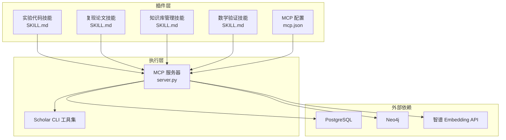
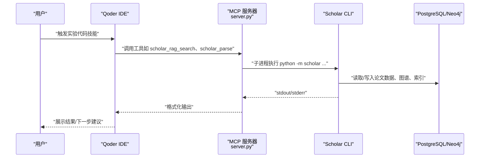
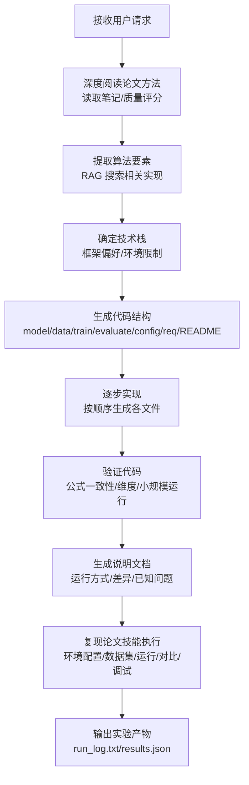
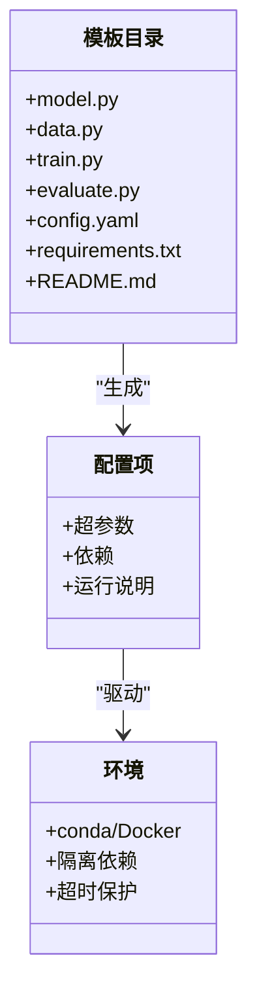
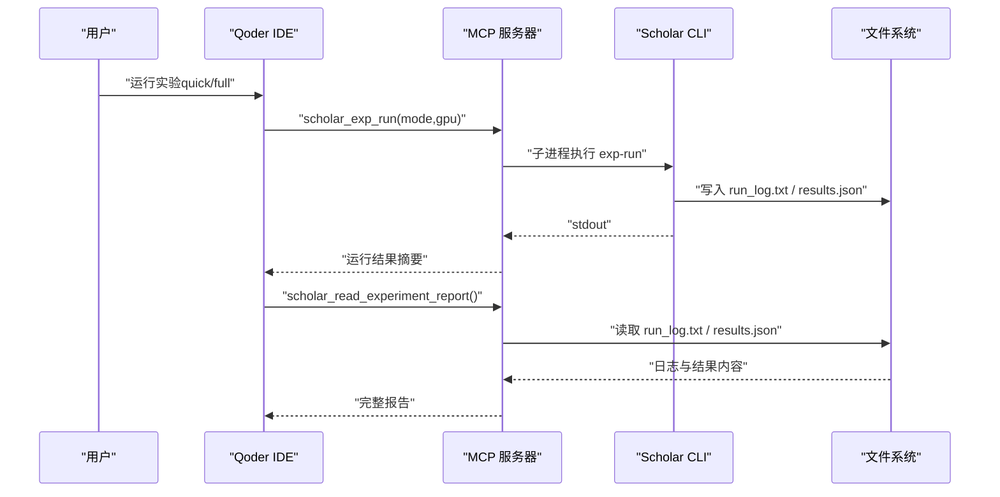
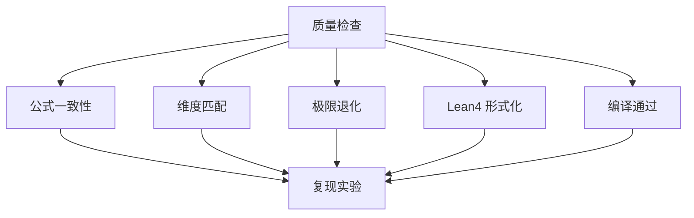
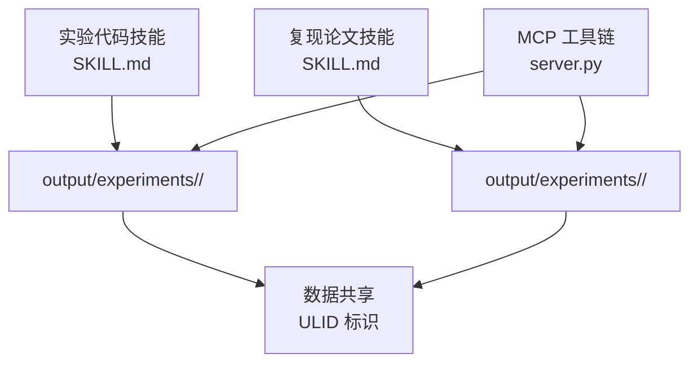
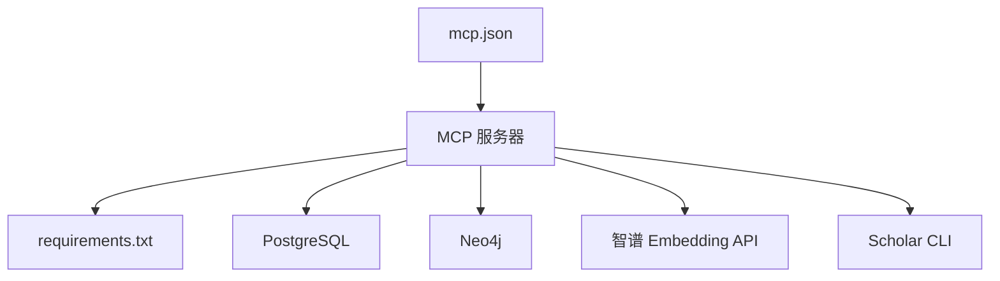

# 实验代码技能

<cite>
**本文档引用的文件**
- [plugin/README.md](file://plugin/README.md)
- [plugin/mcp.json](file://plugin/mcp.json)
- [plugin/CONNECTORS.md](file://plugin/CONNECTORS.md)
- [plugin/skills/experiment-code/SKILL.md](file://plugin/skills/experiment-code/SKILL.md)
- [plugin/skills/reproduce-paper/SKILL.md](file://plugin/skills/reproduce-paper/SKILL.md)
- [plugin/skills/kb-management/SKILL.md](file://plugin/skills/kb-management/SKILL.md)
- [plugin/skills/math-verification/SKILL.md](file://plugin/skills/math-verification/SKILL.md)
- [scholar_mcp/server.py](file://scholar_mcp/server.py)
- [requirements.txt](file://requirements.txt)
</cite>

## 目录
1. [简介](#简介)
2. [项目结构](#项目结构)
3. [核心组件](#核心组件)
4. [架构总览](#架构总览)
5. [详细组件分析](#详细组件分析)
6. [依赖分析](#依赖分析)
7. [性能考虑](#性能考虑)
8. [故障排查指南](#故障排查指南)
9. [结论](#结论)
10. [附录](#附录)

## 简介
本文件为“实验代码技能”模块的开发文档，聚焦于“根据论文方法与公式生成 PyTorch 实验代码”的全流程，涵盖代码模板系统、参数配置与环境管理、安全沙箱与资源监控、结果收集与对比、代码质量检查、版本控制与复现实验，以及与实验复现框架的数据共享机制。该模块以插件形式提供技能与工作流，通过 MCP 服务器对接主仓库的 Python 后端与数据库，形成“提示→工具调用→执行→产出”的闭环。

## 项目结构
- 插件层：提供 14 个技能、4 个命令、规则与钩子，以及 MCP 服务器配置。
- 执行层：主仓库的 scholar CLI 与 MCP 服务器负责论文解析、检索、图谱、RAG、实验执行与结果读取。
- 外部依赖：PostgreSQL、Neo4j、可选智谱嵌入 API，以及 Scholar Python 包。

图表来源
- [plugin/README.md:1-79](file://plugin/README.md#L1-L79)
- [plugin/mcp.json:1-16](file://plugin/mcp.json#L1-L16)
- [plugin/skills/experiment-code/SKILL.md:1-111](file://plugin/skills/experiment-code/SKILL.md#L1-L111)
- [plugin/skills/reproduce-paper/SKILL.md:1-69](file://plugin/skills/reproduce-paper/SKILL.md#L1-L69)
- [plugin/skills/kb-management/SKILL.md:1-59](file://plugin/skills/kb-management/SKILL.md#L1-L59)
- [plugin/skills/math-verification/SKILL.md:1-101](file://plugin/skills/math-verification/SKILL.md#L1-L101)
- [scholar_mcp/server.py:1-631](file://scholar_mcp/server.py#L1-L631)

章节来源
- [plugin/README.md:1-79](file://plugin/README.md#L1-L79)
- [plugin/mcp.json:1-16](file://plugin/mcp.json#L1-L16)
- [plugin/CONNECTORS.md:1-45](file://plugin/CONNECTORS.md#L1-L45)

## 核心组件
- 实验代码技能（experiment-code）
  - 触发条件：用户请求“复现实验”“生成代码”“写实验脚本”“实现这个方法”“跑一下这个实验”。
  - 流程要点：深度阅读论文方法→提取算法要素→确定技术栈→生成代码结构→逐步实现→验证代码→生成说明文档。
  - 产物：实验目录结构包含 model.py、data.py、train.py、evaluate.py、config.yaml、requirements.txt、README.md。
- 复现论文技能（reproduce-paper）
  - 触发条件：用户请求“复现 XX 论文”“reproduce”“运行实验”。
  - 流程要点：深度阅读论文→配置运行环境（conda 环境）→生成实验代码→下载数据集（如需要）→运行实验（quick/full）→对比结果→调试失败。
- 知识库管理技能（kb-management）
  - 触发条件：用户请求“维护知识库”“更新知识库”“kb-update”。
  - 流程要点：健康检查→自动更新→元数据回填→补全缺失字段→引用解析+图谱同步→RAG 索引同步→输出维护报告。
- 数学验证技能（math-verification）
  - 触发条件：用户请求“验证这个公式”“检查数学推导”“形式化验证”。
  - 流程要点：定位目标公式→提取公式上下文→语义分析→对照 Lean4 已有定义→形式化尝试→编译验证→生成验证报告。

章节来源
- [plugin/skills/experiment-code/SKILL.md:6-111](file://plugin/skills/experiment-code/SKILL.md#L6-L111)
- [plugin/skills/reproduce-paper/SKILL.md:6-69](file://plugin/skills/reproduce-paper/SKILL.md#L6-L69)
- [plugin/skills/kb-management/SKILL.md:6-59](file://plugin/skills/kb-management/SKILL.md#L6-L59)
- [plugin/skills/math-verification/SKILL.md:6-101](file://plugin/skills/math-verification/SKILL.md#L6-L101)

## 架构总览
插件通过 MCP 服务器暴露工具，由 Qoder IDE 调用，最终落地到主仓库的 scholar CLI。MCP 服务器封装子进程执行 scholar 子命令，统一返回标准输出与错误信息，并设置超时保护。外部依赖通过环境变量与容器化服务提供。

图表来源
- [scholar_mcp/server.py:23-36](file://scholar_mcp/server.py#L23-L36)
- [plugin/mcp.json:1-16](file://plugin/mcp.json#L1-L16)
- [plugin/CONNECTORS.md:1-45](file://plugin/CONNECTORS.md#L1-L45)

## 详细组件分析

### 实验代码技能：自动生成、执行与结果分析
- 自动生成
  - 步骤一：深度阅读论文方法，读取预生成笔记与质量评分，提取核心算法、关键公式、实验设置与模型架构。
  - 步骤二：提取算法要素，结合 RAG 搜索查找相关实现，明确输入/输出、核心循环、损失函数与优化目标。
  - 步骤三：确定技术栈，与用户确认框架偏好、是否使用现有库、运行环境（GPU 型号、内存限制）。
  - 步骤四：生成代码结构，创建实验目录，包含 model.py、data.py、train.py、evaluate.py、config.yaml、requirements.txt、README.md。
  - 步骤五：按序实现，先 config.yaml，再 model.py、data.py、train.py、evaluate.py，每个文件添加注释说明对应论文章节/公式。
  - 步骤六：验证代码，检查公式一致性与维度匹配，尝试小数据集 dry run。
  - 步骤七：生成说明文档，包含对应论文、文件说明、运行方式、差异与已知问题。
- 执行与结果分析
  - 复现论文技能提供端到端执行：环境配置（conda）、代码生成、数据集下载、运行实验（quick/full，带超时保护）、结果对比与调试。
  - MCP 工具链提供实验运行、比较与日志读取，便于自动化与可视化。
- 代码质量与复现实验
  - 代码质量检查：公式一致性、维度检查、极限退化、编译通过（Lean4 形式化验证）。
  - 版本控制与复现实验：通过 ULID 标识论文与实验产物，确保可追溯；README.md 提供标准化运行说明；requirements.txt 明确依赖。

图表来源
- [plugin/skills/experiment-code/SKILL.md:11-94](file://plugin/skills/experiment-code/SKILL.md#L11-L94)
- [plugin/skills/reproduce-paper/SKILL.md:18-62](file://plugin/skills/reproduce-paper/SKILL.md#L18-L62)

章节来源
- [plugin/skills/experiment-code/SKILL.md:6-111](file://plugin/skills/experiment-code/SKILL.md#L6-L111)
- [plugin/skills/reproduce-paper/SKILL.md:6-69](file://plugin/skills/reproduce-paper/SKILL.md#L6-L69)

### 代码模板系统与参数配置
- 模板系统
  - 以“实验目录结构”为核心模板，强制包含 model.py、data.py、train.py、evaluate.py、config.yaml、requirements.txt、README.md，确保生成代码具备可运行性与可维护性。
- 参数配置
  - config.yaml 从论文实验部分提取超参数；requirements.txt 由 exp-setup 自动检测并创建；README.md 提供标准化运行说明。
- 环境管理机制
  - 使用 conda 环境隔离依赖，环境名称以“scholar-<ULID[:8]>”命名；支持 Docker 选项；exp-setup 自动安装依赖。

图表来源
- [plugin/skills/experiment-code/SKILL.md:42-53](file://plugin/skills/experiment-code/SKILL.md#L42-L53)
- [plugin/skills/experiment-code/SKILL.md:55-68](file://plugin/skills/experiment-code/SKILL.md#L55-L68)
- [plugin/skills/reproduce-paper/SKILL.md:18-24](file://plugin/skills/reproduce-paper/SKILL.md#L18-L24)

章节来源
- [plugin/skills/experiment-code/SKILL.md:42-68](file://plugin/skills/experiment-code/SKILL.md#L42-L68)
- [plugin/skills/reproduce-paper/SKILL.md:18-24](file://plugin/skills/reproduce-paper/SKILL.md#L18-L24)

### 安全沙箱、资源监控与结果收集
- 安全沙箱
  - MCP 服务器通过子进程执行 scholar 命令，限制在项目根目录，避免任意命令注入；对危险命令提供拦截钩子。
- 资源监控
  - 实验运行模式支持 quick（CPU + 合成数据）与 full（完整训练流程，可能需要 GPU）；默认超时保护为 1 小时；可通过 MCP 工具传参调整。
- 结果收集
  - 运行日志与结果以标准文件形式输出：run_log.txt、results.json；MCP 工具提供读取接口，便于后续对比与调试。

图表来源
- [scholar_mcp/server.py:517-567](file://scholar_mcp/server.py#L517-L567)
- [plugin/skills/reproduce-paper/SKILL.md:42-55](file://plugin/skills/reproduce-paper/SKILL.md#L42-L55)

章节来源
- [scholar_mcp/server.py:23-36](file://scholar_mcp/server.py#L23-L36)
- [plugin/skills/reproduce-paper/SKILL.md:42-62](file://plugin/skills/reproduce-paper/SKILL.md#L42-L62)

### 代码质量检查、版本控制与复现实验
- 代码质量检查
  - 语义一致性：公式与论文一致、维度匹配、极限退化合理。
  - 形式化验证：Lean4 编译通过视为形式化验证通过；失败则记录原因。
- 版本控制与复现实验
  - 以 ULID 标识论文与实验产物，确保可追溯；README.md 提供标准化运行说明；requirements.txt 明确依赖；exp-setup 自动创建环境。
  - 与实验复现框架集成：复现论文技能提供从环境配置到结果对比的完整流程，实验代码技能生成的代码可作为复现基线。

图表来源
- [plugin/skills/math-verification/SKILL.md:26-60](file://plugin/skills/math-verification/SKILL.md#L26-L60)
- [plugin/skills/experiment-code/SKILL.md:65-68](file://plugin/skills/experiment-code/SKILL.md#L65-L68)
- [plugin/skills/reproduce-paper/SKILL.md:50-55](file://plugin/skills/reproduce-paper/SKILL.md#L50-L55)

章节来源
- [plugin/skills/math-verification/SKILL.md:62-85](file://plugin/skills/math-verification/SKILL.md#L62-L85)
- [plugin/skills/experiment-code/SKILL.md:96-101](file://plugin/skills/experiment-code/SKILL.md#L96-L101)
- [plugin/skills/reproduce-paper/SKILL.md:64-69](file://plugin/skills/reproduce-paper/SKILL.md#L64-L69)

### 与实验复现框架的集成与数据共享
- 集成点
  - MCP 工具链提供 exp-setup、exp-run、exp-compare、exp-debug、dataset-download、read_experiment_report 等工具，与复现论文技能无缝衔接。
- 数据共享
  - 通过文件系统共享：output/experiments/<ULID>/ 下的 run_log.txt、results.json、README.md 等；通过输出目录共享：output/notes/、output/parsed/ 等。
  - 通过 ULID 标识论文与实验产物，确保跨模块数据一致性。

图表来源
- [plugin/skills/experiment-code/SKILL.md:103-111](file://plugin/skills/experiment-code/SKILL.md#L103-L111)
- [plugin/skills/reproduce-paper/SKILL.md:64-69](file://plugin/skills/reproduce-paper/SKILL.md#L64-L69)
- [scholar_mcp/server.py:581-601](file://scholar_mcp/server.py#L581-L601)

章节来源
- [plugin/skills/experiment-code/SKILL.md:103-111](file://plugin/skills/experiment-code/SKILL.md#L103-L111)
- [plugin/skills/reproduce-paper/SKILL.md:64-69](file://plugin/skills/reproduce-paper/SKILL.md#L64-L69)
- [scholar_mcp/server.py:581-601](file://scholar_mcp/server.py#L581-L601)

## 依赖分析
- 插件依赖
  - MCP 服务器通过 mcp.json 指定 scholar MCP 服务命令与环境变量（PostgreSQL/Neo4j 地址）。
  - 插件 README 说明插件与主仓库的关系：插件提供技能与工具定义，实际执行依赖主仓库的 Python 包与数据库。
- 外部依赖
  - PostgreSQL：存储论文元数据、章节、公式、引用关系。
  - Neo4j：引用网络分析、概念图谱查询。
  - 智谱 Embedding API：RAG 语义检索（可选）。
  - Scholar Python 包：CLI 与 MCP 服务器后端。

图表来源
- [plugin/mcp.json:1-16](file://plugin/mcp.json#L1-L16)
- [requirements.txt:1-14](file://requirements.txt#L1-L14)
- [plugin/CONNECTORS.md:1-45](file://plugin/CONNECTORS.md#L1-L45)

章节来源
- [plugin/mcp.json:1-16](file://plugin/mcp.json#L1-L16)
- [requirements.txt:1-14](file://requirements.txt#L1-L14)
- [plugin/CONNECTORS.md:1-45](file://plugin/CONNECTORS.md#L1-L45)

## 性能考虑
- 搜索与解析
  - RAG 索引构建与搜索受智谱 API 速率限制影响，建议合理设置并发与缓存策略。
  - 批量解析与图谱构建耗时较长，建议在空闲时段执行。
- 实验执行
  - quick 模式优先保证快速验证；full 模式需 GPU 资源与充足内存，注意超时与资源上限。
  - 数据集下载可能受限于网络与第三方平台，建议提前准备或使用缓存镜像。
- I/O 与存储
  - 大型论文与实验产物会占用磁盘空间，建议定期清理与归档。

## 故障排查指南
- 常见错误与诊断
  - ModuleNotFoundError：检查 requirements.txt 与 conda 环境是否正确安装。
  - CUDA OOM：切换 quick 模式或降低 batch size；必要时使用 CPU。
  - FileNotFoundError：确认数据集下载路径与文件存在；检查相对路径与工作目录。
- 调试工具
  - 使用 exp-debug 读取 run_log.txt 并自动诊断常见错误，提供修复建议。
  - 通过 MCP 工具读取实验报告与编译日志，定位问题根因。

章节来源
- [plugin/skills/reproduce-paper/SKILL.md:57-62](file://plugin/skills/reproduce-paper/SKILL.md#L57-L62)
- [scholar_mcp/server.py:560-567](file://scholar_mcp/server.py#L560-L567)

## 结论
实验代码技能模块通过清晰的工作流与工具链，实现了从论文方法到可运行实验代码的自动化生成，并与复现论文技能形成端到端闭环。借助 MCP 服务器与外部数据库，系统具备良好的扩展性与可维护性。建议在实际使用中严格遵循质量检查与版本控制规范，确保实验可复现与可追溯。

## 附录
- 技能与命令概览
  - 技能：paper-ingestion、math-verification、paper-recommendation、citation-network、research-gap、review-report、cold-start、experiment-code、research-survey、paper-deep-dive、writing-pipeline、reproduce-paper、idea-to-paper、kb-management。
  - 命令：stats、find、paper、health。
- MCP 工具清单（节选）
  - scholar_exp_setup、scholar_exp_run、scholar_exp_compare、scholar_exp_debug、scholar_dataset_download、scholar_read_experiment_report、scholar_rag_search、scholar_graph_query、scholar_kb_update 等。

章节来源
- [plugin/README.md:60-79](file://plugin/README.md#L60-L79)
- [scholar_mcp/server.py:498-623](file://scholar_mcp/server.py#L498-L623)