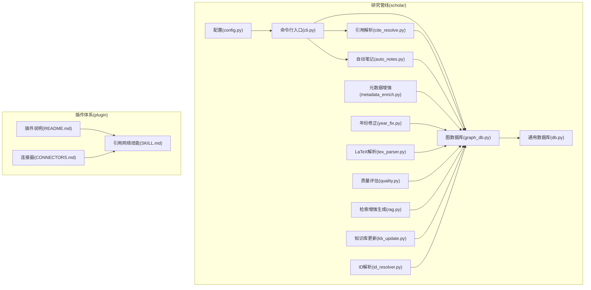
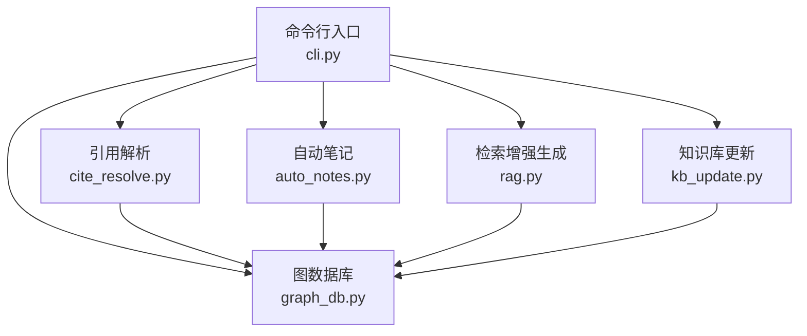
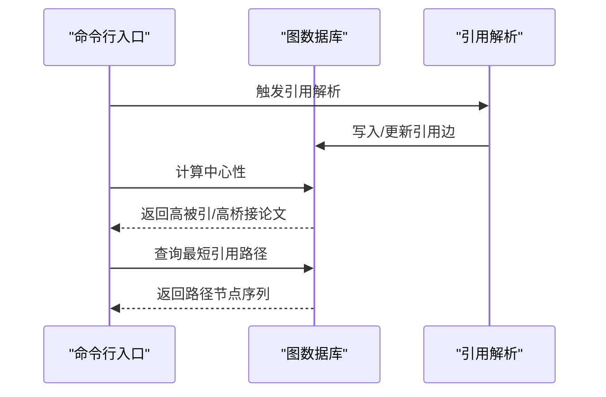
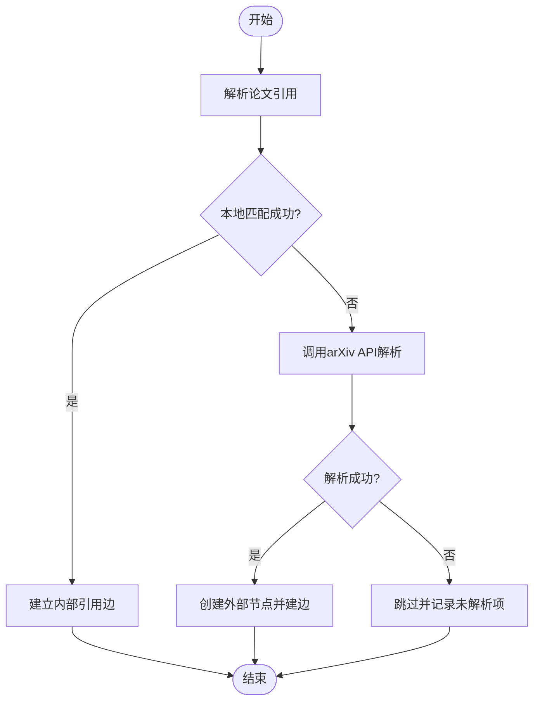
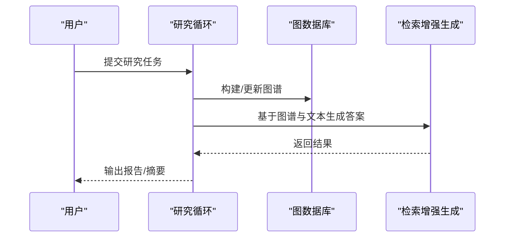
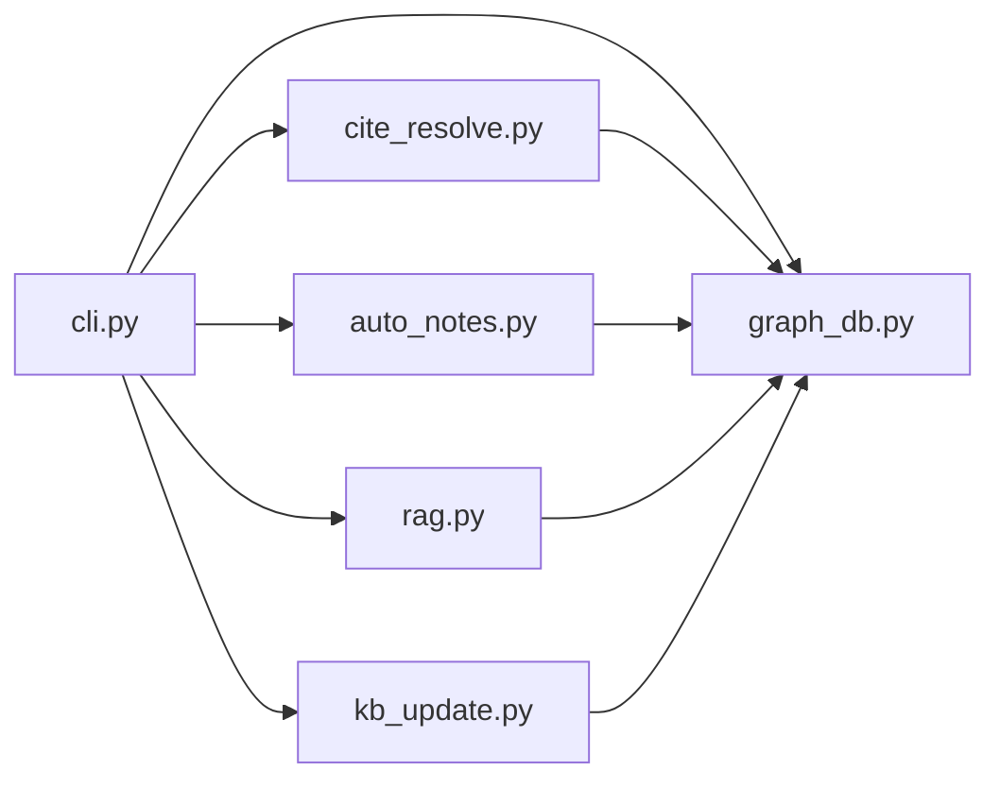

# 引用网络技能

<cite>
**本文档引用的文件**
- [graph_db.py](file://scholar/graph_db.py)
- [cli.py](file://scholar/cli.py)
- [cite_resolve.py](file://scholar/cite_resolve.py)
- [auto_notes.py](file://scholar/auto_notes.py)
- [db.py](file://scholar/db.py)
- [metadata_enrich.py](file://scholar/metadata_enrich.py)
- [year_fix.py](file://scholar/year_fix.py)
- [research_loop.py](file://scholar/research_loop.py)
- [tex_parser.py](file://scholar/tex_parser.py)
- [quality.py](file://scholar/quality.py)
- [rag.py](file://scholar/rag.py)
- [kb_update.py](file://scholar/kb_update.py)
- [id_resolver.py](file://scholar/id_resolver.py)
- [config.py](file://scholar/config.py)
- [README.md](file://plugin/README.md)
- [CONNECTORS.md](file://plugin/CONNECTORS.md)
- [SKILL.md](file://plugin/skills/citation-network/SKILL.md)
</cite>

## 目录
1. [引言](#引言)
2. [项目结构](#项目结构)
3. [核心组件](#核心组件)
4. [架构总览](#架构总览)
5. [详细组件分析](#详细组件分析)
6. [依赖分析](#依赖分析)
7. [性能考虑](#性能考虑)
8. [故障排除指南](#故障排除指南)
9. [结论](#结论)
10. [附录](#附录)

## 引言
本文件面向“引用网络技能”模块，系统化梳理学术论文引用关系的挖掘与分析能力，覆盖引用网络构建、中心性分析、路径查询、概念图谱联动、以及可视化与交互探索的工程实践。文档以仓库中已实现的图数据库操作、CLI 工作流、引用解析与笔记自动化等模块为基础，给出可落地的分析流程与扩展建议，帮助读者在研究方向选择与热点追踪中高效利用引用网络。

## 项目结构
该仓库采用分层组织：核心 AI 演化框架（LEAN）位于顶层，研究管线（scholar）负责论文数据处理与图谱构建，插件体系（plugin）提供技能与连接器定义。引用网络技能主要由 scholar 子系统支撑，围绕图数据库（GraphDB）进行引用边构建、解析与度量。

图表来源
- [cli.py](file://scholar/cli.py)
- [graph_db.py](file://scholar/graph_db.py)
- [cite_resolve.py](file://scholar/cite_resolve.py)
- [auto_notes.py](file://scholar/auto_notes.py)
- [db.py](file://scholar/db.py)
- [metadata_enrich.py](file://scholar/metadata_enrich.py)
- [year_fix.py](file://scholar/year_fix.py)
- [tex_parser.py](file://scholar/tex_parser.py)
- [quality.py](file://scholar/quality.py)
- [rag.py](file://scholar/rag.py)
- [kb_update.py](file://scholar/kb_update.py)
- [id_resolver.py](file://scholar/id_resolver.py)
- [config.py](file://scholar/config.py)
- [README.md](file://plugin/README.md)
- [CONNECTORS.md](file://plugin/CONNECTORS.md)
- [SKILL.md](file://plugin/skills/citation-network/SKILL.md)

章节来源
- [cli.py](file://scholar/cli.py)
- [graph_db.py](file://scholar/graph_db.py)
- [README.md](file://plugin/README.md)
- [CONNECTORS.md](file://plugin/CONNECTORS.md)
- [SKILL.md](file://plugin/skills/citation-network/SKILL.md)

## 核心组件
- 图数据库与引用网络
  - 引用边构建与解析：支持从 ref_key 到目标论文的解析与合并，清理孤立节点，统计已解析/未解析边数。
  - 中心性度量：计算入度、出度与桥接分数，并输出高被引与高桥接论文列表。
  - 路径查询：基于最短路径查找两篇论文之间的引用路径。
- 引用解析与笔记
  - 引用解析：将原始引用键映射到内部论文或外部 arXiv 条目。
  - 自动笔记：抽取论文中的参考文献信息，生成参考文献概要。
- 研究循环与检索增强
  - 研究循环：驱动从输入到图谱更新的完整工作流。
  - 检索增强生成：结合图谱与文本内容进行问答与摘要生成。
- 元数据与质量控制
  - 元数据增强：补充缺失字段，统一格式。
  - 年份修正：修复异常年份。
  - 质量评估：对论文条目进行质量打分与清洗。
- 知识库与ID解析
  - 知识库更新：将图谱结果写回知识库。
  - ID 解析：统一论文标识符，确保跨模块一致性。

章节来源
- [graph_db.py](file://scholar/graph_db.py)
- [cite_resolve.py](file://scholar/cite_resolve.py)
- [auto_notes.py](file://scholar/auto_notes.py)
- [research_loop.py](file://scholar/research_loop.py)
- [rag.py](file://scholar/rag.py)
- [metadata_enrich.py](file://scholar/metadata_enrich.py)
- [year_fix.py](file://scholar/year_fix.py)
- [quality.py](file://scholar/quality.py)
- [kb_update.py](file://scholar/kb_update.py)
- [id_resolver.py](file://scholar/id_resolver.py)

## 架构总览
下图展示引用网络技能在整体研究管线中的位置与交互关系：CLI 作为入口协调各模块；GraphDB 承载引用网络与概念图谱；Resolver 负责引用解析；AutoNotes 产出参考文献摘要；RAG 基于图谱与文本进行推理；KB 更新将结果持久化。

图表来源
- [cli.py](file://scholar/cli.py)
- [graph_db.py](file://scholar/graph_db.py)
- [cite_resolve.py](file://scholar/cite_resolve.py)
- [auto_notes.py](file://scholar/auto_notes.py)
- [rag.py](file://scholar/rag.py)
- [kb_update.py](file://scholar/kb_update.py)

## 详细组件分析

### 组件一：图数据库与引用网络
- 功能职责
  - 引用边解析与重建：批量处理引用边，删除旧边，合并新边，清理无关联的 ref_key 节点。
  - 中心性计算：统计入度、出度与桥接分数，筛选高被引与高桥接论文。
  - 路径查询：基于最短路径返回节点序列与标题列表。
  - 统计汇总：输出论文节点、引用边、概念边、替换边与孤立节点数量。
- 关键流程
  - 引用解析与重建流程
  - 中心性计算与排序流程
  - 最短路径查询流程
- 复杂度与性能
  - 边解析与重建涉及批量 UNWIND 与 MERGE，复杂度与边数线性相关。
  - 中心性计算包含多次 OPTIONAL MATCH 与聚合，建议在大规模图上建立适当索引。
  - 最短路径查询受图连通性与节点密度影响，建议限制查询范围或使用启发式策略。

图表来源
- [cli.py](file://scholar/cli.py)
- [graph_db.py](file://scholar/graph_db.py)
- [cite_resolve.py](file://scholar/cite_resolve.py)

章节来源
- [graph_db.py](file://scholar/graph_db.py)
- [cli.py](file://scholar/cli.py)

### 组件二：引用解析与笔记自动化
- 功能职责
  - 引用解析：尝试将 ref_key 映射到内部论文，否则通过 arXiv API 进行外部解析。
  - 笔记自动化：从论文数据中提取参考文献，生成参考文献概要与统计。
- 关键流程
  - 引用解析流程（本地匹配优先，外网回退）
  - 参考文献抽取与摘要生成流程
- 复杂度与性能
  - 本地匹配为 O(1) 或 O(log N) 查找，外网请求受 API 延迟与限流影响。
  - 抽取与统计为线性扫描，建议缓存解析结果以提升重复运行效率。

图表来源
- [cite_resolve.py](file://scholar/cite_resolve.py)

章节来源
- [cite_resolve.py](file://scholar/cite_resolve.py)
- [auto_notes.py](file://scholar/auto_notes.py)

### 组件三：研究循环与检索增强
- 功能职责
  - 研究循环：串联数据摄取、解析、图谱构建、度量与输出。
  - 检索增强生成：基于图谱与文本内容生成回答与摘要。
- 关键流程
  - 研究循环执行流程
  - 检索增强生成流程
- 复杂度与性能
  - 循环内各步骤串行执行，整体性能取决于最慢环节（如外部 API 调用）。
  - RAG 的检索与生成成本较高，建议缓存常用查询结果与向量索引。

图表来源
- [research_loop.py](file://scholar/research_loop.py)
- [rag.py](file://scholar/rag.py)
- [graph_db.py](file://scholar/graph_db.py)

章节来源
- [research_loop.py](file://scholar/research_loop.py)
- [rag.py](file://scholar/rag.py)

### 组件四：元数据与质量控制
- 功能职责
  - 元数据增强：补全缺失字段，统一格式与标准。
  - 年份修正：识别并修正异常年份。
  - 质量评估：对论文条目进行评分与清洗。
- 关键流程
  - 元数据补全流程
  - 年份校验与修正流程
  - 质量评分与过滤流程

章节来源
- [metadata_enrich.py](file://scholar/metadata_enrich.py)
- [year_fix.py](file://scholar/year_fix.py)
- [quality.py](file://scholar/quality.py)

### 组件五：知识库与ID解析
- 功能职责
  - 知识库更新：将图谱结果写回知识库，保持一致性。
  - ID 解析：统一论文标识符，避免跨模块冲突。
- 关键流程
  - 结果写回知识库流程
  - ID 统一与去重流程

章节来源
- [kb_update.py](file://scholar/kb_update.py)
- [id_resolver.py](file://scholar/id_resolver.py)

## 依赖分析
- 模块耦合
  - CLI 是编排者，依赖所有子模块；GraphDB 为核心存储与计算单元，被多个模块读写。
  - 引用解析与笔记模块对 GraphDB 有写入依赖，同时被 CLI 调用。
  - RAG 依赖 GraphDB 与文本解析模块，形成“图+文”的混合推理链。
- 外部依赖
  - arXiv API 用于外部引用解析，需注意速率限制与失败重试。
  - 图数据库（Neo4j/Cypher）用于图谱存储与查询。
- 潜在风险
  - 大规模图谱查询可能成为瓶颈，建议引入索引与分页。
  - 外部 API 不稳定时需完善降级与重试策略。

图表来源
- [cli.py](file://scholar/cli.py)
- [graph_db.py](file://scholar/graph_db.py)
- [cite_resolve.py](file://scholar/cite_resolve.py)
- [auto_notes.py](file://scholar/auto_notes.py)
- [rag.py](file://scholar/rag.py)
- [kb_update.py](file://scholar/kb_update.py)

章节来源
- [cli.py](file://scholar/cli.py)
- [graph_db.py](file://scholar/graph_db.py)

## 性能考虑
- 图查询优化
  - 在论文节点与引用关系上建立索引，加速入度/出度与桥接分数计算。
  - 对最短路径查询设置深度上限与候选集过滤，避免全图扫描。
- 批处理与缓存
  - 引用解析采用批处理模式，减少事务开销；缓存解析结果，降低重复调用。
  - RAG 与检索模块缓存常用向量与中间结果。
- 外部接口治理
  - 引用解析与 arXiv API 调用增加重试与退避机制，设置超时阈值。
- 数据质量前置
  - 元数据增强与质量评估提前清洗脏数据，减少后续计算负担。

## 故障排除指南
- 引用解析失败
  - 现象：ref_key 无法解析为内部论文或外部条目。
  - 排查：确认本地论文库是否包含目标；检查 arXiv API 可达性与配额；查看未解析条目统计。
  - 处置：补充缺失元数据后重跑解析；必要时人工标注。
- 中心性计算异常
  - 现象：入度/出度或桥接分数为空或异常。
  - 排查：确认引用边是否正确写入；检查孤立节点与自环边；验证 Cypher 查询逻辑。
  - 处置：清理异常边后重新计算。
- 最短路径查询超时
  - 现象：路径查询耗时过长或无结果。
  - 排查：检查两点连通性；缩小查询范围；限制路径长度。
  - 处置：引入启发式搜索或预计算关键路径。
- 知识库写入失败
  - 现象：图谱更新后知识库未同步。
  - 排查：检查写回流程日志；确认目标数据库连接与权限。
  - 处置：重试写入并监控事务状态。

章节来源
- [graph_db.py](file://scholar/graph_db.py)
- [cite_resolve.py](file://scholar/cite_resolve.py)
- [kb_update.py](file://scholar/kb_update.py)

## 结论
引用网络技能以图数据库为核心，结合引用解析、中心性分析与路径查询，形成了从数据到洞察的闭环。通过研究循环与检索增强，系统能够支持热点追踪与方向选择。建议在生产环境中强化索引、缓存与外部接口治理，持续迭代以适配更大规模与更复杂的引用关系。

## 附录
- 可视化与交互探索
  - 建议在现有图查询基础上，导出子图（如高被引论文及其邻居）至可视化平台，支持交互式浏览与筛选。
  - 将中心性指标与时间维度结合，生成动态热力图或趋势折线，辅助热点追踪。
- 应用场景
  - 研究方向选择：基于高桥接论文与概念共现图谱，识别交叉领域与潜在突破点。
  - 热点追踪：按年份切片统计被引趋势，结合主题标签进行聚类分析。
- 扩展建议
  - 引入社区发现算法（如 Louvain 或 Leiden）对论文进行聚类，识别研究社区与演化路径。
  - 构建影响力评估模型（如改进的 PageRank 或 HITS），结合引用强度与作者影响力进行综合评分。
  - 集成时间序列预测（如 ARIMA 或 Prophet）对引用趋势进行短期预测，指导选题时机。