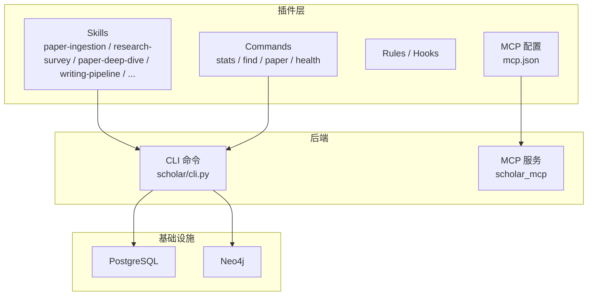
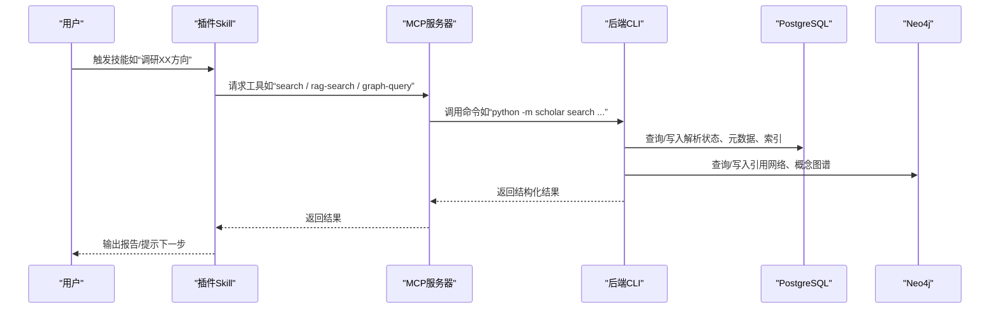
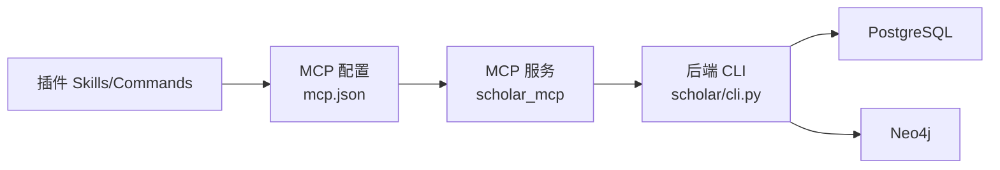

# 技能模块系统

<cite>
**本文档引用的文件**
- [plugin/README.md](file://plugin/README.md)
- [plugin/mcp.json](file://plugin/mcp.json)
- [plugin/skills/adaptive-research/SKILL.md](file://plugin/skills/adaptive-research/SKILL.md)
- [plugin/skills/kb-management/SKILL.md](file://plugin/skills/kb-management/SKILL.md)
- [plugin/skills/paper-recommendation/SKILL.md](file://plugin/skills/paper-recommendation/SKILL.md)
- [plugin/skills/writing-pipeline/SKILL.md](file://plugin/skills/writing-pipeline/SKILL.md)
- [plugin/skills/paper-ingestion/SKILL.md](file://plugin/skills/paper-ingestion/SKILL.md)
- [plugin/skills/research-gap/SKILL.md](file://plugin/skills/research-gap/SKILL.md)
- [plugin/skills/research-survey/SKILL.md](file://plugin/skills/research-survey/SKILL.md)
- [plugin/skills/paper-deep-dive/SKILL.md](file://plugin/skills/paper-deep-dive/SKILL.md)
- [plugin/skills/cold-start/SKILL.md](file://plugin/skills/cold-start/SKILL.md)
- [plugin/skills/experiment-code/SKILL.md](file://plugin/skills/experiment-code/SKILL.md)
- [scholar/__main__.py](file://scholar/__main__.py)
- [scholar/cli.py](file://scholar/cli.py)
- [requirements.txt](file://requirements.txt)
</cite>

## 目录
1. [简介](#简介)
2. [项目结构](#项目结构)
3. [核心组件](#核心组件)
4. [架构总览](#架构总览)
5. [详细组件分析](#详细组件分析)
6. [依赖分析](#依赖分析)
7. [性能考虑](#性能考虑)
8. [故障排查指南](#故障排查指南)
9. [结论](#结论)
10. [附录](#附录)

## 简介
本技能模块系统围绕“学术研究自动化”目标，提供从论文入库、知识库维护、引用网络分析、研究空白发现，到论文推荐、深度分析与端到端写作的完整工作流。系统由“插件层（Skills/Commands/Rules/Hooks/MCP）+ 后端CLI（scholar）+ 数据库/图数据库”三层组成，插件负责定义“做什么、如何做”，后端负责“执行搜索、解析、入库、检索、图谱构建”等任务。

## 项目结构
- 插件层（plugin）
  - skills/*：14个技能（原子技能8个 + 工作流6个），每个技能以SKILL.md描述触发条件、流程、步骤与下一步动作
  - commands/*：命令规则（find/health/paper/resume/stats等）
  - rules/*：规则（身份、引导、工具使用、管道）
  - hooks/*：钩子（危险命令拦截、日志、任务完成通知）
  - mcp.json：MCP服务器配置，指向后端scholar_mcp入口
  - README.md：插件总体说明与安装验证
- 后端（scholar）
  - CLI命令集合：scan/parse/parse-all/info/search/list-papers/stats/export-bib/author-fix/arxiv-search/graph-build/graph-stats/graph-query等
  - MCP服务：提供工具接口供插件调用
- 基础设施
  - requirements.txt：Python依赖（Typer、Rich、PostgreSQL驱动、Neo4j驱动、PyMuPDF、MCP等）

图表来源
- [plugin/README.md:1-79](file://plugin/README.md#L1-L79)
- [plugin/mcp.json:1-16](file://plugin/mcp.json#L1-L16)
- [scholar/cli.py:1-800](file://scholar/cli.py#L1-L800)

章节来源
- [plugin/README.md:1-79](file://plugin/README.md#L1-L79)
- [plugin/mcp.json:1-16](file://plugin/mcp.json#L1-L16)
- [requirements.txt:1-14](file://requirements.txt#L1-L14)

## 核心组件
- 技能（Skills）
  - 原子技能：paper-ingestion、paper-recommendation、citation-network、research-gap、review-report、cold-start、experiment-code、math-verification
  - 工作流：research-survey、paper-deep-dive、writing-pipeline、reproduce-paper、idea-to-paper、adaptive-research、kb-management
- 命令（Commands）
  - stats、find、paper、health：用于状态查询、查找、论文操作、健康检查
- 规则（Rules）
  - 身份与角色、引导、工具使用、管道
- 钩子（Hooks）
  - 危险命令拦截、日志、任务完成通知
- MCP
  - mcp.json定义scholar MCP服务器，后端通过scholar_mcp提供工具接口

章节来源
- [plugin/README.md:60-79](file://plugin/README.md#L60-L79)

## 架构总览
插件层通过MCP与后端CLI交互，后端CLI对接数据库与图数据库，完成论文解析、入库、检索、图谱构建与统计分析。插件负责编排工作流，后端负责执行具体任务。

图表来源
- [plugin/README.md:1-17](file://plugin/README.md#L1-L17)
- [plugin/mcp.json:1-16](file://plugin/mcp.json#L1-L16)
- [scholar/cli.py:1-800](file://scholar/cli.py#L1-L800)

## 详细组件分析

### 自适应研究循环（adaptive-research）
- 功能特性
  - 自动追踪研究方向，周期性从arXiv抓取最新论文并完成全流程入库（解析→图谱→RAG→笔记→质量评分→分类）
  - 支持单方向与全方向同步，支持定时任务编排
- 配置与参数
  - category：研究方向类别
  - max：最大抓取/入库数量
- 调用方式
  - 列表/增删方向：python -m scholar interests list/add/remove
  - 同步：python -m scholar research-sync [--category] --max N
  - 统计：python -m scholar stats
- 下一步动作
  - 使用research-survey做深度调研
  - 使用paper-deep-dive精读
  - 使用kb-management维护知识库

章节来源
- [plugin/skills/adaptive-research/SKILL.md:1-68](file://plugin/skills/adaptive-research/SKILL.md#L1-L68)

### 知识库维护（kb-management）
- 功能特性
  - 健康检查、自动更新（arXiv搜索→批量入库）、元数据回填、缺失字段补全、引用解析与图谱同步、RAG索引同步
- 配置与参数
  - query：搜索关键词
  - max：最大抓取数量
- 调用方式
  - 健康检查：python -m scholar stats、scan
  - 自动更新：python -m scholar kb-update --query "<topic>" --max N 或 batch-ingest
  - 元数据回填：python -m scholar metadata-enrich --apply
  - 缺失字段补全：python -m scholar year-fix --apply、author-fix --apply
  - 引用解析与图谱：python -m scholar cite-resolve --apply、graph-build
  - RAG索引：python -m scholar rag-index

章节来源
- [plugin/skills/kb-management/SKILL.md:1-59](file://plugin/skills/kb-management/SKILL.md#L1-L59)

### 论文推荐（paper-recommendation）
- 功能特性
  - 基于引用网络（前向/后向/桥接）、研究方向、阅读缺口三种场景推荐
  - 混合排序：必读/推荐/可选；附带推荐理由、与目标论文关系、难度评估
- 配置与参数
  - hybrid：RAG混合搜索开关
  - tags.domains：按子方向过滤
- 调用方式
  - 引用网络：python -m scholar cite-network <ULID>、graph-stats
  - 方向推荐：python -m scholar search/rag-search/classify/arxiv-search
  - 阅读缺口：python -m scholar list-papers
- 输出
  - output/notes/recommendations-<topic>.md

章节来源
- [plugin/skills/paper-recommendation/SKILL.md:1-96](file://plugin/skills/paper-recommendation/SKILL.md#L1-L96)

### 写作流水线（writing-pipeline）
- 功能特性
  - 端到端学术写作：调研→撰写→编译→审稿，质量门控与编译修复闭环
- 配置与参数
  - depth/full：调研深度
  - limit：调研/搜索上限
- 调用方式
  - 调研：python -m scholar survey "<topic>" --depth full --limit N
  - 大纲：export-bib、输出outline
  - 质量门控：生成review清单
  - 编译：python -m scholar compile-paper，按FATAL/WARN/INFO分类修复
- 输出
  - draft/report/pdf

章节来源
- [plugin/skills/writing-pipeline/SKILL.md:1-135](file://plugin/skills/writing-pipeline/SKILL.md#L1-L135)

### 论文入库（paper-ingestion）
- 功能特性
  - 扫描→批量解析→失败诊断→元数据补全→预处理→统计验证→增量入库
- 调用方式
  - 扫描：python -m scholar scan
  - 批量解析：python -m scholar parse-all
  - 失败诊断：python -m scholar info <ULID>
  - 元数据补全：python -m scholar year-fix --apply、author-fix --apply
  - 预处理：python -m scholar auto-notes、quality-score --all、classify --all
  - 统计：python -m scholar stats
  - 增量：parse <ULID>、stats

章节来源
- [plugin/skills/paper-ingestion/SKILL.md:1-85](file://plugin/skills/paper-ingestion/SKILL.md#L1-L85)

### 研究空白发现（research-gap）
- 功能特性
  - 基于跨论文局限性声明与引用网络、概念演化分析发现研究空白
- 调用方式
  - 分析范围确认
  - 收集局限性声明
  - 交叉分析：共识/矛盾/盲区缺口
  - 引用网络与概念演化辅助
  - arXiv最新动态验证
- 输出
  - output/drafts/research-gaps-<topic>.md

章节来源
- [plugin/skills/research-gap/SKILL.md:1-105](file://plugin/skills/research-gap/SKILL.md#L1-L105)

### 文献调研（research-survey）
- 功能特性
  - 本地双路搜索（关键词+RAG）+ arXiv外部搜索 + 关键词扩展 + 深度阅读 + 概念图谱 + 报告骨架与增量撰写 + 质量门控 + 定向修订
- 调用方式
  - 预检查：stats、classify --list-tags
  - 本地搜索：search、rag-search --hybrid
  - 外部搜索：arxiv-search
  - 关键词扩展、深度阅读Top 5-10、graph-query
  - 报告骨架与增量撰写、质量门控、定向修订、终稿输出

章节来源
- [plugin/skills/research-survey/SKILL.md:1-113](file://plugin/skills/research-survey/SKILL.md#L1-L113)

### 单篇深度分析（paper-deep-dive）
- 功能特性
  - 加载论文数据→深度阅读→质量评估（7维）→公式推导→引用网络分析→生成实验代码框架→质量门控→增量撰写深度报告
- 调用方式
  - 加载：python -m scholar info <paper_id>
  - 质量评估：python -m scholar quality-score <paper_id>
  - 引用网络：python -m scholar cite-network <paper_id>
  - 生成代码：输出到output/experiments/<ULID>/
- 输出
  - output/notes/<ULID>-deep-dive.md

章节来源
- [plugin/skills/paper-deep-dive/SKILL.md:1-84](file://plugin/skills/paper-deep-dive/SKILL.md#L1-L84)

### 冷启动（cold-start）
- 功能特性
  - 陌生领域知识地图与学习路径：本地库评估→arXiv冷启动→构建知识地图→时间线梳理→核心论文精读→与已有知识关联→概念图谱辅助→输出冷启动指南
- 调用方式
  - 评估：search/rag-search
  - arXiv冷启动：arxiv-search
  - 知识地图与时间线：graph-query/graph-stats
  - 输出：output/drafts/cold-start-<topic>.md

章节来源
- [plugin/skills/cold-start/SKILL.md:1-147](file://plugin/skills/cold-start/SKILL.md#L1-L147)

### 实验代码生成（experiment-code）
- 功能特性
  - 基于论文方法与公式生成PyTorch实验代码：提取算法要素→确定技术栈→生成代码结构→逐步实现→验证→生成说明文档
- 调用方式
  - 深度阅读：python -m scholar info <ULID>
  - 生成代码：输出到output/experiments/<paper_id>/
- 输出
  - README.md与代码文件

章节来源
- [plugin/skills/experiment-code/SKILL.md:1-111](file://plugin/skills/experiment-code/SKILL.md#L1-L111)

## 依赖分析
- 插件层依赖后端CLI与数据库/图数据库
- 后端CLI依赖PostgreSQL与Neo4j，提供搜索、解析、入库、图谱构建、统计等功能
- MCP作为桥梁，将插件的意图转化为后端命令执行

图表来源
- [plugin/mcp.json:1-16](file://plugin/mcp.json#L1-L16)
- [scholar/cli.py:1-800](file://scholar/cli.py#L1-L800)

章节来源
- [plugin/README.md:1-79](file://plugin/README.md#L1-L79)
- [requirements.txt:1-14](file://requirements.txt#L1-L14)

## 性能考虑
- 批量解析与搜索
  - parse-all支持limit与force控制，避免重复解析与资源浪费
  - search/rag-search支持limit控制结果规模
- 图谱构建
  - graph-build分步执行（引用网络→引用键解析→中心性→概念图谱→Lean4同步），便于监控与重试
- 编译修复
  - 编译→诊断→修复闭环，按FATAL/WARN分级处理，限制轮次避免无限循环
- I/O与缓存
  - 预生成笔记与JSON便于快速分析，减少重复解析成本
- 数据库与图数据库
  - 优先使用数据库查询，文件模式降级，保证功能可用性

## 故障排查指南
- 知识库不可用
  - 现象：stats显示“not available (file-only mode)”
  - 处理：启动PostgreSQL/Neo4j容器或安装相应驱动
- Neo4j不可用
  - 现象：graph-build/graph-stats报错
  - 处理：docker compose up neo4j，或安装neo4j驱动
- arXiv请求失败
  - 现象：arxiv-search返回失败
  - 处理：检查代理设置，或稍后重试
- 编译日志解析
  - 现象：CLI未输出结构化报告
  - 处理：手动解析.log文件，按FATAL/WARN/INFO分类修复
- 引用/标签未定义
  - 现象：编译时报undefined citation/reference
  - 处理：使用search验证paper_id，补全.bib条目或修正标签拼写

章节来源
- [scholar/cli.py:605-658](file://scholar/cli.py#L605-L658)
- [scholar/cli.py:663-706](file://scholar/cli.py#L663-L706)
- [plugin/skills/writing-pipeline/SKILL.md:77-122](file://plugin/skills/writing-pipeline/SKILL.md#L77-L122)

## 结论
本技能模块系统通过“插件编排 + 后端执行 + 数据库/图数据库”的架构，实现了从论文入库、知识库维护、引用网络分析、研究空白发现，到论文推荐、深度分析与端到端写作的完整闭环。插件层提供清晰的工作流与触发条件，后端提供强大的搜索、解析、入库与图谱能力，适合科研工作者高效开展学术研究与论文写作。

## 附录
- 开发与扩展指南
  - 新增技能：在plugin/skills下新增目录与SKILL.md，定义触发、流程与下一步动作
  - 新增命令：在scholar/cli.py中注册新命令，遵循现有风格与参数命名
  - 集成MCP：在mcp.json中配置新服务器或工具，确保环境变量正确
- 集成示例
  - 在QoderWork中输入“调研Transformer”，自动触发/research-survey
  - 输入“知识库状态”，自动触发/stats命令
- 调试技巧
  - 使用scan与stats核对解析与入库状态
  - 使用info查看单篇解析详情
  - 使用graph-stats与graph-query验证图谱一致性