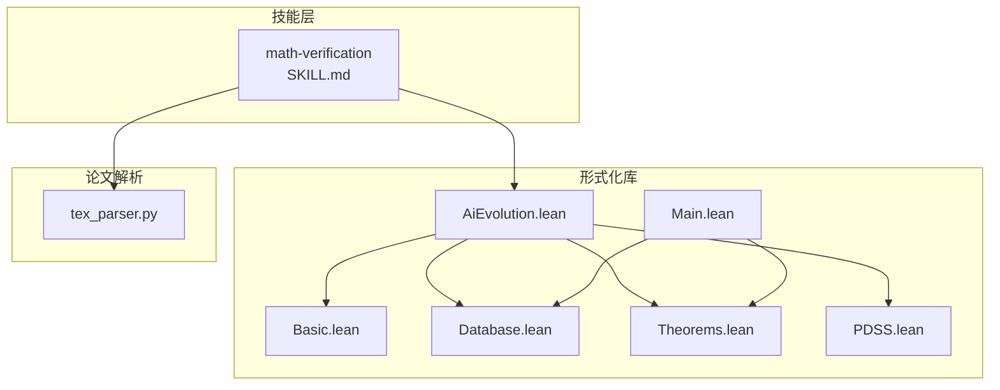
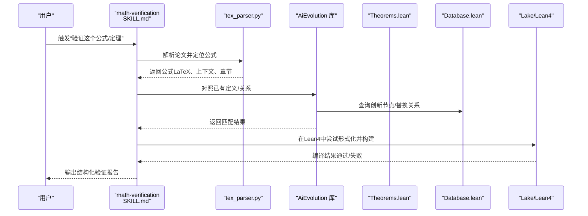
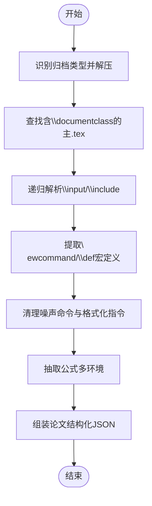
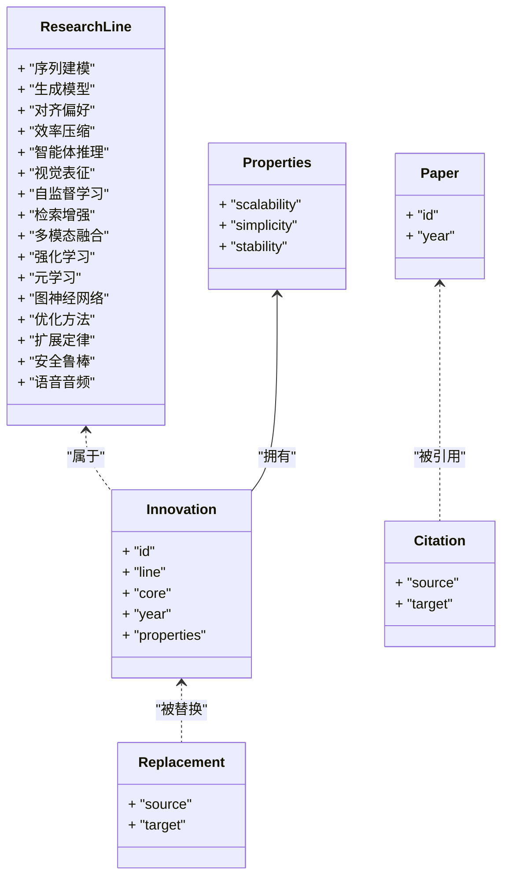
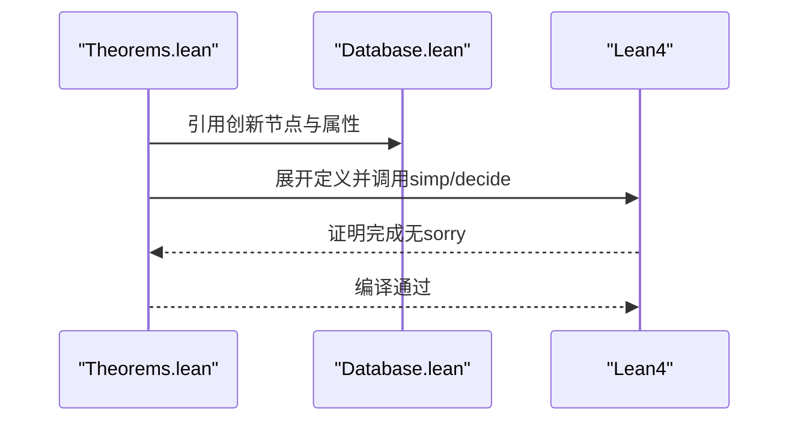
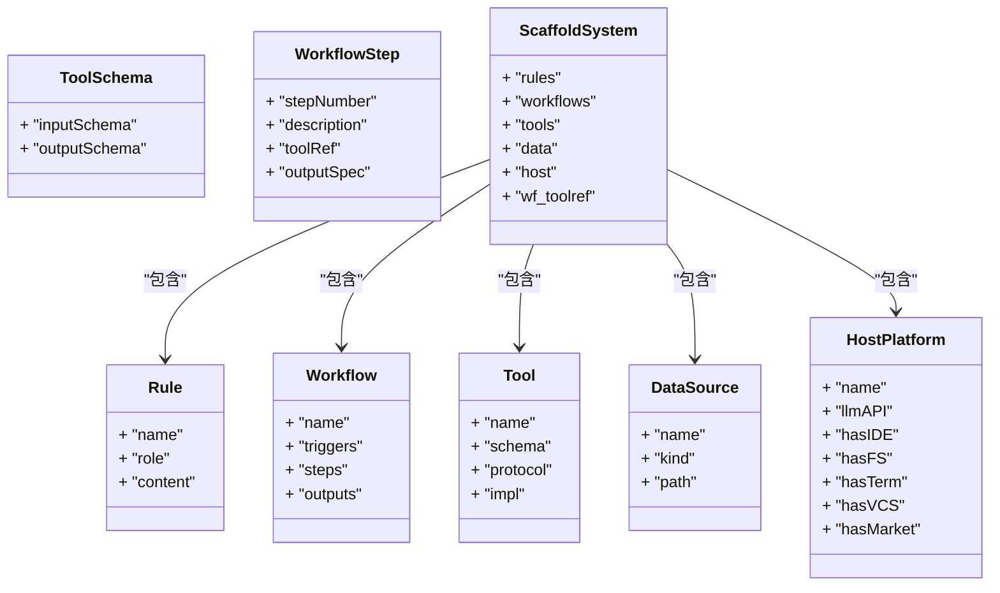
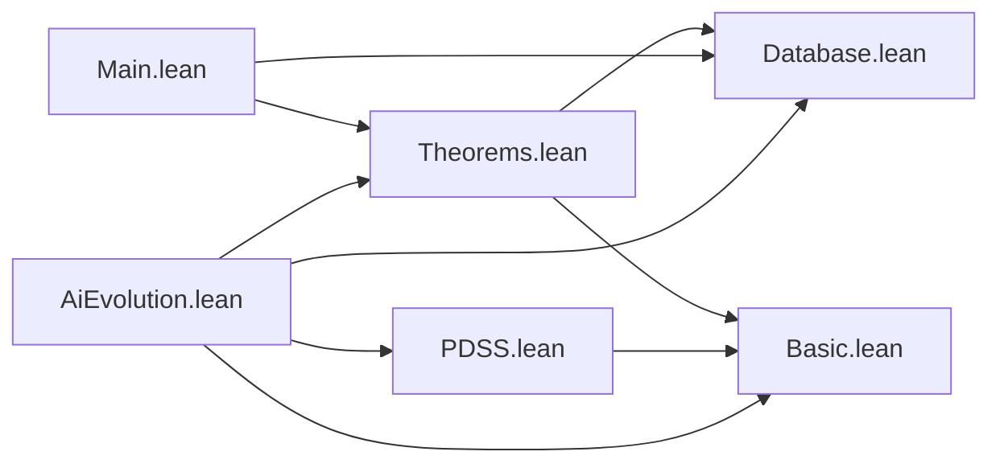

# 数学验证技能

<cite>
**本文档引用的文件**
- [SKILL.md](file://plugin/skills/math-verification/SKILL.md)
- [Main.lean](file://LEAN/Main.lean)
- [AiEvolution.lean](file://LEAN/AiEvolution.lean)
- [Basic.lean](file://LEAN/AiEvolution/Basic.lean)
- [Theorems.lean](file://LEAN/AiEvolution/Theorems.lean)
- [Database.lean](file://LEAN/AiEvolution/Database.lean)
- [PDSS.lean](file://LEAN/AiEvolution/PDSS.lean)
- [tex_parser.py](file://scholar/tex_parser.py)
</cite>

## 目录
1. [引言](#引言)
2. [项目结构](#项目结构)
3. [核心组件](#核心组件)
4. [架构总览](#架构总览)
5. [详细组件分析](#详细组件分析)
6. [依赖分析](#依赖分析)
7. [性能考虑](#性能考虑)
8. [故障排查指南](#故障排查指南)
9. [结论](#结论)
10. [附录](#附录)

## 引言
本技能旨在为数学公式、定理与推导过程提供系统化的形式化验证能力，结合Lean4形式化系统与论文解析流水线，实现从LaTeX公式抽取、语义分析、符号标准化、维度与极限一致性检查，到形式化尝试与编译验证的全链路工作流。同时，该技能强调与知识图谱与形式化数据库的联动，确保验证结果可追溯、可复用，并生成结构化验证报告以支撑论文写作与工程实践。

## 项目结构
该项目采用“技能层 + 形式化库 + 论文解析器”的分层组织方式：
- 技能层：位于 plugin/skills/math-verification，定义触发条件、前置条件、流程步骤与报告模板。
- 形式化库：位于 LEAN/AiEvolution，包含基础类型、数据库事实、定理证明与PDSS模式形式化。
- 论文解析器：位于 scholar/tex_parser.py，负责从TeX归档中抽取公式、章节与元信息。

图表来源
- [SKILL.md:1-101](file://plugin/skills/math-verification/SKILL.md#L1-L101)
- [AiEvolution.lean:1-8](file://LEAN/AiEvolution.lean#L1-L8)
- [Basic.lean:1-65](file://LEAN/AiEvolution/Basic.lean#L1-L65)
- [Database.lean:1-756](file://LEAN/AiEvolution/Database.lean#L1-L756)
- [Theorems.lean:1-130](file://LEAN/AiEvolution/Theorems.lean#L1-L130)
- [PDSS.lean:1-239](file://LEAN/AiEvolution/PDSS.lean#L1-L239)
- [Main.lean:1-21](file://LEAN/Main.lean#L1-L21)
- [tex_parser.py:1-800](file://scholar/tex_parser.py#L1-L800)

章节来源
- [SKILL.md:1-101](file://plugin/skills/math-verification/SKILL.md#L1-L101)
- [AiEvolution.lean:1-8](file://LEAN/AiEvolution.lean#L1-L8)
- [tex_parser.py:1-800](file://scholar/tex_parser.py#L1-L800)

## 核心组件
- 数学公式解析与抽取：基于正则表达式与宏展开，从TeX源中提取公式、章节与上下文，支持多环境与标签定位。
- 形式化类型与数据库：定义研究线、创新节点、论文、引用与替换关系等基础结构；内置125个创新节点与417篇论文的事实数据库。
- 形式化定理：在Lean4中对“替换”关系进行严格证明，覆盖Transformer替换RNN、DPO替换PPO等7个核心演化定理。
- PDSS模式形式化：对寄生式领域特定脚手架（Rule/Workflow/Tool/DataSource/HostPlatform）进行五元组建模与可组合性、同构性、寄生性等性质的形式化。
- 主程序入口：展示数据库规模与证明状态，作为形式化验证系统的运行入口。

章节来源
- [tex_parser.py:90-107](file://scholar/tex_parser.py#L90-L107)
- [Basic.lean:10-64](file://LEAN/AiEvolution/Basic.lean#L10-L64)
- [Database.lean:14-753](file://LEAN/AiEvolution/Database.lean#L14-L753)
- [Theorems.lean:15-129](file://LEAN/AiEvolution/Theorems.lean#L15-L129)
- [PDSS.lean:14-238](file://LEAN/AiEvolution/PDSS.lean#L14-L238)
- [Main.lean:6-20](file://LEAN/Main.lean#L6-L20)

## 架构总览
整体验证流程由“公式定位—上下文提取—语义分析—对照已有—形式化尝试—编译验证—生成报告”构成，贯穿论文解析与Lean4形式化库：

图表来源
- [SKILL.md:12-86](file://plugin/skills/math-verification/SKILL.md#L12-L86)
- [tex_parser.py:219-298](file://scholar/tex_parser.py#L219-L298)
- [Database.lean:14-753](file://LEAN/AiEvolution/Database.lean#L14-L753)
- [Theorems.lean:15-129](file://LEAN/AiEvolution/Theorems.lean#L15-L129)
- [Main.lean:6-20](file://LEAN/Main.lean#L6-L20)

## 详细组件分析

### 组件A：公式解析与上下文抽取（tex_parser.py）
- 功能要点
  - 支持tar.gz/zip归档解压与.tex主文件发现，递归解析\input/\include。
  - 提取标题、作者、年份、会议、arXiv编号、摘要、章节、公式与引用。
  - 公式抽取涵盖多种环境（align、gather、multline、eqnarray、displaymath等），并支持$$...$$与\[..., …\]双行显示数学。
  - 宏定义解析与多轮展开，清理噪声命令与格式化指令，保留纯文本与公式源码。
- 关键数据结构
  - 公式列表包含公式源码、标签、所在章节等字段，便于后续语义分析与报告生成。
- 性能与健壮性
  - 使用正则表达式预编译与多轮宏展开，避免重复计算；对缺失输入文件返回占位提示，保证解析稳定性。

图表来源
- [tex_parser.py:219-374](file://scholar/tex_parser.py#L219-L374)
- [tex_parser.py:90-107](file://scholar/tex_parser.py#L90-L107)

章节来源
- [tex_parser.py:219-374](file://scholar/tex_parser.py#L219-L374)
- [tex_parser.py:90-107](file://scholar/tex_parser.py#L90-L107)

### 组件B：形式化类型与数据库（Basic.lean、Database.lean）
- 基础类型
  - 研究线（ResearchLine）：按主题分类AI创新，如序列建模、生成模型、效率压缩等。
  - 创新属性（Properties）：可扩展性、简洁性、稳定性三轴量化评分。
  - 创新节点（Innovation）、论文（Paper）、引用（Citation）、替换（Replacement）等结构体。
- 数据库事实
  - 内置125个创新节点与417篇论文，覆盖主流模型与方法；提供关键引用关系与替换关系列表，作为形式化证明的目标与依据。
- 设计原则
  - 结构清晰、枚举完备，便于在Lean4中进行构造性证明与自动化决策。

图表来源
- [Basic.lean:10-64](file://LEAN/AiEvolution/Basic.lean#L10-L64)
- [Database.lean:14-753](file://LEAN/AiEvolution/Database.lean#L14-L753)

章节来源
- [Basic.lean:10-64](file://LEAN/AiEvolution/Basic.lean#L10-L64)
- [Database.lean:14-753](file://LEAN/AiEvolution/Database.lean#L14-L753)

### 组件C：形式化定理（Theorems.lean）
- 目标
  - 对“替换”关系进行严格证明：某创新在至少两个轴上优于其前身，体现AI演进的渐进优势。
- 方法
  - 定义支配关系与严格更优谓词，使用simp与decide等自动化策略完成证明。
- 覆盖范围
  - 包含Transformer替换RNN、DPO替换PPO、Diffusion替换GAN、ViT替换CNN、LoRA替换Pruning、AdamW替换Adam、LSTM在可扩展性上超越RNN等7个定理。
- 价值
  - 证明均通过编译期校验，无“sorry”，确保结论可靠。

图表来源
- [Theorems.lean:15-129](file://LEAN/AiEvolution/Theorems.lean#L15-L129)
- [Database.lean:18-166](file://LEAN/AiEvolution/Database.lean#L18-L166)

章节来源
- [Theorems.lean:15-129](file://LEAN/AiEvolution/Theorems.lean#L15-L129)
- [Database.lean:18-166](file://LEAN/AiEvolution/Database.lean#L18-L166)

### 组件D：PDSS模式形式化（PDSS.lean）
- 目标
  - 对寄生式领域特定脚手架（Rule/Workflow/Tool/DataSource/HostPlatform）进行五元组建模，并形式化寄生性、可组合性与结构同构性等性质。
- 关键定义
  - ScaffoldSystem五元组与well-formedness约束。
  - IsParasitic：无训练模型、无独立UI、无独立计算资源，全部智能委托给宿主LLM。
  - protocolCompatible与composable：跨系统工具协议兼容与可组合性。
  - StructuralIsomorphism：结构保持映射，体现独立发展下的架构收敛。
  - parasitic_evolution：宿主能力单调提升驱动系统质量提升。
- 价值
  - 为工具生态与工作流编排提供形式化安全保障与可复用架构。

图表来源
- [PDSS.lean:14-107](file://LEAN/AiEvolution/PDSS.lean#L14-L107)

章节来源
- [PDSS.lean:14-238](file://LEAN/AiEvolution/PDSS.lean#L14-L238)

### 组件E：主程序入口与运行状态（Main.lean、AiEvolution.lean）
- Main.lean
  - 导入AiEvolution与Database命名空间，打印当前数据库规模与证明状态，作为系统健康度指示。
- AiEvolution.lean
  - 作为根模块聚合Basic、Database、Theorems、PDSS，形成统一的库入口。

章节来源
- [Main.lean:1-21](file://LEAN/Main.lean#L1-L21)
- [AiEvolution.lean:1-8](file://LEAN/AiEvolution.lean#L1-L8)

## 依赖分析
- 模块耦合
  - Theorems.lean显式依赖Basic与Database，用于访问创新节点与属性。
  - PDSS.lean显式依赖Basic，用于复用Innovation、Paper等基础类型。
  - Main.lean依赖Database与Theorems，用于展示与验证。
- 外部依赖
  - Lake/Lean4：形式化构建与编译验证。
  - Python运行时：tex_parser.py用于论文解析。
- 潜在循环依赖
  - 当前模块间为单向依赖（Theorems/PDSS -> Basic；Main -> Database/Theorems），未见循环。

图表来源
- [Theorems.lean:10-11](file://LEAN/AiEvolution/Theorems.lean#L10-L11)
- [PDSS.lean:12-12](file://LEAN/AiEvolution/PDSS.lean#L12-L12)
- [AiEvolution.lean:3-6](file://LEAN/AiEvolution.lean#L3-L6)
- [Main.lean:1-4](file://LEAN/Main.lean#L1-L4)

章节来源
- [Theorems.lean:10-11](file://LEAN/AiEvolution/Theorems.lean#L10-L11)
- [PDSS.lean:12-12](file://LEAN/AiEvolution/PDSS.lean#L12-L12)
- [AiEvolution.lean:3-6](file://LEAN/AiEvolution.lean#L3-L6)
- [Main.lean:1-4](file://LEAN/Main.lean#L1-L4)

## 性能考虑
- 公式抽取
  - 正则表达式预编译与多轮宏展开控制在合理次数内，避免指数级回溯。
  - 对缺失输入文件采用占位符，减少IO阻塞。
- 形式化证明
  - 使用simp/decide等自动化策略，优先证明简单且可判定的性质，复杂定理可拆分为子步骤或引入中间引理。
- 数据规模
  - Database.lean包含大量创新节点与论文，建议在查询时限定范围（如按研究线或年份），避免全库扫描。

## 故障排查指南
- 公式解析失败
  - 确认归档格式受支持（tar.gz、tar、zip），并存在含\documentclass的主.tex文件。
  - 检查\input/\include路径是否正确，必要时手动补充缺失文件。
- Lean4编译失败
  - 检查新增定义是否满足Well-Founded/DecidableEq等实例要求。
  - 对于替换关系证明，核对Database.lean中的属性值与比较关系是否一致。
- 报告生成异常
  - 确保输出目录存在且可写；检查公式标签与论文元信息是否完整。

章节来源
- [SKILL.md:56-86](file://plugin/skills/math-verification/SKILL.md#L56-L86)
- [tex_parser.py:304-344](file://scholar/tex_parser.py#L304-L344)
- [Main.lean:6-20](file://LEAN/Main.lean#L6-L20)

## 结论
该数学验证技能以“论文解析—语义分析—形式化对照—自动化证明—报告生成”为主线，结合Lean4形式化库与结构化数据库，实现了从LaTeX公式到形式化定理的闭环验证。通过标准化的流程与严格的编译期校验，既保证了结论的可靠性，也为论文写作与工程实践提供了可复用的证据与引用。

## 附录
- 技能触发与流程
  - 触发条件：用户询问“验证这个公式/检查数学推导/形式化验证/这个定理对吗”。
  - 前置条件：本地已安装Lean4，AiEvolution项目位于LEAN/目录。
  - 流程步骤：定位目标公式—提取上下文—语义分析—对照已有—形式化尝试—编译验证—生成报告。
- 报告模板
  - 包含论文信息、公式LaTeX、语义分析结果、验证结果清单与备注，便于后续回读与实验实现。

章节来源
- [SKILL.md:6-101](file://plugin/skills/math-verification/SKILL.md#L6-L101)