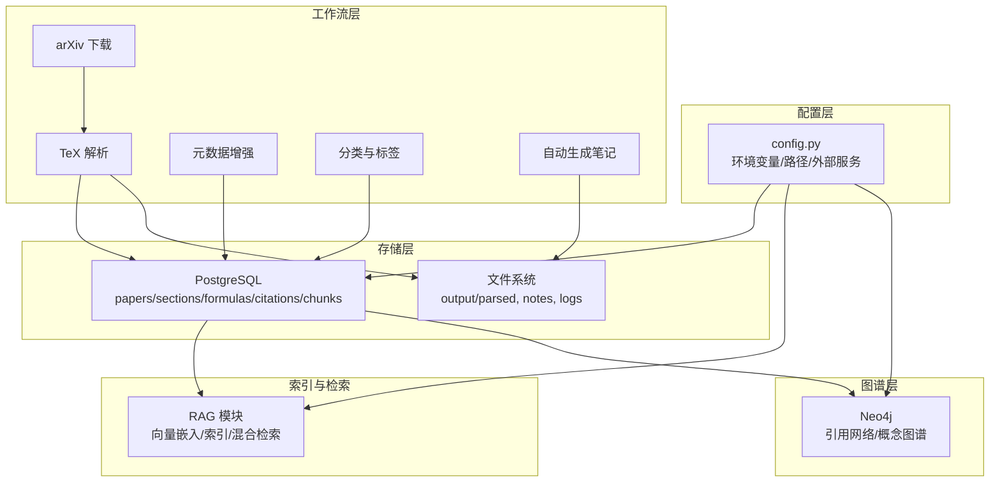
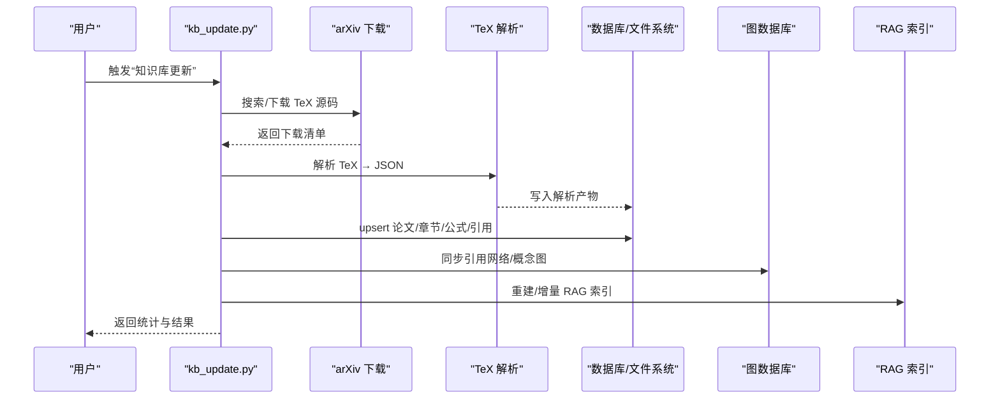
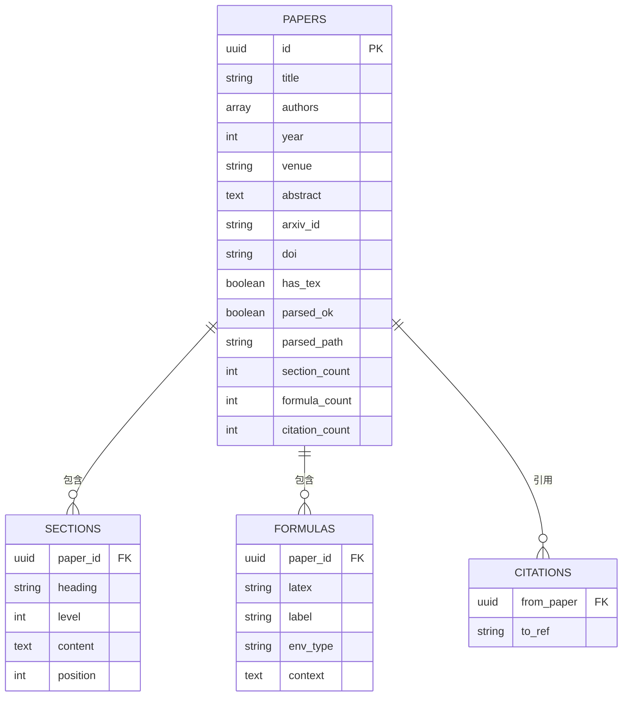
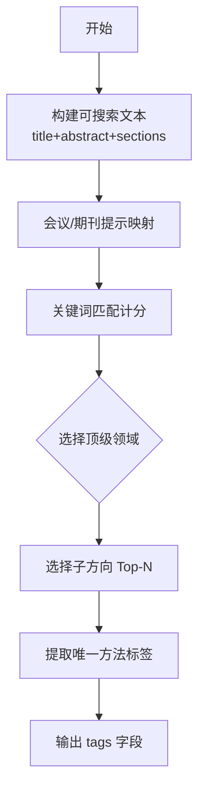
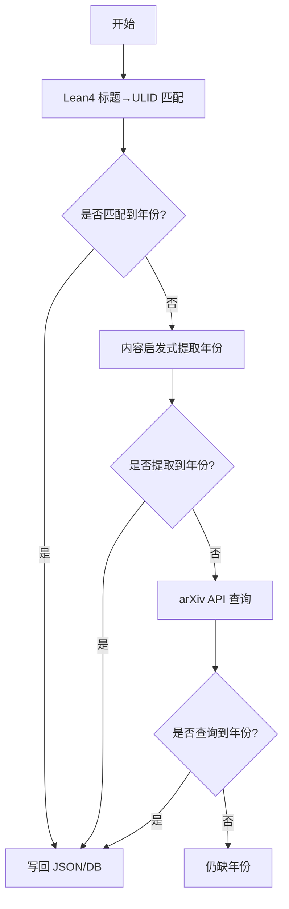
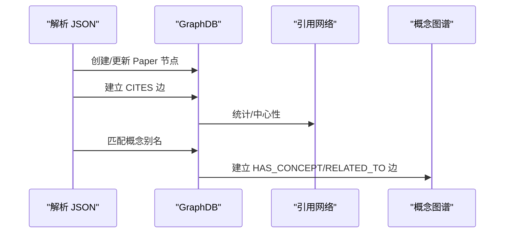
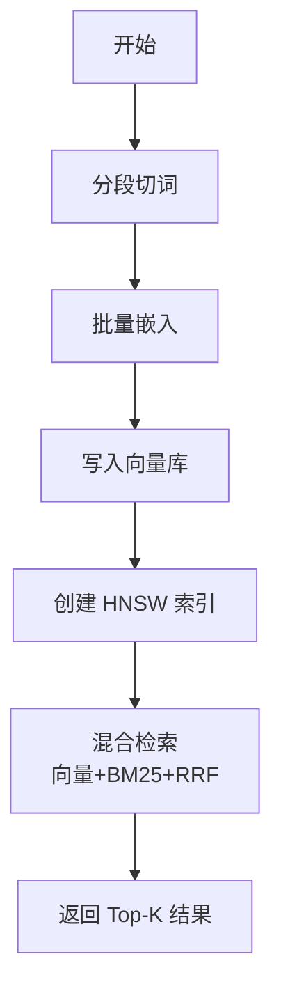
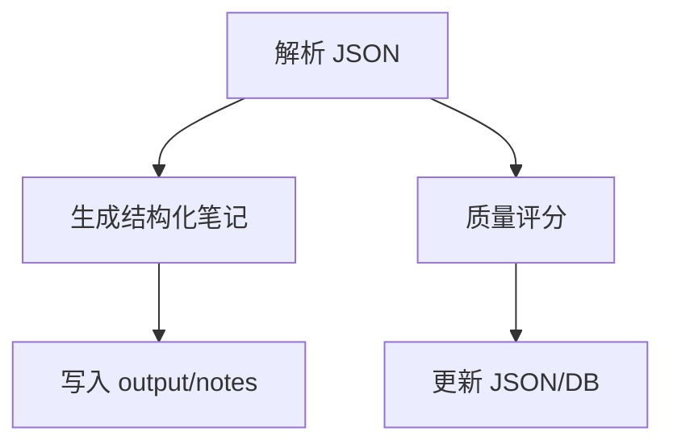
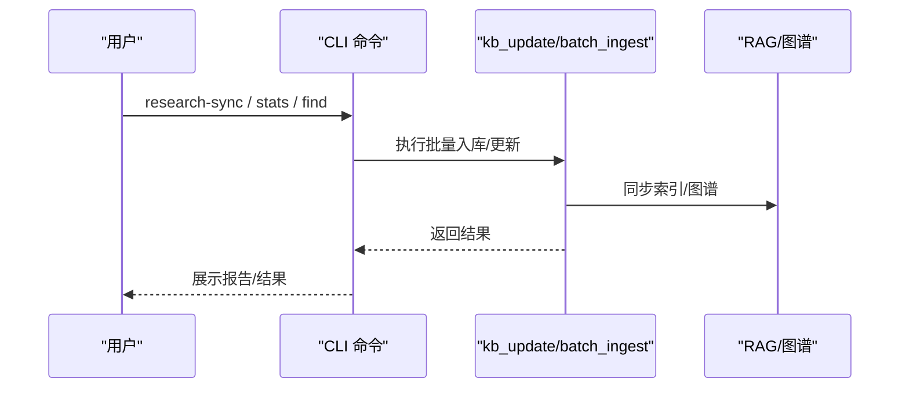
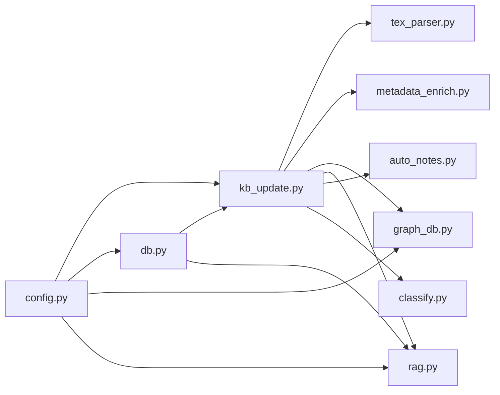

# 知识库管理技能

<cite>
**本文引用的文件**
- [SKILL.md](file://plugin/skills/kb-management/SKILL.md)
- [config.py](file://scholar/config.py)
- [db.py](file://scholar/db.py)
- [kb_update.py](file://scholar/kb_update.py)
- [rag.py](file://scholar/rag.py)
- [auto_notes.py](file://scholar/auto_notes.py)
- [classify.py](file://scholar/classify.py)
- [metadata_enrich.py](file://scholar/metadata_enrich.py)
- [year_fix.py](file://scholar/year_fix.py)
- [graph_db.py](file://scholar/graph_db.py)
- [tex_parser.py](file://scholar/tex_parser.py)
- [stats.md](file://plugin/commands/stats.md)
- [find.md](file://plugin/commands/find.md)
- [sync.md](file://plugin/commands/sync.md)
</cite>

## 目录
1. [简介](#简介)
2. [项目结构](#项目结构)
3. [核心组件](#核心组件)
4. [架构总览](#架构总览)
5. [详细组件分析](#详细组件分析)
6. [依赖关系分析](#依赖关系分析)
7. [性能考量](#性能考量)
8. [故障排查指南](#故障排查指南)
9. [结论](#结论)
10. [附录](#附录)

## 简介
本文件面向“知识库管理技能”，系统性阐述该知识库的组织结构、存储策略、检索机制与维护流程。内容涵盖：
- 知识条目分类体系与标签管理
- 版本与增量更新策略
- 导入导出与同步机制
- 健康检查与质量控制
- 与外部系统（数据库、图数据库、嵌入服务）的数据交换与集成

## 项目结构
该项目围绕“学术论文知识库”构建，采用分层设计：
- 配置层：集中管理路径、环境变量与外部服务连接参数
- 存储层：PostgreSQL（结构化数据）与文件系统（解析产物）
- 索引与检索层：RAG 向量索引（pgvector）+ 关键词 BM25 + 语义融合检索
- 图谱层：Neo4j 引用网络与概念图谱
- 工作流层：批量下载、解析、清洗、标注、入库与增量更新
- 插件命令层：CLI 命令封装与用户交互

图表来源
- [config.py:20-66](file://scholar/config.py#L20-L66)
- [db.py:24-127](file://scholar/db.py#L24-L127)
- [rag.py:25-93](file://scholar/rag.py#L25-L93)
- [graph_db.py:32-70](file://scholar/graph_db.py#L32-L70)
- [kb_update.py:88-214](file://scholar/kb_update.py#L88-L214)
- [tex_parser.py:23-298](file://scholar/tex_parser.py#L23-L298)

章节来源
- [config.py:20-66](file://scholar/config.py#L20-L66)
- [db.py:24-127](file://scholar/db.py#L24-L127)
- [rag.py:25-93](file://scholar/rag.py#L25-L93)
- [graph_db.py:32-70](file://scholar/graph_db.py#L32-L70)
- [kb_update.py:88-214](file://scholar/kb_update.py#L88-L214)
- [tex_parser.py:23-298](file://scholar/tex_parser.py#L23-L298)

## 核心组件
- 配置与路径管理：统一管理数据目录、数据库与图数据库连接、嵌入服务参数与 arXiv 请求参数
- 数据库接口：封装 PostgreSQL 与文件系统双模式，提供论文、章节、公式、引用的增删改查与统计
- 知识库更新：一键下载 arXiv 论文、批量解析入库、元数据补全、图谱与 RAG 同步
- RAG 索引：分段切词、多源嵌入、向量存储与混合检索
- 分类与标签：多级标签体系（领域/子方向/方法），基于规则与关键词匹配
- 自动笔记：结构化阅读摘要与要点抽取
- 元数据增强与补全：arXiv 元数据回填、年份与作者补全
- 图数据库：引用网络与概念图谱构建与查询
- 工具命令：健康检查、搜索、同步等 CLI 命令

章节来源
- [config.py:20-66](file://scholar/config.py#L20-L66)
- [db.py:24-127](file://scholar/db.py#L24-L127)
- [kb_update.py:441-473](file://scholar/kb_update.py#L441-L473)
- [rag.py:25-93](file://scholar/rag.py#L25-L93)
- [classify.py:26-143](file://scholar/classify.py#L26-L143)
- [auto_notes.py:28-161](file://scholar/auto_notes.py#L28-L161)
- [metadata_enrich.py:80-132](file://scholar/metadata_enrich.py#L80-L132)
- [year_fix.py:165-239](file://scholar/year_fix.py#L165-L239)
- [graph_db.py:225-281](file://scholar/graph_db.py#L225-L281)
- [stats.md:1-10](file://plugin/commands/stats.md#L1-L10)
- [find.md:1-10](file://plugin/commands/find.md#L1-L10)
- [sync.md:1-11](file://plugin/commands/sync.md#L1-L11)

## 架构总览
知识库管理以“批量更新 + 增量同步”的方式运行，核心流程如下：

图表来源
- [kb_update.py:441-473](file://scholar/kb_update.py#L441-L473)
- [kb_update.py:216-438](file://scholar/kb_update.py#L216-L438)
- [tex_parser.py:219-298](file://scholar/tex_parser.py#L219-L298)
- [db.py:79-176](file://scholar/db.py#L79-L176)
- [graph_db.py:225-281](file://scholar/graph_db.py#L225-L281)
- [rag.py:551-582](file://scholar/rag.py#L551-L582)

章节来源
- [kb_update.py:441-473](file://scholar/kb_update.py#L441-L473)
- [kb_update.py:216-438](file://scholar/kb_update.py#L216-L438)
- [tex_parser.py:219-298](file://scholar/tex_parser.py#L219-L298)
- [db.py:79-176](file://scholar/db.py#L79-L176)
- [graph_db.py:225-281](file://scholar/graph_db.py#L225-L281)
- [rag.py:551-582](file://scholar/rag.py#L551-L582)

## 详细组件分析

### 存储与组织结构
- 结构化存储：PostgreSQL 表结构包含论文、章节、公式、引用与向量片段；提供 upsert、查询与统计接口
- 文件存储：解析后的 JSON 产物、自动生成的笔记、日志与中间产物
- 目录约定：数据根目录下 data/papers（原始论文）、output/parsed（解析 JSON）、output/notes（阅读笔记）等

图表来源
- [db.py:84-176](file://scholar/db.py#L84-L176)

章节来源
- [db.py:24-127](file://scholar/db.py#L24-L127)
- [db.py:170-276](file://scholar/db.py#L170-L276)
- [config.py:23-42](file://scholar/config.py#L23-L42)

### 知识条目分类与标签管理
- 多级标签体系：领域（如 NLP/CV/ML/RL/Systems/Safety/Multimodal）→ 子方向（如语言建模、目标检测等）→ 方法标签（如 Transformer、ResNet、DQN 等）
- 规则引擎：基于关键词匹配与会议/期刊提示进行打标
- 输出：每个论文 JSON 包含 tags 字段，包含 domains、sub_directions、methods 与扁平 tags 列表

图表来源
- [classify.py:161-238](file://scholar/classify.py#L161-L238)

章节来源
- [classify.py:26-143](file://scholar/classify.py#L26-L143)
- [classify.py:161-238](file://scholar/classify.py#L161-L238)
- [classify.py:245-294](file://scholar/classify.py#L245-L294)

### 元数据回填与补全
- arXiv 元数据回填：一次性提取 arxiv_id、doi、year、authors、venue，并按需写回 JSON 与数据库
- 年份补全：优先从 Lean4 数据库匹配，其次从内容启发式提取，最后回退 arXiv API
- 作者补全：针对缺失作者的论文回查 arXiv API

图表来源
- [year_fix.py:165-239](file://scholar/year_fix.py#L165-L239)
- [year_fix.py:262-303](file://scholar/year_fix.py#L262-L303)

章节来源
- [metadata_enrich.py:80-132](file://scholar/metadata_enrich.py#L80-L132)
- [metadata_enrich.py:186-241](file://scholar/metadata_enrich.py#L186-L241)
- [year_fix.py:165-239](file://scholar/year_fix.py#L165-L239)
- [year_fix.py:262-303](file://scholar/year_fix.py#L262-L303)
- [year_fix.py:337-420](file://scholar/year_fix.py#L337-L420)

### 引用解析与图谱同步
- 引用网络：从解析 JSON 的 citations 构建论文节点与 CITES 边，支持 ref_key 归一化与批量重连
- 概念图谱：基于预定义的概念别名与 TF-IDF，将论文映射到创新节点并建立共现关系
- 评估指标：计算中心性指标（入度/出度/桥接分数）

图表来源
- [graph_db.py:225-281](file://scholar/graph_db.py#L225-L281)
- [graph_db.py:636-732](file://scholar/graph_db.py#L636-L732)
- [graph_db.py:180-223](file://scholar/graph_db.py#L180-L223)

章节来源
- [graph_db.py:225-281](file://scholar/graph_db.py#L225-L281)
- [graph_db.py:636-732](file://scholar/graph_db.py#L636-L732)
- [graph_db.py:180-223](file://scholar/graph_db.py#L180-L223)

### RAG 索引与检索
- 分段策略：抽象、章节段落、公式上下文三类切分，保证语义粒度
- 嵌入服务：支持智谱、OpenAI 等，提供批处理与降级回退
- 向量存储：PostgreSQL + pgvector，HNSW 近似检索加速
- 检索融合：向量相似度与 BM25 关键词匹配的 Reciprocal Rank Fusion

图表来源
- [rag.py:25-93](file://scholar/rag.py#L25-L93)
- [rag.py:427-469](file://scholar/rag.py#L427-L469)
- [rag.py:182-238](file://scholar/rag.py#L182-L238)
- [rag.py:383-421](file://scholar/rag.py#L383-L421)

章节来源
- [rag.py:25-93](file://scholar/rag.py#L25-L93)
- [rag.py:182-238](file://scholar/rag.py#L182-L238)
- [rag.py:252-289](file://scholar/rag.py#L252-L289)
- [rag.py:383-421](file://scholar/rag.py#L383-L421)
- [rag.py:471-548](file://scholar/rag.py#L471-L548)
- [rag.py:551-582](file://scholar/rag.py#L551-L582)

### 自动笔记与质量控制
- 自动生成：摘要、贡献、方法概览、关键公式、章节树、引用摘要
- 质量评分：独立的质量模块（在批量入库流程中调用）
- 版本与增量：笔记按 ULID 生成，支持覆盖或跳过

图表来源
- [auto_notes.py:28-161](file://scholar/auto_notes.py#L28-L161)
- [auto_notes.py:330-355](file://scholar/auto_notes.py#L330-L355)
- [kb_update.py:338-361](file://scholar/kb_update.py#L338-L361)

章节来源
- [auto_notes.py:28-161](file://scholar/auto_notes.py#L28-L161)
- [auto_notes.py:330-355](file://scholar/auto_notes.py#L330-L355)
- [kb_update.py:338-361](file://scholar/kb_update.py#L338-L361)

### 导入导出与同步机制
- 导入：arXiv 搜索 → 下载 TeX → 解析 → 元数据补全 → 图谱/RAG 同步 → 笔记/质量/分类
- 同步：根据研究兴趣列表，批量触发“研究方向同步”，产出同步报告
- 导出：通过 CLI 命令导出统计、搜索结果与同步报告

图表来源
- [sync.md:1-11](file://plugin/commands/sync.md#L1-L11)
- [stats.md:1-10](file://plugin/commands/stats.md#L1-L10)
- [find.md:1-10](file://plugin/commands/find.md#L1-L10)
- [kb_update.py:441-473](file://scholar/kb_update.py#L441-L473)

章节来源
- [sync.md:1-11](file://plugin/commands/sync.md#L1-L11)
- [stats.md:1-10](file://plugin/commands/stats.md#L1-L10)
- [find.md:1-10](file://plugin/commands/find.md#L1-L10)
- [kb_update.py:441-473](file://scholar/kb_update.py#L441-L473)

### 版本与增量更新策略
- 增量识别：基于已解析 JSON 与源码存在性判断待处理论文
- 逐阶段更新：解析 → 元数据补全 → 图谱/RAG 同步 → 笔记/质量/分类
- 缓存与一致性：ID 解析器缓存刷新，确保跨模块引用一致

章节来源
- [kb_update.py:216-438](file://scholar/kb_update.py#L216-L438)
- [kb_update.py:435-438](file://scholar/kb_update.py#L435-L438)

## 依赖关系分析
- 组件耦合
  - kb_update 依赖 tex_parser、metadata_enrich、graph_db、rag、auto_notes、quality、classify
  - db 作为共享存储接口，被多个模块读写
  - config 为全局配置中心，被所有模块使用
- 外部依赖
  - PostgreSQL + pgvector：结构化存储与向量检索
  - Neo4j：图谱存储与查询
  - arXiv API：论文检索与元数据回填
  - 嵌入服务（智谱/OpenAI/本地）：向量生成
- 循环依赖
  - 未发现循环导入；模块间通过清晰的接口与参数传递解耦

图表来源
- [kb_update.py:230-361](file://scholar/kb_update.py#L230-L361)
- [db.py:24-127](file://scholar/db.py#L24-L127)
- [config.py:20-66](file://scholar/config.py#L20-L66)

章节来源
- [kb_update.py:230-361](file://scholar/kb_update.py#L230-L361)
- [db.py:24-127](file://scholar/db.py#L24-L127)
- [config.py:20-66](file://scholar/config.py#L20-L66)

## 性能考量
- 批处理与限流
  - arXiv 请求限流（默认 3 秒/次），避免触发速率限制
  - RAG 批量嵌入，支持进度可视化与错误统计
- 索引优化
  - HNSW 索引参数可调，平衡召回与速度
  - BM25 作为轻量关键词检索，与向量检索互补
- 存储与 IO
  - 解析产物 JSON 与 PDF/TeX 源码分离，便于增量处理
  - 数据库可用时优先写入，不可用时回退文件模式

## 故障排查指南
- arXiv 请求失败
  - 现象：下载/元数据查询异常
  - 排查：检查代理、超时与重试配置；确认网络可达
- 数据库连接失败
  - 现象：无法写入/查询论文
  - 排查：确认连接参数、服务状态；切换文件模式验证
- Neo4j 连接失败
  - 现象：图谱同步报错
  - 排查：确认驱动安装、认证与服务可用性
- RAG 索引异常
  - 现象：向量写入失败或检索为空
  - 排查：检查嵌入服务密钥、模型与维度配置；重建 HNSW 索引
- 解析失败
  - 现象：TeX 解析报错或字段缺失
  - 排查：检查源码完整性、宏定义与输入文件链路

章节来源
- [config.py:72-119](file://scholar/config.py#L72-L119)
- [db.py:31-74](file://scholar/db.py#L31-L74)
- [graph_db.py:39-70](file://scholar/graph_db.py#L39-L70)
- [rag.py:182-238](file://scholar/rag.py#L182-L238)
- [tex_parser.py:304-375](file://scholar/tex_parser.py#L304-L375)

## 结论
该知识库管理技能以“结构化存储 + 多模态检索 + 图谱洞察”为核心，提供从论文采集、解析、清洗、标注到检索与可视化的完整闭环。通过模块化设计与 CLI 命令封装，既满足自动化批量处理，也支持人工干预与质量控制。建议在生产环境中结合数据库高可用、图数据库集群与嵌入服务 SLA，持续优化索引与查询性能。

## 附录
- 用户操作指引
  - 健康检查：运行统计与图谱统计命令，核对覆盖率与规模
  - 搜索：先关键词检索，再语义检索，最后融合排序
  - 同步：按研究方向批量同步，生成同步报告
- 维护建议
  - 定期执行“知识库健康检查”与“元数据补全”
  - 按月重建 RAG 索引，保持检索效果
  - 监控图谱一致性，定期修复引用边与概念映射

章节来源
- [stats.md:1-10](file://plugin/commands/stats.md#L1-L10)
- [find.md:1-10](file://plugin/commands/find.md#L1-L10)
- [sync.md:1-11](file://plugin/commands/sync.md#L1-L11)
- [SKILL.md:6-59](file://plugin/skills/kb-management/SKILL.md#L6-L59)