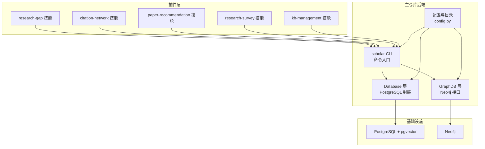
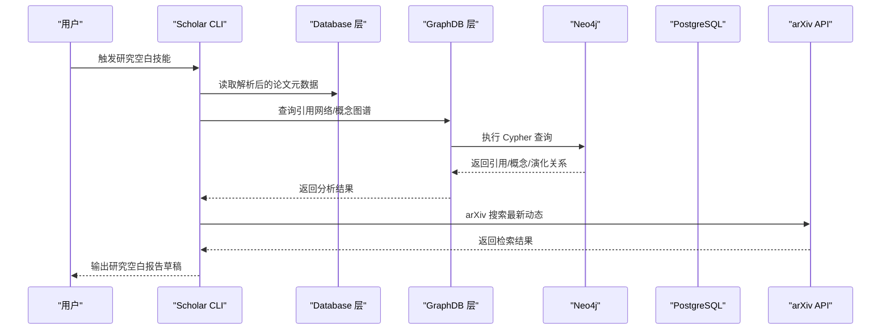
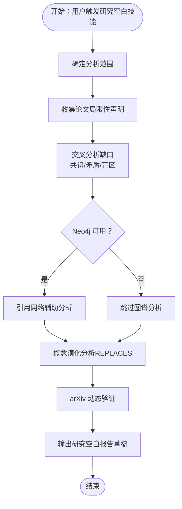
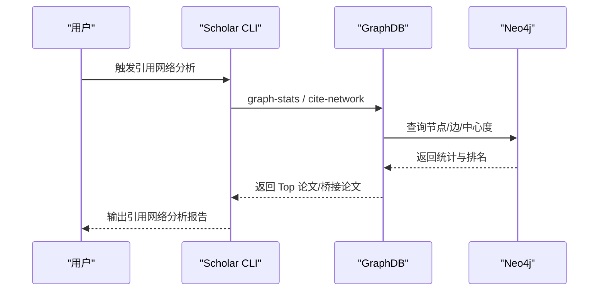
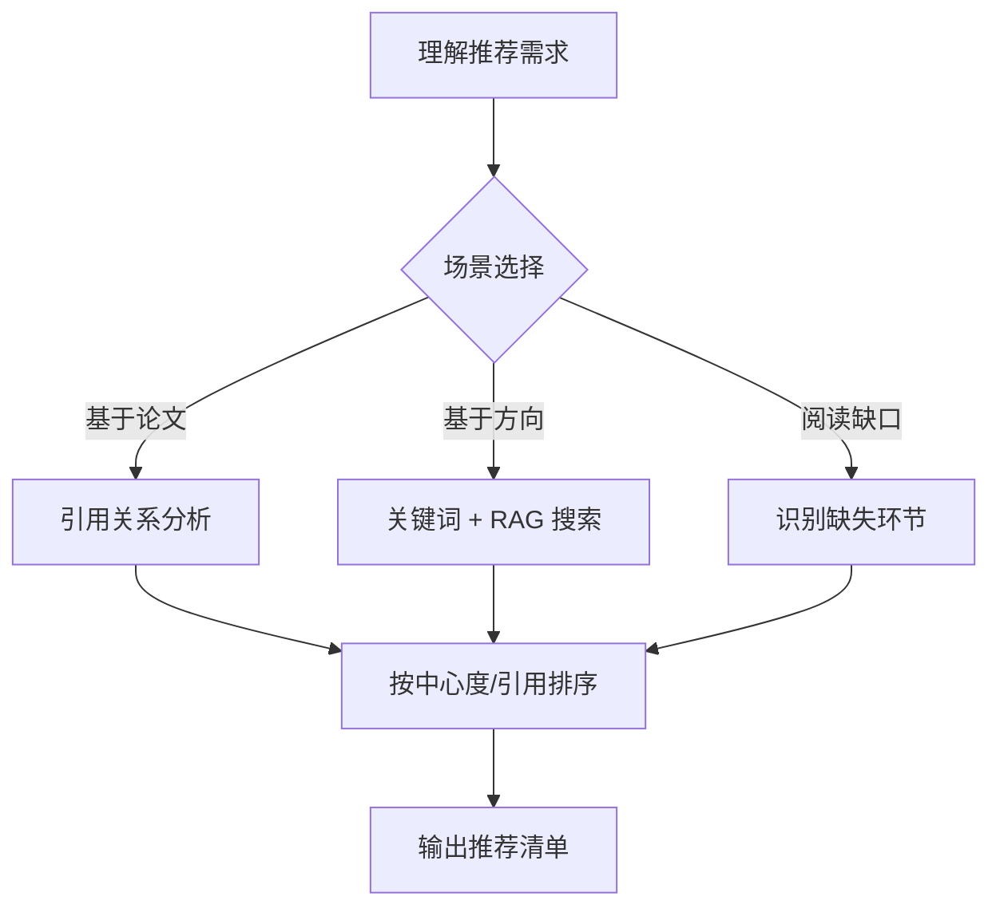
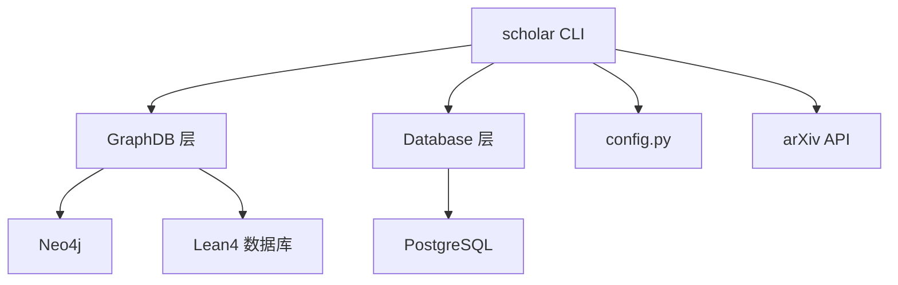

# 研究空白技能

<cite>
**本文档引用的文件**
- [plugin\skills\research-gap\SKILL.md](file://plugin\skills\research-gap\SKILL.md)
- [plugin\skills\citation-network\SKILL.md](file://plugin\skills\citation-network\SKILL.md)
- [plugin\skills\paper-recommendation\SKILL.md](file://plugin\skills\paper-recommendation\SKILL.md)
- [plugin\skills\kb-management\SKILL.md](file://plugin\skills\kb-management\SKILL.md)
- [plugin\skills\research-survey\SKILL.md](file://plugin\skills\research-survey\SKILL.md)
- [plugin\README.md](file://plugin\README.md)
- [scholar\cli.py](file://scholar\cli.py)
- [scholar\graph_db.py](file://scholar\graph_db.py)
- [scholar\db.py](file://scholar\db.py)
- [scholar\config.py](file://scholar\config.py)
- [infra\docker-compose.yml](file://infra\docker-compose.yml)
- [requirements.txt](file://requirements.txt)
- [LEAN\AiEvolution\Database.lean](file://LEAN\AiEvolution\Database.lean)
</cite>

## 目录
1. [简介](#简介)
2. [项目结构](#项目结构)
3. [核心组件](#核心组件)
4. [架构总览](#架构总览)
5. [详细组件分析](#详细组件分析)
6. [依赖关系分析](#依赖关系分析)
7. [性能考量](#性能考量)
8. [故障排查指南](#故障排查指南)
9. [结论](#结论)
10. [附录](#附录)

## 简介
本文件面向“研究空白技能”的专业分析，围绕如何在人工智能研究领域中系统地识别与分析知识缺口，提供从数据采集、图谱构建、引用网络分析到报告生成的完整工作流。文档重点解释：
- 基于文献计量学的研究空白检测算法与热点追踪、趋势预测技术
- 研究前沿识别、跨学科交叉分析与新兴领域发现
- 研究空白可视化工具与报告生成机制
- 与引用网络和论文推荐系统的协作关系

## 项目结构
该系统由“插件层 + 主仓库后端 + 基础设施”三层构成：
- 插件层：提供 14 个技能（Skills）、4 个命令（Commands）、规则与钩子，定义“做什么、怎么做”
- 主仓库后端：scholar CLI、数据库与图数据库接口、解析与检索工具
- 基础设施：PostgreSQL + Neo4j 容器化服务，提供结构化存储与图谱计算

**图表来源**
- [plugin\README.md:1-79](file://plugin\README.md#L1-L79)
- [scholar\cli.py:1-800](file://scholar\cli.py#L1-L800)
- [scholar\graph_db.py:1-800](file://scholar\graph_db.py#L1-L800)
- [scholar\db.py:1-276](file://scholar\db.py#L1-L276)
- [scholar\config.py:1-119](file://scholar\config.py#L1-L119)
- [infra\docker-compose.yml:1-44](file://infra\docker-compose.yml#L1-L44)

**章节来源**
- [plugin\README.md:1-79](file://plugin\README.md#L1-L79)
- [infra\docker-compose.yml:1-44](file://infra\docker-compose.yml#L1-L44)
- [requirements.txt:1-14](file://requirements.txt#L1-L14)

## 核心组件
- 研究空白技能（research-gap）
  - 输入：用户意图（如“找研究方向”、“研究空白”等）
  - 关键流程：确定分析范围 → 收集论文局限性声明 → 交叉分析缺口 → 引用网络辅助 → 概念演化分析 → arXiv 动态验证 → 输出报告草稿
  - 输出：研究空白报告 draft，包含高置信度、中等置信度与探索性方向三类缺口
- 引用网络技能（citation-network）
  - 输入：Neo4j 引用网络已构建
  - 关键流程：全局网络统计 → 单论文引用分析 → 概念关联分析 → 关键节点识别（高入度/高出度/桥接）→ 时间线构建 → 输出网络分析报告
- 论文推荐技能（paper-recommendation）
  - 输入：用户需求（基于论文、方向或阅读缺口）
  - 关键流程：理解推荐场景 → 基于引用关系/方向/阅读缺口推荐 → 排序与说明 → 输出推荐清单
- 研究调研技能（research-survey）
  - 输入：任意研究主题
  - 关键流程：预检查 → 本地搜索 + arXiv 外部搜索 → 关键词扩展 → 深度阅读关键论文 → 概念图谱分析 → 生成报告骨架 → 增量撰写初稿 → 质量门控 → 定向修订 → 终稿输出
- 知识库管理技能（kb-management）
  - 输入：维护请求
  - 关键流程：健康检查 → 自动更新（arXiv 搜索 → TeX 下载 → 批量入库）→ 元数据回填 → 补全缺失字段 → 引用解析 + 图谱同步 → RAG 索引同步 → 输出维护报告

**章节来源**
- [plugin\skills\research-gap\SKILL.md:1-105](file://plugin\skills\research-gap\SKILL.md#L1-L105)
- [plugin\skills\citation-network\SKILL.md:1-101](file://plugin\skills\citation-network\SKILL.md#L1-L101)
- [plugin\skills\paper-recommendation\SKILL.md:1-96](file://plugin\skills\paper-recommendation\SKILL.md#L1-L96)
- [plugin\skills\research-survey\SKILL.md:1-113](file://plugin\skills\research-survey\SKILL.md#L1-L113)
- [plugin\skills\kb-management\SKILL.md:1-59](file://plugin\skills\kb-management\SKILL.md#L1-L59)

## 架构总览
系统通过 scholar CLI 作为统一入口，调用数据库与图数据库模块，结合 Lean4 的创新知识库与 arXiv API，形成“解析 → 建库 → 图谱 → 分析 → 报告”的闭环。

**图表来源**
- [scholar\cli.py:660-706](file://scholar\cli.py#L660-L706)
- [scholar\graph_db.py:225-281](file://scholar\graph_db.py#L225-L281)
- [scholar\db.py:170-176](file://scholar\db.py#L170-L176)
- [scholar\config.py:72-119](file://scholar\config.py#L72-L119)

## 详细组件分析

### 研究空白技能（research-gap）
- 分析范围确定：与用户确认研究领域、是否基于特定论文、偏好类型（理论/方法/应用）
- 局限性声明收集：从解析 JSON 与笔记中提取“核心贡献”“局限性/未来工作”“摘要/引言中的未解决问题”
- 交叉分析缺口：
  - 共识缺口：多篇论文共同指出且未解决的问题
  - 矛盾缺口：A 论文声称解决 X，B 论文指出 X 仍存在问题
  - 盲区缺口：未被任何论文提及但逻辑上应存在的方向
- 引用网络辅助：Neo4j 可用时，查询“最少研究的概念”“关联最弱的概念对”“断裂的引用链”
- 概念演化分析：查询 REPLACES 边，识别替代模式（如 Transformer 替代 RNN），推断被替代技术的遗留问题与当前技术自身局限
- arXiv 动态验证：对缺口关键词进行 arXiv 检索，判断是否已有工作填补或完全无人问津
- 输出：研究空白报告草稿，包含缺口描述、证据、现状、潜在方向与难度评估

**图表来源**
- [plugin\skills\research-gap\SKILL.md:12-89](file://plugin\skills\research-gap\SKILL.md#L12-L89)
- [scholar\graph_db.py:794-800](file://scholar\graph_db.py#L794-L800)

**章节来源**
- [plugin\skills\research-gap\SKILL.md:12-89](file://plugin\skills\research-gap\SKILL.md#L12-L89)

### 引用网络技能（citation-network）
- 全局网络统计：节点/边数量、解析/未解析引用数、孤立节点、Top 10 被引/桥接论文
- 单论文分析：前向引用（后继影响）、后向引用（知识基础）、引用深度
- 概念关联分析：基于 Neo4j 概念图谱，查询概念相关论文、共现概念与时间分布
- 关键节点识别：高入度（经典）、高出度（综述）、桥接论文（in_deg*out_deg/总度数）
- 时间线构建：按年份梳理关键事件与发展方向
- 输出：网络概览、关键论文列表、发展时间线、子领域结构

**图表来源**
- [plugin\skills\citation-network\SKILL.md:13-85](file://plugin\skills\citation-network\SKILL.md#L13-L85)
- [scholar\cli.py:708-791](file://scholar\cli.py#L708-L791)
- [scholar\graph_db.py:180-223](file://scholar\graph_db.py#L180-L223)

**章节来源**
- [plugin\skills\citation-network\SKILL.md:13-85](file://plugin\skills\citation-network\SKILL.md#L13-L85)
- [scholar\cli.py:708-791](file://scholar\cli.py#L708-L791)

### 论文推荐技能（paper-recommendation）
- 基于引用关系：前向/后向引用、桥接论文
- 基于方向：关键词搜索 + RAG 混合搜索，筛选高引用、近期工作与多子方向覆盖
- 基于阅读缺口：识别缺失环节、未覆盖节点与时间线空白
- 排序与说明：必读/推荐/可选分级，附推荐理由与阅读难度
- 输出：推荐清单，包含论文 ULID 与关联说明

**图表来源**
- [plugin\skills\paper-recommendation\SKILL.md:11-81](file://plugin\skills\paper-recommendation\SKILL.md#L11-L81)

**章节来源**
- [plugin\skills\paper-recommendation\SKILL.md:11-81](file://plugin\skills\paper-recommendation\SKILL.md#L11-L81)

### 研究调研技能（research-survey）
- 预检查：知识库状态与分类标签
- 本地 + 外部搜索：关键词搜索 + RAG 混合搜索 + arXiv 补充
- 关键词扩展：基于结果识别子主题与近义词
- 深度阅读：检查预生成笔记、质量评分与分类标签
- 概念图谱分析：核心概念、REPLACES 关系、时间脉络
- 报告骨架 → 增量撰写 → 质量门控 → 定向修订 → 终稿输出

**章节来源**
- [plugin\skills\research-survey\SKILL.md:11-92](file://plugin\skills\research-survey\SKILL.md#L11-L92)

### 知识库管理技能（kb-management）
- 健康检查：统计与扫描
- 自动更新：arXiv 搜索 → TeX 下载 → 批量入库（解析/增强/图谱/笔记/质量/分类）
- 元数据回填：arXiv ID/DOI 回填
- 缺失字段补全：年份/作者修复
- 引用解析 + 图谱同步：cite-resolve + graph-build
- RAG 索引同步：rag-index
- 输出维护报告

**章节来源**
- [plugin\skills\kb-management\SKILL.md:11-54](file://plugin\skills\kb-management\SKILL.md#L11-L54)

## 依赖关系分析
- 外部依赖
  - Neo4j：引用网络与概念图谱查询
  - PostgreSQL：结构化存储与检索（可选）
  - arXiv API：外部论文补充
- 内部依赖
  - scholar CLI：统一命令入口
  - GraphDB 层：封装 Neo4j 查询与批处理
  - Database 层：封装 PostgreSQL 操作
  - config.py：统一配置与目录管理
  - Lean4 数据库：创新知识库与 REPLACES 关系

**图表来源**
- [requirements.txt:1-14](file://requirements.txt#L1-L14)
- [scholar\graph_db.py:32-70](file://scholar\graph_db.py#L32-L70)
- [scholar\db.py:24-74](file://scholar\db.py#L24-L74)
- [scholar\config.py:44-67](file://scholar\config.py#L44-L67)
- [LEAN\AiEvolution\Database.lean:1-200](file://LEAN\AiEvolution\Database.lean#L1-L200)

**章节来源**
- [requirements.txt:1-14](file://requirements.txt#L1-L14)
- [scholar\graph_db.py:32-70](file://scholar\graph_db.py#L32-L70)
- [scholar\db.py:24-74](file://scholar\db.py#L24-L74)
- [scholar\config.py:44-67](file://scholar\config.py#L44-L67)
- [LEAN\AiEvolution\Database.lean:1-200](file://LEAN\AiEvolution\Database.lean#L1-L200)

## 性能考量
- 批处理与分页：Neo4j 查询采用 UNWIND 批处理与 LIMIT 控制，避免单次超大数据集操作
- 中心度计算：在图谱构建后一次性计算 in/out 度与桥接分数，减少重复计算
- 模糊匹配优化：标题归一化 + 词重叠阈值，平衡召回与精度
- 数据库回退：当 PostgreSQL 不可用时，文件模式仍可提供基本功能
- I/O 与网络：arXiv 请求带重试与代理支持，降低网络波动影响

**章节来源**
- [scholar\graph_db.py:156-177](file://scholar\graph_db.py#L156-L177)
- [scholar\graph_db.py:189-222](file://scholar\graph_db.py#L189-L222)
- [scholar\config.py:72-119](file://scholar\config.py#L72-L119)

## 故障排查指南
- Neo4j 不可用
  - 现象：graph-build / graph-stats / cite-network 报错
  - 处理：确认容器启动与认证，检查端口映射与健康检查
- PostgreSQL 不可用
  - 现象：数据库相关命令失败
  - 处理：确认连接参数与服务状态，必要时降级至文件模式
- arXiv 请求失败
  - 现象：arXiv 搜索超时或报错
  - 处理：设置代理、增加重试次数与超时，检查网络策略
- 引用解析失败
  - 现象：CITES 边未正确指向 ULID
  - 处理：执行引用解析与重映射，清理孤儿节点

**章节来源**
- [scholar\cli.py:660-706](file://scholar\cli.py#L660-L706)
- [scholar\cli.py:708-791](file://scholar\cli.py#L708-L791)
- [scholar\graph_db.py:85-177](file://scholar\graph_db.py#L85-L177)
- [infra\docker-compose.yml:1-44](file://infra\docker-compose.yml#L1-L44)

## 结论
研究空白技能通过“解析数据 + 引用网络 + 概念图谱 + arXiv 动态验证”的组合，实现了从多源证据中系统性识别知识缺口的能力。与论文推荐、引用网络与研究调研技能协同，形成“发现空白 → 推荐填补 → 分析网络 → 生成报告”的闭环，既满足学术研究的严谨性，又兼顾工程落地的可操作性。

## 附录
- 术语
  - 引用网络：论文间的引用关系图
  - 概念图谱：论文与创新概念的关联图
  - REPLACES：技术演化关系（来自 Lean4 数据库）
  - 桥接论文：连接不同子领域的高影响力论文
- 相关文件
  - [plugin\README.md](file://plugin\README.md)
  - [scholar\cli.py](file://scholar\cli.py)
  - [scholar\graph_db.py](file://scholar\graph_db.py)
  - [scholar\db.py](file://scholar\db.py)
  - [scholar\config.py](file://scholar\config.py)
  - [infra\docker-compose.yml](file://infra\docker-compose.yml)
  - [requirements.txt](file://requirements.txt)
  - [LEAN\AiEvolution\Database.lean](file://LEAN\AiEvolution\Database.lean)