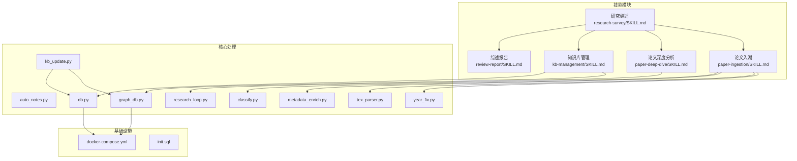
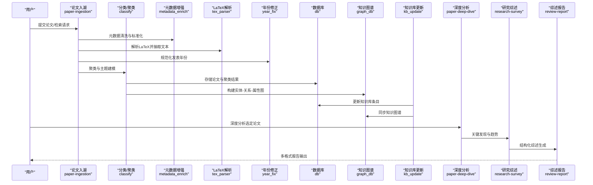
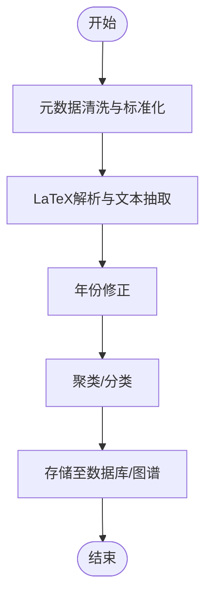
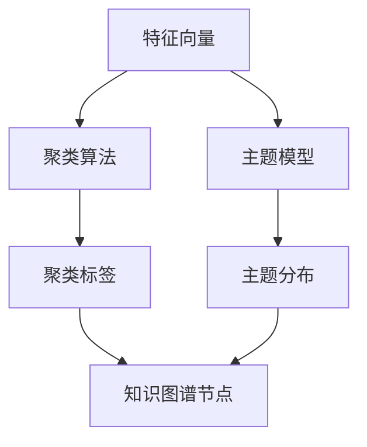
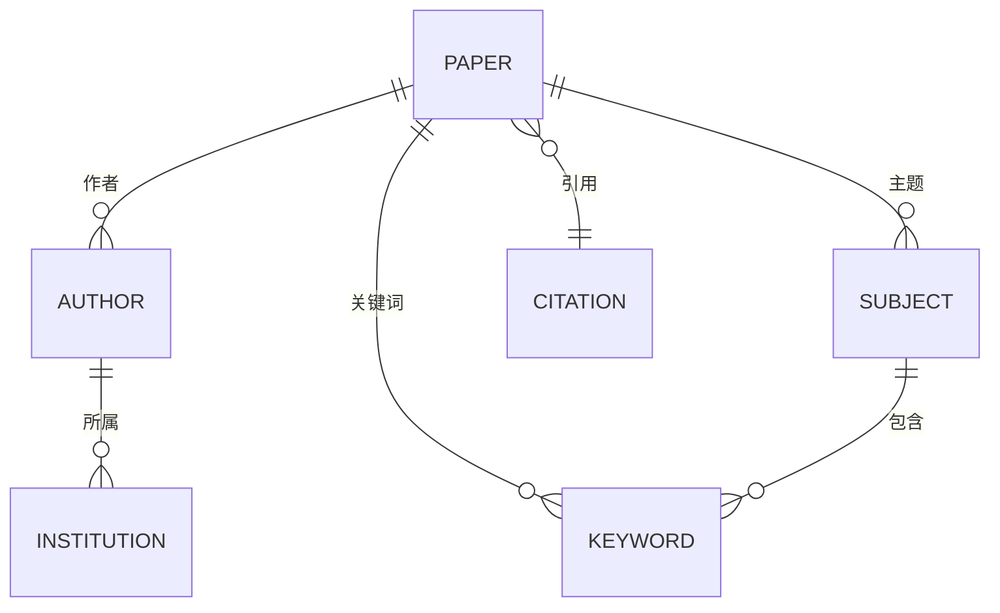
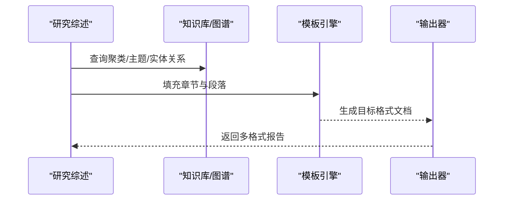
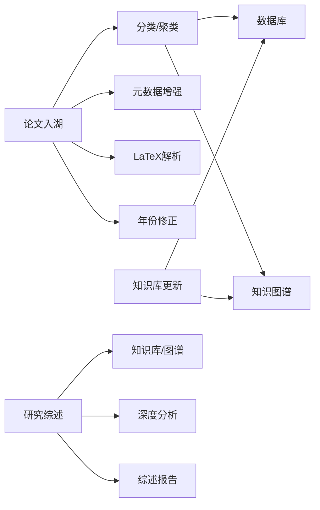

# 研究综述技能

<cite>
**本文档引用的文件**
- [plugin/skills/research-survey/SKILL.md](file://plugin/skills/research-survey/SKILL.md)
- [plugin/skills/review-report/SKILL.md](file://plugin/skills/review-report/SKILL.md)
- [plugin/skills/kb-management/SKILL.md](file://plugin/skills/kb-management/SKILL.md)
- [plugin/skills/paper-deep-dive/SKILL.md](file://plugin/skills/paper-deep-dive/SKILL.md)
- [plugin/skills/paper-ingestion/SKILL.md](file://plugin/skills/paper-ingestion/SKILL.md)
- [scholar/auto_notes.py](file://scholar/auto_notes.py)
- [scholar/classify.py](file://scholar/classify.py)
- [scholar/db.py](file://scholar/db.py)
- [scholar/graph_db.py](file://scholar/graph_db.py)
- [scholar/kb_update.py](file://scholar/kb_update.py)
- [scholar/metadata_enrich.py](file://scholar/metadata_enrich.py)
- [scholar/research_loop.py](file://scholar/research_loop.py)
- [scholar/tex_parser.py](file://scholar/tex_parser.py)
- [scholar/year_fix.py](file://scholar/year_fix.py)
- [infra/docker-compose.yml](file://infra/docker-compose.yml)
- [infra/init.sql](file://infra/init.sql)
</cite>

## 目录
1. [简介](#简介)
2. [项目结构](#项目结构)
3. [核心组件](#核心组件)
4. [架构总览](#架构总览)
5. [详细组件分析](#详细组件分析)
6. [依赖关系分析](#依赖关系分析)
7. [性能考虑](#性能考虑)
8. [故障排除指南](#故障排除指南)
9. [结论](#结论)
10. [附录](#附录)

## 简介
本技能模块聚焦于“研究综述”的自动化生成与知识整合，目标是实现对大规模文献的自动聚类、主题建模、知识图谱构建，并在此基础上进行结构化的综述内容组织、关键发现提取与未来趋势预测。系统通过与知识库管理、论文深度分析等模块协同，形成从数据入湖到知识沉淀再到智能应用的闭环。

## 项目结构
该仓库采用分层与功能域结合的组织方式：
- plugin/skills：技能模块定义与说明（Markdown），用于描述各技能的职责、输入输出与协作关系
- scholar：核心处理逻辑（Python），包括文献分类、知识图谱、数据库交互、LaTeX解析、元数据增强等
- infra：基础设施配置（Docker Compose、初始化SQL）
- 其他目录：测试、构建脚本、依赖清单等

**图表来源**
- [plugin/skills/research-survey/SKILL.md](file://plugin/skills/research-survey/SKILL.md)
- [plugin/skills/review-report/SKILL.md](file://plugin/skills/review-report/SKILL.md)
- [plugin/skills/kb-management/SKILL.md](file://plugin/skills/kb-management/SKILL.md)
- [plugin/skills/paper-deep-dive/SKILL.md](file://plugin/skills/paper-deep-dive/SKILL.md)
- [plugin/skills/paper-ingestion/SKILL.md](file://plugin/skills/paper-ingestion/SKILL.md)
- [scholar/db.py](file://scholar/db.py)
- [scholar/graph_db.py](file://scholar/graph_db.py)
- [scholar/kb_update.py](file://scholar/kb_update.py)
- [scholar/research_loop.py](file://scholar/research_loop.py)
- [scholar/classify.py](file://scholar/classify.py)
- [scholar/metadata_enrich.py](file://scholar/metadata_enrich.py)
- [scholar/tex_parser.py](file://scholar/tex_parser.py)
- [scholar/year_fix.py](file://scholar/year_fix.py)
- [infra/docker-compose.yml](file://infra/docker-compose.yml)
- [infra/init.sql](file://infra/init.sql)

**章节来源**
- [plugin/skills/research-survey/SKILL.md](file://plugin/skills/research-survey/SKILL.md)
- [plugin/skills/review-report/SKILL.md](file://plugin/skills/review-report/SKILL.md)
- [plugin/skills/kb-management/SKILL.md](file://plugin/skills/kb-management/SKILL.md)
- [plugin/skills/paper-deep-dive/SKILL.md](file://plugin/skills/paper-deep-dive/SKILL.md)
- [plugin/skills/paper-ingestion/SKILL.md](file://plugin/skills/paper-ingestion/SKILL.md)

## 核心组件
- 文献入湖与预处理：负责论文入库、元数据清洗与标准化、LaTeX解析与文本抽取、年份修正等
- 文献分类与主题建模：基于关键词、语义向量或混合策略进行聚类与主题识别
- 知识图谱与知识库：构建实体-关系-属性的知识网络，支持查询与推理
- 综述生成与报告：将结构化知识转化为可读性强的综述内容，支持模板化与多格式导出
- 论文深度分析：对精选论文进行细粒度解读，提炼关键发现与趋势
- 基础设施：容器化部署与数据库初始化，保障系统可扩展性与稳定性

**章节来源**
- [scholar/classify.py](file://scholar/classify.py)
- [scholar/metadata_enrich.py](file://scholar/metadata_enrich.py)
- [scholar/tex_parser.py](file://scholar/tex_parser.py)
- [scholar/year_fix.py](file://scholar/year_fix.py)
- [scholar/db.py](file://scholar/db.py)
- [scholar/graph_db.py](file://scholar/graph_db.py)
- [scholar/kb_update.py](file://scholar/kb_update.py)
- [scholar/research_loop.py](file://scholar/research_loop.py)

## 架构总览
研究综述技能以“入湖-建模-知识-生成”为主线，贯穿数据采集、预处理、聚类与主题建模、知识图谱构建、知识库更新、综述生成与报告输出的全链路流程。

**图表来源**
- [plugin/skills/paper-ingestion/SKILL.md](file://plugin/skills/paper-ingestion/SKILL.md)
- [plugin/skills/research-survey/SKILL.md](file://plugin/skills/research-survey/SKILL.md)
- [plugin/skills/review-report/SKILL.md](file://plugin/skills/review-report/SKILL.md)
- [plugin/skills/paper-deep-dive/SKILL.md](file://plugin/skills/paper-deep-dive/SKILL.md)
- [plugin/skills/kb-management/SKILL.md](file://plugin/skills/kb-management/SKILL.md)
- [scholar/classify.py](file://scholar/classify.py)
- [scholar/metadata_enrich.py](file://scholar/metadata_enrich.py)
- [scholar/tex_parser.py](file://scholar/tex_parser.py)
- [scholar/year_fix.py](file://scholar/year_fix.py)
- [scholar/db.py](file://scholar/db.py)
- [scholar/graph_db.py](file://scholar/graph_db.py)
- [scholar/kb_update.py](file://scholar/kb_update.py)

## 详细组件分析

### 文献入湖与预处理
- 功能要点
  - 元数据清洗与标准化：统一字段格式、补全缺失值、去重与冲突消解
  - LaTeX解析：从源码中抽取正文、公式、图表说明等结构化信息
  - 年份修正：修复异常或不一致的发表时间
  - 分类与聚类：为后续主题建模与知识图谱构建准备高质量输入
- 数据流
  - 输入：原始PDF/TeX/元数据
  - 处理：清洗→解析→修正→聚类
  - 输出：结构化论文记录、向量表示、聚类标签
- 复杂度与优化
  - 清洗与解析复杂度主要取决于文档数量与长度；可通过批处理与缓存提升吞吐
  - 聚类算法可选KMeans、层次聚类或基于嵌入的聚类，需平衡准确率与性能

**图表来源**
- [scholar/metadata_enrich.py](file://scholar/metadata_enrich.py)
- [scholar/tex_parser.py](file://scholar/tex_parser.py)
- [scholar/year_fix.py](file://scholar/year_fix.py)
- [scholar/classify.py](file://scholar/classify.py)
- [scholar/db.py](file://scholar/db.py)
- [scholar/graph_db.py](file://scholar/graph_db.py)

**章节来源**
- [plugin/skills/paper-ingestion/SKILL.md](file://plugin/skills/paper-ingestion/SKILL.md)
- [scholar/metadata_enrich.py](file://scholar/metadata_enrich.py)
- [scholar/tex_parser.py](file://scholar/tex_parser.py)
- [scholar/year_fix.py](file://scholar/year_fix.py)
- [scholar/classify.py](file://scholar/classify.py)
- [scholar/db.py](file://scholar/db.py)
- [scholar/graph_db.py](file://scholar/graph_db.py)

### 文献分类、聚类与主题建模
- 实现模式
  - 特征工程：TF-IDF、词向量或句子嵌入
  - 聚类算法：KMeans、DBSCAN、层次聚类或基于图的社区检测
  - 主题模型：LDA或神经主题模型（如BERTopic）以发现潜在主题
- 知识整合
  - 将聚类标签与主题分布映射到知识图谱节点，建立“论文-主题-关键词”的关联
- 性能与误差
  - 高维稀疏特征可能影响聚类质量，建议降维与正则化
  - 主题一致性可通过困惑度、主题间相似度等指标评估

**图表来源**
- [scholar/classify.py](file://scholar/classify.py)

**章节来源**
- [scholar/classify.py](file://scholar/classify.py)

### 知识图谱与知识库
- 知识图谱构建
  - 节点：论文、作者、机构、领域、关键词、主题
  - 边：引用关系、作者-论文、机构-作者、领域-论文、主题-论文
  - 属性：论文的标题、摘要、年份、引用数等
- 知识库更新
  - 将结构化结果写入知识库，支持增量更新与版本控制
- 查询与推理
  - 支持基于规则或嵌入的相似性检索，辅助综述生成

**图表来源**
- [scholar/graph_db.py](file://scholar/graph_db.py)
- [scholar/kb_update.py](file://scholar/kb_update.py)

**章节来源**
- [plugin/skills/kb-management/SKILL.md](file://plugin/skills/kb-management/SKILL.md)
- [scholar/graph_db.py](file://scholar/graph_db.py)
- [scholar/kb_update.py](file://scholar/kb_update.py)

### 综述生成与报告
- 结构化组织
  - 使用标准章节模板：引言、相关工作、方法论、实验/分析、讨论、结论、未来工作
  - 自动填充：将聚类与主题结果映射到相应段落
- 关键发现提取
  - 基于统计与关键词频率，提取高价值观点与争议点
- 趋势预测
  - 基于时间序列与主题演化，预测热点方向与交叉领域
- 模板定制与多格式输出
  - 支持LaTeX、Word、Markdown等多种格式，便于学术发布与二次编辑

**图表来源**
- [plugin/skills/review-report/SKILL.md](file://plugin/skills/review-report/SKILL.md)
- [plugin/skills/research-survey/SKILL.md](file://plugin/skills/research-survey/SKILL.md)
- [scholar/graph_db.py](file://scholar/graph_db.py)
- [scholar/kb_update.py](file://scholar/kb_update.py)

**章节来源**
- [plugin/skills/review-report/SKILL.md](file://plugin/skills/review-report/SKILL.md)
- [plugin/skills/research-survey/SKILL.md](file://plugin/skills/research-survey/SKILL.md)

### 论文深度分析
- 功能要点
  - 对精选论文进行逐段解析，标注方法、假设、证据强度
  - 识别对比实验与基准线，总结优缺点
  - 提炼跨论文的共同结论与分歧，支撑综述的批判性视角
- 与综述的衔接
  - 深度分析的结果作为综述“讨论/争议”部分的素材

**章节来源**
- [plugin/skills/paper-deep-dive/SKILL.md](file://plugin/skills/paper-deep-dive/SKILL.md)

## 依赖关系分析
- 技能模块间耦合
  - 研究综述依赖论文入湖、知识库管理与深度分析提供结构化输入
  - 综述报告负责最终呈现，独立于具体建模细节
- 核心处理模块依赖
  - 分类/聚类依赖元数据与解析后的文本
  - 知识图谱依赖数据库与知识库更新模块
- 外部依赖
  - Docker Compose与初始化SQL确保环境一致性与可复现性

**图表来源**
- [plugin/skills/paper-ingestion/SKILL.md](file://plugin/skills/paper-ingestion/SKILL.md)
- [plugin/skills/research-survey/SKILL.md](file://plugin/skills/research-survey/SKILL.md)
- [plugin/skills/review-report/SKILL.md](file://plugin/skills/review-report/SKILL.md)
- [plugin/skills/paper-deep-dive/SKILL.md](file://plugin/skills/paper-deep-dive/SKILL.md)
- [plugin/skills/kb-management/SKILL.md](file://plugin/skills/kb-management/SKILL.md)
- [scholar/classify.py](file://scholar/classify.py)
- [scholar/metadata_enrich.py](file://scholar/metadata_enrich.py)
- [scholar/tex_parser.py](file://scholar/tex_parser.py)
- [scholar/year_fix.py](file://scholar/year_fix.py)
- [scholar/db.py](file://scholar/db.py)
- [scholar/graph_db.py](file://scholar/graph_db.py)
- [scholar/kb_update.py](file://scholar/kb_update.py)

**章节来源**
- [infra/docker-compose.yml](file://infra/docker-compose.yml)
- [infra/init.sql](file://infra/init.sql)

## 性能考虑
- 批处理与并行化：对大规模论文集合采用分片处理与并发执行，减少I/O瓶颈
- 缓存策略：对高频查询与中间结果进行缓存，降低重复计算
- 算法选择：在准确率与速度之间权衡，必要时采用近似最近邻或分布式聚类
- 存储优化：合理设计索引与分区，加速知识图谱查询与知识库检索

## 故障排除指南
- 入湖失败
  - 检查元数据完整性与格式一致性
  - 确认LaTeX解析是否成功，必要时回退到纯文本模式
- 聚类/主题异常
  - 调整特征维度与聚类参数，检查异常值与噪声
  - 验证主题一致性指标，必要时重新训练模型
- 知识图谱查询慢
  - 检查索引与查询计划，优化热点路径
  - 控制一次性返回的实体数量
- 报告生成错误
  - 校验模板完整性与变量绑定
  - 确保多格式渲染器可用且版本兼容

## 结论
本技能模块通过“入湖-建模-知识-生成”的流水线，实现了从海量文献到结构化综述的自动化闭环。依托知识库与知识图谱，系统不仅能够产出高质量综述，还能持续沉淀与演进知识，为后续研究提供坚实基础。建议在实际部署中关注性能优化与可维护性，确保在不同规模数据下的稳定运行。

## 附录
- 安装与启动
  - 使用Docker Compose一键拉起服务与数据库
  - 初始化数据库Schema后导入种子数据
- 开发与测试
  - 单元测试覆盖核心处理函数
  - 端到端测试验证完整流程

**章节来源**
- [infra/docker-compose.yml](file://infra/docker-compose.yml)
- [infra/init.sql](file://infra/init.sql)
- [test/test_e2e.py](file://test/test_e2e.py)
- [test/test_db.py](file://test/test_db.py)