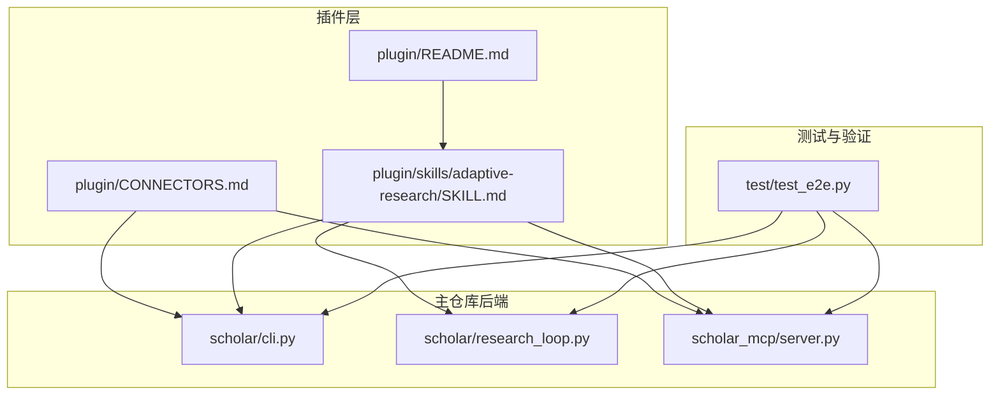
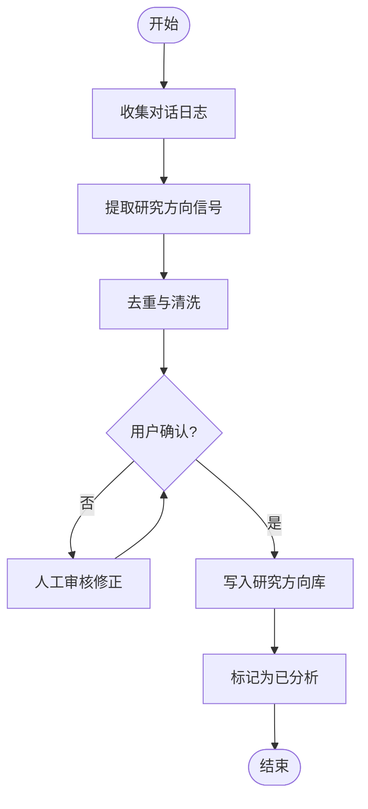
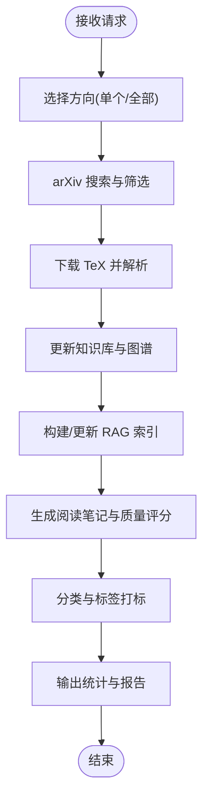
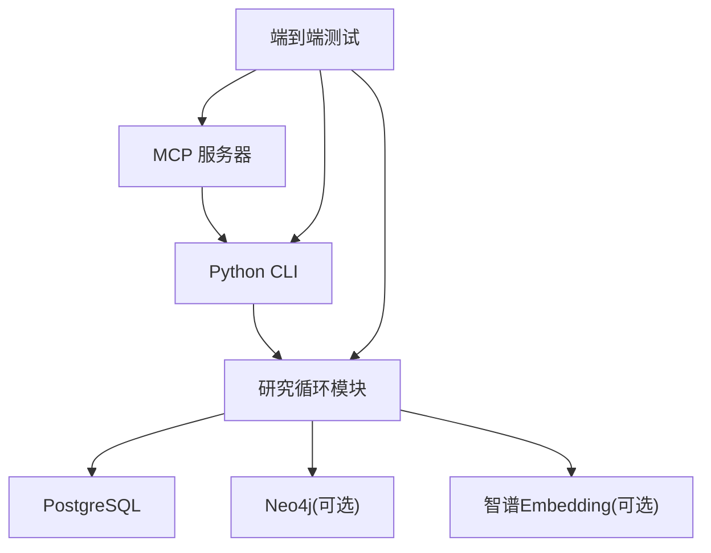

# 自适应研究技能

<cite>
**本文档引用的文件**
- [plugin/README.md](file://plugin/README.md)
- [plugin/CONNECTORS.md](file://plugin/CONNECTORS.md)
- [plugin/skills/adaptive-research/SKILL.md](file://plugin/skills/adaptive-research/SKILL.md)
- [scholar/cli.py](file://scholar/cli.py)
- [scholar/research_loop.py](file://scholar/research_loop.py)
- [scholar_mcp/server.py](file://scholar_mcp/server.py)
- [test/test_e2e.py](file://test/test_e2e.py)
</cite>

## 目录
1. [简介](#简介)
2. [项目结构](#项目结构)
3. [核心组件](#核心组件)
4. [架构总览](#架构总览)
5. [详细组件分析](#详细组件分析)
6. [依赖分析](#依赖分析)
7. [性能考虑](#性能考虑)
8. [故障排除指南](#故障排除指南)
9. [结论](#结论)
10. [附录](#附录)

## 简介
自适应研究技能是一个基于“研究方向管理 → 自动搜索 → 全流程入库”的闭环工作流，旨在根据用户的研究兴趣与历史行为，自动追踪并同步最新论文，完成从 arXiv 搜索、TeX 下载、解析、图谱更新、RAG 索引、阅读笔记、质量评分到分类打标签的全链路处理。该技能通过定时任务与交互式管理相结合的方式，持续优化研究方向并提升知识库质量。

## 项目结构
该技能位于插件系统的 skills 子目录中，并由主仓库的 Python CLI 与 MCP 服务器提供具体执行能力。整体结构如下：



**图表来源**
- [plugin/README.md:1-79](file://plugin/README.md#L1-L79)
- [plugin/skills/adaptive-research/SKILL.md:1-68](file://plugin/skills/adaptive-research/SKILL.md#L1-L68)
- [plugin/CONNECTORS.md:1-45](file://plugin/CONNECTORS.md#L1-L45)
- [scholar/cli.py:2420-2421](file://scholar/cli.py#L2420-L2421)
- [scholar/research_loop.py:1-10](file://scholar/research_loop.py#L1-L10)
- [scholar_mcp/server.py:484-491](file://scholar_mcp/server.py#L484-L491)
- [test/test_e2e.py:55-65](file://test/test_e2e.py#L55-L65)

**章节来源**
- [plugin/README.md:1-79](file://plugin/README.md#L1-L79)
- [plugin/skills/adaptive-research/SKILL.md:1-68](file://plugin/skills/adaptive-research/SKILL.md#L1-L68)
- [plugin/CONNECTORS.md:1-45](file://plugin/CONNECTORS.md#L1-L45)

## 核心组件
- 研究方向管理（interests）
  - 列表查看、新增、删除、标记已分析等操作，支持从对话日志中提取方向信号并进行去重与确认。
- 方向级同步（research-sync）
  - 针对指定方向或全部方向执行“搜索 arXiv → 下载 TeX → 解析 → 图谱更新 → RAG 索引 → 阅读笔记 → 质量评分 → 分类打标签”的全流程。
- 统计与状态（stats）
  - 展示知识库状态与入库结果，用于确认同步效果。
- 定时任务（Qoder Work）
  - 周期性触发研究同步，结合人工确认与自动化执行，形成“人机协作”的自适应循环。

**章节来源**
- [plugin/skills/adaptive-research/SKILL.md:10-68](file://plugin/skills/adaptive-research/SKILL.md#L10-L68)

## 架构总览
自适应研究技能的执行链路由插件层的技能说明与命令入口，经由 MCP 服务器转发至主仓库的 Python CLI，再由 CLI 调用研究循环模块完成具体任务。外部依赖包括 PostgreSQL 数据库与可选的 Neo4j 图数据库、智谱 Embedding API。

```mermaid
sequenceDiagram
participant User as "用户"
participant Skill as "自适应研究技能"
participant MCP as "MCP 服务器"
participant CLI as "Python CLI"
participant Loop as "研究循环模块"
participant DB as "PostgreSQL"
participant Graph as "Neo4j(可选)"
participant Embed as "智谱Embedding(可选)"
User->>Skill : 触发研究同步(按方向/全部)
Skill->>MCP : 调用 scholarchat_research_sync
MCP->>CLI : 执行 research-sync 命令
CLI->>Loop : 启动研究同步流程
Loop->>DB : 写入元数据/索引
Loop->>Graph : 更新引用/概念图谱(可选)
Loop->>Embed : 生成嵌入索引(可选)
Loop-->>CLI : 返回处理结果
CLI-->>MCP : 输出状态与统计
MCP-->>Skill : 返回同步报告
Skill-->>User : 展示结果与下一步建议
```

**图表来源**
- [plugin/skills/adaptive-research/SKILL.md:24-61](file://plugin/skills/adaptive-research/SKILL.md#L24-L61)
- [scholar_mcp/server.py:484-491](file://scholar_mcp/server.py#L484-L491)
- [scholar/cli.py:2420-2421](file://scholar/cli.py#L2420-L2421)
- [scholar/research_loop.py:1-10](file://scholar/research_loop.py#L1-L10)
- [plugin/CONNECTORS.md:5-34](file://plugin/CONNECTORS.md#L5-L34)

## 详细组件分析

### 组件一：研究方向管理（interests）
- 功能要点
  - 列出当前所有研究方向、关键词与搜索历史，便于评估与规划。
  - 支持新增与删除方向，避免重复与冗余。
  - 通过对话日志提取方向信号，经人工确认后纳入追踪列表。
- 处理流程
  - 日常收集 → 信号提取 → 去重与确认 → 写入方向库 → 标记已分析。



**图表来源**
- [plugin/skills/adaptive-research/SKILL.md:41-61](file://plugin/skills/adaptive-research/SKILL.md#L41-L61)

**章节来源**
- [plugin/skills/adaptive-research/SKILL.md:12-23](file://plugin/skills/adaptive-research/SKILL.md#L12-L23)
- [plugin/skills/adaptive-research/SKILL.md:41-61](file://plugin/skills/adaptive-research/SKILL.md#L41-L61)

### 组件二：方向级同步（research-sync）
- 功能要点
  - 针对单个方向或全部方向执行端到端同步，覆盖 arXiv 搜索、TeX 下载、解析、图谱更新、RAG 索引、阅读笔记、质量评分与分类打标。
- 关键接口
  - CLI 命令入口：research-sync（支持 category 与 max 参数）。
  - MCP 工具：scholar_research_sync（封装 CLI 调用）。
- 流程示意



**图表来源**
- [plugin/skills/adaptive-research/SKILL.md:24-34](file://plugin/skills/adaptive-research/SKILL.md#L24-L34)
- [scholar/cli.py:2420-2421](file://scholar/cli.py#L2420-L2421)
- [scholar_mcp/server.py:484-491](file://scholar_mcp/server.py#L484-L491)

**章节来源**
- [plugin/skills/adaptive-research/SKILL.md:24-34](file://plugin/skills/adaptive-research/SKILL.md#L24-L34)
- [scholar/cli.py:2420-2421](file://scholar/cli.py#L2420-L2421)
- [scholar_mcp/server.py:484-491](file://scholar_mcp/server.py#L484-L491)

### 组件三：统计与状态（stats）
- 功能要点
  - 展示知识库状态、入库数量与处理进度，辅助判断同步效果与健康度。
- 使用场景
  - 同步完成后查看结果，确认新论文是否成功入库与索引是否更新。

**章节来源**
- [plugin/skills/adaptive-research/SKILL.md:35-39](file://plugin/skills/adaptive-research/SKILL.md#L35-L39)

### 组件四：定时任务（Qoder Work）
- 功能要点
  - 周期性触发研究同步，结合人工确认与自动化执行，形成稳定的自适应循环。
- 典型流程
  - 周报收集 → 信号提取 → 人工确认 → 对确认方向执行同步 → 报告输出。

**章节来源**
- [plugin/skills/adaptive-research/SKILL.md:41-61](file://plugin/skills/adaptive-research/SKILL.md#L41-L61)

## 依赖分析
- 外部服务
  - PostgreSQL：存储论文元数据、章节、公式与引用关系。
  - Neo4j（可选）：用于引用网络分析与概念图谱查询。
  - 智谱 Embedding API（可选）：用于 RAG 语义检索。
- 内部依赖
  - MCP 服务器负责将技能请求转发给 Python CLI。
  - CLI 命令 research-sync 调用研究循环模块完成具体处理。
  - 测试用例覆盖端到端流程，验证自适应研究循环的完整性。



**图表来源**
- [plugin/CONNECTORS.md:5-34](file://plugin/CONNECTORS.md#L5-L34)
- [scholar_mcp/server.py:484-491](file://scholar_mcp/server.py#L484-L491)
- [test/test_e2e.py:55-65](file://test/test_e2e.py#L55-L65)

**章节来源**
- [plugin/CONNECTORS.md:1-45](file://plugin/CONNECTORS.md#L1-L45)
- [test/test_e2e.py:55-65](file://test/test_e2e.py#L55-L65)

## 性能考虑
- 批量与并发
  - 对多个研究方向执行同步时，建议分批控制并发度，避免数据库与外部 API 的瞬时压力。
- 索引与缓存
  - 合理设置 RAG 索引与图谱更新频率，减少重复计算；利用缓存降低重复解析成本。
- 资源配额
  - 在高频同步场景下，优先保证数据库连接池与外部 API 的配额充足。
- 任务调度
  - 将大规模同步安排在低峰时段，避免影响其他任务的响应时间。

## 故障排除指南
- 研究方向管理
  - 症状：方向重复或缺失。
  - 排查：检查对话日志提取逻辑与去重策略，确认人工确认环节是否遗漏。
- 方向级同步
  - 症状：同步中断或部分失败。
  - 排查：查看 CLI 输出与日志，定位 arXiv 搜索、TeX 下载、解析或索引阶段的问题；必要时回滚到上一个稳定版本。
- 统计与状态
  - 症状：stats 显示入库数量异常。
  - 排查：核对数据库连接与索引状态，确认最近一次同步是否成功完成。
- 外部依赖
  - 症状：数据库或图谱服务不可用。
  - 排查：确认容器状态与端口映射；检查连接参数与凭据；对于可选服务（Neo4j、Embedding），确认是否正确配置或可降级使用。

**章节来源**
- [plugin/skills/adaptive-research/SKILL.md:41-68](file://plugin/skills/adaptive-research/SKILL.md#L41-L68)
- [plugin/CONNECTORS.md:5-34](file://plugin/CONNECTORS.md#L5-L34)

## 结论
自适应研究技能通过“研究方向管理 + 方向级同步 + 统计反馈 + 定时任务”的闭环设计，实现了以用户兴趣与历史行为为中心的自动化研究流程。其核心价值在于将人工意图转化为可执行的自动化任务，并通过外部服务与内部模块的协同，持续优化知识库的质量与覆盖面。建议在实践中结合业务负载与资源约束，合理配置并发与调度策略，确保系统稳定高效运行。

## 附录
- 使用示例（基于技能说明）
  - 查看/管理研究方向：使用 interests list/add/remove/mark-analyzed 等命令。
  - 方向级同步：针对单个方向或全部方向执行 research-sync。
  - 查看结果：使用 stats 命令查看知识库状态。
  - 定时任务：在 Qoder Work 中创建周期性任务，按周执行同步流程。

**章节来源**
- [plugin/skills/adaptive-research/SKILL.md:10-68](file://plugin/skills/adaptive-research/SKILL.md#L10-L68)