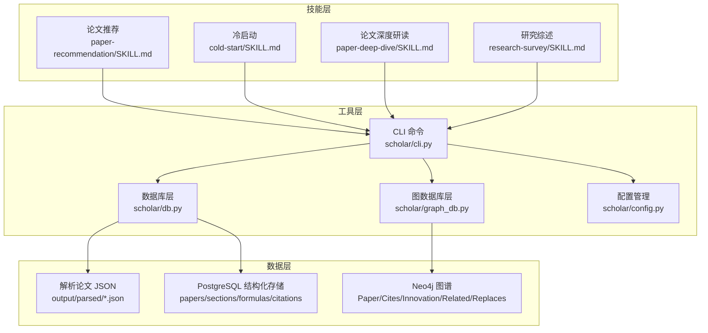
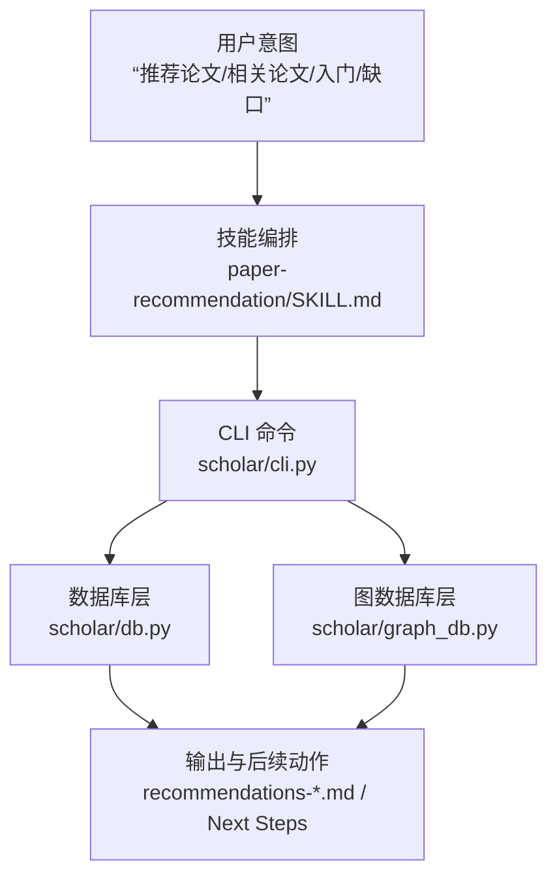
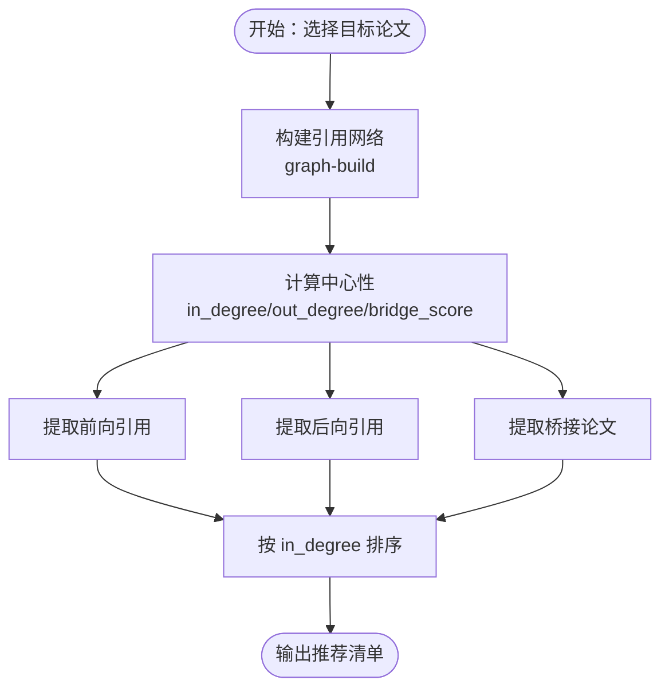
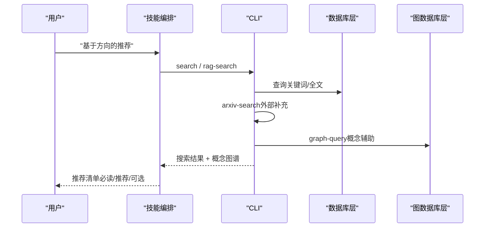
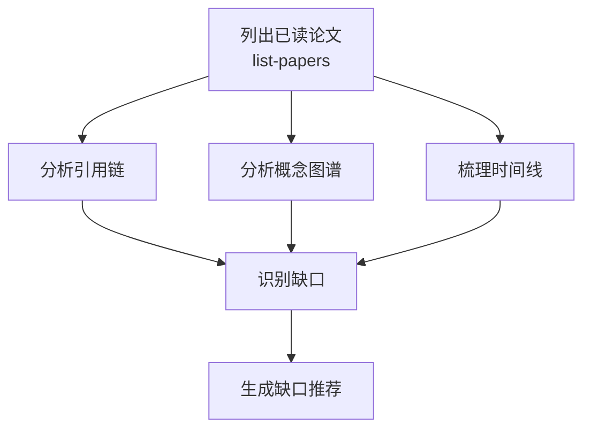
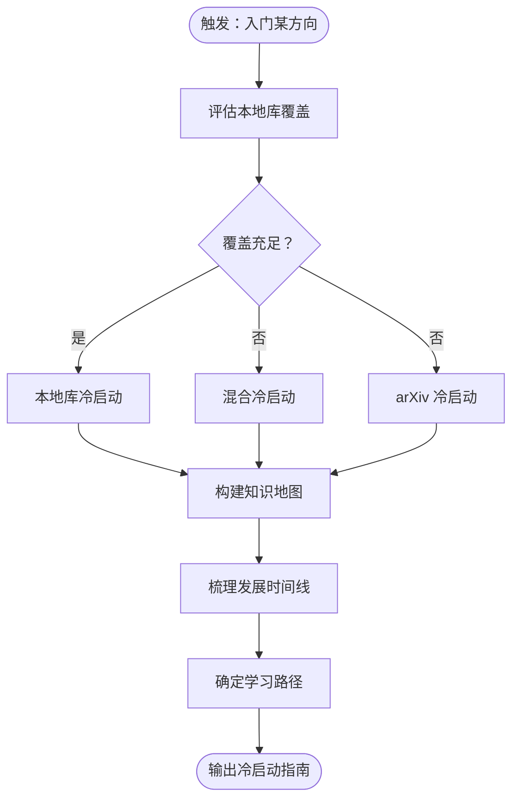
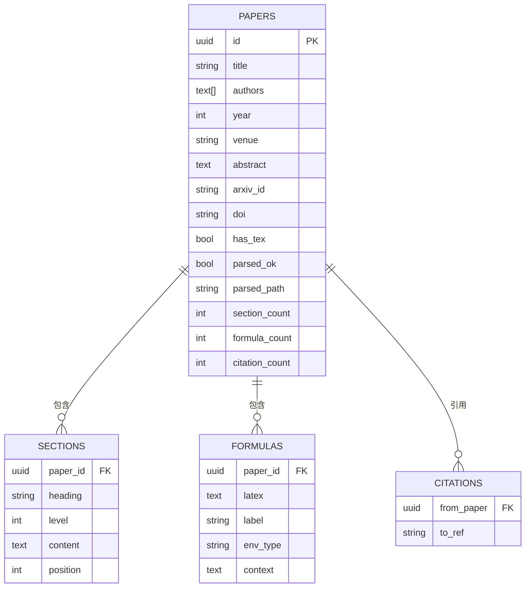
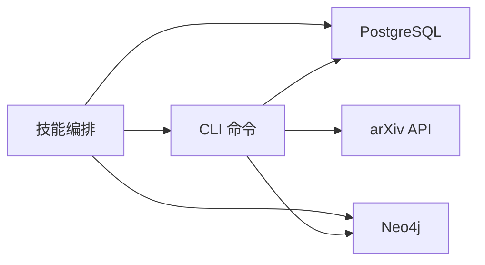

# 论文推荐技能

<cite>
**本文档引用的文件**
- [SKILL.md（论文推荐）](file://plugin/skills/paper-recommendation/SKILL.md)
- [SKILL.md（冷启动）](file://plugin/skills/cold-start/SKILL.md)
- [SKILL.md（论文深度研读）](file://plugin/skills/paper-deep-dive/SKILL.md)
- [SKILL.md（研究综述）](file://plugin/skills/research-survey/SKILL.md)
- [主入口（CLI）](file://scholar/__main__.py)
- [命令行接口（CLI）](file://scholar/cli.py)
- [数据库层](file://scholar/db.py)
- [图数据库层（Neo4j）](file://scholar/graph_db.py)
- [配置管理](file://scholar/config.py)
</cite>

## 目录
1. [简介](#简介)
2. [项目结构](#项目结构)
3. [核心组件](#核心组件)
4. [架构总览](#架构总览)
5. [详细组件分析](#详细组件分析)
6. [依赖分析](#依赖分析)
7. [性能考虑](#性能考虑)
8. [故障排查指南](#故障排查指南)
9. [结论](#结论)
10. [附录](#附录)

## 简介
本文件为“论文推荐技能”模块的技术文档，聚焦于基于内容的推荐、引用网络与概念图谱驱动的推荐、以及冷启动与混合策略。文档从系统架构、数据模型、特征工程、评分机制、配置参数、性能指标与评估方法、解释性与用户反馈、冷启动与实时更新等方面进行深入阐述，并提供可视化图示与实践指引，帮助读者高效理解与扩展该推荐系统。

## 项目结构
推荐技能由多个技能（Skill）与底层工具链组成：
- 技能层：论文推荐、冷启动、论文深度研读、研究综述等
- 工具层：CLI 命令、数据库层、图数据库层、配置管理
- 数据层：解析后的论文 JSON、Neo4j 图谱、PostgreSQL 结构化存储

图表来源
- [主入口（CLI）:1-8](file://scholar/__main__.py#L1-L8)
- [命令行接口（CLI）:1-800](file://scholar/cli.py#L1-L800)
- [数据库层:1-276](file://scholar/db.py#L1-L276)
- [图数据库层（Neo4j）:1-800](file://scholar/graph_db.py#L1-L800)
- [配置管理:1-119](file://scholar/config.py#L1-L119)

章节来源
- [主入口（CLI）:1-8](file://scholar/__main__.py#L1-L8)
- [命令行接口（CLI）:1-800](file://scholar/cli.py#L1-L800)
- [数据库层:1-276](file://scholar/db.py#L1-L276)
- [图数据库层（Neo4j）:1-800](file://scholar/graph_db.py#L1-L800)
- [配置管理:1-119](file://scholar/config.py#L1-L119)

## 核心组件
- 推荐流程编排：根据用户意图（延伸阅读、方向入门、阅读缺口）选择推荐策略
- 引用网络推荐：基于 in_degree/out_degree/bridge_score 的中心性指标
- 概念图谱推荐：基于 HAS_CONCEPT/RELATED_TO/REPLACES 的语义连接
- 冷启动策略：本地库优先、arXiv 补充、知识地图与时间线构建
- 混合搜索与排序：关键词搜索 + RAG 混合 + 多维排序（经典/最新/多样性）
- 输出与后续动作：结构化推荐清单、Next Steps 导航

章节来源
- [SKILL.md（论文推荐）:1-96](file://plugin/skills/paper-recommendation/SKILL.md#L1-L96)
- [SKILL.md（冷启动）:1-147](file://plugin/skills/cold-start/SKILL.md#L1-L147)
- [命令行接口（CLI）:660-800](file://scholar/cli.py#L660-L800)

## 架构总览
推荐系统采用“技能编排 + 多源数据 + 图谱增强”的架构：
- 技能层负责对话意图识别与流程编排
- 数据层提供解析 JSON、结构化数据库与 Neo4j 图谱
- 特征工程来自论文元数据、公式密度、引用关系、概念标签
- 排序与评分综合考虑经典性、时效性、多样性与用户已读情况

图表来源
- [SKILL.md（论文推荐）:1-96](file://plugin/skills/paper-recommendation/SKILL.md#L1-L96)
- [命令行接口（CLI）:1-800](file://scholar/cli.py#L1-L800)
- [数据库层:1-276](file://scholar/db.py#L1-L276)
- [图数据库层（Neo4j）:1-800](file://scholar/graph_db.py#L1-L800)

## 详细组件分析

### 基于引用网络的推荐（中心性指标）
- 核心指标
  - 入度 in_degree：衡量被引用次数，反映影响力
  - 出度 out_degree：衡量引用他文数量，反映覆盖面
  - 桥接分数 bridge_score：in_degree × out_degree / (in_degree + out_degree)，用于发现跨领域桥梁论文
- 推荐类型
  - 前向引用：前置知识与理论基础
  - 后向引用：后续进展与跟踪
  - 桥接论文：连接不同子领域，扩展视野
- 查询与统计
  - 通过 graph-build 与 graph-stats 构建并统计中心性
  - 通过 graph-query 查询概念图谱辅助定位

图表来源
- [命令行接口（CLI）:660-792](file://scholar/cli.py#L660-L792)
- [图数据库层（Neo4j）:180-223](file://scholar/graph_db.py#L180-L223)

章节来源
- [命令行接口（CLI）:660-792](file://scholar/cli.py#L660-L792)
- [图数据库层（Neo4j）:180-223](file://scholar/graph_db.py#L180-L223)

### 基于方向的推荐（关键词 + RAG + 多维筛选）
- 搜索路径
  - 本地关键词搜索：search
  - RAG 混合搜索：rag-search（语义 + BM25）
  - arXiv 外部搜索：arxiv-search
- 筛选维度
  - 高被引经典论文（结合 in_degree）
  - 最近 2 年的最新工作
  - 多样性覆盖（tags.domains 过滤）
- 排序与说明
  - 必读/推荐/可选三档分级
  - 每篇附“推荐理由、与目标关系、预计难度”

图表来源
- [SKILL.md（论文推荐）:33-44](file://plugin/skills/paper-recommendation/SKILL.md#L33-L44)
- [命令行接口（CLI）:310-370](file://scholar/cli.py#L310-L370)
- [命令行接口（CLI）:605-658](file://scholar/cli.py#L605-L658)
- [图数据库层（Neo4j）:795-800](file://scholar/graph_db.py#L795-L800)

章节来源
- [SKILL.md（论文推荐）:33-44](file://plugin/skills/paper-recommendation/SKILL.md#L33-L44)
- [命令行接口（CLI）:310-370](file://scholar/cli.py#L310-L370)
- [命令行接口（CLI）:605-658](file://scholar/cli.py#L605-L658)
- [图数据库层（Neo4j）:795-800](file://scholar/graph_db.py#L795-L800)

### 基于阅读缺口的推荐（已读/目标关系）
- 输入：已读论文列表（list-papers）
- 识别缺口
  - 引用链缺失（A→C，缺 B）
  - 概念图谱未覆盖的关键节点
  - 时间线空白年份
- 输出：缺口论文清单与填补建议

图表来源
- [SKILL.md（论文推荐）:45-53](file://plugin/skills/paper-recommendation/SKILL.md#L45-L53)
- [命令行接口（CLI）:375-416](file://scholar/cli.py#L375-L416)

章节来源
- [SKILL.md（论文推荐）:45-53](file://plugin/skills/paper-recommendation/SKILL.md#L45-L53)
- [命令行接口（CLI）:375-416](file://scholar/cli.py#L375-L416)

### 冷启动策略（陌生领域入门）
- 本地库评估：本地覆盖 >20 篇（直接）、5-20 篇（混合）、<5 篇（arXiv）
- 概念图谱评估：是否存在 Innovation 节点与 REPLACES 关系
- 知识地图构建：核心概念、依赖关系、分类层次、关键人物
- 时间线梳理：里程碑与演进阶段
- 学习路径：综述 → 开创性 → 最新论文的顺序
- 与已有知识关联：通过 graph-query 建立连接点

图表来源
- [SKILL.md（冷启动）:11-84](file://plugin/skills/cold-start/SKILL.md#L11-L84)
- [命令行接口（CLI）:660-792](file://scholar/cli.py#L660-L792)
- [图数据库层（Neo4j）:795-800](file://scholar/graph_db.py#L795-L800)

章节来源
- [SKILL.md（冷启动）:11-84](file://plugin/skills/cold-start/SKILL.md#L11-L84)
- [命令行接口（CLI）:660-792](file://scholar/cli.py#L660-L792)
- [图数据库层（Neo4j）:795-800](file://scholar/graph_db.py#L795-L800)

### 混合推荐策略（内容 + 图谱 + 多维排序）
- 内容特征
  - 元数据：年份、会议、作者、摘要
  - 结构特征：章节数量、公式数量、引用数量
  - 语义特征：RAG 混合搜索（语义 + BM25）
- 图谱特征
  - 引用网络中心性（in_degree、bridge_score）
  - 概念图谱（HAS_CONCEPT、RELATED_TO、REPLACES）
- 排序规则
  - 必读：高 in_degree、高影响力、与目标强相关
  - 推荐：中等时效性、多样性覆盖
  - 可选：新颖性、跨领域桥接

章节来源
- [命令行接口（CLI）:310-370](file://scholar/cli.py#L310-L370)
- [命令行接口（CLI）:660-792](file://scholar/cli.py#L660-L792)
- [图数据库层（Neo4j）:180-223](file://scholar/graph_db.py#L180-L223)

### 数据模型与特征工程
- 解析数据模型（JSON）
  - 论文元信息：paper_id、title、authors、year、venue、abstract
  - 结构信息：sections（含 heading、content、level）
  - 数学信息：formulas（含 latex、label、env_type、context）
  - 引用信息：citations（to_ref）
- 结构化存储（PostgreSQL）
  - 表：papers、sections、formulas、citations
  - 主键/外键约束与 upsert 逻辑
- 图谱模型（Neo4j）
  - 节点：Paper、Innovation
  - 边：CITES、HAS_CONCEPT、RELATED_TO、REPLACES
  - 中心性属性：in_degree、out_degree、bridge_score
- 特征工程
  - TF-IDF 概念匹配：title/abstract/sections → Innovation
  - arXiv 搜索：关键词 + 最大结果数
  - 评分维度：经典性（in_degree）、时效性（year）、多样性（tags.domains）

图表来源
- [数据库层:79-176](file://scholar/db.py#L79-L176)

章节来源
- [数据库层:79-176](file://scholar/db.py#L79-L176)
- [图数据库层（Neo4j）:225-281](file://scholar/graph_db.py#L225-L281)

### 评分机制与解释性
- 评分维度（示例）
  - 经典性：in_degree（被引次数）
  - 时效性：year（最近 2 年优先）
  - 多样性：tags.domains（覆盖不同子方向）
  - 难度：公式密度、方法复杂度
- 解释性
  - 每篇推荐附“一句话说明为什么推荐”
  - 明确与目标论文/已读论文的关系
  - 预估阅读难度与前置要求

章节来源
- [SKILL.md（论文推荐）:54-64](file://plugin/skills/paper-recommendation/SKILL.md#L54-L64)
- [图数据库层（Neo4j）:180-223](file://scholar/graph_db.py#L180-L223)

### 用户反馈与迭代
- Next Steps 导航：推荐完成后，引导至“论文深度研读”“冷启动”等后续动作
- 反馈闭环：基于深度研读与综述的结果，持续优化推荐清单与排序权重

章节来源
- [SKILL.md（论文推荐）:88-96](file://plugin/skills/paper-recommendation/SKILL.md#L88-L96)
- [SKILL.md（论文深度研读）:79-84](file://plugin/skills/paper-deep-dive/SKILL.md#L79-L84)
- [SKILL.md（研究综述）:104-113](file://plugin/skills/research-survey/SKILL.md#L104-L113)

## 依赖分析
- 外部依赖
  - PostgreSQL + pgvector：结构化存储与向量检索
  - Neo4j：引用网络与概念图谱
  - arXiv API：外部论文搜索
  - Python 包：typer、rich、psycopg2、neo4j、dotenv
- 内部耦合
  - CLI 命令统一调度数据库与图谱操作
  - 技能层通过 CLI 间接调用底层能力
  - 数据层与图谱层相互补充，共同支撑推荐

图表来源
- [命令行接口（CLI）:1-800](file://scholar/cli.py#L1-L800)
- [配置管理:44-61](file://scholar/config.py#L44-L61)

章节来源
- [命令行接口（CLI）:1-800](file://scholar/cli.py#L1-L800)
- [配置管理:44-61](file://scholar/config.py#L44-L61)

## 性能考虑
- 批量处理
  - parse-all 支持批量解析与入库，减少单次 IO
- 查询优化
  - PostgreSQL 使用 upsert 与索引字段（year、venue、tags）
  - Neo4j 使用 MERGE 与分批写入，避免重复与死锁
- 搜索效率
  - arXiv 请求带重试与超时控制，支持代理
  - RAG 混合搜索与关键词搜索并行，提升召回
- 可扩展性
  - 文件模式与数据库模式双通道，降低部署门槛
  - 图谱可选启用，满足不同硬件条件

章节来源
- [命令行接口（CLI）:176-237](file://scholar/cli.py#L176-L237)
- [命令行接口（CLI）:605-658](file://scholar/cli.py#L605-L658)
- [配置管理:72-119](file://scholar/config.py#L72-L119)

## 故障排查指南
- Neo4j 不可用
  - 现象：graph-build/graph-stats 报错
  - 处理：确认 Neo4j URI/账号密码，或关闭图谱功能
- PostgreSQL 不可用
  - 现象：数据库不可用，回退文件模式
  - 处理：检查连接参数或禁用数据库功能
- arXiv 请求失败
  - 现象：arxiv-search 抛异常
  - 处理：设置代理、调整超时与重试次数
- 推荐结果为空
  - 现象：关键词搜索无结果
  - 处理：扩大关键词、启用 RAG 混合搜索、补充 arXiv

章节来源
- [命令行接口（CLI）:660-706](file://scholar/cli.py#L660-L706)
- [命令行接口（CLI）:605-658](file://scholar/cli.py#L605-L658)
- [配置管理:72-119](file://scholar/config.py#L72-L119)

## 结论
本推荐系统通过“技能编排 + 多源数据 + 图谱增强”的方式，实现了从“延伸阅读、方向入门、阅读缺口”到“混合排序与解释性输出”的完整闭环。系统具备良好的可扩展性与可解释性，既可满足新手冷启动需求，也可为专家用户提供深度洞察与后续动作导航。建议在生产环境中结合业务反馈持续迭代排序权重与特征工程，以提升推荐效果与用户满意度。

## 附录
- 输出规范
  - 推荐清单：recommendations-<topic>.md（必读/推荐/可选三档）
  - 冷启动指南：cold-start-<topic>.md（概念、时间线、学习路径）
- 下一步动作
  - /paper-deep-dive：对 Top 论文进行深度分析
  - /research-survey：对该方向进行全面综述
  - /citation-network：分析引用网络发现经典与桥接论文

章节来源
- [SKILL.md（论文推荐）:65-96](file://plugin/skills/paper-recommendation/SKILL.md#L65-L96)
- [SKILL.md（冷启动）:138-147](file://plugin/skills/cold-start/SKILL.md#L138-L147)
- [SKILL.md（论文深度研读）:79-84](file://plugin/skills/paper-deep-dive/SKILL.md#L79-L84)
- [SKILL.md（研究综述）:104-113](file://plugin/skills/research-survey/SKILL.md#L104-L113)