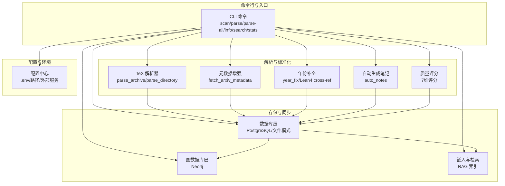
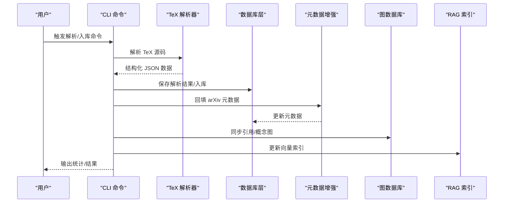
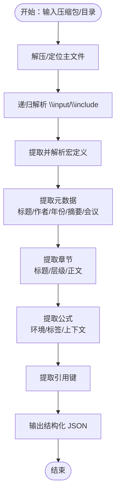
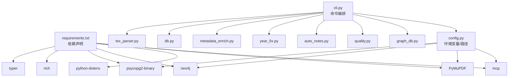

# 论文摄取技能

<cite>
**本文档引用的文件**
- [plugin/skills/paper-ingestion/SKILL.md](file://plugin/skills/paper-ingestion/SKILL.md)
- [scholar/cli.py](file://scholar/cli.py)
- [scholar/db.py](file://scholar/db.py)
- [scholar/kb_update.py](file://scholar/kb_update.py)
- [scholar/tex_parser.py](file://scholar/tex_parser.py)
- [scholar/metadata_enrich.py](file://scholar/metadata_enrich.py)
- [scholar/year_fix.py](file://scholar/year_fix.py)
- [scholar/auto_notes.py](file://scholar/auto_notes.py)
- [scholar/quality.py](file://scholar/quality.py)
- [scholar/config.py](file://scholar/config.py)
- [scholar/graph_db.py](file://scholar/graph_db.py)
- [plugin/skills/kb-management/SKILL.md](file://plugin/skills/kb-management/SKILL.md)
- [plugin/skills/research-survey/SKILL.md](file://plugin/skills/research-survey/SKILL.md)
- [requirements.txt](file://requirements.txt)
</cite>

## 目录
1. [简介](#简介)
2. [项目结构](#项目结构)
3. [核心组件](#核心组件)
4. [架构总览](#架构总览)
5. [详细组件分析](#详细组件分析)
6. [依赖关系分析](#依赖关系分析)
7. [性能考虑](#性能考虑)
8. [故障排除指南](#故障排除指南)
9. [结论](#结论)
10. [附录](#附录)

## 简介
本文件面向“论文摄取技能”模块，系统性阐述论文数据的自动获取、解析与标准化流程，覆盖 TeX 源码解析、元数据提取、全文结构化、多格式支持（含 PDF 回退）、批量处理与增量更新机制，并提供数据清洗、格式统一与质量控制能力。同时说明与“论文深度分析”“知识库管理”等模块的数据流转关系，帮助读者在实际部署中高效、稳定地完成论文入库与预处理。

## 项目结构
论文摄取技能由命令行入口、解析器、数据库层、元数据增强、质量评分、自动生成笔记、图数据库集成以及配置管理组成。其核心工作流包括：扫描目录、批量解析 TeX、回填元数据、生成预计算产物、入库并同步图谱与向量索引。

图表来源
- [scholar/cli.py](file://scholar/cli.py)
- [scholar/tex_parser.py](file://scholar/tex_parser.py)
- [scholar/metadata_enrich.py](file://scholar/metadata_enrich.py)
- [scholar/year_fix.py](file://scholar/year_fix.py)
- [scholar/auto_notes.py](file://scholar/auto_notes.py)
- [scholar/quality.py](file://scholar/quality.py)
- [scholar/db.py](file://scholar/db.py)
- [scholar/graph_db.py](file://scholar/graph_db.py)
- [scholar/config.py](file://scholar/config.py)

章节来源
- [plugin/skills/paper-ingestion/SKILL.md](file://plugin/skills/paper-ingestion/SKILL.md)
- [scholar/cli.py](file://scholar/cli.py)
- [scholar/config.py](file://scholar/config.py)

## 核心组件
- 命令行接口：提供扫描、解析、信息展示、搜索、统计、导出、arXiv 搜索、图谱构建与统计、RAG 索引等命令。
- TeX 解析器：从压缩包或已解压目录中定位主文件、递归解析输入文件、提取标题、作者、年份、摘要、章节、公式、引用等。
- 数据库层：封装 PostgreSQL 存储（psycopg2），提供 upsert、查询、全文检索、统计等能力；无连接时回退至文件模式。
- 元数据增强：通过 arXiv API 一次性提取 arXiv ID、DOI、年份、作者、会议等字段，统一缺失字段。
- 年份补全：结合 Lean4 Database.lean 的论文定义进行跨引用补全，同时尝试从内容启发式提取年份。
- 自动生成笔记：基于解析结果生成结构化阅读笔记，包含摘要、贡献、方法概览、关键公式、章节树、引用摘要。
- 质量评分：7 维度评分（元数据、结构、引用密度、可复现信号、问题定义清晰度、创新信号、实验严谨性）。
- 图数据库层：构建引用网络与概念图谱，支持中心性计算、引用解析、概念共现与技术演化关系。
- 配置中心：统一管理路径、数据库、图数据库、嵌入模型与 arXiv API 请求参数。

章节来源
- [scholar/cli.py](file://scholar/cli.py)
- [scholar/tex_parser.py](file://scholar/tex_parser.py)
- [scholar/db.py](file://scholar/db.py)
- [scholar/metadata_enrich.py](file://scholar/metadata_enrich.py)
- [scholar/year_fix.py](file://scholar/year_fix.py)
- [scholar/auto_notes.py](file://scholar/auto_notes.py)
- [scholar/quality.py](file://scholar/quality.py)
- [scholar/graph_db.py](file://scholar/graph_db.py)
- [scholar/config.py](file://scholar/config.py)

## 架构总览
论文摄取技能采用“命令驱动 + 解析器 + 存储层 + 图谱/向量”的分层架构。命令行负责编排与调度，解析器负责结构化提取，数据库层负责持久化与查询，图数据库与向量索引负责高级分析与检索。

图表来源
- [scholar/cli.py](file://scholar/cli.py)
- [scholar/tex_parser.py](file://scholar/tex_parser.py)
- [scholar/db.py](file://scholar/db.py)
- [scholar/metadata_enrich.py](file://scholar/metadata_enrich.py)
- [scholar/graph_db.py](file://scholar/graph_db.py)

## 详细组件分析

### 命令行与工作流编排
- 扫描：列出论文目录状态，统计已解析/有源码/有 PDF 数量。
- 单篇解析：解析指定论文，保存 JSON，入库（若数据库可用）。
- 批量解析：遍历未解析论文，逐个解析并入库，失败记录但不影响整体。
- 信息展示：展示解析后的标题、作者、年份、摘要、章节、公式、引用等。
- 搜索：优先查询数据库，回退到 JSON 文件全文检索。
- 统计：聚合元数据覆盖率、公式/引用/章节总数、按年/会议分布。
- 导出：生成 BibTeX 引文文件。
- arXiv 搜索：调用 API 展示结果。
- 图谱构建与统计：构建引用网络、概念图谱，计算中心性与桥接论文。
- RAG 索引：基于嵌入模型为论文内容建立向量索引。

章节来源
- [scholar/cli.py](file://scholar/cli.py)
- [plugin/skills/paper-ingestion/SKILL.md](file://plugin/skills/paper-ingestion/SKILL.md)

### TeX 解析器（结构化提取）
- 归档/目录解析：自动解压 tar.gz/zip，查找主 TeX 文件（含输入文件递归），构建完整内容。
- 元数据提取：标题（宏展开、格式清理、换行处理）、作者（多格式支持、去噪）、年份（文档类、会议风格、arXiv ID、注释）、摘要、会议/期刊。
- 结构提取：章节标题、层级、正文（噪声命令过滤、LaTeX 清洗）。
- 数学公式：识别多种环境（align、gather、equation 等），提取 LaTeX、标签、上下文。
- 引用：识别 cite/citet/citep 等命令，提取引用键。
- 宏处理：提取 newcommand/def 定义，多轮替换宏，提升解析稳定性。
- 输出：JSON 包含 paper_id、title、authors、year、venue、abstract、sections、formulas、citations、tex_file_count、main_tex_file 等。

图表来源
- [scholar/tex_parser.py](file://scholar/tex_parser.py)

章节来源
- [scholar/tex_parser.py](file://scholar/tex_parser.py)

### 数据库层（持久化与查询）
- PostgreSQL 接口：提供 upsert_paper、upsert_sections、upsert_formulas、upsert_citations、查询与统计。
- 文件模式回退：当数据库不可用时，自动切换为文件存储（保存/加载 JSON）。
- 全文检索：在数据库可用时优先查询，否则回退到 JSON 文件全文检索。
- 统计接口：提供论文总数、解析数、公式/引用/章节总数、年份范围等。

章节来源
- [scholar/db.py](file://scholar/db.py)

### 元数据增强（arXiv API 一体化）
- 一次性提取：通过标题在 arXiv 搜索，返回最佳匹配条目，一次性提取 arXiv ID、DOI、年份、作者、会议、匹配标题与相似度分数。
- 应用策略：仅填充缺失字段，支持覆盖选项。
- 批量处理：遍历已解析 JSON，跳过已有 arXiv ID 的论文，按阈值筛选匹配，速率限制友好。

章节来源
- [scholar/metadata_enrich.py](file://scholar/metadata_enrich.py)

### 年份与作者补全（多源融合）
- Lean4 跨引用：解析 LEAN/AiEvolution/Database.lean，建立论文 ID → 年份映射，通过标题规范化与模糊匹配映射到 ULID。
- arXiv 回退：对仍缺年的论文，按标题查询 arXiv API 获取年份。
- 内容启发式：从摘要/前几个段落中提取年份高频词，选择近期且最频繁者。
- 作者补全：对缺作者的论文，按标题查询 arXiv API 获取作者列表。

章节来源
- [scholar/year_fix.py](file://scholar/year_fix.py)

### 自动生成笔记（结构化阅读辅助）
- 输出：Markdown 格式，包含摘要、核心贡献、方法概览、关键公式（前 5）、章节树、引用摘要。
- 提取策略：贡献点来自引言/结论/摘要；方法概览来自“方法/方案/架构/框架”等关键词段落；公式按标签、复杂度、环境类型打分排序。

章节来源
- [scholar/auto_notes.py](file://scholar/auto_notes.py)

### 质量评分（7 维度评估）
- 维度：元数据完整性、结构质量、引用密度、可复现信号、问题定义清晰度、创新信号、实验严谨性。
- 评分：每维 0-10，总分归一化得到等级（A-F）。
- 输出：将评分写入 notes 目录与原始 JSON 的 quality 字段。

章节来源
- [scholar/quality.py](file://scholar/quality.py)

### 图数据库层（Neo4j）
- 引用网络：创建 Paper 节点与 CITES 边，支持解析引用键到 ULID 的映射与修复。
- 概念图谱：基于创新概念别名表匹配论文与概念，构建 HAS_CONCEPT 边与概念共现边。
- 中心性与桥接：计算入度/出度与桥接分数，识别高影响力论文与跨领域桥梁。
- 与 Lean4 同步：导入 REPLACES 关系，追踪技术演化。

章节来源
- [scholar/graph_db.py](file://scholar/graph_db.py)

### 配置中心（环境与路径）
- 路径：data/papers、output/parsed、output/notes、output/bib 等。
- 数据库：PostgreSQL 主机、端口、库名、用户名、密码。
- 图数据库：Neo4j URI、用户名、密码。
- 嵌入：提供商、模型、维度、API Key。
- arXiv 请求：超时、重试次数、代理支持。

章节来源
- [scholar/config.py](file://scholar/config.py)

### 与知识库管理/深度分析的数据流转
- 知识库管理：在“知识库维护”流程中，先扫描与统计，再执行 kb-update 一键入库（解析 → 元数据回填 → 图谱构建 → RAG 索引 → 自动生成笔记/质量评分/分类），最后输出维护报告。
- 论文深度分析：在“研究调研”流程中，先统计与预检查，再进行关键词搜索与 arXiv 外部搜索，随后读取预生成笔记与质量评分进行深度分析，必要时构建概念图谱与引用网络。

章节来源
- [plugin/skills/kb-management/SKILL.md](file://plugin/skills/kb-management/SKILL.md)
- [plugin/skills/research-survey/SKILL.md](file://plugin/skills/research-survey/SKILL.md)

## 依赖关系分析
- Python 依赖：typer、rich、psycopg2-binary、neo4j、python-dotenv、PyMuPDF、mcp 等。
- 外部服务：PostgreSQL（结构化存储）、Neo4j（图谱）、arXiv API（元数据）、嵌入服务（RAG）。
- 文件系统：data/papers（待处理论文）、output/parsed（解析 JSON）、output/notes（笔记与质量评分）、output/bib（导出）。

图表来源
- [requirements.txt](file://requirements.txt)
- [scholar/config.py](file://scholar/config.py)
- [scholar/cli.py](file://scholar/cli.py)
- [scholar/tex_parser.py](file://scholar/tex_parser.py)
- [scholar/db.py](file://scholar/db.py)
- [scholar/metadata_enrich.py](file://scholar/metadata_enrich.py)
- [scholar/year_fix.py](file://scholar/year_fix.py)
- [scholar/auto_notes.py](file://scholar/auto_notes.py)
- [scholar/quality.py](file://scholar/quality.py)
- [scholar/graph_db.py](file://scholar/graph_db.py)

章节来源
- [requirements.txt](file://requirements.txt)
- [scholar/config.py](file://scholar/config.py)

## 性能考虑
- 批量解析：逐篇处理，失败记录但不中断整体流程；支持 limit 与 force 控制。
- 速率限制：arXiv API 请求按延迟等待，避免触发限流。
- 数据库事务：批量入库使用事务，失败回滚，减少碎片化写入。
- 图谱构建：分批创建节点与边，降低内存峰值与锁竞争。
- 文本清洗：正则与多轮宏替换在保证精度的同时控制复杂度。
- I/O 优化：临时目录解压、文件缓存（parsed JSON）、输出目录预创建。

## 故障排除指南
- 解析失败：检查是否存在 source.tar.gz/source.zip；若仅有 PDF，当前流程无法解析 TeX，可跳过或手动补充 TeX 源。
- 数据库不可用：自动回退到文件模式，解析结果仍保存在 output/parsed；数据库可用后再同步入库。
- arXiv API 失败：检查代理、超时与重试设置；确认网络可达；适当增加延迟。
- 图数据库不可用：提示安装/启动 Neo4j；图谱构建与查询将不可用。
- 笔记/质量评分缺失：确认是否已执行相应命令；检查输出目录权限与磁盘空间。

章节来源
- [plugin/skills/paper-ingestion/SKILL.md](file://plugin/skills/paper-ingestion/SKILL.md)
- [scholar/cli.py](file://scholar/cli.py)
- [scholar/config.py](file://scholar/config.py)

## 结论
论文摄取技能通过“命令编排 + 解析器 + 存储 + 图谱/向量”的架构，实现了从 TeX 源码到结构化 JSON 的自动化提取与标准化，配合元数据增强、年份/作者补全、自动生成笔记与质量评分，形成完整的入库与预处理流水线。与知识库管理、论文深度分析模块协同，可支撑后续的检索、分析与写作任务。建议在生产环境中启用数据库与图数据库，合理配置嵌入服务与 arXiv 请求参数，以获得更佳的稳定性与性能。

## 附录
- 常用命令速览
  - 扫描：列出论文状态与统计
  - 单篇解析：解析指定论文并入库
  - 批量解析：解析未解析论文
  - 信息展示：查看解析详情
  - 搜索：标题/摘要/章节全文检索
  - 统计：元数据覆盖率与分布
  - 导出：生成 BibTeX
  - arXiv 搜索：外部检索
  - 图谱构建/统计：引用网络与概念图谱
  - RAG 索引：向量索引更新

章节来源
- [scholar/cli.py](file://scholar/cli.py)
- [plugin/skills/paper-ingestion/SKILL.md](file://plugin/skills/paper-ingestion/SKILL.md)