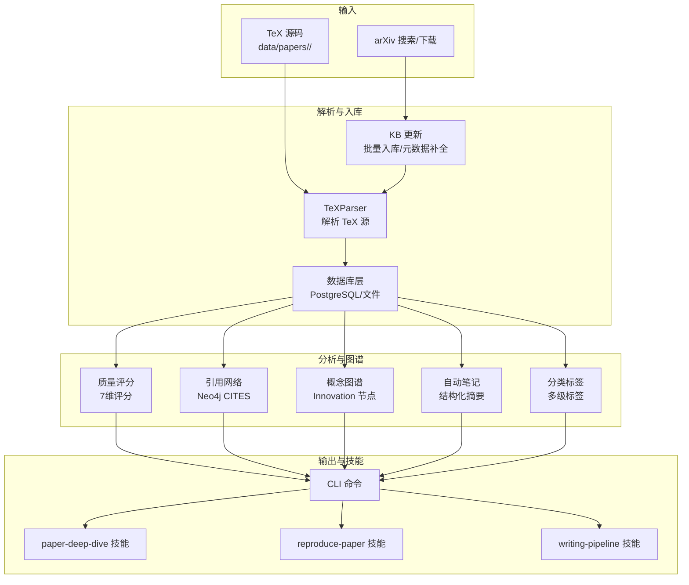
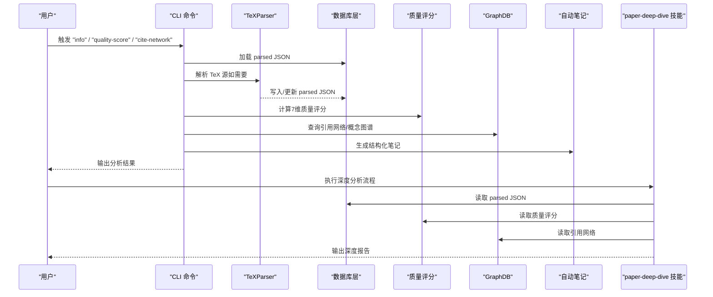
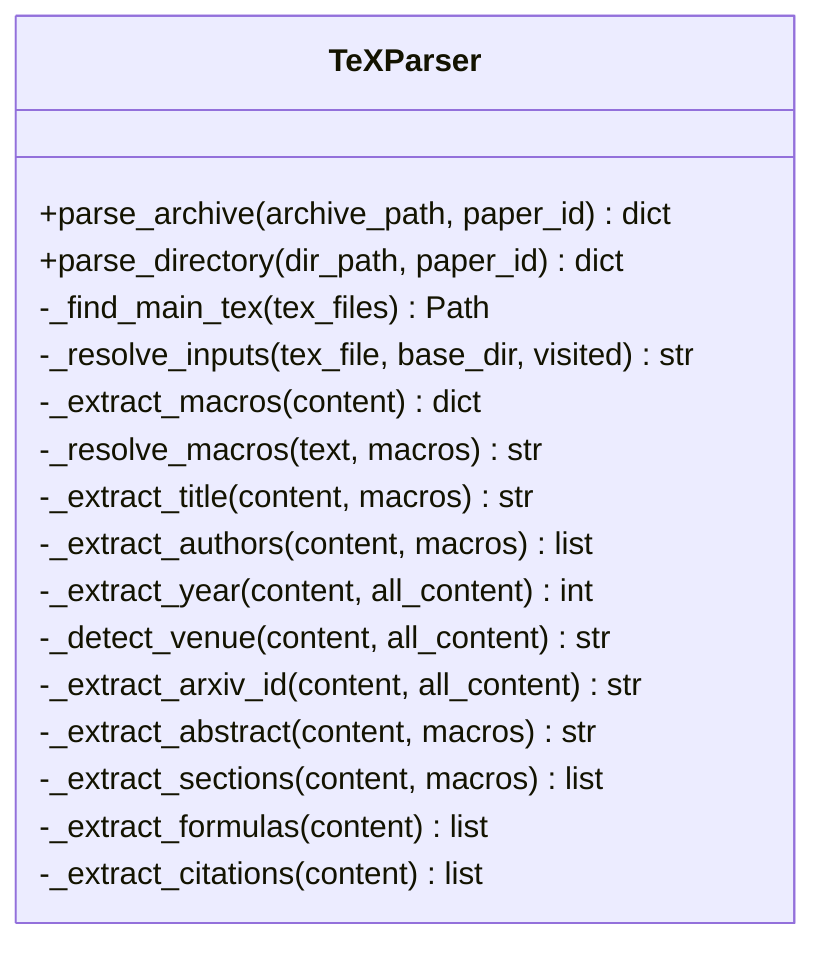
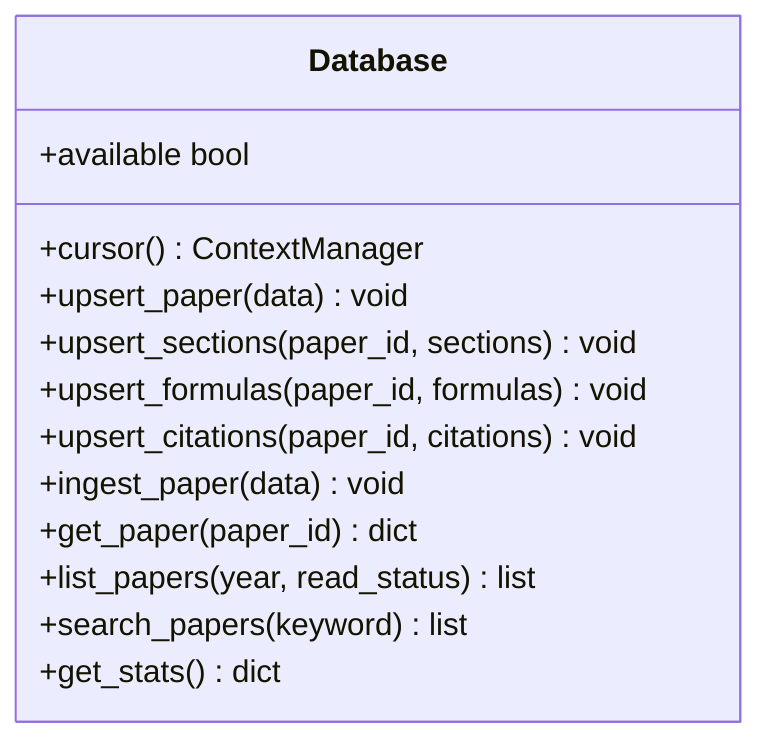
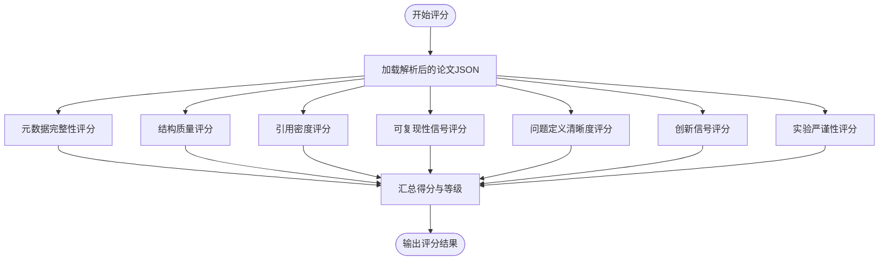
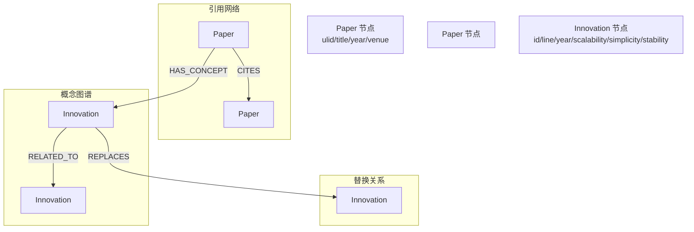
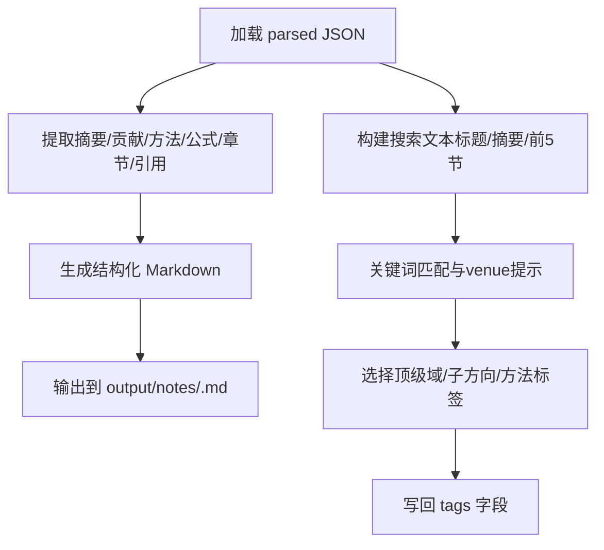
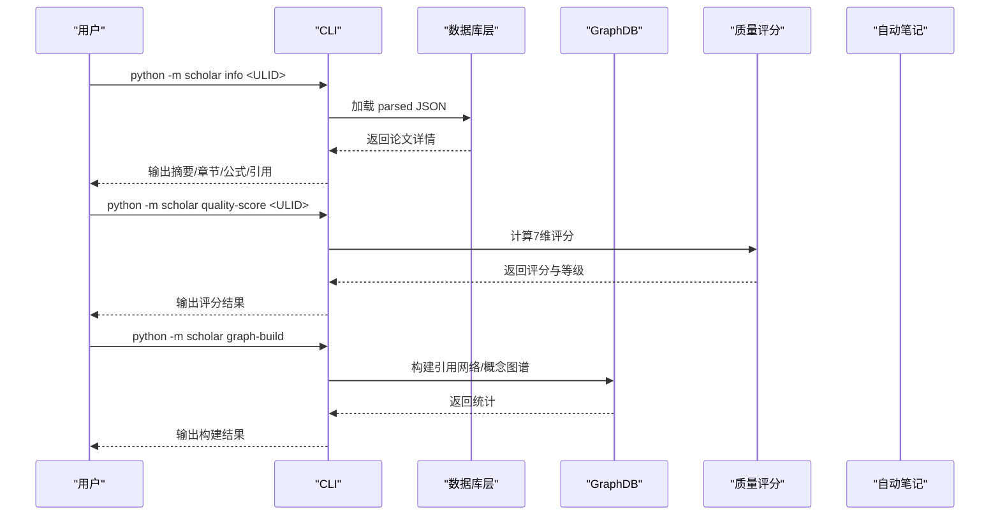
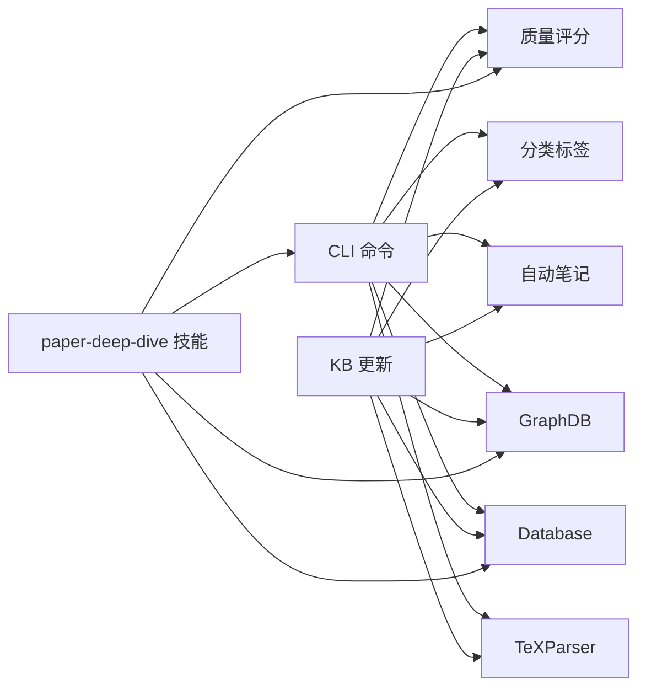

# 论文深度分析技能

<cite>
**本文档引用的文件**
- [SKILL.md](file://plugin/skills/paper-deep-dive/SKILL.md)
- [SKILL.md](file://plugin/skills/paper-ingestion/SKILL.md)
- [SKILL.md](file://plugin/skills/reproduce-paper/SKILL.md)
- [SKILL.md](file://plugin/skills/writing-pipeline/SKILL.md)
- [quality.py](file://scholar/quality.py)
- [tex_parser.py](file://scholar/tex_parser.py)
- [graph_db.py](file://scholar/graph_db.py)
- [db.py](file://scholar/db.py)
- [cli.py](file://scholar/cli.py)
- [config.py](file://scholar/config.py)
- [auto_notes.py](file://scholar/auto_notes.py)
- [classify.py](file://scholar/classify.py)
- [kb_update.py](file://scholar/kb_update.py)
</cite>

## 目录
1. [简介](#简介)
2. [项目结构](#项目结构)
3. [核心组件](#核心组件)
4. [架构总览](#架构总览)
5. [详细组件分析](#详细组件分析)
6. [依赖关系分析](#依赖关系分析)
7. [性能考虑](#性能考虑)
8. [故障排除指南](#故障排除指南)
9. [结论](#结论)
10. [附录](#附录)

## 简介
本文件面向“论文深度分析技能”模块，系统阐述如何对单篇学术论文进行多层次深度分析，涵盖语义理解、结构分析、质量评估、公式推导、引用网络分析、实验代码生成与复现、摘要生成、要点提取以及与知识图谱系统的数据共享机制。该能力由多个子模块协同实现：论文解析与入库、质量评分、引用网络与概念图谱、自动笔记与分类、以及与研究管线的衔接。

## 项目结构
该项目采用模块化设计，围绕“论文解析—知识库—分析—可视化/输出”的流水线组织：
- 入库与解析：TeX 源解析、元数据补全、批量入库
- 分析能力：质量评分、引用网络、概念图谱、自动笔记、分类标签
- 输出与集成：CLI 命令、Neo4j 图数据库、PostgreSQL 结构化存储
- 技能编排：与 paper-deep-dive、reproduce-paper、writing-pipeline 等技能联动

图表来源
- [tex_parser.py:23-298](file://scholar/tex_parser.py#L23-L298)
- [db.py:24-276](file://scholar/db.py#L24-L276)
- [kb_update.py:216-438](file://scholar/kb_update.py#L216-L438)
- [quality.py:317-356](file://scholar/quality.py#L317-L356)
- [graph_db.py:225-281](file://scholar/graph_db.py#L225-L281)
- [auto_notes.py:28-160](file://scholar/auto_notes.py#L28-L160)
- [classify.py:161-238](file://scholar/classify.py#L161-L238)
- [cli.py:663-705](file://scholar/cli.py#L663-L705)

章节来源
- [SKILL.md:1-84](file://plugin/skills/paper-deep-dive/SKILL.md#L1-L84)
- [SKILL.md:1-85](file://plugin/skills/paper-ingestion/SKILL.md#L1-L85)
- [SKILL.md:1-69](file://plugin/skills/reproduce-paper/SKILL.md#L1-L69)
- [SKILL.md:1-135](file://plugin/skills/writing-pipeline/SKILL.md#L1-L135)

## 核心组件
- 论文解析器（TeXParser）：从 TeX 源码中提取标题、作者、年份、摘要、章节、公式、引用等结构化数据，并处理宏、输入文件、数学环境等复杂情况。
- 数据库层（Database）：封装 PostgreSQL 存储，提供论文、章节、公式、引用的增删改查接口；在不可用时回退到文件系统。
- 质量评分（Quality Scoring）：对论文的元数据、结构、引用密度、可复现性信号、问题定义清晰度、创新信号、实验严谨性进行7维评分。
- 引用网络与概念图谱（GraphDB）：在 Neo4j 中构建论文引用网络（CITES）、论文-概念（HAS_CONCEPT）边、概念共现（RELATED_TO）边，并同步 Lean4 的替换关系（REPLACES）。
- 自动笔记与分类（Auto Notes / Classify）：自动生成结构化阅读笔记，提取摘要、贡献、方法概述、关键公式、章节树、引用汇总；对论文进行多级标签分类。
- CLI 命令与技能编排：提供 scan、parse、info、stats、graph-build、graph-query 等命令，支撑 paper-deep-dive、reproduce-paper、writing-pipeline 等技能。

章节来源
- [tex_parser.py:23-298](file://scholar/tex_parser.py#L23-L298)
- [db.py:24-276](file://scholar/db.py#L24-L276)
- [quality.py:317-356](file://scholar/quality.py#L317-L356)
- [graph_db.py:225-281](file://scholar/graph_db.py#L225-L281)
- [auto_notes.py:28-160](file://scholar/auto_notes.py#L28-L160)
- [classify.py:161-238](file://scholar/classify.py#L161-L238)
- [cli.py:663-705](file://scholar/cli.py#L663-L705)

## 架构总览
论文深度分析技能的执行流程如下：
1. 输入阶段：用户触发 paper-deep-dive 技能，或通过 CLI 命令加载论文数据。
2. 数据准备：解析 TeX 源，生成 parsed JSON；若数据库可用，写入结构化存储。
3. 深度分析：按技能步骤执行“加载数据—深度阅读—质量评估—公式推导—引用网络分析—生成实验代码框架—质量门控—增量撰写深度报告”。
4. 图谱与知识共享：引用网络与概念图谱在 Neo4j 中维护，供其他技能查询与利用。
5. 输出与后续：生成深度报告、实验代码框架，衔接 reproduce-paper 与 writing-pipeline 技能。

图表来源
- [cli.py:242-306](file://scholar/cli.py#L242-L306)
- [cli.py:663-705](file://scholar/cli.py#L663-L705)
- [quality.py:317-356](file://scholar/quality.py#L317-L356)
- [graph_db.py:287-332](file://scholar/graph_db.py#L287-L332)
- [auto_notes.py:28-160](file://scholar/auto_notes.py#L28-L160)

## 详细组件分析

### 组件A：TeX 源解析器（TeXParser）
- 功能职责
  - 解析 TeX 主文件与子文件（\input/\include），递归合并内容
  - 提取标题、作者、年份、摘要、章节、公式、引用
  - 处理宏定义、格式命令、噪声命令、数学环境
  - 归一化 venue、arXiv ID、年份等元数据
- 关键特性
  - 支持多种会议/期刊样式与宏包
  - 多轮宏展开与去噪，提升文本质量
  - 生成结构化 JSON，包含 sections/formulas/citations 等字段
- 性能与健壮性
  - 使用正则表达式与递归解析，对大型 TeX 项目具备良好扩展性
  - 对缺失输入文件进行占位标记，避免中断

图表来源
- [tex_parser.py:23-298](file://scholar/tex_parser.py#L23-L298)

章节来源
- [tex_parser.py:219-298](file://scholar/tex_parser.py#L219-L298)

### 组件B：数据库层（Database）
- 功能职责
  - 提供论文、章节、公式、引用的增删改查接口
  - 支持 PostgreSQL（psycopg2）与文件系统两种后端
  - 提供事务管理与连接池策略
- 设计要点
  - 通过上下文管理器保证事务提交/回滚
  - 在数据库不可用时自动降级为文件模式
  - 与 CLI 命令配合，实现批量入库与查询

图表来源
- [db.py:24-276](file://scholar/db.py#L24-L276)

章节来源
- [db.py:79-176](file://scholar/db.py#L79-L176)
- [db.py:248-276](file://scholar/db.py#L248-L276)

### 组件C：质量评分（7维评分）
- 评分维度
  - 元数据完整性（标题、作者、年份、会议、摘要）
  - 结构质量（章节数量、关键章节、层级多样性）
  - 引用密度与多样性
  - 可复现性信号（代码链接、数据集、超参、实现细节、检查点）
  - 问题定义清晰度（问题陈述、挑战、动机、目标、任务定义）
  - 创新信号（新颖性声明、与先前工作比较、贡献声明、消融研究）
  - 实验严谨性（基准、指标、统计分析、基线、结果表格）
- 输出
  - 每维度得分与最大值、详细说明
  - 总分、满分、等级（A-F）

图表来源
- [quality.py:317-356](file://scholar/quality.py#L317-L356)

章节来源
- [quality.py:28-300](file://scholar/quality.py#L28-L300)
- [quality.py:317-356](file://scholar/quality.py#L317-L356)

### 组件D：引用网络与概念图谱（Neo4j）
- 引用网络（CITES）
  - 从 parsed JSON 构建 Paper 节点与 CITES 边
  - 解析 ref_key 为 ULID，修正引用边
  - 计算中心性指标（入度、出度、桥接分数）
- 概念图谱（HAS_CONCEPT/RELATED_TO）
  - 基于已知创新词典（CONCEPT_ALIASES）匹配论文与概念
  - 构建概念共现边（权重≥2）
  - 同步 Lean4 的 REPLACES 关系
- 查询能力
  - 前向引用、后向引用、最短路径、桥接论文、概念时间线、子图

图表来源
- [graph_db.py:225-281](file://scholar/graph_db.py#L225-L281)
- [graph_db.py:371-440](file://scholar/graph_db.py#L371-L440)
- [graph_db.py:636-732](file://scholar/graph_db.py#L636-L732)

章节来源
- [graph_db.py:85-177](file://scholar/graph_db.py#L85-L177)
- [graph_db.py:225-281](file://scholar/graph_db.py#L225-L281)
- [graph_db.py:371-440](file://scholar/graph_db.py#L371-L440)
- [graph_db.py:636-732](file://scholar/graph_db.py#L636-L732)

### 组件E：自动笔记与分类
- 自动笔记（Auto Notes）
  - 生成结构化 Markdown 笔记：摘要、核心贡献、方法概述、关键公式、章节树、引用汇总
  - 支持批量生成与单篇生成
- 分类标签（Classify）
  - 多级标签体系：领域（NLP/CV/RL/ML/Safety/Multimodal/Systems）、子方向、具体方法
  - 基于关键词匹配与会议 venue 提示进行打分与选择
  - 输出 flat tags 列表并写回 parsed JSON

图表来源
- [auto_notes.py:28-160](file://scholar/auto_notes.py#L28-L160)
- [classify.py:161-238](file://scholar/classify.py#L161-L238)

章节来源
- [auto_notes.py:28-160](file://scholar/auto_notes.py#L28-L160)
- [auto_notes.py:282-327](file://scholar/auto_notes.py#L282-L327)
- [classify.py:161-238](file://scholar/classify.py#L161-L238)
- [classify.py:245-293](file://scholar/classify.py#L245-L293)

### 组件F：CLI 命令与技能编排
- 常用命令
  - scan：扫描论文库，显示解析状态
  - parse/parse-all：解析单篇或多篇 TeX 源
  - info：查看论文详情（标题、作者、摘要、章节、公式、引用）
  - stats：知识库统计（论文数量、字段覆盖率）
  - graph-build/graph-stats：构建与统计图谱
  - graph-query：查询概念图谱
- 与技能协作
  - paper-deep-dive：按步骤执行深度分析
  - reproduce-paper：生成实验代码框架并复现实验
  - writing-pipeline：基于分析结果撰写论文

图表来源
- [cli.py:242-306](file://scholar/cli.py#L242-L306)
- [cli.py:663-705](file://scholar/cli.py#L663-L705)
- [quality.py:405-431](file://scholar/quality.py#L405-L431)
- [graph_db.py:225-281](file://scholar/graph_db.py#L225-L281)

章节来源
- [cli.py:46-127](file://scholar/cli.py#L46-L127)
- [cli.py:242-306](file://scholar/cli.py#L242-L306)
- [cli.py:663-705](file://scholar/cli.py#L663-L705)

## 依赖关系分析
- 外部依赖
  - Neo4j：用于构建与查询引用网络与概念图谱
  - PostgreSQL（psycopg2）：用于结构化存储与查询
  - Python 生态：正则表达式、json、pathlib、typing、rich、typer 等
- 内部耦合
  - CLI 命令依赖解析器、数据库层、质量评分、图谱模块
  - paper-deep-dive 技能依赖 CLI 命令与上述模块
  - KB 更新模块串联 arXiv 下载、解析、入库、图谱更新、RAG 索引、自动笔记与质量评分

图表来源
- [cli.py:663-705](file://scholar/cli.py#L663-L705)
- [kb_update.py:216-438](file://scholar/kb_update.py#L216-L438)
- [tex_parser.py:23-298](file://scholar/tex_parser.py#L23-L298)
- [db.py:24-276](file://scholar/db.py#L24-L276)
- [quality.py:317-356](file://scholar/quality.py#L317-L356)
- [graph_db.py:225-281](file://scholar/graph_db.py#L225-L281)
- [auto_notes.py:28-160](file://scholar/auto_notes.py#L28-L160)
- [classify.py:161-238](file://scholar/classify.py#L161-L238)

章节来源
- [config.py:44-66](file://scholar/config.py#L44-L66)
- [cli.py:663-705](file://scholar/cli.py#L663-L705)
- [kb_update.py:216-438](file://scholar/kb_update.py#L216-L438)

## 性能考虑
- 解析性能
  - 正则表达式与递归解析在大型 TeX 项目中可能成为瓶颈，建议：
    - 对重复解析结果进行缓存（文件系统层面）
    - 并行化批量解析（注意 IO 与内存占用）
- 数据库性能
  - 批量插入使用 UNWIND 与分批处理，减少事务开销
  - 建议在高并发场景启用连接池与索引优化
- 图谱性能
  - 大规模图谱查询建议使用索引与限制查询范围
  - 中心性计算与最短路径查询可分批执行
- I/O 与磁盘
  - parsed JSON、notes、experiments 等输出目录需充足空间
  - 建议定期清理中间文件与日志

## 故障排除指南
- 解析失败
  - 缺少 TeX 源（仅有 PDF）：无法解析，需人工处理或转换
  - 特殊宏/格式：检查宏定义与输入文件解析逻辑
  - 多轮宏展开失败：检查宏嵌套与定义顺序
- 数据库不可用
  - 自动降级为文件模式，确保 parsed 目录存在
  - 检查连接参数（主机、端口、用户名、密码）
- Neo4j 不可用
  - 启动容器或安装驱动，检查 URI、认证信息
  - 图谱构建失败时，先检查 parsed JSON 是否完整
- 质量评分异常
  - 检查 parsed JSON 字段是否齐全（sections、formulas、citations）
  - 确认评分维度函数输入类型（字符串/列表）的兼容性
- 自动笔记/分类异常
  - 检查 parsed JSON 的 sections/formulas/citations 字段
  - 关键词匹配失败时，适当扩展关键词集合

章节来源
- [tex_parser.py:304-374](file://scholar/tex_parser.py#L304-L374)
- [db.py:31-44](file://scholar/db.py#L31-L44)
- [graph_db.py:24-49](file://scholar/graph_db.py#L24-L49)
- [quality.py:317-356](file://scholar/quality.py#L317-L356)
- [auto_notes.py:28-160](file://scholar/auto_notes.py#L28-L160)
- [classify.py:161-238](file://scholar/classify.py#L161-L238)

## 结论
论文深度分析技能通过“解析—入库—分析—图谱—输出—技能编排”的完整流水线，实现了对单篇论文的多层次深度分析。其核心在于高质量的 TeX 解析、稳健的结构化存储、可解释的质量评分、可查询的引用与概念图谱，以及与 reproduce-paper、writing-pipeline 等技能的无缝衔接。该能力为学术研究提供了从“细读—评估—复现—写作”的闭环支撑，有助于提升研究效率与质量。

## 附录
- 配置与环境变量
  - 数据目录：PAPERS_DIR、PARSED_DIR、NOTES_DIR、EXPERIMENTS_DIR 等
  - 数据库：PG_HOST、PG_PORT、PG_NAME、PG_USER、PG_PASS
  - Neo4j：NEO4J_URI、NEO4J_USER、NEO4J_PASS
  - RAG 嵌入：EMBEDDING_PROVIDER、EMBEDDING_MODEL、EMBEDDING_DIM、EMBEDDING_API_KEY
  - LaTeX 编译：LATEX_CMD
  - Lean4：LEAN_PROJECT_DIR

章节来源
- [config.py:23-66](file://scholar/config.py#L23-L66)