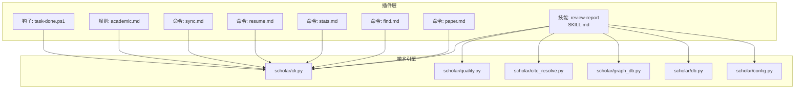
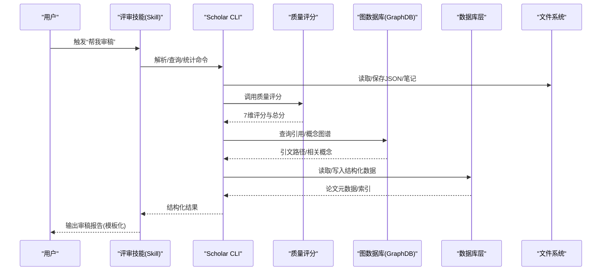
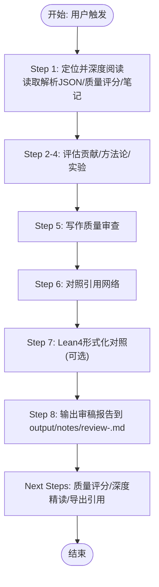
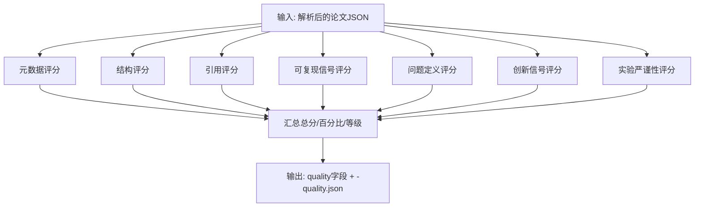
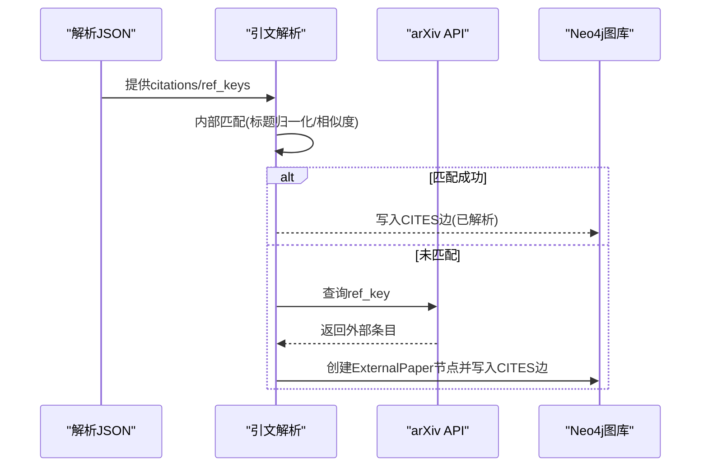
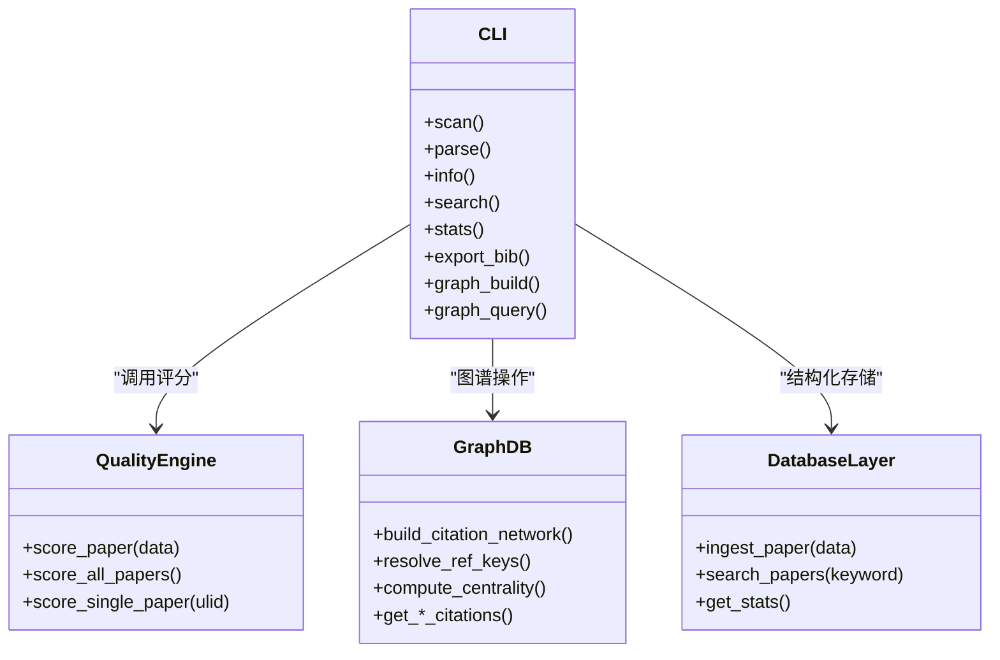
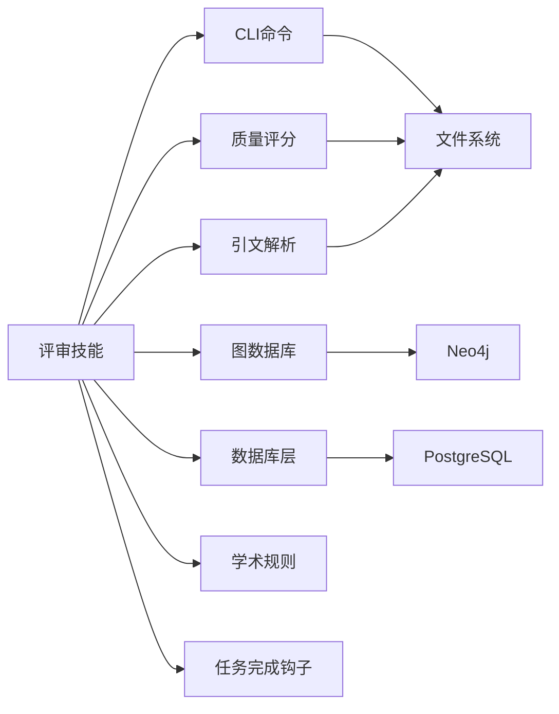

# 评审报告技能

<cite>
**本文档引用的文件**
- [plugin\skills\review-report\SKILL.md](file://plugin/skills/review-report/SKILL.md)
- [plugin\commands\paper.md](file://plugin/commands/paper.md)
- [plugin\commands\stats.md](file://plugin/commands/stats.md)
- [plugin\commands\find.md](file://plugin/commands/find.md)
- [plugin\commands\resume.md](file://plugin/commands/resume.md)
- [plugin\commands\sync.md](file://plugin/commands/sync.md)
- [plugin\rules\academic.md](file://plugin/rules/academic.md)
- [plugin\hooks\task-done.ps1](file://plugin/hooks/task-done.ps1)
- [scholar\__main__.py](file://scholar/__main__.py)
- [scholar\cli.py](file://scholar/cli.py)
- [scholar\quality.py](file://scholar/quality.py)
- [scholar\cite_resolve.py](file://scholar/cite_resolve.py)
- [scholar\graph_db.py](file://scholar/graph_db.py)
- [scholar\db.py](file://scholar/db.py)
- [scholar\config.py](file://scholar/config.py)
</cite>

## 目录
1. [引言](#引言)
2. [项目结构](#项目结构)
3. [核心组件](#核心组件)
4. [架构总览](#架构总览)
5. [详细组件分析](#详细组件分析)
6. [依赖分析](#依赖分析)
7. [性能考虑](#性能考虑)
8. [故障排除指南](#故障排除指南)
9. [结论](#结论)
10. [附录](#附录)

## 引言
本文件面向“评审报告技能”模块，系统化阐述学术论文评审的自动化支持与报告生成流程。文档覆盖评审标准制定、评分机制、意见生成算法、模板系统、质量控制与多维度评估、评审过程跟踪管理、同行评议与结果汇总、以及与作者沟通和编辑流程的集成方式。目标是帮助技术与非技术读者全面理解该技能如何通过工具链实现结构化、可重复、可追溯的审稿实践。

## 项目结构
评审报告技能位于插件体系的技能目录下，围绕“审稿”这一核心流程，协同命令、规则、钩子与底层工具（解析、质量评分、图数据库、数据库层、配置）共同构成完整的评审流水线。

**图表来源**
- [plugin\skills\review-report\SKILL.md:1-116](file://plugin/skills/review-report/SKILL.md#L1-L116)
- [plugin\commands\paper.md:1-11](file://plugin/commands/paper.md#L1-L11)
- [plugin\commands\find.md:1-10](file://plugin/commands/find.md#L1-L10)
- [plugin\commands\stats.md:1-10](file://plugin/commands/stats.md#L1-L10)
- [plugin\commands\resume.md:1-22](file://plugin/commands/resume.md#L1-L22)
- [plugin\commands\sync.md:1-11](file://plugin/commands/sync.md#L1-L11)
- [plugin\rules\academic.md:1-39](file://plugin/rules/academic.md#L1-L39)
- [plugin\hooks\task-done.ps1:1-33](file://plugin/hooks/task-done.ps1#L1-L33)
- [scholar\cli.py:1-800](file://scholar/cli.py#L1-L800)
- [scholar\quality.py:1-432](file://scholar/quality.py#L1-L432)
- [scholar\cite_resolve.py:1-314](file://scholar/cite_resolve.py#L1-L314)
- [scholar\graph_db.py:1-922](file://scholar/graph_db.py#L1-L922)
- [scholar\db.py:1-276](file://scholar/db.py#L1-L276)
- [scholar\config.py:1-119](file://scholar/config.py#L1-L119)

**章节来源**
- [plugin\skills\review-report\SKILL.md:1-116](file://plugin/skills/review-report/SKILL.md#L1-L116)
- [plugin\commands\paper.md:1-11](file://plugin/commands/paper.md#L1-L11)
- [plugin\commands\find.md:1-10](file://plugin/commands/find.md#L1-L10)
- [plugin\commands\stats.md:1-10](file://plugin/commands/stats.md#L1-L10)
- [plugin\commands\resume.md:1-22](file://plugin/commands/resume.md#L1-L22)
- [plugin\commands\sync.md:1-11](file://plugin/commands/sync.md#L1-L11)
- [plugin\rules\academic.md:1-39](file://plugin/rules/academic.md#L1-L39)
- [plugin\hooks\task-done.ps1:1-33](file://plugin/hooks/task-done.ps1#L1-L33)
- [scholar\cli.py:1-800](file://scholar/cli.py#L1-L800)
- [scholar\quality.py:1-432](file://scholar/quality.py#L1-L432)
- [scholar\cite_resolve.py:1-314](file://scholar/cite_resolve.py#L1-L314)
- [scholar\graph_db.py:1-922](file://scholar/graph_db.py#L1-L922)
- [scholar\db.py:1-276](file://scholar/db.py#L1-L276)
- [scholar\config.py:1-119](file://scholar/config.py#L1-L119)

## 核心组件
- 技能定义与触发：评审技能通过特定触发词启动，进入“定位—深度阅读—评估—对照—输出”的标准化流程，并提供后续动作建议。
- 质量评分引擎：对论文进行七维自动评分，输出结构化质量报告，供审稿人参考与校正。
- 引文解析与图谱：构建引用网络与概念图谱，辅助审稿人进行背景与前沿分析。
- 数据与规则：统一的数据目录约定、输出规范、迭代写作协议与质量门控，确保可重复与可审计。
- 通知与集成：Windows 通知钩子与 CLI 命令，打通审稿流程与外部工具链。

**章节来源**
- [plugin\skills\review-report\SKILL.md:6-116](file://plugin/skills/review-report/SKILL.md#L6-L116)
- [scholar\quality.py:1-432](file://scholar/quality.py#L1-L432)
- [scholar\cite_resolve.py:1-314](file://scholar/cite_resolve.py#L1-L314)
- [scholar\graph_db.py:1-922](file://scholar/graph_db.py#L1-L922)
- [plugin\rules\academic.md:1-39](file://plugin/rules/academic.md#L1-L39)
- [plugin\hooks\task-done.ps1:1-33](file://plugin/hooks/task-done.ps1#L1-L33)

## 架构总览
评审报告技能以“CLI 命令 + 质量评分 + 引文与图谱 + 规则与钩子”为核心，形成“数据驱动 + 自动化 + 可追溯”的审稿闭环。

**图表来源**
- [plugin\skills\review-report\SKILL.md:9-116](file://plugin/skills/review-report/SKILL.md#L9-L116)
- [scholar\cli.py:1-800](file://scholar/cli.py#L1-L800)
- [scholar\quality.py:317-356](file://scholar/quality.py#L317-L356)
- [scholar\graph_db.py:225-364](file://scholar/graph_db.py#L225-L364)
- [scholar\db.py:170-241](file://scholar/db.py#L170-L241)
- [scholar\config.py:23-42](file://scholar/config.py#L23-L42)

## 详细组件分析

### 评审流程与模板系统
- 触发与步骤：技能定义了从“定位与深度阅读”到“输出审稿报告”的八步流程，明确输入数据（解析 JSON、质量评分、阅读笔记、引用网络）与输出位置（审稿报告文件）。
- 模板字段：报告包含摘要、优势、劣势、作者问题、小问题、总体评估（五项评分）、推荐意见与保密备注等结构化字段，便于统一格式与交叉比对。
- 后续动作：提供质量评分记录、深度精读、引用导出等下一步建议，形成闭环。

**图表来源**
- [plugin\skills\review-report\SKILL.md:9-116](file://plugin/skills/review-report/SKILL.md#L9-L116)

**章节来源**
- [plugin\skills\review-report\SKILL.md:6-116](file://plugin/skills/review-report/SKILL.md#L6-L116)

### 质量评分机制与多维度评估
- 七维评分维度：元数据完整性、结构质量、引用密度、可复现信号、问题定义清晰度、创新信号、实验严谨性。
- 评分策略：每维给出0-10分与明细；总分为各维之和，按百分比映射等级（A-F）。
- 批处理能力：支持批量评分并写回解析 JSON 与独立质量 JSON，便于审稿前后对比与追踪。

**图表来源**
- [scholar\quality.py:28-356](file://scholar/quality.py#L28-L356)

**章节来源**
- [scholar\quality.py:1-432](file://scholar/quality.py#L1-L432)

### 引文解析与引用网络
- 引文解析：将 ref_key 映射到内部已知论文（标题归一化 + 编辑距离 + 词重叠），对未解析条目通过 arXiv API 创建外部节点并建立引用边。
- 图谱构建：在 Neo4j 中构建“论文-引用-论文”网络，计算入度/出度/桥接分数等中心性指标，支持最短路径与前后向引用查询。
- 应用场景：审稿时快速识别“本文引用了哪些工作、是否遗漏重要前置工作”，并进行跨文献关联分析。

**图表来源**
- [scholar\cite_resolve.py:65-313](file://scholar/cite_resolve.py#L65-L313)
- [scholar\graph_db.py:225-280](file://scholar/graph_db.py#L225-L280)

**章节来源**
- [scholar\cite_resolve.py:1-314](file://scholar/cite_resolve.py#L1-L314)
- [scholar\graph_db.py:1-922](file://scholar/graph_db.py#L1-L922)

### 学术写作规则与质量门控
- 数据优先：引用必须来自解析数据，公式必须来自解析 JSON 的公式字段，避免臆造。
- 迭代协议：先检查既有草稿/大纲/审阅文件，遵循“写出-核对-审阅-修订-终稿”的边界限制，最多两轮修订。
- 输出约定：所有生成物统一写入 output/ 目录，Drafts/Notes/Bib/Parsed 等子目录职责清晰。
- 写作风格：正式学术语言，每主张必须有具体论文或数据支撑，倾向表格化比较。

**章节来源**
- [plugin\rules\academic.md:1-39](file://plugin/rules/academic.md#L1-L39)

### CLI 命令与数据流
- 命令入口：Scholar CLI 提供扫描、解析、查询、统计、导出、图谱构建等命令，支撑审稿全流程。
- 数据目录：统一的输出目录约定（parsed/notes/drafts/bib 等），配合数据库层实现文件模式与数据库模式双通道。
- 搜索与检索：全文搜索与语义搜索结合，支持断点恢复与同步流程。

**图表来源**
- [scholar\cli.py:1-800](file://scholar/cli.py#L1-L800)
- [scholar\quality.py:317-431](file://scholar/quality.py#L317-L431)
- [scholar\graph_db.py:225-364](file://scholar/graph_db.py#L225-L364)
- [scholar\db.py:170-241](file://scholar/db.py#L170-L241)

**章节来源**
- [scholar\cli.py:1-800](file://scholar/cli.py#L1-L800)
- [scholar\db.py:1-276](file://scholar/db.py#L1-L276)
- [scholar\config.py:23-42](file://scholar/config.py#L23-L42)

### 评审过程跟踪与通知集成
- 断点恢复：根据 output/drafts/notes 中的 outline/review/部分草稿，自动判断当前阶段并从断点继续。
- 任务完成通知：Windows 通知钩子在 Agent 响应完成后弹出提示，避免打断审稿节奏。
- 后续动作：审稿完成后可直接触发质量评分、深度精读、引用导出等命令，形成闭环。

**章节来源**
- [plugin\commands\resume.md:1-22](file://plugin/commands/resume.md#L1-L22)
- [plugin\hooks\task-done.ps1:1-33](file://plugin/hooks/task-done.ps1#L1-L33)
- [plugin\skills\review-report\SKILL.md:107-116](file://plugin/skills/review-report/SKILL.md#L107-L116)

## 依赖分析
- 外部依赖：Neo4j（图谱）、PostgreSQL（结构化存储）、arXiv API（外部引用解析）、Lean4（形式化对照种子数据）。
- 内部耦合：评审技能依赖 CLI、质量评分、引文解析、图数据库与数据库层；规则与钩子贯穿流程，保证一致性与可观测性。
- 数据流：解析 JSON → 质量评分 → 引文解析 → 图谱查询 → 报告模板渲染 → 文件输出。

**图表来源**
- [plugin\skills\review-report\SKILL.md:9-116](file://plugin/skills/review-report/SKILL.md#L9-L116)
- [scholar\cli.py:1-800](file://scholar/cli.py#L1-L800)
- [scholar\quality.py:1-432](file://scholar/quality.py#L1-L432)
- [scholar\cite_resolve.py:1-314](file://scholar/cite_resolve.py#L1-L314)
- [scholar\graph_db.py:1-922](file://scholar/graph_db.py#L1-L922)
- [scholar\db.py:1-276](file://scholar/db.py#L1-L276)
- [plugin\rules\academic.md:1-39](file://plugin/rules/academic.md#L1-L39)
- [plugin\hooks\task-done.ps1:1-33](file://plugin/hooks/task-done.ps1#L1-L33)

**章节来源**
- [plugin\skills\review-report\SKILL.md:1-116](file://plugin/skills/review-report/SKILL.md#L1-L116)
- [scholar\cli.py:1-800](file://scholar/cli.py#L1-L800)
- [scholar\quality.py:1-432](file://scholar/quality.py#L1-L432)
- [scholar\cite_resolve.py:1-314](file://scholar/cite_resolve.py#L1-L314)
- [scholar\graph_db.py:1-922](file://scholar/graph_db.py#L1-L922)
- [scholar\db.py:1-276](file://scholar/db.py#L1-L276)
- [plugin\rules\academic.md:1-39](file://plugin/rules/academic.md#L1-L39)
- [plugin\hooks\task-done.ps1:1-33](file://plugin/hooks/task-done.ps1#L1-L33)

## 性能考虑
- 批处理与增量：质量评分与解析采用批处理与增量模式，避免重复计算；图谱构建分步执行并支持限流。
- 搜索与查询：全文搜索与图谱查询结合，必要时限制返回数量与层级，减少延迟。
- I/O 优化：统一输出目录与缓存中间产物（质量 JSON、笔记、图谱统计），降低重复读写成本。
- 可观测性：进度条、统计面板与通知钩子提升交互效率，减少无效等待。

## 故障排除指南
- arXiv API 失败：检查代理与超时设置，确认重试次数与退避策略；必要时切换检索策略或降采样。
- Neo4j 不可用：确认连接参数与服务状态；在无图谱环境可降级使用文件模式。
- PostgreSQL 不可用：确认连接参数；若不可用，系统自动回落至文件模式，仍可运行大部分命令。
- 引文解析未命中：检查 ref_key 清洗与标题归一化逻辑；适当提高相似度阈值或扩大查询上限。
- 通知不弹出：检查 PowerShell 权限与系统托盘设置；确保停止钩子未被禁用。

**章节来源**
- [scholar\config.py:72-118](file://scholar/config.py#L72-L118)
- [scholar\graph_db.py:40-69](file://scholar/graph_db.py#L40-L69)
- [scholar\db.py:32-44](file://scholar/db.py#L32-L44)
- [plugin\hooks\task-done.ps1:1-33](file://plugin/hooks/task-done.ps1#L1-L33)

## 结论
评审报告技能通过“结构化流程 + 数据驱动 + 自动化工具 + 质量规则 + 可视化反馈”的组合，实现了从论文定位、深度阅读、多维度评估到报告输出与后续动作的全链路闭环。其七维质量评分与引文/概念图谱为审稿提供了客观依据与扩展视角，规则与钩子保障了可重复性与可观测性。建议在实际使用中结合团队审稿标准微调评分权重与模板字段，并持续沉淀审稿经验到知识库与图谱中。

## 附录
- 常用命令速查
  - 查看论文详情与质量：参见命令文档
  - 全文/语义搜索：参见命令文档
  - 知识库统计：参见命令文档
  - 断点恢复：参见命令文档
  - 研究方向同步：参见命令文档
- 输出约定
  - 审稿报告输出至 output/notes/review-<paper_id>.md
  - 质量评分输出至 output/notes/<ULID>-quality.json
  - 引用导出至 output/bib/references.bib

**章节来源**
- [plugin\commands\paper.md:1-11](file://plugin/commands/paper.md#L1-L11)
- [plugin\commands\find.md:1-10](file://plugin/commands/find.md#L1-L10)
- [plugin\commands\stats.md:1-10](file://plugin/commands/stats.md#L1-L10)
- [plugin\commands\resume.md:1-22](file://plugin/commands/resume.md#L1-L22)
- [plugin\commands\sync.md:1-11](file://plugin/commands/sync.md#L1-L11)
- [scholar\cli.py:492-523](file://scholar/cli.py#L492-L523)