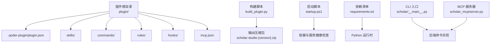
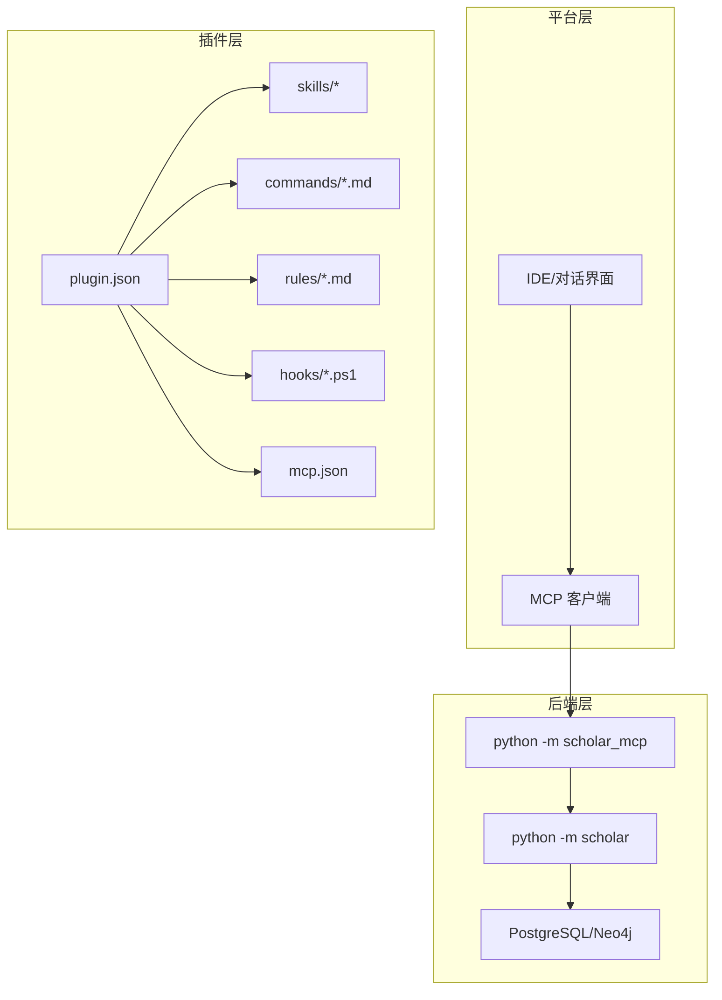
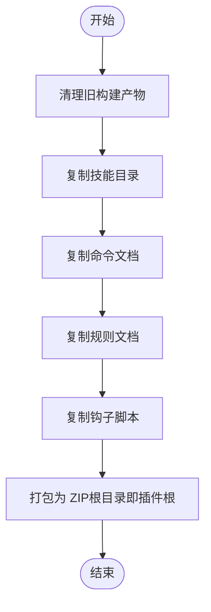
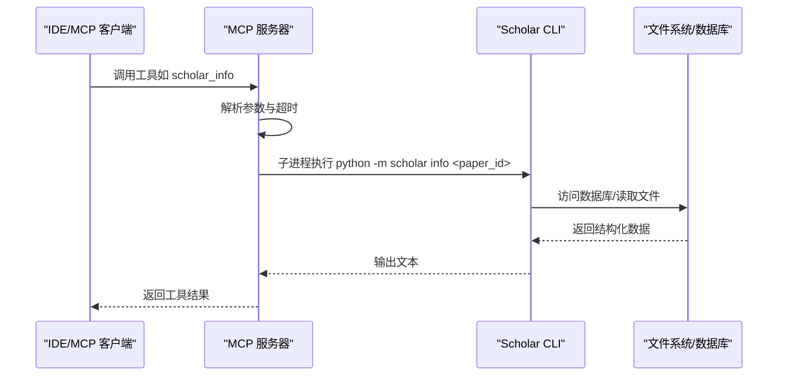
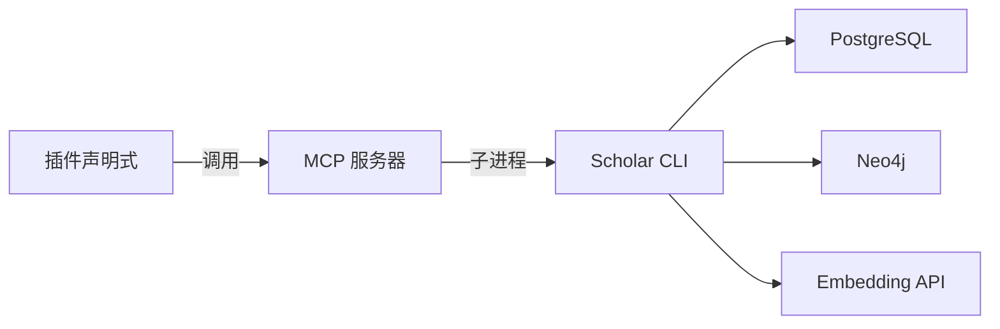

# 插件架构设计

<cite>
**本文档引用的文件**
- [plugin/README.md](file://plugin/README.md)
- [plugin/.qoder-plugin/plugin.json](file://plugin/.qoder-plugin/plugin.json)
- [plugin/mcp.json](file://plugin/mcp.json)
- [plugin/CONNECTORS.md](file://plugin/CONNECTORS.md)
- [build_plugin.py](file://build_plugin.py)
- [startup.ps1](file://startup.ps1)
- [requirements.txt](file://requirements.txt)
- [scholar/__main__.py](file://scholar/__main__.py)
- [scholar_mcp/server.py](file://scholar_mcp/server.py)
- [plugin/skills/paper-deep-dive/SKILL.md](file://plugin/skills/paper-deep-dive/SKILL.md)
- [plugin/commands/stats.md](file://plugin/commands/stats.md)
- [plugin/rules/academic.md](file://plugin/rules/academic.md)
- [plugin/hooks/log-conversation.ps1](file://plugin/hooks/log-conversation.ps1)
- [LEAN/AiEvolution/Theorems.lean](file://LEAN/AiEvolution/Theorems.lean)
</cite>

## 目录
1. [简介](#简介)
2. [项目结构](#项目结构)
3. [核心组件](#核心组件)
4. [架构总览](#架构总览)
5. [详细组件分析](#详细组件分析)
6. [依赖分析](#依赖分析)
7. [性能考虑](#性能考虑)
8. [故障排查指南](#故障排查指南)
9. [结论](#结论)
10. [附录](#附录)

## 简介
本插件架构围绕“大脑-身体”分离的设计理念构建：插件作为“大脑”，负责定义技能（Skills）、命令（Commands）、规则（Rules）、钩子（Hooks）以及 MCP 服务器配置；真正的执行逻辑由主仓库的 Python 后端与数据库共同承担。插件通过标准的打包与分发流程，将可执行的工具链与工作流暴露给上层平台，形成可扩展、可维护的研究辅助系统。

## 项目结构
插件工程采用“插件目录 + 构建脚本”的组织方式，核心目录与文件如下：
- 插件元数据与内容
  - 元数据：plugin/.qoder-plugin/plugin.json
  - 内容：plugin/skills、plugin/commands、plugin/rules、plugin/hooks、plugin/mcp.json
- 构建与打包
  - 构建脚本：build_plugin.py
  - 输出：scholar-studio-{version}.zip
- 运行与依赖
  - 启动脚本：startup.ps1
  - 依赖清单：requirements.txt
  - CLI 入口：scholar/__main__.py
  - MCP 服务器：scholar_mcp/server.py
- 文档与示例
  - 插件说明：plugin/README.md
  - 连接器依赖：plugin/CONNECTORS.md
  - 示例技能/命令/规则/钩子：各对应文件

图表来源
- [plugin/.qoder-plugin/plugin.json:1-23](file://plugin/.qoder-plugin/plugin.json#L1-L23)
- [build_plugin.py:95-129](file://build_plugin.py#L95-L129)
- [startup.ps1:58-91](file://startup.ps1#L58-L91)
- [requirements.txt:1-14](file://requirements.txt#L1-L14)
- [scholar/__main__.py:1-8](file://scholar/__main__.py#L1-L8)
- [scholar_mcp/server.py:1-21](file://scholar_mcp/server.py#L1-L21)

章节来源
- [plugin/README.md:1-79](file://plugin/README.md#L1-L79)
- [plugin/.qoder-plugin/plugin.json:1-23](file://plugin/.qoder-plugin/plugin.json#L1-L23)
- [build_plugin.py:132-180](file://build_plugin.py#L132-L180)
- [startup.ps1:1-125](file://startup.ps1#L1-L125)
- [requirements.txt:1-14](file://requirements.txt#L1-L14)
- [scholar/__main__.py:1-8](file://scholar/__main__.py#L1-L8)
- [scholar_mcp/server.py:1-21](file://scholar_mcp/server.py#L1-L21)

## 核心组件
- 插件元数据与内容布局
  - 元数据文件 plugin/.qoder-plugin/plugin.json 定义插件名称、版本、显示名、关键词、入口路径（skills/commands/rules/hooks/mcpServers）等。
  - 内容目录 plugin/skills、plugin/commands、plugin/rules、plugin/hooks、plugin/mcp.json 提供可被平台识别与使用的扩展点。
- 构建与打包
  - build_plugin.py 将 .qoder 下的技能、命令、规则、钩子复制到 plugin 目录，并打包为标准 ZIP，供平台安装。
- 运行时依赖与连接器
  - startup.ps1 负责 Docker 服务健康检查与状态提示；CONNECTORS.md 明确 PostgreSQL、Neo4j、Embedding API 等外部依赖。
- 后端集成
  - scholar/__main__.py 作为 CLI 入口；scholar_mcp/server.py 将后端命令映射为 MCP 工具，供 IDE 集成调用。

章节来源
- [plugin/.qoder-plugin/plugin.json:1-23](file://plugin/.qoder-plugin/plugin.json#L1-L23)
- [build_plugin.py:132-180](file://build_plugin.py#L132-L180)
- [plugin/CONNECTORS.md:1-45](file://plugin/CONNECTORS.md#L1-L45)
- [startup.ps1:58-91](file://startup.ps1#L58-L91)
- [scholar/__main__.py:1-8](file://scholar/__main__.py#L1-L8)
- [scholar_mcp/server.py:1-21](file://scholar_mcp/server.py#L1-L21)

## 架构总览
插件架构采用“声明式扩展 + 执行层解耦”的模式：
- 声明层：插件通过 plugin.json 指定扩展点，提供技能、命令、规则、钩子与 MCP 服务器配置。
- 执行层：后端 Python 包提供完整的 CLI 与 MCP 服务器，负责数据库访问、文件系统操作、外部 API 调用等。
- 集成层：MCP 服务器将 CLI 命令包装为工具，IDE 通过 MCP 与后端交互；同时支持直接调用 CLI。

图表来源
- [plugin/.qoder-plugin/plugin.json:17-21](file://plugin/.qoder-plugin/plugin.json#L17-L21)
- [plugin/mcp.json:1-16](file://plugin/mcp.json#L1-L16)
- [scholar_mcp/server.py:1-21](file://scholar_mcp/server.py#L1-L21)
- [scholar/__main__.py:1-8](file://scholar/__main__.py#L1-L8)

## 详细组件分析

### 插件元数据与扩展点
- 元数据文件 plugin/.qoder-plugin/plugin.json
  - 定义插件标识、版本、关键词、入口路径（skills/commands/rules/hooks/mcpServers）。
  - 作用：平台据此加载扩展点，决定安装与渲染行为。
- 扩展点布局
  - skills：技能工作流与原子能力的说明文档。
  - commands：命令的触发与执行步骤说明。
  - rules：领域规则与写作规范。
  - hooks：事件钩子脚本（如对话日志采集）。
  - mcpServers：MCP 服务器配置，指向后端进程。

章节来源
- [plugin/.qoder-plugin/plugin.json:1-23](file://plugin/.qoder-plugin/plugin.json#L1-L23)

### 构建与打包流程
- 构建脚本 build_plugin.py
  - 清理旧产物、复制技能/命令/规则/钩子、打包为 ZIP。
  - 输出文件名包含插件名与版本，根目录即插件根，满足平台要求。
- 打包产物
  - scholar-studio-{version}.zip，包含插件全部内容，供平台安装。

图表来源
- [build_plugin.py:26-129](file://build_plugin.py#L26-L129)

章节来源
- [build_plugin.py:132-180](file://build_plugin.py#L132-L180)

### MCP 服务器与工具映射
- MCP 服务器
  - scholar_mcp/server.py 使用 FastMCP 创建 MCP 服务器，将后端 CLI 命令映射为工具。
  - 工具覆盖论文库、图谱与网络、RAG、元数据补全、批处理预处理、编排、文件访问、知识库更新、研究循环、执行层等。
- 工具调用序列
  - IDE/MCP 客户端发起工具请求 → MCP 服务器执行对应函数 → 子进程调用 CLI → 返回结果。

图表来源
- [scholar_mcp/server.py:23-36](file://scholar_mcp/server.py#L23-L36)
- [scholar_mcp/server.py:625-631](file://scholar_mcp/server.py#L625-L631)

章节来源
- [plugin/mcp.json:1-16](file://plugin/mcp.json#L1-L16)
- [scholar_mcp/server.py:1-631](file://scholar_mcp/server.py#L1-L631)

### 技能（Skills）与工作流
- 示例：paper-deep-dive
  - 触发条件：用户表达“精读/深度分析/分析这篇论文/彻底搞懂”等意图。
  - 流程：加载论文数据 → 深度阅读 → 质量评估 → 公式推导 → 引用网络分析 → 生成实验代码框架 → 质量门控 → 增量撰写深度报告。
  - Next Steps：可衔接写作流水线、复现实验、全面调研等后续技能。

章节来源
- [plugin/skills/paper-deep-dive/SKILL.md:1-84](file://plugin/skills/paper-deep-dive/SKILL.md#L1-L84)

### 命令（Commands）
- 示例：stats
  - 快速查看知识库状态（论文数量、图谱规模、RAG 覆盖率）。
  - 执行步骤：调用 scholar stats、graph-stats，汇总覆盖率与数量。

章节来源
- [plugin/commands/stats.md:1-10](file://plugin/commands/stats.md#L1-L10)

### 规则（Rules）
- 示例：academic.md
  - 核心规则：数据驱动、引用准确、公式精确、学术写作、增量操作、Lean4 集成、输出约定。
  - 迭代写作协议：检查既有产物 → 引用后写作 → 质量门禁 → 限定修订轮次 → 恢复意识。
  - 写作风格：正式学术语言、可验证主张、结构化比较、参考文献列表。

章节来源
- [plugin/rules/academic.md:1-39](file://plugin/rules/academic.md#L1-L39)

### 钩子（Hooks）
- 示例：log-conversation.ps1
  - 事件类型：Stop（停止时）。
  - 行为：解析上下文、定位对话历史、提取最后一条用户消息、清洗与截断、按周写入日志文件。
  - 容错：空输入、解析失败、未找到会话、重试机制、降级回退。

章节来源
- [plugin/hooks/log-conversation.ps1:1-190](file://plugin/hooks/log-conversation.ps1#L1-L190)

### 连接器与运行时依赖
- 外部服务
  - PostgreSQL：论文元数据、章节、公式、引用关系存储。
  - Neo4j：引用网络分析、概念图谱查询。
  - 智谱 Embedding API：RAG 语义检索。
- 运行时检查
  - startup.ps1 检查 Docker、Python、.env、依赖，启动容器并等待健康状态，输出知识库统计与下一步命令。

章节来源
- [plugin/CONNECTORS.md:1-45](file://plugin/CONNECTORS.md#L1-L45)
- [startup.ps1:1-125](file://startup.ps1#L1-L125)

### 形式化验证与理论支撑
- Lean4 形式化验证
  - LEAN/AiEvolution/Theorems.lean 展示了创新范式替换的七条定理，强调可扩展性、简洁性、稳定性等维度的严格证明。
  - 与插件规则中的 Lean4 集成相呼应，确保公式与推理的严谨性。

章节来源
- [LEAN/AiEvolution/Theorems.lean:1-130](file://LEAN/AiEvolution/Theorems.lean#L1-L130)

## 依赖分析
- 外部依赖
  - PostgreSQL/Neo4j：数据与图谱存储。
  - Embedding API：RAG 向量索引与检索。
  - Docker Compose：基础设施编排。
- Python 依赖
  - typer、rich、psycopg2-binary、neo4j、python-dotenv、PyMuPDF、mcp 等。
- 插件与后端耦合
  - 插件仅声明扩展点；MCP 服务器通过子进程调用 CLI，降低直接耦合风险。
  - 版本与打包：通过构建脚本固定版本号，ZIP 包含完整内容，便于分发与回滚。

图表来源
- [requirements.txt:1-14](file://requirements.txt#L1-L14)
- [scholar_mcp/server.py:23-36](file://scholar_mcp/server.py#L23-L36)
- [plugin/CONNECTORS.md:1-45](file://plugin/CONNECTORS.md#L1-L45)

章节来源
- [requirements.txt:1-14](file://requirements.txt#L1-L14)
- [plugin/CONNECTORS.md:1-45](file://plugin/CONNECTORS.md#L1-L45)
- [scholar_mcp/server.py:23-36](file://scholar_mcp/server.py#L23-L36)

## 性能考虑
- I/O 与并发
  - 批处理与超时控制：部分工具设置较长超时（如批量解析、RAG 索引），避免单次操作阻塞。
  - 文件系统访问：读取本地 JSON/Markdown 输出，减少网络往返。
- 数据库与图谱
  - 图谱构建与查询需 Neo4j；在不需要图谱功能时可跳过，降低资源占用。
- 网络与外部 API
  - RAG 检索依赖 Embedding API，建议合理配置并发与缓存策略，避免频繁请求。
- 构建与分发
  - 构建脚本排除缓存与版本控制目录，减小打包体积；ZIP 采用压缩格式，平衡传输与解压成本。

## 故障排查指南
- Docker 与服务健康
  - 启动脚本会检查 Docker、Python、依赖与容器健康状态；若超时，检查容器日志与端口映射。
- MCP 服务器
  - 确认 mcp.json 中命令与环境变量正确；检查后端 CLI 是否可用。
- 日志与钩子
  - 对话日志钩子会按周写入 output/logs；若未产生日志，检查 stdin 输入、会话 ID、缓存路径与权限。
- 知识库状态
  - 使用 stats 命令核对论文数量与图谱节点数；必要时执行 bootstrap 初始化。

章节来源
- [startup.ps1:58-91](file://startup.ps1#L58-L91)
- [plugin/mcp.json:1-16](file://plugin/mcp.json#L1-L16)
- [plugin/hooks/log-conversation.ps1:1-190](file://plugin/hooks/log-conversation.ps1#L1-L190)
- [plugin/commands/stats.md:1-10](file://plugin/commands/stats.md#L1-L10)

## 结论
该插件架构通过“声明式扩展 + 执行层解耦”的设计，实现了技能、命令、规则、钩子与 MCP 服务器的统一管理。构建脚本标准化打包流程，MCP 服务器桥接 IDE 与后端 CLI，连接器文档明确了运行时依赖。结合形式化验证与严格的规则体系，系统在可扩展性、可维护性与推理严谨性方面具备良好基础。建议在生产环境中强化版本管理与灰度发布策略，持续完善监控与日志体系。

## 附录
- 安装与验证
  - 安装后端（主仓库）→ 启动数据库与图谱服务 → 初始化知识库 → 安装插件 → 在 IDE 中验证命令与技能触发。
- 开发最佳实践
  - 将业务逻辑下沉至后端 CLI，插件仅负责声明与编排；为每个工具设定合理超时与错误处理；保持规则与钩子的最小可用集。
- 安全考虑
  - 限制钩子脚本权限，避免写入敏感路径；对外部 API 密钥进行环境变量注入与轮换；对 MCP 工具输入进行校验与白名单过滤。
- 版本管理与分发
  - 使用构建脚本固定版本号，生成带版本的 ZIP 包；在 CI 中自动化构建与测试；建立回滚与灰度发布流程。