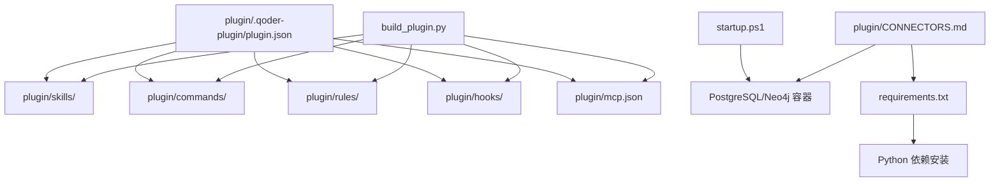
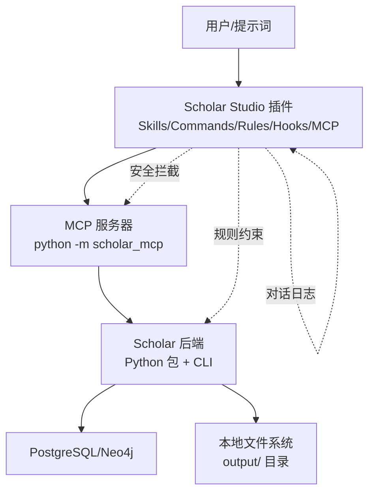
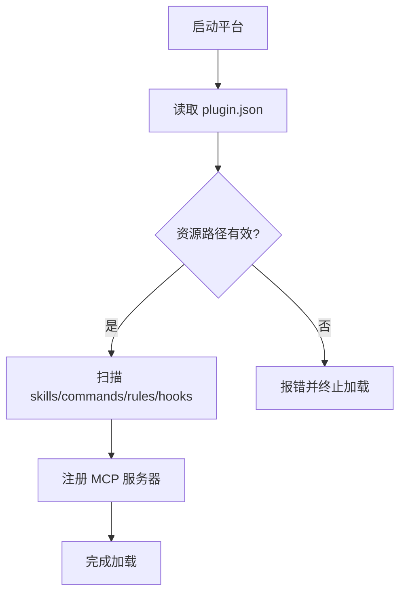
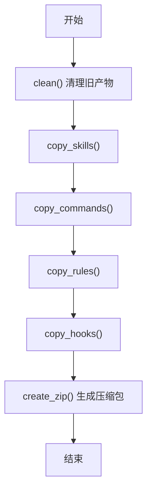
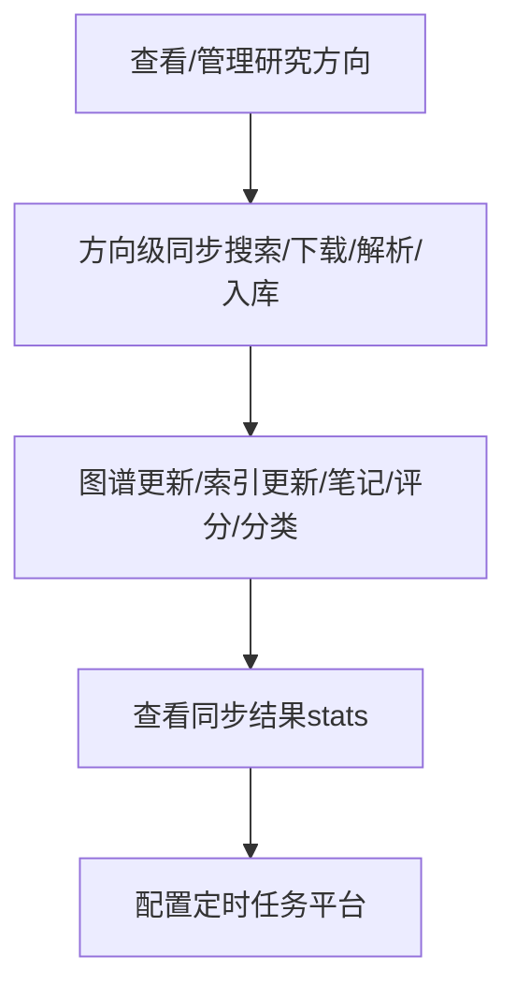
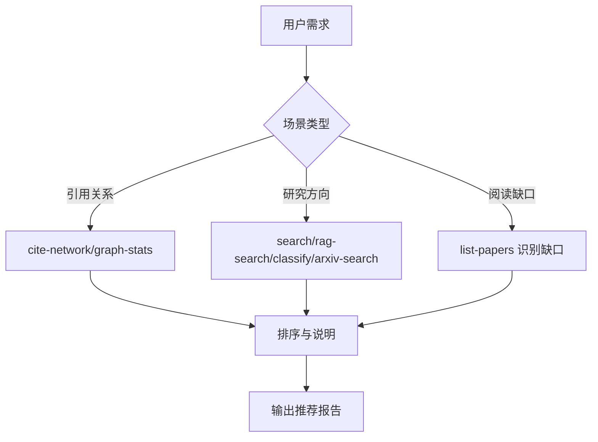
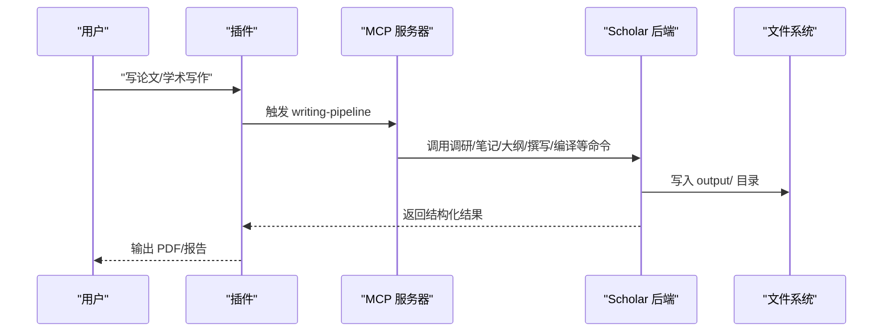
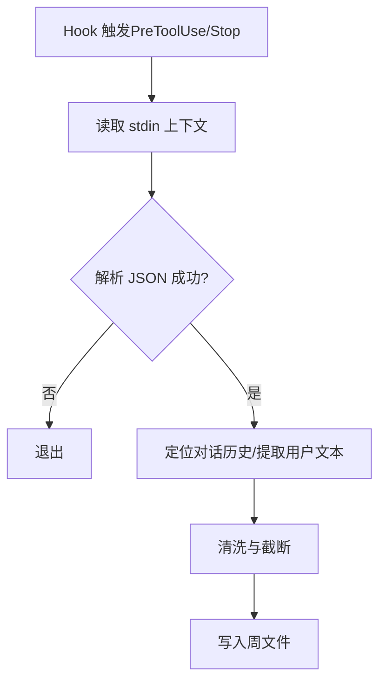
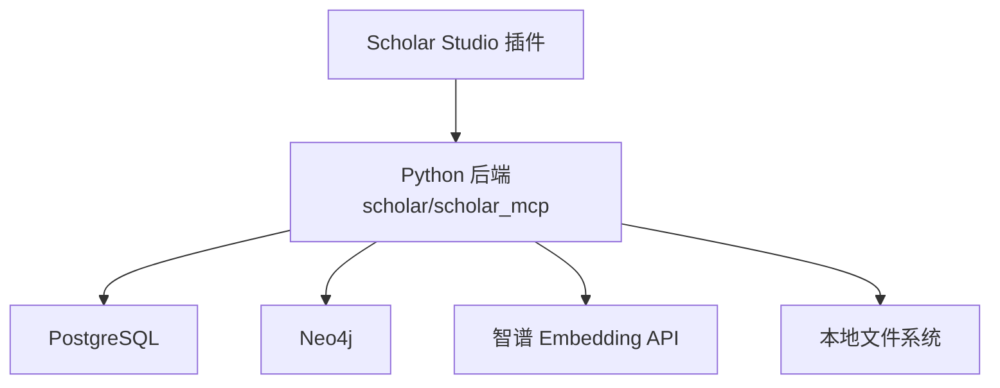

# 插件系统

<cite>
**本文档引用的文件**
- [plugin/README.md](file://plugin/README.md)
- [plugin/.qoder-plugin/plugin.json](file://plugin/.qoder-plugin/plugin.json)
- [plugin/mcp.json](file://plugin/mcp.json)
- [build_plugin.py](file://build_plugin.py)
- [startup.ps1](file://startup.ps1)
- [plugin/skills/adaptive-research/SKILL.md](file://plugin/skills/adaptive-research/SKILL.md)
- [plugin/skills/paper-recommendation/SKILL.md](file://plugin/skills/paper-recommendation/SKILL.md)
- [plugin/skills/writing-pipeline/SKILL.md](file://plugin/skills/writing-pipeline/SKILL.md)
- [plugin/commands/stats.md](file://plugin/commands/stats.md)
- [plugin/commands/find.md](file://plugin/commands/find.md)
- [plugin/rules/academic.md](file://plugin/rules/academic.md)
- [plugin/hooks/log-conversation.ps1](file://plugin/hooks/log-conversation.ps1)
- [plugin/hooks/block-dangerous.ps1](file://plugin/hooks/block-dangerous.ps1)
- [plugin/CONNECTORS.md](file://plugin/CONNECTORS.md)
- [requirements.txt](file://requirements.txt)
</cite>

## 目录
1. [简介](#简介)
2. [项目结构](#项目结构)
3. [核心组件](#核心组件)
4. [架构总览](#架构总览)
5. [详细组件分析](#详细组件分析)
6. [依赖分析](#依赖分析)
7. [性能考虑](#性能考虑)
8. [故障排查指南](#故障排查指南)
9. [结论](#结论)
10. [附录](#附录)

## 简介
本插件系统为“大脑”，负责定义 14 个学术研究相关的 Skills、4 个 Commands、1 个规则集、2 个 Hook 以及 1 个 MCP 服务器配置，实际执行由主仓库的 Python 后端与数据库共同完成。插件通过统一打包脚本构建并发布，配合启动脚本与依赖清单，形成完整的安装、运行与维护闭环。

## 项目结构
插件工程采用“声明式配置 + 资源目录”的组织方式：
- 配置入口：插件元信息与资源映射
- 资源目录：Skills、Commands、Rules、Hooks、MCP 配置
- 构建脚本：自动化复制与打包
- 运行支撑：启动脚本、依赖清单、连接器说明

图表来源
- [plugin/.qoder-plugin/plugin.json:1-23](file://plugin/.qoder-plugin/plugin.json#L1-L23)
- [plugin/mcp.json:1-16](file://plugin/mcp.json#L1-L16)
- [build_plugin.py:132-180](file://build_plugin.py#L132-L180)
- [startup.ps1:1-125](file://startup.ps1#L1-L125)
- [plugin/CONNECTORS.md:1-45](file://plugin/CONNECTORS.md#L1-L45)
- [requirements.txt:1-14](file://requirements.txt#L1-L14)

章节来源
- [plugin/README.md:1-79](file://plugin/README.md#L1-L79)
- [plugin/.qoder-plugin/plugin.json:1-23](file://plugin/.qoder-plugin/plugin.json#L1-L23)
- [plugin/mcp.json:1-16](file://plugin/mcp.json#L1-L16)
- [build_plugin.py:132-180](file://build_plugin.py#L132-L180)
- [startup.ps1:1-125](file://startup.ps1#L1-L125)
- [plugin/CONNECTORS.md:1-45](file://plugin/CONNECTORS.md#L1-L45)
- [requirements.txt:1-14](file://requirements.txt#L1-L14)

## 核心组件
- 插件元信息与资源映射
  - 名称、版本、关键字、入口路径等在插件配置中集中声明，便于平台识别与加载。
- Skills（技能）
  - 原子技能与工作流两类，覆盖论文解析、数学验证、推荐、引用网络、研究空白、评审报告、冷启动、实验代码生成、端到端写作、复现、从点子到论文、知识库维护等。
- Commands（命令）
  - stats、find、paper、health 等命令，提供快速查询与状态查看。
- Rules（规则）
  - 学术研究原则与写作规范，约束输出与迭代过程。
- Hooks（钩子）
  - 对话日志采集与危险命令拦截，保障可观测性与安全性。
- MCP 服务器
  - 通过 mcp.json 指定 Python 后端入口及环境变量，实现工具调用与数据交互。

章节来源
- [plugin/README.md:50-79](file://plugin/README.md#L50-L79)
- [plugin/.qoder-plugin/plugin.json:17-21](file://plugin/.qoder-plugin/plugin.json#L17-L21)
- [plugin/rules/academic.md:11-39](file://plugin/rules/academic.md#L11-L39)
- [plugin/hooks/log-conversation.ps1:1-190](file://plugin/hooks/log-conversation.ps1#L1-L190)
- [plugin/hooks/block-dangerous.ps1:1-24](file://plugin/hooks/block-dangerous.ps1#L1-L24)
- [plugin/mcp.json:1-16](file://plugin/mcp.json#L1-L16)

## 架构总览
插件系统与主仓库后端通过 MCP 与命令行协同工作，形成“提示词触发 → 技能/命令解析 → 工具调用 → 数据持久化/图谱更新”的闭环。

图表来源
- [plugin/README.md:5-17](file://plugin/README.md#L5-L17)
- [plugin/mcp.json:1-16](file://plugin/mcp.json#L1-16)
- [plugin/CONNECTORS.md:35-45](file://plugin/CONNECTORS.md#L35-L45)

## 详细组件分析

### 插件元信息与加载机制
- 元信息字段
  - name、version、displayName、description、keywords、repository、license 等用于平台识别与展示。
- 资源映射
  - skills、commands、rules、hooks、mcpServers 指向相对路径，平台据此加载对应资源。
- 加载顺序
  - 平台先读取 plugin.json，再按映射路径扫描各目录，注册 Skills/Commands/Rules/Hooks，并注册 MCP 服务器。

图表来源
- [plugin/.qoder-plugin/plugin.json:1-23](file://plugin/.qoder-plugin/plugin.json#L1-L23)

章节来源
- [plugin/.qoder-plugin/plugin.json:1-23](file://plugin/.qoder-plugin/plugin.json#L1-L23)

### 构建与发布流程
- 清理旧产物
  - 删除目标目录，避免残留影响。
- 复制资源
  - Skills：仅复制包含 SKILL.md 的目录，保留原结构。
  - Commands：复制 .md 文件至 commands 目录。
  - Rules：复制 .md 文件至 rules 目录。
  - Hooks：复制脚本与 hooks.json 至 hooks 目录。
- 打包
  - 读取插件版本，生成 zip 包，根目录即插件内容，符合平台要求。
- 输出
  - 控制台打印构建摘要与最终结构概览。

图表来源
- [build_plugin.py:26-130](file://build_plugin.py#L26-L130)

章节来源
- [build_plugin.py:132-180](file://build_plugin.py#L132-L180)

### 生命周期管理
- 插件生命周期
  - 安装：平台加载 plugin.json 与资源。
  - 运行：Skills/Commands/Rules/Hooks/MCP 按需激活。
  - 维护：通过构建脚本更新资源，重新打包发布。
- 触发与执行
  - 用户输入触发 Skills/Commands；Rules 约束输出；Hooks 拦截危险命令并采集日志。

章节来源
- [plugin/README.md:19-49](file://plugin/README.md#L19-L49)
- [plugin/rules/academic.md:23-31](file://plugin/rules/academic.md#L23-L31)
- [plugin/hooks/block-dangerous.ps1:1-24](file://plugin/hooks/block-dangerous.ps1#L1-L24)

### 接口规范
- MCP 服务器接口
  - 通过 mcp.json 指定命令与环境变量，平台以进程形式调用后端。
- 命令接口
  - Commands 以 Markdown 文档形式声明描述与执行步骤，平台将其转化为可执行命令。
- 规则接口
  - Rules 以 Markdown + Front Matter 形式声明适用范围与约束，平台在生成内容时进行校验。

章节来源
- [plugin/mcp.json:1-16](file://plugin/mcp.json#L1-L16)
- [plugin/commands/stats.md:1-10](file://plugin/commands/stats.md#L1-L10)
- [plugin/commands/find.md:1-10](file://plugin/commands/find.md#L1-L10)
- [plugin/rules/academic.md:1-39](file://plugin/rules/academic.md#L1-L39)

### 工具与技能模块分类体系
- 原子技能（8 个）
  - 论文解析、数学验证、推荐、引用网络、研究空白、评审报告、冷启动、实验代码生成。
- 工作流（6 个）
  - 全面调研、单篇深度分析、端到端写作、实验复现、从点子到论文、知识库维护。
- 分类依据
  - 功能边界与复杂度：原子技能聚焦单一能力，工作流组合多个原子技能形成闭环。

章节来源
- [plugin/README.md:60-79](file://plugin/README.md#L60-L79)

### 自适应研究技能
- 核心流程
  - 研究方向管理：查看/新增/移除方向，记录关键词与类别。
  - 方向级同步：针对单个或全部方向，自动完成 arXiv 搜索、下载、解析、入库、图谱更新、RAG 索引、阅读笔记、质量评分、分类打标。
  - 结果验证：通过 stats 命令检查知识库状态。
  - 定时任务：在平台定时任务中配置每周同步，结合人工确认与标记分析完成状态。
- 数据流转
  - 从 arXiv 到解析入库，再到图谱与索引更新，最终沉淀到 output/ 目录。

图表来源
- [plugin/skills/adaptive-research/SKILL.md:10-68](file://plugin/skills/adaptive-research/SKILL.md#L10-L68)

章节来源
- [plugin/skills/adaptive-research/SKILL.md:1-68](file://plugin/skills/adaptive-research/SKILL.md#L1-L68)

### 论文推荐算法
- 推荐场景
  - 基于引用关系、基于研究方向、基于阅读缺口。
- 推荐流程
  - 理解需求 → 选择场景 → 执行相应命令 → 排序与说明 → 输出到 output/notes/recommendations-<topic>.md。
- 推荐依据
  - 引用网络中心性指标（入度、出度、桥接分数）、分类标签、时间窗口、阅读缺口识别。
- 输出约定
  - 必读/推荐/可选分级，附带推荐理由、关联关系、预计难度。

图表来源
- [plugin/skills/paper-recommendation/SKILL.md:9-96](file://plugin/skills/paper-recommendation/SKILL.md#L9-L96)

章节来源
- [plugin/skills/paper-recommendation/SKILL.md:1-96](file://plugin/skills/paper-recommendation/SKILL.md#L1-L96)

### 写作流水线
- 端到端流程
  - 主题调研 → 关键论文笔记 → 生成大纲 → 逐节撰写 → 质量门控 → 定向修订 → LaTeX 编译与错误修复 → 输出 PDF。
- 质量门控
  - 引用准确性、论证连贯性、篇幅均衡、Abstract 独立性。
- 编译修复
  - 按 FATAL/WARN/INFO 分类，优先修复致命错误，自动策略覆盖常见问题，最多 3 轮编译修复。
- 输出约定
  - 所有产物输出到 output/ 目录，遵循 LaTeX 与 BibTeX 规范。

图表来源
- [plugin/skills/writing-pipeline/SKILL.md:6-135](file://plugin/skills/writing-pipeline/SKILL.md#L6-L135)
- [plugin/mcp.json:1-16](file://plugin/mcp.json#L1-L16)

章节来源
- [plugin/skills/writing-pipeline/SKILL.md:1-135](file://plugin/skills/writing-pipeline/SKILL.md#L1-L135)

### 命令与规则
- Commands
  - stats：快速查看知识库状态（论文数量、图谱规模、RAG 覆盖率）。
  - find：在知识库中快速搜索论文（全文 + 语义）。
- Rules
  - 数据驱动、引用准确、公式精确、学术写作规范、增量操作、Lean4 集成、输出约定。
  - 迭代写作协议：检查既有产物、先引用后写作、质量门控强制、限定修订轮次、恢复感知。

章节来源
- [plugin/commands/stats.md:1-10](file://plugin/commands/stats.md#L1-L10)
- [plugin/commands/find.md:1-10](file://plugin/commands/find.md#L1-L10)
- [plugin/rules/academic.md:11-39](file://plugin/rules/academic.md#L11-L39)

### 钩子与安全
- 对话日志采集（Hook）
  - 从 stdin 读取上下文，解析 JSON，定位对话历史，提取用户最后一条消息，清洗后按周写入 output/logs/week-<YYYY-Www>.jsonl。
- 危险命令拦截（Hook）
  - 预工具使用阶段拦截危险 SQL 与 Docker/系统操作，阻断潜在破坏行为。

图表来源
- [plugin/hooks/log-conversation.ps1:19-183](file://plugin/hooks/log-conversation.ps1#L19-L183)
- [plugin/hooks/block-dangerous.ps1:5-21](file://plugin/hooks/block-dangerous.ps1#L5-L21)

章节来源
- [plugin/hooks/log-conversation.ps1:1-190](file://plugin/hooks/log-conversation.ps1#L1-L190)
- [plugin/hooks/block-dangerous.ps1:1-24](file://plugin/hooks/block-dangerous.ps1#L1-L24)

## 依赖分析
- 外部服务
  - PostgreSQL：论文元数据、章节、公式、引用关系存储。
  - Neo4j：引用网络分析、概念图谱查询。
  - 智谱 Embedding API：RAG 语义检索。
- Python 依赖
  - 核心：typer、rich、psycopg2-binary、neo4j、python-dotenv、PyMuPDF、mcp。
  - 可选：ULID、datasets（降级回退）。
- 运行时配置
  - 通过 startup.ps1 启动容器并检查健康状态；通过 .env 设置 API Key；通过 requirements.txt 安装依赖。

图表来源
- [plugin/CONNECTORS.md:5-45](file://plugin/CONNECTORS.md#L5-L45)
- [requirements.txt:1-14](file://requirements.txt#L1-L14)
- [startup.ps1:14-125](file://startup.ps1#L14-L125)

章节来源
- [plugin/CONNECTORS.md:1-45](file://plugin/CONNECTORS.md#L1-L45)
- [requirements.txt:1-14](file://requirements.txt#L1-L14)
- [startup.ps1:1-125](file://startup.ps1#L1-L125)

## 性能考虑
- I/O 与并发
  - 批量操作遵循“逐条处理、报告进度、失败不阻塞”原则，降低单次失败对整体的影响。
- 编译修复闭环
  - 限定最大修订轮次与编译轮次，避免无限循环与资源浪费。
- 资源占用
  - 合理设置容器端口与内存，避免与宿主冲突；在可选服务不可用时启用降级路径。

## 故障排查指南
- 启动失败
  - 检查 Docker 是否运行、Python 版本与依赖是否满足；查看 startup.ps1 的健康检查输出。
- MCP 无法连接
  - 确认 mcp.json 中命令与环境变量正确；检查后端进程是否正常；核对端口映射。
- 危险命令被拦截
  - 检查拦截规则与命令内容；必要时调整为安全等价操作。
- 推荐/写作异常
  - 核查知识库状态与覆盖率；确认输出目录权限；按规则要求检查引用与格式。

章节来源
- [startup.ps1:14-125](file://startup.ps1#L14-L125)
- [plugin/mcp.json:1-16](file://plugin/mcp.json#L1-16)
- [plugin/hooks/block-dangerous.ps1:11-21](file://plugin/hooks/block-dangerous.ps1#L11-L21)
- [plugin/rules/academic.md:15-39](file://plugin/rules/academic.md#L15-L39)

## 结论
该插件系统以清晰的资源映射与严格的规则约束为基础，结合 MCP 与命令行工具，实现了从研究方向管理、论文推荐到端到端写作的完整学术研究闭环。通过构建脚本与启动脚本，形成可重复、可维护的安装与运行流程；通过 Hooks 与规则，兼顾可观测性与安全性。建议在扩展新技能时遵循现有分类与接口规范，保持输出约定一致，持续优化性能与用户体验。

## 附录
- 开发指南
  - 新增 Skills：在 skills 目录下创建以技能名为目录的新目录，包含 SKILL.md 与所需资源。
  - 新增 Commands：在 commands 目录下新增 .md 文件，按模板编写描述与步骤。
  - 新增 Rules：在 rules 目录下新增 .md 文件，声明适用范围与约束。
  - 新增 Hooks：在 hooks 目录下新增脚本与 hooks.json（如需要），并在 plugin.json 中映射。
  - 更新 MCP：在 mcp.json 中调整命令与环境变量。
- 调试技巧
  - 使用 startup.ps1 验证服务健康；通过日志文件定位问题；在插件侧开启详细日志。
- 发布流程
  - 运行构建脚本生成 zip 包；在平台插件市场上传并测试；更新版本号与变更说明。
- 安全与合规
  - 严格遵守规则约束；对危险命令进行拦截；最小权限原则访问数据库与文件系统。
- 性能监控
  - 关注 I/O 与编译耗时；限制修订轮次；对大文件与批量操作进行分片处理。
- 用户体验优化
  - 明确输出路径与命名规范；提供结构化报告与可视化摘要；减少用户干预步骤。