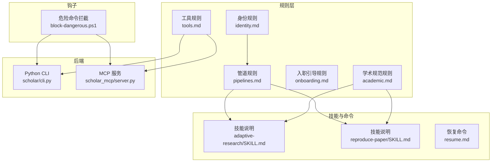
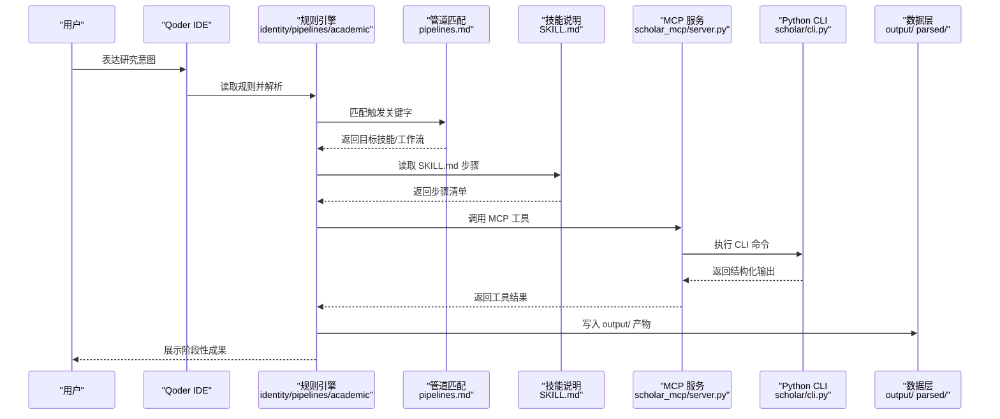
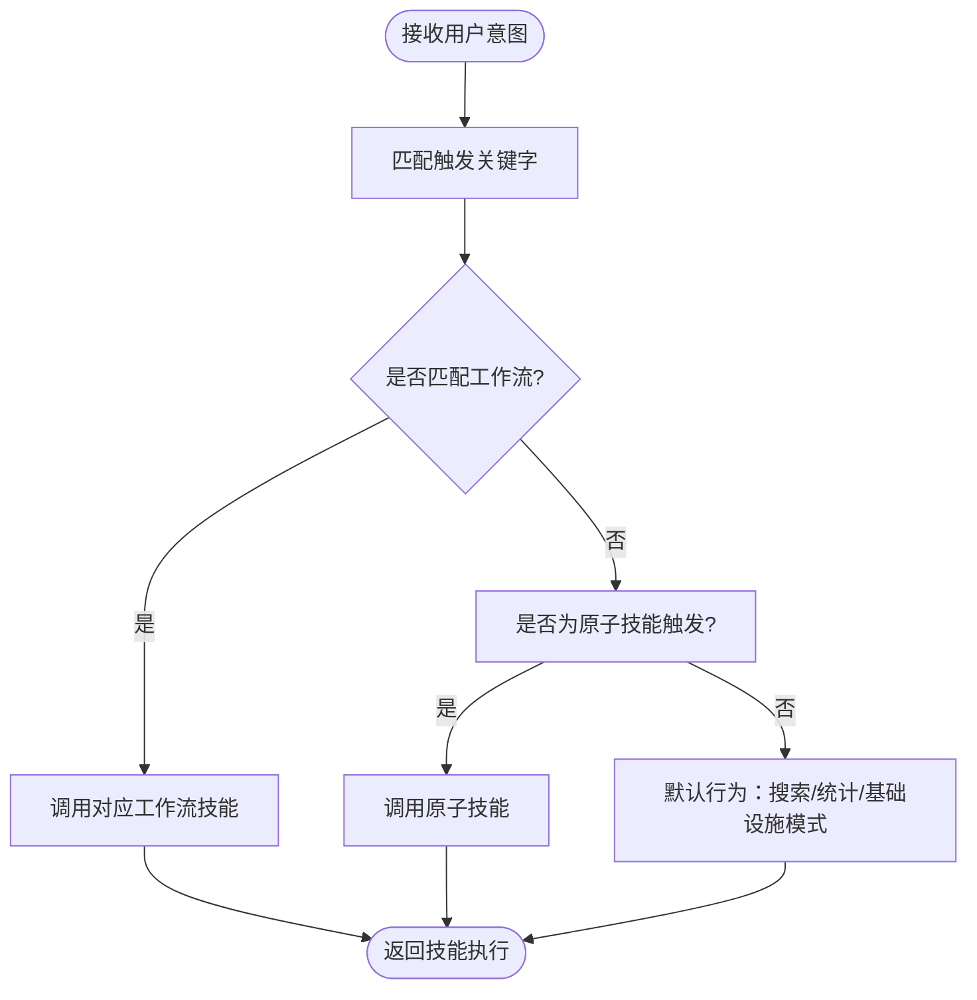
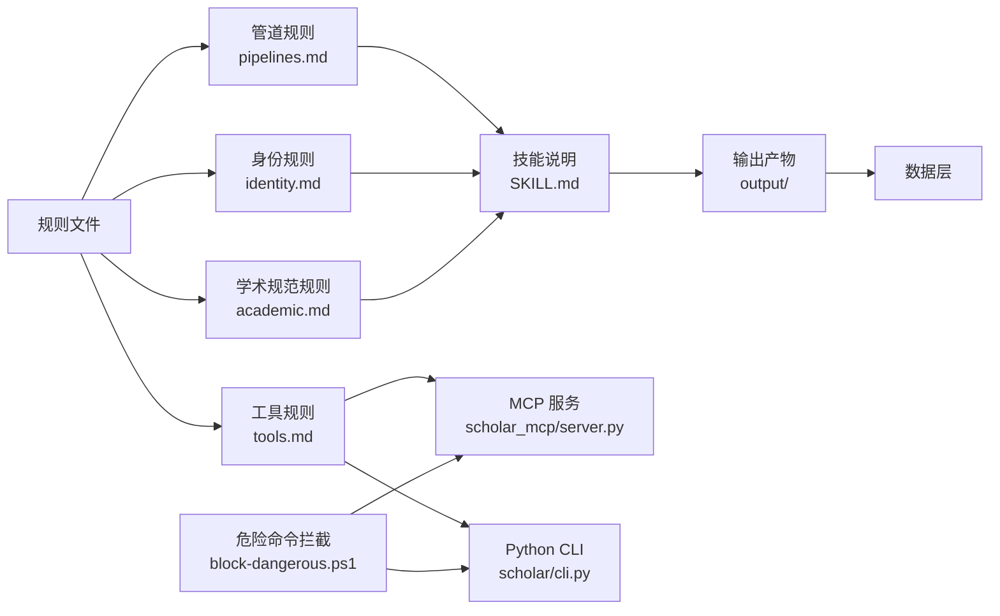

# 规则系统

<cite>
**本文档引用的文件**
- [plugin/rule/identity.md](file://plugin/rule/identity.md)
- [plugin/rule/academic.md](file://plugin/rule/academic.md)
- [plugin/rule/onboarding.md](file://plugin/rule/onboarding.md)
- [plugin/rule/pipelines.md](file://plugin/rule/pipelines.md)
- [plugin/rule/tools.md](file://plugin/rule/tools.md)
- [plugin/README.md](file://plugin/README.md)
- [plugin/hooks/block-dangerous.ps1](file://plugin/hooks/block-dangerous.ps1)
- [plugin/commands/resume.md](file://plugin/commands/resume.md)
- [plugin/skills/adaptive-research/SKILL.md](file://plugin/skills/adaptive-research/SKILL.md)
- [plugin/skills/reproduce-paper/SKILL.md](file://plugin/skills/reproduce-paper/SKILL.md)
- [scholar/cli.py](file://scholar/cli.py)
- [scholar_mcp/server.py](file://scholar_mcp/server.py)
- [test/test_e2e.py](file://test/test_e2e.py)
- [test/test_research_loop.py](file://test/test_research_loop.py)
</cite>

## 目录
1. [简介](#简介)
2. [项目结构](#项目结构)
3. [核心组件](#核心组件)
4. [架构总览](#架构总览)
5. [详细组件分析](#详细组件分析)
6. [依赖关系分析](#依赖关系分析)
7. [性能考虑](#性能考虑)
8. [故障排查指南](#故障排查指南)
9. [结论](#结论)
10. [附录](#附录)

## 简介
本规则系统面向学术研究工作流，围绕“身份规则”“学术规范规则”“入职引导规则”“管道规则”“工具规则”构建统一的执行与约束框架。系统以 Qoder IDE 为交互入口，结合 MCP 工具与 Python CLI 后端，形成“意图识别 → 技能路由 → 步骤化执行 → 数据驱动输出”的闭环。规则体系强调：
- 数据驱动：所有学术声明必须来自结构化 JSON 数据
- 引用准确：使用 paper_id 格式并在知识库中校验
- 公式精确：从解析 JSON 的 formulas 字段提取 LaTeX
- 增量操作：批量处理逐条进行，失败不阻塞整体
- 输出约定：所有产物统一落盘至 output/ 目录
- 可恢复性：支持断点续跑与迭代修订

## 项目结构
规则系统由“规则文件 + 技能说明 + 钩子 + 测试”组成，配合后端 CLI 与 MCP 服务器共同实现端到端执行。

**图表来源**
- [plugin/rule/identity.md:1-78](file://plugin/rule/identity.md#L1-L78)
- [plugin/rule/academic.md:1-39](file://plugin/rule/academic.md#L1-L39)
- [plugin/rule/onboarding.md:1-16](file://plugin/rule/onboarding.md#L1-L16)
- [plugin/rule/pipelines.md:1-42](file://plugin/rule/pipelines.md#L1-L42)
- [plugin/rule/tools.md:1-135](file://plugin/rule/tools.md#L1-L135)
- [plugin/skills/adaptive-research/SKILL.md:1-68](file://plugin/skills/adaptive-research/SKILL.md#L1-L68)
- [plugin/skills/reproduce-paper/SKILL.md:64-69](file://plugin/skills/reproduce-paper/SKILL.md#L64-L69)
- [plugin/commands/resume.md:1-22](file://plugin/commands/resume.md#L1-L22)
- [plugin/hooks/block-dangerous.ps1:1-23](file://plugin/hooks/block-dangerous.ps1#L1-L23)
- [scholar/cli.py:1-800](file://scholar/cli.py#L1-L800)
- [scholar_mcp/server.py:1-631](file://scholar_mcp/server.py#L1-L631)

**章节来源**
- [plugin/README.md:1-79](file://plugin/README.md#L1-L79)
- [plugin/rule/identity.md:1-78](file://plugin/rule/identity.md#L1-L78)
- [plugin/rule/academic.md:1-39](file://plugin/rule/academic.md#L1-L39)
- [plugin/rule/onboarding.md:1-16](file://plugin/rule/onboarding.md#L1-L16)
- [plugin/rule/pipelines.md:1-42](file://plugin/rule/pipelines.md#L1-L42)
- [plugin/rule/tools.md:1-135](file://plugin/rule/tools.md#L1-L135)
- [plugin/skills/adaptive-research/SKILL.md:1-68](file://plugin/skills/adaptive-research/SKILL.md#L1-L68)
- [plugin/skills/reproduce-paper/SKILL.md:64-69](file://plugin/skills/reproduce-paper/SKILL.md#L64-L69)
- [plugin/commands/resume.md:1-22](file://plugin/commands/resume.md#L1-L22)
- [plugin/hooks/block-dangerous.ps1:1-23](file://plugin/hooks/block-dangerous.ps1#L1-L23)
- [scholar/cli.py:1-800](file://scholar/cli.py#L1-L800)
- [scholar_mcp/server.py:1-631](file://scholar_mcp/server.py#L1-L631)

## 核心组件
- 身份规则（identity.md）：定义 Agent 的心智模型、工作模式、核心约束与项目结构速查，确保执行者导向与数据驱动。
- 学术规范规则（academic.md）：规定数据驱动、引用准确、公式精确、增量操作、输出约定、迭代写作协议与写作风格。
- 入职引导规则（onboarding.md）：确立四条基本原则，帮助 Agent 快速建立身份与执行范式。
- 管道规则（pipelines.md）：将用户意图映射到具体工作流或原子技能，提供默认行为与触发关键字。
- 工具规则（tools.md）：列出 MCP 工具与 CLI 命令清单，明确参数与输出路径，指导工具链使用。
- 钩子（block-dangerous.ps1）：在预处理阶段拦截危险命令，保障系统安全。
- 技能说明（SKILL.md）：提供工作流的步骤化执行指引与后续步骤建议。
- 恢复命令（resume.md）：断点续跑与迭代修订的恢复策略。

**章节来源**
- [plugin/rule/identity.md:1-78](file://plugin/rule/identity.md#L1-L78)
- [plugin/rule/academic.md:1-39](file://plugin/rule/academic.md#L1-L39)
- [plugin/rule/onboarding.md:1-16](file://plugin/rule/onboarding.md#L1-L16)
- [plugin/rule/pipelines.md:1-42](file://plugin/rule/pipelines.md#L1-L42)
- [plugin/rule/tools.md:1-135](file://plugin/rule/tools.md#L1-L135)
- [plugin/hooks/block-dangerous.ps1:1-23](file://plugin/hooks/block-dangerous.ps1#L1-L23)
- [plugin/commands/resume.md:1-22](file://plugin/commands/resume.md#L1-L22)

## 架构总览
规则系统通过“规则解析 → 意图匹配 → 技能路由 → 步骤执行 → 数据产出”的流水线实现学术研究自动化。

**图表来源**
- [plugin/rule/identity.md:9-39](file://plugin/rule/identity.md#L9-L39)
- [plugin/rule/pipelines.md:7-42](file://plugin/rule/pipelines.md#L7-L42)
- [plugin/rule/tools.md:1-135](file://plugin/rule/tools.md#L1-L135)
- [scholar_mcp/server.py:23-36](file://scholar_mcp/server.py#L23-L36)
- [scholar/cli.py:1-800](file://scholar/cli.py#L1-L800)

## 详细组件分析

### 身份规则（identity.md）
- 设计理念：将 Agent 的心智模型与执行范式固化为可遵循的约束与流程，确保“执行者”而非“解释者”的角色定位。
- 关键要点：
  - 心智模型：用户输入 → 规则读取 → 管道匹配 → 技能执行 → 数据产出。
  - 两种工作模式：Skill 执行模式（默认）与基础设施模式。
  - 核心约束：数据驱动、引用准确、公式精确、绝不编造、增量操作、输出约定。
  - 项目结构速查：明确 output/ 下各子目录用途与数据来源。
- 适用场景：首次接入、流程规范化、跨模块协作时的角色对齐。

**章节来源**
- [plugin/rule/identity.md:1-78](file://plugin/rule/identity.md#L1-L78)

### 学术规范规则（academic.md）
- 设计理念：以学术写作与研究过程为依据，制定可执行的规范与流程，保证质量门控与可追溯性。
- 关键要点：
  - 核心规则：数据驱动、引用准确、公式精确、增量操作、Lean4 集成、输出约定。
  - 迭代写作协议：检查既有产物、先引用后写作、质量门控、限定修订轮次、恢复意识。
  - 写作风格：正式语言、事实支撑、结构化比较、参考文献清单。
- 适用场景：写作、评审、复现、知识库维护等需要质量控制的环节。

**章节来源**
- [plugin/rule/academic.md:1-39](file://plugin/rule/academic.md#L1-L39)

### 入职引导规则（onboarding.md）
- 设计理念：以“四条原则”快速建立 Agent 的行为基线，降低认知负担，提升执行效率。
- 关键要点：
  - 四条原则：数据说话、Skill 优先、工具链完整、Todo 驱动。
- 适用场景：新用户引导、规则初学者入门。

**章节来源**
- [plugin/rule/onboarding.md:1-16](file://plugin/rule/onboarding.md#L1-L16)

### 管道规则（pipelines.md）
- 设计理念：将自然语言意图转化为可执行的工作流或原子技能，提供默认分支与触发关键字。
- 关键要点：
  - 工作流映射：研究调研、论文深度分析、学术写作、实验复现、点子落地、知识库维护、研究循环。
  - 原子技能保留：paper-ingestion、math-verification、paper-recommendation、citation-network、research-gap、review-report、cold-start、experiment-code。
  - 默认行为：根据意图模糊度选择 broad/specific，默认进入 Infrastructure Mode 或执行搜索统计。
- 适用场景：意图识别与技能路由，确保用户表达与系统执行的一致性。

**图表来源**
- [plugin/rule/pipelines.md:7-42](file://plugin/rule/pipelines.md#L7-L42)

**章节来源**
- [plugin/rule/pipelines.md:1-42](file://plugin/rule/pipelines.md#L1-L42)

### 工具规则（tools.md）
- 设计理念：统一工具入口与参数约定，提供 MCP 与 CLI 双通道，明确输出路径与数据契约。
- 关键要点：
  - MCP 优先：scholar-mcp server 提供类型化参数与直接结果。
  - CLI 能力：覆盖论文库、元数据补全、图谱与网络、RAG、批处理预处理、KB 更新、研究循环、执行层、外部接口等。
  - 输出约定：明确 output/ 下各类产物的生成路径。
- 适用场景：工具链集成、自动化编排、数据访问与产物消费。

**章节来源**
- [plugin/rule/tools.md:1-135](file://plugin/rule/tools.md#L1-L135)

### 钩子：危险命令拦截（block-dangerous.ps1）
- 设计理念：在工具调用前进行安全检查，拦截潜在破坏性操作，保护数据与环境。
- 关键要点：
  - 拦截范围：危险 SQL（DROP/ TRUNCATE）、危险 Docker/系统操作（rm -rf、docker rm/volume prune/system prune）。
  - 触发时机：PreToolUse，匹配器为 Bash。
- 适用场景：本地开发与 CI 场景下的安全加固。

**章节来源**
- [plugin/hooks/block-dangerous.ps1:1-23](file://plugin/hooks/block-dangerous.ps1#L1-L23)

### 技能说明与恢复命令
- adaptive-research（研究循环）：方向管理 → 自动搜索 → 全流程入库；支持定时任务与日志分析。
- reproduce-paper（实验复现）：提供后续步骤建议（写作/深度分析/点子落地）。
- 恢复命令（resume）：断点续跑与迭代修订的恢复策略，基于 TodoWrite 与中间产物扫描。

**章节来源**
- [plugin/skills/adaptive-research/SKILL.md:1-68](file://plugin/skills/adaptive-research/SKILL.md#L1-L68)
- [plugin/skills/reproduce-paper/SKILL.md:64-69](file://plugin/skills/reproduce-paper/SKILL.md#L64-L69)
- [plugin/commands/resume.md:1-22](file://plugin/commands/resume.md#L1-L22)

## 依赖关系分析
规则系统与后端组件的耦合关系如下：

**图表来源**
- [plugin/rule/pipelines.md:1-42](file://plugin/rule/pipelines.md#L1-L42)
- [plugin/rule/identity.md:1-78](file://plugin/rule/identity.md#L1-L78)
- [plugin/rule/academic.md:1-39](file://plugin/rule/academic.md#L1-L39)
- [plugin/rule/tools.md:1-135](file://plugin/rule/tools.md#L1-L135)
- [scholar_mcp/server.py:1-631](file://scholar_mcp/server.py#L1-L631)
- [scholar/cli.py:1-800](file://scholar/cli.py#L1-L800)
- [plugin/hooks/block-dangerous.ps1:1-23](file://plugin/hooks/block-dangerous.ps1#L1-L23)

**章节来源**
- [plugin/rule/pipelines.md:1-42](file://plugin/rule/pipelines.md#L1-L42)
- [plugin/rule/identity.md:1-78](file://plugin/rule/identity.md#L1-L78)
- [plugin/rule/academic.md:1-39](file://plugin/rule/academic.md#L1-L39)
- [plugin/rule/tools.md:1-135](file://plugin/rule/tools.md#L1-L135)
- [scholar_mcp/server.py:1-631](file://scholar_mcp/server.py#L1-L631)
- [scholar/cli.py:1-800](file://scholar/cli.py#L1-L800)
- [plugin/hooks/block-dangerous.ps1:1-23](file://plugin/hooks/block-dangerous.ps1#L1-L23)

## 性能考虑
- 批量处理与进度反馈：CLI 支持批量解析与进度条，失败不阻塞整体，适合大规模论文库处理。
- 超时与资源限制：MCP 工具调用设置超时，避免长时间阻塞；研究循环与批处理任务建议拆分为可中断单元。
- 输出缓存与增量更新：利用 output/ 下的中间产物，减少重复计算；仅对未完成步骤执行。
- 索引与检索：RAG 索引与图谱构建建议离线执行，避免频繁阻塞交互。

[本节为通用性能建议，无需特定文件引用]

## 故障排查指南
- 规则未生效
  - 检查规则文件是否正确放置于 .qoder/rules/，且包含正确的 frontmatter（如 alwaysApply、description）。
  - 确认 Qoder 设置中已启用对应规则。
- 意图未匹配到技能
  - 核对 pipelines.md 中触发关键字是否覆盖用户表达；必要时扩展关键字或调整默认行为。
- 工具调用失败
  - 检查 MCP 服务是否启动（python -m scholar_mcp），确认项目根目录与命令参数。
  - 若使用 CLI，请确认依赖安装与环境变量（如嵌入 API 密钥）。
- 危险命令被拦截
  - 检查 block-dangerous.ps1 的拦截规则，确认命令是否确属危险操作；必要时调整策略或在受控环境下执行。
- 断点续跑异常
  - 使用 resume 命令扫描 output/ 下的中间产物，确认 TodoWrite 状态与断点位置；按提示从首个非 COMPLETE 步骤恢复。

**章节来源**
- [plugin/rule/pipelines.md:34-42](file://plugin/rule/pipelines.md#L34-L42)
- [plugin/rule/tools.md:11-27](file://plugin/rule/tools.md#L11-L27)
- [plugin/hooks/block-dangerous.ps1:1-23](file://plugin/hooks/block-dangerous.ps1#L1-L23)
- [plugin/commands/resume.md:1-22](file://plugin/commands/resume.md#L1-L22)

## 结论
规则系统通过“身份—规范—引导—管道—工具”的协同，实现了学术研究流程的标准化与自动化。其核心价值在于：
- 明确的执行范式与质量门控，确保研究过程可重复、可审计；
- 统一的工具入口与输出约定，降低集成成本；
- 安全钩子与断点恢复机制，提升稳定性与可用性。

建议在团队内推广规则共识，持续完善触发关键字与技能说明，并结合测试用例保障端到端可靠性。

[本节为总结性内容，无需特定文件引用]

## 附录

### 规则优先级与条件判断
- 规则加载顺序：alwaysApply 为 true 的规则优先加载；按文件名字母序或规则引擎内部排序执行。
- 条件判断：管道规则基于触发关键字匹配；默认行为根据意图模糊度与上下文决定。
- 执行流程：先读取 SKILL.md，创建 TodoWrite，逐步执行并更新状态；遇到不确定数据先搜索再执行。

**章节来源**
- [plugin/rule/identity.md:25-39](file://plugin/rule/identity.md#L25-L39)
- [plugin/rule/pipelines.md:34-42](file://plugin/rule/pipelines.md#L34-L42)

### 扩展开发与自定义规则
- 新增规则文件：放置于 .qoder/rules/，添加 frontmatter 与描述，确保 alwaysApply 与 globs（如适用）配置正确。
- 新增技能：在 .qoder/skills/ 下新增目录与 SKILL.md，提供步骤化说明与 Next Steps。
- 新增工具：在 tools.md 中补充工具说明与参数，同步更新 MCP 服务端工具定义。
- 冲突解决：若多个规则同时作用，优先级由 alwaysApply 与规则引擎排序决定；可通过调整文件命名或 frontmatter 控制执行顺序。

**章节来源**
- [plugin/rule/tools.md:1-135](file://plugin/rule/tools.md#L1-L135)
- [plugin/README.md:50-79](file://plugin/README.md#L50-L79)

### 测试验证与回归
- 端到端测试：覆盖多论文入库、研究循环日志到兴趣到同步的完整流程。
- 单元测试：针对研究循环的兴趣 CRUD、日志分析、周标记与同步逻辑进行验证。

**章节来源**
- [test/test_e2e.py:39-77](file://test/test_e2e.py#L39-L77)
- [test/test_research_loop.py:1-40](file://test/test_research_loop.py#L1-L40)