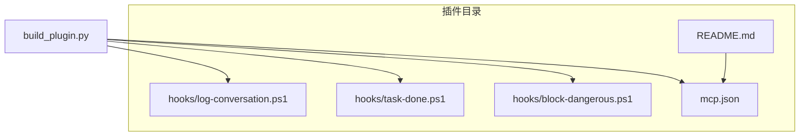
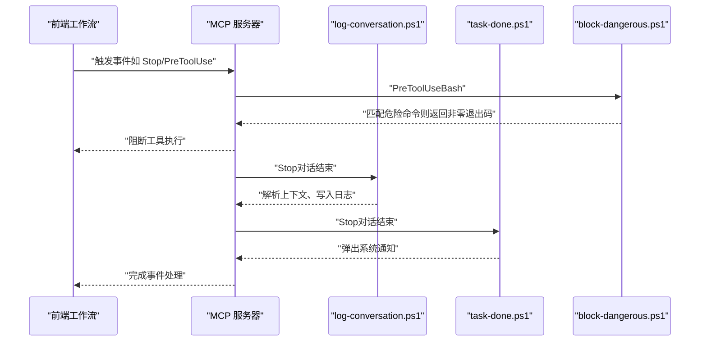
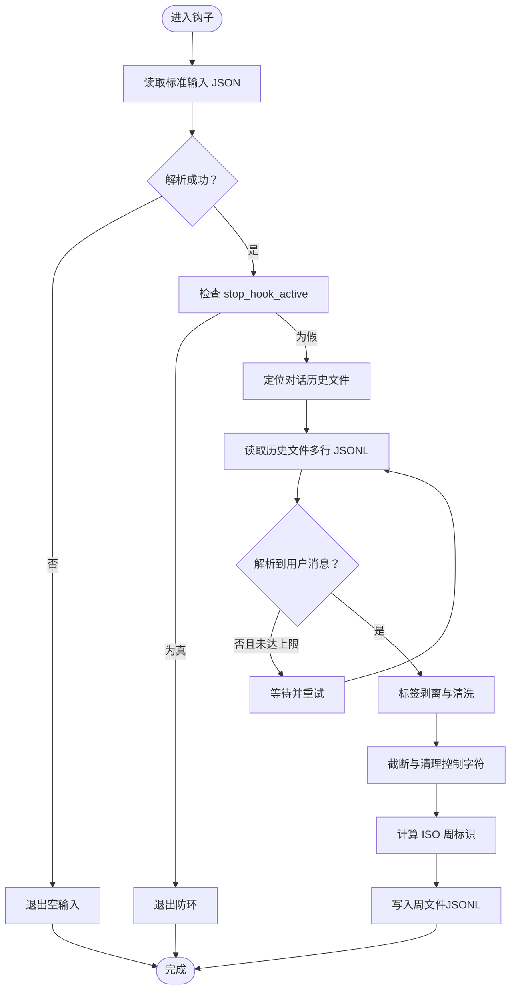
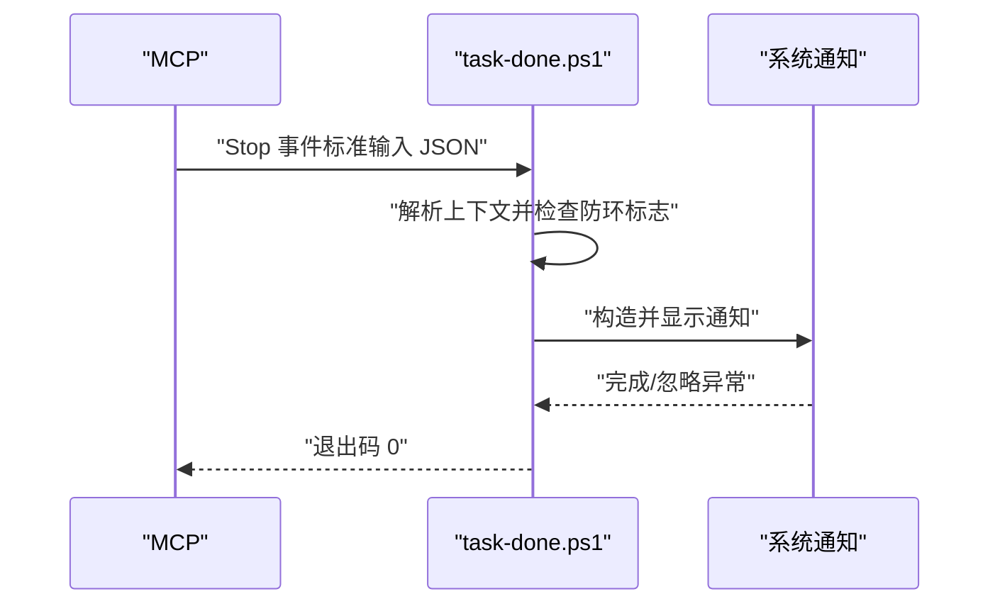
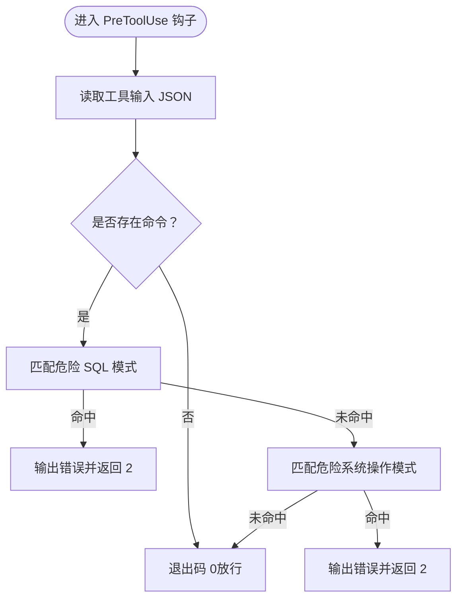
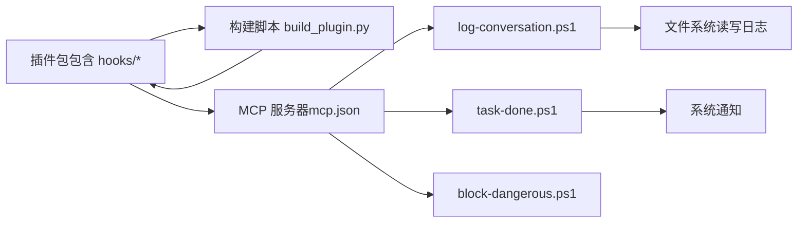

# 钩子系统

<cite>
**本文档引用的文件**
- [plugin/README.md](file://plugin/README.md)
- [plugin/hooks/log-conversation.ps1](file://plugin/hooks/log-conversation.ps1)
- [plugin/hooks/task-done.ps1](file://plugin/hooks/task-done.ps1)
- [plugin/hooks/block-dangerous.ps1](file://plugin/hooks/block-dangerous.ps1)
- [plugin/mcp.json](file://plugin/mcp.json)
- [build_plugin.py](file://build_plugin.py)
- [test/test_hooks.py](file://test/test_hooks.py)
</cite>

## 目录
1. [简介](#简介)
2. [项目结构](#项目结构)
3. [核心组件](#核心组件)
4. [架构总览](#架构总览)
5. [组件详解](#组件详解)
6. [依赖关系分析](#依赖关系分析)
7. [性能考量](#性能考量)
8. [故障排查指南](#故障排查指南)
9. [结论](#结论)
10. [附录](#附录)

## 简介
本文件面向“钩子系统”的技术文档，聚焦于三种关键钩子脚本：对话记录钩子、任务完成钩子、危险操作阻止钩子。内容覆盖功能定位、触发时机、执行机制、注册与集成方式、安全与性能注意事项，以及开发与调试指南。读者可据此理解钩子如何在工作流中被调用、如何解析上下文、如何进行日志落盘与安全拦截，并在此基础上扩展自定义钩子。

## 项目结构
钩子系统位于插件目录下，采用“脚本驱动 + 构建打包”的方式分发与集成：
- 钩子脚本：位于 plugin/hooks/ 下，以 PowerShell 脚本形式提供
- 构建流程：通过构建脚本将钩子复制到插件包并打包为 zip，供外部平台安装
- 运行时集成：通过 MCP 配置启动后端服务，由前端工作流在特定事件节点触发钩子脚本

图表来源
- [plugin/hooks/log-conversation.ps1](file://plugin/hooks/log-conversation.ps1)
- [plugin/hooks/task-done.ps1](file://plugin/hooks/task-done.ps1)
- [plugin/hooks/block-dangerous.ps1](file://plugin/hooks/block-dangerous.ps1)
- [plugin/mcp.json](file://plugin/mcp.json)
- [plugin/README.md](file://plugin/README.md)
- [build_plugin.py](file://build_plugin.py)

章节来源
- [plugin/README.md](file://plugin/README.md)
- [plugin/mcp.json](file://plugin/mcp.json)
- [build_plugin.py](file://build_plugin.py)

## 核心组件
- 对话记录钩子（Stop 事件）
  - 功能：从会话上下文中提取用户最后一条消息，清洗并按周切分写入 JSONL 日志文件
  - 触发时机：工作流在“停止/结束”阶段触发
  - 关键行为：解析标准输入 JSON、查找对话历史、重试读取、标签剥离、长度截断、周标识计算、落盘
- 任务完成钩子（Stop 事件）
  - 功能：在 Agent 完成响应后弹出系统通知
  - 触发时机：同上
  - 关键行为：读取标准输入、检查防环标志、截断提示文本、调用系统通知
- 危险操作阻止钩子（PreToolUse 事件，匹配 Bash）
  - 功能：对工具调用前进行规则拦截，阻断危险命令
  - 触发时机：工具使用前
  - 关键行为：读取工具输入命令、匹配危险模式、输出错误信息并返回非零退出码

章节来源
- [plugin/hooks/log-conversation.ps1](file://plugin/hooks/log-conversation.ps1)
- [plugin/hooks/task-done.ps1](file://plugin/hooks/task-done.ps1)
- [plugin/hooks/block-dangerous.ps1](file://plugin/hooks/block-dangerous.ps1)

## 架构总览
钩子系统与 MCP 服务协同工作：前端工作流在指定事件节点调用后端 MCP 工具，MCP 将事件上下文通过标准输入传递给钩子脚本；钩子脚本根据事件类型与匹配规则执行相应逻辑，必要时阻断后续流程或产生副作用（如写日志、弹窗）。

图表来源
- [plugin/hooks/log-conversation.ps1](file://plugin/hooks/log-conversation.ps1)
- [plugin/hooks/task-done.ps1](file://plugin/hooks/task-done.ps1)
- [plugin/hooks/block-dangerous.ps1](file://plugin/hooks/block-dangerous.ps1)
- [plugin/mcp.json](file://plugin/mcp.json)

## 组件详解

### 对话记录钩子（log-conversation.ps1）
- 事件与匹配
  - 事件：Stop
  - 作用：在对话结束时采集用户最后一条消息并写入日志
- 输入与解析
  - 从标准输入读取完整 JSON 文本，优先使用高性能解析器，失败回退至通用解析
  - 解析后校验上下文对象是否为空、是否处于“停止钩子激活”状态（防环）
- 上下文与会话
  - 读取会话标识与当前工作目录，用于定位本地缓存中的对话历史文件
  - 若未显式提供历史路径，则基于会话前缀与项目名在缓存目录中查找最近匹配项
- 历史解析与重试
  - 逐行读取历史文件，解析每条 JSON 行，筛选用户消息并拼接文本
  - 在竞态条件下最多重试若干次，避免因异步写入导致空结果
- 文本清洗与落盘
  - 支持从包裹标签中抽取用户查询文本，否则剥离全部标签并清理多余空白
  - 截断过长文本、移除控制字符，生成带 ISO 周标识的日志条目并追加写入对应周文件
- 调试与诊断
  - 写入专用诊断文件，记录关键步骤与异常，便于定位问题

图表来源
- [plugin/hooks/log-conversation.ps1](file://plugin/hooks/log-conversation.ps1)

章节来源
- [plugin/hooks/log-conversation.ps1](file://plugin/hooks/log-conversation.ps1)
- [test/test_hooks.py](file://test/test_hooks.py)

### 任务完成钩子（task-done.ps1）
- 事件与匹配
  - 事件：Stop
  - 作用：在 Agent 完成响应后向用户发送系统通知
- 输入与防护
  - 读取标准输入 JSON，检查“停止钩子激活”标志以防止递归触发
- 通知生成
  - 从上下文提取最后一条助手消息作为通知正文，超长截断
  - 使用系统通知组件展示气泡提示，静默处理异常以防阻断事件

图表来源
- [plugin/hooks/task-done.ps1](file://plugin/hooks/task-done.ps1)

章节来源
- [plugin/hooks/task-done.ps1](file://plugin/hooks/task-done.ps1)

### 危险操作阻止钩子（block-dangerous.ps1）
- 事件与匹配
  - 事件：PreToolUse
  - 匹配器：Bash
  - 作用：在工具调用前拦截危险命令，保护系统与数据安全
- 规则匹配
  - 危险 SQL：删除表、清空表等
  - 危险系统操作：容器相关删除、系统清理、强制删除等
- 执行策略
  - 输出错误信息到标准错误
  - 返回非零退出码以阻断工具执行

图表来源
- [plugin/hooks/block-dangerous.ps1](file://plugin/hooks/block-dangerous.ps1)

章节来源
- [plugin/hooks/block-dangerous.ps1](file://plugin/hooks/block-dangerous.ps1)

### 钩子注册与事件监听
- 注册机制
  - 钩子脚本随插件打包分发，构建脚本负责复制钩子文件到插件目录并生成 zip
- 事件监听
  - 通过 MCP 服务器暴露的工具接口在工作流中触发钩子
  - 不同钩子声明了不同的事件与匹配器（如 Stop、PreToolUse/Bash）
- 回调处理
  - 钩子通过标准输入接收上下文，按事件类型执行相应逻辑
  - 钩子可通过返回退出码影响后续流程（如阻止工具执行）

章节来源
- [build_plugin.py](file://build_plugin.py)
- [plugin/mcp.json](file://plugin/mcp.json)
- [plugin/hooks/log-conversation.ps1](file://plugin/hooks/log-conversation.ps1)
- [plugin/hooks/task-done.ps1](file://plugin/hooks/task-done.ps1)
- [plugin/hooks/block-dangerous.ps1](file://plugin/hooks/block-dangerous.ps1)

## 依赖关系分析
- 外部依赖
  - PowerShell 运行时：用于执行钩子脚本
  - 系统通知组件：用于任务完成钩子的桌面通知
  - 文件系统：用于读取对话历史与写入日志
- 内部依赖
  - 构建脚本负责将钩子文件复制到插件包根目录，确保安装后可被平台识别
  - MCP 配置定义了后端服务的启动参数与环境变量，保证钩子在统一运行环境中执行

图表来源
- [build_plugin.py](file://build_plugin.py)
- [plugin/mcp.json](file://plugin/mcp.json)
- [plugin/hooks/log-conversation.ps1](file://plugin/hooks/log-conversation.ps1)
- [plugin/hooks/task-done.ps1](file://plugin/hooks/task-done.ps1)
- [plugin/hooks/block-dangerous.ps1](file://plugin/hooks/block-dangerous.ps1)

章节来源
- [build_plugin.py](file://build_plugin.py)
- [plugin/mcp.json](file://plugin/mcp.json)

## 性能考量
- I/O 开销
  - 对话记录钩子可能需要多次读取历史文件以规避竞态，建议在高并发场景下适当增加重试间隔或减少同时触发数量
- 文本处理
  - 清洗与截断操作为线性复杂度，通常开销较小；注意避免对超长文本重复处理
- 通知开销
  - 任务完成钩子仅在事件发生时触发，系统通知组件开销可控
- 安全拦截
  - 正则匹配为常数时间复杂度，建议保持规则简洁以降低匹配成本

## 故障排查指南
- 无法读取对话历史
  - 检查上下文是否提供了历史文件路径；若未提供，确认会话标识与项目目录是否正确
  - 查看诊断文件中的日志片段，确认是否因文件尚未写入而触发重试
- 通知未显示
  - 确认系统通知权限已开启；检查钩子是否抛出异常（钩子对异常采取静默处理）
- 危险命令未被拦截
  - 检查命令是否符合匹配规则；确认事件类型与匹配器是否为 PreToolUse/Bash
  - 查看标准错误输出是否包含拦截提示
- 构建后钩子未生效
  - 确认构建脚本已将钩子文件复制到插件包；重新打包并安装最新版本

章节来源
- [plugin/hooks/log-conversation.ps1](file://plugin/hooks/log-conversation.ps1)
- [plugin/hooks/task-done.ps1](file://plugin/hooks/task-done.ps1)
- [plugin/hooks/block-dangerous.ps1](file://plugin/hooks/block-dangerous.ps1)
- [build_plugin.py](file://build_plugin.py)

## 结论
钩子系统通过事件驱动的方式在关键节点注入业务逻辑：对话记录钩子保障数据可追溯，任务完成钩子提升交互体验，危险操作阻止钩子强化系统安全。结合 MCP 的统一调度与构建脚本的标准化打包，钩子具备良好的可维护性与可扩展性。建议在生产环境中配合日志监控与规则审计，持续优化匹配规则与性能表现。

## 附录

### 开发指南与最佳实践
- 新增钩子
  - 在 plugin/hooks/ 下新增脚本，遵循标准输入读取与退出码约定
  - 明确事件类型与匹配器，避免不必要的阻断
- 安全设计
  - 对输入进行严格校验与边界处理，防止异常传播影响主流程
  - 危险规则应尽量精确，避免误伤正常命令
- 性能优化
  - 减少磁盘 I/O 次数，合并写入批次
  - 控制重试次数与间隔，避免阻塞事件处理
- 调试技巧
  - 使用诊断文件记录关键路径与异常
  - 编写单元测试模拟脚本行为，验证文本清洗与周标识计算等逻辑

### 配置参考
- MCP 服务器配置
  - 通过 mcp.json 指定后端命令与环境变量，确保数据库连接参数正确
- 插件打包
  - 使用构建脚本复制钩子文件并生成 zip 包，安装后由平台加载

章节来源
- [plugin/mcp.json](file://plugin/mcp.json)
- [build_plugin.py](file://build_plugin.py)
- [plugin/README.md](file://plugin/README.md)