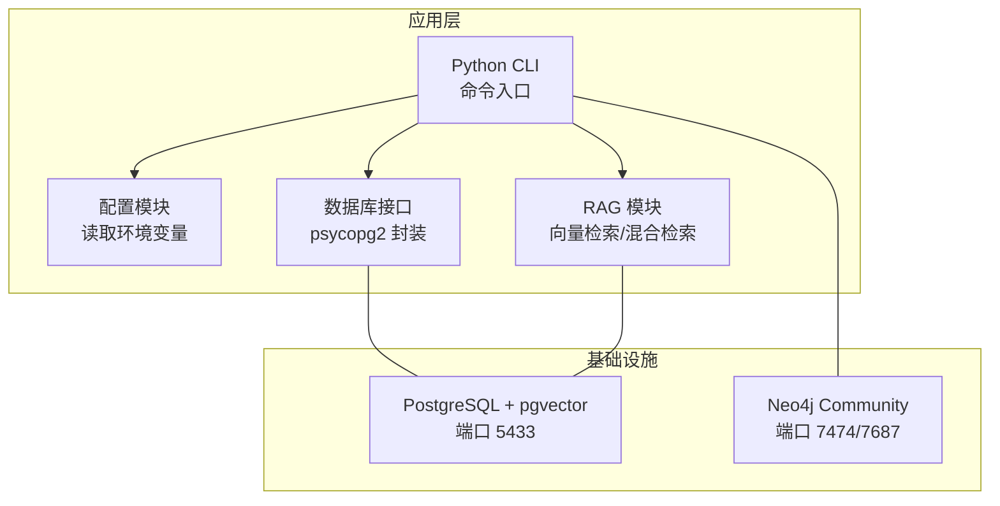
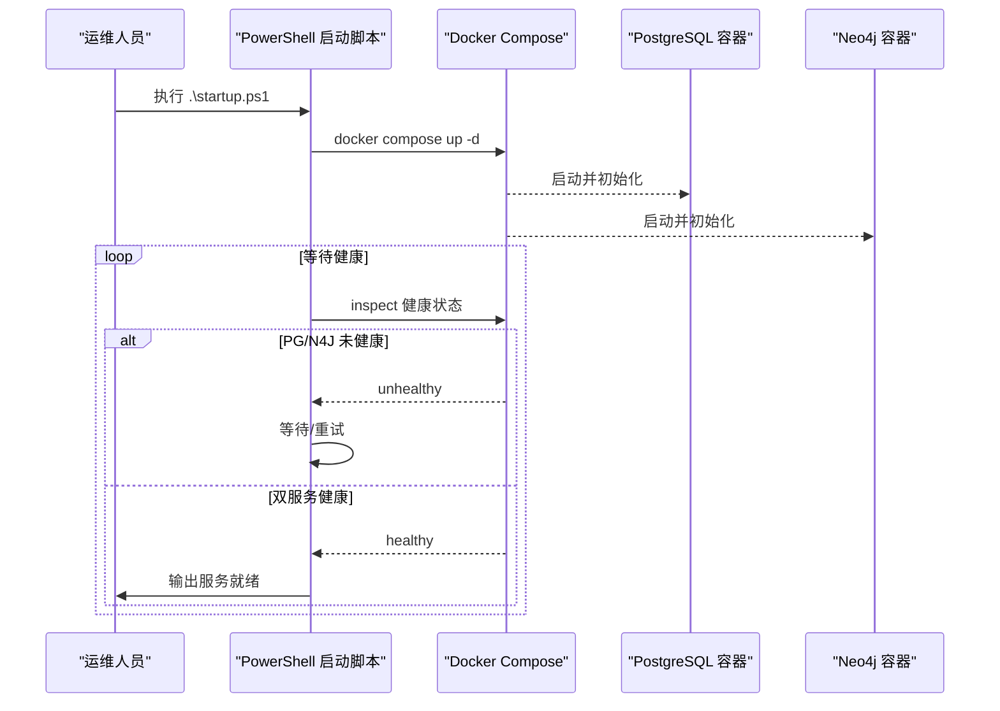
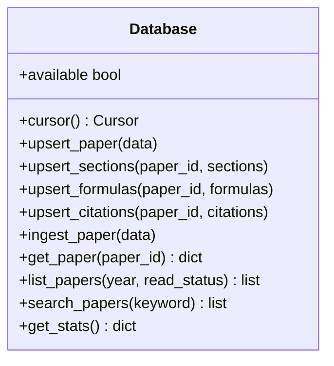
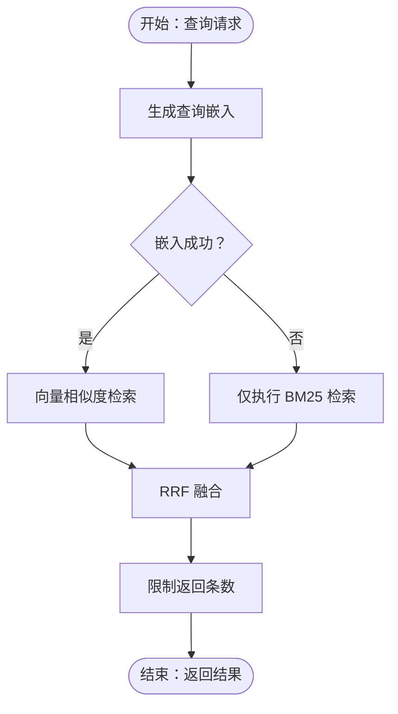
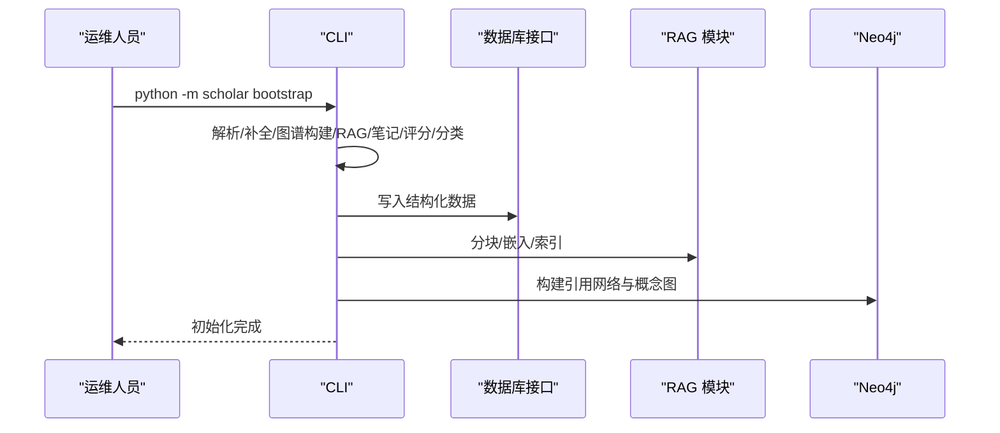
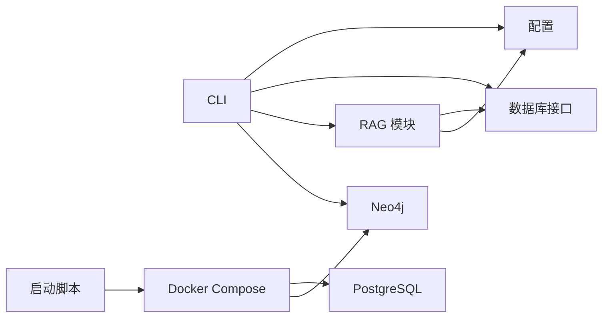

# 故障排除

<cite>
**本文档引用的文件**
- [docker-compose.yml](file://infra/docker-compose.yml)
- [init.sql](file://infra/init.sql)
- [startup.ps1](file://startup.ps1)
- [config.py](file://scholar/config.py)
- [db.py](file://scholar/db.py)
- [rag.py](file://scholar/rag.py)
- [cli.py](file://scholar/cli.py)
- [health.md](file://plugin/commands/health.md)
- [find.md](file://plugin/commands/find.md)
- [stats.md](file://plugin/commands/stats.md)
- [paper.md](file://plugin/commands/paper.md)
</cite>

## 目录
1. [简介](#简介)
2. [项目结构](#项目结构)
3. [核心组件](#核心组件)
4. [架构总览](#架构总览)
5. [详细组件分析](#详细组件分析)
6. [依赖分析](#依赖分析)
7. [性能考虑](#性能考虑)
8. [故障排除指南](#故障排除指南)
9. [结论](#结论)
10. [附录](#附录)

## 简介
本指南面向使用 Scholar Studio 的研究与工程团队，聚焦于系统运行中的常见问题与系统化排障流程。内容覆盖：
- 容器启动失败、数据库连接超时、RAG 搜索无结果、Bootstrap 中断恢复等典型问题
- 日志分析、性能监控、数据库健康检查的方法
- 错误消息含义与对应解决步骤
- 预防性维护（备份、性能优化、容量规划）
- 紧急恢复与数据修复流程
- 社区支持与问题反馈渠道

## 项目结构
Scholar Studio 采用“容器化基础设施 + Python 应用层”的分层架构：
- 基础设施层：通过 Docker Compose 启动 PostgreSQL（含 pgvector 扩展）与 Neo4j，提供结构化数据与图谱能力
- 应用层：Python CLI 与模块负责论文解析、数据库写入、RAG 向量检索、图谱构建与查询
- 配置层：通过环境变量控制数据库、嵌入模型、Neo4j 连接等参数

图表来源
- [docker-compose.yml:1-44](file://infra/docker-compose.yml#L1-L44)
- [config.py:41-57](file://scholar/config.py#L41-L57)
- [db.py:24-74](file://scholar/db.py#L24-L74)
- [rag.py:182-289](file://scholar/rag.py#L182-L289)

章节来源
- [docker-compose.yml:1-44](file://infra/docker-compose.yml#L1-L44)
- [config.py:41-57](file://scholar/config.py#L41-L57)

## 核心组件
- 配置模块：集中管理数据库、Neo4j、嵌入模型等环境变量，并提供 arXiv 请求工具（带重试与代理）
- 数据库接口：封装 psycopg2，提供可用性检测、事务上下文、论文/分节/公式/引用的增删改查
- RAG 模块：分块策略、智谱/OpenAI 嵌入调用、PostgreSQL 存储与 HNSW 索引、BM25 与向量混合检索
- CLI：扫描、解析、搜索、统计、图谱构建、Bootstrap 全流程等命令

章节来源
- [config.py:11-116](file://scholar/config.py#L11-L116)
- [db.py:24-276](file://scholar/db.py#L24-L276)
- [rag.py:25-582](file://scholar/rag.py#L25-L582)
- [cli.py:32-800](file://scholar/cli.py#L32-L800)

## 架构总览
下图展示启动到服务就绪的关键路径与健康检查：

图表来源
- [startup.ps1:11-44](file://startup.ps1#L11-L44)
- [docker-compose.yml:15-19](file://infra/docker-compose.yml#L15-L19)
- [docker-compose.yml:35-39](file://infra/docker-compose.yml#L35-L39)

章节来源
- [startup.ps1:11-58](file://startup.ps1#L11-L58)
- [docker-compose.yml:1-44](file://infra/docker-compose.yml#L1-L44)

## 详细组件分析

### 数据库接口（psycopg2 封装）
- 可用性检测：建立一次性连接以判断数据库可达性
- 事务上下文：自动提交/回滚，确保异常安全
- 论文/分节/公式/引用的 UPSERT 与批量写入
- 文件回退：当数据库不可用时，仍可进行文件级读写

图表来源
- [db.py:24-276](file://scholar/db.py#L24-L276)

章节来源
- [db.py:24-74](file://scholar/db.py#L24-L74)
- [db.py:79-176](file://scholar/db.py#L79-L176)
- [db.py:181-241](file://scholar/db.py#L181-L241)

### RAG 模块（向量检索与混合检索）
- 文本分块：抽象、章节、公式三类内容拆分
- 嵌入生成：支持智谱与 OpenAI，失败时返回空值
- 向量存储：PostgreSQL + pgvector，HNSW 索引加速相似度检索
- 混合检索：向量相似度 + BM25 关键词匹配，RRF 融合排序

图表来源
- [rag.py:252-289](file://scholar/rag.py#L252-L289)
- [rag.py:383-421](file://scholar/rag.py#L383-L421)

章节来源
- [rag.py:25-94](file://scholar/rag.py#L25-L94)
- [rag.py:100-176](file://scholar/rag.py#L100-L176)
- [rag.py:182-289](file://scholar/rag.py#L182-L289)
- [rag.py:295-365](file://scholar/rag.py#L295-L365)
- [rag.py:383-421](file://scholar/rag.py#L383-L421)

### CLI 命令与 Bootstrap 流程
- 健康检查与统计：提供知识库健康状态与覆盖率检查
- 搜索与检索：全文搜索与语义搜索
- Bootstrap：全量初始化流水线，支持断点续传

图表来源
- [cli.py:1153-1182](file://scholar/cli.py#L1153-L1182)
- [cli.py:663-705](file://scholar/cli.py#L663-L705)
- [cli.py:311-370](file://scholar/cli.py#L311-L370)

章节来源
- [cli.py:421-487](file://scholar/cli.py#L421-L487)
- [cli.py:311-370](file://scholar/cli.py#L311-L370)
- [cli.py:663-705](file://scholar/cli.py#L663-L705)
- [cli.py:1153-1182](file://scholar/cli.py#L1153-L1182)

## 依赖分析
- 外部依赖
  - PostgreSQL + pgvector：用于结构化数据与向量检索
  - Neo4j：用于引用网络与概念图谱
  - Python 第三方库：psycopg2、typer、rich、urllib（嵌入调用）、dotenv（环境变量）
- 内部耦合
  - CLI 依赖配置模块与数据库/RAG 模块
  - RAG 模块依赖数据库连接与嵌入提供商
  - 启动脚本依赖 Docker Compose 健康检查

图表来源
- [cli.py:19-30](file://scholar/cli.py#L19-L30)
- [config.py:11-18](file://scholar/config.py#L11-L18)
- [db.py:15-21](file://scholar/db.py#L15-L21)
- [rag.py:182-289](file://scholar/rag.py#L182-L289)
- [startup.ps1:11-44](file://startup.ps1#L11-L44)

章节来源
- [cli.py:19-30](file://scholar/cli.py#L19-L30)
- [config.py:11-18](file://scholar/config.py#L11-L18)
- [startup.ps1:11-44](file://startup.ps1#L11-L44)

## 性能考虑
- PostgreSQL 连接池与超时：建议在生产环境启用连接池与合理超时设置
- RAG 索引规模：HNSW 索引与向量维度直接影响检索性能；建议根据硬件资源调整 M/ef_construction
- 嵌入调用：外部 API 有速率限制，建议批量化与重试策略
- BM25 索引：从数据库加载文档构建轻量索引，适合关键词检索与混合检索

章节来源
- [rag.py:214-237](file://scholar/rag.py#L214-L237)
- [rag.py:427-469](file://scholar/rag.py#L427-L469)

## 故障排除指南

### 一、Docker 容器启动失败
- 现象
  - 容器启动后立即退出或长时间处于 restarting
  - 启动脚本等待超时，提示服务未健康
- 诊断步骤
  - 查看容器日志：docker compose logs pg / neo4j
  - 检查端口占用：确认宿主机 5433、7474、7687 未被占用
  - 检查卷挂载：确认 pgdata/neo4jdata 卷权限与磁盘空间
  - 检查健康检查：容器内健康检查命令是否可执行
- 解决方案
  - 修正镜像版本与环境变量
  - 释放端口冲突，清理旧卷后重建
  - 重启 Docker 服务，重试启动脚本

章节来源
- [startup.ps1:17-44](file://startup.ps1#L17-L44)
- [docker-compose.yml:15-19](file://infra/docker-compose.yml#L15-L19)
- [docker-compose.yml:35-39](file://infra/docker-compose.yml#L35-L39)

### 二、PostgreSQL 连接超时/认证失败
- 现象
  - 数据库接口可用性检测失败
  - CLI 报告数据库不可用（文件模式）
  - RAG/图谱构建报连接错误
- 诊断步骤
  - 检查环境变量：SCHOLAR_PG_HOST/PORT/NAME/USER/PASS 是否正确
  - 使用 psql 直连验证：docker exec -it scholar-pg psql -U scholar -d scholar
  - 查看 init.sql 是否成功执行扩展与表结构
- 解决方案
  - 更新 .env 或环境变量
  - 确认容器内网络可达与防火墙放行
  - 如首次启动，确认 init.sql 已被装载并执行

章节来源
- [config.py:41-46](file://scholar/config.py#L41-L46)
- [db.py:31-44](file://scholar/db.py#L31-L44)
- [init.sql:1-131](file://infra/init.sql#L1-L131)

### 三、RAG 搜索无结果
- 现象
  - 语义检索返回空列表
  - 混合检索仅返回少量或无结果
- 诊断步骤
  - 检查嵌入 API Key 与提供商配置
  - 确认 chunks 表是否存在数据且已创建 HNSW 索引
  - 验证 BM25 索引是否可从数据库加载
- 解决方案
  - 补充 EMBEDDING_API_KEY 并确认提供商可用
  - 手动触发索引创建：调用索引函数或重新执行 RAG 索引流程
  - 清理并重建索引，确保向量维度与模型一致

章节来源
- [config.py:53-57](file://scholar/config.py#L53-L57)
- [rag.py:100-176](file://scholar/rag.py#L100-L176)
- [rag.py:182-237](file://scholar/rag.py#L182-L237)
- [rag.py:311-365](file://scholar/rag.py#L311-L365)

### 四、Bootstrap 中断恢复
- 现象
  - 初始化中途失败，再次运行无法跳过已完成步骤
- 诊断步骤
  - 查看 Bootstrap 流水线各阶段输出
  - 检查已解析论文数量与数据库写入进度
- 解决方案
  - 重新运行 bootstrap 命令，系统会自动跳过已完成步骤
  - 若某阶段失败，单独重试该阶段（如 rag-index、graph-build）

章节来源
- [cli.py:1153-1182](file://scholar/cli.py#L1153-L1182)

### 五、Neo4j 连接问题
- 现象
  - 图谱构建失败，提示 Neo4j 不可用
- 诊断步骤
  - 检查容器健康状态与 bolt 端口
  - 验证凭据与插件（APOC）是否正确安装
- 解决方案
  - 重启 Neo4j 容器，确认插件加载
  - 更新 SCHOLAR_NEO4J_* 环境变量

章节来源
- [docker-compose.yml:21-40](file://infra/docker-compose.yml#L21-L40)
- [config.py:48-51](file://scholar/config.py#L48-L51)
- [cli.py:663-705](file://scholar/cli.py#L663-L705)

### 六、日志分析与性能监控
- 日志位置
  - Docker 容器日志：docker compose logs pg / neo4j
  - 应用侧错误输出：CLI 命令的标准输出与异常栈
- 监控指标
  - 数据库连接数与慢查询
  - RAG 索引大小与检索耗时
  - Neo4j 节点/边数量与查询耗时

章节来源
- [startup.ps1:17-44](file://startup.ps1#L17-L44)
- [cli.py:32-41](file://scholar/cli.py#L32-L41)

### 七、数据库健康检查
- 建议操作
  - 使用 CLI 命令查看知识库统计与覆盖率
  - 对照 init.sql 的表结构核对字段与索引
  - 检查 papers/sections/formulas/citations 数量一致性
- 常见不一致
  - sections/formulas/citations 与 papers 不匹配
  - chunks 为空导致 RAG 无结果

章节来源
- [health.md:1-10](file://plugin/commands/health.md#L1-L10)
- [stats.md:1-7](file://plugin/commands/stats.md#L1-L7)
- [init.sql:9-131](file://infra/init.sql#L9-L131)
- [db.py:223-241](file://scholar/db.py#L223-L241)

### 八、预防性维护
- 定期备份
  - PostgreSQL：逻辑备份（pg_dump）与物理备份（卷快照）
  - Neo4j：数据目录备份
- 性能优化
  - 调整 HNSW 索引参数（M/ef_construction）
  - 批量化嵌入与重试策略
- 容量规划
  - 监控向量维度与索引规模增长趋势
  - 评估 CPU/内存/磁盘 I/O 资源

章节来源
- [rag.py:214-237](file://scholar/rag.py#L214-L237)
- [config.py:68-116](file://scholar/config.py#L68-L116)

### 九、紧急恢复与数据修复
- 数据库恢复
  - 使用备份恢复至最近一次健康状态
  - 重建索引与视图，确保 init.sql 执行
- RAG 修复
  - 删除无效 chunks，重新分块与嵌入
  - 重新创建 HNSW 索引
- 图谱修复
  - 重新构建引用网络与概念图
  - 校验引用键解析与中心性指标

章节来源
- [init.sql:1-131](file://infra/init.sql#L1-L131)
- [rag.py:551-582](file://scholar/rag.py#L551-L582)
- [cli.py:663-705](file://scholar/cli.py#L663-L705)

### 十、社区支持与问题反馈
- 支持渠道
  - 仓库 Issues：提交问题与需求
  - 讨论区：交流使用经验与最佳实践
- 反馈模板
  - 环境信息（操作系统、Docker 版本、Python 版本）
  - 复现步骤与预期/实际结果
  - 相关日志与截图

章节来源
- [README.md:93-151](file://README.md#L93-L151)

## 结论
通过系统化的启动流程、健康检查与 CLI 工具，Scholar Studio 能够在多数场景下实现自愈与可观测。针对容器、数据库、RAG 与图谱四类问题，建议优先检查环境变量、健康状态与索引完整性，并结合预防性维护与紧急恢复流程，保障知识库稳定运行。

## 附录

### A. 常用命令速查
- 启动服务：.\startup.ps1
- 查看统计：python -m scholar stats
- 全文搜索：python -m scholar search "<关键词>"
- 语义搜索：python -m scholar rag-search "<关键词>" --hybrid
- 健康检查：参考健康命令文档
- 详细信息：python -m scholar info <paper_id>

章节来源
- [startup.ps1:47-65](file://startup.ps1#L47-L65)
- [find.md:1-7](file://plugin/commands/find.md#L1-L7)
- [health.md:1-10](file://plugin/commands/health.md#L1-L10)
- [paper.md:1-11](file://plugin/commands/paper.md#L1-L11)