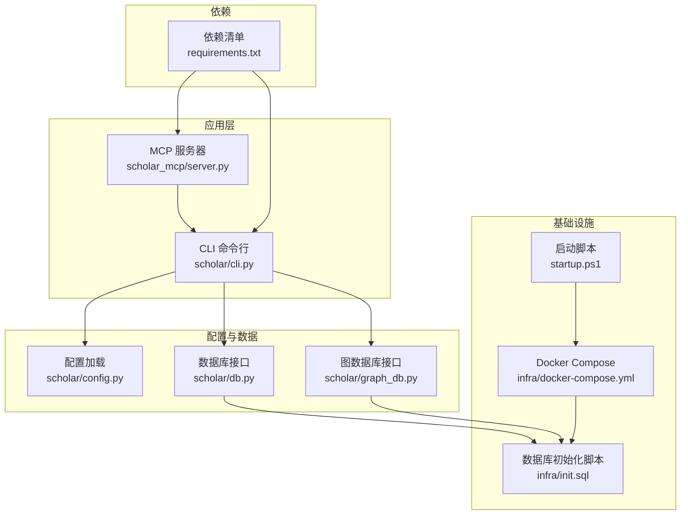
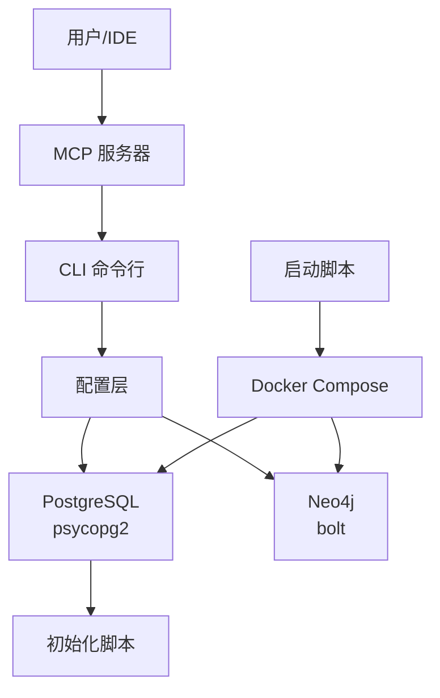
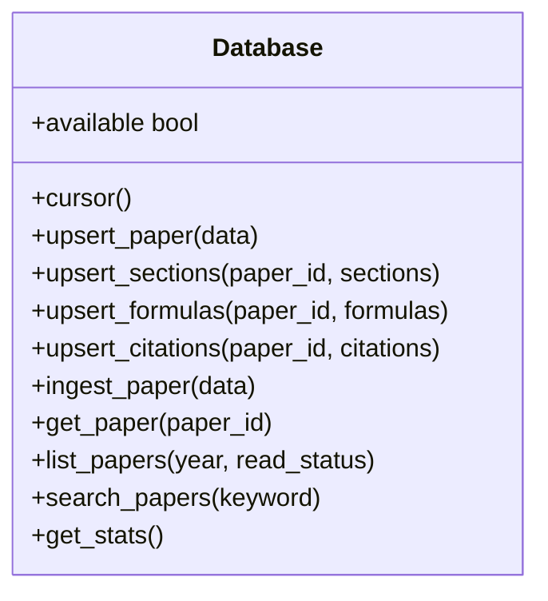
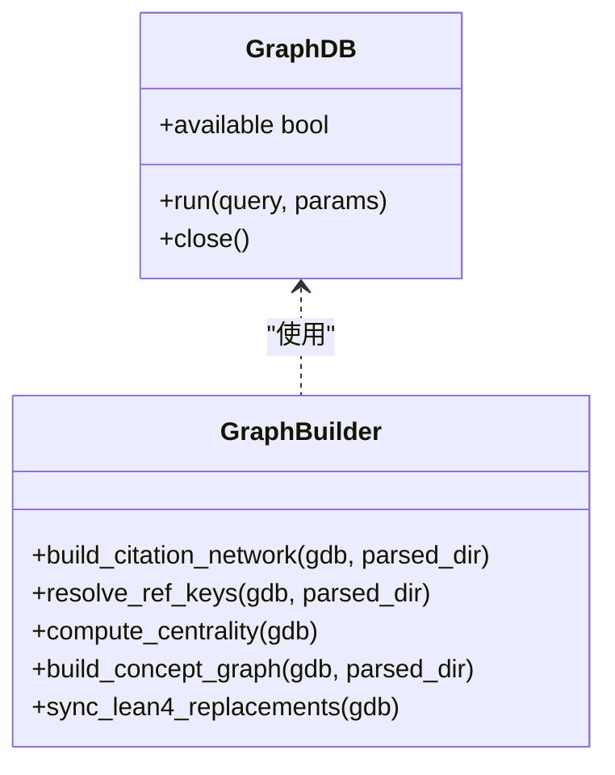
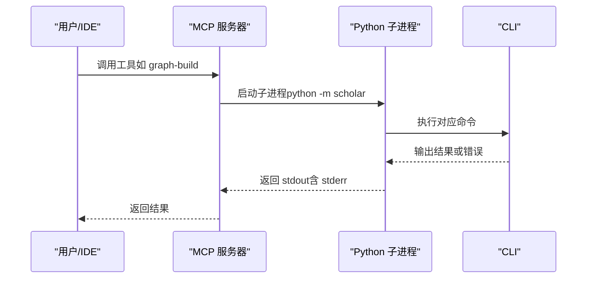
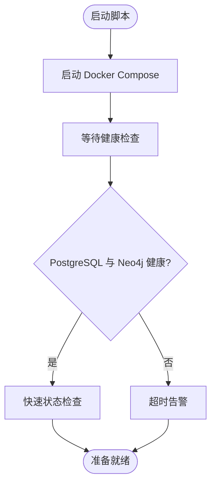
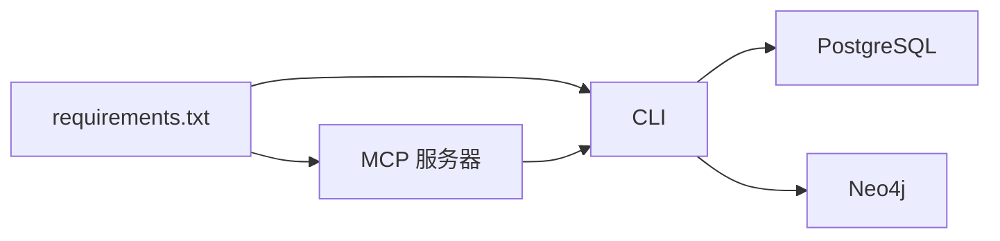

# 故障排除

<cite>
**本文引用的文件**
- [startup.ps1](file://startup.ps1)
- [docker-compose.yml](file://infra/docker-compose.yml)
- [init.sql](file://infra/init.sql)
- [requirements.txt](file://requirements.txt)
- [config.py](file://scholar/config.py)
- [db.py](file://scholar/db.py)
- [cli.py](file://scholar/cli.py)
- [graph_db.py](file://scholar/graph_db.py)
- [server.py](file://scholar_mcp/server.py)
- [__main__.py（scholar）](file://scholar/__main__.py)
- [__main__.py（scholar_mcp）](file://scholar_mcp/__main__.py)
</cite>

## 目录
1. [简介](#简介)
2. [项目结构](#项目结构)
3. [核心组件](#核心组件)
4. [架构总览](#架构总览)
5. [详细组件分析与排错要点](#详细组件分析与排错要点)
6. [依赖关系分析](#依赖关系分析)
7. [性能考虑](#性能考虑)
8. [故障排除指南](#故障排除指南)
9. [结论](#结论)
10. [附录](#附录)

## 简介
本指南面向“Scholar Studio”学术研究与知识图谱系统，提供从安装配置到运行时与性能问题的全链路故障排除方法。内容覆盖：
- 安装配置问题：环境变量缺失、容器健康检查失败、数据库初始化异常
- 运行时错误：CLI 命令执行失败、数据库连接异常、Neo4j 图数据库不可达、RAG 向量索引构建失败
- 性能瓶颈：批量解析耗时、Neo4j 大规模写入、向量检索延迟
- 日志与监控：容器健康状态、数据库与图数据库状态、命令行输出与错误码
- 恢复与回滚：数据库初始化脚本、容器重启策略、配置回退
- 紧急响应：服务超时、依赖服务异常、网络与 API 调用失败

## 项目结构
系统由以下模块组成：
- 入口与命令行：Python CLI（scholar）、MCP 服务器（scholar_mcp）
- 配置层：统一读取环境变量与路径
- 数据层：PostgreSQL（结构化元数据、向量索引）与文件系统（解析产物）
- 图数据库层：Neo4j（引用网络、概念图、创新替换关系）
- 启动与编排：PowerShell 启动脚本与 Docker Compose
- 依赖声明：requirements.txt

图表来源
- [startup.ps1:1-65](file://startup.ps1#L1-L65)
- [docker-compose.yml:1-44](file://infra/docker-compose.yml#L1-L44)
- [init.sql:1-131](file://infra/init.sql#L1-L131)
- [requirements.txt:1-9](file://requirements.txt#L1-L9)
- [config.py:1-62](file://scholar/config.py#L1-L62)
- [db.py:1-270](file://scholar/db.py#L1-L270)
- [graph_db.py:1-922](file://scholar/graph_db.py#L1-L922)
- [cli.py:1-800](file://scholar/cli.py#L1-L800)
- [server.py:1-387](file://scholar_mcp/server.py#L1-L387)

章节来源
- [startup.ps1:1-65](file://startup.ps1#L1-L65)
- [docker-compose.yml:1-44](file://infra/docker-compose.yml#L1-L44)
- [init.sql:1-131](file://infra/init.sql#L1-L131)
- [requirements.txt:1-9](file://requirements.txt#L1-L9)
- [config.py:1-62](file://scholar/config.py#L1-L62)
- [db.py:1-270](file://scholar/db.py#L1-L270)
- [graph_db.py:1-922](file://scholar/graph_db.py#L1-L922)
- [cli.py:1-800](file://scholar/cli.py#L1-L800)
- [server.py:1-387](file://scholar_mcp/server.py#L1-L387)

## 核心组件
- 配置层：集中管理数据库、图数据库、嵌入模型等环境变量，并确保输出目录存在
- 数据层：封装 PostgreSQL 连接与事务，提供 upsert、查询与统计；在不可用时回退至文件模式
- 图数据库层：封装 Neo4j 连接与会话，提供引用网络、概念图、创新替换关系的构建与查询
- CLI：提供扫描、解析、搜索、统计、图谱构建、RAG 等命令；在数据库不可用时自动降级
- MCP 服务器：以子进程方式调用 CLI 工具，暴露为 MCP 工具集
- 启动脚本：拉起容器、等待健康检查、快速状态校验

章节来源
- [config.py:1-62](file://scholar/config.py#L1-L62)
- [db.py:1-270](file://scholar/db.py#L1-L270)
- [graph_db.py:1-922](file://scholar/graph_db.py#L1-L922)
- [cli.py:1-800](file://scholar/cli.py#L1-L800)
- [server.py:1-387](file://scholar_mcp/server.py#L1-L387)
- [startup.ps1:1-65](file://startup.ps1#L1-L65)

## 架构总览
系统通过 Docker Compose 启动 PostgreSQL（含 pgvector 扩展）与 Neo4j，CLI 与 MCP 服务器通过配置层访问数据库与图数据库。启动脚本负责健康检查与状态核对。

图表来源
- [startup.ps1:1-65](file://startup.ps1#L1-L65)
- [docker-compose.yml:1-44](file://infra/docker-compose.yml#L1-L44)
- [init.sql:1-131](file://infra/init.sql#L1-L131)
- [config.py:1-62](file://scholar/config.py#L1-L62)
- [cli.py:1-800](file://scholar/cli.py#L1-L800)
- [server.py:1-387](file://scholar_mcp/server.py#L1-L387)

## 详细组件分析与排错要点

### 组件一：数据库层（PostgreSQL）
职责
- 提供结构化元数据存储、分段文本向量索引
- 在不可用时回退到文件模式（保存/读取 JSON）

常见问题与定位
- 无法连接：检查主机、端口、用户名、密码是否正确；确认容器已就绪并通过健康检查
- 缺少扩展：确认初始化脚本已执行，启用 vector 扩展
- 表结构不匹配：确认 init.sql 已被挂载并执行
- 大批量写入慢：注意批大小与事务提交策略

图表来源
- [db.py:24-235](file://scholar/db.py#L24-L235)

章节来源
- [db.py:1-270](file://scholar/db.py#L1-L270)
- [init.sql:1-131](file://infra/init.sql#L1-L131)
- [docker-compose.yml:1-44](file://infra/docker-compose.yml#L1-L44)

### 组件二：图数据库层（Neo4j）
职责
- 构建引用网络（CITES）、概念图（HAS_CONCEPT/RELATED_TO）、创新替换关系（REPLACES）
- 提供中心性计算、最短路径、桥接论文识别等分析能力

常见问题与定位
- 连接失败：检查 URI、认证信息；确认容器健康
- 查询超时：关注大规模 MERGE/UNWIND 批处理；必要时降低批大小
- 引用解析失败：确认标题归一化与模糊匹配逻辑是否命中

图表来源
- [graph_db.py:32-70](file://scholar/graph_db.py#L32-L70)
- [graph_db.py:225-280](file://scholar/graph_db.py#L225-L280)
- [graph_db.py:85-177](file://scholar/graph_db.py#L85-L177)
- [graph_db.py:180-222](file://scholar/graph_db.py#L180-L222)
- [graph_db.py:636-732](file://scholar/graph_db.py#L636-L732)
- [graph_db.py:794-800](file://scholar/graph_db.py#L794-L800)

章节来源
- [graph_db.py:1-922](file://scholar/graph_db.py#L1-L922)
- [docker-compose.yml:21-39](file://infra/docker-compose.yml#L21-L39)

### 组件三：CLI 与 MCP 服务器
职责
- CLI：提供扫描、解析、搜索、统计、图谱构建、RAG、arXiv 检索、元数据补全等命令
- MCP：以子进程方式调用 CLI，暴露为 MCP 工具集

常见问题与定位
- 子进程超时：MCP 默认超时较长，但个别命令仍需调整
- 权限与路径：确认工作目录与可执行路径
- 错误码与输出：子进程返回非零码时，标准错误会被拼接到输出中

图表来源
- [server.py:23-36](file://scholar_mcp/server.py#L23-L36)
- [server.py:41-132](file://scholar_mcp/server.py#L41-L132)
- [__main__.py（scholar）:1-8](file://scholar/__main__.py#L1-L8)

章节来源
- [server.py:1-387](file://scholar_mcp/server.py#L1-L387)
- [cli.py:1-800](file://scholar/cli.py#L1-L800)
- [__main__.py（scholar_mcp）:1-5](file://scholar_mcp/__main__.py#L1-L5)
- [__main__.py（scholar）:1-8](file://scholar/__main__.py#L1-L8)

### 组件四：启动与编排
职责
- 启动容器、等待健康检查、快速状态核验
- 提供常用命令提示

常见问题与定位
- 容器未健康：查看健康检查配置与日志
- 端口冲突：确认宿主端口映射
- 初始化失败：确认 init.sql 是否被挂载执行

图表来源
- [startup.ps1:11-44](file://startup.ps1#L11-L44)
- [docker-compose.yml:15-39](file://infra/docker-compose.yml#L15-L39)

章节来源
- [startup.ps1:1-65](file://startup.ps1#L1-L65)
- [docker-compose.yml:1-44](file://infra/docker-compose.yml#L1-L44)

## 依赖关系分析
- Python 依赖：typer、rich、psycopg2-binary、neo4j、python-dotenv、PyMuPDF、mcp
- 容器依赖：PostgreSQL（pgvector 扩展）、Neo4j（apoc 插件）
- 环境变量：数据库连接参数、图数据库连接参数、嵌入模型参数、LaTeX 编译命令、Lean4 项目路径

图表来源
- [requirements.txt:1-9](file://requirements.txt#L1-L9)
- [cli.py:1-800](file://scholar/cli.py#L1-L800)
- [server.py:1-387](file://scholar_mcp/server.py#L1-L387)

章节来源
- [requirements.txt:1-9](file://requirements.txt#L1-L9)
- [config.py:1-62](file://scholar/config.py#L1-L62)

## 性能考虑
- 批处理与事务：数据库与图数据库均采用批处理写入，建议根据数据规模调整批大小
- 查询优化：PostgreSQL 使用 ILIKE 与 JOIN，建议在高频字段建立索引
- 图数据库：大量 MERGE/UNWIND 会带来写放大，建议分阶段执行与分批提交
- 向量检索：嵌入维度与索引类型影响检索性能，建议结合业务场景选择合适模型与索引策略

## 故障排除指南

### 一、安装与环境配置
- 症状：启动后服务不可用或健康检查失败
  - 步骤：确认 Docker Compose 已成功拉起容器；查看健康检查配置；检查端口占用
  - 参考：容器健康检查与端口映射
- 症状：数据库表结构缺失或扩展未启用
  - 步骤：确认 init.sql 已挂载并执行；进入容器检查扩展与表是否存在
  - 参考：初始化脚本与容器卷挂载
- 症状：环境变量未生效
  - 步骤：确认 .env 文件存在且路径正确；检查 dotenv 加载逻辑
  - 参考：配置加载与默认值

章节来源
- [startup.ps1:11-44](file://startup.ps1#L11-L44)
- [docker-compose.yml:1-44](file://infra/docker-compose.yml#L1-L44)
- [init.sql:1-131](file://infra/init.sql#L1-L131)
- [config.py:1-62](file://scholar/config.py#L1-L62)

### 二、运行时错误

#### 1. CLI 命令执行失败
- 症状：命令报错或返回非零退出码
  - 步骤：查看标准输出与标准错误；确认依赖可用（如 arXiv API、嵌入服务）
  - 参考：命令实现与错误处理
- 症状：批量解析耗时过长
  - 步骤：分批执行；检查磁盘 I/O 与网络；确认数据库可用性
  - 参考：批量解析流程与进度条

章节来源
- [cli.py:131-168](file://scholar/cli.py#L131-L168)
- [cli.py:173-234](file://scholar/cli.py#L173-L234)

#### 2. 数据库连接失败
- 症状：数据库不可用或连接超时
  - 步骤：检查主机、端口、凭据；确认容器健康；查看连接池与事务处理
  - 参考：数据库可用性检测与连接逻辑
- 症状：文件模式下解析产物丢失
  - 步骤：确认输出目录存在；检查权限；核对保存路径

章节来源
- [db.py:31-44](file://scholar/db.py#L31-L44)
- [db.py:46-60](file://scholar/db.py#L46-L60)
- [config.py:23-37](file://scholar/config.py#L23-L37)

#### 3. Neo4j 图数据库异常
- 症状：图数据库不可达或查询超时
  - 步骤：检查 URI 与认证；确认 apoc 插件可用；分批写入与索引重建
  - 参考：图数据库可用性检测与查询
- 症状：引用解析失败或孤立节点
  - 步骤：检查标题归一化与模糊匹配；清理孤立节点

章节来源
- [graph_db.py:39-49](file://scholar/graph_db.py#L39-L49)
- [graph_db.py:108-177](file://scholar/graph_db.py#L108-L177)
- [docker-compose.yml:21-39](file://infra/docker-compose.yml#L21-L39)

#### 4. RAG 向量检索问题
- 症状：向量索引构建失败或检索缓慢
  - 步骤：检查嵌入 API 密钥与网络；确认向量维度一致；评估索引策略
  - 参考：嵌入模型与向量表结构

章节来源
- [config.py:51-55](file://scholar/config.py#L51-L55)
- [init.sql:96-104](file://infra/init.sql#L96-L104)

### 三、性能瓶颈
- 症状：批量导入耗时长
  - 步骤：拆分批次；关闭不必要的索引；使用事务合并
- 症状：图数据库写入压力大
  - 步骤：降低批大小；分阶段导入；预估内存与 CPU 资源
- 症状：搜索响应慢
  - 步骤：建立索引；优化查询语句；缓存热点数据

### 四、日志分析与监控
- 容器健康：使用启动脚本中的健康检查状态判断服务可用性
- 数据库：通过 SQL 快速统计表记录数与索引状态
- 图数据库：Cypher 查询统计节点与边数量
- CLI/MCP：关注标准输出与错误码；必要时增加日志级别

章节来源
- [startup.ps1:17-50](file://startup.ps1#L17-L50)
- [graph_db.py:731-763](file://scholar/graph_db.py#L731-L763)

### 五、系统恢复与回滚
- 数据库恢复：重新执行 init.sql；重建索引；核对扩展启用状态
- 容器回滚：停止并删除旧容器，重新拉起；保留数据卷
- 配置回滚：恢复 .env 或使用默认值；核对路径与权限
- MCP 与 CLI：重装依赖；核对 Python 版本与虚拟环境

章节来源
- [init.sql:1-131](file://infra/init.sql#L1-L131)
- [startup.ps1:11-15](file://startup.ps1#L11-L15)
- [requirements.txt:1-9](file://requirements.txt#L1-L9)

### 六、网络与外部服务异常
- 症状：arXiv 搜索失败或超时
  - 步骤：检查网络连通性；增加超时；重试机制
- 症状：嵌入服务不可用
  - 步骤：检查 API 密钥与配额；切换备用服务；降级为本地模型

章节来源
- [cli.py:608-667](file://scholar/cli.py#L608-L667)
- [config.py:51-55](file://scholar/config.py#L51-L55)

### 七、紧急响应流程
- 第一步：确认服务健康状态（容器健康、数据库与图数据库可用）
- 第二步：查看最近错误日志与命令输出
- 第三步：回滚到上一个稳定版本（容器镜像或配置）
- 第四步：临时降级功能（禁用图谱或 RAG），保证核心能力可用
- 第五步：发布修复补丁并回归测试

## 结论
本指南提供了从安装、运行到性能与故障处理的完整路径。建议在日常运维中：
- 建立健康检查与自动化监控
- 对大规模写入与查询进行容量规划
- 保持配置与依赖清单的版本化管理
- 制定应急预案与回滚策略

## 附录

### A. 常见命令与状态核验
- 启动：使用启动脚本一键拉起并等待健康
- 快速统计：查看 papers/chunks 数量与节点总数
- 常用 CLI：stats、search、rag-search、graph-build

章节来源
- [startup.ps1:46-64](file://startup.ps1#L46-L64)
- [cli.py:416-482](file://scholar/cli.py#L416-L482)

### B. 关键配置项速查
- 数据库：主机、端口、库名、用户、密码
- 图数据库：URI、用户、密码
- 嵌入模型：提供商、模型名、维度、API Key
- LaTeX 编译：命令
- Lean4 项目：路径

章节来源
- [config.py:39-62](file://scholar/config.py#L39-L62)