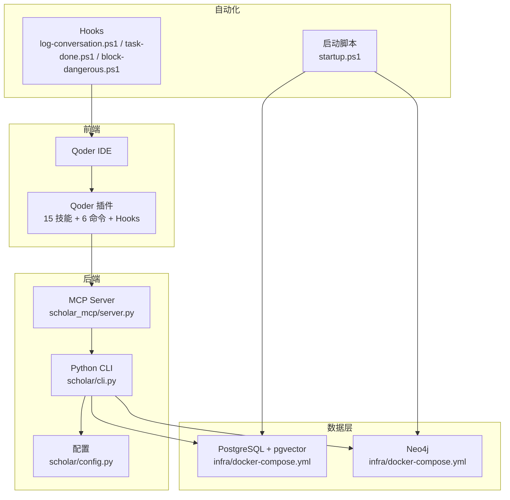
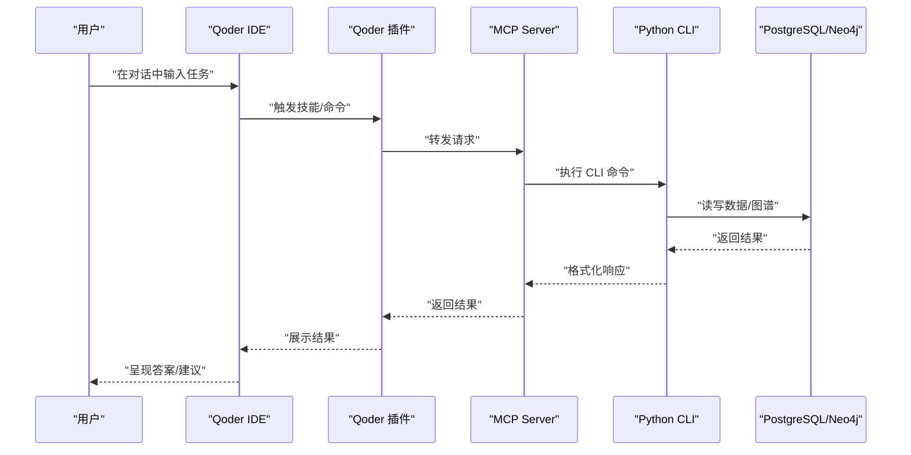
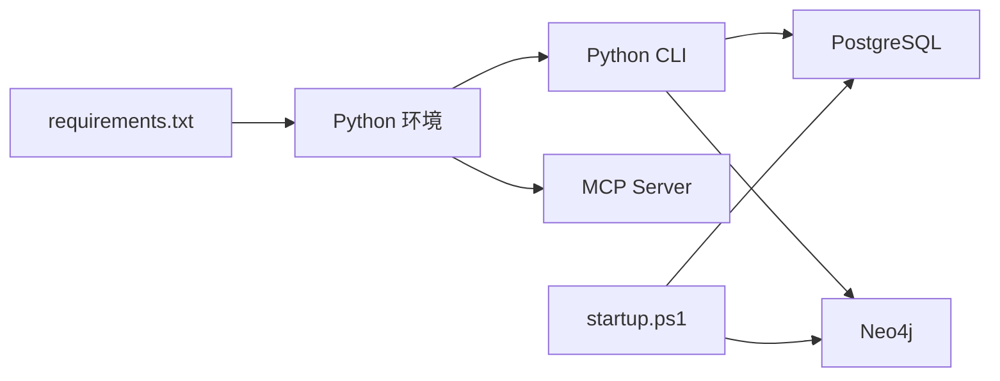

# 故障排除与常见问题

<cite>
**本文引用的文件**
- [README.md](file://README.md)
- [requirements.txt](file://requirements.txt)
- [startup.ps1](file://startup.ps1)
- [plugin/README.md](file://plugin/README.md)
- [scholar/__main__.py](file://scholar/__main__.py)
- [scholar/cli.py](file://scholar/cli.py)
- [scholar/config.py](file://scholar/config.py)
- [scholar/db.py](file://scholar/db.py)
- [scholar/graph_db.py](file://scholar/graph_db.py)
- [infra/docker-compose.yml](file://infra/docker-compose.yml)
- [plugin/hooks/log-conversation.ps1](file://plugin/hooks/log-conversation.ps1)
- [plugin/hooks/task-done.ps1](file://plugin/hooks/task-done.ps1)
- [plugin/hooks/block-dangerous.ps1](file://plugin/hooks/block-dangerous.ps1)
- [test/conftest.py](file://test/conftest.py)
- [build_plugin.py](file://build_plugin.py)
</cite>

## 目录
1. [简介](#简介)
2. [项目结构](#项目结构)
3. [核心组件](#核心组件)
4. [架构总览](#架构总览)
5. [详细组件分析](#详细组件分析)
6. [依赖分析](#依赖分析)
7. [性能考虑](#性能考虑)
8. [故障排除指南](#故障排除指南)
9. [结论](#结论)
10. [附录](#附录)

## 简介
本文件面向使用者与维护者，提供系统化的故障排除与常见问题解决方案，覆盖安装与配置诊断、性能优化、监控与日志分析、调试工具使用、问题排查流程、紧急预案、升级迁移以及社区支持与贡献机制。内容基于仓库中的安装脚本、CLI、数据库与图数据库层、容器编排、Hook 脚本与测试框架等实际实现进行归纳总结。

## 项目结构
项目采用“Python 后端 + Docker 容器 + Qoder 插件/集成”的分层架构：
- 后端服务：Python CLI 与 MCP Server，负责论文解析、数据库写入、图谱构建、RAG 索引与查询、研究循环等。
- 数据层：PostgreSQL + pgvector（结构化数据与向量检索）、Neo4j（概念图谱与引用网络）。
- 运行时：Docker Compose 编排数据库容器；PowerShell 启动脚本负责预检与健康检查。
- 前端与自动化：Qoder IDE 集成、规则与技能、Hook 脚本（对话日志采集、任务完成通知、危险命令拦截）。

**图表来源**
- [startup.ps1:1-125](file://startup.ps1#L1-L125)
- [infra/docker-compose.yml:1-44](file://infra/docker-compose.yml#L1-L44)
- [scholar/cli.py:1-800](file://scholar/cli.py#L1-L800)
- [scholar/config.py:1-119](file://scholar/config.py#L1-L119)
- [plugin/hooks/log-conversation.ps1:1-190](file://plugin/hooks/log-conversation.ps1#L1-L190)
- [plugin/hooks/task-done.ps1:1-33](file://plugin/hooks/task-done.ps1#L1-L33)
- [plugin/hooks/block-dangerous.ps1:1-24](file://plugin/hooks/block-dangerous.ps1#L1-L24)

**章节来源**
- [README.md:365-404](file://README.md#L365-L404)
- [startup.ps1:1-125](file://startup.ps1#L1-L125)
- [infra/docker-compose.yml:1-44](file://infra/docker-compose.yml#L1-L44)

## 核心组件
- 启动与健康检查：PowerShell 启动脚本负责 Docker 预检、容器启动、健康检查与快速状态统计。
- 配置与环境变量：统一从 .env 加载，支持数据库、图数据库、嵌入 API、LaTeX 编译与 Lean4 路径等。
- 数据库层：PostgreSQL 封装（psycopg2），提供文件回退模式；提供论文、章节、公式、引用的增删改查与统计。
- 图数据库层：Neo4j 封装（neo4j），提供引用网络、概念图谱与 Lean4 REPLACES 同步。
- CLI 命令：论文扫描/解析/搜索/统计、图谱构建/查询、arXiv 搜索、Bootstrap 全量初始化、研究循环与 KB 更新等。
- Hooks：对话日志采集（按 ISO 周归档）、任务完成通知、危险命令拦截（PreToolUse）。
- 插件构建：将 .qoder 下的技能、命令、规则、Hook 复制打包为 Qoder 插件分发包。

**章节来源**
- [startup.ps1:1-125](file://startup.ps1#L1-L125)
- [scholar/config.py:1-119](file://scholar/config.py#L1-L119)
- [scholar/db.py:1-276](file://scholar/db.py#L1-L276)
- [scholar/graph_db.py:1-800](file://scholar/graph_db.py#L1-L800)
- [scholar/cli.py:1-800](file://scholar/cli.py#L1-L800)
- [plugin/hooks/log-conversation.ps1:1-190](file://plugin/hooks/log-conversation.ps1#L1-L190)
- [plugin/hooks/task-done.ps1:1-33](file://plugin/hooks/task-done.ps1#L1-L33)
- [plugin/hooks/block-dangerous.ps1:1-24](file://plugin/hooks/block-dangerous.ps1#L1-L24)
- [build_plugin.py:1-180](file://build_plugin.py#L1-L180)

## 架构总览
系统通过启动脚本拉起数据库容器，CLI 作为统一入口协调解析、入库、图谱与 RAG 索引；Qoder 通过 MCP Server 与插件桥接，实现自然语言交互与自动化工作流。

**图表来源**
- [plugin/README.md:1-79](file://plugin/README.md#L1-L79)
- [scholar/__main__.py:1-8](file://scholar/__main__.py#L1-L8)
- [scholar/cli.py:1-800](file://scholar/cli.py#L1-L800)
- [infra/docker-compose.yml:1-44](file://infra/docker-compose.yml#L1-L44)

## 详细组件分析

### 启动脚本与健康检查（startup.ps1）
- 功能要点
  - Docker 预检：检查 docker info、Python 版本、.env 文件是否存在与拷贝示例。
  - 启动容器：docker compose up -d，等待 PostgreSQL 与 Neo4j 健康检查通过。
  - 快速状态：查询 papers/chunks 节点数量与 Neo4j 节点数，提示下一步命令。
- 常见问题
  - Docker 未安装或未运行：脚本直接报错退出。
  - 端口占用：PostgreSQL 默认映射至 5433，若宿主占用需调整 docker-compose.yml。
  - 依赖缺失：未安装依赖时提示 pip install -r requirements.txt。
- 诊断步骤
  - 执行 docker info 检查服务状态。
  - netstat 检查 5433/7474/7687 端口占用情况。
  - 查看容器健康状态：docker compose ps。

**章节来源**
- [startup.ps1:1-125](file://startup.ps1#L1-L125)
- [infra/docker-compose.yml:1-44](file://infra/docker-compose.yml#L1-L44)
- [README.md:590-652](file://README.md#L590-L652)

### 配置与环境变量（scholar/config.py）
- 功能要点
  - 从 .env 加载环境变量，支持数据库、图数据库、嵌入 API、LaTeX 编译与 Lean4 路径。
  - 提供 arXiv API 请求工具（重试、超时、代理支持）。
- 常见问题
  - .env 缺失或字段为空：导致数据库连接失败或 RAG 无 API Key。
  - 端口与凭据：PostgreSQL 默认 5433，Neo4j bolt 默认 7687。
- 诊断步骤
  - 确认 .env 中 SCHOLAR_EMBEDDING_API_KEY、数据库凭据。
  - 检查 SCHOLAR_PG_PORT/SCHOLAR_NEO4J_URI 是否与 docker-compose.yml 一致。

**章节来源**
- [scholar/config.py:1-119](file://scholar/config.py#L1-L119)
- [README.md:53-66](file://README.md#L53-L66)

### 数据库层（scholar/db.py）
- 功能要点
  - 封装 PostgreSQL（psycopg2），提供 upsert_paper/sections/formulas/citations 与查询接口。
  - 当 psycopg2 缺失时，回退为文件模式（保存/读取 parsed JSON）。
- 常见问题
  - 依赖缺失：psycopg2 未安装时，数据库功能降级。
  - 连接异常：主机/端口/凭据错误导致连接失败。
- 诊断步骤
  - 检查 Database.available 与连接参数。
  - 使用 CLI stats 验证数据库连通性与数据规模。

**章节来源**
- [scholar/db.py:1-276](file://scholar/db.py#L1-L276)
- [scholar/cli.py:420-477](file://scholar/cli.py#L420-L477)

### 图数据库层（scholar/graph_db.py）
- 功能要点
  - 封装 Neo4j，提供引用网络构建、概念图谱构建、中心性计算与 REPLACES 同步。
  - 支持解析 ref_key 为 ULID、TF-IDF 概念匹配、共现边构建。
- 常见问题
  - Neo4j 未运行或驱动缺失：GraphDB.available 为 False。
  - 引用解析失败：ref_key 无法匹配到 ULID，导致孤立节点。
- 诊断步骤
  - 使用 CLI graph-stats 查看节点/边统计与孤立节点数。
  - 检查 Neo4j 控制台或 cypher 查询验证引用与概念图谱。

**章节来源**
- [scholar/graph_db.py:1-800](file://scholar/graph_db.py#L1-L800)
- [scholar/cli.py:660-791](file://scholar/cli.py#L660-L791)

### CLI 命令与 Bootstrap（scholar/cli.py）
- 功能要点
  - 论文扫描/解析/搜索/统计、arXiv 搜索、图谱构建/查询、RAG 搜索、Bootstrap 全量初始化。
  - Bootstrap 断点续传：重复执行会跳过已完成步骤。
- 常见问题
  - parse-all 失败：单篇 TeX 解析异常或依赖缺失。
  - graph-build 失败：Neo4j 未运行或驱动缺失。
  - rag-index 失败：API Key 缺失或网络受限。
- 诊断步骤
  - 使用 python -m scholar stats 验证知识库状态。
  - 分步执行：parse-all → graph-build → rag-index，逐段定位问题。

**章节来源**
- [scholar/cli.py:1-800](file://scholar/cli.py#L1-L800)
- [README.md:590-652](file://README.md#L590-L652)

### Hooks（对话日志、任务通知、危险命令拦截）
- 功能要点
  - log-conversation.ps1：采集用户最后一条消息，按 ISO 周写入 week-YYYY-Www.jsonl。
  - task-done.ps1：任务完成后弹出 Windows 桌面通知。
  - block-dangerous.ps1：PreToolUse 拦截 DROP/TRUNCATE/Docker rm 等危险命令。
- 常见问题
  - 日志未写入：stdin 为空、JSON 解析失败、transcript 未找到。
  - 通知不显示：Windows Forms 初始化失败。
  - 拦截误报：正则匹配过于宽泛。
- 诊断步骤
  - 检查 output/logs 下 week-*.jsonl 是否生成。
  - 查看 hook-diag.log 诊断信息。
  - 调整正则表达式或临时禁用拦截（开发场景）。

**章节来源**
- [plugin/hooks/log-conversation.ps1:1-190](file://plugin/hooks/log-conversation.ps1#L1-L190)
- [plugin/hooks/task-done.ps1:1-33](file://plugin/hooks/task-done.ps1#L1-L33)
- [plugin/hooks/block-dangerous.ps1:1-24](file://plugin/hooks/block-dangerous.ps1#L1-L24)

### 插件构建（build_plugin.py）
- 功能要点
  - 复制 .qoder/skills/commands/rules/hooks 至 plugin/，打包为 .zip。
- 常见问题
  - 目标目录存在旧文件：clean() 会删除旧构建产物。
  - ZIP 根目录结构：需保持顶层文件，避免嵌套。
- 诊断步骤
  - 确认 plugin/.qoder-plugin/plugin.json 版本号正确。
  - 检查最终 zip 内容结构与文件计数。

**章节来源**
- [build_plugin.py:1-180](file://build_plugin.py#L1-L180)

## 依赖分析
- Python 依赖：typer、rich、psycopg2-binary、neo4j、python-dotenv、PyMuPDF、mcp。
- 容器依赖：PostgreSQL + pgvector、Neo4j。
- 环境变量：数据库、图数据库、嵌入 API、代理与超时设置。

**图表来源**
- [requirements.txt:1-14](file://requirements.txt#L1-L14)
- [startup.ps1:1-125](file://startup.ps1#L1-L125)
- [infra/docker-compose.yml:1-44](file://infra/docker-compose.yml#L1-L44)

**章节来源**
- [requirements.txt:1-14](file://requirements.txt#L1-L14)
- [README.md:42-52](file://README.md#L42-L52)

## 性能考虑
- 解析与入库
  - parse-all 采用进度条与批量写入，建议分批限制（limit）与并发控制。
  - graph-build 与 rag-index 为 CPU/IO 密集，建议在空闲时段执行。
- 数据库与图数据库
  - PostgreSQL 使用连接池与事务提交/回滚，避免长事务锁表。
  - Neo4j 批量写入使用 UNWIND 与 MERGE，减少往返次数。
- RAG 索引
  - API Key 与网络稳定性影响索引耗时，建议配置代理与重试策略。
- 监控指标建议
  - 容器资源：CPU/内存/磁盘 IO（docker stats）。
  - 数据库：连接数、查询延迟、慢查询日志。
  - 图数据库：节点/边增长趋势、查询耗时、索引命中率。

[本节为通用指导，无需特定文件引用]

## 故障排除指南

### 安装与环境问题
- Docker 未安装/未运行
  - 现象：startup.ps1 报错退出。
  - 处理：安装 Docker Desktop，执行 docker info 验证。
  - 参考：[startup.ps1:14-24](file://startup.ps1#L14-L24)
- 端口冲突
  - 现象：容器启动后健康检查失败。
  - 处理：netstat 检查 5433/7474/7687，必要时修改 docker-compose.yml。
  - 参考：[README.md:598-603](file://README.md#L598-L603)
- 依赖缺失
  - 现象：脚本提示依赖缺失或模块导入失败。
  - 处理：pip install -r requirements.txt。
  - 参考：[startup.ps1:49-56](file://startup.ps1#L49-L56)，[requirements.txt:1-14](file://requirements.txt#L1-L14)

**章节来源**
- [startup.ps1:14-56](file://startup.ps1#L14-L56)
- [requirements.txt:1-14](file://requirements.txt#L1-L14)
- [README.md:598-603](file://README.md#L598-L603)

### 数据库连接问题
- PostgreSQL 连接超时
  - 现象：CLI 无法连接数据库或 stats 报错。
  - 处理：确认 SCHOLAR_PG_PORT=5433，docker-compose 映射正确。
  - 参考：[README.md:607-611](file://README.md#L607-L611)，[scholar/config.py:44-49](file://scholar/config.py#L44-L49)
- Neo4j 未运行
  - 现象：graph-build 报错或 GraphDB.available 为 False。
  - 处理：确认 Neo4j 容器健康，检查 bolt 端口映射。
  - 参考：[scholar/graph_db.py:32-49](file://scholar/graph_db.py#L32-L49)，[infra/docker-compose.yml:21-39](file://infra/docker-compose.yml#L21-L39)

**章节来源**
- [README.md:607-611](file://README.md#L607-L611)
- [scholar/config.py:44-49](file://scholar/config.py#L44-L49)
- [scholar/graph_db.py:32-49](file://scholar/graph_db.py#L32-L49)
- [infra/docker-compose.yml:21-39](file://infra/docker-compose.yml#L21-L39)

### RAG 与嵌入问题
- 无 API Key 或索引未建立
  - 现象：rag-search 无结果或回退到全文搜索。
  - 处理：设置 SCHOLAR_EMBEDDING_API_KEY，执行 rag-index。
  - 参考：[README.md:613-617](file://README.md#L613-L617)，[scholar/config.py:56-60](file://scholar/config.py#L56-L60)

**章节来源**
- [README.md:613-617](file://README.md#L613-L617)
- [scholar/config.py:56-60](file://scholar/config.py#L56-L60)

### Bootstrap 中断与断点续传
- 现象：中途失败后再次执行。
- 处理：直接重复执行 bootstrap；如需重跑某步，先 TRUNCATE chunks 表再执行 rag-index。
- 参考：[README.md:619-627](file://README.md#L619-L627)

**章节来源**
- [README.md:619-627](file://README.md#L619-L627)

### Windows 与 VMware 冲突
- 现象：WSL2 后端冲突导致 Docker Desktop 无法启动。
- 处理：wsl --list --verbose 检查，必要时 wsl --shutdown 后重启 Docker Desktop。
- 参考：[README.md:629-640](file://README.md#L629-L640)

**章节来源**
- [README.md:629-640](file://README.md#L629-L640)

### 测试失败
- 现象：pytest 报告部分测试跳过或失败。
- 处理：确保依赖完整；如数据库未运行，仅运行不依赖数据库的测试。
- 参考：[README.md:642-651](file://README.md#L642-L651)

**章节来源**
- [README.md:642-651](file://README.md#L642-L651)

### 日志与监控
- 对话日志采集
  - 现象：output/logs 下未生成 week-*.jsonl。
  - 处理：检查 stdin、JSON 解析、transcript 路径与重试逻辑；查看 hook-diag.log。
  - 参考：[plugin/hooks/log-conversation.ps1:17-189](file://plugin/hooks/log-conversation.ps1#L17-L189)
- 任务完成通知
  - 现象：桌面通知未弹出。
  - 处理：确认 Windows Forms 可用，消息长度截断。
  - 参考：[plugin/hooks/task-done.ps1:18-30](file://plugin/hooks/task-done.ps1#L18-L30)
- 危险命令拦截
  - 现象：合法命令被拦截。
  - 处理：调整正则表达式或临时禁用拦截（开发场景）。
  - 参考：[plugin/hooks/block-dangerous.ps1:11-21](file://plugin/hooks/block-dangerous.ps1#L11-L21)

**章节来源**
- [plugin/hooks/log-conversation.ps1:17-189](file://plugin/hooks/log-conversation.ps1#L17-L189)
- [plugin/hooks/task-done.ps1:18-30](file://plugin/hooks/task-done.ps1#L18-L30)
- [plugin/hooks/block-dangerous.ps1:11-21](file://plugin/hooks/block-dangerous.ps1#L11-L21)

### 紧急处理预案
- 快速恢复
  - 重启数据库容器：docker compose down/up。
  - 清理并重建索引：TRUNCATE chunks 表后重新 rag-index。
  - 回退到文件模式：移除 psycopg2，确保 parsed JSON 可用。
- 数据一致性
  - 使用 CLI stats 与 graph-stats 核对规模与异常。
  - 对照 parsed JSON 与数据库差异，必要时重新 ingest。

**章节来源**
- [startup.ps1:58-91](file://startup.ps1#L58-L91)
- [README.md:619-627](file://README.md#L619-L627)
- [scholar/cli.py:420-477](file://scholar/cli.py#L420-L477)

### 升级与迁移指南
- 升级步骤
  - 备份：导出 BibTeX、备份 parsed JSON 与数据库快照。
  - 更新：git pull，pip install -r requirements.txt。
  - 重启：./startup.ps1，python -m scholar bootstrap。
- 迁移
  - 从旧版本迁移：保留 data/papers/ 与 output/，重新执行 parse-all 与 graph-build。
  - 插件版本：更新 plugin/.qoder-plugin/plugin.json 中的版本号并重新打包。

**章节来源**
- [README.md:501-523](file://README.md#L501-L523)
- [build_plugin.py:101-129](file://build_plugin.py#L101-L129)

### 社区支持与贡献
- 反馈渠道
  - Issues：在仓库提交问题与建议。
  - Pull Request：遵循测试规范与代码风格。
- 贡献流程
  - Fork 仓库，创建分支，编写测试，运行 pytest，提交 PR。
  - 参考测试夹具与样例数据，确保覆盖路径正确。

**章节来源**
- [test/conftest.py:1-140](file://test/conftest.py#L1-L140)
- [README.md:444-469](file://README.md#L444-L469)

## 结论
本指南基于仓库实际实现，提供了从安装、配置、运行到故障排除与运维的完整路径。建议在生产环境中结合容器监控、数据库慢查询日志与图数据库性能分析，持续优化解析与检索性能，并通过插件化扩展与自动化 Hooks 提升研究闭环效率。

[本节为总结性内容，无需特定文件引用]

## 附录

### 常用命令速查
- 启动数据库：./startup.ps1
- 初始化：python -m scholar bootstrap
- 统计：python -m scholar stats
- 搜索：python -m scholar search "关键词"
- 图谱：python -m scholar graph-stats / graph-query
- RAG：python -m scholar rag-search "query"
- arXiv：python -m scholar arxiv-search "query"
- 研究循环：python -m scholar research-sync

**章节来源**
- [README.md:317-361](file://README.md#L317-L361)